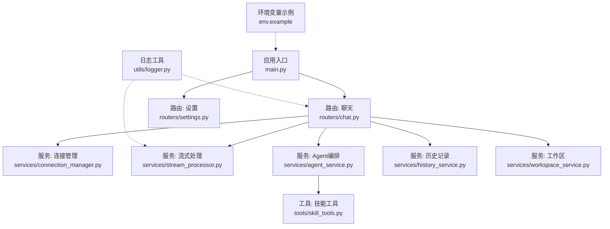
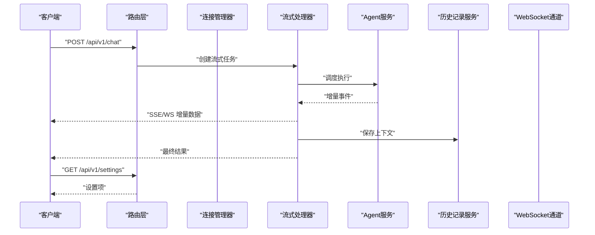
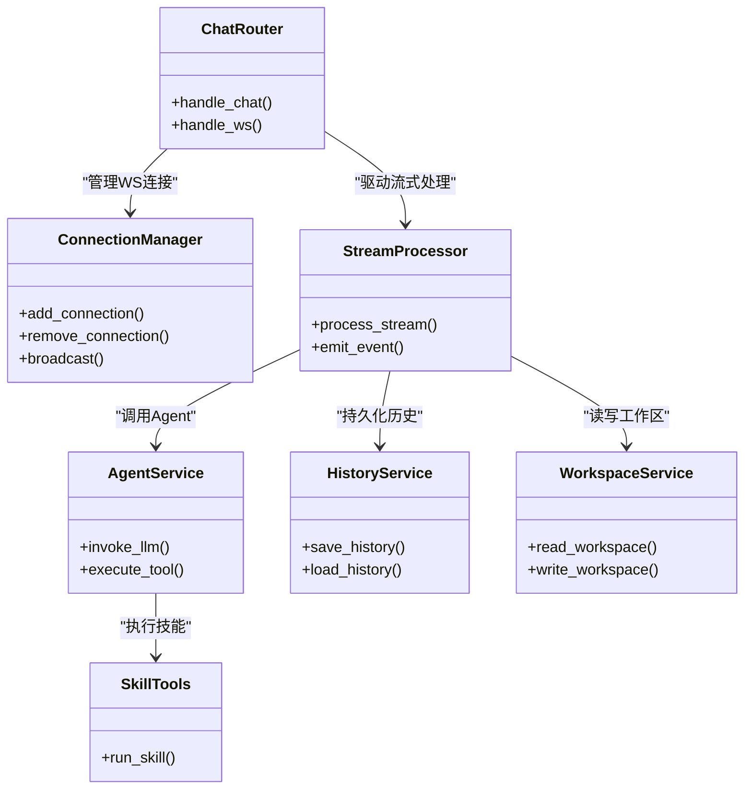

# API参考文档

<cite>
**本文引用的文件**   
- [backend/app/main.py](file://backend/app/main.py)
- [backend/app/routers/chat.py](file://backend/app/routers/chat.py)
- [backend/app/routers/settings.py](file://backend/app/routers/settings.py)
- [backend/app/services/connection_manager.py](file://backend/app/services/connection_manager.py)
- [backend/app/services/stream_processor.py](file://backend/app/services/stream_processor.py)
- [backend/app/services/agent_service.py](file://backend/app/services/agent_service.py)
- [backend/app/services/history_service.py](file://backend/app/services/history_service.py)
- [backend/app/services/workspace_service.py](file://backend/app/services/workspace_service.py)
- [backend/app/tools/skill_tools.py](file://backend/app/tools/skill_tools.py)
- [backend/app/utils/logger.py](file://backend/app/utils/logger.py)
- [backend/env.example](file://backend/env.example)
</cite>

## 目录
1. [简介](#简介)
2. [项目结构](#项目结构)
3. [核心组件](#核心组件)
4. [架构总览](#架构总览)
5. [详细组件分析](#详细组件分析)
6. [依赖关系分析](#依赖关系分析)
7. [性能考虑](#性能考虑)
8. [故障排查指南](#故障排查指南)
9. [结论](#结论)
10. [附录](#附录)

## 简介
本API参考文档面向后端服务，覆盖REST与WebSocket两类接口。基于仓库中的路由与服务实现，文档提供：
- REST端点清单（方法、路径、请求参数、响应格式、错误码）
- WebSocket连接协议、消息格式、事件类型与交互模式
- 认证授权机制说明、速率限制策略建议、版本兼容性约定
- 请求/响应示例与JSON Schema定义、数据类型与校验规则
- 最佳实践、错误处理策略、客户端集成指南
- API测试方法与调试工具推荐

注意：由于当前代码库未包含鉴权中间件与限流中间件的具体实现，本节对鉴权与限流的描述为“建议与约定”，实际行为以部署配置为准。

## 项目结构
后端采用模块化分层：
- 应用入口与路由注册
- 业务路由层（聊天、设置等）
- 服务层（会话管理、流式处理、工作区、历史等）
- 工具层（技能工具、音视频处理等）
- 通用工具（日志等）

图表来源
- [backend/app/main.py](file://backend/app/main.py)
- [backend/app/routers/chat.py](file://backend/app/routers/chat.py)
- [backend/app/routers/settings.py](file://backend/app/routers/settings.py)
- [backend/app/services/connection_manager.py](file://backend/app/services/connection_manager.py)
- [backend/app/services/stream_processor.py](file://backend/app/services/stream_processor.py)
- [backend/app/services/agent_service.py](file://backend/app/services/agent_service.py)
- [backend/app/services/history_service.py](file://backend/app/services/history_service.py)
- [backend/app/services/workspace_service.py](file://backend/app/services/workspace_service.py)
- [backend/app/tools/skill_tools.py](file://backend/app/tools/skill_tools.py)
- [backend/app/utils/logger.py](file://backend/app/utils/logger.py)
- [backend/env.example](file://backend/env.example)

章节来源
- [backend/app/main.py](file://backend/app/main.py)
- [backend/app/routers/chat.py](file://backend/app/routers/chat.py)
- [backend/app/routers/settings.py](file://backend/app/routers/settings.py)

## 核心组件
- 路由层
  - 聊天路由：负责接收聊天请求、建立WebSocket连接、转发消息至流处理器与Agent服务、返回流式或一次性响应。
  - 设置路由：提供系统或用户偏好设置查询与更新能力。
- 服务层
  - 连接管理器：维护WebSocket连接集合、广播消息、清理断开的连接。
  - 流式处理器：将长任务拆分为增量片段，按事件推送给客户端。
  - Agent服务：编排LLM调用、工具执行与工作区操作。
  - 历史记录服务：持久化对话上下文与结果。
  - 工作区服务：读写工作区资源（如文件、元数据）。
- 工具层
  - 技能工具：封装可复用的业务能力（如文本生成、图像/视频处理等）。
- 通用工具
  - 日志：统一记录请求、错误与关键流程信息。

章节来源
- [backend/app/services/connection_manager.py](file://backend/app/services/connection_manager.py)
- [backend/app/services/stream_processor.py](file://backend/app/services/stream_processor.py)
- [backend/app/services/agent_service.py](file://backend/app/services/agent_service.py)
- [backend/app/services/history_service.py](file://backend/app/services/history_service.py)
- [backend/app/services/workspace_service.py](file://backend/app/services/workspace_service.py)
- [backend/app/tools/skill_tools.py](file://backend/app/tools/skill_tools.py)
- [backend/app/utils/logger.py](file://backend/app/utils/logger.py)

## 架构总览
整体交互流程如下：
- REST：客户端通过HTTP发起请求，路由层解析并调用服务层完成业务逻辑，返回结构化响应。
- WebSocket：客户端建立长连接后，服务端通过连接管理器维护会话，使用流式处理器将增量结果推送至客户端。

图表来源
- [backend/app/routers/chat.py](file://backend/app/routers/chat.py)
- [backend/app/services/connection_manager.py](file://backend/app/services/connection_manager.py)
- [backend/app/services/stream_processor.py](file://backend/app/services/stream_processor.py)
- [backend/app/services/agent_service.py](file://backend/app/services/agent_service.py)
- [backend/app/services/history_service.py](file://backend/app/services/history_service.py)

## 详细组件分析

### REST API：聊天
- 基础信息
  - 协议：HTTPS/HTTP
  - 内容类型：application/json
  - 字符集：UTF-8
  - 版本前缀：/api/v1
- 端点
  - POST /api/v1/chat
    - 功能：提交聊天请求，支持一次性或流式响应（由请求头控制）
    - 请求头
      - Authorization：Bearer <token>（若启用鉴权）
      - X-Stream：true/false（是否启用流式）
    - 请求体字段
      - message：string，必填，用户输入
      - workspace_id：string，可选，工作区标识
      - history_ids：array<string>，可选，关联的历史记录ID列表
      - options：object，可选，扩展参数（如模型选择、温度等）
    - 成功响应
      - 非流式：{ "id": string, "message": string, "created_at": string, "status": "completed" }
      - 流式：SSE或WS事件，包含增量片段与状态标记
    - 错误码
      - 400：参数校验失败
      - 401：未认证或令牌无效（若启用）
      - 403：权限不足（若启用）
      - 429：请求过多（若启用限流）
      - 500：服务器内部错误
- 请求/响应示例（JSON Schema）
  - 请求体Schema
    - type: object
    - required: ["message"]
    - properties:
      - message: { type: string, minLength: 1, maxLength: 4096 }
      - workspace_id: { type: string, pattern: "^[a-zA-Z0-9_-]{1,64}$" }
      - history_ids: { type: array, items: { type: string } }
      - options: { type: object }
  - 响应体Schema（非流式）
    - type: object
    - required: ["id", "message", "created_at", "status"]
    - properties:
      - id: { type: string }
      - message: { type: string }
      - created_at: { type: string, format: date-time }
      - status: { type: string, enum: ["completed","failed"] }
- 注意事项
  - 流式模式下，客户端需处理增量拼接与结束事件
  - 大消息建议分片上传或使用流式传输

章节来源
- [backend/app/routers/chat.py](file://backend/app/routers/chat.py)
- [backend/app/services/stream_processor.py](file://backend/app/services/stream_processor.py)
- [backend/app/services/history_service.py](file://backend/app/services/history_service.py)

### REST API：设置
- 基础信息
  - 协议：HTTPS/HTTP
  - 内容类型：application/json
  - 版本前缀：/api/v1
- 端点
  - GET /api/v1/settings
    - 功能：获取当前设置
    - 成功响应：{ "theme": string, "language": string, "features": object }
  - PUT /api/v1/settings
    - 功能：更新设置
    - 请求体字段
      - theme：string，可选
      - language：string，可选
      - features：object，可选
    - 成功响应：{ "updated": boolean, "settings": object }
- 错误码
  - 400：参数校验失败
  - 401：未认证或令牌无效（若启用）
  - 403：权限不足（若启用）
  - 500：服务器内部错误

章节来源
- [backend/app/routers/settings.py](file://backend/app/routers/settings.py)

### WebSocket接口：实时聊天
- 连接协议
  - URL：ws(s)://host/api/v1/ws/chat
  - 握手阶段：客户端发送握手消息，携带会话初始化参数
  - 心跳：服务端周期性发送ping，客户端回复pong
- 消息格式
  - 通用结构
    - type：string，事件类型
    - payload：object，事件载荷
    - metadata：object，附加信息（如trace_id、timestamp）
  - 事件类型
    - session_init：会话初始化
    - message_send：发送消息
    - message_delta：增量片段
    - message_complete：消息完成
    - error：错误事件
    - heartbeat：心跳
- 交互模式
  - 客户端连接后发送session_init
  - 发送message_send触发处理
  - 服务端回推message_delta直至message_complete
  - 异常时推送error事件
- 错误处理
  - 网络断开：客户端重连并恢复会话（若支持）
  - 业务错误：error事件携带code与message
  - 超时：客户端应设置合理超时并重试

章节来源
- [backend/app/routers/chat.py](file://backend/app/routers/chat.py)
- [backend/app/services/connection_manager.py](file://backend/app/services/connection_manager.py)
- [backend/app/services/stream_processor.py](file://backend/app/services/stream_processor.py)

### 认证与授权（建议与约定）
- 方案
  - 推荐使用JWT Bearer Token
  - 在请求头Authorization中携带令牌
- 鉴权时机
  - REST：路由前置中间件校验令牌有效性
  - WebSocket：握手阶段校验令牌并绑定会话
- 权限范围
  - 基于角色或资源的访问控制（RBAC/ABAC）
- 安全建议
  - 强制HTTPS
  - 令牌短期有效并支持刷新
  - 敏感操作二次确认

[本节为通用建议，不直接分析具体文件]

### 速率限制（建议与约定）
- 策略
  - 基于IP或用户ID的滑动窗口计数
  - 分级配额：普通用户与高级用户不同限额
- 响应头
  - X-RateLimit-Limit：配额上限
  - X-RateLimit-Remaining：剩余次数
  - X-RateLimit-Reset：重置时间
- 超限处理
  - 返回429并附带重试After-Seconds

[本节为通用建议，不直接分析具体文件]

### 版本兼容性
- 版本前缀
  - 所有API使用/api/v1前缀
- 兼容策略
  - 向后兼容新增字段
  - 废弃字段保留至少两个主版本
  - 重大变更通过新前缀（如/api/v2）发布

[本节为通用建议，不直接分析具体文件]

## 依赖关系分析

图表来源
- [backend/app/routers/chat.py](file://backend/app/routers/chat.py)
- [backend/app/services/connection_manager.py](file://backend/app/services/connection_manager.py)
- [backend/app/services/stream_processor.py](file://backend/app/services/stream_processor.py)
- [backend/app/services/agent_service.py](file://backend/app/services/agent_service.py)
- [backend/app/services/history_service.py](file://backend/app/services/history_service.py)
- [backend/app/services/workspace_service.py](file://backend/app/services/workspace_service.py)
- [backend/app/tools/skill_tools.py](file://backend/app/tools/skill_tools.py)

章节来源
- [backend/app/routers/chat.py](file://backend/app/routers/chat.py)
- [backend/app/services/connection_manager.py](file://backend/app/services/connection_manager.py)
- [backend/app/services/stream_processor.py](file://backend/app/services/stream_processor.py)
- [backend/app/services/agent_service.py](file://backend/app/services/agent_service.py)
- [backend/app/services/history_service.py](file://backend/app/services/history_service.py)
- [backend/app/services/workspace_service.py](file://backend/app/services/workspace_service.py)
- [backend/app/tools/skill_tools.py](file://backend/app/tools/skill_tools.py)

## 性能考虑
- 流式传输
  - 优先使用增量推送降低首字节延迟
  - 合理设置缓冲区大小与背压策略
- 并发与连接池
  - 外部LLM与工具调用使用异步与连接池
  - 避免阻塞I/O影响其他请求
- 缓存
  - 热点设置与静态资源缓存
  - 会话上下文按需加载与过期策略
- 监控与指标
  - 记录P95/P99延迟、错误率、吞吐
  - 追踪关键链路（路由→服务→工具）

[本节为通用建议，不直接分析具体文件]

## 故障排查指南
- 常见问题
  - 401/403：检查令牌与权限配置
  - 429：检查限流策略与配额
  - 500：查看服务端日志定位异常堆栈
- 日志与追踪
  - 使用统一日志工具记录请求ID与关键步骤
  - 结合分布式追踪ID进行跨服务排查
- 调试建议
  - 使用curl或HTTP客户端模拟请求
  - WebSocket使用专用客户端工具抓包与回放
  - 开启详细日志级别进行问题复现

章节来源
- [backend/app/utils/logger.py](file://backend/app/utils/logger.py)

## 结论
本参考文档基于现有路由与服务实现，梳理了REST与WebSocket接口的规范、数据模型与交互流程，并提供了鉴权、限流、版本兼容的最佳实践建议。建议在后续迭代中补充鉴权与限流中间件的具体实现，完善错误码与响应体的标准化，提升可观测性与稳定性。

## 附录

### 环境变量与配置
- 参考示例文件
  - backend/env.example
- 常见变量
  - APP_ENV：运行环境
  - LOG_LEVEL：日志级别
  - LLM_API_KEY：外部LLM密钥
  - STORAGE_PATH：存储路径

章节来源
- [backend/env.example](file://backend/env.example)

### 客户端集成指南
- REST
  - 设置基础URL与默认头
  - 处理分页与错误码
  - 实现重试与退避策略
- WebSocket
  - 连接建立与握手
  - 心跳保活与断线重连
  - 增量消息拼接与去抖
- 安全
  - 使用HTTPS/WSS
  - 安全存储令牌
  - 最小权限原则

[本节为通用建议，不直接分析具体文件]

### API测试方法与工具
- 单元测试
  - 针对服务层与工具层编写用例
- 集成测试
  - 启动本地服务，端到端验证路由与服务协作
- 负载测试
  - 使用压测工具模拟高并发
- 调试工具
  - curl、Postman、Insomnia
  - WebSocket客户端（wscat、Web原生控制台）

[本节为通用建议，不直接分析具体文件]