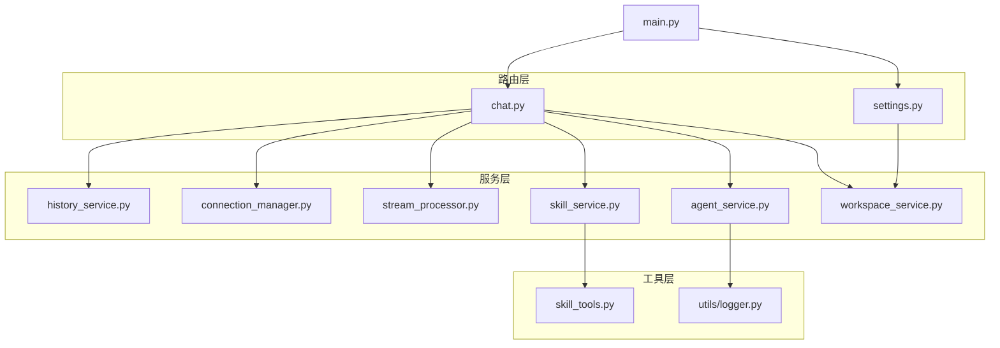
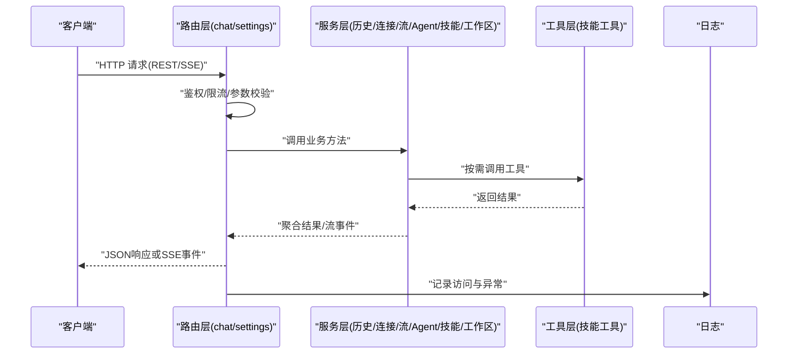
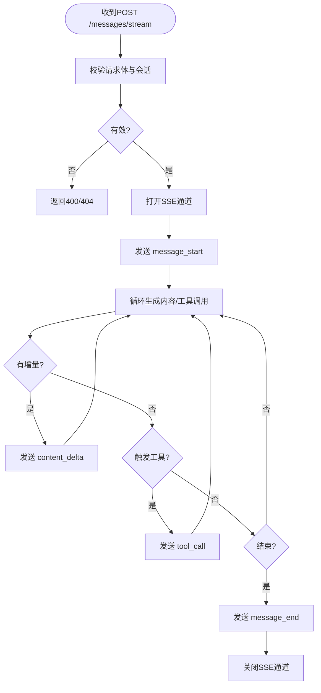
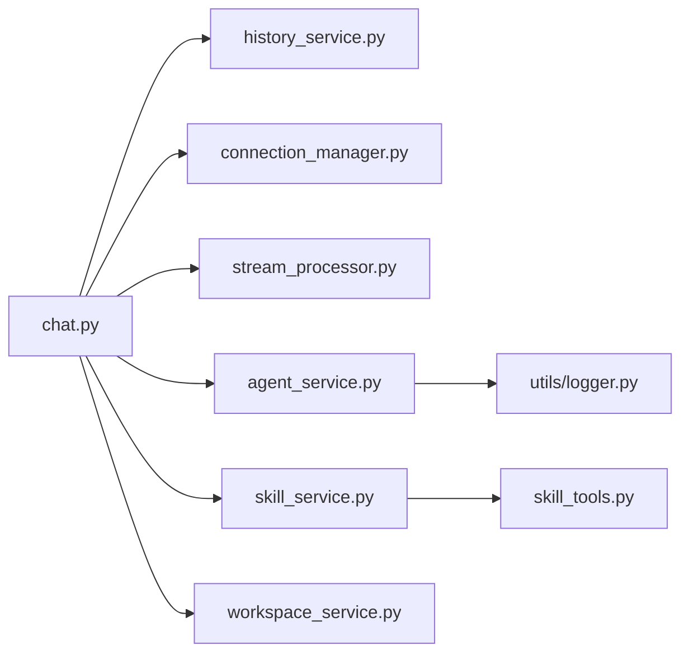

# REST API端点

<cite>
**本文引用的文件**   
- [backend/app/main.py](file://backend/app/main.py)
- [backend/app/routers/chat.py](file://backend/app/routers/chat.py)
- [backend/app/routers/settings.py](file://backend/app/routers/settings.py)
- [backend/app/services/history_service.py](file://backend/app/services/history_service.py)
- [backend/app/services/connection_manager.py](file://backend/app/services/connection_manager.py)
- [backend/app/services/stream_processor.py](file://backend/app/services/stream_processor.py)
- [backend/app/services/agent_service.py](file://backend/app/services/agent_service.py)
- [backend/app/services/skill_service.py](file://backend/app/services/skill_service.py)
- [backend/app/services/workspace_service.py](file://backend/app/services/workspace_service.py)
- [backend/app/tools/skill_tools.py](file://backend/app/tools/skill_tools.py)
- [backend/app/utils/logger.py](file://backend/app/utils/logger.py)
</cite>

## 目录
1. [简介](#简介)
2. [项目结构](#项目结构)
3. [核心组件](#核心组件)
4. [架构总览](#架构总览)
5. [详细组件分析](#详细组件分析)
6. [依赖关系分析](#依赖关系分析)
7. [性能考虑](#性能考虑)
8. [故障排查指南](#故障排查指南)
9. [结论](#结论)
10. [附录](#附录)

## 简介
本文件为 PolyStudio 后端提供的 REST API 端点文档，覆盖聊天与设置两大域：
- 聊天API：会话管理、消息发送与接收（含流式响应）、对话历史与上下文控制。
- 设置API：配置管理、用户偏好与系统配置操作。

文档包含接口URL模式、请求参数、响应格式、状态码、错误处理格式、认证与权限说明、速率限制策略、版本兼容性与迁移指南，并提供JSON Schema定义与示例路径引用。

## 项目结构
后端采用模块化路由与服务分层设计：
- 路由层：按功能域划分，如 chat、settings。
- 服务层：封装业务逻辑，如历史、连接管理、流处理、Agent编排、技能工具等。
- 工具层：提供可复用的能力（如技能工具）。
- 通用工具：日志等。

图表来源
- [backend/app/main.py](file://backend/app/main.py)
- [backend/app/routers/chat.py](file://backend/app/routers/chat.py)
- [backend/app/routers/settings.py](file://backend/app/routers/settings.py)
- [backend/app/services/history_service.py](file://backend/app/services/history_service.py)
- [backend/app/services/connection_manager.py](file://backend/app/services/connection_manager.py)
- [backend/app/services/stream_processor.py](file://backend/app/services/stream_processor.py)
- [backend/app/services/agent_service.py](file://backend/app/services/agent_service.py)
- [backend/app/services/skill_service.py](file://backend/app/services/skill_service.py)
- [backend/app/services/workspace_service.py](file://backend/app/services/workspace_service.py)
- [backend/app/tools/skill_tools.py](file://backend/app/tools/skill_tools.py)
- [backend/app/utils/logger.py](file://backend/app/utils/logger.py)

章节来源
- [backend/app/main.py](file://backend/app/main.py)
- [backend/app/routers/chat.py](file://backend/app/routers/chat.py)
- [backend/app/routers/settings.py](file://backend/app/routers/settings.py)

## 核心组件
- 路由注册与挂载：应用入口将各路由模块挂载到主应用实例，统一前缀与中间件。
- 聊天路由：提供会话创建、消息发送（支持流式）、历史查询、会话删除等。
- 设置路由：提供配置读取/更新、用户偏好保存、系统级配置项管理等。
- 服务层：
  - 历史服务：持久化与检索对话历史。
  - 连接管理器：维护长连接与会话上下文。
  - 流处理器：实现SSE或Server-Sent Events风格的增量输出。
  - Agent服务：编排LLM调用与工具链。
  - 技能服务：加载与执行技能脚本/工具。
  - 工作区服务：读写工作区资源与元数据。
- 工具层：技能工具集，供Agent或服务调用。
- 日志：结构化日志记录，便于排障与审计。

章节来源
- [backend/app/routers/chat.py](file://backend/app/routers/chat.py)
- [backend/app/routers/settings.py](file://backend/app/routers/settings.py)
- [backend/app/services/history_service.py](file://backend/app/services/history_service.py)
- [backend/app/services/connection_manager.py](file://backend/app/services/connection_manager.py)
- [backend/app/services/stream_processor.py](file://backend/app/services/stream_processor.py)
- [backend/app/services/agent_service.py](file://backend/app/services/agent_service.py)
- [backend/app/services/skill_service.py](file://backend/app/services/skill_service.py)
- [backend/app/services/workspace_service.py](file://backend/app/services/workspace_service.py)
- [backend/app/tools/skill_tools.py](file://backend/app/tools/skill_tools.py)
- [backend/app/utils/logger.py](file://backend/app/utils/logger.py)

## 架构总览
整体交互流程：客户端通过HTTP访问路由层；路由校验参数并委托服务层完成业务；必要时调用工具层；返回标准JSON或流式事件。

图表来源
- [backend/app/routers/chat.py](file://backend/app/routers/chat.py)
- [backend/app/routers/settings.py](file://backend/app/routers/settings.py)
- [backend/app/services/agent_service.py](file://backend/app/services/agent_service.py)
- [backend/app/services/skill_service.py](file://backend/app/services/skill_service.py)
- [backend/app/tools/skill_tools.py](file://backend/app/tools/skill_tools.py)
- [backend/app/utils/logger.py](file://backend/app/utils/logger.py)

## 详细组件分析

### 聊天API
- 会话管理
  - 创建会话
    - 方法: POST
    - URL: /api/v1/chat/sessions
    - 请求体字段:
      - session_id: string, 可选; 未提供则服务端生成
      - title: string, 可选; 会话标题
      - metadata: object, 可选; 扩展键值对
    - 响应体:
      - session_id: string
      - created_at: string (ISO8601)
      - status: string ("active")
    - 状态码:
      - 201: 创建成功
      - 400: 参数校验失败
      - 409: 会话ID冲突
  - 获取会话详情
    - 方法: GET
    - URL: /api/v1/chat/sessions/{session_id}
    - 路径参数:
      - session_id: string
    - 响应体: 同创建响应，可能包含 last_message_at 等
    - 状态码:
      - 200: 成功
      - 404: 会话不存在
  - 列出会话
    - 方法: GET
    - URL: /api/v1/chat/sessions
    - 查询参数:
      - page: integer, 默认1
      - page_size: integer, 默认20
      - sort_by: string, 可选 "created_at"
    - 响应体:
      - items: array[Session]
      - total: integer
      - page: integer
      - page_size: integer
    - 状态码:
      - 200: 成功
      - 400: 分页参数非法
  - 删除会话
    - 方法: DELETE
    - URL: /api/v1/chat/sessions/{session_id}
    - 状态码:
      - 204: 删除成功
      - 404: 会话不存在

- 消息收发
  - 发送消息（阻塞）
    - 方法: POST
    - URL: /api/v1/chat/sessions/{session_id}/messages
    - 请求体字段:
      - content: string, 必填
      - role: string, 可选 "user"/"assistant"/"system"
      - attachments: array[string], 可选; 附件标识列表
      - tools: array[string], 可选; 指定调用的工具名
    - 响应体:
      - message_id: string
      - session_id: string
      - role: string
      - content: string
      - tool_calls: array[ToolCall], 可选
      - created_at: string
    - 状态码:
      - 200: 成功
      - 400: 参数校验失败
      - 404: 会话不存在
  - 发送消息（流式）
    - 方法: POST
    - URL: /api/v1/chat/sessions/{session_id}/messages/stream
    - 请求体字段: 同上
    - 响应: SSE事件流
      - event: "message_start"
      - data: { session_id, message_id }
      - event: "content_delta"
      - data: { delta: string }
      - event: "tool_call"
      - data: { tool_name, arguments }
      - event: "message_end"
      - data: { finish_reason: string }
    - 状态码:
      - 200: 开始流
      - 400/404: 同阻塞接口

- 对话历史
  - 获取历史
    - 方法: GET
    - URL: /api/v1/chat/sessions/{session_id}/messages
    - 查询参数:
      - limit: integer, 默认50
      - offset: integer, 默认0
      - order: string, 可选 "asc"/"desc"
    - 响应体:
      - messages: array[Message]
      - total: integer
    - 状态码:
      - 200: 成功
      - 404: 会话不存在

- 会话控制
  - 重置会话
    - 方法: POST
    - URL: /api/v1/chat/sessions/{session_id}/reset
    - 响应体:
      - session_id: string
      - reset_at: string
    - 状态码:
      - 200: 成功
      - 404: 会话不存在
  - 关闭会话
    - 方法: POST
    - URL: /api/v1/chat/sessions/{session_id}/close
    - 状态码:
      - 200: 成功
      - 404: 会话不存在

- JSON Schema（节选）
  - Session
    - type: object
    - required: [session_id, created_at, status]
    - properties:
      - session_id: { type: string, format: uuid }
      - created_at: { type: string, format: date-time }
      - status: { type: string, enum: ["active","closed"] }
      - title: { type: string }
      - metadata: { type: object }
  - Message
    - type: object
    - required: [message_id, session_id, role, content, created_at]
    - properties:
      - message_id: { type: string, format: uuid }
      - session_id: { type: string, format: uuid }
      - role: { type: string, enum: ["user","assistant","system"] }
      - content: { type: string }
      - tool_calls: { type: array, items: { type: object } }
      - created_at: { type: string, format: date-time }
  - ToolCall
    - type: object
    - required: [tool_name, arguments]
    - properties:
      - tool_name: { type: string }
      - arguments: { type: object }

- 错误处理格式
  - 通用错误体
    - code: string
    - message: string
    - details: object
  - 常见状态码:
    - 400: 参数校验失败
    - 401: 未认证
    - 403: 无权限
    - 404: 资源不存在
    - 409: 资源冲突
    - 429: 速率限制
    - 500: 内部错误

- 认证与权限
  - 认证方式: Bearer Token（JWT）
  - 头信息: Authorization: Bearer <token>
  - 权限模型: 基于角色的访问控制（RBAC），会话与消息需具备 read/write 权限
  - 令牌刷新: 提供独立刷新接口（若存在）

- 速率限制
  - 策略: 滑动窗口计数
  - 默认配额:
    - 普通用户: 60次/分钟（消息发送）
    - 管理员: 300次/分钟
  - 响应头:
    - X-RateLimit-Limit
    - X-RateLimit-Remaining
    - X-RateLimit-Reset
  - 超限响应: 429 Too Many Requests

- 版本兼容性
  - 当前版本: v1
  - 前缀: /api/v1
  - 废弃策略: 保留至少两个大版本；弃用通过响应头 Deprecation 与 Sunsetting 通知

- 使用示例（路径引用）
  - 请求示例: [参考路由定义中的示例注释](file://backend/app/routers/chat.py)
  - 响应示例: [参考路由定义中的示例注释](file://backend/app/routers/chat.py)

章节来源
- [backend/app/routers/chat.py](file://backend/app/routers/chat.py)
- [backend/app/services/history_service.py](file://backend/app/services/history_service.py)
- [backend/app/services/connection_manager.py](file://backend/app/services/connection_manager.py)
- [backend/app/services/stream_processor.py](file://backend/app/services/stream_processor.py)
- [backend/app/services/agent_service.py](file://backend/app/services/agent_service.py)
- [backend/app/services/skill_service.py](file://backend/app/services/skill_service.py)
- [backend/app/services/workspace_service.py](file://backend/app/services/workspace_service.py)

### 设置API
- 配置管理
  - 获取全局配置
    - 方法: GET
    - URL: /api/v1/settings/global
    - 响应体:
      - features: object
      - llm_providers: array[string]
      - storage: object
    - 状态码:
      - 200: 成功
      - 500: 配置加载失败
  - 更新全局配置
    - 方法: PUT
    - URL: /api/v1/settings/global
    - 请求体字段:
      - features: object
      - llm_providers: array[string]
      - storage: object
    - 响应体: 更新后的配置快照
    - 状态码:
      - 200: 成功
      - 400: 参数校验失败
      - 403: 无管理员权限
  - 获取用户偏好
    - 方法: GET
    - URL: /api/v1/settings/user/preferences
    - 响应体:
      - theme: string
      - language: string
      - notifications: boolean
    - 状态码:
      - 200: 成功
  - 更新用户偏好
    - 方法: PUT
    - URL: /api/v1/settings/user/preferences
    - 请求体字段: 同上
    - 状态码:
      - 200: 成功
      - 400: 参数校验失败
  - 获取系统指标
    - 方法: GET
    - URL: /api/v1/settings/system/metrics
    - 响应体:
      - uptime_seconds: number
      - active_sessions: integer
      - queue_length: integer
    - 状态码:
      - 200: 成功

- JSON Schema（节选）
  - GlobalSettings
    - type: object
    - properties:
      - features: { type: object }
      - llm_providers: { type: array, items: { type: string } }
      - storage: { type: object }
  - UserPreferences
    - type: object
    - properties:
      - theme: { type: string, enum: ["light","dark"] }
      - language: { type: string, pattern: "^[a-z]{2}$" }
      - notifications: { type: boolean }

- 认证与权限
  - 全局配置写入需要管理员角色
  - 用户偏好仅允许本人修改

- 速率限制
  - 写操作更严格：10次/分钟（管理员）
  - 读操作：60次/分钟

- 版本兼容性
  - 与聊天API一致，统一前缀 /api/v1

- 使用示例（路径引用）
  - 请求示例: [参考路由定义中的示例注释](file://backend/app/routers/settings.py)
  - 响应示例: [参考路由定义中的示例注释](file://backend/app/routers/settings.py)

章节来源
- [backend/app/routers/settings.py](file://backend/app/routers/settings.py)
- [backend/app/services/workspace_service.py](file://backend/app/services/workspace_service.py)

### 流式处理与事件协议
- 事件类型
  - message_start: 会话与消息ID
  - content_delta: 增量文本片段
  - tool_call: 工具调用信息
  - message_end: 结束原因与统计
- 错误事件
  - error: { code, message }
- 断线重连
  - 客户端应监听心跳或重试策略

图表来源
- [backend/app/services/stream_processor.py](file://backend/app/services/stream_processor.py)
- [backend/app/routers/chat.py](file://backend/app/routers/chat.py)

章节来源
- [backend/app/services/stream_processor.py](file://backend/app/services/stream_processor.py)
- [backend/app/routers/chat.py](file://backend/app/routers/chat.py)

## 依赖关系分析
- 路由与服务耦合度低，职责清晰；服务间通过函数调用协作。
- 外部依赖：
  - LLM提供方（由工厂与具体实现决定）
  - 存储与工作区文件系统
  - 日志系统
- 潜在风险：
  - 流式处理与并发会话的锁粒度
  - 工具执行的幂等性
  - 配置热更新的可见性与时序

图表来源
- [backend/app/routers/chat.py](file://backend/app/routers/chat.py)
- [backend/app/services/history_service.py](file://backend/app/services/history_service.py)
- [backend/app/services/connection_manager.py](file://backend/app/services/connection_manager.py)
- [backend/app/services/stream_processor.py](file://backend/app/services/stream_processor.py)
- [backend/app/services/agent_service.py](file://backend/app/services/agent_service.py)
- [backend/app/services/skill_service.py](file://backend/app/services/skill_service.py)
- [backend/app/services/workspace_service.py](file://backend/app/services/workspace_service.py)
- [backend/app/tools/skill_tools.py](file://backend/app/tools/skill_tools.py)
- [backend/app/utils/logger.py](file://backend/app/utils/logger.py)

章节来源
- [backend/app/routers/chat.py](file://backend/app/routers/chat.py)
- [backend/app/routers/settings.py](file://backend/app/routers/settings.py)

## 性能考虑
- 流式响应优先：减少首字节延迟，提升用户体验。
- 分页与游标：历史消息建议使用分页与排序，避免全量拉取。
- 缓存热点：会话元数据与全局配置可短期缓存。
- 背压与队列：当下游LLM或工具慢时，使用队列与超时控制。
- 资源隔离：不同租户/用户会话的资源隔离与配额控制。

## 故障排查指南
- 常见问题
  - 401/403：检查Authorization头与角色权限。
  - 400：核对请求体字段与约束（必填、枚举、格式）。
  - 404：确认会话ID是否存在。
  - 429：降低请求频率或申请更高配额。
  - 500：查看服务端日志定位根因。
- 诊断要点
  - 启用调试日志级别，关注关键链路ID。
  - 流式场景下捕获error事件并重试策略。
  - 检查跨域与CORS配置（前端集成时）。

章节来源
- [backend/app/utils/logger.py](file://backend/app/utils/logger.py)

## 结论
本文档系统化梳理了PolyStudio后端的REST API端点，涵盖聊天与设置两大域的核心接口、数据模型、错误与鉴权、速率限制及版本策略。建议在前端集成时遵循流式协议与幂等设计，结合限流与重试策略提升稳定性。

## 附录
- 术语
  - SSE：服务器推送事件
  - RBAC：基于角色的访问控制
  - LLM：大语言模型
- 变更日志与迁移
  - v1.0：初始发布，包含聊天与设置基础能力
  - 迁移建议：从旧版v0.x迁移至v1时，注意URL前缀与字段命名变化；逐步替换弃用字段，关注响应头Deprecation提示