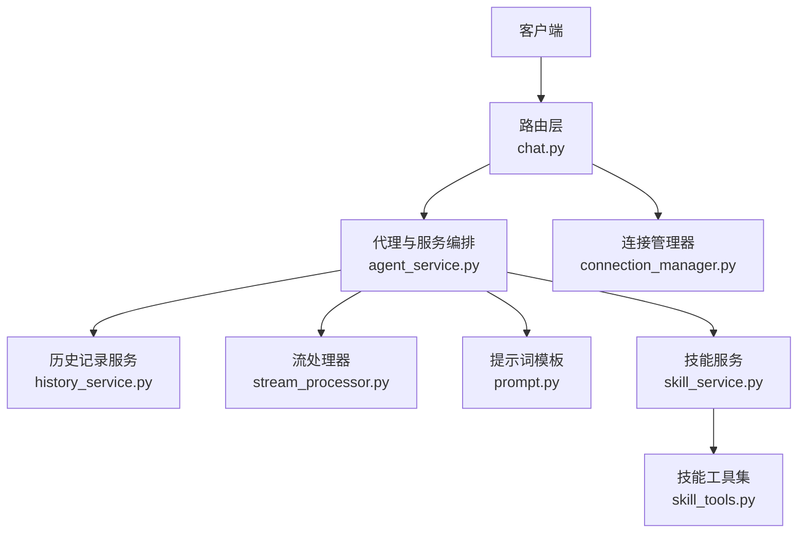
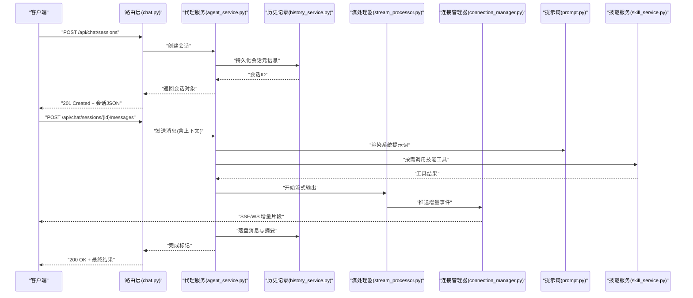
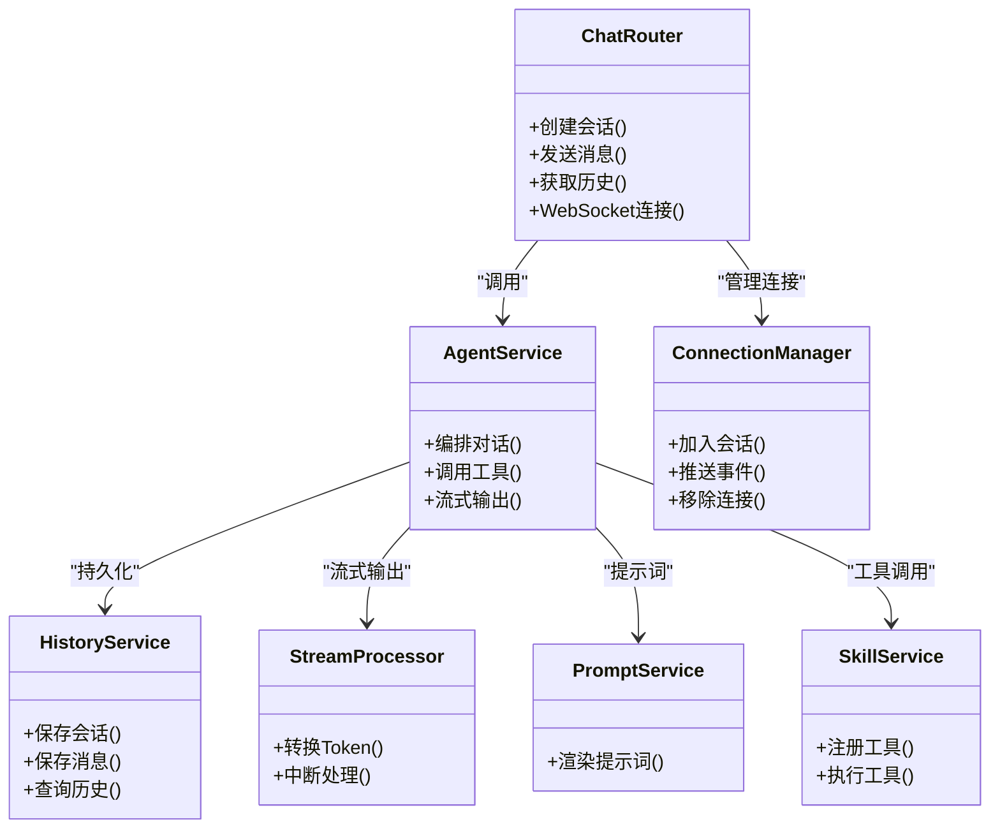

# 聊天API接口

<cite>
**本文引用的文件**   
- [backend/app/main.py](file://backend/app/main.py)
- [backend/app/routers/chat.py](file://backend/app/routers/chat.py)
- [backend/app/services/agent_service.py](file://backend/app/services/agent_service.py)
- [backend/app/services/connection_manager.py](file://backend/app/services/connection_manager.py)
- [backend/app/services/history_service.py](file://backend/app/services/history_service.py)
- [backend/app/services/stream_processor.py](file://backend/app/services/stream_processor.py)
- [backend/app/services/prompt.py](file://backend/app/services/prompt.py)
- [backend/app/services/skill_service.py](file://backend/app/services/skill_service.py)
- [backend/app/tools/skill_tools.py](file://backend/app/tools/skill_tools.py)
</cite>

## 目录
1. [简介](#简介)
2. [项目结构](#项目结构)
3. [核心组件](#核心组件)
4. [架构总览](#架构总览)
5. [详细组件分析](#详细组件分析)
6. [依赖关系分析](#依赖关系分析)
7. [性能考虑](#性能考虑)
8. [故障排查指南](#故障排查指南)
9. [结论](#结论)
10. [附录](#附录)

## 简介
本文件为“聊天API接口”的权威文档，覆盖与AI助手交互相关的REST端点、WebSocket实时通信协作方式、错误处理机制、认证与权限控制、速率限制策略以及调试方法。文档以代码仓库中的后端实现为依据，提供端到端的调用流程说明、请求/响应示例路径和关键流程图示，帮助开发者快速集成并稳定运行聊天功能。

## 项目结构
后端采用分层设计：路由层暴露HTTP/WebSocket接口，服务层封装业务逻辑（对话管理、历史持久化、流式处理、技能工具等），工具层提供具体能力（如TTS、图像生成、视频拼接等）。入口模块负责注册路由与启动应用。

图表来源
- [backend/app/main.py](file://backend/app/main.py)
- [backend/app/routers/chat.py](file://backend/app/routers/chat.py)
- [backend/app/services/agent_service.py](file://backend/app/services/agent_service.py)
- [backend/app/services/connection_manager.py](file://backend/app/services/connection_manager.py)
- [backend/app/services/history_service.py](file://backend/app/services/history_service.py)
- [backend/app/services/stream_processor.py](file://backend/app/services/stream_processor.py)
- [backend/app/services/prompt.py](file://backend/app/services/prompt.py)
- [backend/app/services/skill_service.py](file://backend/app/services/skill_service.py)
- [backend/app/tools/skill_tools.py](file://backend/app/tools/skill_tools.py)

章节来源
- [backend/app/main.py](file://backend/app/main.py)
- [backend/app/routers/chat.py](file://backend/app/routers/chat.py)

## 核心组件
- 路由层（chat.py）
  - 定义所有聊天相关REST端点与WebSocket端点，负责参数校验、鉴权、限流、转发到服务层。
- 代理与服务编排（agent_service.py）
  - 协调LLM调用、工具执行、会话上下文组装、流式输出与状态回写。
- 连接管理器（connection_manager.py）
  - 维护WebSocket连接集合、广播消息、清理异常断开连接。
- 历史记录服务（history_service.py）
  - 会话与消息的持久化、查询、分页与回溯。
- 流处理器（stream_processor.py）
  - 将LLM增量token转换为SSE或WS事件，支持中断与重试。
- 提示词服务（prompt.py）
  - 加载与渲染系统提示词、用户指令模板。
- 技能服务与工具（skill_service.py, skill_tools.py）
  - 注册与调度外部能力（文本、音频、图像、视频等），返回结构化结果供LLM消费。

章节来源
- [backend/app/routers/chat.py](file://backend/app/routers/chat.py)
- [backend/app/services/agent_service.py](file://backend/app/services/agent_service.py)
- [backend/app/services/connection_manager.py](file://backend/app/services/connection_manager.py)
- [backend/app/services/history_service.py](file://backend/app/services/history_service.py)
- [backend/app/services/stream_processor.py](file://backend/app/services/stream_processor.py)
- [backend/app/services/prompt.py](file://backend/app/services/prompt.py)
- [backend/app/services/skill_service.py](file://backend/app/services/skill_service.py)
- [backend/app/tools/skill_tools.py](file://backend/app/tools/skill_tools.py)

## 架构总览
聊天API的整体数据流如下：客户端通过REST创建会话、发送消息；服务端在需要时通过WebSocket推送增量内容；同时记录历史、调用工具、渲染提示词，最终返回完整响应。

图表来源
- [backend/app/routers/chat.py](file://backend/app/routers/chat.py)
- [backend/app/services/agent_service.py](file://backend/app/services/agent_service.py)
- [backend/app/services/history_service.py](file://backend/app/services/history_service.py)
- [backend/app/services/stream_processor.py](file://backend/app/services/stream_processor.py)
- [backend/app/services/connection_manager.py](file://backend/app/services/connection_manager.py)
- [backend/app/services/prompt.py](file://backend/app/services/prompt.py)
- [backend/app/services/skill_service.py](file://backend/app/services/skill_service.py)

## 详细组件分析

### REST API：会话管理
- 创建会话
  - 方法：POST
  - URL：/api/chat/sessions
  - 请求体（JSON）：包含会话名称、初始提示词、模型选择、是否启用工具等字段。
  - 响应：返回会话ID、创建时间、状态等。
  - 状态码：201 Created；400 Bad Request；401 Unauthorized；429 Too Many Requests。
- 获取会话列表
  - 方法：GET
  - URL：/api/chat/sessions
  - 查询参数：page、size、keyword等。
  - 响应：分页后的会话列表。
  - 状态码：200 OK；401 Unauthorized；429 Too Many Requests。
- 获取会话详情
  - 方法：GET
  - URL：/api/chat/sessions/{session_id}
  - 响应：会话元信息与最近消息摘要。
  - 状态码：200 OK；404 Not Found；401 Unauthorized。
- 删除会话
  - 方法：DELETE
  - URL：/api/chat/sessions/{session_id}
  - 响应：空体或确认信息。
  - 状态码：204 No Content；404 Not Found；401 Unauthorized。

章节来源
- [backend/app/routers/chat.py](file://backend/app/routers/chat.py)

### REST API：消息发送与流式响应
- 发送消息
  - 方法：POST
  - URL：/api/chat/sessions/{session_id}/messages
  - 请求体（JSON）：包含消息内容、附件URL、是否开启流式输出、工具开关等。
  - 响应：
    - 非流式：一次性返回完整消息对象。
    - 流式：使用SSE或WebSocket推送增量片段，最后返回完成事件。
  - 状态码：200 OK；201 Created；400 Bad Request；404 Not Found；401 Unauthorized；429 Too Many Requests。
- 获取会话消息历史
  - 方法：GET
  - URL：/api/chat/sessions/{session_id}/messages
  - 查询参数：page、size、after、before等。
  - 响应：分页消息列表。
  - 状态码：200 OK；404 Not Found；401 Unauthorized。

章节来源
- [backend/app/routers/chat.py](file://backend/app/routers/chat.py)

### WebSocket：实时通信
- 连接建立
  - URL：/ws/chat?session_id={session_id}&token={token}
  - 认证：通过token进行鉴权。
  - 事件：
    - 增量片段：携带部分文本或结构化数据。
    - 工具调用：展示工具执行进度与结果。
    - 完成：会话结束标志。
    - 错误：错误码与消息。
- 心跳与重连
  - 客户端需定期发送ping，服务端返回pong；断线后按指数退避重连。

章节来源
- [backend/app/routers/chat.py](file://backend/app/routers/chat.py)
- [backend/app/services/connection_manager.py](file://backend/app/services/connection_manager.py)

### 流式处理与中断
- 流式输出
  - 由流处理器将LLM增量token转换为事件，经连接管理器推送至客户端。
- 中断与重试
  - 支持客户端主动中断；服务端捕获异常后返回错误事件，客户端可触发重试。

章节来源
- [backend/app/services/stream_processor.py](file://backend/app/services/stream_processor.py)
- [backend/app/services/connection_manager.py](file://backend/app/services/connection_manager.py)

### 提示词与上下文组装
- 系统提示词
  - 从提示词服务加载模板，结合会话配置与用户输入动态渲染。
- 上下文窗口
  - 根据模型上下文长度裁剪历史消息，保留必要摘要与关键事实。

章节来源
- [backend/app/services/prompt.py](file://backend/app/services/prompt.py)
- [backend/app/services/agent_service.py](file://backend/app/services/agent_service.py)

### 技能工具与扩展
- 工具注册与发现
  - 技能服务维护工具清单，支持按名称与版本解析。
- 工具执行
  - 将工具输入序列化为标准格式，执行后返回结构化结果供LLM消费。
- 常见工具
  - 文本处理、语音合成、图像生成、视频拼接、3D模型生成等。

章节来源
- [backend/app/services/skill_service.py](file://backend/app/services/skill_service.py)
- [backend/app/tools/skill_tools.py](file://backend/app/tools/skill_tools.py)

## 依赖关系分析
- 路由层依赖服务层，服务层依赖工具层与外部LLM提供方。
- 连接管理器被流处理器与路由层共同使用，用于维持长连接。
- 历史记录服务贯穿会话与消息生命周期，保证可追溯性。

图表来源
- [backend/app/routers/chat.py](file://backend/app/routers/chat.py)
- [backend/app/services/agent_service.py](file://backend/app/services/agent_service.py)
- [backend/app/services/connection_manager.py](file://backend/app/services/connection_manager.py)
- [backend/app/services/history_service.py](file://backend/app/services/history_service.py)
- [backend/app/services/stream_processor.py](file://backend/app/services/stream_processor.py)
- [backend/app/services/prompt.py](file://backend/app/services/prompt.py)
- [backend/app/services/skill_service.py](file://backend/app/services/skill_service.py)

## 性能考虑
- 流式输出优先：对大模型响应采用增量推送，降低首字节延迟。
- 连接池与并发：合理设置LLM客户端并发与超时，避免资源耗尽。
- 历史裁剪：按上下文长度与重要性策略裁剪历史，减少传输与计算开销。
- 缓存与去重：对重复请求与工具结果进行短期缓存，提升吞吐。
- 背压与限流：基于令牌桶或滑动窗口限制单用户与全局QPS。

[本节为通用指导，不直接分析具体文件]

## 故障排查指南
- 常见问题
  - 401 Unauthorized：检查token是否有效、是否过期、是否具备相应权限。
  - 429 Too Many Requests：触达速率限制，等待重试或申请配额。
  - 404 Not Found：会话或消息不存在，确认ID是否正确。
  - 500 Internal Server Error：查看服务端日志，定位LLM或服务异常。
- 调试建议
  - 启用详细日志：记录请求头、参数、耗时与错误堆栈。
  - 使用WebSocket事件追踪：观察增量片段、工具调用与完成事件。
  - 回放历史：拉取会话历史，复现问题场景。
  - 隔离测试：关闭工具链，仅验证纯文本链路。

章节来源
- [backend/app/routers/chat.py](file://backend/app/routers/chat.py)
- [backend/app/services/connection_manager.py](file://backend/app/services/connection_manager.py)
- [backend/app/services/stream_processor.py](file://backend/app/services/stream_processor.py)

## 结论
本聊天API以清晰的分层架构与完善的流式支持，提供了健壮的对话创建、消息发送、历史管理与实时通信能力。通过统一的错误处理、鉴权与限流策略，确保在生产环境下的稳定性与可扩展性。建议在实际集成中遵循本文档的规范，并结合性能与排障建议优化用户体验。

[本节为总结性内容，不直接分析具体文件]

## 附录

### 认证与权限控制
- 认证方式：基于token的认证，需在请求头或WebSocket查询参数中携带。
- 权限范围：不同角色拥有不同的会话与工具访问权限。
- 安全建议：使用HTTPS、短有效期token与最小权限原则。

章节来源
- [backend/app/routers/chat.py](file://backend/app/routers/chat.py)

### 速率限制策略
- 粒度：按用户与会话维度限制。
- 算法：令牌桶或滑动窗口。
- 响应：超限时返回429，并在响应头中包含重试建议。

章节来源
- [backend/app/routers/chat.py](file://backend/app/routers/chat.py)

### 请求/响应示例路径
- 创建会话示例：参考路由定义与测试用例。
- 发送消息示例：参考路由定义与流式处理示例。
- WebSocket事件示例：参考连接管理器与流处理器的事件定义。

章节来源
- [backend/app/routers/chat.py](file://backend/app/routers/chat.py)
- [backend/app/services/stream_processor.py](file://backend/app/services/stream_processor.py)
- [backend/app/services/connection_manager.py](file://backend/app/services/connection_manager.py)