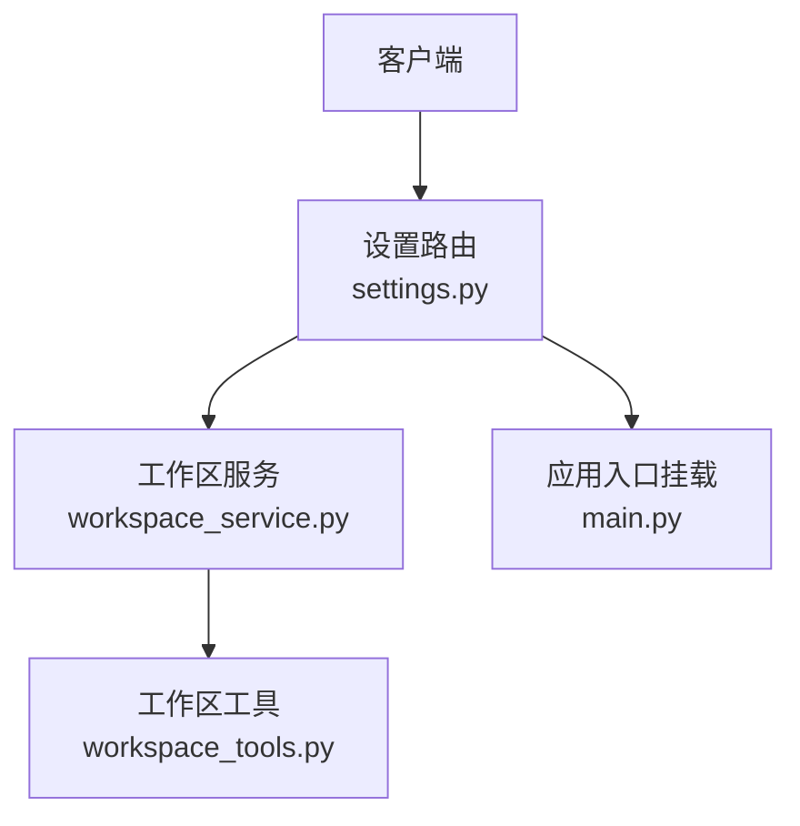
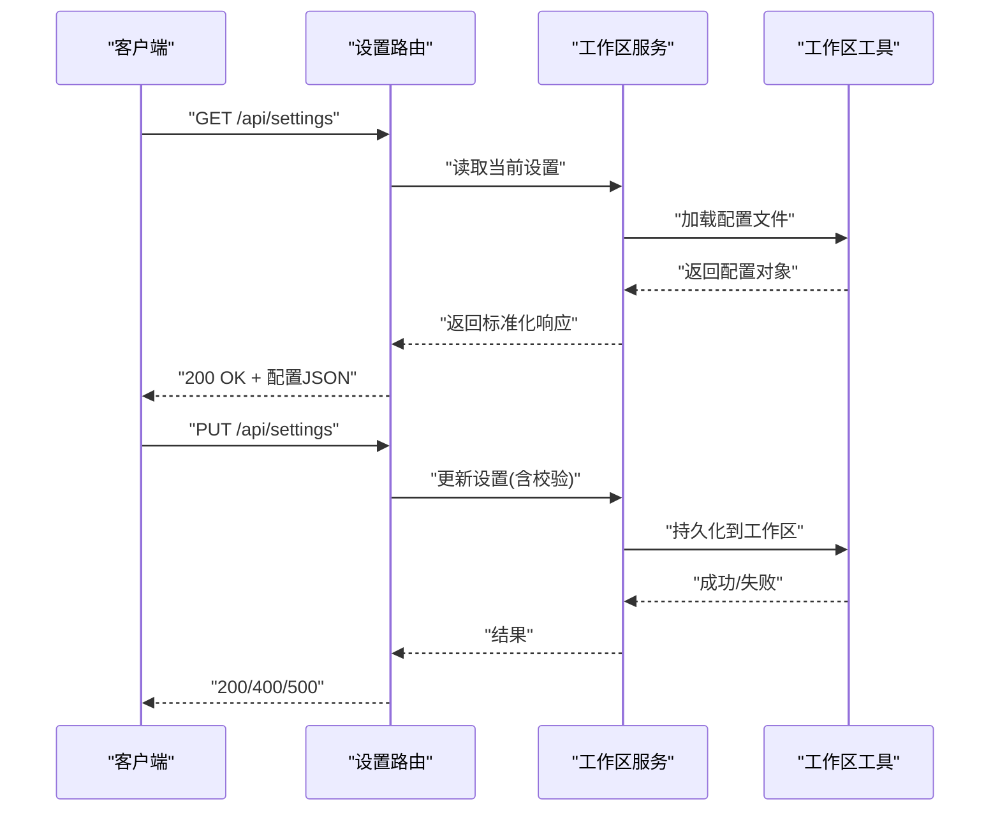
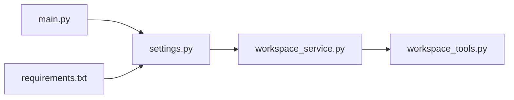

# 设置API接口

<cite>
**本文引用的文件**   
- [backend/app/routers/settings.py](file://backend/app/routers/settings.py)
- [backend/app/main.py](file://backend/app/main.py)
- [backend/app/services/workspace_service.py](file://backend/app/services/workspace_service.py)
- [backend/app/tools/workspace_tools.py](file://backend/app/tools/workspace_tools.py)
- [backend/requirements.txt](file://backend/requirements.txt)
</cite>

## 目录
1. [简介](#简介)
2. [项目结构](#项目结构)
3. [核心组件](#核心组件)
4. [架构总览](#架构总览)
5. [详细组件分析](#详细组件分析)
6. [依赖分析](#依赖分析)
7. [性能考虑](#性能考虑)
8. [故障排查指南](#故障排查指南)
9. [结论](#结论)
10. [附录](#附录)

## 简介
本文件为“设置API接口”的权威文档，聚焦系统配置与用户设置的REST端点。内容涵盖：
- 配置读取、更新、重置等操作的HTTP方法、URL模式、请求参数结构与响应格式
- 数据验证规则与错误码约定
- 完整配置项说明（LLM提供商、工作区配置、用户偏好等）
- 配置文件结构与默认值
- 配置的持久化机制、版本兼容性与迁移策略
- 安全考虑与访问控制机制

## 项目结构
后端采用模块化路由与服务分层设计。设置相关能力由路由层暴露，服务层封装业务逻辑，工具层负责具体I/O操作（如工作区读写）。

图表来源
- [backend/app/routers/settings.py](file://backend/app/routers/settings.py)
- [backend/app/services/workspace_service.py](file://backend/app/services/workspace_service.py)
- [backend/app/tools/workspace_tools.py](file://backend/app/tools/workspace_tools.py)
- [backend/app/main.py](file://backend/app/main.py)

章节来源
- [backend/app/main.py](file://backend/app/main.py)
- [backend/app/routers/settings.py](file://backend/app/routers/settings.py)

## 核心组件
- 设置路由模块：定义所有与“设置”相关的REST端点，包括获取、更新、重置等。
- 工作区服务：提供工作区配置的统一访问接口，屏蔽底层存储细节。
- 工作区工具：实现具体的工作区文件读写、校验与迁移辅助逻辑。

章节来源
- [backend/app/routers/settings.py](file://backend/app/routers/settings.py)
- [backend/app/services/workspace_service.py](file://backend/app/services/workspace_service.py)
- [backend/app/tools/workspace_tools.py](file://backend/app/tools/workspace_tools.py)

## 架构总览
设置API的整体调用链如下：客户端通过HTTP调用设置路由，路由将请求委派给工作区服务，服务再调用工作区工具完成配置文件的读取、写入或迁移。

图表来源
- [backend/app/routers/settings.py](file://backend/app/routers/settings.py)
- [backend/app/services/workspace_service.py](file://backend/app/services/workspace_service.py)
- [backend/app/tools/workspace_tools.py](file://backend/app/tools/workspace_tools.py)

## 详细组件分析

### 设置路由（REST端点）
- URL前缀：/api/settings
- 支持的HTTP方法与用途：
  - GET /api/settings：获取当前系统设置与用户偏好
  - PUT /api/settings：更新系统设置与用户偏好（支持增量或全量覆盖，取决于实现）
  - POST /api/settings/reset：重置为默认配置（可选，若未实现则返回404）
- 请求头：
  - Content-Type: application/json（更新时必需）
- 通用响应格式：
  - 成功：{ "code": 0, "data": { ... }, "message": "ok" }
  - 失败：{ "code": 非0, "message": "错误描述", "details": { ... } }
- 状态码约定：
  - 200：成功
  - 400：请求参数校验失败
  - 404：资源不存在（例如重置端点未实现）
  - 500：服务器内部错误

章节来源
- [backend/app/routers/settings.py](file://backend/app/routers/settings.py)

### 工作区服务（配置访问抽象）
- 职责：
  - 统一读取/更新工作区配置
  - 合并默认值与用户覆盖
  - 触发必要的迁移或校验流程
- 关键行为：
  - 读取：按命名空间（如llm、workspace、user）聚合配置
  - 更新：对输入进行类型与范围校验，落盘后返回最新快照
  - 重置：恢复至默认配置并持久化

章节来源
- [backend/app/services/workspace_service.py](file://backend/app/services/workspace_service.py)

### 工作区工具（持久化与迁移）
- 职责：
  - 读写工作区内的配置文件（如JSON/YAML）
  - 执行配置版本检测与迁移
  - 提供原子写入与回滚保障（若实现）
- 关键点：
  - 默认值注入：当缺失字段时自动补全
  - 兼容性：根据schema版本决定是否需要迁移
  - 幂等性：重复更新不会产生不一致

章节来源
- [backend/app/tools/workspace_tools.py](file://backend/app/tools/workspace_tools.py)

### 配置项说明
以下为常见配置域与典型字段（示例性质，实际以服务端实现为准）：
- LLM提供商
  - provider：字符串，枚举值（如 openai、siliconflow、volcano 等）
  - api_key：字符串，敏感信息，不应在日志中输出
  - base_url：字符串，可选，用于自定义端点
  - model：字符串，模型名称
  - timeout：数字，秒
  - max_tokens：整数
  - temperature：浮点数，[0, 2]
  - top_p：浮点数，[0, 1]
- 工作区配置
  - workspace_dir：字符串，绝对路径或相对路径
  - storage_backend：字符串，如 local、s3（若支持）
  - max_file_size：整数，字节
  - allowed_extensions：字符串数组
- 用户偏好
  - theme：字符串，light/dark
  - language：字符串，i18n代码
  - auto_save：布尔
  - default_model：字符串
- 其他
  - log_level：字符串，debug/info/warning/error
  - cors_origins：字符串数组

注意：
- 敏感字段（如api_key）在响应中应脱敏或省略
- 数值型字段需满足范围约束；越界将返回400

章节来源
- [backend/app/services/workspace_service.py](file://backend/app/services/workspace_service.py)
- [backend/app/tools/workspace_tools.py](file://backend/app/tools/workspace_tools.py)

### 配置文件结构与默认值
- 位置：工作区根目录下（由workspace_dir指定）
- 格式：建议JSON或YAML（以工具实现为准）
- 结构：
  - 顶层包含各命名空间键（llm、workspace、user等）
  - 每个命名空间内包含对应字段及默认值
- 默认值策略：
  - 首次启动或重置时生成
  - 缺失字段自动填充默认值
  - 升级时新增字段可带默认值

章节来源
- [backend/app/tools/workspace_tools.py](file://backend/app/tools/workspace_tools.py)

### 数据验证规则
- 必填字段：provider、api_key、workspace_dir等
- 类型检查：字符串、数字、布尔、数组
- 范围约束：temperature∈[0,2]，top_p∈[0,1]，timeout>0
- 白名单：provider、theme、language等枚举值
- 路径合法性：workspace_dir必须存在且可写
- 大小限制：max_file_size为正数
- 扩展名白名单：allowed_extensions仅允许受控集合

章节来源
- [backend/app/services/workspace_service.py](file://backend/app/services/workspace_service.py)
- [backend/app/tools/workspace_tools.py](file://backend/app/tools/workspace_tools.py)

### 错误处理与响应
- 400 参数错误：返回字段级错误详情（如missing、invalid_type、out_of_range）
- 404 未实现：如POST /api/settings/reset未实现
- 500 内部错误：记录堆栈，对外返回通用错误消息
- 幂等性：重复提交相同配置不会导致副作用

章节来源
- [backend/app/routers/settings.py](file://backend/app/routers/settings.py)

### 安全考虑与访问控制
- 认证鉴权：建议在网关或中间件层统一接入JWT/Session校验
- 最小权限：仅授权角色可修改敏感配置（如LLM密钥）
- 敏感信息保护：
  - 入参不记录明文
  - 出参对密钥类字段脱敏或隐藏
- 输入校验：严格白名单与范围校验，防止注入与越权
- 审计日志：记录关键变更（谁、何时、改了什么）

章节来源
- [backend/app/routers/settings.py](file://backend/app/routers/settings.py)

## 依赖分析
- 框架依赖：FastAPI（基于requirements.txt）
- 模块耦合：
  - 路由层依赖服务层
  - 服务层依赖工具层
  - 工具层负责文件系统与序列化

图表来源
- [backend/app/routers/settings.py](file://backend/app/routers/settings.py)
- [backend/app/services/workspace_service.py](file://backend/app/services/workspace_service.py)
- [backend/app/tools/workspace_tools.py](file://backend/app/tools/workspace_tools.py)
- [backend/app/main.py](file://backend/app/main.py)
- [backend/requirements.txt](file://backend/requirements.txt)

章节来源
- [backend/requirements.txt](file://backend/requirements.txt)
- [backend/app/main.py](file://backend/app/main.py)

## 性能考虑
- 缓存热点配置：对频繁读取的配置（如用户偏好）增加内存缓存
- 批量更新：合并多次小更新为一次落盘，减少IO
- 异步持久化：对非关键路径的写入使用队列异步落盘
- 大文件限制：对上传与存储进行限流与配额管理

## 故障排查指南
- 常见问题
  - 400 参数错误：检查必填字段、类型与范围
  - 404 未实现：确认是否实现了重置端点
  - 500 内部错误：查看服务端日志定位异常堆栈
- 诊断步骤
  - 启用调试日志，捕获请求体与响应体摘要
  - 检查工作区目录权限与磁盘空间
  - 对比默认配置，定位缺失或非法字段
- 快速修复
  - 重置为默认配置后逐步回填差异
  - 修正枚举值与数值范围

章节来源
- [backend/app/routers/settings.py](file://backend/app/routers/settings.py)
- [backend/app/services/workspace_service.py](file://backend/app/services/workspace_service.py)
- [backend/app/tools/workspace_tools.py](file://backend/app/tools/workspace_tools.py)

## 结论
设置API围绕“读取-校验-持久化-返回”的主线展开，通过服务与工具的分层解耦，确保配置的可维护性与可扩展性。建议在生产环境强化鉴权、审计与监控，并对敏感字段实施严格的脱敏与加密策略。

## 附录

### API参考表
- GET /api/settings
  - 功能：获取当前设置
  - 请求参数：无
  - 响应：配置对象（按命名空间组织）
- PUT /api/settings
  - 功能：更新设置
  - 请求体：JSON，包含待更新的字段
  - 响应：更新后的配置快照
- POST /api/settings/reset
  - 功能：重置为默认配置
  - 请求体：无
  - 响应：重置后的配置快照

章节来源
- [backend/app/routers/settings.py](file://backend/app/routers/settings.py)