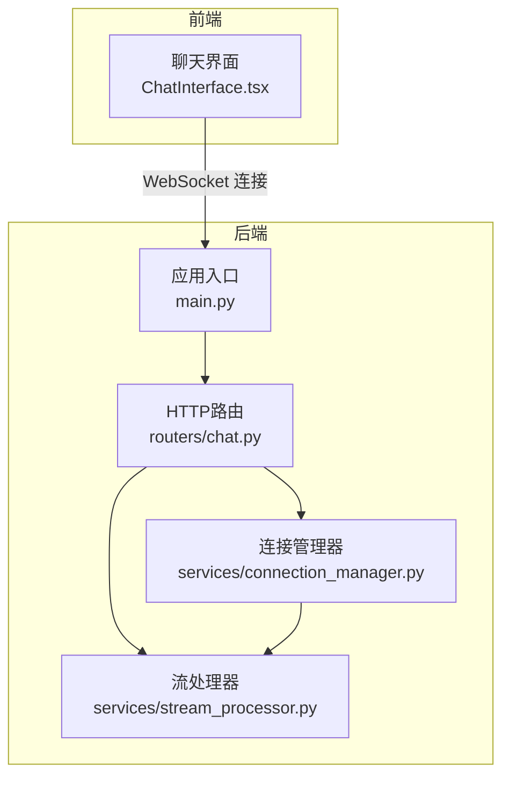
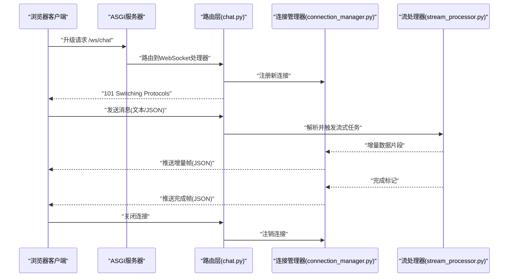
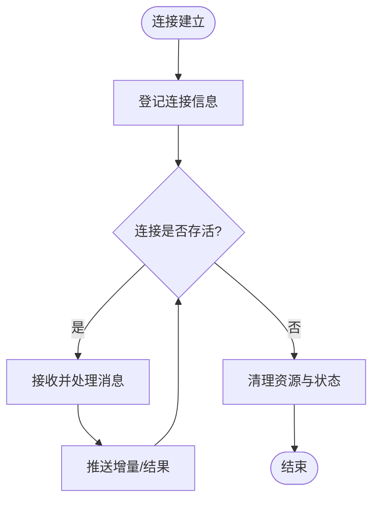
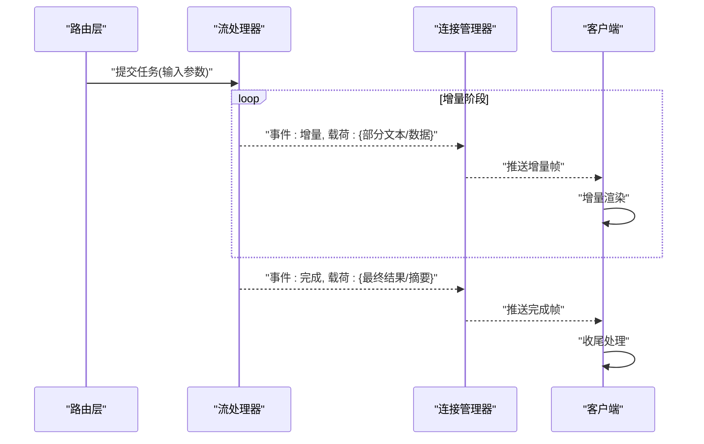
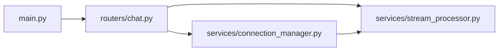

# WebSocket实时通信

<cite>
**本文引用的文件**   
- [backend/app/main.py](file://backend/app/main.py)
- [backend/app/services/connection_manager.py](file://backend/app/services/connection_manager.py)
- [backend/app/services/stream_processor.py](file://backend/app/services/stream_processor.py)
- [backend/app/routers/chat.py](file://backend/app/routers/chat.py)
- [frontend/src/components/ChatInterface.tsx](file://frontend/src/components/ChatInterface.tsx)
</cite>

## 目录
1. [简介](#简介)
2. [项目结构](#项目结构)
3. [核心组件](#核心组件)
4. [架构总览](#架构总览)
5. [详细组件分析](#详细组件分析)
6. [依赖关系分析](#依赖关系分析)
7. [性能考虑](#性能考虑)
8. [故障排查指南](#故障排查指南)
9. [结论](#结论)
10. [附录](#附录)

## 简介
本文件面向后端与前端开发者，系统化说明本项目中WebSocket实时通信的协议、握手流程、连接生命周期管理、消息格式规范、流式数据处理机制、断线重连策略、客户端集成示例、并发控制与内存管理、性能优化建议以及调试与排障方法。文档以仓库现有实现为依据，确保读者能够基于真实代码路径进行定位与扩展。

## 项目结构
本项目采用前后端分离架构：
- 后端（Python）提供HTTP路由与WebSocket服务，负责连接管理、流式处理与业务编排。
- 前端（TypeScript/React）通过浏览器原生WebSocket API建立连接、订阅事件、渲染增量响应并处理错误与重连。

图表来源
- [backend/app/main.py](file://backend/app/main.py)
- [backend/app/routers/chat.py](file://backend/app/routers/chat.py)
- [backend/app/services/connection_manager.py](file://backend/app/services/connection_manager.py)
- [backend/app/services/stream_processor.py](file://backend/app/services/stream_processor.py)
- [frontend/src/components/ChatInterface.tsx](file://frontend/src/components/ChatInterface.tsx)

章节来源
- [backend/app/main.py](file://backend/app/main.py)
- [backend/app/routers/chat.py](file://backend/app/routers/chat.py)
- [backend/app/services/connection_manager.py](file://backend/app/services/connection_manager.py)
- [backend/app/services/stream_processor.py](file://backend/app/services/stream_processor.py)
- [frontend/src/components/ChatInterface.tsx](file://frontend/src/components/ChatInterface.tsx)

## 核心组件
- 应用入口与路由挂载
  - 负责注册HTTP与WebSocket路由，启动ASGI服务器，注入全局配置。
- 连接管理器
  - 维护活跃连接集合、广播消息、按会话或房间维度分发消息、清理离线连接。
- 流处理器
  - 将上游LLM或其他服务的增量输出转换为WebSocket帧，支持分块推送与结束标记。
- 前端聊天界面
  - 封装连接建立、心跳保活、消息订阅、增量渲染、错误与重连逻辑。

章节来源
- [backend/app/main.py](file://backend/app/main.py)
- [backend/app/services/connection_manager.py](file://backend/app/services/connection_manager.py)
- [backend/app/services/stream_processor.py](file://backend/app/services/stream_processor.py)
- [frontend/src/components/ChatInterface.tsx](file://frontend/src/components/ChatInterface.tsx)

## 架构总览
下图展示了从浏览器发起WebSocket连接到服务端处理并返回增量响应的端到端流程。

图表来源
- [backend/app/routers/chat.py](file://backend/app/routers/chat.py)
- [backend/app/services/connection_manager.py](file://backend/app/services/connection_manager.py)
- [backend/app/services/stream_processor.py](file://backend/app/services/stream_processor.py)

## 详细组件分析

### 连接管理与生命周期
- 连接建立
  - 客户端发起WebSocket升级请求至后端路由；路由层校验参数后交由连接管理器登记连接上下文。
- 连接存活
  - 连接管理器维护连接映射表，支持按会话ID或房间ID进行定向推送与广播。
- 连接断开
  - 捕获异常与关闭事件，执行资源释放、清理状态、通知相关订阅者。

图表来源
- [backend/app/services/connection_manager.py](file://backend/app/services/connection_manager.py)

章节来源
- [backend/app/services/connection_manager.py](file://backend/app/services/connection_manager.py)

### 流式数据处理与增量传输
- 流式任务
  - 路由层接收到消息后，调用流处理器执行长时任务，并将增量片段回传给连接管理器。
- 增量帧
  - 流处理器将上游输出的片段序列化为标准JSON帧，包含事件类型、载荷与可选元数据。
- 完成语义
  - 当任务结束时，推送“完成”事件，客户端据此停止追加渲染并更新UI状态。

图表来源
- [backend/app/routers/chat.py](file://backend/app/routers/chat.py)
- [backend/app/services/stream_processor.py](file://backend/app/services/stream_processor.py)
- [backend/app/services/connection_manager.py](file://backend/app/services/connection_manager.py)

章节来源
- [backend/app/routers/chat.py](file://backend/app/routers/chat.py)
- [backend/app/services/stream_processor.py](file://backend/app/services/stream_processor.py)
- [backend/app/services/connection_manager.py](file://backend/app/services/connection_manager.py)

### 消息格式规范
- 序列化格式
  - 所有WebSocket帧均为UTF-8编码的JSON文本。
- 通用字段
  - event: 事件类型字符串，如“增量”、“完成”、“错误”。
  - payload: 数据载荷对象，具体结构随事件类型变化。
  - meta: 可选元数据，如时间戳、会话ID、批次号等。
- 事件类型
  - 增量: 表示流式数据片段，payload包含部分文本或结构化数据。
  - 完成: 表示任务结束，payload包含最终结果或汇总信息。
  - 错误: 表示发生异常，payload包含错误码与描述。
- 客户端行为
  - 根据event字段决定渲染策略；对“增量”追加显示，对“完成”更新状态，对“错误”提示用户并允许重试。

章节来源
- [backend/app/services/stream_processor.py](file://backend/app/services/stream_processor.py)
- [backend/app/services/connection_manager.py](file://backend/app/services/connection_manager.py)
- [frontend/src/components/ChatInterface.tsx](file://frontend/src/components/ChatInterface.tsx)

### 断线重连与心跳保活
- 心跳机制
  - 客户端周期性发送心跳帧，服务端在空闲超时未收到心跳时主动关闭连接，避免僵尸连接占用资源。
- 指数退避重连
  - 客户端在连接失败或异常断开后，采用指数退避策略尝试重连，并在达到最大重试次数后降级为轮询或提示用户。
- 幂等性保障
  - 对于关键操作，客户端携带会话ID或请求ID，服务端保证相同请求的幂等处理，避免重复执行。

章节来源
- [frontend/src/components/ChatInterface.tsx](file://frontend/src/components/ChatInterface.tsx)
- [backend/app/services/connection_manager.py](file://backend/app/services/connection_manager.py)

### 客户端集成示例（概念性步骤）
- 连接管理
  - 初始化WebSocket实例，设置onopen/onmessage/onclose/onerror回调。
  - 在onopen中发送认证或会话初始化消息。
- 消息订阅
  - 监听“增量”事件并追加渲染；监听“完成”事件更新最终结果；监听“错误”事件展示错误信息。
- 错误处理
  - 捕获网络异常与服务端错误，记录日志并触发重连或降级策略。
- 资源释放
  - 在页面卸载或会话结束时主动关闭连接，清理定时器与缓存。

章节来源
- [frontend/src/components/ChatInterface.tsx](file://frontend/src/components/ChatInterface.tsx)

## 依赖关系分析
后端模块间的依赖关系如下：

图表来源
- [backend/app/main.py](file://backend/app/main.py)
- [backend/app/routers/chat.py](file://backend/app/routers/chat.py)
- [backend/app/services/connection_manager.py](file://backend/app/services/connection_manager.py)
- [backend/app/services/stream_processor.py](file://backend/app/services/stream_processor.py)

章节来源
- [backend/app/main.py](file://backend/app/main.py)
- [backend/app/routers/chat.py](file://backend/app/routers/chat.py)
- [backend/app/services/connection_manager.py](file://backend/app/services/connection_manager.py)
- [backend/app/services/stream_processor.py](file://backend/app/services/stream_processor.py)

## 性能考虑
- 并发连接控制
  - 使用连接池或限流器限制单进程/单实例的最大并发连接数，防止资源耗尽。
- 内存管理
  - 及时释放已关闭连接的上下文与缓冲区；对大对象采用引用计数或弱引用，避免内存泄漏。
- 流式优化
  - 合理设置增量帧大小，避免过小的帧导致频繁I/O开销；必要时合并小片段再推送。
- 背压与缓冲
  - 当客户端消费速度慢时，服务端应实施背压策略，暂停上游生成或丢弃非关键增量，保护系统稳定。
- 水平扩展
  - 在多实例部署下，使用外部消息总线或共享存储协调广播与会话状态一致性。

[本节为通用指导，不直接分析具体文件]

## 故障排查指南
- 常见问题
  - 连接无法建立：检查路由是否正确注册、跨域配置、防火墙与代理设置。
  - 消息丢失：确认客户端心跳是否正常、服务端是否因空闲超时关闭连接。
  - 增量乱序：确保客户端按事件顺序渲染，必要时引入序列号进行排序。
  - 内存增长：排查是否存在未释放的连接上下文或过大缓冲区。
- 调试工具
  - 浏览器开发者工具的Network面板查看WebSocket帧内容。
  - 后端日志记录关键事件（连接、断开、错误、任务开始/结束）。
  - 使用抓包工具（如Wireshark）验证帧结构与网络延迟。
- 快速定位
  - 在路由层打印入参与出参，确认消息格式是否符合规范。
  - 在连接管理器中统计活跃连接数与广播耗时，识别瓶颈。

章节来源
- [backend/app/routers/chat.py](file://backend/app/routers/chat.py)
- [backend/app/services/connection_manager.py](file://backend/app/services/connection_manager.py)
- [frontend/src/components/ChatInterface.tsx](file://frontend/src/components/ChatInterface.tsx)

## 结论
本项目的WebSocket实时通信围绕“连接管理—流式处理—增量推送”的核心链路构建，具备清晰的协议约定与可扩展的组件设计。通过合理的并发控制、内存管理与重连策略，可在高负载场景下保持稳定与高效。建议在前端侧完善错误恢复与用户体验反馈，在后端侧持续监控连接与流式任务指标，以实现更稳健的实时通信能力。

[本节为总结性内容，不直接分析具体文件]

## 附录
- 术语表
  - 增量帧：包含部分数据的WebSocket消息帧。
  - 完成帧：表示任务结束的WebSocket消息帧。
  - 心跳帧：用于维持连接活跃的轻量级消息。
- 参考路径
  - 后端入口与路由：[backend/app/main.py](file://backend/app/main.py)、[backend/app/routers/chat.py](file://backend/app/routers/chat.py)
  - 连接管理：[backend/app/services/connection_manager.py](file://backend/app/services/connection_manager.py)
  - 流式处理：[backend/app/services/stream_processor.py](file://backend/app/services/stream_processor.py)
  - 前端集成：[frontend/src/components/ChatInterface.tsx](file://frontend/src/components/ChatInterface.tsx)