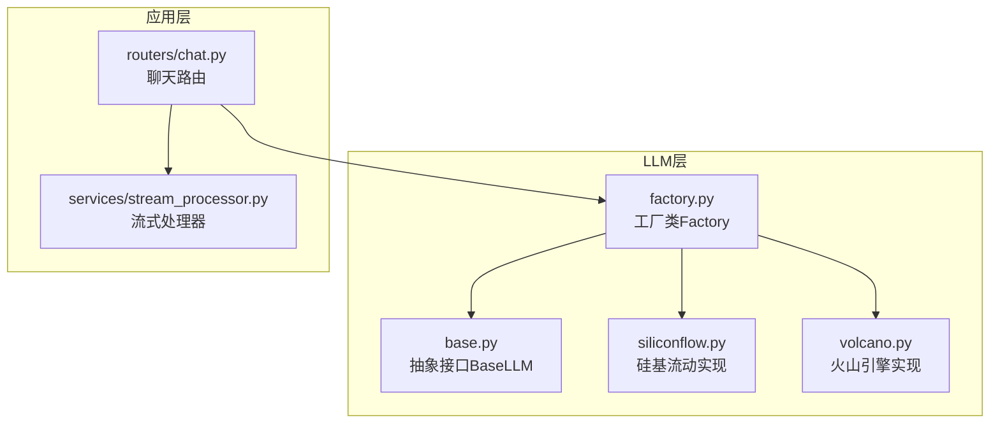
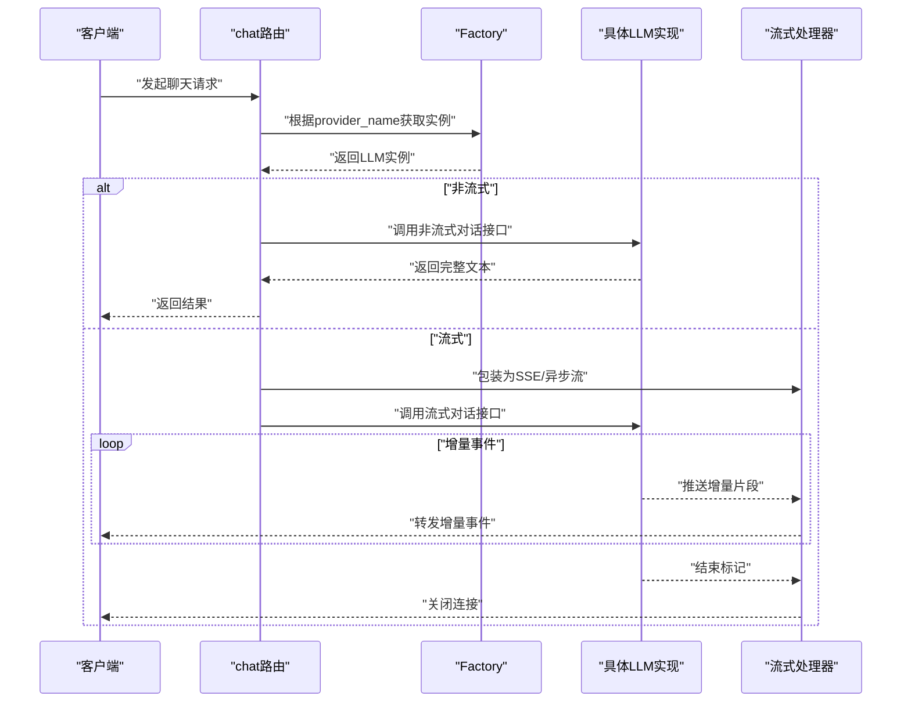
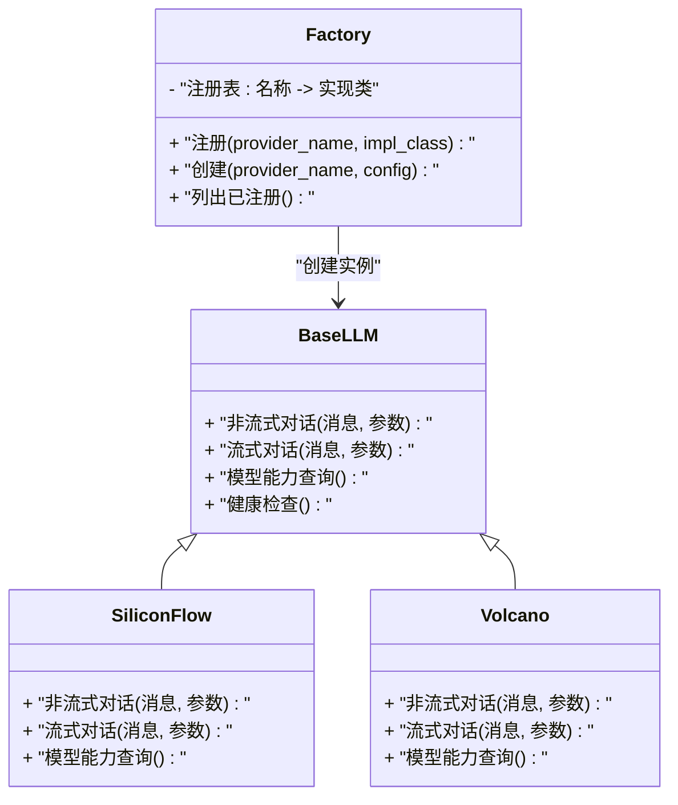
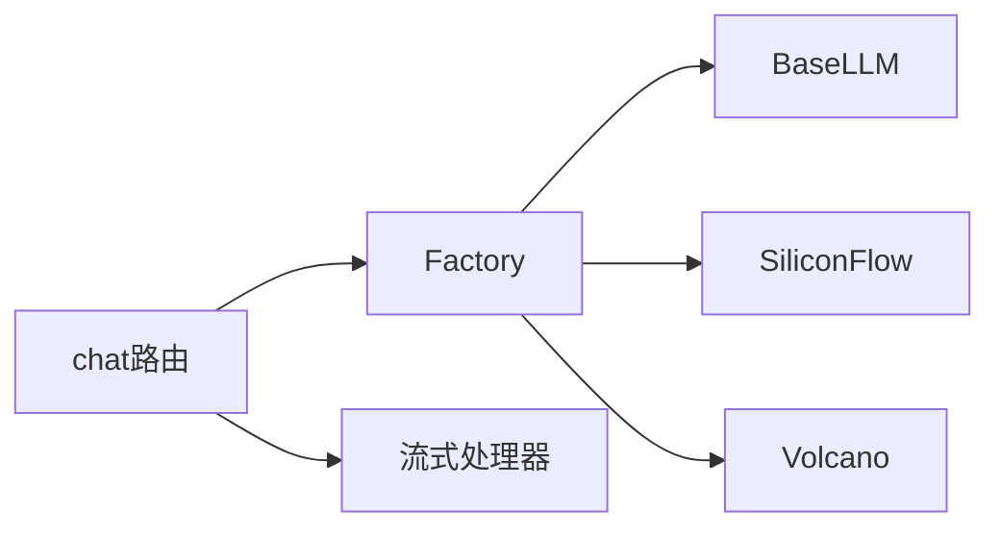

# LLM工厂模式实现

<cite>
**本文引用的文件**   
- [backend/app/llm/base.py](file://backend/app/llm/base.py)
- [backend/app/llm/factory.py](file://backend/app/llm/factory.py)
- [backend/app/llm/siliconflow.py](file://backend/app/llm/siliconflow.py)
- [backend/app/llm/volcano.py](file://backend/app/llm/volcano.py)
- [backend/app/routers/chat.py](file://backend/app/routers/chat.py)
- [backend/app/services/stream_processor.py](file://backend/app/services/stream_processor.py)
</cite>

## 目录
1. [简介](#简介)
2. [项目结构](#项目结构)
3. [核心组件](#核心组件)
4. [架构总览](#架构总览)
5. [详细组件分析](#详细组件分析)
6. [依赖关系分析](#依赖关系分析)
7. [性能考虑](#性能考虑)
8. [故障排查指南](#故障排查指南)
9. [结论](#结论)
10. [附录：扩展新LLM提供商指南](#附录扩展新llm提供商指南)

## 简介
本技术文档围绕后端模块中的LLM工厂模式实现，系统性阐述抽象接口BaseLLM的设计理念与统一方法规范（消息处理、流式响应、错误处理），深入解析工厂类Factory的注册表管理、动态实例化策略、配置加载与校验机制，并说明提供商发现、依赖注入与生命周期管理。同时提供扩展新LLM提供商的完整步骤、配置格式规范与测试建议，以及性能优化、缓存策略与故障恢复的实践建议。

## 项目结构
本项目采用分层组织方式，LLM相关代码集中在 backend/app/llm 目录下，包含抽象基类、具体提供商实现与工厂类；上层路由与服务通过工厂获取LLM实例，并在需要时结合流式处理器进行SSE或异步流输出。

图表来源
- [backend/app/llm/base.py](file://backend/app/llm/base.py)
- [backend/app/llm/factory.py](file://backend/app/llm/factory.py)
- [backend/app/llm/siliconflow.py](file://backend/app/llm/siliconflow.py)
- [backend/app/llm/volcano.py](file://backend/app/llm/volcano.py)
- [backend/app/routers/chat.py](file://backend/app/routers/chat.py)
- [backend/app/services/stream_processor.py](file://backend/app/services/stream_processor.py)

章节来源
- [backend/app/llm/base.py](file://backend/app/llm/base.py)
- [backend/app/llm/factory.py](file://backend/app/llm/factory.py)
- [backend/app/llm/siliconflow.py](file://backend/app/llm/siliconflow.py)
- [backend/app/llm/volcano.py](file://backend/app/llm/volcano.py)
- [backend/app/routers/chat.py](file://backend/app/routers/chat.py)
- [backend/app/services/stream_processor.py](file://backend/app/services/stream_processor.py)

## 核心组件
- BaseLLM（抽象接口）
  - 定义统一的LLM调用契约，包括非流式对话、流式对话、模型能力查询等核心方法。
  - 约定错误类型与异常传播方式，确保上层可一致捕获与处理。
  - 为流式响应定义一致的增量事件语义，便于上层流式处理器消费。
- Factory（工厂类）
  - 维护提供商注册表，支持按名称动态创建对应LLM实例。
  - 负责从配置中读取参数并进行校验，完成依赖注入。
  - 提供单例或按需创建的生命周期策略，避免重复初始化开销。
- 具体提供商实现（SiliconFlow、Volcano）
  - 继承BaseLLM，实现各自API的HTTP调用、鉴权、重试与错误映射。
  - 暴露各自的模型列表与能力元数据，供上层选择与展示。

章节来源
- [backend/app/llm/base.py](file://backend/app/llm/base.py)
- [backend/app/llm/factory.py](file://backend/app/llm/factory.py)
- [backend/app/llm/siliconflow.py](file://backend/app/llm/siliconflow.py)
- [backend/app/llm/volcano.py](file://backend/app/llm/volcano.py)

## 架构总览
下图展示了从路由到工厂再到具体LLM实现的调用链，以及流式响应的处理路径。

图表来源
- [backend/app/routers/chat.py](file://backend/app/routers/chat.py)
- [backend/app/llm/factory.py](file://backend/app/llm/factory.py)
- [backend/app/llm/base.py](file://backend/app/llm/base.py)
- [backend/app/llm/siliconflow.py](file://backend/app/llm/siliconflow.py)
- [backend/app/llm/volcano.py](file://backend/app/llm/volcano.py)
- [backend/app/services/stream_processor.py](file://backend/app/services/stream_processor.py)

## 详细组件分析

### BaseLLM抽象接口设计
- 设计理念
  - 以最小且稳定的契约屏蔽不同LLM提供商的差异，使上层业务无需关心底层实现细节。
  - 将“消息处理”“流式响应”“错误处理”统一抽象，保证跨提供商的一致体验。
- 核心方法（概念性描述）
  - 非流式对话：接收消息序列与模型参数，返回完整响应文本。
  - 流式对话：返回可迭代的增量事件流，每个事件包含角色、内容片段与可选元信息。
  - 模型能力查询：返回支持的模型清单与特性（如是否支持流式、工具调用等）。
  - 健康检查/就绪状态：用于服务编排与负载均衡探测。
- 错误处理规范
  - 定义统一的异常层次，区分网络错误、认证失败、限流、模型不可用等场景。
  - 在异常中包含可诊断信息（如请求ID、上游错误码），便于日志追踪与告警。
- 流式响应协议
  - 事件类型：开始、增量、结束、错误。
  - 字段约定：角色、内容片段、索引、时间戳、可选统计信息（token计数等）。

章节来源
- [backend/app/llm/base.py](file://backend/app/llm/base.py)

### Factory工厂类实现机制
- 提供商注册表管理
  - 内部维护一个名称到实现类的映射表，支持静态注册与动态注册两种模式。
  - 提供查询、列出、删除等管理能力，便于运行时扩展。
- 动态实例化策略
  - 基于provider_name查找实现类，使用反射或构造器创建实例。
  - 支持多实例与单例策略，默认可按需创建并在工厂内缓存。
- 配置加载与验证逻辑
  - 从集中配置源（环境变量/配置文件）读取各提供商所需参数（如密钥、端点、超时）。
  - 对必填项进行存在性与格式校验，缺失或非法则抛出明确的配置错误。
- 依赖注入与生命周期
  - 将HTTP客户端、重试策略、日志器等通用依赖注入到LLM实例。
  - 提供启动期初始化与关闭期资源释放钩子，确保连接池、线程池等资源正确管理。

章节来源
- [backend/app/llm/factory.py](file://backend/app/llm/factory.py)

### 具体提供商实现（SiliconFlow、Volcano）
- SiliconFlow实现要点
  - 遵循BaseLLM契约，封装其REST API调用与鉴权流程。
  - 将上游错误码映射为本系统统一异常，保证错误一致性。
  - 实现流式事件解析，将上游增量转换为标准事件流。
- Volcano实现要点
  - 同上，适配火山引擎的接口差异（如模型名、参数命名、分页/分页游标等）。
  - 针对其速率限制与重试策略进行调优，提升稳定性。
- 能力元数据
  - 各自声明支持的模型列表与特性，供上层展示与选择。

章节来源
- [backend/app/llm/siliconflow.py](file://backend/app/llm/siliconflow.py)
- [backend/app/llm/volcano.py](file://backend/app/llm/volcano.py)

### 路由与服务集成
- 路由层（chat）
  - 接收用户请求，解析provider_name与消息体，调用Factory获取LLM实例。
  - 根据请求标志决定走非流式或流式分支，必要时接入流式处理器。
- 流式处理器（stream_processor）
  - 将LLM提供的增量事件转换为前端友好的SSE或WebSocket帧。
  - 负责背压控制、超时与断线重连提示。

章节来源
- [backend/app/routers/chat.py](file://backend/app/routers/chat.py)
- [backend/app/services/stream_processor.py](file://backend/app/services/stream_processor.py)

#### 类图（代码级关系）

图表来源
- [backend/app/llm/base.py](file://backend/app/llm/base.py)
- [backend/app/llm/factory.py](file://backend/app/llm/factory.py)
- [backend/app/llm/siliconflow.py](file://backend/app/llm/siliconflow.py)
- [backend/app/llm/volcano.py](file://backend/app/llm/volcano.py)

## 依赖关系分析
- 组件耦合
  - 路由仅依赖Factory与BaseLLM契约，不感知具体实现，降低耦合度。
  - Factory集中管理注册与实例化，是LLM层的唯一入口。
- 外部依赖
  - HTTP客户端、重试库、日志与指标采集等通用依赖由工厂注入。
  - 各提供商可能依赖特定SDK或HTTP头签名算法。
- 潜在循环依赖
  - 当前结构无循环导入风险；新增实现应仅依赖BaseLLM与通用工具。

图表来源
- [backend/app/routers/chat.py](file://backend/app/routers/chat.py)
- [backend/app/llm/factory.py](file://backend/app/llm/factory.py)
- [backend/app/llm/base.py](file://backend/app/llm/base.py)
- [backend/app/llm/siliconflow.py](file://backend/app/llm/siliconflow.py)
- [backend/app/llm/volcano.py](file://backend/app/llm/volcano.py)
- [backend/app/services/stream_processor.py](file://backend/app/services/stream_processor.py)

章节来源
- [backend/app/routers/chat.py](file://backend/app/routers/chat.py)
- [backend/app/llm/factory.py](file://backend/app/llm/factory.py)
- [backend/app/llm/base.py](file://backend/app/llm/base.py)
- [backend/app/llm/siliconflow.py](file://backend/app/llm/siliconflow.py)
- [backend/app/llm/volcano.py](file://backend/app/llm/volcano.py)
- [backend/app/services/stream_processor.py](file://backend/app/services/stream_processor.py)

## 性能考虑
- 连接复用与池化
  - 为HTTP客户端启用连接池，减少握手开销。
  - 合理设置最大连接数与空闲超时，避免资源泄露。
- 并发与背压
  - 流式处理采用异步迭代，避免阻塞I/O。
  - 对上游限流进行退避与重试，防止雪崩。
- 缓存策略
  - 对模型能力元数据做短期缓存，减少频繁查询。
  - 对短上下文问答可做结果缓存（注意键空间与失效策略）。
- 资源清理
  - 在进程退出或容器重启时主动关闭连接池与定时器。

[本节为通用指导，不涉及具体文件]

## 故障排查指南
- 常见问题定位
  - 配置缺失或非法：检查必填项（密钥、端点、超时）是否正确加载与校验。
  - 认证失败：核对签名算法、Token有效期与权限范围。
  - 限流与超时：观察上游返回码与延迟分布，调整重试与超时参数。
- 日志与追踪
  - 记录每次请求的唯一ID、上游错误码与耗时，便于链路追踪。
  - 对关键路径打点（创建实例、首次调用、错误率、P99延迟）。
- 快速恢复
  - 自动重试与指数退避，配合熔断降级（切换备用提供商或返回友好提示）。
  - 健康检查探针失败时剔除实例，避免流量打到不可用节点。

章节来源
- [backend/app/llm/factory.py](file://backend/app/llm/factory.py)
- [backend/app/llm/base.py](file://backend/app/llm/base.py)
- [backend/app/llm/siliconflow.py](file://backend/app/llm/siliconflow.py)
- [backend/app/llm/volcano.py](file://backend/app/llm/volcano.py)

## 结论
通过BaseLLM抽象与Factory工厂的统一编排，本项目实现了跨LLM提供商的可插拔架构。该设计降低了耦合度，提升了可扩展性与可维护性。配合完善的错误处理、流式协议与性能优化策略，可在复杂生产环境中稳定运行。

[本节为总结性内容，不涉及具体文件]

## 附录：扩展新LLM提供商指南
- 接口实现要求
  - 新建实现类并继承BaseLLM，实现所有必需方法（非流式对话、流式对话、模型能力查询、健康检查）。
  - 严格遵循错误映射规范，将上游异常转换为本系统统一异常。
  - 若实现流式，请确保事件结构与字段语义与BaseLLM约定一致。
- 配置格式规范
  - 在配置源中为该提供商添加必要参数（如密钥、端点、超时、重试次数）。
  - 确保Factory能读取并校验这些参数，缺失或非法时应给出明确错误信息。
- 注册与发现
  - 在Factory中注册新的provider_name到实现类的映射，或通过动态注册机制在启动期加载。
  - 如需热更新，提供运行时注册/注销接口并确保线程安全。
- 依赖注入
  - 将HTTP客户端、重试策略、日志器、指标收集器等通用依赖注入到新实现中。
- 测试用例编写
  - 单元测试：覆盖正常路径、边界条件与错误分支（认证失败、限流、超时）。
  - 集成测试：对接真实或Mock的上游服务，验证流式事件与错误处理。
  - 回归测试：确保新增实现不影响其他提供商与工厂行为。
- 上线与监控
  - 增加健康检查与指标上报，观察错误率与延迟。
  - 灰度发布与回滚预案，确保问题可快速恢复。

章节来源
- [backend/app/llm/base.py](file://backend/app/llm/base.py)
- [backend/app/llm/factory.py](file://backend/app/llm/factory.py)
- [backend/app/llm/siliconflow.py](file://backend/app/llm/siliconflow.py)
- [backend/app/llm/volcano.py](file://backend/app/llm/volcano.py)