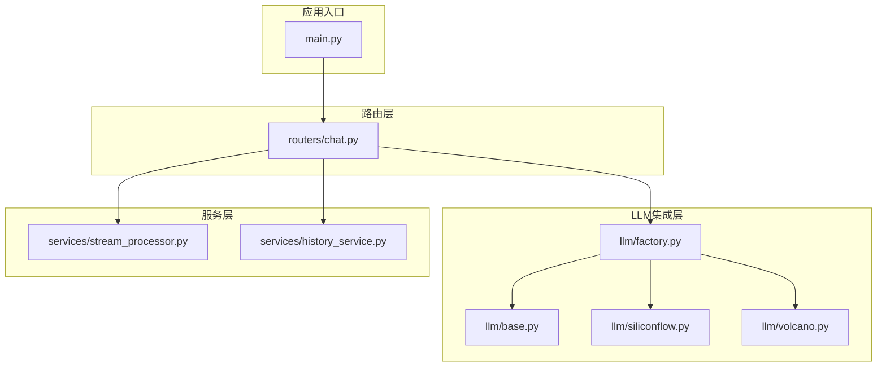
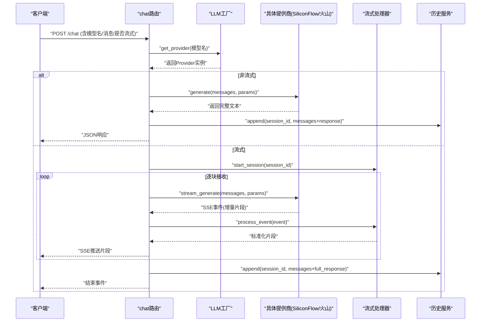
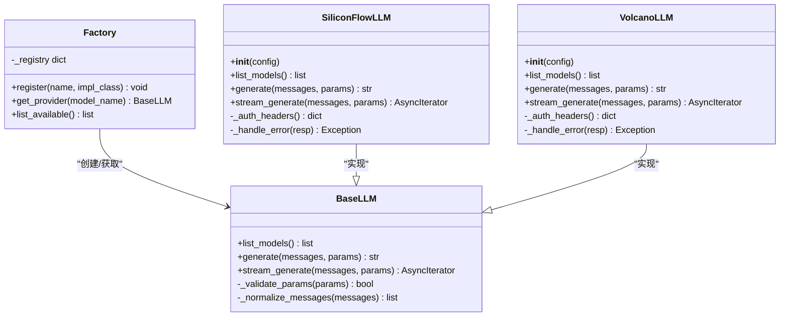
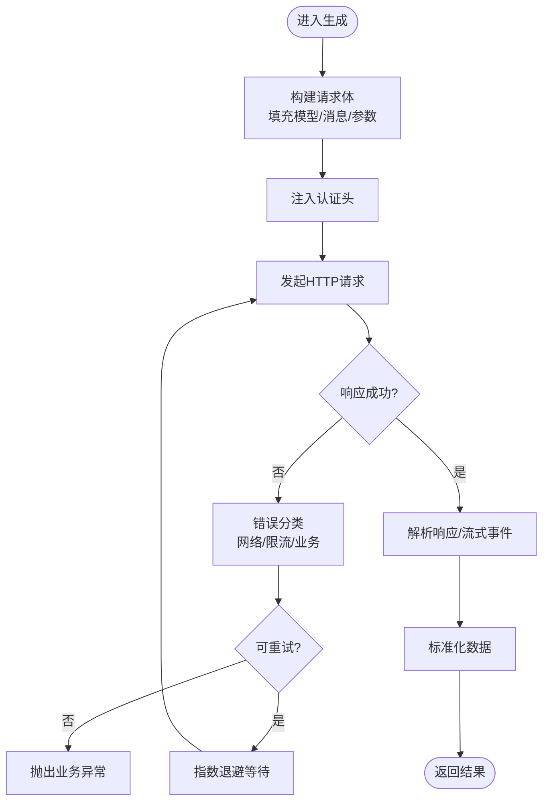
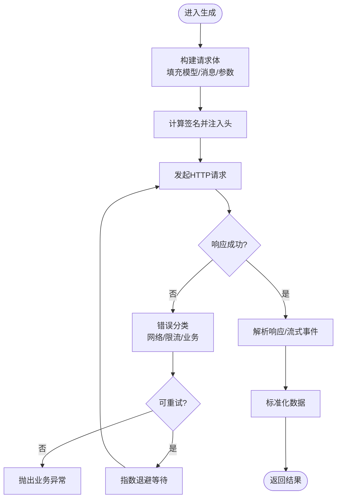
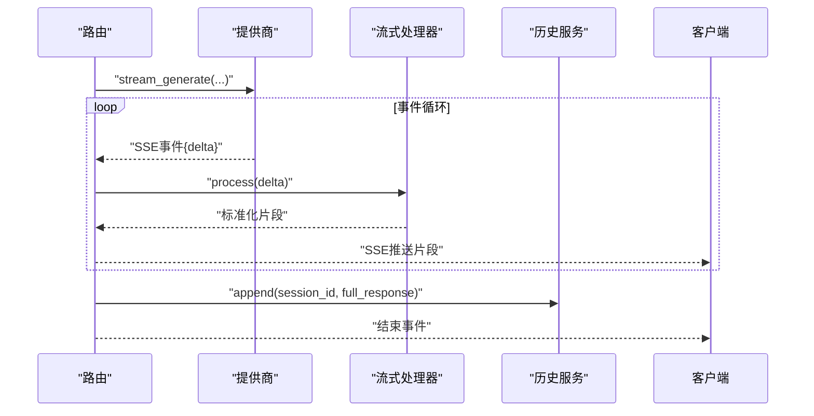
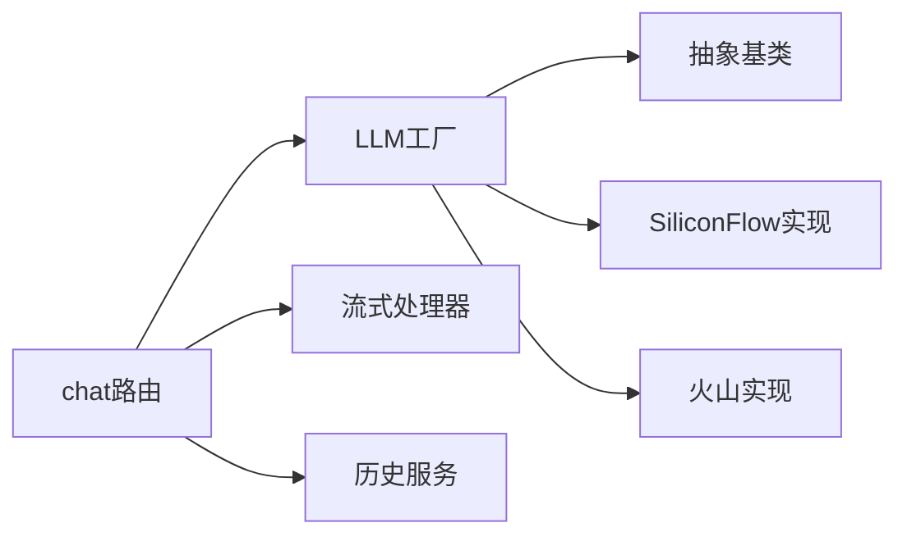

# LLM集成系统

<cite>
**本文引用的文件**   
- [backend/app/llm/base.py](file://backend/app/llm/base.py)
- [backend/app/llm/factory.py](file://backend/app/llm/factory.py)
- [backend/app/llm/siliconflow.py](file://backend/app/llm/siliconflow.py)
- [backend/app/llm/volcano.py](file://backend/app/llm/volcano.py)
- [backend/app/routers/chat.py](file://backend/app/routers/chat.py)
- [backend/app/services/stream_processor.py](file://backend/app/services/stream_processor.py)
- [backend/app/services/history_service.py](file://backend/app/services/history_service.py)
- [backend/app/main.py](file://backend/app/main.py)
</cite>

## 目录
1. [简介](#简介)
2. [项目结构](#项目结构)
3. [核心组件](#核心组件)
4. [架构总览](#架构总览)
5. [详细组件分析](#详细组件分析)
6. [依赖关系分析](#依赖关系分析)
7. [性能考虑](#性能考虑)
8. [故障排查指南](#故障排查指南)
9. [结论](#结论)
10. [附录：新增LLM提供商指南](#附录新增llm提供商指南)

## 简介
本技术文档面向LLM集成子系统，聚焦工厂模式实现、抽象接口设计、提供商注册与动态加载策略；深入解析SiliconFlow与火山引擎的认证方式、API调用封装、错误处理与重试机制；说明流式响应处理、上下文管理与消息格式转换；并提供添加新LLM提供商的完整规范、测试要求与部署注意事项。同时给出性能优化技巧、成本控制策略与故障排查方法，帮助读者快速理解并扩展该集成系统。

## 项目结构
后端采用模块化分层组织，LLM相关代码集中于 backend/app/llm 目录，通过路由层暴露聊天能力，服务层负责流式处理与历史管理。

图示来源
- [backend/app/main.py](file://backend/app/main.py)
- [backend/app/routers/chat.py](file://backend/app/routers/chat.py)
- [backend/app/llm/base.py](file://backend/app/llm/base.py)
- [backend/app/llm/factory.py](file://backend/app/llm/factory.py)
- [backend/app/llm/siliconflow.py](file://backend/app/llm/siliconflow.py)
- [backend/app/llm/volcano.py](file://backend/app/llm/volcano.py)
- [backend/app/services/stream_processor.py](file://backend/app/services/stream_processor.py)
- [backend/app/services/history_service.py](file://backend/app/services/history_service.py)

章节来源
- [backend/app/main.py](file://backend/app/main.py)
- [backend/app/routers/chat.py](file://backend/app/routers/chat.py)
- [backend/app/llm/base.py](file://backend/app/llm/base.py)
- [backend/app/llm/factory.py](file://backend/app/llm/factory.py)
- [backend/app/llm/siliconflow.py](file://backend/app/llm/siliconflow.py)
- [backend/app/llm/volcano.py](file://backend/app/llm/volcano.py)
- [backend/app/services/stream_processor.py](file://backend/app/services/stream_processor.py)
- [backend/app/services/history_service.py](file://backend/app/services/history_service.py)

## 核心组件
- 抽象基类（Base）：定义统一的LLM客户端接口，包括模型列表查询、文本生成、流式生成等契约，屏蔽不同提供商差异。
- 工厂（Factory）：集中注册与动态加载具体提供商实现，根据配置或请求参数选择目标实现，支持热插拔扩展。
- SiliconFlow实现：封装SiliconFlow的认证、请求构造、响应解析、错误码映射与重试策略。
- 火山引擎实现：封装火山引擎的认证、请求构造、响应解析、错误码映射与重试策略。
- 流式处理器：统一处理SSE/流式事件，转换为前端友好的增量片段，维护会话上下文。
- 历史服务：持久化对话历史，提供按会话ID检索与追加能力。

章节来源
- [backend/app/llm/base.py](file://backend/app/llm/base.py)
- [backend/app/llm/factory.py](file://backend/app/llm/factory.py)
- [backend/app/llm/siliconflow.py](file://backend/app/llm/siliconflow.py)
- [backend/app/llm/volcano.py](file://backend/app/llm/volcano.py)
- [backend/app/services/stream_processor.py](file://backend/app/services/stream_processor.py)
- [backend/app/services/history_service.py](file://backend/app/services/history_service.py)

## 架构总览
整体采用“路由-工厂-提供商”的分层架构，结合服务层完成流式处理与历史管理。

图示来源
- [backend/app/routers/chat.py](file://backend/app/routers/chat.py)
- [backend/app/llm/factory.py](file://backend/app/llm/factory.py)
- [backend/app/llm/siliconflow.py](file://backend/app/llm/siliconflow.py)
- [backend/app/llm/volcano.py](file://backend/app/llm/volcano.py)
- [backend/app/services/stream_processor.py](file://backend/app/services/stream_processor.py)
- [backend/app/services/history_service.py](file://backend/app/services/history_service.py)

## 详细组件分析

### 抽象接口与工厂模式
- 抽象基类定义了统一的方法签名与异常约定，确保各提供商实现一致的行为边界。
- 工厂维护提供商名称到实现的映射，支持运行时注册与按需加载，避免启动期耦合。
- 典型流程：路由根据请求中的模型标识选择实现，工厂返回对应实例，随后调用其生成接口。

图示来源
- [backend/app/llm/base.py](file://backend/app/llm/base.py)
- [backend/app/llm/factory.py](file://backend/app/llm/factory.py)
- [backend/app/llm/siliconflow.py](file://backend/app/llm/siliconflow.py)
- [backend/app/llm/volcano.py](file://backend/app/llm/volcano.py)

章节来源
- [backend/app/llm/base.py](file://backend/app/llm/base.py)
- [backend/app/llm/factory.py](file://backend/app/llm/factory.py)
- [backend/app/llm/siliconflow.py](file://backend/app/llm/siliconflow.py)
- [backend/app/llm/volcano.py](file://backend/app/llm/volcano.py)

### SiliconFlow集成实现
- 认证方式：基于密钥的鉴权头注入，支持从环境变量或配置文件读取。
- API调用封装：统一构建请求体、设置超时与重试次数，将第三方响应映射为内部标准结构。
- 错误处理与重试：对网络异常、限流与业务错误进行分类，触发指数退避重试；不可重试错误直接上抛。
- 流式响应：解析SSE事件流，提取增量内容并转发给上层。

图示来源
- [backend/app/llm/siliconflow.py](file://backend/app/llm/siliconflow.py)

章节来源
- [backend/app/llm/siliconflow.py](file://backend/app/llm/siliconflow.py)

### 火山引擎集成实现
- 认证方式：遵循火山引擎鉴权规范，计算签名并注入请求头。
- API调用封装：统一封装多端点调用，适配不同模型的入参差异。
- 错误处理与重试：区分服务端错误码，针对临时性错误进行重试，持久性错误快速失败。
- 流式响应：兼容SSE/分块传输，统一转换为增量片段。

图示来源
- [backend/app/llm/volcano.py](file://backend/app/llm/volcano.py)

章节来源
- [backend/app/llm/volcano.py](file://backend/app/llm/volcano.py)

### 流式响应处理与上下文管理
- 流式处理器维护会话状态，合并增量片段，保证最终一致性。
- 路由层在流式模式下将SSE事件标准化后推送至客户端，并在结束时写入完整历史。
- 历史服务按会话ID聚合消息，支持回溯与续聊。

图示来源
- [backend/app/routers/chat.py](file://backend/app/routers/chat.py)
- [backend/app/services/stream_processor.py](file://backend/app/services/stream_processor.py)
- [backend/app/services/history_service.py](file://backend/app/services/history_service.py)

章节来源
- [backend/app/routers/chat.py](file://backend/app/routers/chat.py)
- [backend/app/services/stream_processor.py](file://backend/app/services/stream_processor.py)
- [backend/app/services/history_service.py](file://backend/app/services/history_service.py)

### 消息格式转换与上下文管理
- 输入侧：将前端消息数组转换为提供商要求的消息结构，补齐角色、工具调用等字段。
- 输出侧：将提供商返回的结构标准化为内部消息对象，便于历史存储与后续拼接。
- 上下文窗口：在组装历史时进行裁剪与摘要，控制Token用量与延迟。

章节来源
- [backend/app/llm/base.py](file://backend/app/llm/base.py)
- [backend/app/llm/siliconflow.py](file://backend/app/llm/siliconflow.py)
- [backend/app/llm/volcano.py](file://backend/app/llm/volcano.py)
- [backend/app/services/history_service.py](file://backend/app/services/history_service.py)

## 依赖关系分析
- 路由层依赖工厂与服务层，不直接耦合具体提供商。
- 工厂仅依赖抽象基类与已注册的提供商实现，保持低耦合。
- 提供商实现之间相互独立，通过统一接口被工厂调度。

图示来源
- [backend/app/routers/chat.py](file://backend/app/routers/chat.py)
- [backend/app/llm/factory.py](file://backend/app/llm/factory.py)
- [backend/app/llm/base.py](file://backend/app/llm/base.py)
- [backend/app/llm/siliconflow.py](file://backend/app/llm/siliconflow.py)
- [backend/app/llm/volcano.py](file://backend/app/llm/volcano.py)
- [backend/app/services/stream_processor.py](file://backend/app/services/stream_processor.py)
- [backend/app/services/history_service.py](file://backend/app/services/history_service.py)

章节来源
- [backend/app/routers/chat.py](file://backend/app/routers/chat.py)
- [backend/app/llm/factory.py](file://backend/app/llm/factory.py)
- [backend/app/llm/base.py](file://backend/app/llm/base.py)
- [backend/app/llm/siliconflow.py](file://backend/app/llm/siliconflow.py)
- [backend/app/llm/volcano.py](file://backend/app/llm/volcano.py)
- [backend/app/services/stream_processor.py](file://backend/app/services/stream_processor.py)
- [backend/app/services/history_service.py](file://backend/app/services/history_service.py)

## 性能考虑
- 连接复用：使用HTTP连接池减少握手开销，合理设置最大连接数与空闲超时。
- 并发控制：限制并发请求上限，避免下游限流；对热点模型做本地缓存（如模型列表）。
- 流式优先：长文本场景优先使用流式，降低首字节延迟与内存占用。
- 上下文裁剪：对历史消息进行长度与Token估算裁剪，必要时启用摘要压缩。
- 重试与退避：对瞬态错误采用指数退避，避免雪崩；对幂等请求谨慎重试。
- 成本优化：选择性价比更高的模型；对高频短问答使用轻量模型；批量请求合并。

[本节为通用指导，无需源码引用]

## 故障排查指南
- 认证失败：检查密钥/签名是否正确注入，确认环境变量与配置优先级。
- 限流与配额：观察错误码是否为限流，调整重试间隔与并发度；必要时降级到备用模型。
- 网络抖动：开启重试与超时保护，记录失败率与耗时分布，定位不稳定节点。
- 流式中断：校验SSE事件完整性，确保客户端重连与断点续传逻辑健壮。
- 上下文溢出：监控Token使用量，自动裁剪历史或提示用户精简输入。
- 日志与追踪：为关键路径埋点，记录请求ID、模型名、耗时、错误码与重试次数。

章节来源
- [backend/app/llm/siliconflow.py](file://backend/app/llm/siliconflow.py)
- [backend/app/llm/volcano.py](file://backend/app/llm/volcano.py)
- [backend/app/routers/chat.py](file://backend/app/routers/chat.py)
- [backend/app/services/stream_processor.py](file://backend/app/services/stream_processor.py)

## 结论
本集成系统通过抽象接口与工厂模式实现了多LLM提供商的统一接入，具备可扩展、易维护与高可用的特性。SiliconFlow与火山引擎的具体实现遵循一致的认证、封装、错误处理与重试规范，配合流式处理与上下文管理，满足生产环境对性能与稳定性的要求。按照附录指南新增提供商可快速扩展生态，同时建议持续优化成本与稳定性指标。

[本节为总结，无需源码引用]

## 附录：新增LLM提供商指南

### 接口实现规范
- 继承抽象基类，实现以下方法：
  - 模型列表查询
  - 文本生成（同步）
  - 流式生成（异步迭代器）
  - 私有辅助方法：认证头构建、错误分类与处理、消息规范化
- 遵循统一的异常类型与错误码映射，确保上层可识别与重试策略生效。
- 在工厂中注册新实现，支持通过配置或环境变量启用。

章节来源
- [backend/app/llm/base.py](file://backend/app/llm/base.py)
- [backend/app/llm/factory.py](file://backend/app/llm/factory.py)

### 认证与API封装
- 认证：按提供商规范注入鉴权信息（密钥、签名、租户ID等），支持从安全配置中心读取。
- 请求封装：统一构建请求体、设置超时与重试次数，将第三方响应映射为内部标准结构。
- 错误处理：区分网络、限流、业务三类错误，明确可重试与不可重试分支。

章节来源
- [backend/app/llm/siliconflow.py](file://backend/app/llm/siliconflow.py)
- [backend/app/llm/volcano.py](file://backend/app/llm/volcano.py)

### 流式与上下文
- 流式：解析SSE/分块事件，提取增量内容，标准化后交由流式处理器合并。
- 上下文：在组装历史时进行长度与Token估算裁剪，必要时启用摘要压缩，避免上下文溢出。

章节来源
- [backend/app/services/stream_processor.py](file://backend/app/services/stream_processor.py)
- [backend/app/services/history_service.py](file://backend/app/services/history_service.py)

### 测试要求
- 单元测试：覆盖认证头构建、请求体构造、响应解析、错误分类与重试分支。
- 集成测试：对接沙箱环境，验证端到端流式与非流式流程，检查历史写入正确性。
- 性能测试：压测并发与吞吐，评估延迟与资源消耗，验证连接池与重试策略效果。
- 回归测试：新增提供商后，确保现有路由与服务层行为不受影响。

[本节为通用指导，无需源码引用]

### 部署注意事项
- 配置管理：将密钥与端点信息放入环境变量或配置中心，禁止硬编码。
- 健康检查：暴露健康探针，检测下游连通性与鉴权有效性。
- 灰度发布：通过工厂开关逐步放量新提供商，监控错误率与延迟。
- 日志与告警：记录关键指标，设置阈值告警，便于快速定位问题。

[本节为通用指导，无需源码引用]