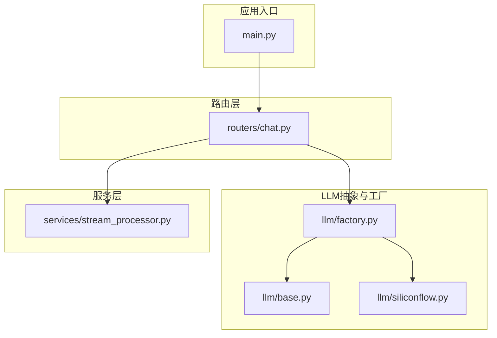
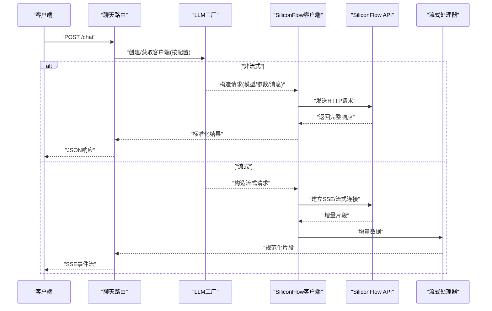
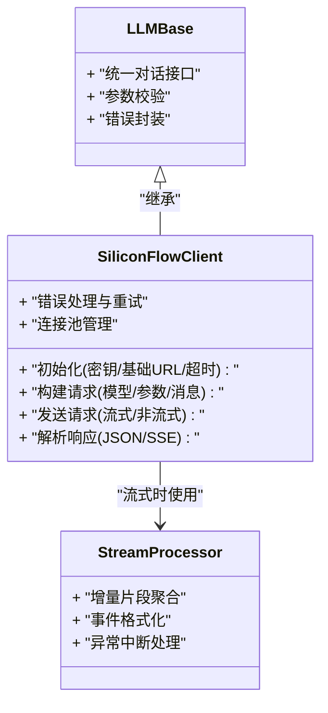
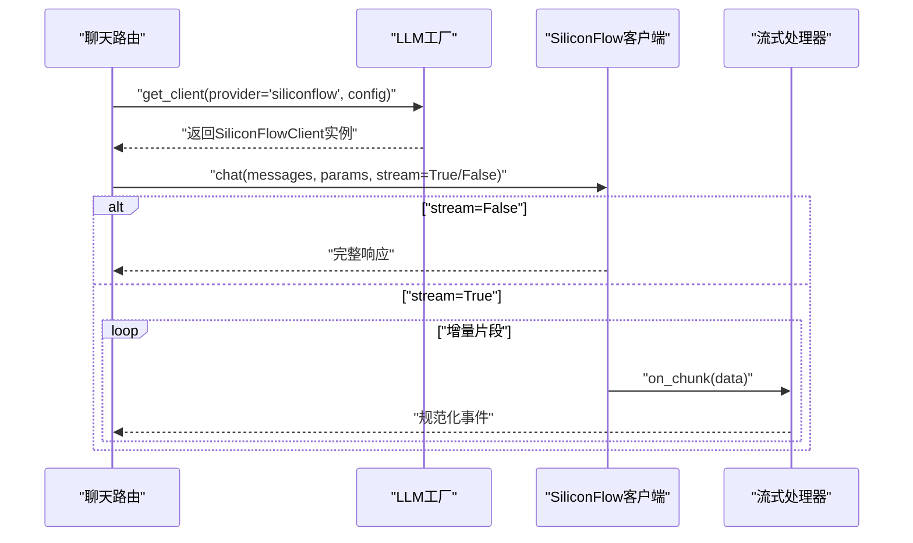
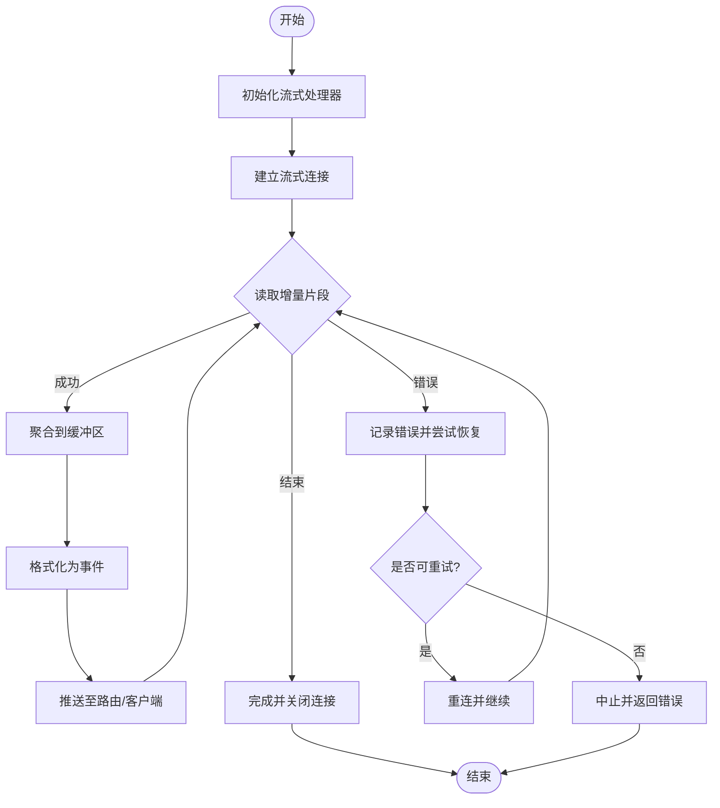
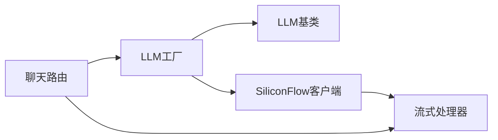

# SiliconFlow集成

<cite>
**本文引用的文件**   
- [backend/app/llm/siliconflow.py](file://backend/app/llm/siliconflow.py)
- [backend/app/llm/base.py](file://backend/app/llm/base.py)
- [backend/app/llm/factory.py](file://backend/app/llm/factory.py)
- [backend/app/services/stream_processor.py](file://backend/app/services/stream_processor.py)
- [backend/app/routers/chat.py](file://backend/app/routers/chat.py)
- [backend/app/main.py](file://backend/app/main.py)
- [backend/env.example](file://backend/env.example)
</cite>

## 目录
1. [简介](#简介)
2. [项目结构](#项目结构)
3. [核心组件](#核心组件)
4. [架构总览](#架构总览)
5. [详细组件分析](#详细组件分析)
6. [依赖关系分析](#依赖关系分析)
7. [性能考虑](#性能考虑)
8. [故障排查指南](#故障排查指南)
9. [结论](#结论)
10. [附录](#附录)

## 简介
本技术文档聚焦于SiliconFlow大语言模型提供商在后端服务中的集成实现，围绕SiliconFlowClient的具体实现展开，涵盖API认证、请求构建、响应解析与错误处理；说明支持的模型类型、参数配置与调用限制；解释流式响应的处理方式、连接池管理与重试机制；并提供完整的配置示例、环境变量设置、API密钥管理以及基础调用示例。同时给出性能调优建议、成本控制策略和常见问题排查方法，帮助读者快速上手并稳定运行。

## 项目结构
后端采用分层组织方式：LLM抽象层定义统一接口与工厂模式，具体厂商（如SiliconFlow）在独立模块中实现；路由层暴露HTTP接口；服务层负责会话、历史、工具编排与流式处理；主应用负责启动与中间件注册。

图表来源
- [backend/app/main.py](file://backend/app/main.py)
- [backend/app/routers/chat.py](file://backend/app/routers/chat.py)
- [backend/app/llm/base.py](file://backend/app/llm/base.py)
- [backend/app/llm/factory.py](file://backend/app/llm/factory.py)
- [backend/app/llm/siliconflow.py](file://backend/app/llm/siliconflow.py)
- [backend/app/services/stream_processor.py](file://backend/app/services/stream_processor.py)

章节来源
- [backend/app/main.py](file://backend/app/main.py)
- [backend/app/routers/chat.py](file://backend/app/routers/chat.py)
- [backend/app/llm/base.py](file://backend/app/llm/base.py)
- [backend/app/llm/factory.py](file://backend/app/llm/factory.py)
- [backend/app/llm/siliconflow.py](file://backend/app/llm/siliconflow.py)
- [backend/app/services/stream_processor.py](file://backend/app/services/stream_processor.py)

## 核心组件
- LLM基类与工厂
  - 基类定义了统一的对话接口与通用能力（如流式与非流式调用、参数校验、错误封装等）。
  - 工厂根据配置动态创建具体LLM客户端实例，屏蔽不同厂商差异。
- SiliconFlow客户端
  - 实现SiliconFlow的认证、请求构建、响应解析、错误处理与流式输出。
  - 维护HTTP连接池、超时与重试策略，确保高并发下的稳定性。
- 流式处理器
  - 对上游返回的增量片段进行聚合、格式转换与下游推送。
- 路由与服务
  - 路由接收前端请求，组装上下文与参数，调用工厂获取客户端并执行对话。
  - 服务层协调历史、工具与流式处理，提供端到端体验。

章节来源
- [backend/app/llm/base.py](file://backend/app/llm/base.py)
- [backend/app/llm/factory.py](file://backend/app/llm/factory.py)
- [backend/app/llm/siliconflow.py](file://backend/app/llm/siliconflow.py)
- [backend/app/services/stream_processor.py](file://backend/app/services/stream_processor.py)
- [backend/app/routers/chat.py](file://backend/app/routers/chat.py)

## 架构总览
整体流程从HTTP请求进入，经路由层组装参数后通过工厂选择SiliconFlow客户端，发起非流或流式请求，服务端将结果以SSE或JSON形式返回给前端。

图表来源
- [backend/app/routers/chat.py](file://backend/app/routers/chat.py)
- [backend/app/llm/factory.py](file://backend/app/llm/factory.py)
- [backend/app/llm/siliconflow.py](file://backend/app/llm/siliconflow.py)
- [backend/app/services/stream_processor.py](file://backend/app/services/stream_processor.py)

## 详细组件分析

### SiliconFlow客户端实现
- 认证方式
  - 使用API密钥作为鉴权凭据，通常通过环境变量注入并在客户端初始化时读取。
  - 请求头携带标准认证字段，确保每次调用均附带有效凭据。
- 请求构建
  - 基于统一消息格式与系统提示，组合模型名称、温度、最大生成长度、TopP等参数。
  - 支持流式与非流式两种模式，分别对应不同的HTTP方法与头部设置。
- 响应解析
  - 非流式：解析JSON体，提取文本内容、元数据与使用量信息。
  - 流式：逐块解析增量片段，合并为完整文本，同时保留事件边界以便前端渲染。
- 错误处理
  - 网络异常、超时、鉴权失败、限流与业务错误分类处理。
  - 对可重试错误实施指数退避重试，避免雪崩效应。
- 连接池与超时
  - 复用底层HTTP连接池，减少握手开销。
  - 合理设置连接、读、写超时，适配不同网络环境。
- 重试机制
  - 针对瞬时错误（如网络抖动、临时限流）自动重试，次数与间隔可配置。
  - 幂等性保障：仅对安全操作启用重试，避免重复计费风险。

图表来源
- [backend/app/llm/base.py](file://backend/app/llm/base.py)
- [backend/app/llm/siliconflow.py](file://backend/app/llm/siliconflow.py)
- [backend/app/services/stream_processor.py](file://backend/app/services/stream_processor.py)

章节来源
- [backend/app/llm/siliconflow.py](file://backend/app/llm/siliconflow.py)
- [backend/app/llm/base.py](file://backend/app/llm/base.py)
- [backend/app/services/stream_processor.py](file://backend/app/services/stream_processor.py)

### 工厂与路由协作
- 工厂根据配置项（如提供商、模型、密钥、超时、重试）创建SiliconFlow客户端实例。
- 路由层接收请求，校验输入，组装消息列表与系统提示，调用工厂获取客户端并执行对话。
- 流式场景下，路由将流式处理器接入响应通道，实时推送增量片段。

图表来源
- [backend/app/routers/chat.py](file://backend/app/routers/chat.py)
- [backend/app/llm/factory.py](file://backend/app/llm/factory.py)
- [backend/app/llm/siliconflow.py](file://backend/app/llm/siliconflow.py)
- [backend/app/services/stream_processor.py](file://backend/app/services/stream_processor.py)

章节来源
- [backend/app/routers/chat.py](file://backend/app/routers/chat.py)
- [backend/app/llm/factory.py](file://backend/app/llm/factory.py)
- [backend/app/llm/siliconflow.py](file://backend/app/llm/siliconflow.py)
- [backend/app/services/stream_processor.py](file://backend/app/services/stream_processor.py)

### 流式响应处理流程
流式处理的核心在于增量片段的可靠聚合与错误恢复。

图表来源
- [backend/app/services/stream_processor.py](file://backend/app/services/stream_processor.py)
- [backend/app/llm/siliconflow.py](file://backend/app/llm/siliconflow.py)

章节来源
- [backend/app/services/stream_processor.py](file://backend/app/services/stream_processor.py)
- [backend/app/llm/siliconflow.py](file://backend/app/llm/siliconflow.py)

## 依赖关系分析
- 模块耦合
  - 路由层依赖工厂与流式处理器，低耦合于具体LLM实现。
  - SiliconFlow客户端依赖统一基类，遵循开闭原则，便于扩展新厂商。
- 外部依赖
  - HTTP客户端库用于连接池、超时与重试。
  - SSE/流式传输协议用于增量数据推送。
- 潜在循环依赖
  - 当前结构清晰，未见循环导入；若新增跨层回调需审慎设计。

图表来源
- [backend/app/routers/chat.py](file://backend/app/routers/chat.py)
- [backend/app/llm/factory.py](file://backend/app/llm/factory.py)
- [backend/app/llm/base.py](file://backend/app/llm/base.py)
- [backend/app/llm/siliconflow.py](file://backend/app/llm/siliconflow.py)
- [backend/app/services/stream_processor.py](file://backend/app/services/stream_processor.py)

章节来源
- [backend/app/routers/chat.py](file://backend/app/routers/chat.py)
- [backend/app/llm/factory.py](file://backend/app/llm/factory.py)
- [backend/app/llm/base.py](file://backend/app/llm/base.py)
- [backend/app/llm/siliconflow.py](file://backend/app/llm/siliconflow.py)
- [backend/app/services/stream_processor.py](file://backend/app/services/stream_processor.py)

## 性能考虑
- 连接池
  - 复用HTTP连接，降低握手成本；根据并发规模调整最大连接数与空闲回收策略。
- 超时与重试
  - 合理设置读/写超时，避免长尾请求占用资源；对瞬时错误启用指数退避重试。
- 流式优化
  - 增量推送减少首字节延迟；控制缓冲大小，避免内存峰值过高。
- 批处理与缓存
  - 对相同查询结果进行短期缓存，降低重复调用成本。
- 监控与指标
  - 采集QPS、延迟分布、错误率、重试次数、令牌用量等关键指标。

[本节为通用指导，不直接分析具体文件]

## 故障排查指南
- 认证失败
  - 检查环境变量是否正确注入；确认API密钥权限与配额。
- 限流与重试
  - 观察重试日志与退避策略；必要时提高限流阈值或降级策略。
- 流式中断
  - 检查网络稳定性与代理配置；增加重连逻辑与断点续传。
- 超时问题
  - 调整超时参数；评估模型响应时间与负载情况。
- 日志定位
  - 开启调试日志，记录请求头、响应码与错误堆栈；结合链路追踪定位瓶颈。

章节来源
- [backend/app/llm/siliconflow.py](file://backend/app/llm/siliconflow.py)
- [backend/app/services/stream_processor.py](file://backend/app/services/stream_processor.py)

## 结论
SiliconFlow集成通过统一的LLM抽象与工厂模式，实现了高内聚、低耦合的架构。SiliconFlowClient在认证、请求构建、响应解析与错误处理方面提供了稳健的实现，配合流式处理器与连接池管理，满足高并发与低延迟需求。通过合理的性能调优与成本控制策略，可在保证用户体验的同时有效控制成本。

[本节为总结，不直接分析具体文件]

## 附录

### 配置与环境变量
- 必要环境变量
  - 供应商标识、模型名称、API密钥、基础URL、超时与重试参数等。
- 示例位置
  - 参考仓库提供的示例配置文件，按需复制并修改。

章节来源
- [backend/env.example](file://backend/env.example)

### 基础调用示例
- 非流式调用
  - 通过路由接口提交消息与参数，等待完整响应。
- 流式调用
  - 建立SSE连接，实时接收增量片段并渲染。

章节来源
- [backend/app/routers/chat.py](file://backend/app/routers/chat.py)
- [backend/app/llm/siliconflow.py](file://backend/app/llm/siliconflow.py)
- [backend/app/services/stream_processor.py](file://backend/app/services/stream_processor.py)

### 支持的模型类型与参数
- 模型类型
  - 依据SiliconFlow平台公开模型列表，在配置中指定模型名称。
- 常用参数
  - 温度、TopP、最大生成长度、停止词、频率惩罚等，具体以平台文档为准。
- 调用限制
  - 关注速率限制、并发上限与令牌配额，结合重试与降级策略。

章节来源
- [backend/app/llm/siliconflow.py](file://backend/app/llm/siliconflow.py)

### 成本控制策略
- 模型选择
  - 根据任务复杂度选择合适的模型，避免过度消费。
- 参数调优
  - 控制最大生成长度与采样参数，减少无效输出。
- 缓存与复用
  - 对常见问答进行缓存，降低重复调用。
- 监控与告警
  - 设定用量阈值与告警规则，及时干预异常消耗。

[本节为通用指导，不直接分析具体文件]