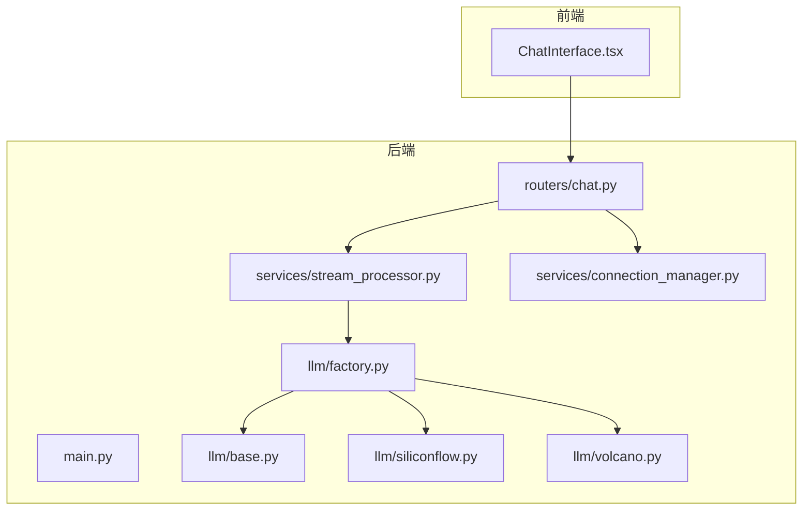
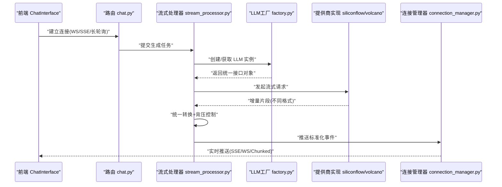
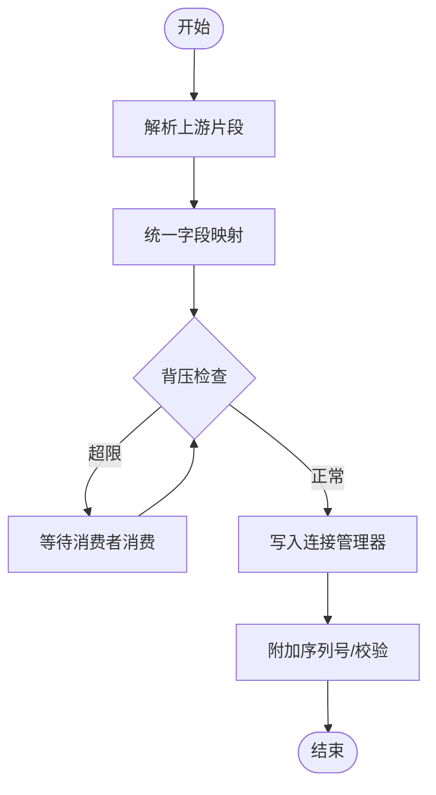
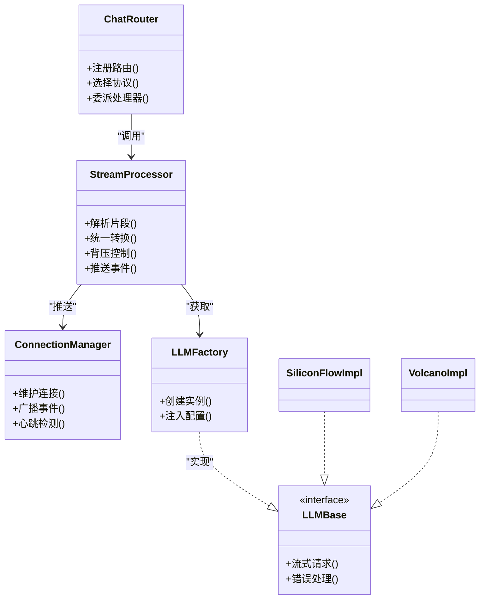

# 流式响应处理

<cite>
**本文引用的文件**   
- [backend/app/main.py](file://backend/app/main.py)
- [backend/app/routers/chat.py](file://backend/app/routers/chat.py)
- [backend/app/services/stream_processor.py](file://backend/app/services/stream_processor.py)
- [backend/app/services/connection_manager.py](file://backend/app/services/connection_manager.py)
- [backend/app/llm/base.py](file://backend/app/llm/base.py)
- [backend/app/llm/factory.py](file://backend/app/llm/factory.py)
- [backend/app/llm/siliconflow.py](file://backend/app/llm/siliconflow.py)
- [backend/app/llm/volcano.py](file://backend/app/llm/volcano.py)
- [frontend/src/components/ChatInterface.tsx](file://frontend/src/components/ChatInterface.tsx)
</cite>

## 目录
1. [简介](#简介)
2. [项目结构](#项目结构)
3. [核心组件](#核心组件)
4. [架构总览](#架构总览)
5. [详细组件分析](#详细组件分析)
6. [依赖关系分析](#依赖关系分析)
7. [性能考虑](#性能考虑)
8. [故障排查指南](#故障排查指南)
9. [结论](#结论)
10. [附录](#附录)

## 简介
本技术文档聚焦于大语言模型（LLM）流式响应处理的完整实现与最佳实践，覆盖后端数据流管道、背压与内存管理、多提供商格式统一、实时推送协议（WebSocket/SSE/HTTP长轮询）、错误处理与断线重连、数据完整性保证、并发控制与缓冲区优化，以及客户端集成与调试方法。目标是帮助读者快速理解并落地一套高可用、可扩展的流式响应系统。

## 项目结构
本项目采用前后端分离架构：
- 后端基于 Python Web 框架提供聊天路由、流式处理器、连接管理与 LLM 抽象层；
- 前端通过 React 组件与后端进行实时交互。

图表来源
- [backend/app/main.py](file://backend/app/main.py)
- [backend/app/routers/chat.py](file://backend/app/routers/chat.py)
- [backend/app/services/stream_processor.py](file://backend/app/services/stream_processor.py)
- [backend/app/services/connection_manager.py](file://backend/app/services/connection_manager.py)
- [backend/app/llm/base.py](file://backend/app/llm/base.py)
- [backend/app/llm/factory.py](file://backend/app/llm/factory.py)
- [backend/app/llm/siliconflow.py](file://backend/app/llm/siliconflow.py)
- [backend/app/llm/volcano.py](file://backend/app/llm/volcano.py)
- [frontend/src/components/ChatInterface.tsx](file://frontend/src/components/ChatInterface.tsx)

章节来源
- [backend/app/main.py](file://backend/app/main.py)
- [backend/app/routers/chat.py](file://backend/app/routers/chat.py)
- [backend/app/services/stream_processor.py](file://backend/app/services/stream_processor.py)
- [backend/app/services/connection_manager.py](file://backend/app/services/connection_manager.py)
- [backend/app/llm/base.py](file://backend/app/llm/base.py)
- [backend/app/llm/factory.py](file://backend/app/llm/factory.py)
- [backend/app/llm/siliconflow.py](file://backend/app/llm/siliconflow.py)
- [backend/app/llm/volcano.py](file://backend/app/llm/volcano.py)
- [frontend/src/components/ChatInterface.tsx](file://frontend/src/components/ChatInterface.tsx)

## 核心组件
- 路由层：负责接收请求、选择传输协议（WebSocket/SSE/HTTP长轮询），并将任务委派给流式处理器。
- 流式处理器：封装对上游 LLM 的调用，统一解析不同提供商的增量片段，执行背压控制与缓冲策略，将标准化事件推送到连接管理器。
- 连接管理器：维护客户端连接集合，支持按会话或房间广播，处理断开与重连信号。
- LLM 抽象层：定义统一的接口与返回类型，各提供商实现具体流式读取与字段映射。
- 前端组件：根据所选协议建立连接，渲染增量文本，处理错误与重连。

章节来源
- [backend/app/routers/chat.py](file://backend/app/routers/chat.py)
- [backend/app/services/stream_processor.py](file://backend/app/services/stream_processor.py)
- [backend/app/services/connection_manager.py](file://backend/app/services/connection_manager.py)
- [backend/app/llm/base.py](file://backend/app/llm/base.py)
- [backend/app/llm/factory.py](file://backend/app/llm/factory.py)
- [backend/app/llm/siliconflow.py](file://backend/app/llm/siliconflow.py)
- [backend/app/llm/volcano.py](file://backend/app/llm/volcano.py)
- [frontend/src/components/ChatInterface.tsx](file://frontend/src/components/ChatInterface.tsx)

## 架构总览
下图展示了从前端到 LLM 的端到端流式数据路径，包括协议适配、统一转换与背压控制。

图表来源
- [backend/app/routers/chat.py](file://backend/app/routers/chat.py)
- [backend/app/services/stream_processor.py](file://backend/app/services/stream_processor.py)
- [backend/app/services/connection_manager.py](file://backend/app/services/connection_manager.py)
- [backend/app/llm/factory.py](file://backend/app/llm/factory.py)
- [backend/app/llm/siliconflow.py](file://backend/app/llm/siliconflow.py)
- [backend/app/llm/volcano.py](file://backend/app/llm/volcano.py)

## 详细组件分析

### 路由层（chat.py）
职责
- 注册 WebSocket、SSE 与 HTTP 长轮询三种协议的入口；
- 校验请求参数，选择目标 LLM 提供商；
- 将任务交给流式处理器，并返回对应协议的响应。

关键流程
- 建立连接后，路由层将上下文（如会话ID、用户标识）注入到任务中；
- 根据配置决定使用哪种传输协议；
- 在异常时返回标准错误事件或状态码。

章节来源
- [backend/app/routers/chat.py](file://backend/app/routers/chat.py)

### 流式处理器（stream_processor.py）
职责
- 封装对 LLM 的调用，统一解析增量片段；
- 实现背压控制与缓冲策略，避免内存膨胀；
- 将标准化事件写入连接管理器。

设计要点
- 数据流管道：上游 LLM -> 解析器 -> 转换器 -> 背压队列 -> 下游推送；
- 背压策略：基于队列长度与消费者速率动态调整拉取频率；
- 内存管理：限制单条消息最大大小，分块累积，及时释放中间对象；
- 错误处理：捕获网络异常、超时、格式错误，转换为统一错误事件；
- 数据完整性：为每个片段附加序列号与校验和，便于客户端排序与校验。

图表来源
- [backend/app/services/stream_processor.py](file://backend/app/services/stream_processor.py)

章节来源
- [backend/app/services/stream_processor.py](file://backend/app/services/stream_processor.py)

### 连接管理器（connection_manager.py）
职责
- 维护活跃连接集合，支持按会话或房间广播；
- 处理连接生命周期（建立、心跳、断开、重连）；
- 提供发送接口，屏蔽底层协议差异。

关键点
- 并发安全：使用线程/协程安全的容器存储连接；
- 心跳机制：定期检测空闲连接，主动清理；
- 断线重连：向客户端下发重连指令，携带退避策略。

章节来源
- [backend/app/services/connection_manager.py](file://backend/app/services/connection_manager.py)

### LLM 抽象层与工厂（base.py, factory.py）
职责
- base.py：定义统一的 LLM 接口与返回类型，约定流式迭代协议；
- factory.py：根据配置创建具体提供商实例，注入鉴权与重试策略。

接口契约
- 统一输入：模型名称、提示词、温度等；
- 统一输出：增量片段包含内容、角色、工具调用标记、元数据；
- 统一错误：网络错误、限流、配额不足等。

章节来源
- [backend/app/llm/base.py](file://backend/app/llm/base.py)
- [backend/app/llm/factory.py](file://backend/app/llm/factory.py)

### 提供商实现（siliconflow.py, volcano.py）
职责
- 分别对接 SiliconFlow 与火山引擎的流式 API；
- 将各自响应格式映射到统一数据结构；
- 处理各自特有的字段与边界情况。

差异点
- 字段命名与嵌套层级不同；
- 某些提供商可能返回空片段或重复片段，需去重与合并；
- 部分提供商在错误时返回非标准 JSON，需要容错解析。

章节来源
- [backend/app/llm/siliconflow.py](file://backend/app/llm/siliconflow.py)
- [backend/app/llm/volcano.py](file://backend/app/llm/volcano.py)

### 前端组件（ChatInterface.tsx）
职责
- 根据配置选择协议（WebSocket/SSE/HTTP长轮询）；
- 建立连接、订阅事件、渲染增量文本；
- 处理错误、自动重连与进度反馈。

集成要点
- 连接建立：优先尝试 WebSocket，失败回退到 SSE，再失败使用长轮询；
- 事件处理：区分文本片段、工具调用、完成与错误事件；
- 重连策略：指数退避与最大重试次数；
- 性能优化：虚拟滚动与增量更新，避免整页重绘。

章节来源
- [frontend/src/components/ChatInterface.tsx](file://frontend/src/components/ChatInterface.tsx)

## 依赖关系分析

图表来源
- [backend/app/routers/chat.py](file://backend/app/routers/chat.py)
- [backend/app/services/stream_processor.py](file://backend/app/services/stream_processor.py)
- [backend/app/services/connection_manager.py](file://backend/app/services/connection_manager.py)
- [backend/app/llm/base.py](file://backend/app/llm/base.py)
- [backend/app/llm/factory.py](file://backend/app/llm/factory.py)
- [backend/app/llm/siliconflow.py](file://backend/app/llm/siliconflow.py)
- [backend/app/llm/volcano.py](file://backend/app/llm/volcano.py)

章节来源
- [backend/app/routers/chat.py](file://backend/app/routers/chat.py)
- [backend/app/services/stream_processor.py](file://backend/app/services/stream_processor.py)
- [backend/app/services/connection_manager.py](file://backend/app/services/connection_manager.py)
- [backend/app/llm/base.py](file://backend/app/llm/base.py)
- [backend/app/llm/factory.py](file://backend/app/llm/factory.py)
- [backend/app/llm/siliconflow.py](file://backend/app/llm/siliconflow.py)
- [backend/app/llm/volcano.py](file://backend/app/llm/volcano.py)

## 性能考虑
- 背压与缓冲
  - 使用有界队列承载增量片段，超过阈值时暂停上游拉取；
  - 根据消费者速率动态调整批次大小，平衡吞吐与延迟。
- 内存管理
  - 限制单条消息最大尺寸，避免 OOM；
  - 及时释放中间对象，减少 GC 压力。
- 并发控制
  - 每会话独立协程/线程，避免相互阻塞；
  - 全局限流与令牌桶控制，防止过载。
- I/O 优化
  - 使用零拷贝或最小序列化开销；
  - 合理设置超时与重试间隔，降低无效请求。
- 前端渲染
  - 增量更新与虚拟列表，减少 DOM 操作；
  - 节流与防抖，避免频繁重排。

[本节为通用指导，不直接分析具体文件]

## 故障排查指南
常见问题与定位步骤
- 连接不稳定
  - 检查心跳与断线重连逻辑；
  - 确认服务端是否主动关闭空闲连接。
- 数据乱序或缺失
  - 核对序列号与校验和；
  - 检查背压队列是否溢出导致丢包。
- 内存增长
  - 监控队列长度与消息大小；
  - 确认是否有未释放的中间对象。
- 性能抖动
  - 观察 CPU 与 I/O 指标；
  - 调整批次大小与并发度。

章节来源
- [backend/app/services/stream_processor.py](file://backend/app/services/stream_processor.py)
- [backend/app/services/connection_manager.py](file://backend/app/services/connection_manager.py)

## 结论
通过统一的 LLM 抽象层、可插拔的提供商实现、健壮的流式处理器与连接管理器，本方案实现了跨协议、跨提供商的高可用流式响应能力。结合背压控制、内存管理与错误恢复策略，可在大规模并发场景下保持稳定与低延迟。前端的多协议回退与重连机制进一步提升了用户体验与鲁棒性。

[本节为总结，不直接分析具体文件]

## 附录

### 协议对比与选择建议
- WebSocket
  - 优点：全双工、低延迟、适合强实时；
  - 适用：交互式对话、多人协作。
- SSE（服务器发送事件）
  - 优点：单向、易代理、兼容性好；
  - 适用：服务端推送为主、无需客户端上行。
- HTTP 长轮询
  - 优点：最简实现、穿透防火墙；
  - 适用：弱网环境或受限网络。

[本节为概念说明，不直接分析具体文件]

### 客户端集成示例（思路）
- 连接建立
  - 优先 WebSocket，失败则尝试 SSE，最后回退到长轮询；
  - 携带会话ID与鉴权信息。
- 事件处理
  - 文本片段：追加到当前段落；
  - 工具调用：触发相应 UI 或业务逻辑；
  - 完成：停止渲染并保存结果；
  - 错误：显示错误信息并触发重连。
- 重连策略
  - 指数退避，最大重试次数；
  - 断线后保留未确认片段，确保一致性。

章节来源
- [frontend/src/components/ChatInterface.tsx](file://frontend/src/components/ChatInterface.tsx)