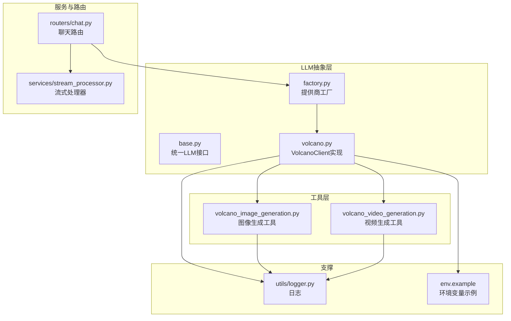
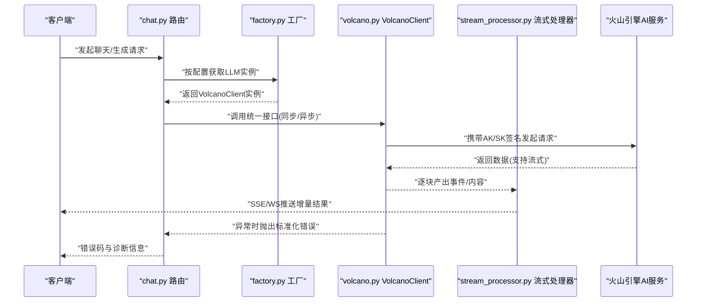
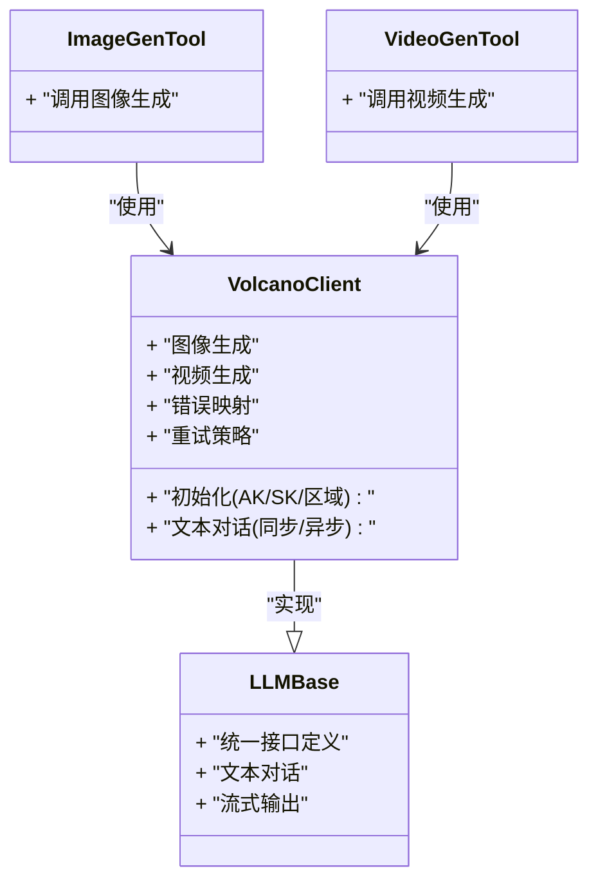
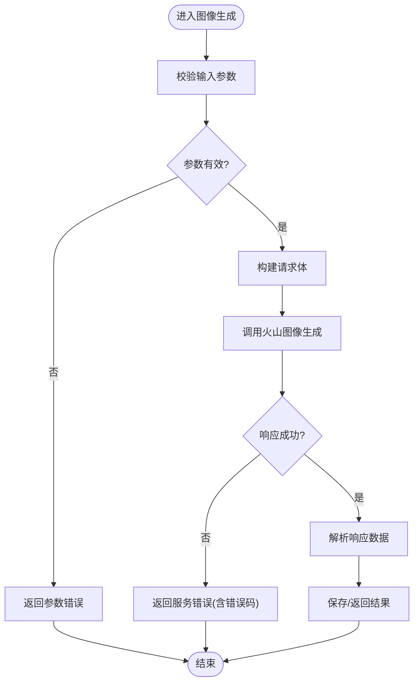
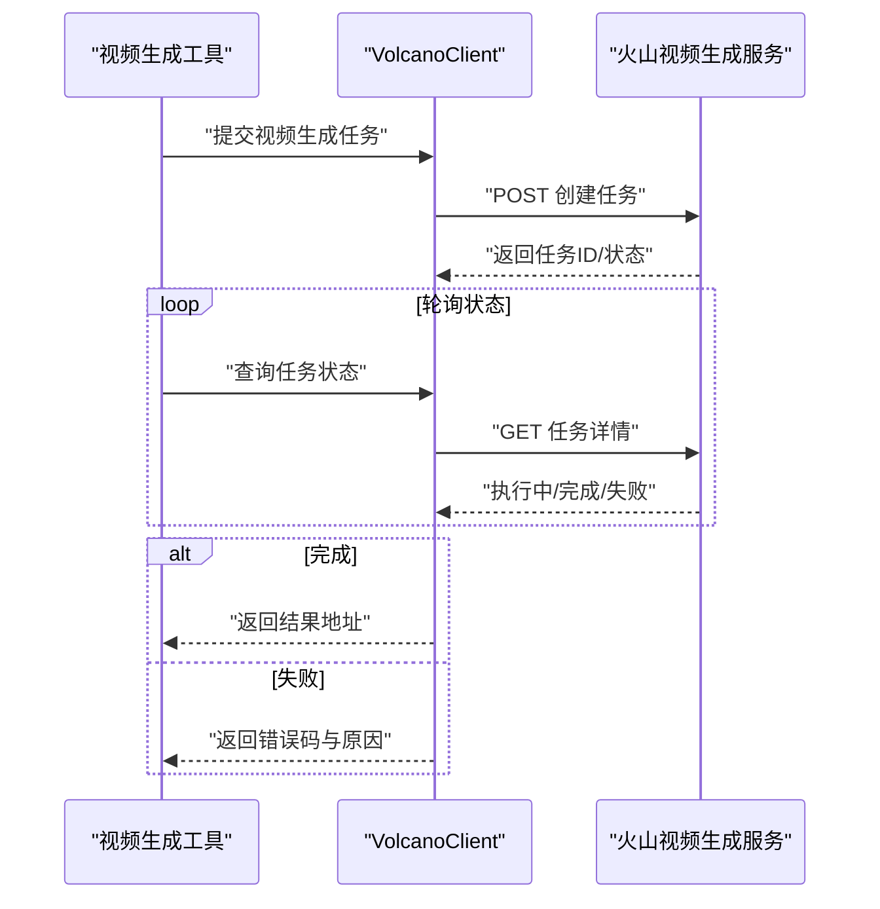
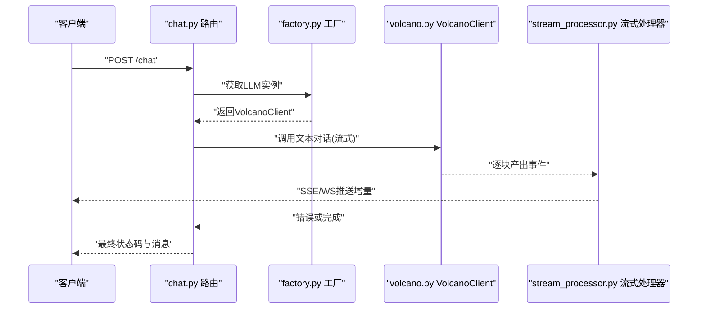
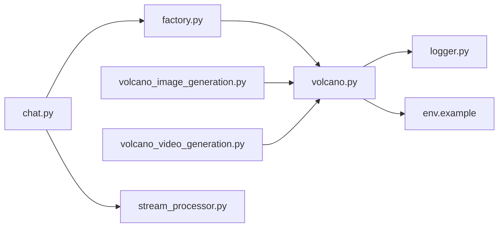

# 火山引擎集成

<cite>
**本文引用的文件**   
- [backend/app/llm/volcano.py](file://backend/app/llm/volcano.py)
- [backend/app/llm/base.py](file://backend/app/llm/base.py)
- [backend/app/llm/factory.py](file://backend/app/llm/factory.py)
- [backend/app/tools/volcano_image_generation.py](file://backend/app/tools/volcano_image_generation.py)
- [backend/app/tools/volcano_video_generation.py](file://backend/app/tools/volcano_video_generation.py)
- [backend/app/routers/chat.py](file://backend/app/routers/chat.py)
- [backend/app/services/stream_processor.py](file://backend/app/services/stream_processor.py)
- [backend/app/utils/logger.py](file://backend/app/utils/logger.py)
- [backend/env.example](file://backend/env.example)
</cite>

## 目录
1. [简介](#简介)
2. [项目结构](#项目结构)
3. [核心组件](#核心组件)
4. [架构总览](#架构总览)
5. [详细组件分析](#详细组件分析)
6. [依赖关系分析](#依赖关系分析)
7. [性能考虑](#性能考虑)
8. [故障排查指南](#故障排查指南)
9. [结论](#结论)
10. [附录](#附录)

## 简介
本技术文档聚焦于后端对火山引擎AI服务的集成，围绕 VolcanoClient 的实现与使用展开，涵盖SDK集成方式、认证机制、API调用封装、错误处理策略、异步调用与连接复用、负载均衡思路、配置与示例、以及监控日志与排障最佳实践。读者无需深入源码即可理解整体设计与使用方法；同时提供面向开发者的代码级分析与图示，便于二次扩展与维护。

## 项目结构
与火山引擎集成相关的核心位置如下：
- LLM抽象与工厂：定义统一接口与提供商选择逻辑
- Volcano客户端：封装火山引擎的认证、请求、流式响应与错误处理
- 工具层：图像生成、视频生成等具体业务能力通过Volcano服务实现
- 路由与服务：将LLM能力暴露为HTTP接口，并串联流式处理
- 日志与配置：统一的日志记录与环境变量配置

图表来源
- [backend/app/llm/base.py](file://backend/app/llm/base.py)
- [backend/app/llm/factory.py](file://backend/app/llm/factory.py)
- [backend/app/llm/volcano.py](file://backend/app/llm/volcano.py)
- [backend/app/tools/volcano_image_generation.py](file://backend/app/tools/volcano_image_generation.py)
- [backend/app/tools/volcano_video_generation.py](file://backend/app/tools/volcano_video_generation.py)
- [backend/app/routers/chat.py](file://backend/app/routers/chat.py)
- [backend/app/services/stream_processor.py](file://backend/app/services/stream_processor.py)
- [backend/app/utils/logger.py](file://backend/app/utils/logger.py)
- [backend/env.example](file://backend/env.example)

章节来源
- [backend/app/llm/base.py](file://backend/app/llm/base.py)
- [backend/app/llm/factory.py](file://backend/app/llm/factory.py)
- [backend/app/llm/volcano.py](file://backend/app/llm/volcano.py)
- [backend/app/tools/volcano_image_generation.py](file://backend/app/tools/volcano_image_generation.py)
- [backend/app/tools/volcano_video_generation.py](file://backend/app/tools/volcano_video_generation.py)
- [backend/app/routers/chat.py](file://backend/app/routers/chat.py)
- [backend/app/services/stream_processor.py](file://backend/app/services/stream_processor.py)
- [backend/app/utils/logger.py](file://backend/app/utils/logger.py)
- [backend/env.example](file://backend/env.example)

## 核心组件
- VolcanoClient：封装火山引擎AI服务的认证、请求构造、流式读取、重试与错误映射，对外暴露一致的调用接口。
- LLM基类与工厂：定义统一LLM接口（如文本对话、流式输出），并通过工厂根据配置动态选择Volcano或其他提供商。
- 工具模块：图像生成与视频生成工具基于VolcanoClient进行能力编排。
- 路由与流式处理：将LLM能力以HTTP接口暴露，结合流式处理器向客户端推送增量结果。
- 日志与配置：集中化日志记录，环境变量驱动配置加载。

章节来源
- [backend/app/llm/volcano.py](file://backend/app/llm/volcano.py)
- [backend/app/llm/base.py](file://backend/app/llm/base.py)
- [backend/app/llm/factory.py](file://backend/app/llm/factory.py)
- [backend/app/tools/volcano_image_generation.py](file://backend/app/tools/volcano_image_generation.py)
- [backend/app/tools/volcano_video_generation.py](file://backend/app/tools/volcano_video_generation.py)
- [backend/app/routers/chat.py](file://backend/app/routers/chat.py)
- [backend/app/services/stream_processor.py](file://backend/app/services/stream_processor.py)
- [backend/app/utils/logger.py](file://backend/app/utils/logger.py)
- [backend/env.example](file://backend/env.example)

## 架构总览
下图展示了从HTTP请求到火山引擎AI服务的端到端流程，包括认证、调用、流式返回与错误处理。

图表来源
- [backend/app/routers/chat.py](file://backend/app/routers/chat.py)
- [backend/app/llm/factory.py](file://backend/app/llm/factory.py)
- [backend/app/llm/volcano.py](file://backend/app/llm/volcano.py)
- [backend/app/services/stream_processor.py](file://backend/app/services/stream_processor.py)

## 详细组件分析

### VolcanoClient 实现要点
- SDK集成方式
  - 通过统一LLM接口接入，内部封装火山引擎Python SDK或HTTP客户端，负责鉴权签名、参数组装、超时与重试。
  - 支持同步与异步两种调用路径，适配不同场景（批处理、实时交互）。
- 认证机制
  - 使用AK/SK进行签名，支持从环境变量或配置文件注入，避免硬编码敏感信息。
  - 可配置默认区域与Endpoint，确保请求路由正确。
- API调用封装
  - 将多类AI能力（文本对话、图像生成、视频生成）统一为方法族，屏蔽底层差异。
  - 对输入参数做校验与规范化，保证向后兼容。
- 错误处理策略
  - 捕获网络异常、鉴权失败、限流与配额不足等错误，转换为统一错误对象，包含错误码、消息与可选的诊断字段。
  - 针对瞬时错误实施指数退避重试，避免雪崩。
- 异步与并发
  - 在异步路径下采用非阻塞I/O，配合事件循环提升吞吐。
  - 连接复用由底层HTTP客户端管理，减少握手开销。
- 负载均衡
  - 当前实现以单点为主，可在上层引入多Endpoint轮询或权重分配策略，结合健康检查与熔断降级。

图表来源
- [backend/app/llm/base.py](file://backend/app/llm/base.py)
- [backend/app/llm/volcano.py](file://backend/app/llm/volcano.py)
- [backend/app/tools/volcano_image_generation.py](file://backend/app/tools/volcano_image_generation.py)
- [backend/app/tools/volcano_video_generation.py](file://backend/app/tools/volcano_video_generation.py)

章节来源
- [backend/app/llm/volcano.py](file://backend/app/llm/volcano.py)
- [backend/app/llm/base.py](file://backend/app/llm/base.py)
- [backend/app/tools/volcano_image_generation.py](file://backend/app/tools/volcano_image_generation.py)
- [backend/app/tools/volcano_video_generation.py](file://backend/app/tools/volcano_video_generation.py)

### 图像生成工具
- 职责：接收提示词、风格、尺寸等参数，调用Volcano图像生成接口，返回图片URL或二进制数据。
- 关键流程：参数校验→构建请求→发送→解析响应→落盘/返回→记录日志。
- 错误处理：对配额不足、模型不可用、参数非法等情况给出明确错误码与修复建议。

图表来源
- [backend/app/tools/volcano_image_generation.py](file://backend/app/tools/volcano_image_generation.py)
- [backend/app/llm/volcano.py](file://backend/app/llm/volcano.py)

章节来源
- [backend/app/tools/volcano_image_generation.py](file://backend/app/tools/volcano_image_generation.py)
- [backend/app/llm/volcano.py](file://backend/app/llm/volcano.py)

### 视频生成工具
- 职责：接收任务描述、时长、分辨率等参数，调用火山视频生成接口，返回任务ID与查询状态，或直接返回结果。
- 关键流程：参数校验→提交任务→轮询/回调→下载结果→返回。
- 错误处理：区分任务创建失败、执行中、失败原因，提供重试与人工介入指引。

图表来源
- [backend/app/tools/volcano_video_generation.py](file://backend/app/tools/volcano_video_generation.py)
- [backend/app/llm/volcano.py](file://backend/app/llm/volcano.py)

章节来源
- [backend/app/tools/volcano_video_generation.py](file://backend/app/tools/volcano_video_generation.py)
- [backend/app/llm/volcano.py](file://backend/app/llm/volcano.py)

### 路由与流式处理
- 路由层：将用户请求转发至LLM工厂，获取对应提供商实例，调用统一接口。
- 流式处理：对长耗时或大响应场景，采用流式传输，逐步推送增量内容，降低首字节延迟。
- 错误透传：将底层错误转换为标准HTTP错误码与结构化消息，便于前端展示与重试。

图表来源
- [backend/app/routers/chat.py](file://backend/app/routers/chat.py)
- [backend/app/llm/factory.py](file://backend/app/llm/factory.py)
- [backend/app/llm/volcano.py](file://backend/app/llm/volcano.py)
- [backend/app/services/stream_processor.py](file://backend/app/services/stream_processor.py)

章节来源
- [backend/app/routers/chat.py](file://backend/app/routers/chat.py)
- [backend/app/services/stream_processor.py](file://backend/app/services/stream_processor.py)
- [backend/app/llm/factory.py](file://backend/app/llm/factory.py)
- [backend/app/llm/volcano.py](file://backend/app/llm/volcano.py)

## 依赖关系分析
- 组件耦合
  - 路由层仅依赖工厂与统一LLM接口，不感知具体提供商细节，具备良好解耦性。
  - VolcanoClient作为实现类，被工具层与路由层共同使用，承担主要外部依赖。
- 直接依赖
  - VolcanoClient依赖日志模块与环境配置；工具层依赖VolcanoClient；路由层依赖工厂与流式处理器。
- 潜在循环依赖
  - 当前结构未见循环导入风险；若新增跨层调用需审慎评估。
- 外部依赖
  - 火山引擎AI服务API；HTTP客户端库；可能的第三方SDK。

图表来源
- [backend/app/routers/chat.py](file://backend/app/routers/chat.py)
- [backend/app/llm/factory.py](file://backend/app/llm/factory.py)
- [backend/app/llm/volcano.py](file://backend/app/llm/volcano.py)
- [backend/app/tools/volcano_image_generation.py](file://backend/app/tools/volcano_image_generation.py)
- [backend/app/tools/volcano_video_generation.py](file://backend/app/tools/volcano_video_generation.py)
- [backend/app/services/stream_processor.py](file://backend/app/services/stream_processor.py)
- [backend/app/utils/logger.py](file://backend/app/utils/logger.py)
- [backend/env.example](file://backend/env.example)

章节来源
- [backend/app/routers/chat.py](file://backend/app/routers/chat.py)
- [backend/app/llm/factory.py](file://backend/app/llm/factory.py)
- [backend/app/llm/volcano.py](file://backend/app/llm/volcano.py)
- [backend/app/tools/volcano_image_generation.py](file://backend/app/tools/volcano_image_generation.py)
- [backend/app/tools/volcano_video_generation.py](file://backend/app/tools/volcano_video_generation.py)
- [backend/app/services/stream_processor.py](file://backend/app/services/stream_processor.py)
- [backend/app/utils/logger.py](file://backend/app/utils/logger.py)
- [backend/env.example](file://backend/env.example)

## 性能考虑
- 连接复用
  - 利用HTTP客户端的连接池与Keep-Alive，减少TCP握手与TLS协商开销。
- 异步与非阻塞
  - 在异步路径下避免阻塞I/O，提高并发度；合理设置事件循环队列长度。
- 超时与重试
  - 为读/写/连接分别设置超时；对瞬时错误采用指数退避与最大重试次数限制。
- 流式传输
  - 对长响应采用流式推送，降低内存占用与首字节延迟。
- 负载均衡与弹性
  - 在多Endpoint或多Region部署时，结合健康检查与权重轮询；必要时引入熔断与降级策略。
- 资源控制
  - 对并发请求数、令牌桶速率进行限制，防止上游限流或服务雪崩。

[本节为通用指导，不涉及具体文件]

## 故障排查指南
- 常见问题定位
  - 认证失败：检查AK/SK是否正确、是否过期、权限范围是否覆盖目标服务。
  - 配额不足：查看错误码与消息，确认配额上限与计费状态。
  - 网络异常：关注超时、DNS解析、代理与证书问题。
  - 参数错误：核对必填字段、取值范围与格式规范。
- 日志与追踪
  - 开启请求级日志，记录入参摘要、耗时、状态码与错误堆栈。
  - 为每次请求分配唯一TraceID，贯穿路由、工具与外部调用链路。
- 快速恢复
  - 对瞬时错误启用自动重试；对持续失败触发熔断与告警。
  - 提供降级模式（如切换备用模型或返回缓存结果）。

章节来源
- [backend/app/utils/logger.py](file://backend/app/utils/logger.py)
- [backend/app/llm/volcano.py](file://backend/app/llm/volcano.py)
- [backend/app/routers/chat.py](file://backend/app/routers/chat.py)

## 结论
通过对VolcanoClient的统一封装与分层设计，本项目实现了与火山引擎AI服务的稳定集成。借助工厂模式与统一接口，系统具备良好的可扩展性与可维护性；结合流式处理、连接复用与重试策略，提升了用户体验与系统韧性。建议在后续迭代中完善多Endpoint负载均衡、指标采集与自动化测试，进一步提升稳定性与可观测性。

[本节为总结，不涉及具体文件]

## 附录

### 配置指南
- AK/SK配置
  - 通过环境变量注入AccessKey与SecretKey，避免硬编码。
  - 参考示例文件中的键名与注释说明进行配置。
- 服务区域与Endpoint
  - 设置默认区域与自定义Endpoint，确保请求路由到正确的服务入口。
- 典型使用场景
  - 文本对话：用于问答、摘要、翻译等。
  - 图像生成：根据提示词生成图片，支持风格与尺寸参数。
  - 视频生成：提交任务后轮询状态，完成后下载结果。

章节来源
- [backend/env.example](file://backend/env.example)
- [backend/app/llm/volcano.py](file://backend/app/llm/volcano.py)
- [backend/app/tools/volcano_image_generation.py](file://backend/app/tools/volcano_image_generation.py)
- [backend/app/tools/volcano_video_generation.py](file://backend/app/tools/volcano_video_generation.py)

### 代码示例路径
- 文本对话调用示例：参见聊天路由与VolcanoClient的统一接口调用处。
- 图像生成调用示例：参见图像生成工具中对VolcanoClient的调用。
- 视频生成调用示例：参见视频生成工具的任务创建与状态轮询流程。

章节来源
- [backend/app/routers/chat.py](file://backend/app/routers/chat.py)
- [backend/app/llm/volcano.py](file://backend/app/llm/volcano.py)
- [backend/app/tools/volcano_image_generation.py](file://backend/app/tools/volcano_image_generation.py)
- [backend/app/tools/volcano_video_generation.py](file://backend/app/tools/volcano_video_generation.py)