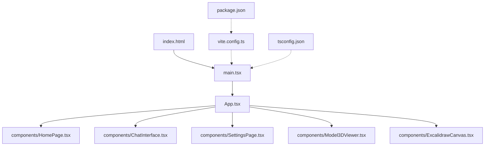
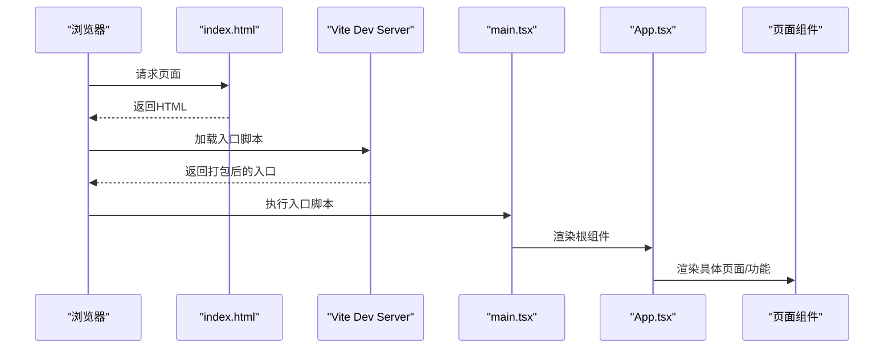
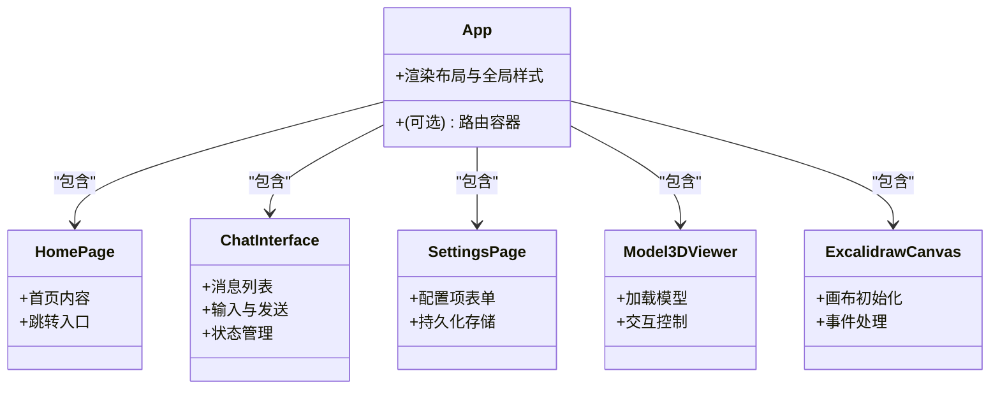

# React应用结构

<cite>
**本文档引用的文件**   
- [frontend/src/main.tsx](file://frontend/src/main.tsx)
- [frontend/src/App.tsx](file://frontend/src/App.tsx)
- [frontend/src/components/ChatInterface.tsx](file://frontend/src/components/ChatInterface.tsx)
- [frontend/src/components/HomePage.tsx](file://frontend/src/components/HomePage.tsx)
- [frontend/src/components/SettingsPage.tsx](file://frontend/src/components/SettingsPage.tsx)
- [frontend/src/components/Model3DViewer.tsx](file://frontend/src/components/Model3DViewer.tsx)
- [frontend/src/components/ExcalidrawCanvas.tsx](file://frontend/src/components/ExcalidrawCanvas.tsx)
- [frontend/vite.config.ts](file://frontend/vite.config.ts)
- [frontend/tsconfig.json](file://frontend/tsconfig.json)
- [frontend/package.json](file://frontend/package.json)
- [frontend/index.html](file://frontend/index.html)
</cite>

## 目录
1. [简介](#简介)
2. [项目结构](#项目结构)
3. [核心组件](#核心组件)
4. [架构总览](#架构总览)
5. [详细组件分析](#详细组件分析)
6. [依赖与构建配置](#依赖与构建配置)
7. [性能优化与最佳实践](#性能优化与最佳实践)
8. [故障排查指南](#故障排查指南)
9. [结论](#结论)

## 简介
本文件面向基于 Vite + TypeScript 的 React 前端工程，聚焦于应用入口、组件层次、路由组织、模块规范、TypeScript 与 Vite 配置、开发工作流以及性能优化策略。文档以仓库中的 frontend 子项目为范围，结合源码路径进行说明，帮助读者快速理解并高效扩展该应用。

## 项目结构
前端采用“功能/页面组件”为主的目录组织方式：
- src/main.tsx：应用启动与根节点挂载
- src/App.tsx：顶层布局与全局样式
- src/components：页面与业务组件（HomePage、ChatInterface、SettingsPage、Model3DViewer、ExcalidrawCanvas）
- vite.config.ts：Vite 构建与开发服务器配置
- tsconfig.json / tsconfig.node.json：TypeScript 编译与 Node 工具链类型声明
- package.json：脚本、依赖与版本约束
- index.html：HTML 模板与资源注入点

图表来源
- [frontend/index.html](file://frontend/index.html)
- [frontend/src/main.tsx](file://frontend/src/main.tsx)
- [frontend/src/App.tsx](file://frontend/src/App.tsx)
- [frontend/src/components/HomePage.tsx](file://frontend/src/components/HomePage.tsx)
- [frontend/src/components/ChatInterface.tsx](file://frontend/src/components/ChatInterface.tsx)
- [frontend/src/components/SettingsPage.tsx](file://frontend/src/components/SettingsPage.tsx)
- [frontend/src/components/Model3DViewer.tsx](file://frontend/src/components/Model3DViewer.tsx)
- [frontend/src/components/ExcalidrawCanvas.tsx](file://frontend/src/components/ExcalidrawCanvas.tsx)
- [frontend/vite.config.ts](file://frontend/vite.config.ts)
- [frontend/tsconfig.json](file://frontend/tsconfig.json)
- [frontend/package.json](file://frontend/package.json)

章节来源
- [frontend/src/main.tsx](file://frontend/src/main.tsx)
- [frontend/src/App.tsx](file://frontend/src/App.tsx)
- [frontend/vite.config.ts](file://frontend/vite.config.ts)
- [frontend/tsconfig.json](file://frontend/tsconfig.json)
- [frontend/package.json](file://frontend/package.json)
- [frontend/index.html](file://frontend/index.html)

## 核心组件
- main.tsx：负责创建 React 根容器、渲染 App 根组件，并可在此处注入全局 Provider、错误边界或日志埋点。
- App.tsx：作为应用壳层，承载全局样式、导航/布局框架，并在未来接入路由时承担路由容器职责。
- components/*：按页面/能力划分的组件集合，便于独立维护与按需加载。

章节来源
- [frontend/src/main.tsx](file://frontend/src/main.tsx)
- [frontend/src/App.tsx](file://frontend/src/App.tsx)

## 架构总览
整体采用“单入口 + 组件树”模式，当前未引入第三方路由库，页面切换可通过条件渲染或轻量路由实现。后续建议引入 react-router-dom 进行声明式路由管理，并结合懒加载与代码分割提升首屏性能。

图表来源
- [frontend/index.html](file://frontend/index.html)
- [frontend/src/main.tsx](file://frontend/src/main.tsx)
- [frontend/src/App.tsx](file://frontend/src/App.tsx)

## 详细组件分析

### 入口与根组件
- main.tsx
  - 职责：初始化 React 根实例、挂载到 DOM、可选的全局上下文/错误边界注入。
  - 关键点：确保在开发模式下保留调试信息；在生产模式下启用必要的优化开关。
- App.tsx
  - 职责：提供全局样式、布局容器；若引入路由，则作为路由容器。
  - 关键点：保持“薄壳”，将业务逻辑下沉至页面组件。

章节来源
- [frontend/src/main.tsx](file://frontend/src/main.tsx)
- [frontend/src/App.tsx](file://frontend/src/App.tsx)

### 页面与功能组件
- HomePage.tsx：首页展示与导航入口
- ChatInterface.tsx：对话交互界面
- SettingsPage.tsx：设置页
- Model3DViewer.tsx：3D 模型查看器
- ExcalidrawCanvas.tsx：绘图画布集成

图表来源
- [frontend/src/App.tsx](file://frontend/src/App.tsx)
- [frontend/src/components/HomePage.tsx](file://frontend/src/components/HomePage.tsx)
- [frontend/src/components/ChatInterface.tsx](file://frontend/src/components/ChatInterface.tsx)
- [frontend/src/components/SettingsPage.tsx](file://frontend/src/components/SettingsPage.tsx)
- [frontend/src/components/Model3DViewer.tsx](file://frontend/src/components/Model3DViewer.tsx)
- [frontend/src/components/ExcalidrawCanvas.tsx](file://frontend/src/components/ExcalidrawCanvas.tsx)

章节来源
- [frontend/src/components/HomePage.tsx](file://frontend/src/components/HomePage.tsx)
- [frontend/src/components/ChatInterface.tsx](file://frontend/src/components/ChatInterface.tsx)
- [frontend/src/components/SettingsPage.tsx](file://frontend/src/components/SettingsPage.tsx)
- [frontend/src/components/Model3DViewer.tsx](file://frontend/src/components/Model3DViewer.tsx)
- [frontend/src/components/ExcalidrawCanvas.tsx](file://frontend/src/components/ExcalidrawCanvas.tsx)

## 依赖与构建配置

### TypeScript 配置要点
- 目标与模块系统：根据运行环境与打包器选择合适 target/module/moduleResolution。
- JSX 支持：启用 jsx/react-jsx 或 classic，配合 Vite 的默认行为。
- 严格性与类型增强：开启 strict、noImplicitAny 等，保证类型安全。
- 路径别名与声明：通过 baseUrl、paths 与 vite-env.d.ts 统一导入风格。

章节来源
- [frontend/tsconfig.json](file://frontend/tsconfig.json)

### Vite 构建与开发配置
- 开发服务器：端口、代理、热更新、环境变量注入。
- 构建产物：输出目录、资源哈希、压缩与分包策略。
- 插件生态：按需引入、SVG/图片处理、CSS 预处理等。

章节来源
- [frontend/vite.config.ts](file://frontend/vite.config.ts)

### 包管理与脚本
- 依赖声明：React、Vite、TypeScript 及常用工具库的版本锁定。
- 脚本命令：开发、构建、预览、类型检查等。
- 环境隔离：通过 .env 系列文件区分开发与生产变量。

章节来源
- [frontend/package.json](file://frontend/package.json)

## 性能优化与最佳实践

### 代码分割与懒加载
- 使用动态 import() 对大体积页面/组件进行拆分，减少首屏体积。
- 结合 Suspense 与 ErrorBoundary 提供友好的加载与降级体验。
- 对第三方重型库（如 3D 查看器、绘图库）优先采用按需引入与懒加载。

### 资源与缓存
- 静态资源走 CDN 并开启强缓存；构建产物文件名带哈希以便长期缓存。
- 图片/媒体资源按需压缩与格式转换（WebP/AVIF）。

### 运行时优化
- 避免不必要的重渲染：合理拆分组件、使用 memo/useMemo/useCallback。
- 列表渲染使用稳定 key，避免全量 diff。
- 长列表虚拟化（虚拟滚动）以降低 DOM 压力。

### 监控与可观测性
- 接入错误上报与性能指标采集（FCP/LCP/CLS），定位瓶颈。
- 关键用户路径埋点，辅助持续优化。

[本节为通用指导，不直接分析具体文件]

## 故障排查指南
- 启动失败
  - 检查 Node 版本与包管理器一致性，清理 node_modules 后重装依赖。
  - 确认端口占用与环境变量注入是否正确。
- 类型报错
  - 核对 tsconfig 的 target/module 与 Vite 插件兼容性。
  - 补充缺失的类型声明或在 vite-env.d.ts 中扩展全局类型。
- 构建异常
  - 检查资源路径与别名映射是否一致。
  - 关注第三方库的 ESM/CJS 兼容问题，必要时添加 resolve.alias。
- 运行时白屏
  - 打开控制台查看 JS 错误；对大型组件启用懒加载与错误边界。
  - 检查环境变量与后端接口可达性。

[本节为通用指导，不直接分析具体文件]

## 结论
本项目采用清晰的“入口 + 根组件 + 页面组件”分层，配合 Vite 的高性能构建与 TypeScript 的类型保障，具备良好的可扩展性与可维护性。建议在后续迭代中引入声明式路由、完善错误边界与性能监控，并通过代码分割与资源优化持续提升用户体验。