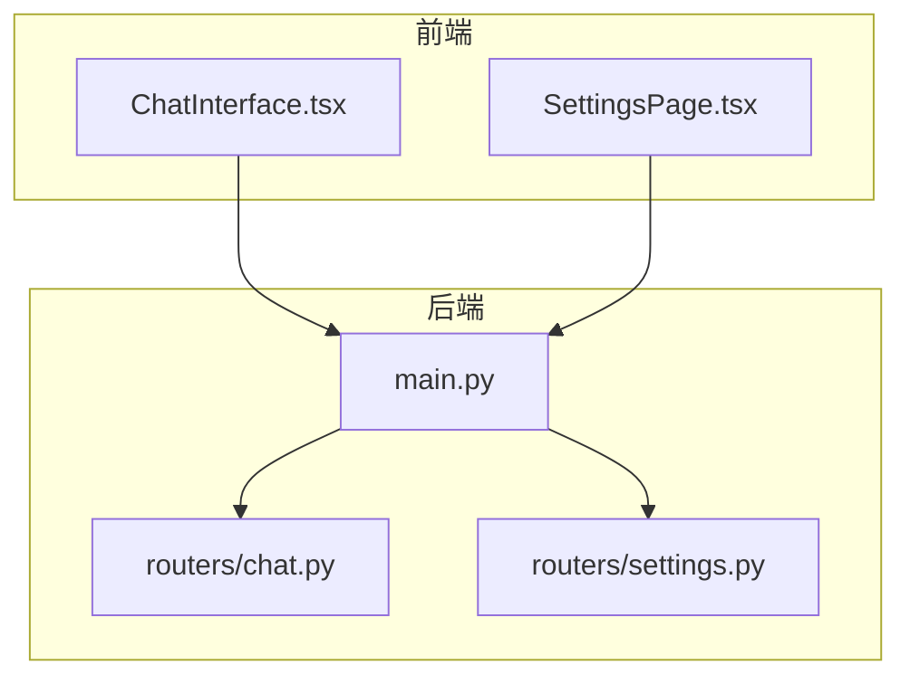
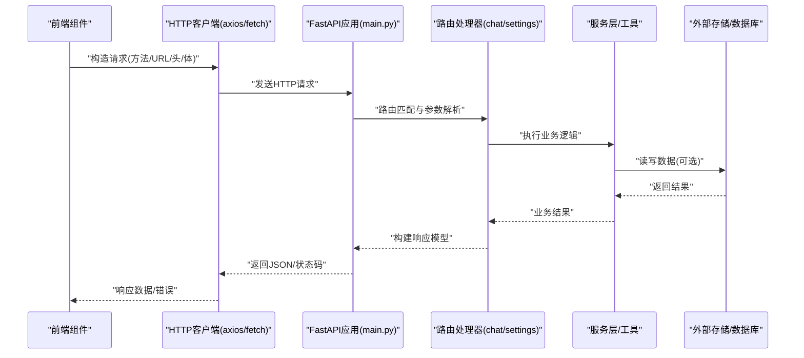
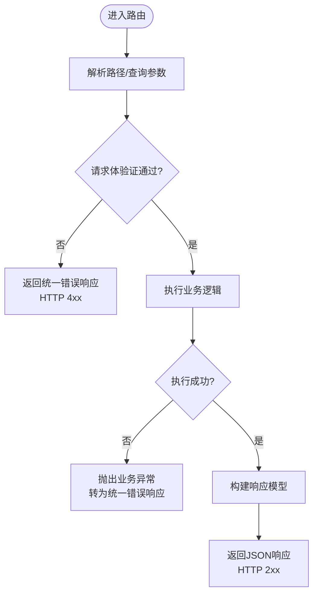
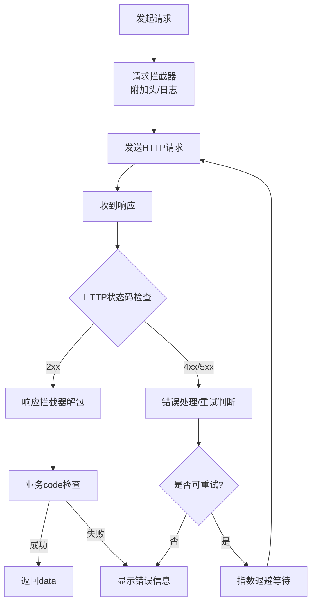
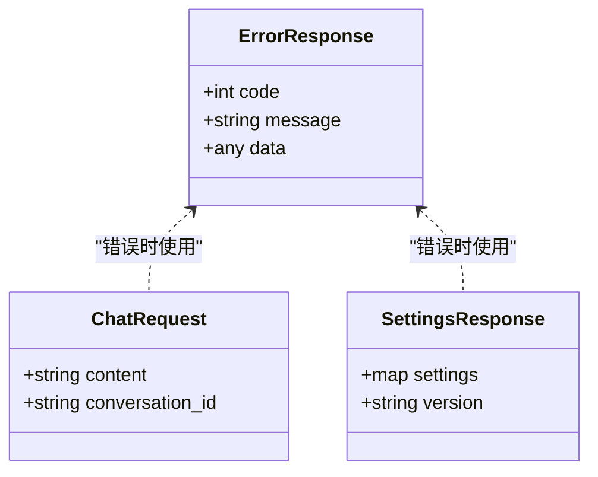
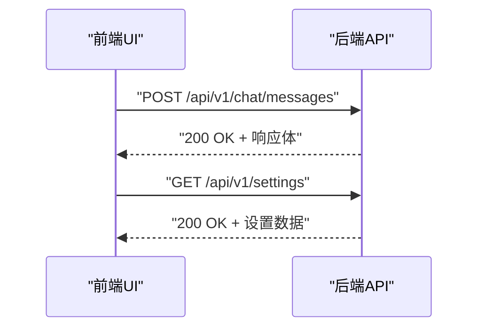
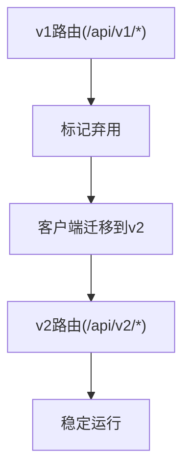
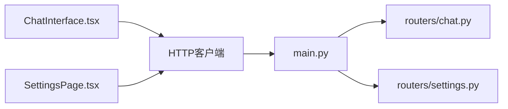

# REST API通信

<cite>
**本文引用的文件**   
- [backend/app/main.py](file://backend/app/main.py)
- [backend/app/routers/chat.py](file://backend/app/routers/chat.py)
- [backend/app/routers/settings.py](file://backend/app/routers/settings.py)
- [frontend/src/components/ChatInterface.tsx](file://frontend/src/components/ChatInterface.tsx)
- [frontend/src/components/SettingsPage.tsx](file://frontend/src/components/SettingsPage.tsx)
</cite>

## 目录
1. [简介](#简介)
2. [项目结构](#项目结构)
3. [核心组件](#核心组件)
4. [架构总览](#架构总览)
5. [详细组件分析](#详细组件分析)
6. [依赖关系分析](#依赖关系分析)
7. [性能考虑](#性能考虑)
8. [故障排查指南](#故障排查指南)
9. [结论](#结论)
10. [附录](#附录)

## 简介
本文件聚焦于前后端REST API通信的完整实现与最佳实践，覆盖以下主题：
- 前端HTTP客户端封装（axios或fetch）：基础配置、请求/响应拦截器、重试策略、超时与并发控制。
- 后端FastAPI路由设计：路径参数、查询参数、请求体验证、响应模型定义。
- 数据序列化/反序列化、错误码统一规范、状态码映射机制。
- 常见调用场景示例：聊天消息发送、设置项获取。
- API版本管理与向后兼容性策略。

## 项目结构
本项目采用前后端分离架构：
- 后端使用FastAPI提供REST接口，路由按功能模块划分（如chat、settings）。
- 前端通过React组件发起HTTP请求，调用后端API完成业务操作。

图表来源
- [backend/app/main.py](file://backend/app/main.py)
- [backend/app/routers/chat.py](file://backend/app/routers/chat.py)
- [backend/app/routers/settings.py](file://backend/app/routers/settings.py)
- [frontend/src/components/ChatInterface.tsx](file://frontend/src/components/ChatInterface.tsx)
- [frontend/src/components/SettingsPage.tsx](file://frontend/src/components/SettingsPage.tsx)

章节来源
- [backend/app/main.py](file://backend/app/main.py)
- [backend/app/routers/chat.py](file://backend/app/routers/chat.py)
- [backend/app/routers/settings.py](file://backend/app/routers/settings.py)
- [frontend/src/components/ChatInterface.tsx](file://frontend/src/components/ChatInterface.tsx)
- [frontend/src/components/SettingsPage.tsx](file://frontend/src/components/SettingsPage.tsx)

## 核心组件
- 后端入口与路由挂载：在应用主文件中注册并挂载各功能路由，形成统一的API网关入口。
- 聊天路由：提供聊天消息发送等接口，支持路径参数、查询参数与请求体验证。
- 设置路由：提供设置项读取/更新等接口，返回标准化的响应模型。
- 前端组件：在聊天界面和设置页面中发起HTTP请求，处理成功与失败分支，展示用户反馈。

章节来源
- [backend/app/main.py](file://backend/app/main.py)
- [backend/app/routers/chat.py](file://backend/app/routers/chat.py)
- [backend/app/routers/settings.py](file://backend/app/routers/settings.py)
- [frontend/src/components/ChatInterface.tsx](file://frontend/src/components/ChatInterface.tsx)
- [frontend/src/components/SettingsPage.tsx](file://frontend/src/components/SettingsPage.tsx)

## 架构总览
下图展示了从前端到后端的典型REST请求流程，包括路由分发、参数校验、响应序列化与错误处理。

图表来源
- [backend/app/main.py](file://backend/app/main.py)
- [backend/app/routers/chat.py](file://backend/app/routers/chat.py)
- [backend/app/routers/settings.py](file://backend/app/routers/settings.py)

## 详细组件分析

### 后端FastAPI路由设计模式
- 路径参数与查询参数
  - 在路由函数签名中声明路径参数与查询参数，由框架自动解析与类型转换。
  - 建议为关键参数添加默认值与约束，提升健壮性。
- 请求体验证
  - 使用Pydantic模型对请求体进行结构化验证，确保字段类型、必填性与取值范围。
  - 对复杂对象嵌套字段进行分层建模，便于复用与维护。
- 响应模型定义
  - 使用Pydantic模型定义响应结构，保证序列化一致性与文档自动生成。
  - 将通用字段（如code、message、data）抽象为基类，减少重复代码。
- 错误处理与状态码映射
  - 针对业务异常抛出标准化错误，并在中间件或全局异常处理器中转换为统一响应格式。
  - 明确HTTP状态码语义：2xx成功、4xx客户端错误、5xx服务端错误。

图表来源
- [backend/app/routers/chat.py](file://backend/app/routers/chat.py)
- [backend/app/routers/settings.py](file://backend/app/routers/settings.py)

章节来源
- [backend/app/routers/chat.py](file://backend/app/routers/chat.py)
- [backend/app/routers/settings.py](file://backend/app/routers/settings.py)

### 前端HTTP客户端封装（axios/fetch）
- 基础配置
  - 设置基础URL、默认超时时间、Content-Type等常用头。
  - 根据环境区分开发/生产配置，避免硬编码。
- 请求拦截器
  - 注入认证令牌、追踪ID、请求开始时间戳。
  - 对敏感信息进行脱敏打印，便于调试。
- 响应拦截器
  - 统一解包响应体，提取code、message、data。
  - 根据HTTP状态码与业务code进行分支处理，集中提示错误。
- 重试策略
  - 对幂等请求（GET/HEAD/OPTIONS）在网络错误或5xx时自动重试，限制最大次数与退避间隔。
  - 非幂等请求谨慎重试，避免副作用放大。
- 超时与并发控制
  - 为不同接口设置差异化超时；长耗时任务使用更长时间或分片处理。
  - 使用信号量或队列限制并发数，防止雪崩。
- 取消与竞态保护
  - 使用AbortController取消过期请求，避免旧响应覆盖新状态。
- 错误分类与用户提示
  - 网络错误、超时、鉴权失效、业务错误分别处理，给出友好提示与引导。

[此图为概念流程图，不直接对应具体源码文件]

章节来源
- [frontend/src/components/ChatInterface.tsx](file://frontend/src/components/ChatInterface.tsx)
- [frontend/src/components/SettingsPage.tsx](file://frontend/src/components/SettingsPage.tsx)

### 数据序列化与反序列化
- 后端
  - 使用Pydantic模型定义请求体与响应体，确保类型安全与文档生成。
  - 对日期、枚举、嵌套对象进行规范化处理，避免歧义。
- 前端
  - 对响应数据进行类型断言与必要转换（如字符串转数字、时间格式化）。
  - 对输入表单数据进行前置校验，减少无效请求。

章节来源
- [backend/app/routers/chat.py](file://backend/app/routers/chat.py)
- [backend/app/routers/settings.py](file://backend/app/routers/settings.py)
- [frontend/src/components/ChatInterface.tsx](file://frontend/src/components/ChatInterface.tsx)
- [frontend/src/components/SettingsPage.tsx](file://frontend/src/components/SettingsPage.tsx)

### 错误码统一规范与状态码映射
- 统一错误响应结构
  - code：业务错误码（整数或字符串），用于前端精准定位问题。
  - message：人类可读的错误描述。
  - data：可选的附加信息。
- HTTP状态码映射
  - 200：成功。
  - 400：请求参数错误。
  - 401/403：鉴权/授权失败。
  - 404：资源不存在。
  - 429：限流。
  - 500：服务器内部错误。
- 全局异常处理
  - 捕获未处理异常，记录日志并返回统一错误结构。
  - 区分可恢复错误与不可恢复错误，指导前端重试或提示。

图表来源
- [backend/app/routers/chat.py](file://backend/app/routers/chat.py)
- [backend/app/routers/settings.py](file://backend/app/routers/settings.py)

章节来源
- [backend/app/routers/chat.py](file://backend/app/routers/chat.py)
- [backend/app/routers/settings.py](file://backend/app/routers/settings.py)

### 常见API调用场景示例
- 聊天消息发送
  - 前端：在聊天界面组件中收集用户输入，调用聊天接口，处理流式或非流式响应，渲染消息列表。
  - 后端：接收聊天请求，验证内容长度与格式，执行业务逻辑，返回结构化响应。
- 设置项获取
  - 前端：在设置页面加载时拉取当前设置，展示并允许编辑保存。
  - 后端：提供只读或读写接口，返回标准化设置数据结构。

图表来源
- [backend/app/routers/chat.py](file://backend/app/routers/chat.py)
- [backend/app/routers/settings.py](file://backend/app/routers/settings.py)
- [frontend/src/components/ChatInterface.tsx](file://frontend/src/components/ChatInterface.tsx)
- [frontend/src/components/SettingsPage.tsx](file://frontend/src/components/SettingsPage.tsx)

章节来源
- [backend/app/routers/chat.py](file://backend/app/routers/chat.py)
- [backend/app/routers/settings.py](file://backend/app/routers/settings.py)
- [frontend/src/components/ChatInterface.tsx](file://frontend/src/components/ChatInterface.tsx)
- [frontend/src/components/SettingsPage.tsx](file://frontend/src/components/SettingsPage.tsx)

### API版本管理与向后兼容
- 版本化策略
  - URL前缀包含版本号（如/api/v1），便于并行维护多版本。
  - 大版本变更时保留旧路由一段时间，逐步迁移客户端。
- 向后兼容
  - 新增字段默认空值或兼容默认值，避免破坏旧客户端。
  - 废弃字段标记弃用说明，保留至少一个主版本周期。
- 灰度与回滚
  - 通过特性开关或A/B流量控制渐进发布新版本。
  - 快速回滚至稳定版本，保障可用性。

[此图为概念流程图，不直接对应具体源码文件]

## 依赖关系分析
- 前端组件依赖HTTP客户端库（axios或fetch），并通过拦截器统一管理请求/响应。
- 后端路由依赖FastAPI框架与Pydantic模型，负责参数校验与响应序列化。
- 主应用文件负责挂载路由，形成统一入口。

图表来源
- [backend/app/main.py](file://backend/app/main.py)
- [backend/app/routers/chat.py](file://backend/app/routers/chat.py)
- [backend/app/routers/settings.py](file://backend/app/routers/settings.py)
- [frontend/src/components/ChatInterface.tsx](file://frontend/src/components/ChatInterface.tsx)
- [frontend/src/components/SettingsPage.tsx](file://frontend/src/components/SettingsPage.tsx)

章节来源
- [backend/app/main.py](file://backend/app/main.py)
- [backend/app/routers/chat.py](file://backend/app/routers/chat.py)
- [backend/app/routers/settings.py](file://backend/app/routers/settings.py)
- [frontend/src/components/ChatInterface.tsx](file://frontend/src/components/ChatInterface.tsx)
- [frontend/src/components/SettingsPage.tsx](file://frontend/src/components/SettingsPage.tsx)

## 性能考虑
- 连接复用与Keep-Alive：保持长连接，减少握手开销。
- 请求合并与去抖：对频繁触发的事件（如搜索）进行去抖与合并。
- 分页与增量更新：大数据集采用分页与增量同步，降低带宽占用。
- 缓存策略：对静态或低频变化数据启用浏览器与服务端缓存。
- 限流与熔断：在后端实施速率限制，在前端避免过载请求。

[本节为通用指导，不直接分析具体文件]

## 故障排查指南
- 常见问题定位
  - 网络错误：检查代理、跨域、证书与DNS解析。
  - 超时：调整超时阈值，检查后端处理耗时与数据库慢查询。
  - 鉴权失败：确认令牌有效期、刷新机制与权限配置。
  - 参数校验失败：核对请求体结构与类型，查看后端校验规则。
- 日志与追踪
  - 前端：记录请求ID、时间戳、入参与出参摘要（脱敏）。
  - 后端：记录异常堆栈、上下文信息与性能指标。
- 重试与降级
  - 对幂等接口启用有限重试；对非幂等接口谨慎重试。
  - 关键链路提供降级方案（如返回缓存数据或默认值）。

章节来源
- [backend/app/routers/chat.py](file://backend/app/routers/chat.py)
- [backend/app/routers/settings.py](file://backend/app/routers/settings.py)
- [frontend/src/components/ChatInterface.tsx](file://frontend/src/components/ChatInterface.tsx)
- [frontend/src/components/SettingsPage.tsx](file://frontend/src/components/SettingsPage.tsx)

## 结论
通过统一的前端HTTP客户端封装与后端FastAPI路由设计，可实现高内聚、低耦合的REST API通信体系。结合严格的参数校验、统一的错误响应、合理的重试与超时策略，以及完善的版本管理，能够显著提升系统的稳定性与可维护性。

## 附录
- 术语表
  - 幂等：多次执行不会产生额外副作用的操作（如GET）。
  - 退避：重试时的等待时间随次数递增的策略。
  - 灰度发布：逐步将新版本暴露给部分用户以降低风险。
- 参考清单
  - 前端组件：聊天界面、设置页面。
  - 后端路由：聊天、设置。
  - 应用入口：主应用文件。