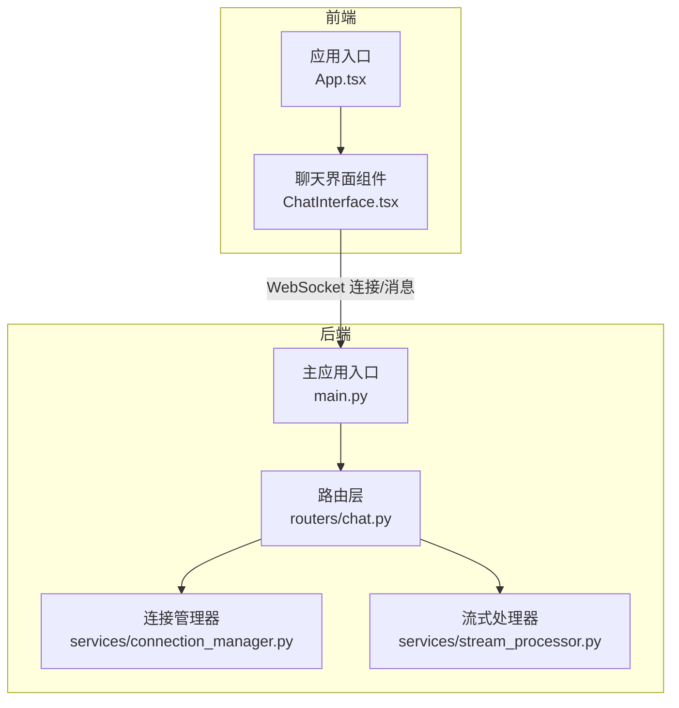
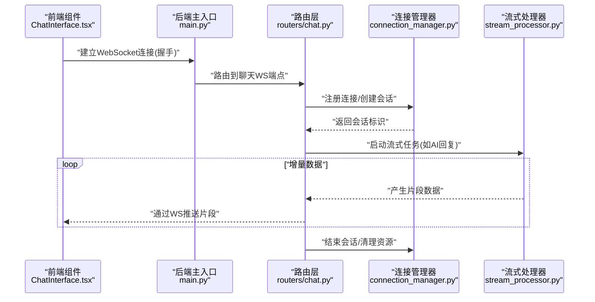
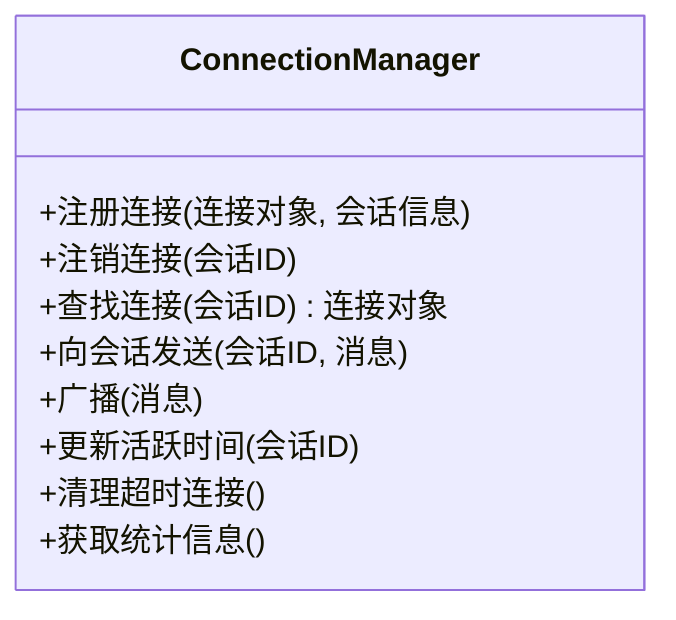
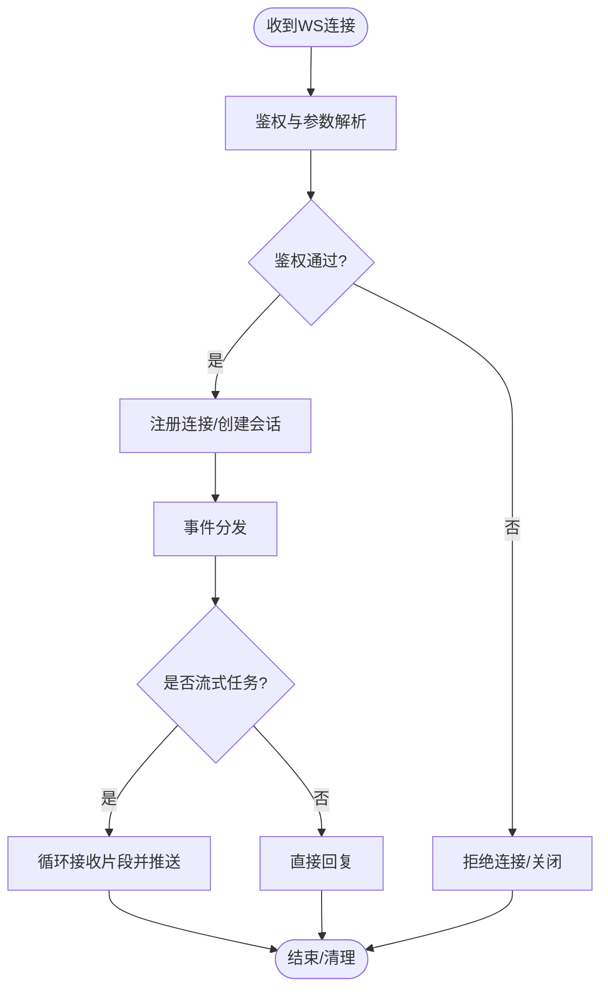
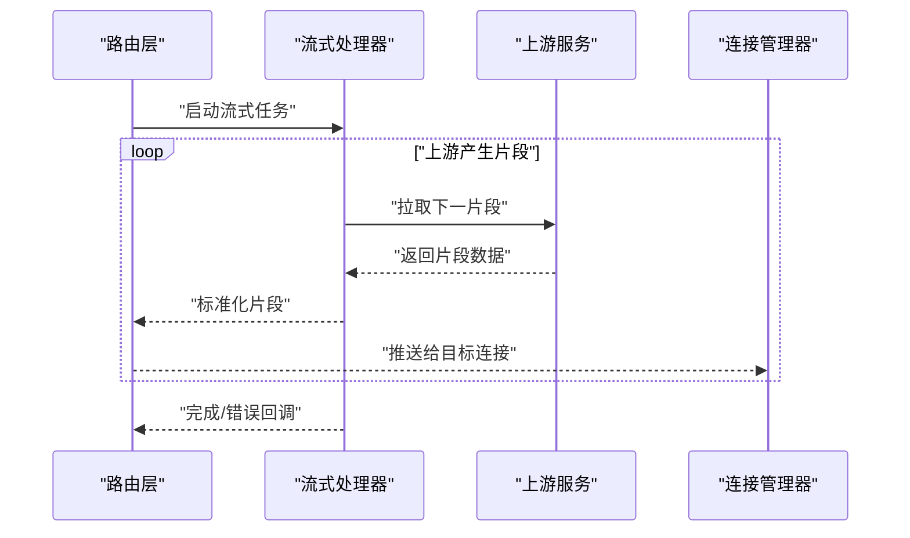
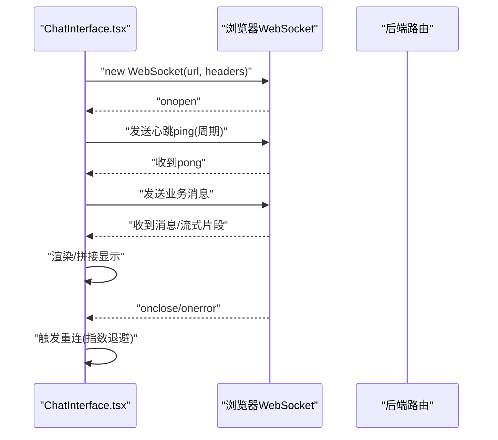
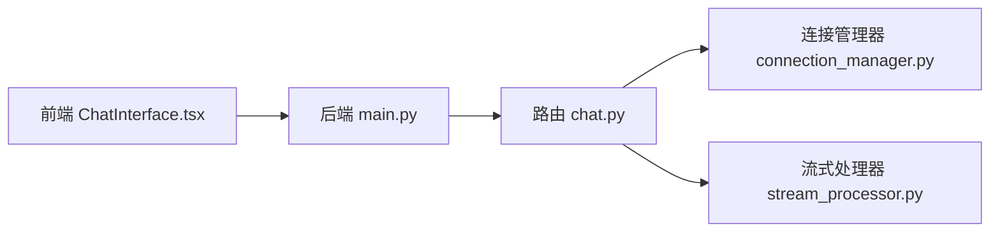

# WebSocket实时通信

<cite>
**本文引用的文件**   
- [backend/app/main.py](file://backend/app/main.py)
- [backend/app/services/connection_manager.py](file://backend/app/services/connection_manager.py)
- [backend/app/routers/chat.py](file://backend/app/routers/chat.py)
- [backend/app/services/stream_processor.py](file://backend/app/services/stream_processor.py)
- [frontend/src/components/ChatInterface.tsx](file://frontend/src/components/ChatInterface.tsx)
</cite>

## 目录
1. [简介](#简介)
2. [项目结构](#项目结构)
3. [核心组件](#核心组件)
4. [架构总览](#架构总览)
5. [详细组件分析](#详细组件分析)
6. [依赖关系分析](#依赖关系分析)
7. [性能考虑](#性能考虑)
8. [故障排查指南](#故障排查指南)
9. [结论](#结论)
10. [附录](#附录)

## 简介
本文件围绕后端与前端之间的WebSocket实时通信，系统性地阐述连接建立、认证机制、心跳检测、消息协议设计、连接管理器实现、流式数据处理（含SSE与增量传输）、断线重连策略、错误处理与恢复，以及典型应用场景（实时聊天、流式AI响应）的实现要点。文档以仓库现有代码为依据，结合可视化图示帮助读者快速理解整体设计与关键流程。

## 项目结构
本项目采用前后端分离架构：
- 后端基于Python服务，提供HTTP路由与WebSocket接口，包含连接管理、流式处理等核心服务。
- 前端使用React+TypeScript，通过浏览器原生WebSocket API与服务端交互，并在UI中展示实时消息与流式输出。

图表来源
- [backend/app/main.py](file://backend/app/main.py)
- [backend/app/routers/chat.py](file://backend/app/routers/chat.py)
- [backend/app/services/connection_manager.py](file://backend/app/services/connection_manager.py)
- [backend/app/services/stream_processor.py](file://backend/app/services/stream_processor.py)
- [frontend/src/components/ChatInterface.tsx](file://frontend/src/components/ChatInterface.tsx)

章节来源
- [backend/app/main.py](file://backend/app/main.py)
- [backend/app/routers/chat.py](file://backend/app/routers/chat.py)
- [backend/app/services/connection_manager.py](file://backend/app/services/connection_manager.py)
- [backend/app/services/stream_processor.py](file://backend/app/services/stream_processor.py)
- [frontend/src/components/ChatInterface.tsx](file://frontend/src/components/ChatInterface.tsx)

## 核心组件
- 连接管理器：负责多用户连接的维护、会话状态管理、连接池优化、广播与定向推送。
- 路由层：暴露HTTP与WebSocket接口，完成鉴权、参数校验、事件分发。
- 流式处理器：封装增量数据生成与发送逻辑，支持SSE或WebSocket分片传输。
- 前端聊天组件：封装WebSocket生命周期管理、心跳、断线重连、消息渲染与错误提示。

章节来源
- [backend/app/services/connection_manager.py](file://backend/app/services/connection_manager.py)
- [backend/app/routers/chat.py](file://backend/app/routers/chat.py)
- [backend/app/services/stream_processor.py](file://backend/app/services/stream_processor.py)
- [frontend/src/components/ChatInterface.tsx](file://frontend/src/components/ChatInterface.tsx)

## 架构总览
下图展示了从前端发起WebSocket连接到服务端处理并返回流式响应的端到端流程。

图表来源
- [backend/app/main.py](file://backend/app/main.py)
- [backend/app/routers/chat.py](file://backend/app/routers/chat.py)
- [backend/app/services/connection_manager.py](file://backend/app/services/connection_manager.py)
- [backend/app/services/stream_processor.py](file://backend/app/services/stream_processor.py)
- [frontend/src/components/ChatInterface.tsx](file://frontend/src/components/ChatInterface.tsx)

## 详细组件分析

### 连接管理器（ConnectionManager）
职责
- 维护活跃连接集合，按用户/会话维度索引。
- 提供连接注册、注销、查找、广播与定向发送能力。
- 管理会话状态（在线、离线、异常），支持连接池优化（复用、限流、容量控制）。
- 与心跳检测配合，及时回收僵尸连接。

关键能力
- 多用户连接维护：以用户ID或会话ID为键，映射到具体连接实例。
- 会话状态管理：记录连接建立时间、最后活跃时间、状态机（新建、活跃、空闲、断开）。
- 连接池优化：限制最大并发、队列长度、背压策略；在内存占用与吞吐之间平衡。

图表来源
- [backend/app/services/connection_manager.py](file://backend/app/services/connection_manager.py)

章节来源
- [backend/app/services/connection_manager.py](file://backend/app/services/connection_manager.py)

### 路由层（聊天WebSocket端点）
职责
- 暴露WebSocket路径，完成握手与鉴权。
- 解析客户端请求头/查询参数，提取用户身份与会话上下文。
- 将业务事件路由至连接管理器与流式处理器。
- 统一错误码与消息格式，保证前后端契约一致。

关键流程
- 握手阶段：读取鉴权令牌、校验权限、绑定用户与会话。
- 事件分发：根据消息类型调用不同处理函数（如“开始对话”、“发送消息”、“停止生成”）。
- 流式输出：将流式处理器产生的片段逐条推送到对应连接。

图表来源
- [backend/app/routers/chat.py](file://backend/app/routers/chat.py)

章节来源
- [backend/app/routers/chat.py](file://backend/app/routers/chat.py)

### 流式处理器（StreamProcessor）
职责
- 封装增量数据的生成与消费，适配多种上游（如LLM流式接口）。
- 将上游片段转换为统一的消息格式，交由路由层推送。
- 支持SSE或WebSocket两种传输模式，保持上层一致性。

关键特性
- 增量数据传输：按块返回内容，降低首字节延迟。
- 断点续传与补偿：对失败片段进行重试或合并，确保完整性。
- 背压与节流：当消费者慢时，自动缓冲或丢弃策略可控。

图表来源
- [backend/app/services/stream_processor.py](file://backend/app/services/stream_processor.py)
- [backend/app/routers/chat.py](file://backend/app/routers/chat.py)
- [backend/app/services/connection_manager.py](file://backend/app/services/connection_manager.py)

章节来源
- [backend/app/services/stream_processor.py](file://backend/app/services/stream_processor.py)

### 前端聊天组件（ChatInterface）
职责
- 管理WebSocket生命周期：连接、发送、接收、关闭。
- 实现心跳检测与断线重连，保障弱网环境下的稳定性。
- 渲染实时消息与流式输出，提供用户交互反馈。

关键流程
- 连接建立：构造URL与头部，携带鉴权信息。
- 心跳机制：定时发送ping，服务端回pong；超时则触发重连。
- 断线重连：指数退避、最大重试次数、抖动随机化。
- 消息处理：根据消息类型区分普通消息与流式片段，增量拼接显示。

图表来源
- [frontend/src/components/ChatInterface.tsx](file://frontend/src/components/ChatInterface.tsx)

章节来源
- [frontend/src/components/ChatInterface.tsx](file://frontend/src/components/ChatInterface.tsx)

## 依赖关系分析
- 路由层依赖连接管理器与流式处理器，形成“接入-调度-执行”的清晰分层。
- 连接管理器作为中心枢纽，被路由层与流式处理器共同使用，承担会话与连接的生命周期管理。
- 前端仅依赖浏览器原生WebSocket API，不耦合后端实现细节。

图表来源
- [backend/app/main.py](file://backend/app/main.py)
- [backend/app/routers/chat.py](file://backend/app/routers/chat.py)
- [backend/app/services/connection_manager.py](file://backend/app/services/connection_manager.py)
- [backend/app/services/stream_processor.py](file://backend/app/services/stream_processor.py)
- [frontend/src/components/ChatInterface.tsx](file://frontend/src/components/ChatInterface.tsx)

章节来源
- [backend/app/main.py](file://backend/app/main.py)
- [backend/app/routers/chat.py](file://backend/app/routers/chat.py)
- [backend/app/services/connection_manager.py](file://backend/app/services/connection_manager.py)
- [backend/app/services/stream_processor.py](file://backend/app/services/stream_processor.py)
- [frontend/src/components/ChatInterface.tsx](file://frontend/src/components/ChatInterface.tsx)

## 性能考虑
- 连接池与并发控制：限制单进程最大连接数，避免内存泄漏与CPU争用。
- 背压与缓冲：在流式场景下，合理设置缓冲区大小与丢弃策略，防止OOM。
- 心跳间隔与超时阈值：根据网络质量动态调整，减少误判与频繁重连。
- 序列化与压缩：对大消息启用压缩，降低带宽占用。
- 水平扩展：在多实例部署时，使用外部存储（如Redis）共享连接与会话状态，实现跨节点广播。

[本节为通用指导，不涉及具体文件分析]

## 故障排查指南
常见问题与定位步骤
- 握手失败：检查鉴权令牌、CORS配置、端口与域名解析。
- 心跳超时：确认客户端心跳发送频率与服务端超时阈值匹配，查看网络丢包情况。
- 流式中断：核对上游服务的流式接口可用性，检查路由层的片段合并与重试逻辑。
- 连接泄漏：监控连接管理器统计信息，定期清理空闲与异常连接。
- 消息丢失：启用消息序列号与ACK机制，必要时进行补偿重放。

章节来源
- [backend/app/services/connection_manager.py](file://backend/app/services/connection_manager.py)
- [backend/app/routers/chat.py](file://backend/app/routers/chat.py)
- [backend/app/services/stream_processor.py](file://backend/app/services/stream_processor.py)
- [frontend/src/components/ChatInterface.tsx](file://frontend/src/components/ChatInterface.tsx)

## 结论
本方案通过清晰的层次划分与稳健的连接管理，实现了高可用、可扩展的WebSocket实时通信。结合心跳检测、断线重连与流式处理，能够支撑实时聊天与流式AI响应等典型场景。建议在生产环境中引入外部状态共享与监控告警，进一步提升系统的可观测性与弹性。

[本节为总结性内容，不涉及具体文件分析]

## 附录

### 消息协议设计（建议规范）
- 消息类型定义
  - 文本消息：用于普通聊天内容。
  - 流式片段：用于增量输出的内容块。
  - 控制消息：用于心跳、会话控制、错误通知等。
- 数据结构规范
  - 统一字段：消息ID、类型、时间戳、会话ID、载荷。
  - 流式片段字段：片段序号、累计进度、是否结束标志。
- 事件命名约定
  - 使用小写下划线风格，如 “chat.message”、“stream.chunk”、“control.ping”。

[本节为概念性说明，不涉及具体文件分析]

### SSE（Server-Sent Events）集成要点
- 适用场景：单向流式输出（如AI回答）。
- 传输格式：标准SSE文本流，包含事件名与数据体。
- 前端兼容：使用EventSource或自定义解析器，处理重连与错误。
- 与WebSocket对比：SSE更简单且天然支持重连，但无法双向通信。

[本节为概念性说明，不涉及具体文件分析]

### 典型应用场景示例

#### 实时聊天
- 连接建立：前端携带鉴权信息建立WebSocket连接。
- 消息收发：客户端发送聊天消息，服务端广播给同房间用户。
- 在线状态：连接管理器维护用户在线列表，支持踢人、禁言等控制。

章节来源
- [backend/app/routers/chat.py](file://backend/app/routers/chat.py)
- [backend/app/services/connection_manager.py](file://backend/app/services/connection_manager.py)
- [frontend/src/components/ChatInterface.tsx](file://frontend/src/components/ChatInterface.tsx)

#### 流式AI响应
- 启动任务：前端发送“开始生成”指令，后端启动流式处理器。
- 增量推送：上游模型返回片段，路由层将其标准化后推送。
- 前端渲染：按片段顺序拼接显示，支持滚动与暂停。

章节来源
- [backend/app/services/stream_processor.py](file://backend/app/services/stream_processor.py)
- [backend/app/routers/chat.py](file://backend/app/routers/chat.py)
- [frontend/src/components/ChatInterface.tsx](file://frontend/src/components/ChatInterface.tsx)