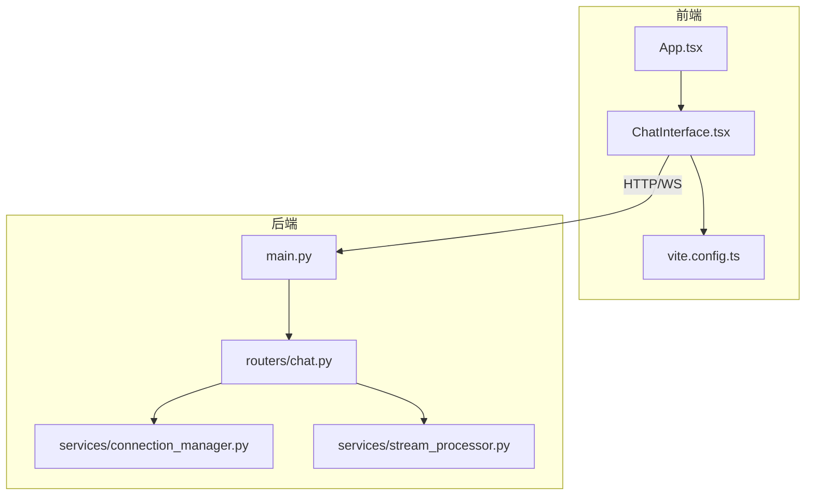
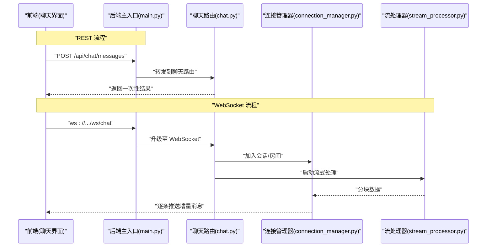
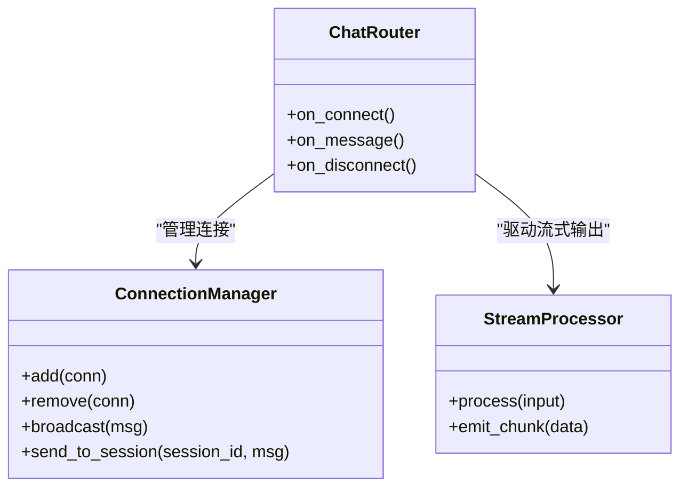
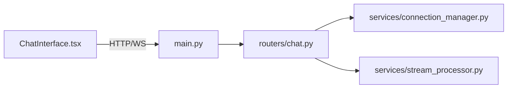

# 前后端通信机制

<cite>
**本文引用的文件**   
- [backend/app/main.py](file://backend/app/main.py)
- [backend/app/routers/chat.py](file://backend/app/routers/chat.py)
- [backend/app/services/connection_manager.py](file://backend/app/services/connection_manager.py)
- [backend/app/services/stream_processor.py](file://backend/app/services/stream_processor.py)
- [frontend/src/components/ChatInterface.tsx](file://frontend/src/components/ChatInterface.tsx)
- [frontend/src/App.tsx](file://frontend/src/App.tsx)
- [frontend/vite.config.ts](file://frontend/vite.config.ts)
</cite>

## 目录
1. [简介](#简介)
2. [项目结构](#项目结构)
3. [核心组件](#核心组件)
4. [架构总览](#架构总览)
5. [详细组件分析](#详细组件分析)
6. [依赖关系分析](#依赖关系分析)
7. [性能考虑](#性能考虑)
8. [故障排查指南](#故障排查指南)
9. [结论](#结论)
10. [附录](#附录)

## 简介
本文件聚焦于前后端通信机制，覆盖以下主题：
- RESTful API 调用封装、请求拦截器配置与响应数据处理
- WebSocket 实时通信：连接建立、消息格式、重连机制、错误处理
- 文件上传下载、进度监控与断点续传（实现建议）
- API 版本管理、请求缓存策略、并发控制
- 网络请求错误处理、超时重试与降级方案
- 前端状态管理与后端数据同步、乐观更新与离线支持

说明：当前仓库未包含通用 HTTP 客户端封装或全局拦截器代码。本节在“RESTful API 调用封装”部分提供基于现有路由与服务能力的集成建议与最佳实践；WebSocket 相关能力在后端已存在，前端通过聊天界面进行交互。

## 项目结构
本项目采用前后端分离架构：
- 后端使用 FastAPI 暴露 REST 接口与 WebSocket 服务
- 前端为 React + TypeScript 应用，通过 Vite 构建与开发代理

图表来源
- [backend/app/main.py](file://backend/app/main.py)
- [backend/app/routers/chat.py](file://backend/app/routers/chat.py)
- [backend/app/services/connection_manager.py](file://backend/app/services/connection_manager.py)
- [backend/app/services/stream_processor.py](file://backend/app/services/stream_processor.py)
- [frontend/src/App.tsx](file://frontend/src/App.tsx)
- [frontend/src/components/ChatInterface.tsx](file://frontend/src/components/ChatInterface.tsx)
- [frontend/vite.config.ts](file://frontend/vite.config.ts)

章节来源
- [backend/app/main.py](file://backend/app/main.py)
- [backend/app/routers/chat.py](file://backend/app/routers/chat.py)
- [backend/app/services/connection_manager.py](file://backend/app/services/connection_manager.py)
- [backend/app/services/stream_processor.py](file://backend/app/services/stream_processor.py)
- [frontend/src/App.tsx](file://frontend/src/App.tsx)
- [frontend/src/components/ChatInterface.tsx](file://frontend/src/components/ChatInterface.tsx)
- [frontend/vite.config.ts](file://frontend/vite.config.ts)

## 核心组件
- 后端入口与路由挂载：负责注册 REST 路由与 WebSocket 路由，统一接入中间件与异常处理
- 聊天路由：定义 REST 与 WS 的聊天相关接口，协调会话、历史与流式处理
- 连接管理器：维护 WebSocket 连接集合、广播与房间/会话级分发
- 流处理器：对模型输出进行分块处理与推送
- 前端聊天界面：发起 REST 请求、建立 WebSocket 连接、渲染增量消息、处理错误与重连

章节来源
- [backend/app/main.py](file://backend/app/main.py)
- [backend/app/routers/chat.py](file://backend/app/routers/chat.py)
- [backend/app/services/connection_manager.py](file://backend/app/services/connection_manager.py)
- [backend/app/services/stream_processor.py](file://backend/app/services/stream_processor.py)
- [frontend/src/components/ChatInterface.tsx](file://frontend/src/components/ChatInterface.tsx)

## 架构总览
整体通信路径包括两类：
- REST：用于一次性请求（如发送消息、获取历史、设置等）
- WebSocket：用于长连接、增量流式返回与实时事件

图表来源
- [backend/app/main.py](file://backend/app/main.py)
- [backend/app/routers/chat.py](file://backend/app/routers/chat.py)
- [backend/app/services/connection_manager.py](file://backend/app/services/connection_manager.py)
- [backend/app/services/stream_processor.py](file://backend/app/services/stream_processor.py)

## 详细组件分析

### RESTful API 调用封装与响应处理
现状与建议
- 当前仓库未包含统一的 HTTP 客户端封装或全局拦截器。建议在项目中引入并配置一个 HTTP 客户端（例如 axios），并在其内部实现：
  - 请求拦截器：注入鉴权头、请求 ID、追踪信息、基础 URL 与版本前缀
  - 响应拦截器：统一解析成功体、转换时间戳、标准化错误码
  - 错误处理：区分网络错误、业务错误、超时与重试策略
  - 并发控制：队列化高优先级任务、限制最大并发数
  - 请求缓存：按 URL+参数生成键，结合 TTL 与失效策略
  - 取消与去抖：AbortController 取消重复请求、防抖节流
- 针对大文件上传下载，建议使用分片上传、断点续传与进度回调；后端配合 Range 与 Content-Range 头实现范围读取。

章节来源
- [backend/app/routers/chat.py](file://backend/app/routers/chat.py)
- [backend/app/main.py](file://backend/app/main.py)

### 请求拦截器配置与响应数据处理（建议）
- 请求拦截器职责
  - 自动附加鉴权令牌与会话标识
  - 追加请求追踪 ID 与来源标记
  - 统一设置超时、Content-Type、Accept 与 API 版本前缀
- 响应拦截器职责
  - 统一解包成功载荷，提取 data/code/message
  - 将后端时间字符串转换为本地时间对象
  - 将业务错误映射为可展示的错误对象
- 错误处理与重试
  - 网络错误：指数退避重试，最多 N 次
  - 超时：可重试且具备幂等性时允许重试
  - 服务端错误：根据状态码决定重试或降级
- 并发控制
  - 使用信号量或队列限制同时进行的写操作数量
  - 读操作可并行但需考虑缓存一致性
- 请求缓存
  - GET 请求可按 URL+查询串缓存，TTL 过期后刷新
  - 写操作触发相关缓存失效

[本节为通用实现建议，不直接分析具体源码]

### WebSocket 实时通信实现
后端能力概览
- 主入口注册 WebSocket 路由
- 聊天路由处理连接生命周期与消息路由
- 连接管理器维护连接集合、广播与房间/会话级分发
- 流处理器负责将模型输出分块推送到连接

图表来源
- [backend/app/routers/chat.py](file://backend/app/routers/chat.py)
- [backend/app/services/connection_manager.py](file://backend/app/services/connection_manager.py)
- [backend/app/services/stream_processor.py](file://backend/app/services/stream_processor.py)

前端交互要点
- 连接建立：在聊天界面初始化时尝试建立 WS 连接，失败则进入重连流程
- 消息格式：定义统一的 JSON 协议，包含类型、负载、时间戳与追踪 ID
- 重连机制：指数退避、最大重试次数、心跳保活
- 错误处理：网络断开、服务端关闭、协议错误等场景的提示与恢复

章节来源
- [backend/app/routers/chat.py](file://backend/app/routers/chat.py)
- [backend/app/services/connection_manager.py](file://backend/app/services/connection_manager.py)
- [backend/app/services/stream_processor.py](file://backend/app/services/stream_processor.py)
- [frontend/src/components/ChatInterface.tsx](file://frontend/src/components/ChatInterface.tsx)

### 文件上传下载、进度监控与断点续传（实现建议）
- 上传
  - 分片上传：前端将文件切分为固定大小分片，逐个上传并携带分片序号与总量
  - 进度监控：监听上传进度事件，实时更新 UI
  - 断点续传：记录已上传分片列表，断线后从上次位置继续
  - 合并请求：所有分片完成后，发送合并请求完成最终文件落盘
- 下载
  - 支持 Range 请求，后端返回 Content-Range 与 206 状态码
  - 前端按 Range 分段下载并拼接，支持暂停与恢复
- 安全与校验
  - 校验文件大小、类型与哈希
  - 限流与配额控制，防止滥用

[本节为通用实现建议，不直接分析具体源码]

### API 版本管理、请求缓存与并发控制（建议）
- 版本管理
  - 使用 URL 前缀（如 /api/v1/）或请求头（如 X-API-Version）
  - 兼容期保留旧版本路由，逐步迁移
- 请求缓存
  - 仅对幂等 GET 请求启用
  - 缓存键包含 URL、查询参数与必要上下文
  - 失效策略：写操作后主动失效相关缓存
- 并发控制
  - 写操作串行化，避免竞态
  - 读操作可并行，但需考虑缓存一致性与抖动

[本节为通用实现建议，不直接分析具体源码]

### 网络请求错误处理、超时重试与降级方案（建议）
- 错误分类
  - 网络错误：DNS/连接/超时
  - 业务错误：非 2xx 状态码或业务码异常
  - 协议错误：JSON 解析失败、字段缺失
- 重试策略
  - 仅对幂等请求重试
  - 指数退避 + 抖动，限制最大重试次数
  - 用户可见的重试提示与取消能力
- 降级方案
  - 无网时显示离线提示与缓存内容
  - 关键功能降级为只读模式
  - 非关键请求延迟执行或丢弃

[本节为通用实现建议，不直接分析具体源码]

### 前端状态管理与后端数据同步、乐观更新与离线支持（建议）
- 状态管理
  - 使用集中式状态容器（如 Redux/Zustand）管理聊天消息、会话与设置
  - 将网络层与 UI 状态解耦，便于测试与回放
- 乐观更新
  - 先更新本地状态，再发起请求
  - 失败时回滚并提示用户
- 离线支持
  - 使用 IndexedDB 缓存消息与设置
  - 在线后同步差异，冲突时以服务端为准
  - 提供手动同步与冲突解决入口

[本节为通用实现建议，不直接分析具体源码]

## 依赖关系分析
前后端模块间的依赖与交互如下：

图表来源
- [backend/app/main.py](file://backend/app/main.py)
- [backend/app/routers/chat.py](file://backend/app/routers/chat.py)
- [backend/app/services/connection_manager.py](file://backend/app/services/connection_manager.py)
- [backend/app/services/stream_processor.py](file://backend/app/services/stream_processor.py)
- [frontend/src/components/ChatInterface.tsx](file://frontend/src/components/ChatInterface.tsx)

章节来源
- [backend/app/main.py](file://backend/app/main.py)
- [backend/app/routers/chat.py](file://backend/app/routers/chat.py)
- [backend/app/services/connection_manager.py](file://backend/app/services/connection_manager.py)
- [backend/app/services/stream_processor.py](file://backend/app/services/stream_processor.py)
- [frontend/src/components/ChatInterface.tsx](file://frontend/src/components/ChatInterface.tsx)

## 性能考虑
- 流式传输优先：长耗时任务使用 WebSocket 分块返回，降低首屏等待
- 连接复用：WS 连接尽量复用，减少握手开销
- 批量与分页：列表类接口支持分页与字段裁剪
- 压缩与缓存：启用 Gzip/Brotli，合理使用浏览器缓存与 ETag
- 资源隔离：读写通道分离，避免阻塞
- 前端渲染优化：虚拟列表、增量更新、防抖节流

[本节为通用指导，不直接分析具体源码]

## 故障排查指南
- 连接问题
  - 检查 CORS 与端口映射
  - 确认 WebSocket 升级是否成功
  - 查看心跳与超时配置
- 消息丢失或乱序
  - 核对消息序列号与去重逻辑
  - 检查重连后的补发策略
- 性能瓶颈
  - 定位热点接口与慢查询
  - 观察内存与 CPU 占用
- 日志与追踪
  - 使用请求 ID 贯穿前后端链路
  - 记录关键节点耗时与错误堆栈

[本节为通用指导，不直接分析具体源码]

## 结论
本项目在后端提供了 REST 与 WebSocket 的基础能力，并通过聊天路由、连接管理与流处理器实现了实时通信的核心路径。前端目前通过聊天界面进行交互。为实现更健壮的通信体系，建议在项目中补充统一的 HTTP 客户端封装、全局拦截器、错误与重试策略、缓存与并发控制，以及文件分片上传下载与断点续传能力。同时完善乐观更新与离线支持，提升用户体验与系统韧性。

[本节为总结性内容，不直接分析具体源码]

## 附录
- 环境变量与代理
  - 前端可通过 Vite 代理将开发环境请求转发至后端，简化跨域与调试
- 示例参考
  - 聊天界面中展示了如何发起请求与处理实时消息，可作为扩展其他接口的参考

章节来源
- [frontend/vite.config.ts](file://frontend/vite.config.ts)
- [frontend/src/components/ChatInterface.tsx](file://frontend/src/components/ChatInterface.tsx)