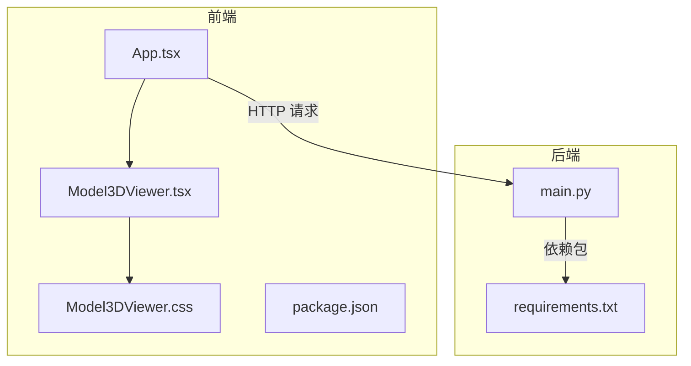
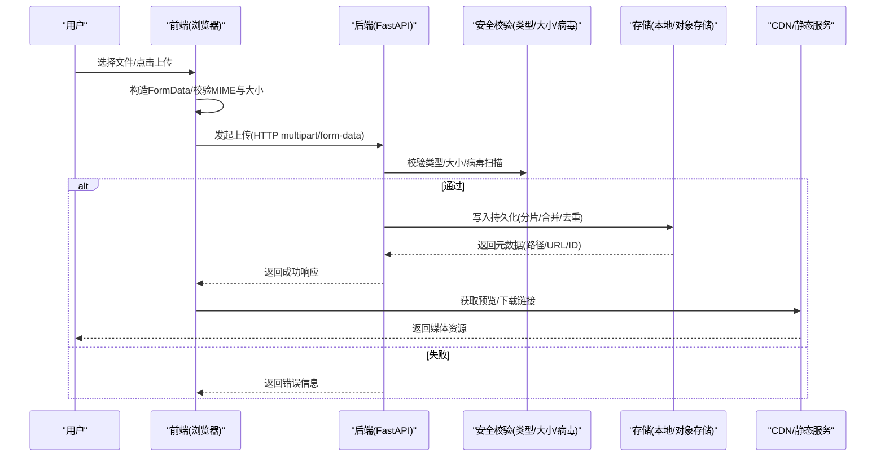
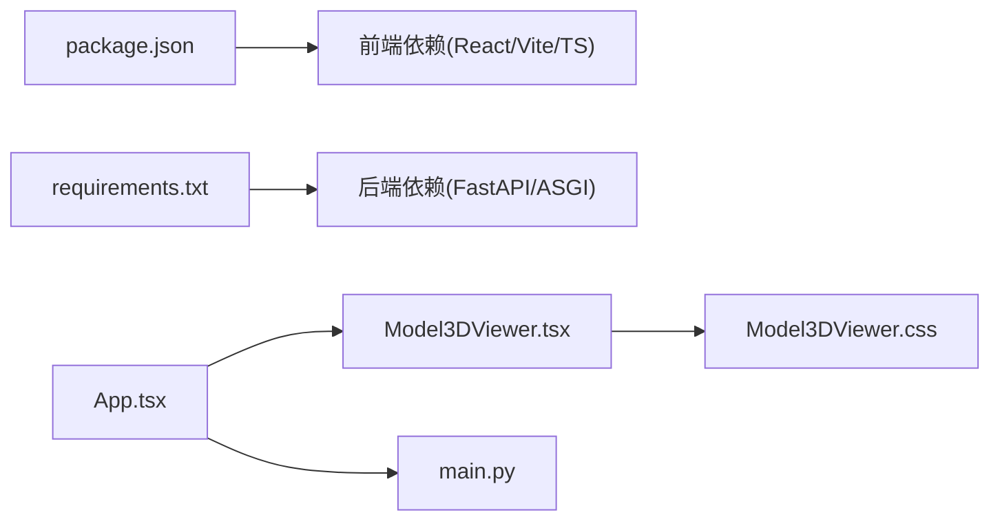

# 文件上传下载

<cite>
**本文引用的文件**   
- [backend/app/main.py](file://backend/app/main.py)
- [backend/requirements.txt](file://backend/requirements.txt)
- [frontend/src/components/Model3DViewer.tsx](file://frontend/src/components/Model3DViewer.tsx)
- [frontend/src/components/Model3DViewer.css](file://frontend/src/components/Model3DViewer.css)
- [frontend/src/App.tsx](file://frontend/src/App.tsx)
- [frontend/package.json](file://frontend/package.json)
</cite>

## 目录
1. [简介](#简介)
2. [项目结构](#项目结构)
3. [核心组件](#核心组件)
4. [架构总览](#架构总览)
5. [详细组件分析](#详细组件分析)
6. [依赖分析](#依赖分析)
7. [性能考虑](#性能考虑)
8. [故障排查指南](#故障排查指南)
9. [结论](#结论)
10. [附录](#附录)

## 简介
本文件围绕“文件上传下载”能力，结合仓库现有代码与通用工程实践，给出端到端的设计与实现说明。内容覆盖：
- 前端：文件选择、预览、批量上传（FormData构造、MIME类型验证、大小限制）
- 后端：文件接收处理（分片上传、断点续传、临时文件管理）
- 进度监控：上传进度回调、下载进度显示、取消操作支持
- 存储策略：本地文件系统组织、云存储集成、文件去重算法
- 安全机制：文件类型白名单、病毒扫描、访问权限控制
- 多类型文件处理：图片、视频、3D模型等流程与最佳实践

说明：当前仓库未包含完整的上传/下载路由与服务实现，本文在尊重现有代码的基础上，提供可落地的参考设计与对接建议，并标注与现有文件的关联位置。

## 项目结构
本项目采用前后端分离结构：
- 前端：React + TypeScript，使用 Vite 构建，包含 3D 模型查看器组件
- 后端：Python FastAPI 应用入口，依赖声明位于 requirements.txt

图表来源
- [frontend/src/App.tsx](file://frontend/src/App.tsx)
- [frontend/src/components/Model3DViewer.tsx](file://frontend/src/components/Model3DViewer.tsx)
- [frontend/src/components/Model3DViewer.css](file://frontend/src/components/Model3DViewer.css)
- [frontend/package.json](file://frontend/package.json)
- [backend/app/main.py](file://backend/app/main.py)
- [backend/requirements.txt](file://backend/requirements.txt)

章节来源
- [frontend/src/App.tsx](file://frontend/src/App.tsx)
- [frontend/src/components/Model3DViewer.tsx](file://frontend/src/components/Model3DViewer.tsx)
- [frontend/src/components/Model3DViewer.css](file://frontend/src/components/Model3DViewer.css)
- [frontend/package.json](file://frontend/package.json)
- [backend/app/main.py](file://backend/app/main.py)
- [backend/requirements.txt](file://backend/requirements.txt)

## 核心组件
- 前端 3D 模型查看器：负责加载与渲染 3D 模型资源，可作为“下载后展示”的示例场景
- 后端主入口：FastAPI 应用启动与路由挂载点，后续可扩展上传/下载接口

章节来源
- [frontend/src/components/Model3DViewer.tsx](file://frontend/src/components/Model3DViewer.tsx)
- [backend/app/main.py](file://backend/app/main.py)

## 架构总览
下图为“文件上传下载”端到端参考架构，涵盖前端交互、后端服务、存储与安全校验环节。

图表来源
- [backend/app/main.py](file://backend/app/main.py)
- [frontend/src/App.tsx](file://frontend/src/App.tsx)

## 详细组件分析

### 前端：文件选择、预览与批量上传
- 文件选择与预览
  - 使用 input[type=file] 或拖拽区域触发选择
  - 对 FileList 进行遍历，生成预览（图片用 URL.createObjectURL，视频/音频同理）
  - 3D 模型预览可通过 Model3DViewer 组件加载 glTF/GLB 等资源
- FormData 构造与批量上传
  - 将每个文件以独立字段追加到 FormData，便于后端按字段解析
  - 批量上传可采用串行或并发策略；并发需控制上限以避免阻塞
- MIME 类型与文件大小限制
  - 基于 file.type 做基础白名单校验，同时结合后缀名二次确认
  - 根据业务设定单文件大小上限与总大小上限
- 进度监控与取消
  - 使用 XMLHttpRequest.upload.onprogress 或 fetch + ReadableStream 上报进度
  - 通过 AbortController 支持中断上传
- 下载
  - 使用 a 标签 download 属性或 Blob URL 触发下载
  - 大文件下载建议使用分块下载或流式下载，避免内存峰值过高

章节来源
- [frontend/src/components/Model3DViewer.tsx](file://frontend/src/components/Model3DViewer.tsx)
- [frontend/src/App.tsx](file://frontend/src/App.tsx)

### 后端：文件接收与处理（分片、续传、临时文件）
- 接口设计
  - 上传：POST /api/files/upload，multipart/form-data 接收
  - 分片：POST /api/files/chunk，携带 chunkIndex、totalChunks、fileId
  - 续传：GET /api/files/status?fileId=... 查询已上传分片集合
  - 合并：POST /api/files/merge?fileId=... 完成合并并清理临时文件
  - 下载：GET /api/files/{fileId} 或 /api/files/download?fileId=...
- 分片与断点续传
  - 客户端计算 fileId（如文件名+大小+时间戳哈希），服务端维护分片索引
  - 上传时跳过已存在分片，合并阶段按序拼接
- 临时文件管理
  - 使用带过期时间的临时目录，定时任务清理残留分片
  - 合并完成后删除临时分片，保留最终文件
- 存储策略
  - 本地：按日期/业务域分层目录组织，命名含哈希前缀防冲突
  - 云存储：直传对象存储（如 S3/OSS），后端仅记录元数据与签名
- 去重
  - 基于内容哈希（SHA-256）建立索引，重复文件直接复用
  - 元数据表记录原始名称、MIME、大小、哈希、创建者、权限等

章节来源
- [backend/app/main.py](file://backend/app/main.py)
- [backend/requirements.txt](file://backend/requirements.txt)

### 进度监控机制
- 上传进度
  - 前端通过 onprogress 事件累计字节数，计算百分比并更新 UI
  - 可选：每 N% 上报一次服务端，用于断点续传状态同步
- 下载进度
  - 使用 fetch + ReadableStream 读取响应体，累计已读字节
  - 或使用 XMLHttpRequest.responseType='blob' 配合 onprogress
- 取消操作
  - 上传：AbortController.abort() 中断请求
  - 下载：同样使用 AbortController 中止流式下载

章节来源
- [frontend/src/App.tsx](file://frontend/src/App.tsx)

### 文件存储策略
- 本地文件系统组织
  - 目录结构：/storage/{domain}/{YYYY/MM/DD}/{hash_prefix}_{original_name}
  - 元数据：数据库或 JSON 索引，记录路径、哈希、大小、MIME、权限
- 云存储集成
  - 服务端生成预签名 URL，前端直传对象存储，减少带宽占用
  - 回调通知服务端更新元数据与索引
- 文件去重算法
  - 内容哈希优先（SHA-256），必要时结合文件名+大小作为二级键
  - 大文件可先计算分片哈希，再决定是否全量比对

章节来源
- [backend/app/main.py](file://backend/app/main.py)

### 安全验证机制
- 文件类型白名单
  - 服务端再次校验 MIME 与扩展名，拒绝不匹配请求
  - 禁止可执行与脚本类扩展名
- 病毒扫描
  - 接入杀毒引擎（如 ClamAV）异步扫描，标记风险文件并隔离
- 访问权限控制
  - 鉴权中间件校验 Token/Session
  - 细粒度权限：私有/团队/公开，支持访问审计日志

章节来源
- [backend/app/main.py](file://backend/app/main.py)

### 多类型文件处理流程与最佳实践
- 图片
  - 统一转码为 WebP/AVIF，生成缩略图与多种尺寸
  - 元数据提取（EXIF），敏感信息脱敏
- 视频
  - 转码为 H.264/H.265 + AAC，按需生成 HLS/DASH 切片
  - 封面帧抽取，时长/分辨率检测
- 3D 模型
  - 格式校验（glTF/GLB），几何与纹理完整性检查
  - 生成缩略图与轻量预览资源，适配不同设备

章节来源
- [frontend/src/components/Model3DViewer.tsx](file://frontend/src/components/Model3DViewer.tsx)

## 依赖分析
- 前端依赖
  - React、TypeScript、Vite 构建工具链
  - 3D 渲染库（由 package.json 声明）
- 后端依赖
  - Python 运行时与 FastAPI 框架（由 requirements.txt 声明）

图表来源
- [frontend/package.json](file://frontend/package.json)
- [backend/requirements.txt](file://backend/requirements.txt)
- [frontend/src/App.tsx](file://frontend/src/App.tsx)
- [frontend/src/components/Model3DViewer.tsx](file://frontend/src/components/Model3DViewer.tsx)
- [frontend/src/components/Model3DViewer.css](file://frontend/src/components/Model3DViewer.css)
- [backend/app/main.py](file://backend/app/main.py)

章节来源
- [frontend/package.json](file://frontend/package.json)
- [backend/requirements.txt](file://backend/requirements.txt)

## 性能考虑
- 前端
  - 批量上传限流与重试退避
  - 预览资源及时释放 URL 对象，避免内存泄漏
  - 大文件下载采用分块与断点续传
- 后端
  - 分片并行写入与顺序合并
  - 对象存储直传降低网关压力
  - 压缩与缓存策略（ETag/Last-Modified）
- 存储
  - 冷热分层，归档历史文件
  - 定期清理临时分片与无效元数据

## 故障排查指南
- 上传失败
  - 检查 MIME 白名单与大小限制是否合理
  - 查看分片上传状态接口返回，定位缺失分片
- 下载异常
  - 确认文件是否存在且未被删除
  - 检查权限与鉴权中间件配置
- 3D 模型无法预览
  - 确认模型格式与纹理路径正确
  - 检查网络跨域与资源加载日志

章节来源
- [backend/app/main.py](file://backend/app/main.py)
- [frontend/src/components/Model3DViewer.tsx](file://frontend/src/components/Model3DViewer.tsx)

## 结论
本文在前端已有 3D 模型查看能力的基础上，给出了完整的文件上传下载参考方案，包括分片与续传、进度监控、存储与去重、安全校验以及多类型文件处理的最佳实践。建议在现有 main.py 中新增上传/下载路由，并在前端 App 中集成上传组件与进度反馈，逐步完善端到端能力。

## 附录
- 术语
  - 分片上传：将大文件拆分为多个小块依次上传
  - 断点续传：从上次中断处继续上传剩余分片
  - 预签名 URL：对象存储提供的短期有效直传地址
- 建议的接口清单（供实现参考）
  - POST /api/files/upload
  - POST /api/files/chunk
  - GET /api/files/status
  - POST /api/files/merge
  - GET /api/files/{fileId}
  - GET /api/files/download