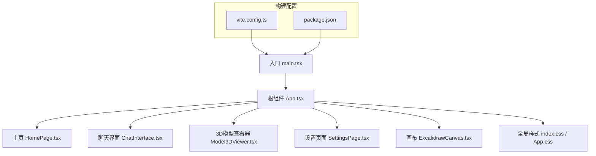
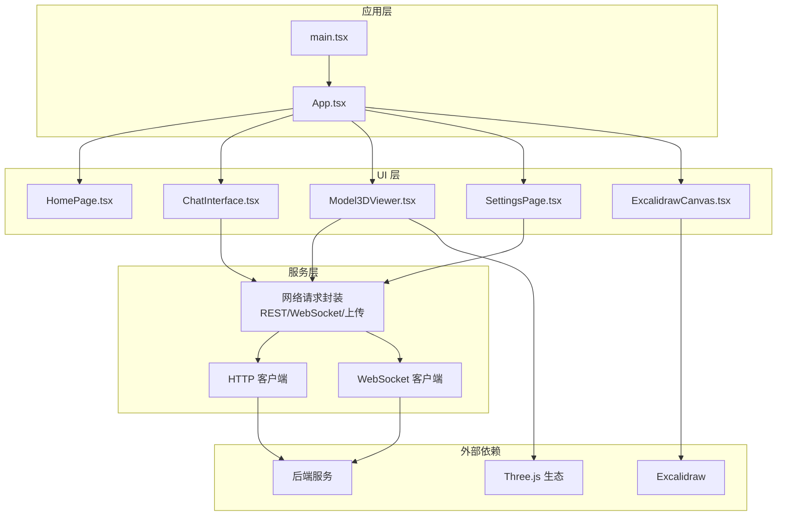
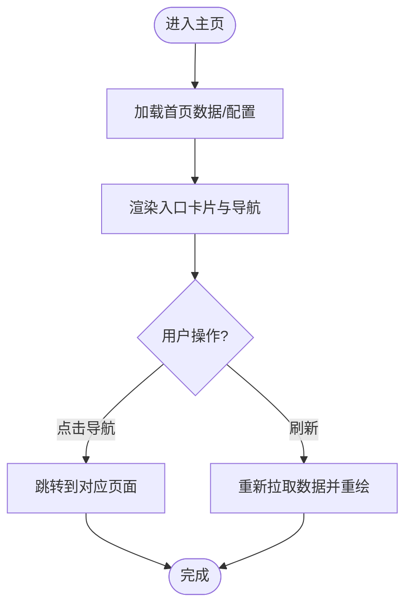
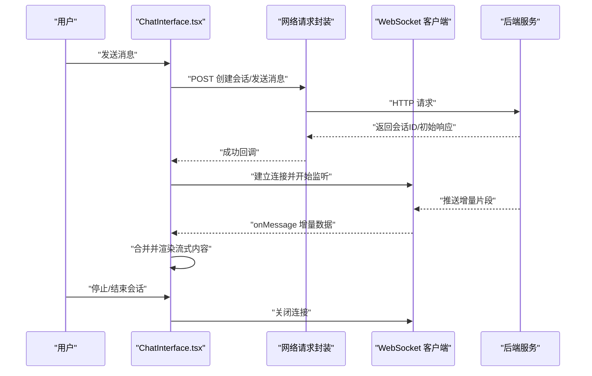
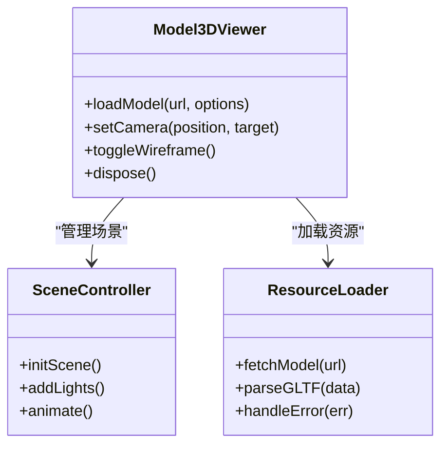
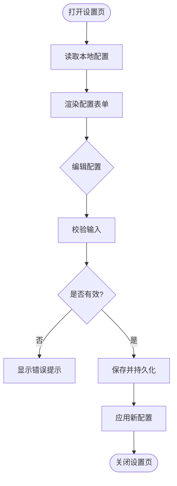
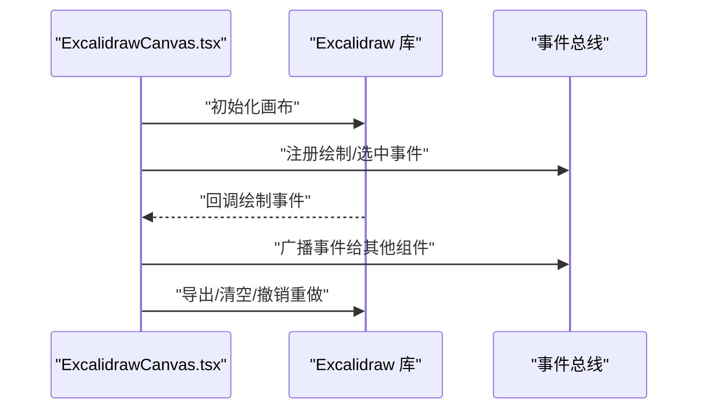
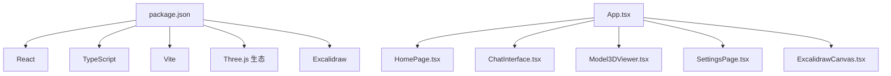

# 前端应用架构

<cite>
**本文引用的文件**   
- [frontend/src/main.tsx](file://frontend/src/main.tsx)
- [frontend/src/App.tsx](file://frontend/src/App.tsx)
- [frontend/src/index.css](file://frontend/src/index.css)
- [frontend/src/App.css](file://frontend/src/App.css)
- [frontend/src/components/HomePage.tsx](file://frontend/src/components/HomePage.tsx)
- [frontend/src/components/HomePage.css](file://frontend/src/components/HomePage.css)
- [frontend/src/components/ChatInterface.tsx](file://frontend/src/components/ChatInterface.tsx)
- [frontend/src/components/ChatInterface.css](file://frontend/src/components/ChatInterface.css)
- [frontend/src/components/Model3DViewer.tsx](file://frontend/src/components/Model3DViewer.tsx)
- [frontend/src/components/Model3DViewer.css](file://frontend/src/components/Model3DViewer.css)
- [frontend/src/components/SettingsPage.tsx](file://frontend/src/components/SettingsPage.tsx)
- [frontend/src/components/SettingsPage.css](file://frontend/src/components/SettingsPage.css)
- [frontend/src/components/ExcalidrawCanvas.tsx](file://frontend/src/components/ExcalidrawCanvas.tsx)
- [frontend/vite.config.ts](file://frontend/vite.config.ts)
- [frontend/package.json](file://frontend/package.json)
</cite>

## 目录
1. [简介](#简介)
2. [项目结构](#项目结构)
3. [核心组件](#核心组件)
4. [架构总览](#架构总览)
5. [详细组件分析](#详细组件分析)
6. [依赖分析](#依赖分析)
7. [性能考虑](#性能考虑)
8. [故障排查指南](#故障排查指南)
9. [结论](#结论)
10. [附录](#附录)

## 简介
本文件为 PolyStudio 前端应用的综合架构文档，聚焦于基于 React + TypeScript 的前端设计。内容涵盖：
- 组件层次结构与路由组织
- 状态管理模式与数据流
- 样式架构、主题定制与响应式策略
- 与后端通信机制（REST API、WebSocket、文件上传）
- 开发最佳实践、性能优化与调试方法
- 组件复用模式、错误处理策略与用户交互设计指南

## 项目结构
前端采用 Vite + React + TypeScript 工程化方案，按功能域划分组件目录，样式以 CSS Modules 或独立 CSS 文件组织，便于维护与按需加载。

图表来源
- [frontend/src/main.tsx:1-50](file://frontend/src/main.tsx#L1-L50)
- [frontend/src/App.tsx:1-120](file://frontend/src/App.tsx#L1-L120)
- [frontend/src/components/HomePage.tsx:1-200](file://frontend/src/components/HomePage.tsx#L1-L200)
- [frontend/src/components/ChatInterface.tsx:1-200](file://frontend/src/components/ChatInterface.tsx#L1-L200)
- [frontend/src/components/Model3DViewer.tsx:1-200](file://frontend/src/components/Model3DViewer.tsx#L1-L200)
- [frontend/src/components/SettingsPage.tsx:1-200](file://frontend/src/components/SettingsPage.tsx#L1-L200)
- [frontend/src/components/ExcalidrawCanvas.tsx:1-200](file://frontend/src/components/ExcalidrawCanvas.tsx#L1-L200)
- [frontend/vite.config.ts:1-120](file://frontend/vite.config.ts#L1-L120)
- [frontend/package.json:1-120](file://frontend/package.json#L1-L120)

章节来源
- [frontend/src/main.tsx:1-50](file://frontend/src/main.tsx#L1-L50)
- [frontend/src/App.tsx:1-120](file://frontend/src/App.tsx#L1-L120)
- [frontend/vite.config.ts:1-120](file://frontend/vite.config.ts#L1-L120)
- [frontend/package.json:1-120](file://frontend/package.json#L1-L120)

## 核心组件
- 主页组件：提供导航入口与概览信息，承载业务模块的快速跳转。
- 聊天界面：实现消息列表、输入框、发送逻辑与实时流式更新。
- 3D模型查看器：集成 Three.js 生态进行模型加载、旋转、缩放与材质展示。
- 设置页面：管理应用配置项（如后端地址、WebSocket 地址、主题偏好等）。
- 画布组件：封装 Excalidraw 能力，用于草图绘制与协作标注。

章节来源
- [frontend/src/components/HomePage.tsx:1-200](file://frontend/src/components/HomePage.tsx#L1-L200)
- [frontend/src/components/ChatInterface.tsx:1-200](file://frontend/src/components/ChatInterface.tsx#L1-L200)
- [frontend/src/components/Model3DViewer.tsx:1-200](file://frontend/src/components/Model3DViewer.tsx#L1-L200)
- [frontend/src/components/SettingsPage.tsx:1-200](file://frontend/src/components/SettingsPage.tsx#L1-L200)
- [frontend/src/components/ExcalidrawCanvas.tsx:1-200](file://frontend/src/components/ExcalidrawCanvas.tsx#L1-L200)

## 架构总览
整体采用“轻量路由 + 组件化”的架构，通过根组件协调页面级组件；状态管理遵循“就近状态 + 必要共享”的原则，结合上下文或轻量 store 在需要时跨组件共享。网络层统一封装 REST 与 WebSocket，保证调用一致性与错误处理一致性。

图表来源
- [frontend/src/main.tsx:1-50](file://frontend/src/main.tsx#L1-L50)
- [frontend/src/App.tsx:1-120](file://frontend/src/App.tsx#L1-L120)
- [frontend/src/components/ChatInterface.tsx:1-200](file://frontend/src/components/ChatInterface.tsx#L1-L200)
- [frontend/src/components/Model3DViewer.tsx:1-200](file://frontend/src/components/Model3DViewer.tsx#L1-L200)
- [frontend/src/components/SettingsPage.tsx:1-200](file://frontend/src/components/SettingsPage.tsx#L1-L200)
- [frontend/src/components/ExcalidrawCanvas.tsx:1-200](file://frontend/src/components/ExcalidrawCanvas.tsx#L1-L200)

## 详细组件分析

### 主页组件（HomePage）
职责与交互
- 作为应用首页，提供功能入口卡片与快捷导航。
- 支持响应式布局，适配桌面与移动端。
- 可承载统计信息与最近任务入口。

关键实现要点
- 使用条件渲染与懒加载提升首屏性能。
- 通过事件回调触发页面跳转或打开子功能。
- 样式采用独立 CSS 文件，配合 CSS 变量实现主题切换。

图表来源
- [frontend/src/components/HomePage.tsx:1-200](file://frontend/src/components/HomePage.tsx#L1-L200)
- [frontend/src/components/HomePage.css:1-200](file://frontend/src/components/HomePage.css#L1-L200)

章节来源
- [frontend/src/components/HomePage.tsx:1-200](file://frontend/src/components/HomePage.tsx#L1-L200)
- [frontend/src/components/HomePage.css:1-200](file://frontend/src/components/HomePage.css#L1-L200)

### 聊天界面（ChatInterface）
职责与交互
- 展示对话历史、当前会话状态与输入区域。
- 支持文本输入、附件上传与流式输出渲染。
- 与后端进行 REST 与 WebSocket 双通道通信。

关键实现要点
- 消息列表虚拟滚动以提升长对话性能。
- 流式接收后端增量片段并安全拼接渲染。
- 错误重试与断线重连机制保障稳定性。

图表来源
- [frontend/src/components/ChatInterface.tsx:1-200](file://frontend/src/components/ChatInterface.tsx#L1-L200)
- [frontend/src/components/ChatInterface.css:1-200](file://frontend/src/components/ChatInterface.css#L1-L200)

章节来源
- [frontend/src/components/ChatInterface.tsx:1-200](file://frontend/src/components/ChatInterface.tsx#L1-L200)
- [frontend/src/components/ChatInterface.css:1-200](file://frontend/src/components/ChatInterface.css#L1-L200)

### 3D模型查看器（Model3DViewer）
职责与交互
- 加载 GLTF/GLB/OBJ 等格式模型，提供旋转、缩放、平移与材质预览。
- 支持多模型切换与场景基础光照与阴影。
- 与后端交互获取模型资源与元数据。

关键实现要点
- 使用 Three.js 生态进行场景初始化与渲染循环。
- 对大模型进行分块加载与纹理压缩，降低内存占用。
- 提供无障碍控制与键盘快捷键。

图表来源
- [frontend/src/components/Model3DViewer.tsx:1-200](file://frontend/src/components/Model3DViewer.tsx#L1-L200)
- [frontend/src/components/Model3DViewer.css:1-200](file://frontend/src/components/Model3DViewer.css#L1-L200)

章节来源
- [frontend/src/components/Model3DViewer.tsx:1-200](file://frontend/src/components/Model3DViewer.tsx#L1-L200)
- [frontend/src/components/Model3DViewer.css:1-200](file://frontend/src/components/Model3DViewer.css#L1-L200)

### 设置页面（SettingsPage）
职责与交互
- 管理应用配置项：后端地址、WebSocket 地址、语言、主题、缓存策略等。
- 支持配置持久化与即时生效。
- 提供配置校验与回滚机制。

关键实现要点
- 表单校验与错误提示。
- 配置变更热更新与局部刷新。
- 敏感字段的安全存储策略。

图表来源
- [frontend/src/components/SettingsPage.tsx:1-200](file://frontend/src/components/SettingsPage.tsx#L1-L200)
- [frontend/src/components/SettingsPage.css:1-200](file://frontend/src/components/SettingsPage.css#L1-L200)

章节来源
- [frontend/src/components/SettingsPage.tsx:1-200](file://frontend/src/components/SettingsPage.tsx#L1-L200)
- [frontend/src/components/SettingsPage.css:1-200](file://frontend/src/components/SettingsPage.css#L1-L200)

### 画布组件（ExcalidrawCanvas）
职责与交互
- 封装 Excalidraw 绘图能力，支持多人协作与导出。
- 提供工具栏、图层管理与撤销重做。
- 与聊天或模型查看器联动，将标注结果同步到相关视图。

关键实现要点
- 生命周期管理与实例销毁避免内存泄漏。
- 事件总线解耦与最小化重渲染。
- 导出图片/PDF 与分享链接生成。

图表来源
- [frontend/src/components/ExcalidrawCanvas.tsx:1-200](file://frontend/src/components/ExcalidrawCanvas.tsx#L1-L200)

章节来源
- [frontend/src/components/ExcalidrawCanvas.tsx:1-200](file://frontend/src/components/ExcalidrawCanvas.tsx#L1-L200)

## 依赖分析
前端依赖关系围绕 React 生态与第三方库展开，Vite 负责构建与开发体验优化。

图表来源
- [frontend/package.json:1-120](file://frontend/package.json#L1-L120)
- [frontend/src/App.tsx:1-120](file://frontend/src/App.tsx#L1-L120)
- [frontend/src/components/HomePage.tsx:1-200](file://frontend/src/components/HomePage.tsx#L1-L200)
- [frontend/src/components/ChatInterface.tsx:1-200](file://frontend/src/components/ChatInterface.tsx#L1-L200)
- [frontend/src/components/Model3DViewer.tsx:1-200](file://frontend/src/components/Model3DViewer.tsx#L1-L200)
- [frontend/src/components/SettingsPage.tsx:1-200](file://frontend/src/components/SettingsPage.tsx#L1-L200)
- [frontend/src/components/ExcalidrawCanvas.tsx:1-200](file://frontend/src/components/ExcalidrawCanvas.tsx#L1-L200)

章节来源
- [frontend/package.json:1-120](file://frontend/package.json#L1-L120)
- [frontend/src/App.tsx:1-120](file://frontend/src/App.tsx#L1-L120)

## 性能考虑
- 首屏优化
  - 路由级代码分割与懒加载，减少初始包体积。
  - 静态资源按需引入与 CDN 加速。
- 运行时优化
  - 列表虚拟化与分页加载，避免长列表卡顿。
  - 防抖/节流高频事件（滚动、拖拽、输入）。
  - 3D 场景对象池与纹理压缩，降低 GC 压力。
- 网络优化
  - 请求去重与缓存策略（ETag/Last-Modified）。
  - WebSocket 心跳保活与指数退避重连。
- 构建优化
  - Tree-shaking 与死代码消除。
  - 生产环境开启压缩与 Source Map 分级。

[本节为通用指导，不直接分析具体文件]

## 故障排查指南
- 常见问题定位
  - 网络层：检查 CORS、鉴权头、超时与重试策略。
  - WebSocket：关注连接状态、心跳失败与消息乱序。
  - 3D 渲染：检查模型路径、坐标系与材质加载异常。
  - 画布：确认实例销毁与事件清理，避免内存泄漏。
- 日志与调试
  - 统一错误上报与堆栈收集。
  - 关键流程埋点与性能指标采集（FPS、内存、耗时）。
  - 使用浏览器开发者工具进行断点与网络面板分析。

章节来源
- [frontend/src/components/ChatInterface.tsx:1-200](file://frontend/src/components/ChatInterface.tsx#L1-L200)
- [frontend/src/components/Model3DViewer.tsx:1-200](file://frontend/src/components/Model3DViewer.tsx#L1-L200)
- [frontend/src/components/ExcalidrawCanvas.tsx:1-200](file://frontend/src/components/ExcalidrawCanvas.tsx#L1-L200)

## 结论
本项目采用清晰的组件分层与统一的网络抽象，兼顾了可扩展性与可维护性。通过合理的状态管理、样式架构与性能优化策略，能够在复杂业务场景下保持稳定与高效。后续建议进一步完善类型定义、测试覆盖与监控体系，持续提升交付质量与用户体验。

[本节为总结性内容，不直接分析具体文件]

## 附录

### 样式架构与主题定制
- 样式组织
  - 全局样式集中于 index.css 与 App.css，组件样式以独立 CSS 文件隔离。
  - 使用 CSS 变量定义主题色、字号与间距，实现一键换肤。
- 响应式设计
  - 基于媒体查询与弹性布局，适配不同屏幕尺寸。
  - 关键断点：手机、平板、桌面三档。
- 最佳实践
  - 避免内联样式，优先使用类名与变量。
  - 组件样式命名采用 BEM 或模块化约定，防止冲突。

章节来源
- [frontend/src/index.css:1-200](file://frontend/src/index.css#L1-L200)
- [frontend/src/App.css:1-200](file://frontend/src/App.css#L1-L200)

### 与后端通信机制
- REST API
  - 统一封装请求函数，集中处理鉴权、超时与错误码映射。
  - 支持拦截器注入请求头与响应转换。
- WebSocket 实时通信
  - 连接管理：自动重连、心跳检测、断线恢复。
  - 消息协议：定义消息类型、版本与序列化方式。
- 文件上传
  - 分片上传与进度回调，支持断点续传。
  - 大文件预览与转码（图片/视频缩略图）。

章节来源
- [frontend/src/components/ChatInterface.tsx:1-200](file://frontend/src/components/ChatInterface.tsx#L1-L200)
- [frontend/src/components/Model3DViewer.tsx:1-200](file://frontend/src/components/Model3DViewer.tsx#L1-L200)
- [frontend/src/components/SettingsPage.tsx:1-200](file://frontend/src/components/SettingsPage.tsx#L1-L200)

### 开发最佳实践
- 组件设计
  - 单一职责与高内聚低耦合，尽量无副作用。
  - Props 严格类型定义，默认值与必填校验。
- 状态管理
  - 组件内状态优先，必要时使用上下文或轻量 store。
  - 避免过度共享，保持数据流向清晰。
- 错误处理
  - 边界捕获与降级策略，友好提示与重试选项。
  - 统一错误码与用户可读文案。
- 用户交互
  - 反馈及时（加载态、成功/失败提示）。
  - 可访问性：键盘导航、ARIA 标签与对比度。

章节来源
- [frontend/src/components/HomePage.tsx:1-200](file://frontend/src/components/HomePage.tsx#L1-L200)
- [frontend/src/components/ChatInterface.tsx:1-200](file://frontend/src/components/ChatInterface.tsx#L1-L200)
- [frontend/src/components/Model3DViewer.tsx:1-200](file://frontend/src/components/Model3DViewer.tsx#L1-L200)
- [frontend/src/components/SettingsPage.tsx:1-200](file://frontend/src/components/SettingsPage.tsx#L1-L200)
- [frontend/src/components/ExcalidrawCanvas.tsx:1-200](file://frontend/src/components/ExcalidrawCanvas.tsx#L1-L200)

### 构建与运行
- 构建配置
  - Vite 插件扩展：别名、代理、环境变量注入。
  - 开发与生产环境差异化配置。
- 脚本命令
  - 启动开发服务器、构建产物与预览。
  - 代码检查与格式化。

章节来源
- [frontend/vite.config.ts:1-120](file://frontend/vite.config.ts#L1-L120)
- [frontend/package.json:1-120](file://frontend/package.json#L1-L120)