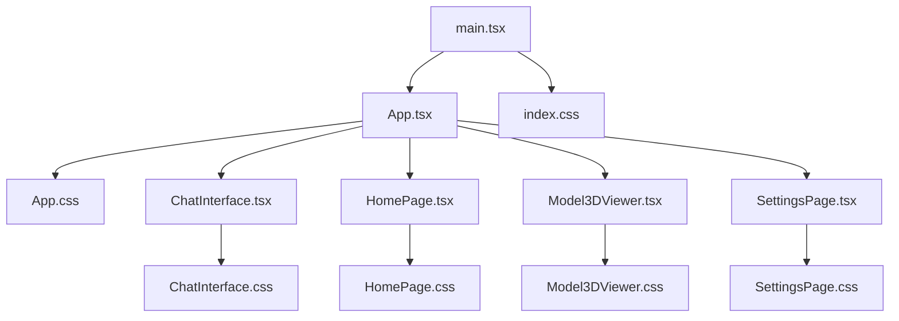
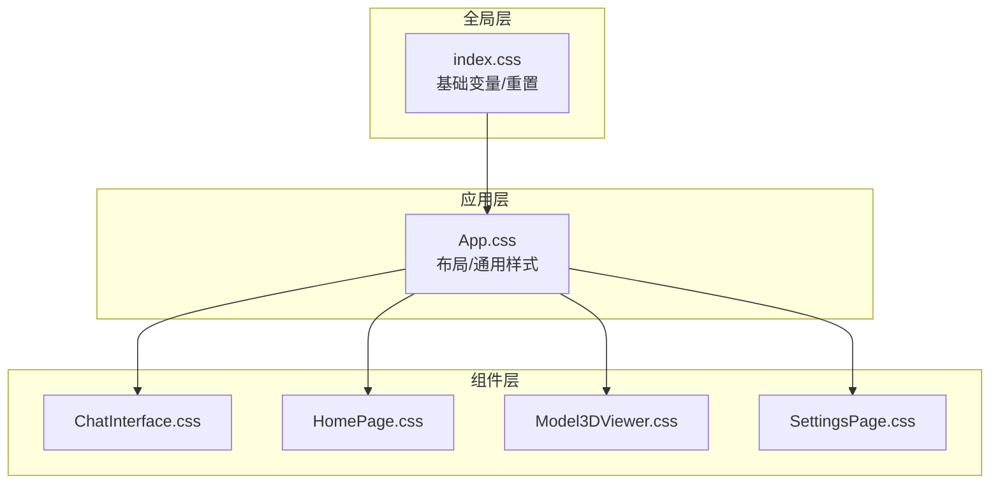
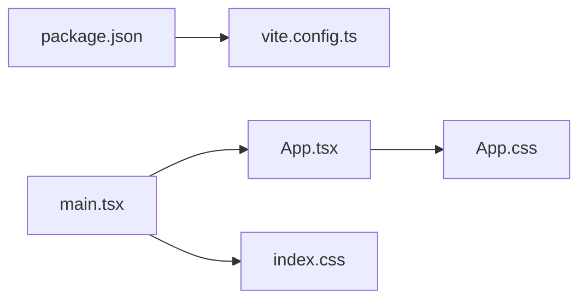
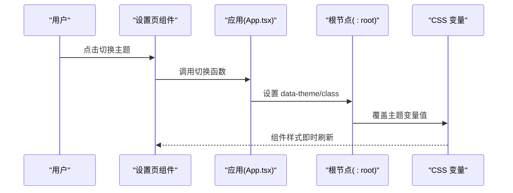

# 样式与主题系统

<cite>
**本文引用的文件**   
- [frontend/src/index.css](file://frontend/src/index.css)
- [frontend/src/App.css](file://frontend/src/App.css)
- [frontend/src/components/ChatInterface.css](file://frontend/src/components/ChatInterface.css)
- [frontend/src/components/HomePage.css](file://frontend/src/components/HomePage.css)
- [frontend/src/components/Model3DViewer.css](file://frontend/src/components/Model3DViewer.css)
- [frontend/src/components/SettingsPage.css](file://frontend/src/components/SettingsPage.css)
- [frontend/src/main.tsx](file://frontend/src/main.tsx)
- [frontend/src/App.tsx](file://frontend/src/App.tsx)
- [frontend/vite.config.ts](file://frontend/vite.config.ts)
- [frontend/package.json](file://frontend/package.json)
</cite>

## 目录
1. [简介](#简介)
2. [项目结构](#项目结构)
3. [核心组件](#核心组件)
4. [架构总览](#架构总览)
5. [详细组件分析](#详细组件分析)
6. [依赖分析](#依赖分析)
7. [性能考虑](#性能考虑)
8. [故障排查指南](#故障排查指南)
9. [结论](#结论)
10. [附录](#附录)

## 简介
本文件面向前端样式与主题系统，围绕以下目标展开：
- CSS 模块化架构设计：全局样式与组件样式的分离策略
- CSS 变量系统与主题切换机制
- 响应式设计实现与移动端适配策略
- 样式组织规范、命名约定与 BEM 方法论应用
- 动画与过渡效果配置
- 样式性能优化技巧
- CSS-in-JS 方案对比与第三方 UI 库集成方法
- 样式调试工具使用、浏览器兼容性处理与无障碍访问支持

本项目采用 Vite + React（TypeScript）技术栈，样式以原生 CSS 为主，通过模块化的 .css 文件与全局入口进行组织。主题能力可通过 CSS 自定义属性（CSS Variables）在运行时动态切换。

## 项目结构
前端样式主要分布在以下位置：
- 全局样式入口：index.css
- 应用级样式：App.css
- 组件级样式：components/*.css（每个组件对应一个样式文件）
- 构建与依赖：vite.config.ts、package.json

图表来源
- [frontend/src/main.tsx:1-50](file://frontend/src/main.tsx#L1-L50)
- [frontend/src/App.tsx:1-120](file://frontend/src/App.tsx#L1-L120)
- [frontend/src/index.css:1-200](file://frontend/src/index.css#L1-L200)
- [frontend/src/App.css:1-200](file://frontend/src/App.css#L1-L200)
- [frontend/src/components/ChatInterface.css:1-200](file://frontend/src/components/ChatInterface.css#L1-L200)
- [frontend/src/components/HomePage.css:1-200](file://frontend/src/components/HomePage.css#L1-L200)
- [frontend/src/components/Model3DViewer.css:1-200](file://frontend/src/components/Model3DViewer.css#L1-L200)
- [frontend/src/components/SettingsPage.css:1-200](file://frontend/src/components/SettingsPage.css#L1-L200)

章节来源
- [frontend/src/main.tsx:1-50](file://frontend/src/main.tsx#L1-L50)
- [frontend/src/App.tsx:1-120](file://frontend/src/App.tsx#L1-L120)
- [frontend/src/index.css:1-200](file://frontend/src/index.css#L1-L200)
- [frontend/src/App.css:1-200](file://frontend/src/App.css#L1-L200)
- [frontend/src/components/ChatInterface.css:1-200](file://frontend/src/components/ChatInterface.css#L1-L200)
- [frontend/src/components/HomePage.css:1-200](file://frontend/src/components/HomePage.css#L1-L200)
- [frontend/src/components/Model3DViewer.css:1-200](file://frontend/src/components/Model3DViewer.css#L1-L200)
- [frontend/src/components/SettingsPage.css:1-200](file://frontend/src/components/SettingsPage.css#L1-L200)

## 核心组件
- 全局样式层（index.css）
  - 负责基础重置、排版、颜色与字体等基础变量定义
  - 提供全局 CSS 变量根节点（如 :root），用于主题色、字号、间距等
- 应用级样式层（App.css）
  - 管理页面布局容器、网格/栅格、通用组件的共享样式
  - 可包含主题切换所需的类名或数据属性选择器
- 组件样式层（components/*.css）
  - 每个组件独立样式文件，遵循“就近原则”与“最小作用域”
  - 使用 BEM 命名法避免冲突，便于维护与复用

章节来源
- [frontend/src/index.css:1-200](file://frontend/src/index.css#L1-L200)
- [frontend/src/App.css:1-200](file://frontend/src/App.css#L1-L200)
- [frontend/src/components/ChatInterface.css:1-200](file://frontend/src/components/ChatInterface.css#L1-L200)
- [frontend/src/components/HomePage.css:1-200](file://frontend/src/components/HomePage.css#L1-L200)
- [frontend/src/components/Model3DViewer.css:1-200](file://frontend/src/components/Model3DViewer.css#L1-L200)
- [frontend/src/components/SettingsPage.css:1-200](file://frontend/src/components/SettingsPage.css#L1-L200)

## 架构总览
整体样式架构采用“分层 + 模块化”的策略：
- 分层：全局 → 应用 → 组件，逐层细化
- 模块化：按功能/组件拆分样式文件，按需引入
- 主题：基于 CSS 自定义属性，在根节点或应用节点上切换变量值

图表来源
- [frontend/src/index.css:1-200](file://frontend/src/index.css#L1-L200)
- [frontend/src/App.css:1-200](file://frontend/src/App.css#L1-L200)
- [frontend/src/components/ChatInterface.css:1-200](file://frontend/src/components/ChatInterface.css#L1-L200)
- [frontend/src/components/HomePage.css:1-200](file://frontend/src/components/HomePage.css#L1-L200)
- [frontend/src/components/Model3DViewer.css:1-200](file://frontend/src/components/Model3DViewer.css#L1-L200)
- [frontend/src/components/SettingsPage.css:1-200](file://frontend/src/components/SettingsPage.css#L1-L200)

## 详细组件分析

### 全局样式与主题变量（index.css）
- 职责
  - 定义全局 CSS 变量（颜色、字体、间距、圆角、阴影等）
  - 提供基础重置与默认排版
  - 作为主题切换的变量源（:root 或 html/body）
- 主题切换机制建议
  - 在根节点设置 data-theme 或 class 切换不同主题
  - 通过 CSS 变量覆盖实现亮/暗主题或多品牌主题
- 响应式断点
  - 建议使用媒体查询集中管理断点，配合 CSS 变量统一控制

章节来源
- [frontend/src/index.css:1-200](file://frontend/src/index.css#L1-L200)

### 应用级样式（App.css）
- 职责
  - 管理主布局容器、侧边栏/顶栏、内容区等
  - 定义通用组件（按钮、卡片、表单）的基础样式
  - 承载主题切换时的布局级变量覆盖
- 与组件的关系
  - 为子组件提供一致的视觉基线与间距体系

章节来源
- [frontend/src/App.css:1-200](file://frontend/src/App.css#L1-L200)

### 聊天界面组件（ChatInterface.css）
- 职责
  - 消息列表、输入框、发送按钮等局部样式
  - 与 App.css 中的通用样式组合形成完整交互
- 命名约定
  - 建议采用 BEM：block__element--modifier
- 主题适配
  - 通过 CSS 变量引用主题色，确保在不同主题下保持一致性

章节来源
- [frontend/src/components/ChatInterface.css:1-200](file://frontend/src/components/ChatInterface.css#L1-L200)

### 首页组件（HomePage.css）
- 职责
  - 首页布局、卡片网格、导航区域等
- 响应式
  - 使用媒体查询适配平板与手机屏幕

章节来源
- [frontend/src/components/HomePage.css:1-200](file://frontend/src/components/HomePage.css#L1-L200)

### 3D 模型查看器组件（Model3DViewer.css）
- 职责
  - 画布容器、工具栏、缩放控件等
- 性能注意
  - 避免对频繁更新的元素使用昂贵滤镜或过度阴影

章节来源
- [frontend/src/components/Model3DViewer.css:1-200](file://frontend/src/components/Model3DViewer.css#L1-L200)

### 设置页组件（SettingsPage.css）
- 职责
  - 表单、开关、选项卡等设置项样式
- 无障碍
  - 确保焦点可见、标签关联正确

章节来源
- [frontend/src/components/SettingsPage.css:1-200](file://frontend/src/components/SettingsPage.css#L1-L200)

### 入口与路由挂载（main.tsx / App.tsx）
- main.tsx
  - 应用初始化与根节点渲染
- App.tsx
  - 应用级结构与样式引入，可能包含主题切换逻辑入口

章节来源
- [frontend/src/main.tsx:1-50](file://frontend/src/main.tsx#L1-L50)
- [frontend/src/App.tsx:1-120](file://frontend/src/App.tsx#L1-L120)

## 依赖分析
- 构建与打包
  - Vite 负责静态资源与 CSS 的处理与优化
- 依赖清单
  - package.json 中声明了前端依赖，便于定位是否引入 UI 库或样式相关包

图表来源
- [frontend/package.json:1-200](file://frontend/package.json#L1-L200)
- [frontend/vite.config.ts:1-200](file://frontend/vite.config.ts#L1-L200)
- [frontend/src/main.tsx:1-50](file://frontend/src/main.tsx#L1-L50)
- [frontend/src/App.tsx:1-120](file://frontend/src/App.tsx#L1-L120)
- [frontend/src/index.css:1-200](file://frontend/src/index.css#L1-L200)
- [frontend/src/App.css:1-200](file://frontend/src/App.css#L1-L200)

章节来源
- [frontend/package.json:1-200](file://frontend/package.json#L1-L200)
- [frontend/vite.config.ts:1-200](file://frontend/vite.config.ts#L1-L200)

## 性能考虑
- 减少重排与重绘
  - 避免在高频更新路径上使用复杂滤镜、大阴影
  - 优先使用 transform 与 opacity 做动画
- 样式体积优化
  - 仅引入必要的全局样式；组件样式按需加载
  - 利用 Vite 的 CSS 代码分割与压缩
- 变量与选择器
  - 合理使用 CSS 变量，避免过深嵌套导致计算开销
  - 扁平化选择器，提高匹配效率
- 图片与图标
  - 使用矢量图标与合适的图片格式，启用懒加载

[本节为通用指导，不直接分析具体文件]

## 故障排查指南
- 样式未生效
  - 检查 index.css 与 App.css 是否在入口文件中被正确引入
  - 确认组件样式文件是否被对应组件引入
- 主题切换无效
  - 检查根节点是否正确设置 data-theme/class
  - 确认 CSS 变量覆盖顺序与优先级
- 响应式异常
  - 核对媒体查询断点是否与设备尺寸匹配
  - 检查是否存在固定宽度或 overflow 导致的布局问题
- 动画卡顿
  - 将动画属性限制在合成层（transform、opacity）
  - 避免触发布局的属性（width、height、top/left）

章节来源
- [frontend/src/main.tsx:1-50](file://frontend/src/main.tsx#L1-L50)
- [frontend/src/App.tsx:1-120](file://frontend/src/App.tsx#L1-L120)
- [frontend/src/index.css:1-200](file://frontend/src/index.css#L1-L200)
- [frontend/src/App.css:1-200](file://frontend/src/App.css#L1-L200)

## 结论
本项目采用清晰的分层与模块化样式架构，结合 CSS 变量可实现灵活的主题切换。通过统一的命名约定与 BEM 方法论，组件样式具备良好可维护性与可扩展性。后续可在现有基础上进一步完善响应式断点、动画规范与无障碍支持，并评估引入 CSS-in-JS 或 UI 库的必要性。

[本节为总结性内容，不直接分析具体文件]

## 附录

### 样式组织规范与命名约定
- 文件组织
  - 全局：index.css
  - 应用：App.css
  - 组件：components/<Component>.css
- 命名约定
  - 推荐使用 BEM：block__element--modifier
  - 组件类名与文件名一致，保持可读性与一致性
- 变量体系
  - 颜色：--color-*
  - 字体：--font-*
  - 间距：--space-*
  - 圆角/阴影：--radius-*、--shadow-*

章节来源
- [frontend/src/index.css:1-200](file://frontend/src/index.css#L1-L200)
- [frontend/src/App.css:1-200](file://frontend/src/App.css#L1-L200)
- [frontend/src/components/ChatInterface.css:1-200](file://frontend/src/components/ChatInterface.css#L1-L200)
- [frontend/src/components/HomePage.css:1-200](file://frontend/src/components/HomePage.css#L1-L200)
- [frontend/src/components/Model3DViewer.css:1-200](file://frontend/src/components/Model3DViewer.css#L1-L200)
- [frontend/src/components/SettingsPage.css:1-200](file://frontend/src/components/SettingsPage.css#L1-L200)

### 主题切换机制流程

图表来源
- [frontend/src/App.tsx:1-120](file://frontend/src/App.tsx#L1-L120)
- [frontend/src/components/SettingsPage.css:1-200](file://frontend/src/components/SettingsPage.css#L1-L200)
- [frontend/src/index.css:1-200](file://frontend/src/index.css#L1-L200)

### 响应式设计实现要点
- 断点策略
  - 移动优先，从小到大逐步增强
  - 常用断点：小屏 < 600px、平板 600–1024px、桌面 > 1024px
- 布局方式
  - 使用 Flexbox/Grid 构建弹性布局
  - 使用相对单位（rem/em/%）提升可访问性与缩放体验
- 图片与媒体
  - 使用 srcset/picture 或容器查询适配多分辨率

章节来源
- [frontend/src/components/HomePage.css:1-200](file://frontend/src/components/HomePage.css#L1-L200)
- [frontend/src/components/ChatInterface.css:1-200](file://frontend/src/components/ChatInterface.css#L1-L200)

### 动画与过渡效果配置
- 推荐属性
  - transform、opacity、filter（谨慎使用）
- 性能建议
  - 避免触发布局的属性变化
  - 合理设置 will-change 与硬件加速
- 可访问性
  - 尊重 prefers-reduced-motion，提供降级方案

章节来源
- [frontend/src/components/Model3DViewer.css:1-200](file://frontend/src/components/Model3DViewer.css#L1-L200)
- [frontend/src/App.css:1-200](file://frontend/src/App.css#L1-L200)

### CSS-in-JS 方案对比（概念性）
- styled-components
  - 优点：动态样式、主题上下文、Tree-shaking
  - 缺点：运行时开销、SSR 需额外配置
- Emotion
  - 优点：生态完善、兼容性好、SSR 友好
  - 缺点：学习成本、包体略大
- Tailwind CSS
  - 优点：原子化、快速原型、一致性高
  - 缺点：模板冗长、定制成本高
- 选型建议
  - 小型项目：Tailwind 或原生 CSS + 变量
  - 大型项目：Emotion/styled-components 结合设计令牌

[本节为概念性内容，不直接分析具体文件]

### 第三方 UI 库集成方法（概念性）
- 引入步骤
  - 安装依赖 → 在入口或组件中引入样式 → 按需引入组件
- 主题对接
  - 将 UI 库主题变量映射到项目 CSS 变量
  - 通过 data-theme 或 Provider 注入主题
- 注意事项
  - 避免重复样式覆盖
  - 关注包体大小与按需加载

[本节为概念性内容，不直接分析具体文件]

### 样式调试工具与浏览器兼容性
- 调试工具
  - 浏览器开发者工具：Elements/CSS 面板、Computed、Performance
  - 样式隔离：使用组件级样式文件，避免全局污染
- 兼容性处理
  - 使用 Autoprefixer 自动添加前缀
  - 针对旧版浏览器提供降级样式
- 无障碍访问
  - 确保焦点可见、语义化标签、ARIA 属性
  - 色彩对比度符合 WCAG 标准

章节来源
- [frontend/src/index.css:1-200](file://frontend/src/index.css#L1-L200)
- [frontend/src/App.css:1-200](file://frontend/src/App.css#L1-L200)