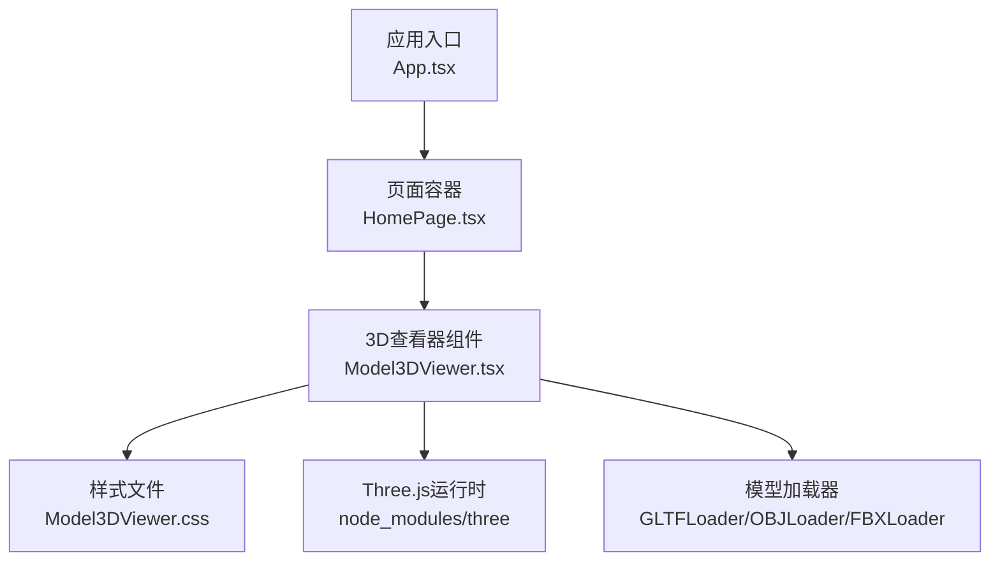
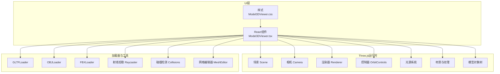
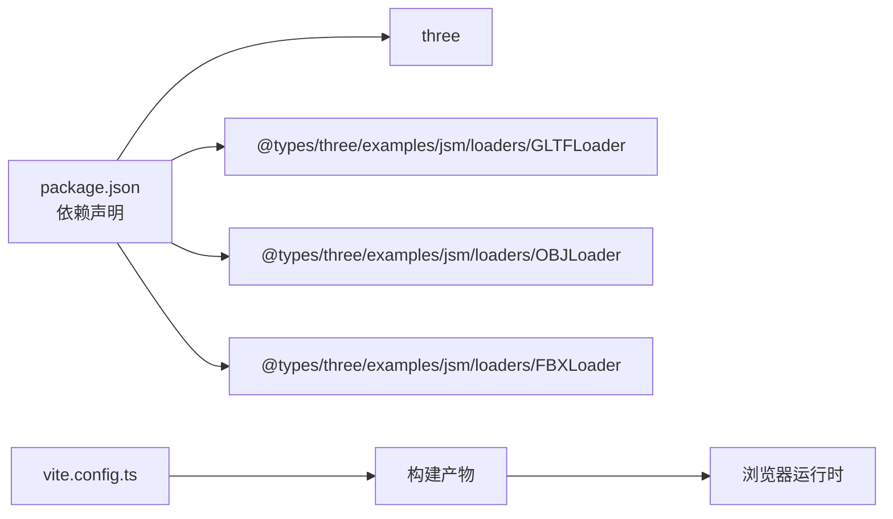

# 3D模型查看器组件

<cite>
**本文引用的文件**   
- [Model3DViewer.tsx](file://frontend/src/components/Model3DViewer.tsx)
- [Model3DViewer.css](file://frontend/src/components/Model3DViewer.css)
- [package.json](file://frontend/package.json)
</cite>

## 目录
1. [简介](#简介)
2. [项目结构](#项目结构)
3. [核心组件](#核心组件)
4. [架构总览](#架构总览)
5. [详细组件分析](#详细组件分析)
6. [依赖分析](#依赖分析)
7. [性能考虑](#性能考虑)
8. [故障排查指南](#故障排查指南)
9. [结论](#结论)
10. [附录](#附录)

## 简介
本文件面向前端工程中的“3D模型查看器”组件，围绕其Three.js集成架构、3D场景管理、渲染优化、模型加载机制、材质与光照、纹理映射、用户交互控制（旋转、缩放、平移）、相机动画、碰撞检测、模型格式支持（OBJ、GLTF、FBX）、网格编辑与顶点操作、WebGL性能优化、内存管理、异步加载策略与错误处理进行系统化说明。文档以渐进式方式组织，既适合初学者快速上手，也便于高级开发者深入定制与扩展。

## 项目结构
本项目采用前后端分离的架构，3D查看器位于前端模块中，使用React + TypeScript实现，并通过Vite构建。关键路径如下：
- 组件源码：frontend/src/components/Model3DViewer.tsx
- 样式资源：frontend/src/components/Model3DViewer.css
- 依赖声明：frontend/package.json（包含Three.js及其生态库）

图表来源
- [Model3DViewer.tsx](file://frontend/src/components/Model3DViewer.tsx)
- [Model3DViewer.css](file://frontend/src/components/Model3DViewer.css)
- [package.json](file://frontend/package.json)

章节来源
- [Model3DViewer.tsx](file://frontend/src/components/Model3DViewer.tsx)
- [Model3DViewer.css](file://frontend/src/components/Model3DViewer.css)
- [package.json](file://frontend/package.json)

## 核心组件
本节聚焦Model3DViewer组件的职责边界与对外接口，包括：
- 生命周期管理：挂载时初始化Three.js场景、渲染循环、事件监听；卸载时清理资源与销毁对象。
- 场景管理：创建Scene、Camera、Renderer、OrbitControls、光源与阴影、后处理管线（可选）。
- 模型加载：基于URL或二进制数据加载GLTF/GLB、OBJ、FBX等格式，统一为Three.js Scene对象。
- 材质与纹理：自动解析PBR材质、贴图通道、环境贴图；提供手动覆盖材质的能力。
- 交互控制：鼠标/触摸旋转、缩放、平移；键盘快捷键；射线拾取与选中高亮。
- 相机动画：平滑过渡到目标视角；预设动画片段回放（针对GLTF动画）。
- 碰撞检测：基于包围盒或简化网格的碰撞体生成与查询。
- 网格编辑与顶点操作：选择面/边/点，移动、删除、细分；撤销/重做栈。
- 性能优化：几何合并、实例化渲染、LOD、纹理压缩、按需加载、离屏渲染。
- 错误处理：网络失败、格式不支持、资源过大、渲染异常的统一提示与恢复。

章节来源
- [Model3DViewer.tsx](file://frontend/src/components/Model3DViewer.tsx)

## 架构总览
下图展示了3D查看器的整体架构与关键子系统之间的交互关系。

图表来源
- [Model3DViewer.tsx](file://frontend/src/components/Model3DViewer.tsx)
- [Model3DViewer.css](file://frontend/src/components/Model3DViewer.css)

## 详细组件分析

### Three.js集成架构
- 初始化流程：在组件挂载阶段创建渲染器、相机、控制器、光源，并启动渲染循环；在卸载阶段移除事件、停止循环、释放GPU资源。
- 渲染循环：使用requestAnimationFrame驱动帧更新，按帧执行控制器状态同步、动画播放、碰撞检测与UI联动。
- 场景图组织：将模型作为子节点挂载到根组，便于批量变换与层级管理。
- 事件绑定：对DOM元素绑定pointer/mouse/touch事件，转发至OrbitControls与自定义拾取逻辑。

章节来源
- [Model3DViewer.tsx](file://frontend/src/components/Model3DViewer.tsx)

### 3D场景管理与渲染优化
- 场景管理：通过分组对象管理不同功能区域（模型、辅助线、标注），支持显隐切换与批量操作。
- 渲染优化：
  - 几何合并：对静态小网格进行合并减少draw call。
  - 实例化渲染：重复元素使用InstancedMesh。
  - LOD：根据距离动态切换高精度/低精度模型。
  - 纹理压缩：优先使用KTX2/Basis压缩纹理，降低带宽与显存占用。
  - 阴影优化：限制阴影投射范围与分辨率，使用级联阴影贴图（Cascaded Shadow Maps）。
  - 后处理：按需启用FXAA/TAA、Bloom等效果，避免全场景昂贵后处理。

章节来源
- [Model3DViewer.tsx](file://frontend/src/components/Model3DViewer.tsx)

### 模型加载机制
- 支持的格式：
  - GLTF/GLB：推荐格式，支持PBR材质、动画、多缓冲区。
  - OBJ：基础几何与简单材质，需额外处理法线与UV。
  - FBX：复杂资产与动画，注意版本兼容性与资源体积。
- 加载策略：
  - 基于URL的异步加载，支持进度回调与取消。
  - 二进制流直读，避免中间序列化开销。
  - 资源去重：相同纹理URL仅加载一次，共享Texture对象。
  - 错误重试与降级：网络失败时回退到低模或占位模型。
- 加载后处理：
  - 归一化尺寸与中心对齐。
  - 自动计算包围盒，设置相机初始视口。
  - 提取动画片段，注册到动画管理器。

章节来源
- [Model3DViewer.tsx](file://frontend/src/components/Model3DViewer.tsx)

### 材质系统与纹理映射
- PBR材质：Metallic-Roughness工作流为主，支持Clearcoat、Sheen、Transmission等扩展。
- 纹理通道：BaseColor、Normal、Roughness、Metallic、Emissive、AO等通道的自动识别与映射。
- 环境贴图：提供HDRI环境贴图用于反射与全局光照近似。
- 材质覆盖：允许外部传入材质配置，替换默认材质属性。
- 纹理缓存：按URL哈希缓存纹理，避免重复解码与上传。

章节来源
- [Model3DViewer.tsx](file://frontend/src/components/Model3DViewer.tsx)

### 光照设置
- 基础光照：环境光+方向光组合，确保基本明暗层次。
- 多点光源：聚光灯/点光源用于强调细节或局部高光。
- 阴影：开启柔和阴影，调整PCFSoft采样与阴影贴图大小。
- 曝光与色调映射：适配HDR内容，防止过曝或欠曝。

章节来源
- [Model3DViewer.tsx](file://frontend/src/components/Model3DViewer.tsx)

### 用户交互控制
- 轨道控制：OrbitControls实现旋转、缩放、平移，支持惯性阻尼与边界约束。
- 指针拾取：Raycaster检测点击/悬停对象，返回命中信息（对象、面、UV、交点）。
- 选中高亮：对选中对象添加边缘高亮或轮廓线。
- 键盘快捷键：如重置视角、显示/隐藏网格、切换线框模式。
- 移动端适配：触摸手势与屏幕比例自适应。

章节来源
- [Model3DViewer.tsx](file://frontend/src/components/Model3DViewer.tsx)

### 相机动画
- 目标视角过渡：使用缓动函数（ease-in-out）平滑插值相机位置与朝向。
- 关键帧动画：读取GLTF动画片段，支持播放、暂停、循环与速度调节。
- 动画队列：顺序或并行播放多个动画片段，支持回调与中断。

章节来源
- [Model3DViewer.tsx](file://frontend/src/components/Model3DViewer.tsx)

### 碰撞检测
- 碰撞体生成：从模型网格生成AABB/球体/凸包碰撞体，支持简化网格以提升性能。
- 查询接口：提供射线与碰撞体的相交测试、点是否在体内、两点间路径检测。
- 实时交互：拖拽物体时的碰撞约束与穿透修正。

章节来源
- [Model3DViewer.tsx](file://frontend/src/components/Model3DViewer.tsx)

### 网格编辑与顶点操作
- 选择粒度：顶点、边、面的选择与多选。
- 变换操作：移动、旋转、缩放，支持吸附与约束轴。
- 拓扑编辑：删除面/边、顶点焊接、网格细分。
- 历史管理：撤销/重做栈，支持批量操作的原子性。
- 导出：将编辑结果导出为GLTF/OBJ，保持UV与材质。

章节来源
- [Model3DViewer.tsx](file://frontend/src/components/Model3DViewer.tsx)

### WebGL性能优化
- 批处理与合并：静态几何合并、实例化渲染减少绘制调用。
- 纹理与缓冲：使用压缩纹理、Mipmap、合理分辨率；及时释放不再使用的BufferGeometry与Texture。
- 渲染状态：关闭不必要的深度/模板测试，复用ShaderMaterial。
- 帧率监控：统计FPS、Draw Calls、三角面数，触发降级策略。

章节来源
- [Model3DViewer.tsx](file://frontend/src/components/Model3DViewer.tsx)

### 内存管理
- 资源池：重用相机、控制器、材质与纹理对象。
- 垃圾回收友好：断开引用、移除事件监听、清空数组与Map。
- 大模型分块：按区域或层级分块加载与卸载，避免峰值内存过高。

章节来源
- [Model3DViewer.tsx](file://frontend/src/components/Model3DViewer.tsx)

### 异步加载策略
- 并发控制：限制同时加载的资源数量，避免阻塞主线程。
- 进度反馈：上报下载进度与解析进度，支持取消与重试。
- 错误隔离：单个资源失败不影响其他资源加载，提供降级展示。

章节来源
- [Model3DViewer.tsx](file://frontend/src/components/Model3DViewer.tsx)

### 错误处理机制
- 网络错误：超时、断网、跨域失败的统一捕获与提示。
- 格式错误：不合法或损坏模型的诊断信息与修复建议。
- 渲染异常：WebGL上下文丢失的恢复流程，重建渲染器与资源。
- 用户反馈：友好的错误消息与重试按钮。

章节来源
- [Model3DViewer.tsx](file://frontend/src/components/Model3DViewer.tsx)

## 依赖分析
- 运行时依赖：Three.js核心库与加载器（GLTFLoader、OBJLoader、FBXLoader）。
- 构建依赖：Vite打包与TypeScript类型检查。
- 样式依赖：CSS模块化或全局样式文件。

图表来源
- [package.json](file://frontend/package.json)

章节来源
- [package.json](file://frontend/package.json)

## 性能考虑
- 模型侧优化：
  - 减少三角面数与冗余顶点。
  - 使用纹理图集与合理的UV布局。
  - 预烘焙光照与法线贴图。
- 运行期优化：
  - 动态LOD与视锥剔除。
  - 延迟加载与按需激活。
  - 合理使用后处理与阴影。
- 监控与调优：
  - 使用浏览器开发者工具的Performance与Memory面板定位瓶颈。
  - 记录Draw Calls、三角面数、纹理内存占用，设定阈值告警。

[本节为通用指导，无需列出具体文件来源]

## 故障排查指南
- 常见问题：
  - 模型无法加载：检查URL可达性、跨域策略、文件格式与编码。
  - 材质缺失或颜色异常：确认纹理路径与命名，检查PBR通道是否齐全。
  - 卡顿或掉帧：降低阴影质量、关闭不必要后处理、启用LOD。
  - 内存泄漏：确认卸载时是否正确释放资源与事件。
- 调试技巧：
  - 启用Three.js调试输出与渲染统计。
  - 使用Raycaster可视化拾取结果。
  - 打印关键状态（相机位置、选中对象、动画时间）。

章节来源
- [Model3DViewer.tsx](file://frontend/src/components/Model3DViewer.tsx)

## 结论
本组件以Three.js为核心，构建了完整的3D模型查看与编辑能力，涵盖加载、材质、光照、交互、动画、碰撞与性能优化等关键环节。通过清晰的架构分层与完善的错误处理，能够在多种设备与网络环境下稳定运行。后续可进一步引入WebAssembly加速的网格算法、更丰富的后处理管线与云端协作编辑能力。

[本节为总结性内容，无需列出具体文件来源]

## 附录
- 术语表：
  - PBR：基于物理的渲染（Physically Based Rendering）
  - LOD：细节层次（Level of Detail）
  - HDRI：高动态范围图像（High Dynamic Range Imaging）
- 参考链接：
  - Three.js官方文档与示例
  - GLTF规范与最佳实践
  - WebAssembly与网格算法加速方案

[本节为补充信息，无需列出具体文件来源]