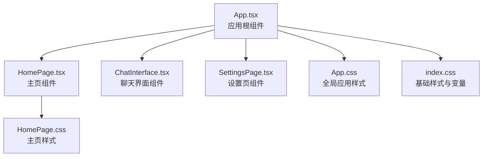
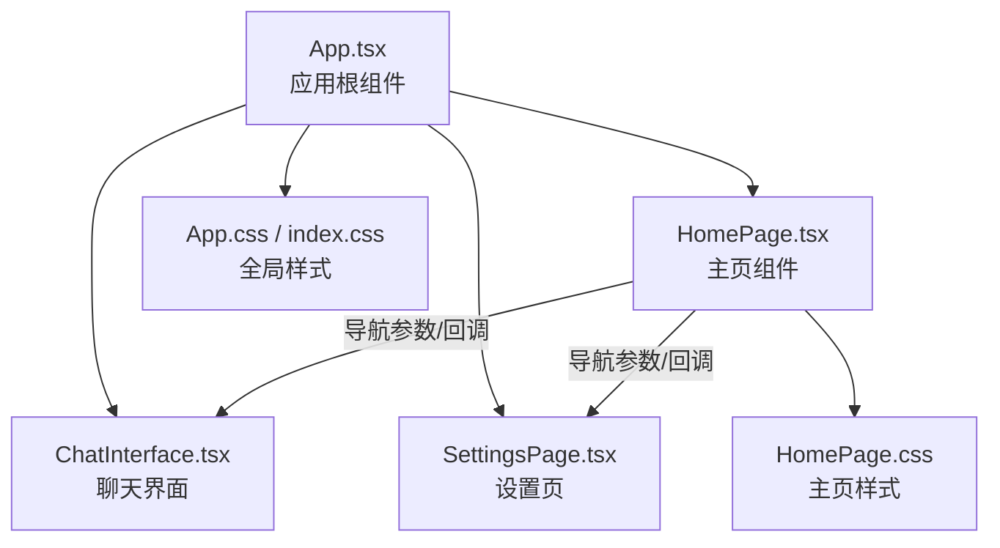
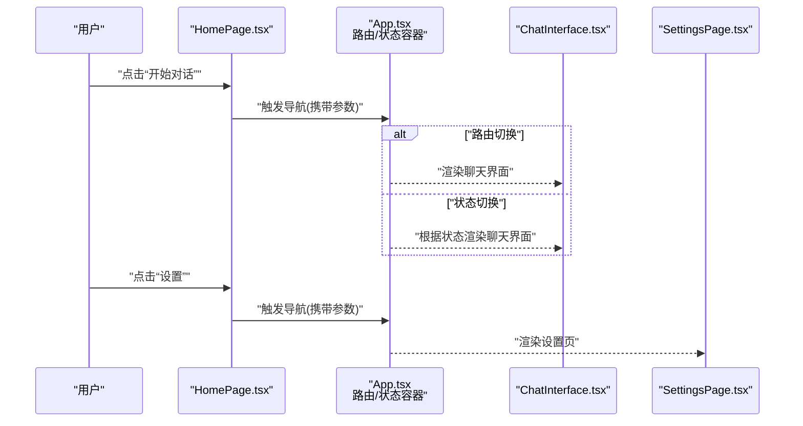
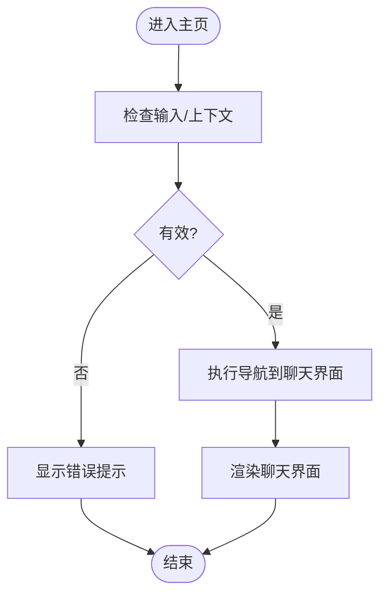
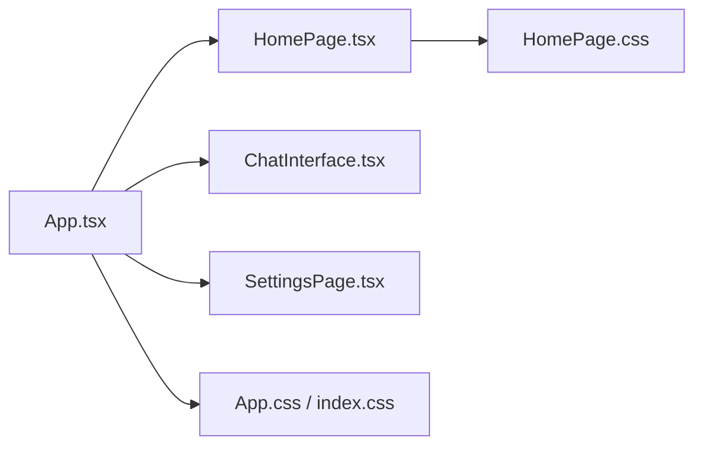

# 主页组件实现

<cite>
**本文引用的文件**   
- [HomePage.tsx](file://frontend/src/components/HomePage.tsx)
- [HomePage.css](file://frontend/src/components/HomePage.css)
- [App.tsx](file://frontend/src/App.tsx)
- [ChatInterface.tsx](file://frontend/src/components/ChatInterface.tsx)
- [SettingsPage.tsx](file://frontend/src/components/SettingsPage.tsx)
- [index.css](file://frontend/src/index.css)
- [App.css](file://frontend/src/App.css)
</cite>

## 目录
1. [简介](#简介)
2. [项目结构](#项目结构)
3. [核心组件](#核心组件)
4. [架构总览](#架构总览)
5. [详细组件分析](#详细组件分析)
6. [依赖分析](#依赖分析)
7. [性能考虑](#性能考虑)
8. [故障排查指南](#故障排查指南)
9. [结论](#结论)
10. [附录](#附录)

## 简介
本文件聚焦于前端“主页组件”的实现与使用，围绕 HomePage 组件的布局结构设计、导航逻辑、用户交互流程、状态管理、路由配置与页面切换机制进行系统化说明。同时覆盖响应式设计、CSS 样式架构与主题定制方法，并提供属性配置示例、事件处理模式、性能优化技巧以及与其它组件的集成方式和数据传递机制。文档旨在帮助开发者快速理解并高效扩展主页功能。

## 项目结构
本项目采用前后端分离架构，前端基于 React + TypeScript + Vite。与主页组件直接相关的代码位于 frontend/src 目录下：
- 组件层：HomePage.tsx、ChatInterface.tsx、SettingsPage.tsx
- 样式层：HomePage.css、App.css、index.css
- 应用入口与路由：App.tsx、main.tsx（入口）

图表来源
- [App.tsx:1-200](file://frontend/src/App.tsx#L1-L200)
- [HomePage.tsx:1-200](file://frontend/src/components/HomePage.tsx#L1-L200)
- [HomePage.css:1-200](file://frontend/src/components/HomePage.css#L1-L200)
- [App.css:1-200](file://frontend/src/App.css#L1-L200)
- [index.css:1-200](file://frontend/src/index.css#L1-L200)

章节来源
- [App.tsx:1-200](file://frontend/src/App.tsx#L1-L200)
- [HomePage.tsx:1-200](file://frontend/src/components/HomePage.tsx#L1-L200)
- [HomePage.css:1-200](file://frontend/src/components/HomePage.css#L1-L200)
- [App.css:1-200](file://frontend/src/App.css#L1-L200)
- [index.css:1-200](file://frontend/src/index.css#L1-L200)

## 核心组件
- HomePage 组件
  - 职责：作为应用的主入口页面，提供导航到聊天界面与设置页的能力；承载首页内容展示与交互入口。
  - 关键能力：
    - 布局结构：顶部导航栏、主内容区、底部信息区（具体区块以实际实现为准）。
    - 导航逻辑：通过点击或键盘操作触发页面跳转至 ChatInterface 或 SettingsPage。
    - 状态管理：维护当前视图、用户输入、加载状态等（若使用外部状态库则遵循其约定）。
    - 事件处理：按钮点击、表单提交、快捷键等。
    - 响应式适配：在不同屏幕尺寸下调整布局与排版。
    - 主题定制：通过 CSS 变量或主题上下文支持明暗主题与品牌色定制。
- 关联组件
  - ChatInterface：聊天对话界面，接收来自主页的参数或上下文。
  - SettingsPage：系统设置页面，支持从主页进入并进行配置修改。

章节来源
- [HomePage.tsx:1-200](file://frontend/src/components/HomePage.tsx#L1-L200)
- [ChatInterface.tsx:1-200](file://frontend/src/components/ChatInterface.tsx#L1-L200)
- [SettingsPage.tsx:1-200](file://frontend/src/components/SettingsPage.tsx#L1-L200)

## 架构总览
下图展示了应用根组件与主页、聊天、设置页之间的整体关系与数据流向。

图表来源
- [App.tsx:1-200](file://frontend/src/App.tsx#L1-L200)
- [HomePage.tsx:1-200](file://frontend/src/components/HomePage.tsx#L1-L200)
- [ChatInterface.tsx:1-200](file://frontend/src/components/ChatInterface.tsx#L1-L200)
- [SettingsPage.tsx:1-200](file://frontend/src/components/SettingsPage.tsx#L1-L200)
- [HomePage.css:1-200](file://frontend/src/components/HomePage.css#L1-L200)
- [App.css:1-200](file://frontend/src/App.css#L1-L200)
- [index.css:1-200](file://frontend/src/index.css#L1-L200)

## 详细组件分析

### 布局结构设计
- 区域划分
  - 顶部导航栏：包含应用标识、主要导航入口（如“开始对话”、“设置”）。
  - 主内容区：欢迎文案、快捷入口卡片、最近会话列表（若有）、推荐功能入口。
  - 底部信息区：版权信息、版本提示、反馈链接等。
- 栅格与间距
  - 使用统一的间距系统与栅格规则，确保在不同设备上的视觉一致性。
- 可访问性
  - 为关键交互元素提供语义化标签与键盘可达性。

章节来源
- [HomePage.tsx:1-200](file://frontend/src/components/HomePage.tsx#L1-L200)
- [HomePage.css:1-200](file://frontend/src/components/HomePage.css#L1-L200)

### 导航逻辑与页面切换机制
- 导航目标
  - 跳转到聊天界面：携带必要上下文（如默认提示词、会话ID等）。
  - 跳转到设置页：打开系统设置面板。
- 路由策略
  - 若使用浏览器路由：通过路径切换与查询参数传递上下文。
  - 若使用状态驱动：在根组件中维护当前视图状态并渲染对应页面。
- 返回与历史
  - 保留浏览器历史栈，支持返回上一页。
- 过渡动画
  - 页面切换时可加入淡入淡出或滑动效果以提升体验。

图表来源
- [App.tsx:1-200](file://frontend/src/App.tsx#L1-L200)
- [HomePage.tsx:1-200](file://frontend/src/components/HomePage.tsx#L1-L200)
- [ChatInterface.tsx:1-200](file://frontend/src/components/ChatInterface.tsx#L1-L200)
- [SettingsPage.tsx:1-200](file://frontend/src/components/SettingsPage.tsx#L1-L200)

章节来源
- [App.tsx:1-200](file://frontend/src/App.tsx#L1-L200)
- [HomePage.tsx:1-200](file://frontend/src/components/HomePage.tsx#L1-L200)

### 用户交互流程
- 典型交互
  - 点击“开始对话”：校验输入（如有），准备上下文，执行导航。
  - 点击“设置”：打开设置页，必要时保存上次选择。
  - 快捷键：例如 Enter 快速开始对话，Esc 取消弹窗。
- 反馈与错误
  - 网络请求失败时显示友好提示。
  - 无效输入时高亮字段并给出修正建议。

图表来源
- [HomePage.tsx:1-200](file://frontend/src/components/HomePage.tsx#L1-L200)

章节来源
- [HomePage.tsx:1-200](file://frontend/src/components/HomePage.tsx#L1-L200)

### 状态管理与数据流
- 本地状态
  - 输入框值、加载状态、错误消息、是否显示弹窗等。
- 共享状态
  - 若需要跨页面共享（如用户偏好、主题、语言），可在根组件或状态容器中维护。
- 副作用处理
  - 使用副作用钩子监听依赖变化，执行必要的初始化或清理。
- 数据持久化
  - 将关键配置写入本地存储，提升用户体验。

章节来源
- [HomePage.tsx:1-200](file://frontend/src/components/HomePage.tsx#L1-L200)
- [App.tsx:1-200](file://frontend/src/App.tsx#L1-L200)

### 路由配置与页面切换
- 路由定义
  - 主页、聊天页、设置页的路径映射。
- 参数传递
  - 通过查询参数或路由参数传递上下文（如默认提示词、会话ID）。
- 守卫与鉴权
  - 对受保护页面进行访问控制（如登录态检查）。
- 懒加载
  - 按需加载非首屏页面，减少初始包体积。

章节来源
- [App.tsx:1-200](file://frontend/src/App.tsx#L1-L200)

### 响应式设计实现
- 断点策略
  - 针对手机、平板、桌面端分别定义断点与布局规则。
- 弹性布局
  - 使用 Flex/Grid 构建自适应网格，保证内容在不同宽度下的可读性与可用性。
- 媒体查询
  - 在小屏设备上隐藏次要信息，突出核心操作。
- 触摸友好
  - 增大触控区域，优化手势交互。

章节来源
- [HomePage.css:1-200](file://frontend/src/components/HomePage.css#L1-L200)
- [App.css:1-200](file://frontend/src/App.css#L1-L200)
- [index.css:1-200](file://frontend/src/index.css#L1-L200)

### CSS 样式架构与主题定制
- 样式组织
  - 组件级样式（HomePage.css）与全局样式（App.css、index.css）分层清晰。
- 设计令牌
  - 使用 CSS 变量定义颜色、字号、间距、阴影等，便于统一替换。
- 主题切换
  - 通过根节点类名或数据属性切换明暗主题，组件样式自动适配。
- 命名规范
  - 采用 BEM 或类似命名约定，避免样式冲突。

章节来源
- [HomePage.css:1-200](file://frontend/src/components/HomePage.css#L1-L200)
- [App.css:1-200](file://frontend/src/App.css#L1-L200)
- [index.css:1-200](file://frontend/src/index.css#L1-L200)

### 组件属性配置示例
以下为常见属性配置项的说明（类型与默认值以实际实现为准）：
- 标题文本：用于页面头部展示的标题字符串。
- 欢迎语：主页欢迎文案，支持多行与富文本占位。
- 快捷入口列表：一组对象，包含图标、标题、描述与跳转目标。
- 主题模式：支持“浅色”、“深色”、“跟随系统”。
- 语言：界面语言代码，影响文案与格式。
- 是否启用演示模式：在演示模式下隐藏敏感信息或禁用部分功能。

章节来源
- [HomePage.tsx:1-200](file://frontend/src/components/HomePage.tsx#L1-L200)

### 事件处理模式
- 点击事件
  - 绑定到按钮与卡片，触发导航或弹窗。
- 表单事件
  - 输入变更、失焦校验、提交处理。
- 键盘事件
  - 支持回车提交、Esc 关闭弹窗、Tab 顺序导航。
- 生命周期事件
  - 组件挂载时初始化数据，卸载时清理资源。

章节来源
- [HomePage.tsx:1-200](file://frontend/src/components/HomePage.tsx#L1-L200)

### 与其他组件的集成与数据传递
- 与 ChatInterface 集成
  - 传递默认提示词、会话ID、模型选择等上下文。
  - 通过回调函数通知主页更新状态（如最近会话列表刷新）。
- 与 SettingsPage 集成
  - 读取用户偏好（主题、语言、默认模型），并在主页即时生效。
  - 支持从设置页返回后保持主页滚动位置与筛选条件。
- 与全局样式集成
  - 复用全局设计令牌，确保视觉一致性。

章节来源
- [HomePage.tsx:1-200](file://frontend/src/components/HomePage.tsx#L1-L200)
- [ChatInterface.tsx:1-200](file://frontend/src/components/ChatInterface.tsx#L1-L200)
- [SettingsPage.tsx:1-200](file://frontend/src/components/SettingsPage.tsx#L1-L200)

## 依赖分析
- 内部依赖
  - App.tsx 作为根组件，负责路由与全局状态，向下分发到 HomePage、ChatInterface、SettingsPage。
  - HomePage 依赖样式文件与可能的全局上下文（主题、语言）。
- 外部依赖
  - 路由库（如存在）：用于页面切换与参数传递。
  - 状态库（如存在）：用于跨组件状态共享。
  - UI 库（如存在）：提供基础组件与样式体系。

图表来源
- [App.tsx:1-200](file://frontend/src/App.tsx#L1-L200)
- [HomePage.tsx:1-200](file://frontend/src/components/HomePage.tsx#L1-L200)
- [ChatInterface.tsx:1-200](file://frontend/src/components/ChatInterface.tsx#L1-L200)
- [SettingsPage.tsx:1-200](file://frontend/src/components/SettingsPage.tsx#L1-L200)
- [HomePage.css:1-200](file://frontend/src/components/HomePage.css#L1-L200)
- [App.css:1-200](file://frontend/src/App.css#L1-L200)
- [index.css:1-200](file://frontend/src/index.css#L1-L200)

章节来源
- [App.tsx:1-200](file://frontend/src/App.tsx#L1-L200)
- [HomePage.tsx:1-200](file://frontend/src/components/HomePage.tsx#L1-L200)

## 性能考虑
- 首屏优化
  - 懒加载非关键组件与路由，减小初始包体积。
  - 预取与缓存常用数据，减少重复请求。
- 渲染优化
  - 合理使用 memo/useMemo/useCallback 避免不必要的重渲染。
  - 列表虚拟化，长列表只渲染可视区域。
- 资源优化
  - 图片与图标压缩与懒加载。
  - 字体与样式按需加载。
- 交互优化
  - 防抖与节流，降低高频事件带来的开销。
  - 骨架屏与占位图，提升感知性能。

[本节为通用指导，不直接分析具体文件]

## 故障排查指南
- 常见问题
  - 导航无响应：检查路由配置与事件绑定是否正确。
  - 样式错乱：确认 CSS 变量与主题类名是否正确应用。
  - 状态不同步：核对状态容器与组件间的数据传递链路。
- 调试建议
  - 使用浏览器开发者工具查看网络请求与状态变化。
  - 在关键路径添加日志输出，定位异常分支。
  - 编写单元测试覆盖核心交互流程。

章节来源
- [HomePage.tsx:1-200](file://frontend/src/components/HomePage.tsx#L1-L200)
- [App.tsx:1-200](file://frontend/src/App.tsx#L1-L200)

## 结论
主页组件作为应用的入口，承担着导航、展示与交互的核心职责。通过清晰的布局结构、稳健的导航逻辑与良好的状态管理，结合响应式设计与主题定制，能够为用户提供一致且高效的体验。建议在后续迭代中持续优化性能与可访问性，完善错误处理与监控，确保系统的稳定性与可扩展性。

[本节为总结性内容，不直接分析具体文件]

## 附录
- 术语表
  - 路由：用于在不同页面之间切换的机制。
  - 状态管理：用于维护与应用相关数据的方案。
  - 主题：一套可替换的视觉风格集合。
- 参考文件
  - 主页组件实现：[HomePage.tsx](file://frontend/src/components/HomePage.tsx)
  - 主页样式：[HomePage.css](file://frontend/src/components/HomePage.css)
  - 应用根组件：[App.tsx](file://frontend/src/App.tsx)
  - 聊天界面：[ChatInterface.tsx](file://frontend/src/components/ChatInterface.tsx)
  - 设置页：[SettingsPage.tsx](file://frontend/src/components/SettingsPage.tsx)
  - 全局样式：[App.css](file://frontend/src/App.css)、[index.css](file://frontend/src/index.css)