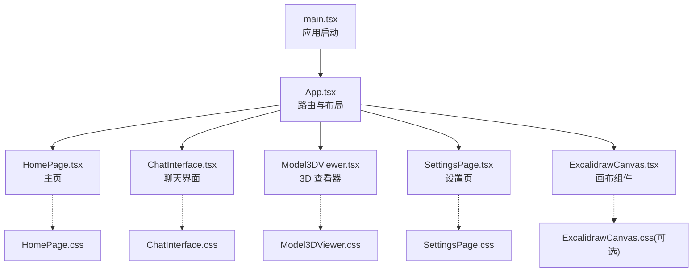
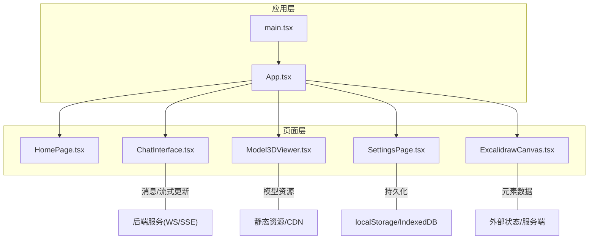
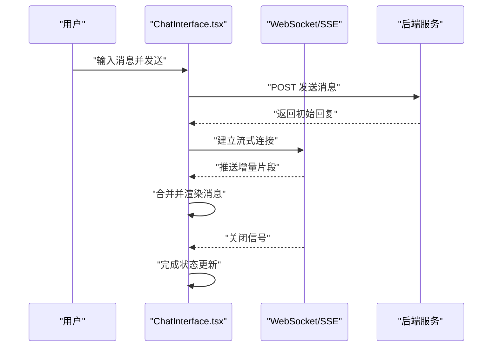
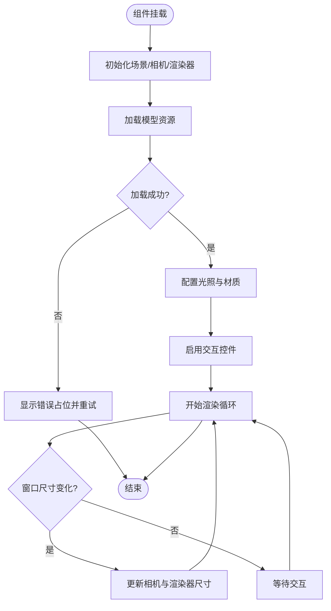
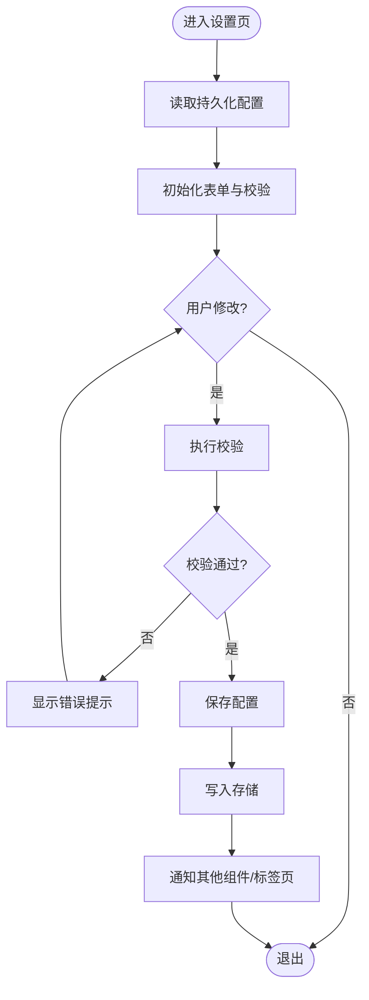
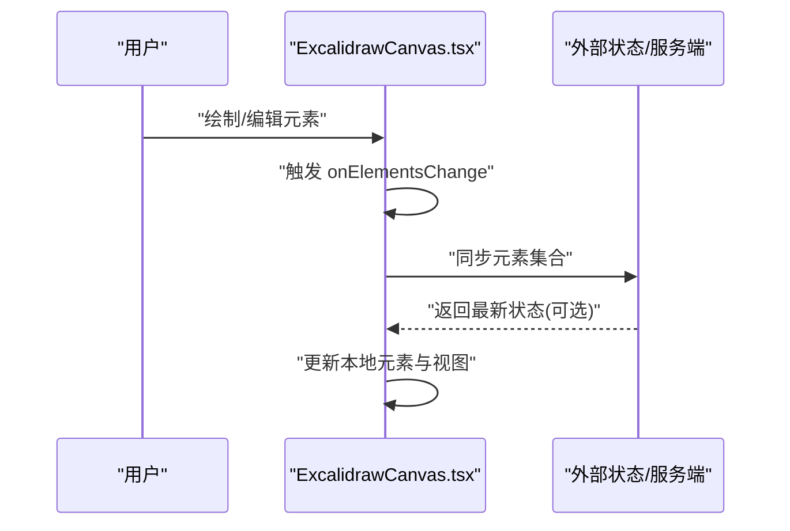
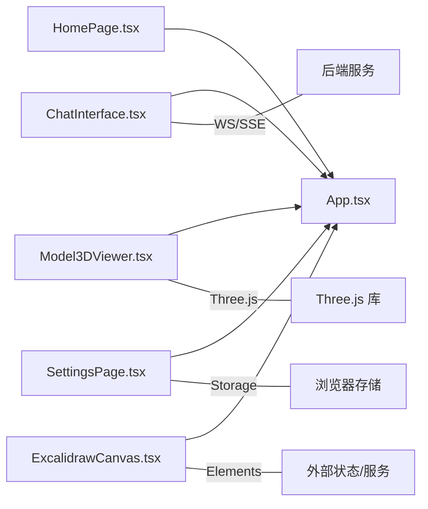

# 核心组件实现

<cite>
**本文引用的文件**   
- [frontend/src/components/HomePage.tsx](file://frontend/src/components/HomePage.tsx)
- [frontend/src/components/HomePage.css](file://frontend/src/components/HomePage.css)
- [frontend/src/components/ChatInterface.tsx](file://frontend/src/components/ChatInterface.tsx)
- [frontend/src/components/ChatInterface.css](file://frontend/src/components/ChatInterface.css)
- [frontend/src/components/Model3DViewer.tsx](file://frontend/src/components/Model3DViewer.tsx)
- [frontend/src/components/Model3DViewer.css](file://frontend/src/components/Model3DViewer.css)
- [frontend/src/components/SettingsPage.tsx](file://frontend/src/components/SettingsPage.tsx)
- [frontend/src/components/SettingsPage.css](file://frontend/src/components/SettingsPage.css)
- [frontend/src/components/ExcalidrawCanvas.tsx](file://frontend/src/components/ExcalidrawCanvas.tsx)
- [frontend/src/App.tsx](file://frontend/src/App.tsx)
- [frontend/src/main.tsx](file://frontend/src/main.tsx)
</cite>

## 目录
1. [简介](#简介)
2. [项目结构](#项目结构)
3. [核心组件](#核心组件)
4. [架构总览](#架构总览)
5. [详细组件分析](#详细组件分析)
6. [依赖分析](#依赖分析)
7. [性能考虑](#性能考虑)
8. [故障排查指南](#故障排查指南)
9. [结论](#结论)
10. [附录](#附录)

## 简介
本文件聚焦前端核心组件的实现与协作，覆盖以下关键能力：
- HomePage 主页组件的布局设计与导航逻辑
- ChatInterface 聊天界面的消息渲染、用户输入处理与实时通信集成
- Model3DViewer 3D 模型查看器的 Three.js 集成、交互控制与性能优化
- SettingsPage 设置页面的表单处理与状态持久化
- ExcalidrawCanvas 画布组件的绘图功能、事件监听与数据同步
- 组件间通信模式、状态共享策略、错误边界处理
- 使用示例、自定义扩展方法与调试技巧

## 项目结构
前端采用按“功能域”组织的方式，每个核心组件与其样式文件成对存在，便于维护与复用。应用入口通过 App 路由到各页面，主进程由 main.tsx 启动。

图表来源
- [frontend/src/main.tsx](file://frontend/src/main.tsx)
- [frontend/src/App.tsx](file://frontend/src/App.tsx)
- [frontend/src/components/HomePage.tsx](file://frontend/src/components/HomePage.tsx)
- [frontend/src/components/ChatInterface.tsx](file://frontend/src/components/ChatInterface.tsx)
- [frontend/src/components/Model3DViewer.tsx](file://frontend/src/components/Model3DViewer.tsx)
- [frontend/src/components/SettingsPage.tsx](file://frontend/src/components/SettingsPage.tsx)
- [frontend/src/components/ExcalidrawCanvas.tsx](file://frontend/src/components/ExcalidrawCanvas.tsx)

章节来源
- [frontend/src/main.tsx](file://frontend/src/main.tsx)
- [frontend/src/App.tsx](file://frontend/src/App.tsx)

## 核心组件
本节概述各组件的职责与对外暴露的关键能力（属性、事件、副作用），并给出典型用法要点与扩展点。

- HomePage 主页
  - 职责：提供应用首页布局与导航入口；承载全局欢迎信息与快捷操作。
  - 关键属性：导航回调、主题或语言等配置（如有）。
  - 事件：点击跳转至聊天、设置、3D 查看器等页面。
  - 副作用：无重计算；可接入埋点或统计。
  - 扩展：新增卡片或快捷入口时，仅需在布局中增加节点并绑定导航。

- ChatInterface 聊天界面
  - 职责：展示对话历史、渲染多类型消息、接收用户输入、与后端进行实时通信。
  - 关键属性：会话标识、消息列表、发送回调、流式更新回调、加载态。
  - 事件：onSend、onStreamUpdate、onError、onClear。
  - 副作用：WebSocket/SSE 连接管理、消息去重与增量渲染、滚动定位。
  - 扩展：支持富媒体消息、工具调用结果嵌入、消息搜索与过滤。

- Model3DViewer 3D 模型查看器
  - 职责：基于 Three.js 加载与展示 3D 模型，提供旋转、缩放、平移等交互。
  - 关键属性：模型 URL、材质参数、光照配置、相机初始位置、交互开关。
  - 事件：onLoad、onError、onInteract、onExport。
  - 副作用：Three.js 场景初始化、资源加载、动画循环、销毁清理。
  - 扩展：添加标注、测量工具、截图导出、纹理替换。

- SettingsPage 设置页面
  - 职责：提供系统或用户偏好设置，支持表单校验与本地持久化。
  - 关键属性：初始设置对象、保存回调、重置回调。
  - 事件：onChange、onSave、onReset、onValidate。
  - 副作用：写入 localStorage/IndexedDB、变更订阅与回写。
  - 扩展：分组设置、导入导出配置、A/B 开关。

- ExcalidrawCanvas 画布组件
  - 职责：集成 Excalidraw 画布，提供绘图、编辑、导出与双向同步。
  - 关键属性：元素集合、工具栏开关、只读模式、主题、导出格式。
  - 事件：onElementsChange、onExport、onZoomChange、onThemeChange。
  - 副作用：初始化 Excalidraw、监听元素变化、同步外部状态。
  - 扩展：自定义工具、协作编辑、版本快照。

章节来源
- [frontend/src/components/HomePage.tsx](file://frontend/src/components/HomePage.tsx)
- [frontend/src/components/ChatInterface.tsx](file://frontend/src/components/ChatInterface.tsx)
- [frontend/src/components/Model3DViewer.tsx](file://frontend/src/components/Model3DViewer.tsx)
- [frontend/src/components/SettingsPage.tsx](file://frontend/src/components/SettingsPage.tsx)
- [frontend/src/components/ExcalidrawCanvas.tsx](file://frontend/src/components/ExcalidrawCanvas.tsx)

## 架构总览
整体采用“页面级组件 + 功能型子组件”的分层结构。App 负责路由与容器布局，各页面组件内部再组合具体功能组件。跨组件通信以 props 为主，必要时通过轻量上下文或事件总线进行解耦。

图表来源
- [frontend/src/main.tsx](file://frontend/src/main.tsx)
- [frontend/src/App.tsx](file://frontend/src/App.tsx)
- [frontend/src/components/ChatInterface.tsx](file://frontend/src/components/ChatInterface.tsx)
- [frontend/src/components/Model3DViewer.tsx](file://frontend/src/components/Model3DViewer.tsx)
- [frontend/src/components/SettingsPage.tsx](file://frontend/src/components/SettingsPage.tsx)
- [frontend/src/components/ExcalidrawCanvas.tsx](file://frontend/src/components/ExcalidrawCanvas.tsx)

## 详细组件分析

### HomePage 主页组件
- 布局设计
  - 顶部导航区：包含应用标题、主要入口按钮。
  - 内容主体：欢迎文案、功能卡片网格、快速链接。
  - 底部信息：版权、版本、帮助链接。
- 导航逻辑
  - 点击不同卡片触发路由跳转或回调，进入对应页面。
  - 支持键盘导航与无障碍标签。
- 状态与副作用
  - 纯展示为主，不持有复杂状态；如需记录访问次数或埋点，可在事件回调中上报。
- 样式要点
  - 使用 CSS 变量统一主题色与间距；响应式栅格适配移动端。
- 使用示例
  - 作为根页面挂载，传入导航回调函数即可。
- 自定义扩展
  - 新增功能卡片：复制现有卡片模板，绑定新路由与图标。
  - 主题切换：通过 CSS 变量注入不同配色方案。
- 调试技巧
  - 在浏览器开发者工具的“元素”面板检查布局断点；在“网络”面板确认资源加载顺序。

章节来源
- [frontend/src/components/HomePage.tsx](file://frontend/src/components/HomePage.tsx)
- [frontend/src/components/HomePage.css](file://frontend/src/components/HomePage.css)

### ChatInterface 聊天界面
- 消息渲染
  - 支持文本、图片、代码块、工具调用结果等多类型消息。
  - 长消息折叠、时间戳显示、用户头像与角色区分。
- 用户输入处理
  - 输入框支持换行、快捷键发送、粘贴图片自动上传。
  - 输入校验与防抖提交，避免重复请求。
- 实时通信集成
  - 建立 WebSocket/SSE 连接，接收流式片段并增量渲染。
  - 心跳检测、断线重连、错误提示与重试机制。
- 状态管理
  - 消息列表去重与追加；滚动锚点保持在最新消息；加载态与空态处理。
- 错误边界
  - 捕获渲染异常，降级为安全占位；记录错误日志并提示用户重试。
- 使用示例
  - 传入消息数组与发送回调，即可渲染基础聊天界面。
- 自定义扩展
  - 注册自定义消息类型渲染器；扩展工具调用结果展示。
- 调试技巧
  - 打开控制台观察网络帧与流式片段；使用 React DevTools 检查消息树更新频率。

图表来源
- [frontend/src/components/ChatInterface.tsx](file://frontend/src/components/ChatInterface.tsx)

章节来源
- [frontend/src/components/ChatInterface.tsx](file://frontend/src/components/ChatInterface.tsx)
- [frontend/src/components/ChatInterface.css](file://frontend/src/components/ChatInterface.css)

### Model3DViewer 3D 模型查看器
- Three.js 集成
  - 场景、相机、渲染器初始化；光源与阴影配置。
  - 模型加载器（如 glTF/GLB）与纹理贴图管理。
- 交互控制
  - OrbitControls 实现旋转、缩放、平移；双击聚焦特定对象。
  - 射线拾取用于高亮与选中效果。
- 性能优化
  - 按需加载模型与纹理；LOD 层级细节；几何体合并减少 draw call。
  - 使用 requestAnimationFrame 节流渲染；离屏渲染预计算。
- 错误处理
  - 资源加载失败降级为占位图；网络超时重试与提示。
- 使用示例
  - 传入模型 URL 与相机初始参数，即可展示 3D 视图。
- 自定义扩展
  - 添加标注点、测量工具、截图导出、材质替换。
- 调试技巧
  - 使用 Three.js Inspector 检查场景图与材质；在性能面板监控 FPS 与内存占用。

图表来源
- [frontend/src/components/Model3DViewer.tsx](file://frontend/src/components/Model3DViewer.tsx)

章节来源
- [frontend/src/components/Model3DViewer.tsx](file://frontend/src/components/Model3DViewer.tsx)
- [frontend/src/components/Model3DViewer.css](file://frontend/src/components/Model3DViewer.css)

### SettingsPage 设置页面
- 表单处理
  - 受控表单字段、即时校验、错误提示与禁用态。
  - 批量保存与逐项保存两种模式。
- 状态持久化
  - 读取与写入 localStorage/IndexedDB；首次启动默认值填充。
  - 变更订阅与回写，确保多标签页一致性。
- 错误边界
  - 捕获序列化/反序列化异常，恢复默认配置并提示用户。
- 使用示例
  - 传入初始设置对象与保存回调，即可实现完整设置流程。
- 自定义扩展
  - 新增设置项：定义字段元数据与校验规则；扩展导入导出格式。
- 调试技巧
  - 在存储面板检查键值对；使用断点跟踪保存路径与异常堆栈。

图表来源
- [frontend/src/components/SettingsPage.tsx](file://frontend/src/components/SettingsPage.tsx)

章节来源
- [frontend/src/components/SettingsPage.tsx](file://frontend/src/components/SettingsPage.tsx)
- [frontend/src/components/SettingsPage.css](file://frontend/src/components/SettingsPage.css)

### ExcalidrawCanvas 画布组件
- 绘图功能
  - 基础图形绘制、自由手绘、文本与箭头；撤销/重做。
  - 多选、对齐、吸附与网格辅助。
- 事件监听
  - onElementsChange 监听元素增删改；onZoomChange 监听缩放；onThemeChange 监听主题切换。
- 数据同步
  - 将元素集合同步到外部状态或服务端；冲突解决与版本快照。
- 性能优化
  - 大画布虚拟渲染；批量更新合并；按需导出。
- 错误处理
  - 导入失败降级为只读；导出失败提示重试。
- 使用示例
  - 传入元素集合与回调，即可实现双向同步的画布。
- 自定义扩展
  - 注册自定义工具与形状；扩展导出格式与协作协议。
- 调试技巧
  - 在控制台打印元素变更差异；使用浏览器性能面板分析绘制耗时。

图表来源
- [frontend/src/components/ExcalidrawCanvas.tsx](file://frontend/src/components/ExcalidrawCanvas.tsx)

章节来源
- [frontend/src/components/ExcalidrawCanvas.tsx](file://frontend/src/components/ExcalidrawCanvas.tsx)

## 依赖分析
组件间的依赖关系清晰，主要通过 props 传递数据与回调，降低耦合度。部分组件与外部系统存在集成依赖：
- ChatInterface 依赖后端实时通信接口
- Model3DViewer 依赖 Three.js 生态库与静态资源
- SettingsPage 依赖浏览器存储 API
- ExcalidrawCanvas 依赖 Excalidraw 库与可能的协作服务

图表来源
- [frontend/src/App.tsx](file://frontend/src/App.tsx)
- [frontend/src/components/ChatInterface.tsx](file://frontend/src/components/ChatInterface.tsx)
- [frontend/src/components/Model3DViewer.tsx](file://frontend/src/components/Model3DViewer.tsx)
- [frontend/src/components/SettingsPage.tsx](file://frontend/src/components/SettingsPage.tsx)
- [frontend/src/components/ExcalidrawCanvas.tsx](file://frontend/src/components/ExcalidrawCanvas.tsx)

章节来源
- [frontend/src/App.tsx](file://frontend/src/App.tsx)

## 性能考虑
- 通用建议
  - 避免不必要的重渲染：拆分细粒度组件、使用 memo/useMemo/useCallback。
  - 列表渲染优化：稳定 key、分页与虚拟化。
  - 资源懒加载：路由级与组件级按需引入。
- ChatInterface
  - 流式渲染合并批次，限制 DOM 更新频率；长列表虚拟滚动。
- Model3DViewer
  - 控制渲染分辨率与阴影质量；使用纹理压缩与实例化渲染。
- SettingsPage
  - 批量写入与防抖保存；避免频繁读写存储。
- ExcalidrawCanvas
  - 大画布下开启增量更新与裁剪区域；导出前合并图层。

[本节为通用指导，无需源码引用]

## 故障排查指南
- 常见问题
  - 聊天消息未更新：检查 WebSocket/SSE 连接状态与心跳；确认增量片段合并逻辑。
  - 3D 模型无法加载：核对 URL 可达性与跨域策略；查看资源大小与格式兼容性。
  - 设置未持久化：检查存储权限与配额；验证序列化/反序列化异常。
  - 画布不同步：对比元素 ID 与版本；确认变更事件是否被正确订阅。
- 调试技巧
  - 使用 React DevTools 检查组件树与状态变化。
  - 在浏览器网络面板查看请求与流式帧；在控制台输出关键日志。
  - 针对 3D 场景使用 Three.js Inspector 检查对象与材质。
- 错误边界
  - 为易崩溃组件包裹错误边界，捕获异常并降级展示；记录错误上下文以便复现。

章节来源
- [frontend/src/components/ChatInterface.tsx](file://frontend/src/components/ChatInterface.tsx)
- [frontend/src/components/Model3DViewer.tsx](file://frontend/src/components/Model3DViewer.tsx)
- [frontend/src/components/SettingsPage.tsx](file://frontend/src/components/SettingsPage.tsx)
- [frontend/src/components/ExcalidrawCanvas.tsx](file://frontend/src/components/ExcalidrawCanvas.tsx)

## 结论
本项目的前端核心组件围绕“页面+功能”分层组织，职责清晰、耦合度低。通过 props 与事件回调实现组件间通信，结合必要的持久化与实时通信，形成完整的用户体验闭环。建议在后续迭代中持续优化渲染性能与错误边界，完善扩展点与文档，提升可维护性与可测试性。

[本节为总结，无需源码引用]

## 附录
- 组件使用示例要点
  - HomePage：作为根页面挂载，传入导航回调。
  - ChatInterface：传入消息数组与发送回调，支持流式更新。
  - Model3DViewer：传入模型 URL 与相机参数，启用交互控件。
  - SettingsPage：传入初始设置与保存回调，实现持久化。
  - ExcalidrawCanvas：传入元素集合与变更回调，实现双向同步。
- 自定义扩展方法
  - 新增消息类型渲染器（ChatInterface）
  - 添加 3D 标注与测量工具（Model3DViewer）
  - 扩展设置项与导入导出格式（SettingsPage）
  - 注册自定义工具与协作协议（ExcalidrawCanvas）
- 调试清单
  - 网络与存储面板检查
  - React DevTools 与 Three.js Inspector
  - 控制台日志与错误边界捕获

[本节为补充说明，无需源码引用]