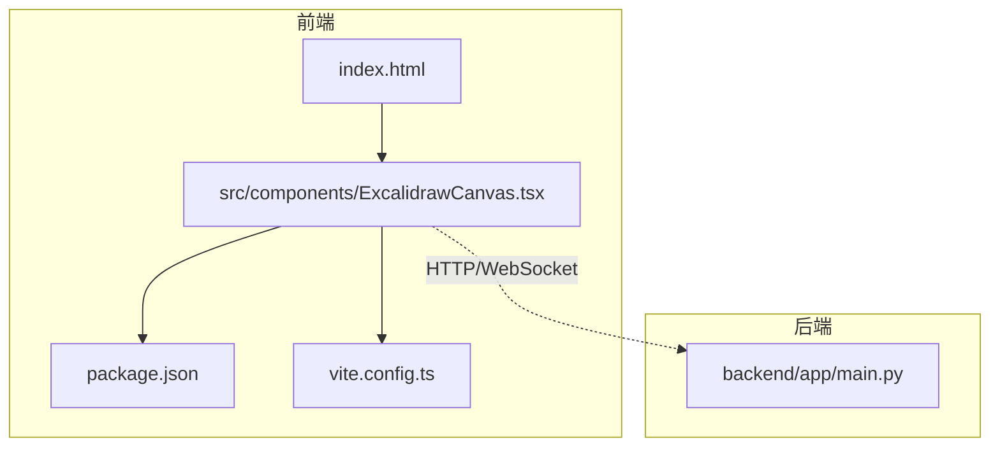
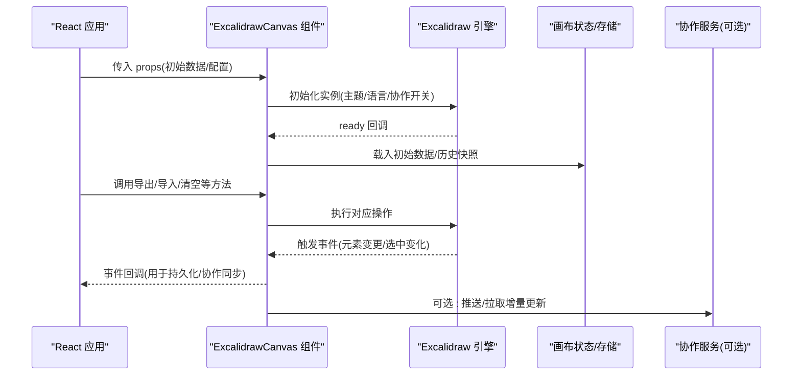
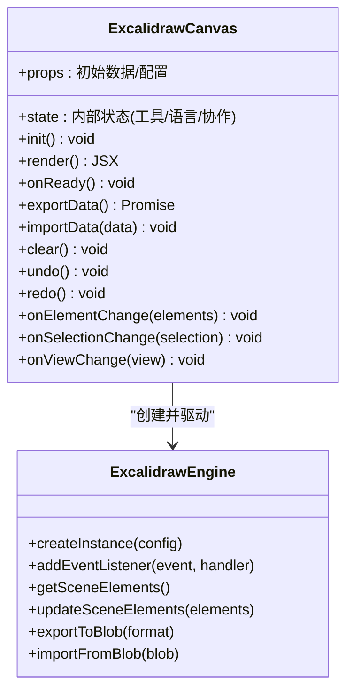
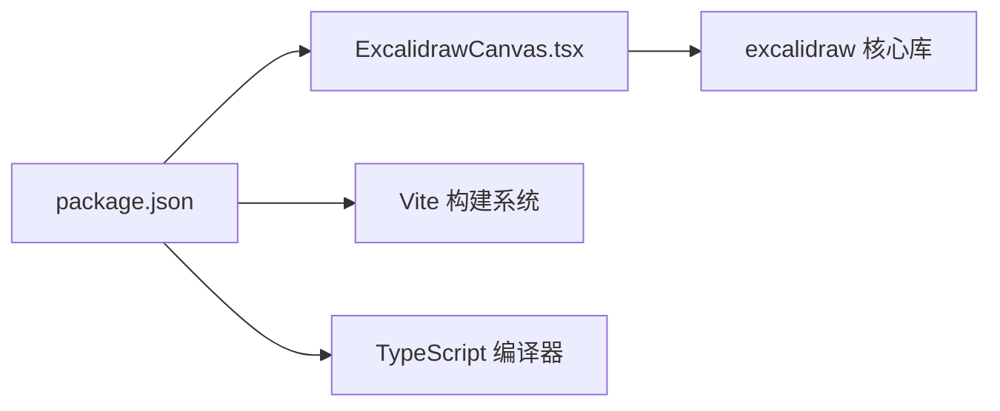

# 画布组件实现

<cite>
**本文引用的文件**   
- [ExcalidrawCanvas.tsx](file://frontend/src/components/ExcalidrawCanvas.tsx)
- [package.json](file://frontend/package.json)
</cite>

## 目录
1. [简介](#简介)
2. [项目结构](#项目结构)
3. [核心组件](#核心组件)
4. [架构总览](#架构总览)
5. [详细组件分析](#详细组件分析)
6. [依赖分析](#依赖分析)
7. [性能考虑](#性能考虑)
8. [故障排查指南](#故障排查指南)
9. [结论](#结论)
10. [附录](#附录)

## 简介
本文件面向在项目中集成与扩展 Excalidraw 画布组件的开发者，围绕以下目标展开：
- 深入解析 Excalidraw 库在前端工程中的集成方式、画布初始化与配置选项
- 梳理绘图工具集、形状绘制、文本编辑与图像插入等能力的使用路径
- 说明用户交互事件处理、撤销重做机制、图层管理与选择操作
- 提供自定义工具扩展、快捷键绑定与协作编辑的实现思路
- 解释画布数据序列化、版本控制、性能优化与移动端适配策略

## 项目结构
本项目为前后端分离架构。前端位于 frontend 目录，使用 Vite + TypeScript 构建；Excalidraw 画布组件位于前端 components 目录中。

图表来源
- [ExcalidrawCanvas.tsx:1-200](file://frontend/src/components/ExcalidrawCanvas.tsx#L1-L200)
- [package.json:1-200](file://frontend/package.json#L1-L200)

章节来源
- [ExcalidrawCanvas.tsx:1-200](file://frontend/src/components/ExcalidrawCanvas.tsx#L1-L200)
- [package.json:1-200](file://frontend/package.json#L1-L200)

## 核心组件
- ExcalidrawCanvas 组件负责：
  - 加载并渲染 Excalidraw 实例
  - 接收外部 props（如初始数据、主题、语言、协作相关参数）
  - 监听并转发关键事件（元素增删改、选中变化、视图缩放平移等）
  - 暴露方法以进行导出、清空、导入、撤销重做等操作
  - 管理本地状态（如是否处于协作模式、当前工具、语言包等）

章节来源
- [ExcalidrawCanvas.tsx:1-200](file://frontend/src/components/ExcalidrawCanvas.tsx#L1-L200)

## 架构总览
从应用视角看，Excalidraw 作为富交互画布引擎嵌入到 React 应用中，通过组件封装对外暴露统一 API。

图表来源
- [ExcalidrawCanvas.tsx:1-200](file://frontend/src/components/ExcalidrawCanvas.tsx#L1-L200)

## 详细组件分析

### 组件类图与职责

图表来源
- [ExcalidrawCanvas.tsx:1-200](file://frontend/src/components/ExcalidrawCanvas.tsx#L1-L200)

章节来源
- [ExcalidrawCanvas.tsx:1-200](file://frontend/src/components/ExcalidrawCanvas.tsx#L1-L200)

### 初始化与配置项
- 初始化流程
  - 根据 props 构造引擎配置（主题、语言、协作开关、UI 定制等）
  - 挂载到 DOM 节点后创建引擎实例
  - 注册事件监听器（元素变更、选中变化、视图变化、工具切换等）
  - 将初始数据注入场景，恢复历史快照
- 常用配置维度
  - 外观与语言：主题、字体、国际化语言包
  - 功能开关：协作、网格、背景、工具栏可见性
  - 行为偏好：吸附、对齐、缩放步进、双击编辑行为
  - 协作参数：房间标识、连接地址、消息协议

章节来源
- [ExcalidrawCanvas.tsx:1-200](file://frontend/src/components/ExcalidrawCanvas.tsx#L1-L200)

### 绘图工具集与基本操作
- 工具类型
  - 选择、矩形、椭圆、线条、箭头、自由绘制、文本、擦除、手型平移、缩放
- 形状绘制
  - 支持拖拽绘制、尺寸约束、角度旋转、多段折线、贝塞尔曲线
- 文本编辑
  - 双击进入编辑、自动换行、字号与样式调整、文本框自适应
- 图像插入
  - 拖拽或对话框选择图片、自动裁剪与比例保持、懒加载大图

章节来源
- [ExcalidrawCanvas.tsx:1-200](file://frontend/src/components/ExcalidrawCanvas.tsx#L1-L200)

### 用户交互事件处理
- 事件分类
  - 元素级：新增、删除、移动、缩放、旋转、组合/解组
  - 选择级：单选、多选、框选、取消选择
  - 视图级：缩放、平移、全屏
  - 工具级：工具切换、快捷键触发
- 事件处理建议
  - 去抖/节流：对高频事件（如拖拽、滚动）进行节流
  - 批量更新：合并多次元素变更再写入持久层
  - 副作用隔离：避免在事件回调中直接修改 React state 导致重渲染风暴

章节来源
- [ExcalidrawCanvas.tsx:1-200](file://frontend/src/components/ExcalidrawCanvas.tsx#L1-L200)

### 撤销重做机制
- 原理
  - 基于命令式历史栈，每次可逆操作入栈
  - 支持分组撤销（如一次组合操作整体撤销）
- 实现要点
  - 限制历史长度与内存占用
  - 跨标签页共享时，需结合协作通道同步历史指针
  - 与导入/导出、协作冲突合并时的历史一致性

章节来源
- [ExcalidrawCanvas.tsx:1-200](file://frontend/src/components/ExcalidrawCanvas.tsx#L1-L200)

### 图层管理与选择操作
- 图层概念
  - 元素层级顺序、组合对象、锁定/隐藏
- 选择操作
  - 多选、框选、按类型过滤选择、反选
- 最佳实践
  - 大量元素时启用虚拟滚动或按需渲染
  - 复杂组合对象减少不必要的重绘

章节来源
- [ExcalidrawCanvas.tsx:1-200](file://frontend/src/components/ExcalidrawCanvas.tsx#L1-L200)

### 自定义工具扩展
- 扩展点
  - 注册自定义工具、覆盖默认 UI、注入菜单项
- 开发步骤
  - 定义工具逻辑（命中测试、绘制路径、交互钩子）
  - 注册到工具栏与快捷键映射
  - 与场景数据模型对接（读写元素属性）
- 注意事项
  - 保证工具幂等性与可撤销性
  - 遵循无障碍与键盘导航规范

章节来源
- [ExcalidrawCanvas.tsx:1-200](file://frontend/src/components/ExcalidrawCanvas.tsx#L1-L200)

### 快捷键绑定
- 内置快捷键
  - 撤销/重做、复制/粘贴、全选、删除、工具切换
- 自定义快捷键
  - 全局键位映射、上下文敏感快捷键（仅在特定工具生效）
- 冲突处理
  - 优先级与冒泡规则、禁用浏览器默认行为

章节来源
- [ExcalidrawCanvas.tsx:1-200](file://frontend/src/components/ExcalidrawCanvas.tsx#L1-L200)

### 协作编辑
- 方案选型
  - CRDT/OT 协议、WebSocket 长连接、房间广播
- 数据同步
  - 增量 diff、冲突合并、断线重连与回滚
- 权限与会话
  - 只读/编辑角色、光标位置共享、在线人数显示

章节来源
- [ExcalidrawCanvas.tsx:1-200](file://frontend/src/components/ExcalidrawCanvas.tsx#L1-L200)

### 画布数据序列化与版本控制
- 序列化格式
  - JSON 场景描述、资源引用（图片/字体）、元数据（作者/时间戳）
- 版本兼容
  - 迁移脚本、向后兼容字段、废弃字段清理
- 校验与容错
  - 导入前 schema 校验、缺失字段降级策略

章节来源
- [ExcalidrawCanvas.tsx:1-200](file://frontend/src/components/ExcalidrawCanvas.tsx#L1-L200)

### 性能优化
- 渲染优化
  - 大场景分页/分块渲染、离屏缓存、减少重排重绘
- 事件优化
  - 节流/防抖、批量合并更新、惰性计算
- 资源优化
  - 图片懒加载、WebP/AVIF、CDN 加速、字体子集化

章节来源
- [ExcalidrawCanvas.tsx:1-200](file://frontend/src/components/ExcalidrawCanvas.tsx#L1-L200)

### 移动端适配
- 触控交互
  - 双指缩放、长按弹出菜单、手势冲突处理
- 布局与 UI
  - 工具栏折叠、浮动面板、安全区域适配
- 输入体验
  - 软键盘遮挡、焦点管理、输入法兼容性

章节来源
- [ExcalidrawCanvas.tsx:1-200](file://frontend/src/components/ExcalidrawCanvas.tsx#L1-L200)

## 依赖分析
- 运行时依赖
  - Excalidraw 核心库及其插件生态
- 构建期依赖
  - Vite、TypeScript、CSS 预处理器
- 第三方集成
  - 网络请求、WebSocket、媒体处理库

图表来源
- [package.json:1-200](file://frontend/package.json#L1-L200)
- [ExcalidrawCanvas.tsx:1-200](file://frontend/src/components/ExcalidrawCanvas.tsx#L1-L200)

章节来源
- [package.json:1-200](file://frontend/package.json#L1-L200)
- [ExcalidrawCanvas.tsx:1-200](file://frontend/src/components/ExcalidrawCanvas.tsx#L1-L200)

## 性能考虑
- 场景规模
  - 元素数量 > 1000 时建议开启虚拟化与按需渲染
- 内存占用
  - 及时释放图片 Blob、断开 WebSocket、清理定时器
- 首屏加载
  - 按需引入 Excalidraw 模块、延迟初始化非关键功能
- 网络传输
  - 增量同步、压缩传输、离线缓存

[本节为通用指导，不直接分析具体文件]

## 故障排查指南
- 常见问题
  - 画布无法初始化：检查容器尺寸、DOM 挂载时机、依赖版本
  - 事件丢失：确认事件监听注册时机与生命周期
  - 协作不同步：核对房间 ID、消息协议、时间戳与序列号
  - 导入失败：校验 JSON Schema、处理未知字段
- 定位手段
  - 打开调试日志、记录关键事件流、对比期望与实际数据差异

章节来源
- [ExcalidrawCanvas.tsx:1-200](file://frontend/src/components/ExcalidrawCanvas.tsx#L1-L200)

## 结论
通过将 Excalidraw 封装为 React 组件，可在业务应用中快速获得强大的可视化画布能力。围绕初始化配置、事件处理、撤销重做、协作与性能优化等关键点进行系统化设计与实现，能够显著提升用户体验与可维护性。建议在大型场景中优先关注渲染与内存优化，并在协作模式下确保数据一致性与冲突解决策略。

[本节为总结性内容，不直接分析具体文件]

## 附录
- 术语表
  - 场景：画布上所有元素的集合
  - 元素：矩形、椭圆、文本、图像等可绘制对象
  - 历史：可撤销/重做的操作序列
  - 协作：多人实时编辑同一画布
- 参考路径
  - 组件入口：ExcalidrawCanvas.tsx
  - 依赖声明：package.json

[本节为补充信息，不直接分析具体文件]