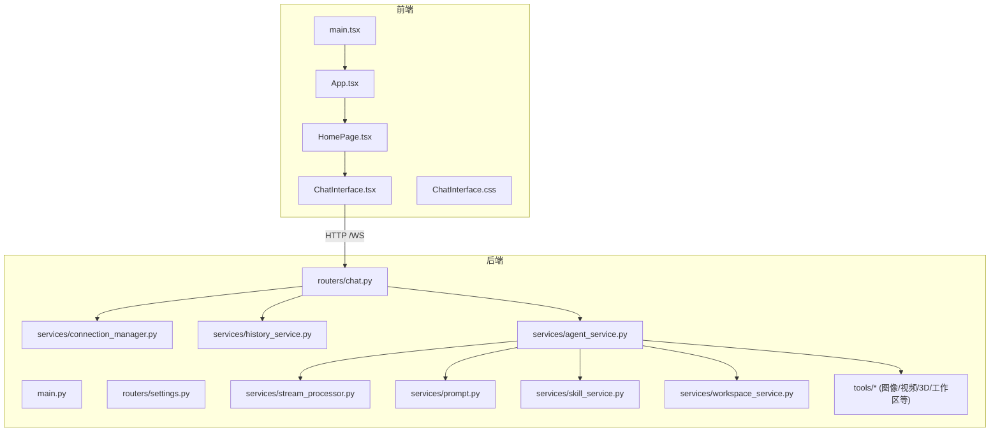
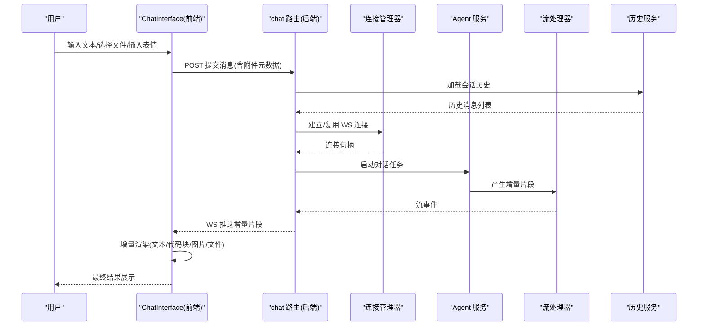
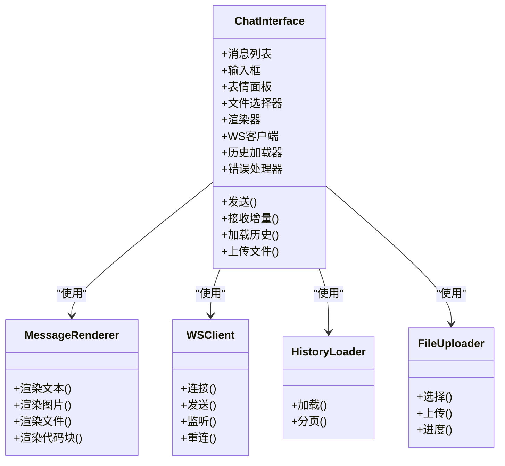
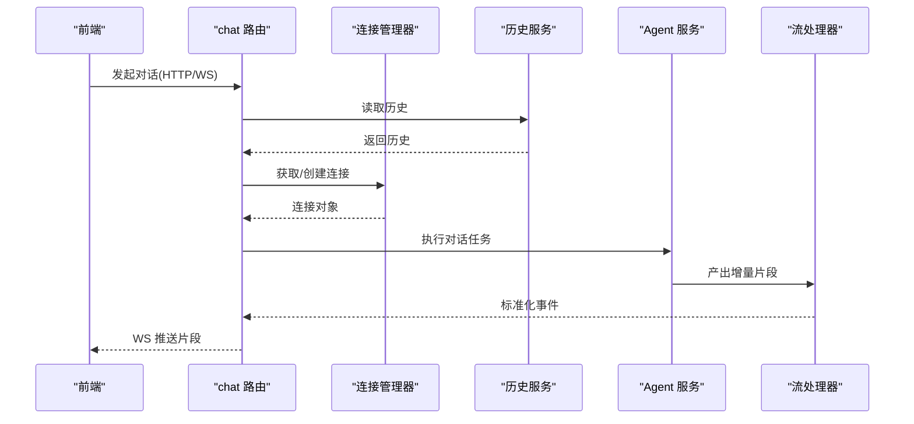
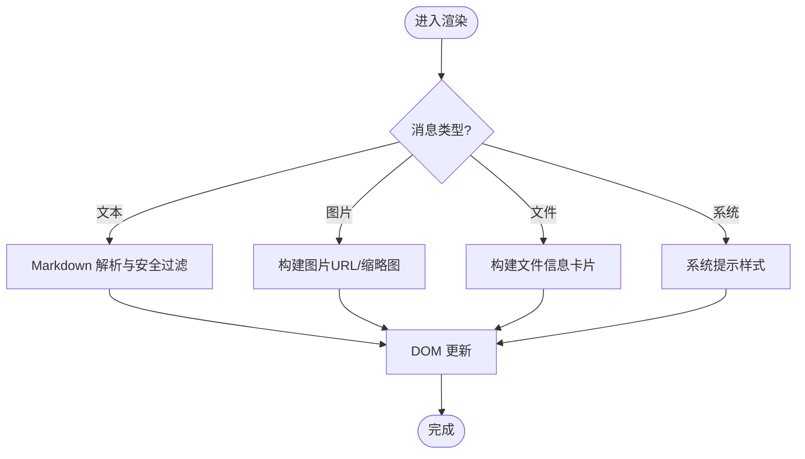
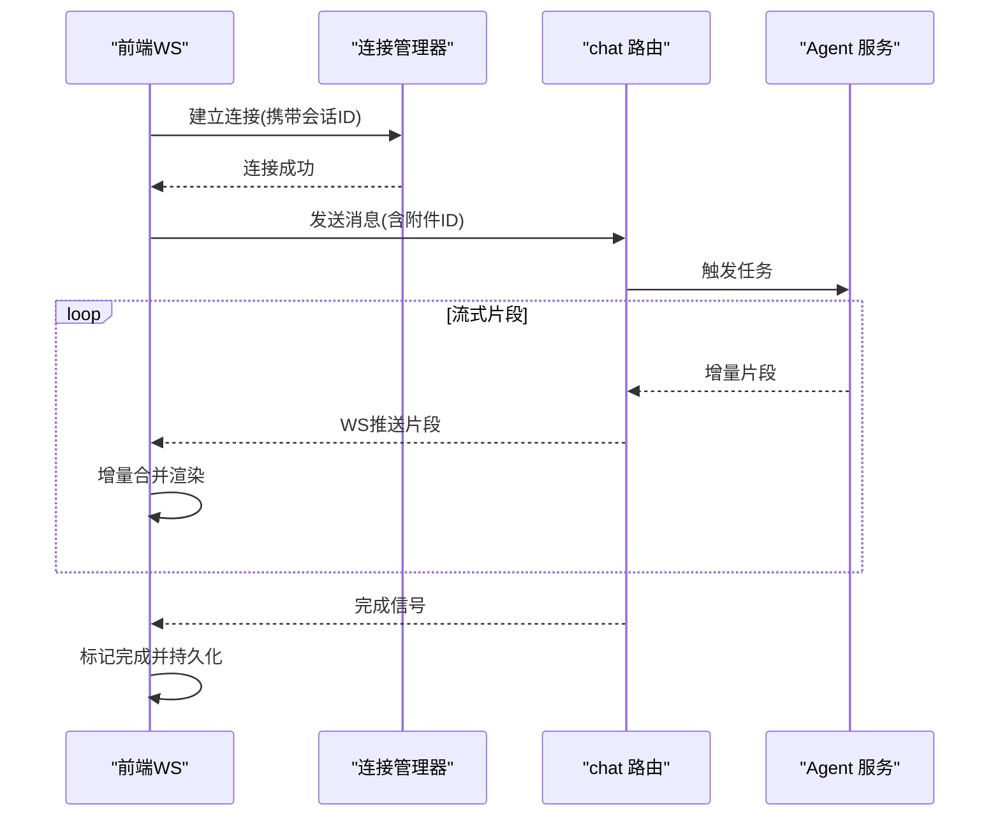
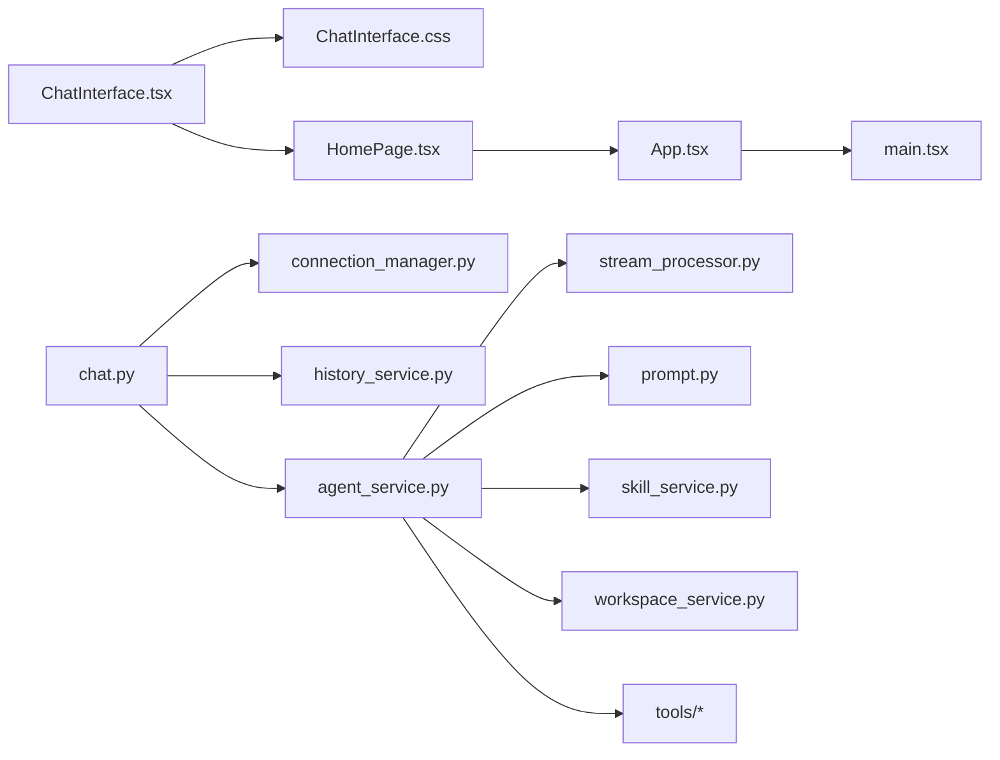

# 聊天界面组件

<cite>
**本文引用的文件**   
- [ChatInterface.tsx](file://frontend/src/components/ChatInterface.tsx)
- [ChatInterface.css](file://frontend/src/components/ChatInterface.css)
- [HomePage.tsx](file://frontend/src/components/HomePage.tsx)
- [App.tsx](file://frontend/src/App.tsx)
- [main.tsx](file://frontend/src/main.tsx)
- [chat.py](file://backend/app/routers/chat.py)
- [connection_manager.py](file://backend/app/services/connection_manager.py)
- [history_service.py](file://backend/app/services/history_service.py)
- [stream_processor.py](file://backend/app/services/stream_processor.py)
- [agent_service.py](file://backend/app/services/agent_service.py)
- [prompt.py](file://backend/app/services/prompt.py)
- [skill_service.py](file://backend/app/services/skill_service.py)
- [workspace_service.py](file://backend/app/services/workspace_service.py)
- [qwen_omni_understanding.py](file://backend/app/tools/qwen_omni_understanding.py)
- [image_generation.py](file://backend/app/tools/image_generation.py)
- [model_3d_generation.py](file://backend/app/tools/model_3d_generation.py)
- [video_concatenation.py](file://backend/app/tools/video_concatenation.py)
- [virtual_anchor_generation.py](file://backend/app/tools/virtual_anchor_generation.py)
- [volcano_image_generation.py](file://backend/app/tools/volcano_image_generation.py)
- [volcano_video_generation.py](file://backend/app/tools/volcano_video_generation.py)
- [workspace_tools.py](file://backend/app/tools/workspace_tools.py)
- [audio_mixing.py](file://backend/app/tools/audio_mixing.py)
- [settings.py](file://backend/app/routers/settings.py)
- [main.py](file://backend/app/main.py)
</cite>

## 目录
1. [简介](#简介)
2. [项目结构](#项目结构)
3. [核心组件](#核心组件)
4. [架构总览](#架构总览)
5. [详细组件分析](#详细组件分析)
6. [依赖分析](#依赖分析)
7. [性能考虑](#性能考虑)
8. [故障排查指南](#故障排查指南)
9. [结论](#结论)
10. [附录](#附录)

## 简介
本文件围绕前端 ChatInterface 聊天界面组件与后端聊天服务，系统性阐述消息渲染引擎、用户输入处理、实时通信集成（WebSocket）、消息流式传输、历史记录加载、错误重试机制，以及多类型消息（文本、图片、文件）支持、Markdown 渲染与代码高亮显示。同时提供自定义消息处理器、表情符号插入、文件上传的实现指南，并解释前后端交互模式、状态同步策略与性能优化方案。

## 项目结构
前端采用 React + TypeScript 组织，核心聊天 UI 位于 components 目录；后端基于 FastAPI，路由与服务分层清晰，工具层封装了多种生成能力。

图表来源
- [main.tsx](file://frontend/src/main.tsx)
- [App.tsx](file://frontend/src/App.tsx)
- [HomePage.tsx](file://frontend/src/components/HomePage.tsx)
- [ChatInterface.tsx](file://frontend/src/components/ChatInterface.tsx)
- [main.py](file://backend/app/main.py)
- [chat.py](file://backend/app/routers/chat.py)
- [connection_manager.py](file://backend/app/services/connection_manager.py)
- [history_service.py](file://backend/app/services/history_service.py)
- [stream_processor.py](file://backend/app/services/stream_processor.py)
- [agent_service.py](file://backend/app/services/agent_service.py)
- [prompt.py](file://backend/app/services/prompt.py)
- [skill_service.py](file://backend/app/services/skill_service.py)
- [workspace_service.py](file://backend/app/services/workspace_service.py)
- [image_generation.py](file://backend/app/tools/image_generation.py)
- [model_3d_generation.py](file://backend/app/tools/model_3d_generation.py)
- [video_concatenation.py](file://backend/app/tools/video_concatenation.py)
- [virtual_anchor_generation.py](file://backend/app/tools/virtual_anchor_generation.py)
- [volcano_image_generation.py](file://backend/app/tools/volcano_image_generation.py)
- [volcano_video_generation.py](file://backend/app/tools/volcano_video_generation.py)
- [workspace_tools.py](file://backend/app/tools/workspace_tools.py)
- [audio_mixing.py](file://backend/app/tools/audio_mixing.py)

章节来源
- [main.tsx](file://frontend/src/main.tsx)
- [App.tsx](file://frontend/src/App.tsx)
- [HomePage.tsx](file://frontend/src/components/HomePage.tsx)
- [ChatInterface.tsx](file://frontend/src/components/ChatInterface.tsx)
- [main.py](file://backend/app/main.py)
- [chat.py](file://backend/app/routers/chat.py)

## 核心组件
- ChatInterface 组件：负责消息列表渲染、输入框与发送逻辑、文件选择与预览、表情插入、滚动定位、流式增量更新、历史加载与错误提示。
- 后端 chat 路由：暴露 HTTP 接口与 WebSocket 通道，协调连接管理、历史记录、Agent 编排与流式输出。
- 连接管理器：维护会话级 WebSocket 连接池、心跳与断线重连。
- 历史服务：按会话加载历史消息，分页或时间窗口控制。
- 流处理器：将 Agent 的增量输出转换为可消费的流事件，供前端逐步渲染。
- Agent 服务：解析用户意图、调用技能与工作区工具、组装提示词并驱动模型推理。

章节来源
- [ChatInterface.tsx](file://frontend/src/components/ChatInterface.tsx)
- [chat.py](file://backend/app/routers/chat.py)
- [connection_manager.py](file://backend/app/services/connection_manager.py)
- [history_service.py](file://backend/app/services/history_service.py)
- [stream_processor.py](file://backend/app/services/stream_processor.py)
- [agent_service.py](file://backend/app/services/agent_service.py)

## 架构总览
前后端通过 REST 与 WebSocket 协同：REST 用于登录鉴权、设置、历史加载与文件上传；WebSocket 用于长连接下的流式消息推送与双向指令。

图表来源
- [chat.py](file://backend/app/routers/chat.py)
- [connection_manager.py](file://backend/app/services/connection_manager.py)
- [history_service.py](file://backend/app/services/history_service.py)
- [stream_processor.py](file://backend/app/services/stream_processor.py)
- [agent_service.py](file://backend/app/services/agent_service.py)
- [ChatInterface.tsx](file://frontend/src/components/ChatInterface.tsx)

## 详细组件分析

### ChatInterface 组件分析
职责边界
- 消息渲染引擎：统一的消息项渲染器，根据消息类型分支渲染（文本、图片、文件、系统提示），对 Markdown 内容使用安全渲染管线，代码块启用语法高亮。
- 用户输入处理：文本输入、粘贴/拖拽文件、表情面板插入、快捷键发送、防抖与去重。
- 实时通信集成：在发送后建立或复用 WebSocket 连接，订阅增量片段，合并到当前消息，完成后切换为“完成”态。
- 历史记录加载：进入会话时拉取历史并按时间顺序拼接，保持滚动位置稳定。
- 错误与重试：网络异常、服务端错误、超时等场景下给出友好提示，并提供重试按钮与指数退避。

关键实现要点
- 消息类型枚举与数据结构：定义消息 id、角色、类型、内容、附件、状态（pending/success/error/complete）。
- 渲染管线：文本走 Markdown 解析与安全过滤；图片/文件走 URL 直链或预签名链接；代码块识别语言并高亮。
- 流式合并：以 diff 方式追加增量片段，避免整段重绘；对表格/代码块做边界保护。
- 文件上传：先上传至后端获取资源地址，再作为消息附件发送；支持进度条与失败重试。
- 表情插入：从本地表情库选择，插入光标位置，支持富文本占位符。
- 状态同步：前端消息状态与后端一致化，收到完成信号后持久化并刷新历史。

图表来源
- [ChatInterface.tsx](file://frontend/src/components/ChatInterface.tsx)
- [ChatInterface.css](file://frontend/src/components/ChatInterface.css)

章节来源
- [ChatInterface.tsx](file://frontend/src/components/ChatInterface.tsx)
- [ChatInterface.css](file://frontend/src/components/ChatInterface.css)

### 后端聊天路由与服务协作
职责边界
- chat 路由：聚合 HTTP 与 WS 入口，校验请求、转发参数、管理会话上下文。
- 连接管理器：维护连接池、心跳检测、断线恢复、广播与定向推送。
- 历史服务：按会话维度读写历史，支持分页、裁剪与归档。
- 流处理器：将 Agent 的生成片段包装为标准事件，保证有序与幂等。
- Agent 服务：解析意图、组合提示词、调度技能与工作区工具、驱动模型推理。

图表来源
- [chat.py](file://backend/app/routers/chat.py)
- [connection_manager.py](file://backend/app/services/connection_manager.py)
- [history_service.py](file://backend/app/services/history_service.py)
- [stream_processor.py](file://backend/app/services/stream_processor.py)
- [agent_service.py](file://backend/app/services/agent_service.py)

章节来源
- [chat.py](file://backend/app/routers/chat.py)
- [connection_manager.py](file://backend/app/services/connection_manager.py)
- [history_service.py](file://backend/app/services/history_service.py)
- [stream_processor.py](file://backend/app/services/stream_processor.py)
- [agent_service.py](file://backend/app/services/agent_service.py)

### 消息渲染引擎
- 文本渲染：Markdown 解析、安全白名单过滤、链接新窗口打开、自动换行与溢出处理。
- 图片渲染：缩略图+懒加载、点击放大、尺寸自适应、失败占位图。
- 文件渲染：文件名、大小、类型图标、下载/预览链接、大文件分片提示。
- 代码块渲染：语言识别、行号、复制按钮、主题适配、滚动同步。
- 混合内容：段落、列表、表格、引用、数学公式（可选）的安全渲染。

图表来源
- [ChatInterface.tsx](file://frontend/src/components/ChatInterface.tsx)
- [ChatInterface.css](file://frontend/src/components/ChatInterface.css)

章节来源
- [ChatInterface.tsx](file://frontend/src/components/ChatInterface.tsx)
- [ChatInterface.css](file://frontend/src/components/ChatInterface.css)

### 用户输入处理
- 文本输入：防抖、回车发送、Shift+Enter 换行、最大长度限制。
- 文件输入：拖拽/粘贴/选择，类型与大小校验，重复检测，上传进度反馈。
- 表情插入：表情面板定位、光标位置插入、支持搜索与最近使用。
- 撤销与回滚：输入前快照，支持 Ctrl+Z 撤销。

章节来源
- [ChatInterface.tsx](file://frontend/src/components/ChatInterface.tsx)

### 实时通信集成（WebSocket）
- 连接生命周期：握手、鉴权、保活、断线重连、优雅关闭。
- 消息协议：事件类型（开始、片段、完成、错误）、会话标识、序列号、幂等合并。
- 背压与节流：前端批量合并片段，降低渲染压力；服务端限速与批大小控制。
- 错误重试：指数退避、抖动、最大重试次数、降级为轮询（可选）。

图表来源
- [connection_manager.py](file://backend/app/services/connection_manager.py)
- [chat.py](file://backend/app/routers/chat.py)
- [agent_service.py](file://backend/app/services/agent_service.py)
- [ChatInterface.tsx](file://frontend/src/components/ChatInterface.tsx)

章节来源
- [connection_manager.py](file://backend/app/services/connection_manager.py)
- [chat.py](file://backend/app/routers/chat.py)
- [agent_service.py](file://backend/app/services/agent_service.py)
- [ChatInterface.tsx](file://frontend/src/components/ChatInterface.tsx)

### 历史记录加载
- 加载时机：进入会话、首次渲染、下拉刷新。
- 分页策略：按时间倒序、页大小、游标/时间戳。
- 一致性：与最新流式消息合并，避免重复与乱序。
- 缓存：内存缓存与会话键，减少重复请求。

章节来源
- [history_service.py](file://backend/app/services/history_service.py)
- [chat.py](file://backend/app/routers/chat.py)
- [ChatInterface.tsx](file://frontend/src/components/ChatInterface.tsx)

### 错误与重试机制
- 分类：网络错误、鉴权失败、业务错误、超时、服务端异常。
- 策略：前端指数退避+抖动、最大重试次数、用户可见的错误提示与重试按钮。
- 降级：WS 不可用时回退到短轮询或一次性请求。
- 日志：关键路径埋点，便于问题定位。

章节来源
- [connection_manager.py](file://backend/app/services/connection_manager.py)
- [chat.py](file://backend/app/routers/chat.py)
- [ChatInterface.tsx](file://frontend/src/components/ChatInterface.tsx)

### 多类型消息支持与渲染
- 文本：Markdown 渲染、安全过滤、链接与锚点。
- 图片：缩略图、懒加载、点击放大、格式校验。
- 文件：名称、大小、类型、预览/下载、大文件提示。
- 代码块：语言高亮、复制、行号、主题。

章节来源
- [ChatInterface.tsx](file://frontend/src/components/ChatInterface.tsx)
- [ChatInterface.css](file://frontend/src/components/ChatInterface.css)

### 自定义消息处理器
- 扩展点：注册消息类型与渲染函数，按类型分发。
- 插件化：动态加载外部渲染器，支持沙箱隔离。
- 示例：图表、地图、富媒体卡片等。

章节来源
- [ChatInterface.tsx](file://frontend/src/components/ChatInterface.tsx)

### 表情符号插入
- 面板：分类、搜索、最近使用、键盘导航。
- 插入：在光标处插入占位符，支持富文本编辑。
- 存储：本地缓存最近使用，提升体验。

章节来源
- [ChatInterface.tsx](file://frontend/src/components/ChatInterface.tsx)

### 文件上传功能
- 流程：选择/拖拽 -> 校验 -> 上传 -> 获取资源地址 -> 作为附件发送。
- 进度：分段上传、断点续传（可选）、失败重试。
- 安全：类型白名单、大小限制、病毒扫描（可选）。

章节来源
- [ChatInterface.tsx](file://frontend/src/components/ChatInterface.tsx)
- [chat.py](file://backend/app/routers/chat.py)

### 与后端 API 的交互模式
- REST：会话初始化、历史加载、设置查询、文件上传。
- WS：流式片段推送、双向指令（如停止生成、确认操作）。
- 幂等：请求 ID、会话 ID、消息序号，确保可靠合并。

章节来源
- [chat.py](file://backend/app/routers/chat.py)
- [settings.py](file://backend/app/routers/settings.py)
- [ChatInterface.tsx](file://frontend/src/components/ChatInterface.tsx)

### 状态同步策略
- 乐观更新：发送后立即显示 pending 消息，成功后替换为完成态。
- 冲突解决：以服务端为准，按序号合并，丢弃旧片段。
- 离线缓存：暂存未发送消息，网络恢复后重放。

章节来源
- [ChatInterface.tsx](file://frontend/src/components/ChatInterface.tsx)
- [connection_manager.py](file://backend/app/services/connection_manager.py)

### 性能优化方案
- 虚拟列表：仅渲染可视区域消息，降低 DOM 压力。
- 增量渲染：流式片段最小化重排，代码块与图片懒加载。
- 压缩与缓存：静态资源缓存、图片自适应分辨率、CDN。
- 并发控制：限制并行上传与渲染任务数。

章节来源
- [ChatInterface.tsx](file://frontend/src/components/ChatInterface.tsx)
- [ChatInterface.css](file://frontend/src/components/ChatInterface.css)

## 依赖分析
前后端模块耦合关系如下：

图表来源
- [ChatInterface.tsx](file://frontend/src/components/ChatInterface.tsx)
- [ChatInterface.css](file://frontend/src/components/ChatInterface.css)
- [HomePage.tsx](file://frontend/src/components/HomePage.tsx)
- [App.tsx](file://frontend/src/App.tsx)
- [main.tsx](file://frontend/src/main.tsx)
- [chat.py](file://backend/app/routers/chat.py)
- [connection_manager.py](file://backend/app/services/connection_manager.py)
- [history_service.py](file://backend/app/services/history_service.py)
- [agent_service.py](file://backend/app/services/agent_service.py)
- [stream_processor.py](file://backend/app/services/stream_processor.py)
- [prompt.py](file://backend/app/services/prompt.py)
- [skill_service.py](file://backend/app/services/skill_service.py)
- [workspace_service.py](file://backend/app/services/workspace_service.py)
- [image_generation.py](file://backend/app/tools/image_generation.py)
- [model_3d_generation.py](file://backend/app/tools/model_3d_generation.py)
- [video_concatenation.py](file://backend/app/tools/video_concatenation.py)
- [virtual_anchor_generation.py](file://backend/app/tools/virtual_anchor_generation.py)
- [volcano_image_generation.py](file://backend/app/tools/volcano_image_generation.py)
- [volcano_video_generation.py](file://backend/app/tools/volcano_video_generation.py)
- [workspace_tools.py](file://backend/app/tools/workspace_tools.py)
- [audio_mixing.py](file://backend/app/tools/audio_mixing.py)

章节来源
- [chat.py](file://backend/app/routers/chat.py)
- [connection_manager.py](file://backend/app/services/connection_manager.py)
- [history_service.py](file://backend/app/services/history_service.py)
- [agent_service.py](file://backend/app/services/agent_service.py)
- [stream_processor.py](file://backend/app/services/stream_processor.py)
- [prompt.py](file://backend/app/services/prompt.py)
- [skill_service.py](file://backend/app/services/skill_service.py)
- [workspace_service.py](file://backend/app/services/workspace_service.py)
- [image_generation.py](file://backend/app/tools/image_generation.py)
- [model_3d_generation.py](file://backend/app/tools/model_3d_generation.py)
- [video_concatenation.py](file://backend/app/tools/video_concatenation.py)
- [virtual_anchor_generation.py](file://backend/app/tools/virtual_anchor_generation.py)
- [volcano_image_generation.py](file://backend/app/tools/volcano_image_generation.py)
- [volcano_video_generation.py](file://backend/app/tools/volcano_video_generation.py)
- [workspace_tools.py](file://backend/app/tools/workspace_tools.py)
- [audio_mixing.py](file://backend/app/tools/audio_mixing.py)

## 性能考虑
- 前端渲染：虚拟列表、增量合并、图片懒加载、代码块按需高亮。
- 网络传输：WS 批大小调优、压缩、断线快速重连。
- 后端吞吐：连接池、异步 I/O、流式缓冲、限流与熔断。
- 存储与缓存：历史分页、冷热分离、CDN 加速静态资源。

[本节为通用指导，不直接分析具体文件]

## 故障排查指南
- 连接问题：检查 WS 握手、鉴权头、跨域配置、防火墙与代理。
- 流式异常：核对事件序列号、幂等合并逻辑、前端节流策略。
- 历史不一致：比对服务端时间戳与游标，清理本地缓存并重载。
- 文件上传失败：确认类型/大小限制、临时目录权限、磁盘空间。
- 渲染错乱：检查 Markdown 安全白名单、CSS 覆盖、第三方库版本。

章节来源
- [connection_manager.py](file://backend/app/services/connection_manager.py)
- [chat.py](file://backend/app/routers/chat.py)
- [history_service.py](file://backend/app/services/history_service.py)
- [ChatInterface.tsx](file://frontend/src/components/ChatInterface.tsx)
- [ChatInterface.css](file://frontend/src/components/ChatInterface.css)

## 结论
ChatInterface 组件在后端 chat 路由、连接管理、历史与流处理的协同下，实现了高可用、可扩展的聊天体验。通过消息类型扩展、自定义渲染器、表情与文件能力，满足多样化场景。结合虚拟列表、增量渲染与稳健的重试策略，可在大规模并发与弱网环境下保持稳定表现。

[本节为总结性内容，不直接分析具体文件]

## 附录
- 相关工具与技能：图像生成、3D 模型生成、视频拼接、虚拟人播报、工作区工具、音频混音等，均可通过 Agent 服务编排接入聊天流程。

章节来源
- [agent_service.py](file://backend/app/services/agent_service.py)
- [image_generation.py](file://backend/app/tools/image_generation.py)
- [model_3d_generation.py](file://backend/app/tools/model_3d_generation.py)
- [video_concatenation.py](file://backend/app/tools/video_concatenation.py)
- [virtual_anchor_generation.py](file://backend/app/tools/virtual_anchor_generation.py)
- [volcano_image_generation.py](file://backend/app/tools/volcano_image_generation.py)
- [volcano_video_generation.py](file://backend/app/tools/volcano_video_generation.py)
- [workspace_tools.py](file://backend/app/tools/workspace_tools.py)
- [audio_mixing.py](file://backend/app/tools/audio_mixing.py)