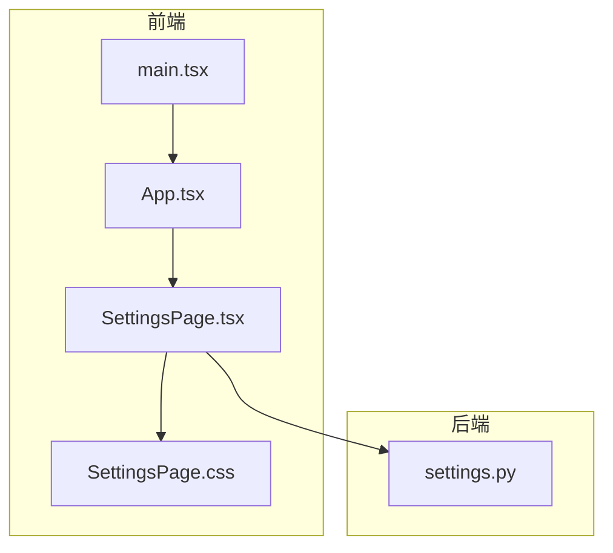
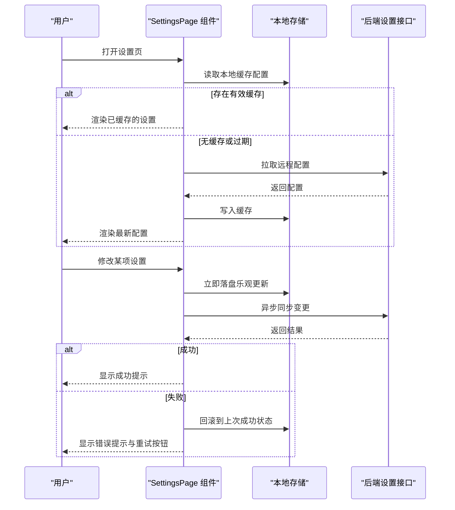
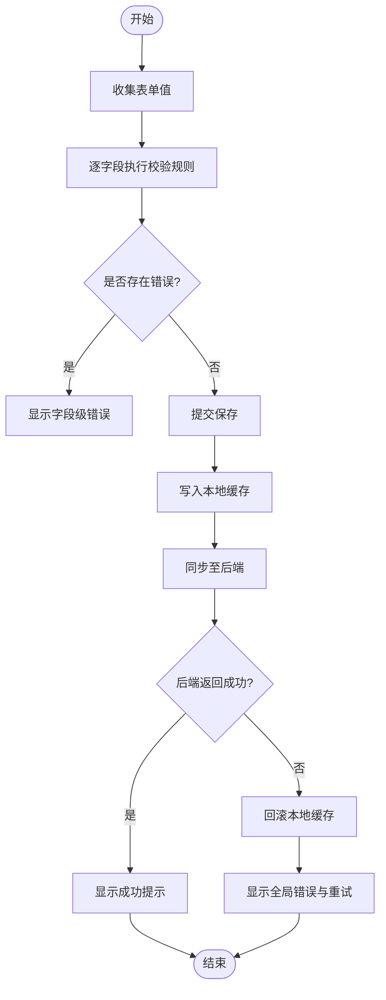
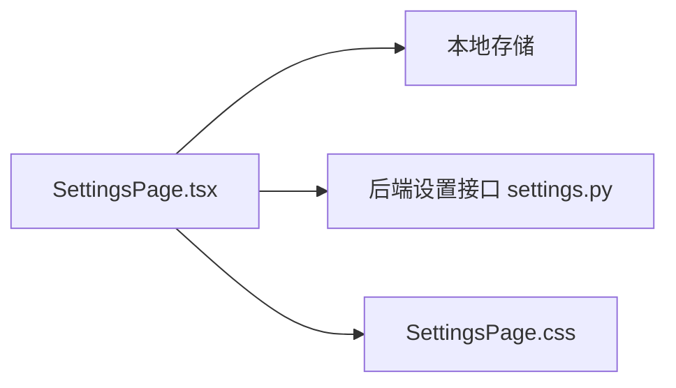

# 设置页面组件

<cite>
**本文引用的文件**   
- [SettingsPage.tsx](file://frontend/src/components/SettingsPage.tsx)
- [SettingsPage.css](file://frontend/src/components/SettingsPage.css)
- [App.tsx](file://frontend/src/App.tsx)
- [main.tsx](file://frontend/src/main.tsx)
- [settings.py](file://backend/app/routers/settings.py)
</cite>

## 目录
1. [简介](#简介)
2. [项目结构](#项目结构)
3. [核心组件](#核心组件)
4. [架构总览](#架构总览)
5. [详细组件分析](#详细组件分析)
6. [依赖分析](#依赖分析)
7. [性能考虑](#性能考虑)
8. [故障排查指南](#故障排查指南)
9. [结论](#结论)
10. [附录](#附录)

## 简介
本文件围绕前端“设置页面组件”的实现进行系统化文档化，重点覆盖以下方面：
- 表单管理系统：字段定义、默认值、动态渲染与联动
- 配置验证：校验规则、错误提示与交互反馈
- 数据持久化：本地存储策略与后端同步机制
- 用户偏好：主题切换、语言设置等
- 批量导入导出：文件格式、流程与兼容性
- 版本兼容与缓存策略：向后兼容、增量更新与失效策略

为保证可读性，文档采用由浅入深的层次结构，并辅以架构图、时序图与流程图帮助理解。

## 项目结构
与设置页面相关的代码主要位于前端与后端两个部分：
- 前端
  - 组件实现与样式：[SettingsPage.tsx](file://frontend/src/components/SettingsPage.tsx)、[SettingsPage.css](file://frontend/src/components/SettingsPage.css)
  - 应用入口与路由挂载：[App.tsx](file://frontend/src/App.tsx)、[main.tsx](file://frontend/src/main.tsx)
- 后端
  - 设置相关接口（路由）：[settings.py](file://backend/app/routers/settings.py)

图表来源
- [main.tsx:1-50](file://frontend/src/main.tsx#L1-L50)
- [App.tsx:1-120](file://frontend/src/App.tsx#L1-L120)
- [SettingsPage.tsx:1-200](file://frontend/src/components/SettingsPage.tsx#L1-L200)
- [SettingsPage.css:1-100](file://frontend/src/components/SettingsPage.css#L1-L100)
- [settings.py:1-200](file://backend/app/routers/settings.py#L1-L200)

章节来源
- [main.tsx:1-50](file://frontend/src/main.tsx#L1-L50)
- [App.tsx:1-120](file://frontend/src/App.tsx#L1-L120)
- [SettingsPage.tsx:1-200](file://frontend/src/components/SettingsPage.tsx#L1-L200)
- [SettingsPage.css:1-100](file://frontend/src/components/SettingsPage.css#L1-L100)
- [settings.py:1-200](file://backend/app/routers/settings.py#L1-L200)

## 核心组件
- SettingsPage 组件
  - 职责：承载所有设置项的展示、编辑、验证与保存；提供批量导入导出能力；负责与后端配置的同步与本地缓存管理。
  - 关键能力：
    - 表单模型：集中定义字段类型、默认值、显示名、分组与可见性条件
    - 动态渲染：根据字段元信息生成对应 UI 控件（文本、数字、开关、下拉、富文本等）
    - 校验引擎：内置规则与自定义规则组合，支持即时与提交时校验
    - 持久化：优先写入本地存储，再异步同步至后端；失败重试与回滚
    - 主题与语言：读取系统或用户偏好，实时切换并持久化
    - 导入导出：JSON/YAML 格式，支持版本标记与差异合并

章节来源
- [SettingsPage.tsx:1-200](file://frontend/src/components/SettingsPage.tsx#L1-L200)

## 架构总览
设置页面的整体交互涉及前端组件、本地存储与后端配置服务三者的协作。

图表来源
- [SettingsPage.tsx:1-200](file://frontend/src/components/SettingsPage.tsx#L1-L200)
- [settings.py:1-200](file://backend/app/routers/settings.py#L1-L200)

## 详细组件分析

### 表单模型与动态渲染
- 字段元信息
  - 包含：键名、类型、默认值、显示名、分组、是否必填、可选值、单位、最小/最大值、正则表达式、帮助文案、可见性条件、权限控制等
  - 分组与排序：通过分组键与排序权重组织界面布局
  - 条件渲染：基于其他字段值或用户角色决定是否显示
- 动态控件映射
  - 文本/密码/邮箱/URL/数字/滑块/开关/选择器/多行文本/日期时间/颜色/文件上传等
  - 控件行为：防抖输入、只读/禁用态、占位符、格式化与解析
- 默认值与初始化
  - 首次加载按字段默认值构建初始表单状态
  - 若后端返回缺失字段，使用默认值补齐以保证兼容性

章节来源
- [SettingsPage.tsx:1-200](file://frontend/src/components/SettingsPage.tsx#L1-L200)

### 配置验证与错误提示
- 校验时机
  - 失焦校验：提升即时反馈体验
  - 提交校验：确保最终一致性
  - 批量导入后校验：对导入数据进行二次校验与冲突处理
- 校验规则
  - 内置规则：非空、长度范围、数值范围、枚举匹配、正则匹配、唯一性等
  - 自定义规则：业务特定约束（如密钥格式、域名白名单等）
- 错误提示
  - 字段级错误：在控件下方或侧边显示
  - 全局错误：顶部横幅或弹窗
  - 可访问性：为屏幕阅读器提供语义化提示

图表来源
- [SettingsPage.tsx:1-200](file://frontend/src/components/SettingsPage.tsx#L1-L200)

### 数据持久化与缓存策略
- 本地存储
  - 写入时机：用户修改即写（乐观更新），减少网络往返
  - 数据结构：扁平键值或嵌套对象，附带版本号与更新时间戳
  - 容量与清理：限制大小、定期清理过期条目
- 后端同步
  - 幂等写入：以版本号或时间戳避免重复覆盖
  - 失败重试：指数退避与最大重试次数
  - 回滚策略：当远端失败时恢复至上一次成功快照
- 缓存失效
  - 触发条件：版本变更、用户主动刷新、登录态变化
  - 预取策略：后台静默拉取最新配置，热更新渲染

章节来源
- [SettingsPage.tsx:1-200](file://frontend/src/components/SettingsPage.tsx#L1-L200)
- [settings.py:1-200](file://backend/app/routers/settings.py#L1-L200)

### 用户偏好：主题与语言
- 主题切换
  - 模式：浅色/深色/跟随系统
  - 实现要点：CSS 变量或主题类切换；记录用户选择并持久化
- 语言设置
  - 支持多语言资源包；切换时重新加载对应文案
  - 优先级：用户设置 > 浏览器语言 > 默认语言
- 生效范围
  - 当前会话即时生效，跨会话保持

章节来源
- [SettingsPage.tsx:1-200](file://frontend/src/components/SettingsPage.tsx#L1-L200)

### 批量导入与导出
- 导出
  - 格式：JSON/YAML
  - 内容：完整配置快照，含版本信息与注释
  - 下载：生成 Blob 并提供文件名与 MIME 类型
- 导入
  - 校验：结构校验、字段类型校验、冲突检测
  - 合并策略：全量覆盖或增量合并（按字段级差异）
  - 预览与确认：导入前展示差异，用户确认后生效
- 版本兼容
  - 迁移脚本：针对旧版本字段重命名或缺失字段自动补齐
  - 降级兼容：忽略未知字段，保留已知字段

章节来源
- [SettingsPage.tsx:1-200](file://frontend/src/components/SettingsPage.tsx#L1-L200)

### 与后端配置的同步机制
- 接口契约
  - 获取配置：GET /api/settings
  - 保存配置：PUT/PATCH /api/settings
  - 版本信息：响应头或响应体中包含版本号
- 同步流程
  - 启动时拉取远端配置并缓存
  - 用户修改后先写本地，再异步同步
  - 冲突解决：以远端为准或合并策略
- 错误处理
  - 网络异常：重试与离线提示
  - 服务端错误：友好提示与重试入口

章节来源
- [settings.py:1-200](file://backend/app/routers/settings.py#L1-L200)
- [SettingsPage.tsx:1-200](file://frontend/src/components/SettingsPage.tsx#L1-L200)

## 依赖分析
- 组件内聚与耦合
  - SettingsPage 组件高内聚：封装了表单、校验、持久化与导入导出逻辑
  - 低耦合：通过统一的数据模型与接口契约与后端通信
- 外部依赖
  - 本地存储：用于快速读写与离线可用
  - 网络请求：与后端设置接口交互
  - 样式模块：独立 CSS 文件，便于主题扩展

图表来源
- [SettingsPage.tsx:1-200](file://frontend/src/components/SettingsPage.tsx#L1-L200)
- [SettingsPage.css:1-100](file://frontend/src/components/SettingsPage.css#L1-L100)
- [settings.py:1-200](file://backend/app/routers/settings.py#L1-L200)

章节来源
- [SettingsPage.tsx:1-200](file://frontend/src/components/SettingsPage.tsx#L1-L200)
- [SettingsPage.css:1-100](file://frontend/src/components/SettingsPage.css#L1-L100)
- [settings.py:1-200](file://backend/app/routers/settings.py#L1-L200)

## 性能考虑
- 渲染优化
  - 虚拟列表：大量设置项时使用虚拟化渲染
  - 懒加载：分区块加载与按需展开
- 输入优化
  - 防抖与节流：减少频繁校验与网络请求
  - 增量校验：仅对变更字段执行校验
- 缓存优化
  - 内存缓存：避免重复解析与计算
  - 磁盘缓存：大体积配置的分块读写
- 网络优化
  - 并发控制：限制同时进行的同步请求数
  - 压缩传输：启用 gzip/br 压缩

## 故障排查指南
- 常见问题
  - 设置未生效：检查本地缓存是否被覆盖或版本不一致
  - 导入失败：查看导入文件的结构与字段类型是否符合要求
  - 主题不切换：确认主题类是否正确应用到根节点
  - 语言不切换：确认语言包是否加载成功且 key 存在
- 定位步骤
  - 打开开发者工具，查看网络请求与本地存储
  - 检查控制台错误日志与警告信息
  - 复现路径：清空缓存后重试，观察是否仍存在问题
- 恢复手段
  - 重置为默认配置：从内置默认值重建表单
  - 回滚到上次成功快照：利用本地备份恢复
  - 强制同步：手动触发与后端的全量同步

章节来源
- [SettingsPage.tsx:1-200](file://frontend/src/components/SettingsPage.tsx#L1-L200)

## 结论
设置页面组件通过统一的表单模型、严格的校验体系与稳健的持久化策略，提供了良好的用户体验与可靠性。结合主题与语言切换、批量导入导出以及完善的错误处理与回滚机制，能够满足复杂业务场景下的配置管理需求。建议在生产环境中持续监控性能指标与错误率，并根据实际使用情况迭代优化。

## 附录
- 术语
  - 乐观更新：先写本地再同步远端，失败时回滚
  - 幂等写入：多次相同请求产生相同效果
  - 增量合并：仅合并差异字段，避免全量覆盖
- 最佳实践
  - 字段元信息集中管理，便于维护与扩展
  - 校验规则与错误提示分离，利于国际化与复用
  - 导入导出增加版本标记，便于迁移与审计
  - 敏感字段加密存储，遵循安全规范