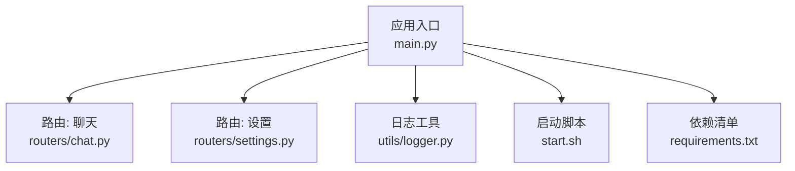
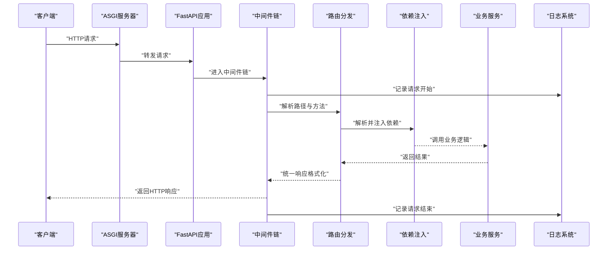
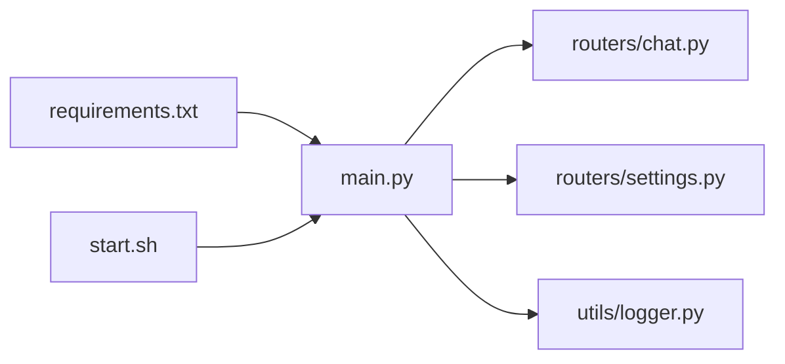

# FastAPI应用核心

<cite>
**本文引用的文件**   
- [backend/app/main.py](file://backend/app/main.py)
- [backend/app/routers/chat.py](file://backend/app/routers/chat.py)
- [backend/app/routers/settings.py](file://backend/app/routers/settings.py)
- [backend/app/utils/logger.py](file://backend/app/utils/logger.py)
- [backend/requirements.txt](file://backend/requirements.txt)
- [backend/start.sh](file://backend/start.sh)
</cite>

## 目录
1. [简介](#简介)
2. [项目结构](#项目结构)
3. [核心组件](#核心组件)
4. [架构总览](#架构总览)
5. [详细组件分析](#详细组件分析)
6. [依赖分析](#依赖分析)
7. [性能考虑](#性能考虑)
8. [故障排查指南](#故障排查指南)
9. [结论](#结论)
10. [附录](#附录)

## 简介
本文件聚焦于后端FastAPI应用的核心实现，围绕应用启动流程、中间件配置、路由注册机制展开，并系统说明错误处理策略、日志记录系统、配置管理方案。同时涵盖CORS设置、请求验证、响应格式化等关键能力，以及应用生命周期管理、依赖注入模式的使用示例与扩展建议。文档旨在帮助开发者快速理解应用架构并安全地扩展功能。

## 项目结构
后端采用按职责分层的组织方式：
- 应用入口与生命周期：位于应用主模块，负责创建FastAPI实例、挂载中间件、注册路由、配置CORS、定义健康检查端点、启动服务。
- 路由层：按业务域划分，如聊天与设置。
- 工具与基础设施：包含日志、通用工具等。
- 运行脚本与依赖：提供启动脚本与依赖清单。

图表来源
- [backend/app/main.py](file://backend/app/main.py)
- [backend/app/routers/chat.py](file://backend/app/routers/chat.py)
- [backend/app/routers/settings.py](file://backend/app/routers/settings.py)
- [backend/app/utils/logger.py](file://backend/app/utils/logger.py)
- [backend/start.sh](file://backend/start.sh)
- [backend/requirements.txt](file://backend/requirements.txt)

章节来源
- [backend/app/main.py](file://backend/app/main.py)
- [backend/app/routers/chat.py](file://backend/app/routers/chat.py)
- [backend/app/routers/settings.py](file://backend/app/routers/settings.py)
- [backend/app/utils/logger.py](file://backend/app/utils/logger.py)
- [backend/start.sh](file://backend/start.sh)
- [backend/requirements.txt](file://backend/requirements.txt)

## 核心组件
- 应用实例与生命周期钩子
  - 在应用入口处创建FastAPI实例，并通过生命周期事件（启动/关闭）完成资源初始化与清理。
  - 典型场景包括：加载配置、初始化外部客户端、预热缓存、建立连接池、注册信号处理器等。
- 中间件与全局处理
  - 通过中间件统一处理跨域、请求日志、异常捕获、请求ID注入、限流等横切关注点。
- 路由与依赖注入
  - 使用FastAPI的依赖注入机制声明式注入服务、配置、数据库连接等。
  - 路由按领域拆分，便于维护与测试。
- 错误处理与响应格式化
  - 自定义异常处理器将内部异常转换为一致的JSON响应格式。
  - 统一成功/失败响应体结构，便于前端消费。
- CORS与安全
  - 集中配置允许的源、方法、头部与凭据策略。
- 健康检查与监控
  - 暴露健康检查端点，返回服务状态、依赖项可用性与版本信息。
- 日志系统
  - 基于结构化日志库输出带上下文信息的日志，支持分级与采样。

章节来源
- [backend/app/main.py](file://backend/app/main.py)
- [backend/app/routers/chat.py](file://backend/app/routers/chat.py)
- [backend/app/routers/settings.py](file://backend/app/routers/settings.py)
- [backend/app/utils/logger.py](file://backend/app/utils/logger.py)

## 架构总览
下图展示了从客户端到后端核心组件的请求路径与关键处理阶段。

图表来源
- [backend/app/main.py](file://backend/app/main.py)
- [backend/app/routers/chat.py](file://backend/app/routers/chat.py)
- [backend/app/routers/settings.py](file://backend/app/routers/settings.py)
- [backend/app/utils/logger.py](file://backend/app/utils/logger.py)

## 详细组件分析

### 应用入口与生命周期管理
- 应用实例化
  - 创建FastAPI实例，设置应用元数据（名称、版本、描述）。
  - 挂载全局中间件（CORS、请求日志、异常处理等）。
  - 注册路由蓝图或APIRouter。
- 生命周期钩子
  - on_event("startup"): 初始化配置、外部客户端、连接池、定时任务等。
  - on_event("shutdown"): 释放资源、关闭连接、停止任务。
- 健康检查端点
  - 提供GET /health或类似端点，聚合各子系统可用性，返回状态码与详情。
- 启动命令
  - 通过启动脚本或命令行参数指定主机、端口、工作进程数、日志级别等。

章节来源
- [backend/app/main.py](file://backend/app/main.py)
- [backend/start.sh](file://backend/start.sh)

### 中间件配置与请求处理链
- CORS中间件
  - 配置允许的来源、方法、头部、是否允许携带凭据。
  - 针对预检请求进行优化，减少重复校验开销。
- 请求日志中间件
  - 为每个请求生成唯一ID，记录入参摘要、耗时、状态码与异常堆栈。
- 异常处理中间件
  - 捕获未处理异常，转换为标准错误响应，避免泄露敏感信息。
- 请求验证与响应格式化
  - 结合Pydantic模型对请求体、查询参数、路径参数进行强类型校验。
  - 统一响应包装器，确保前端一致的消费体验。

章节来源
- [backend/app/main.py](file://backend/app/main.py)
- [backend/app/utils/logger.py](file://backend/app/utils/logger.py)

### 路由注册机制与依赖注入
- 路由组织
  - 使用APIRouter按模块拆分路由，便于独立测试与维护。
  - 在应用入口集中挂载所有路由前缀。
- 依赖注入
  - 通过Depends声明式注入配置对象、数据库会话、第三方客户端等。
  - 支持一次性依赖（应用级单例）与请求级依赖（每请求新建）。
- 示例：聊天路由
  - 定义聊天相关接口，使用依赖注入获取LLM客户端、历史记录服务等。
- 示例：设置路由
  - 定义系统设置读取/更新接口，结合权限校验与缓存刷新。

章节来源
- [backend/app/routers/chat.py](file://backend/app/routers/chat.py)
- [backend/app/routers/settings.py](file://backend/app/routers/settings.py)
- [backend/app/main.py](file://backend/app/main.py)

### 错误处理策略
- 统一异常类
  - 定义业务异常基类与具体异常子类，携带错误码与消息。
- 异常处理器
  - 注册全局异常处理器，将异常映射为标准JSON响应。
  - 区分可恢复与不可恢复错误，决定HTTP状态码与是否重试。
- 输入校验错误
  - 利用Pydantic自动生成的校验错误，统一包装为友好提示。
- 日志与追踪
  - 在异常路径中记录必要上下文，便于定位问题。

章节来源
- [backend/app/main.py](file://backend/app/main.py)
- [backend/app/utils/logger.py](file://backend/app/utils/logger.py)

### 日志记录系统
- 结构化日志
  - 使用结构化字段（请求ID、用户ID、操作名、耗时）提升可观测性。
- 分级与采样
  - 根据环境切换日志级别；对高频日志进行采样以降低开销。
- 输出目标
  - 控制台与文件双写；生产环境对接日志收集平台。
- 上下文传播
  - 在异步链路中传递请求上下文，保证日志关联。

章节来源
- [backend/app/utils/logger.py](file://backend/app/utils/logger.py)
- [backend/app/main.py](file://backend/app/main.py)

### 配置管理方案
- 环境变量与默认值
  - 通过环境变量覆盖默认配置，支持开发/测试/生产多环境。
- 配置对象
  - 使用Pydantic Settings模型集中管理配置，提供类型校验与默认值。
- 动态刷新
  - 对于热更配置，提供重载机制或在重启时生效的策略。
- 安全敏感项
  - 密钥与令牌不写入代码仓库，仅通过环境变量注入。

章节来源
- [backend/app/main.py](file://backend/app/main.py)

### CORS设置
- 白名单来源
  - 明确列出允许的域名，避免使用通配符在生产环境。
- 方法与头部
  - 仅开放必要的HTTP方法与请求头。
- 凭据策略
  - 谨慎开启凭据支持，配合严格的来源白名单。
- 预检缓存
  - 合理设置预检请求缓存时间，降低浏览器预检频率。

章节来源
- [backend/app/main.py](file://backend/app/main.py)

### 请求验证与响应格式化
- 请求验证
  - 使用Pydantic模型对请求体、查询参数、路径参数进行强类型校验。
  - 对枚举、范围、正则表达式等进行约束。
- 响应格式化
  - 统一响应体结构，包含状态码、数据与消息字段。
  - 对分页、列表、文件下载等特殊响应做适配。

章节来源
- [backend/app/routers/chat.py](file://backend/app/routers/chat.py)
- [backend/app/routers/settings.py](file://backend/app/routers/settings.py)
- [backend/app/main.py](file://backend/app/main.py)

### 健康检查与监控
- 健康检查端点
  - 聚合数据库、缓存、外部服务的连通性检测。
  - 返回整体健康状态与分项指标。
- 就绪与存活探针
  - 区分存活（进程是否存活）与就绪（依赖是否就绪），用于编排系统。
- 指标采集
  - 暴露Prometheus指标或OpenTelemetry集成点，便于监控告警。

章节来源
- [backend/app/main.py](file://backend/app/main.py)

### 应用生命周期与依赖注入示例
- 启动阶段
  - 加载配置、初始化日志、创建外部客户端、预热缓存。
- 关闭阶段
  - 关闭连接、保存状态、优雅退出。
- 依赖注入示例
  - 应用级单例：配置对象、连接池、缓存客户端。
  - 请求级依赖：数据库会话、请求上下文、限流令牌桶。

章节来源
- [backend/app/main.py](file://backend/app/main.py)
- [backend/app/routers/chat.py](file://backend/app/routers/chat.py)
- [backend/app/routers/settings.py](file://backend/app/routers/settings.py)

## 依赖分析
- 运行时依赖
  - FastAPI、Uvicorn、Pydantic、结构化日志库、可选的监控与追踪SDK。
- 构建与运行
  - 通过requirements.txt锁定版本；使用启动脚本拉起服务。
- 耦合关系
  - 应用入口依赖路由、中间件、日志与配置；路由依赖服务与依赖注入。

图表来源
- [backend/requirements.txt](file://backend/requirements.txt)
- [backend/start.sh](file://backend/start.sh)
- [backend/app/main.py](file://backend/app/main.py)
- [backend/app/routers/chat.py](file://backend/app/routers/chat.py)
- [backend/app/routers/settings.py](file://backend/app/routers/settings.py)
- [backend/app/utils/logger.py](file://backend/app/utils/logger.py)

章节来源
- [backend/requirements.txt](file://backend/requirements.txt)
- [backend/start.sh](file://backend/start.sh)
- [backend/app/main.py](file://backend/app/main.py)

## 性能考虑
- 并发与线程
  - 使用异步I/O与协程，避免阻塞调用；必要时使用线程池执行CPU密集任务。
- 连接池与缓存
  - 复用数据库与外部服务连接；引入本地或分布式缓存减少重复计算。
- 日志与监控开销
  - 生产环境降低日志级别并对高频日志采样；指标采集异步上报。
- 资源限制
  - 合理设置工作进程数与内存上限；启用Gzip压缩与静态资源缓存。
- 超时与重试
  - 对外部依赖设置超时与退避重试，防止雪崩。

[本节为通用指导，不涉及具体文件分析]

## 故障排查指南
- 常见问题
  - 启动失败：检查环境变量与配置文件、端口占用、依赖安装。
  - 健康检查失败：逐项检查数据库、缓存、外部服务连通性。
  - CORS报错：核对允许的源、方法与头部，确认预检请求是否被放行。
  - 请求校验失败：查看Pydantic校验错误详情，修正请求参数。
- 日志定位
  - 通过请求ID串联日志，定位慢请求与异常路径。
  - 开启调试日志仅在开发环境使用。
- 指标与追踪
  - 结合APM与日志平台，分析热点接口与瓶颈。

章节来源
- [backend/app/main.py](file://backend/app/main.py)
- [backend/app/utils/logger.py](file://backend/app/utils/logger.py)

## 结论
本FastAPI应用以清晰的入口与生命周期管理为核心，结合中间件、路由与依赖注入形成高内聚低耦合的架构。统一的错误处理、日志与配置管理提升了可维护性与可观测性。通过健康检查与监控能力，保障服务稳定性。遵循本文档的扩展建议，可在保持架构一致性的前提下快速新增功能。

[本节为总结性内容，不涉及具体文件分析]

## 附录
- 启动与部署
  - 使用启动脚本指定主机、端口与工作进程数。
  - 通过环境变量注入敏感配置。
- 扩展建议
  - 新增路由：在对应路由文件中定义接口，并在应用入口挂载。
  - 新增依赖：通过Depends注入，优先使用应用级单例以减少开销。
  - 新增中间件：在应用入口注册，注意顺序与性能影响。

章节来源
- [backend/start.sh](file://backend/start.sh)
- [backend/app/main.py](file://backend/app/main.py)