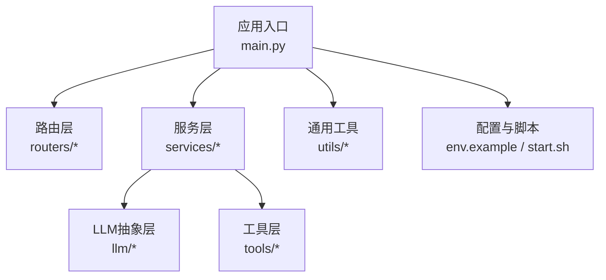
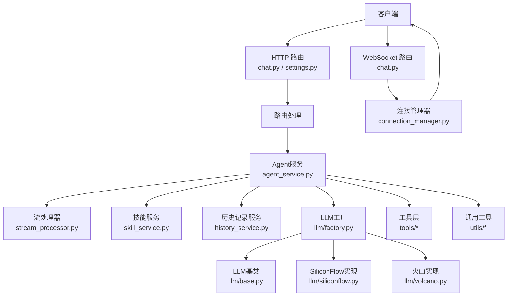
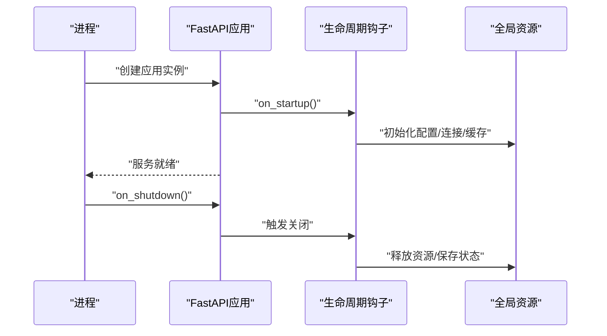
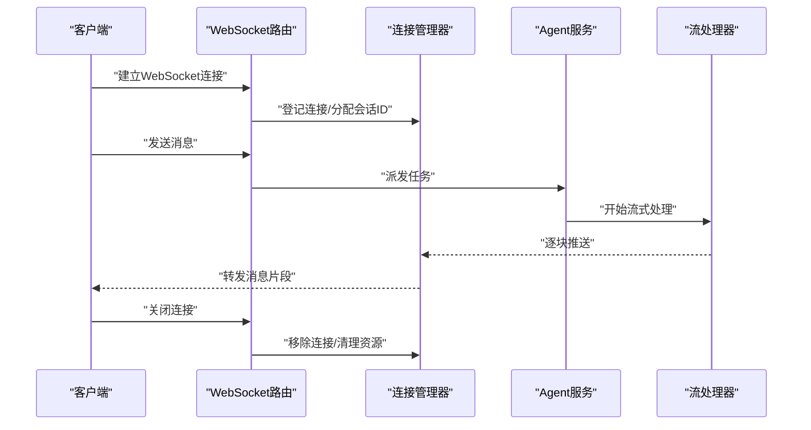
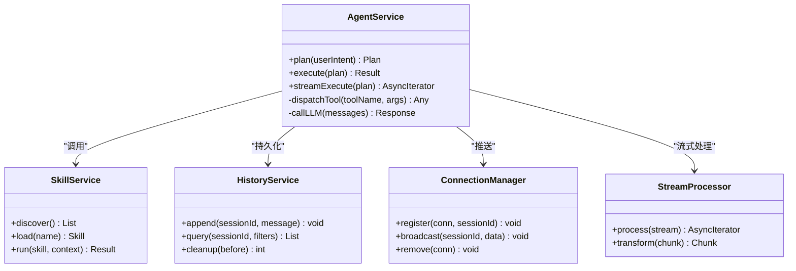
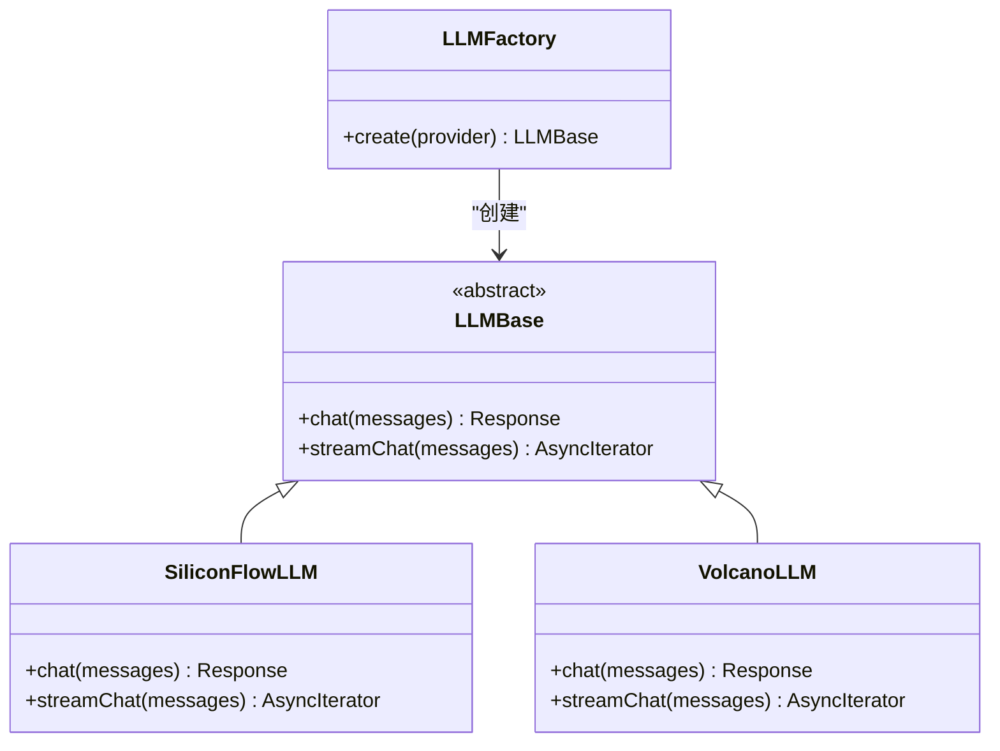
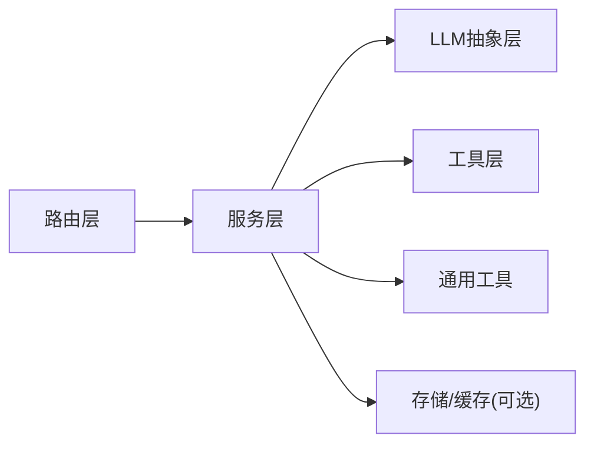

# 后端服务架构

<cite>
**本文引用的文件**   
- [backend/app/main.py](file://backend/app/main.py)
- [backend/app/routers/chat.py](file://backend/app/routers/chat.py)
- [backend/app/routers/settings.py](file://backend/app/routers/settings.py)
- [backend/app/services/agent_service.py](file://backend/app/services/agent_service.py)
- [backend/app/services/connection_manager.py](file://backend/app/services/connection_manager.py)
- [backend/app/services/history_service.py](file://backend/app/services/history_service.py)
- [backend/app/services/skill_service.py](file://backend/app/services/skill_service.py)
- [backend/app/services/stream_processor.py](file://backend/app/services/stream_processor.py)
- [backend/app/services/workspace_service.py](file://backend/app/services/workspace_service.py)
- [backend/app/tools/skill_tools.py](file://backend/app/tools/skill_tools.py)
- [backend/app/llm/base.py](file://backend/app/llm/base.py)
- [backend/app/llm/factory.py](file://backend/app/llm/factory.py)
- [backend/app/llm/siliconflow.py](file://backend/app/llm/siliconflow.py)
- [backend/app/llm/volcano.py](file://backend/app/llm/volcano.py)
- [backend/app/utils/logger.py](file://backend/app/utils/logger.py)
- [backend/start.sh](file://backend/start.sh)
- [backend/env.example](file://backend/env.example)
</cite>

## 目录
1. [简介](#简介)
2. [项目结构](#项目结构)
3. [核心组件](#核心组件)
4. [架构总览](#架构总览)
5. [详细组件分析](#详细组件分析)
6. [依赖关系分析](#依赖关系分析)
7. [性能考虑](#性能考虑)
8. [故障排查指南](#故障排查指南)
9. [结论](#结论)
10. [附录](#附录)

## 简介
本文件面向PolyStudio后端服务的架构设计与实现，聚焦于基于FastAPI的服务设计、应用启动流程、中间件机制、错误处理策略；深入解析Agent服务、连接管理器、历史记录服务等关键组件的设计模式与职责边界；阐述RESTful API设计原则、WebSocket实时通信实现、异步处理机制；并给出服务间通信模式、依赖注入、配置管理、性能优化建议、安全最佳实践与监控方案。文档既适合快速理解整体架构，也可为具体开发提供参考。

## 项目结构
后端采用分层与按功能域组织相结合的结构：
- 入口与路由层：main.py负责应用初始化、生命周期钩子、挂载路由与中间件；routers定义HTTP接口。
- 服务层：services封装业务逻辑，包括Agent编排、连接管理、历史持久化、工作区与技能管理等。
- LLM抽象层：llm提供统一LLM接入抽象与工厂，屏蔽不同供应商差异。
- 工具层：tools提供可复用的能力（如音视频处理、图像生成、模型生成等）。
- 通用工具：utils包含日志、人脸检测等基础能力。
- 配置与脚本：env.example提供环境变量模板，start.sh用于启动。

图表来源
- [backend/app/main.py](file://backend/app/main.py)
- [backend/app/routers/chat.py](file://backend/app/routers/chat.py)
- [backend/app/routers/settings.py](file://backend/app/routers/settings.py)
- [backend/app/services/agent_service.py](file://backend/app/services/agent_service.py)
- [backend/app/services/connection_manager.py](file://backend/app/services/connection_manager.py)
- [backend/app/services/history_service.py](file://backend/app/services/history_service.py)
- [backend/app/llm/base.py](file://backend/app/llm/base.py)
- [backend/app/llm/factory.py](file://backend/app/llm/factory.py)
- [backend/app/utils/logger.py](file://backend/app/utils/logger.py)
- [backend/start.sh](file://backend/start.sh)
- [backend/env.example](file://backend/env.example)

章节来源
- [backend/app/main.py](file://backend/app/main.py)
- [backend/app/routers/chat.py](file://backend/app/routers/chat.py)
- [backend/app/routers/settings.py](file://backend/app/routers/settings.py)
- [backend/app/services/agent_service.py](file://backend/app/services/agent_service.py)
- [backend/app/services/connection_manager.py](file://backend/app/services/connection_manager.py)
- [backend/app/services/history_service.py](file://backend/app/services/history_service.py)
- [backend/app/services/skill_service.py](file://backend/app/services/skill_service.py)
- [backend/app/services/stream_processor.py](file://backend/app/services/stream_processor.py)
- [backend/app/services/workspace_service.py](file://backend/app/services/workspace_service.py)
- [backend/app/tools/skill_tools.py](file://backend/app/tools/skill_tools.py)
- [backend/app/llm/base.py](file://backend/app/llm/base.py)
- [backend/app/llm/factory.py](file://backend/app/llm/factory.py)
- [backend/app/llm/siliconflow.py](file://backend/app/llm/siliconflow.py)
- [backend/app/llm/volcano.py](file://backend/app/llm/volcano.py)
- [backend/app/utils/logger.py](file://backend/app/utils/logger.py)
- [backend/start.sh](file://backend/start.sh)
- [backend/env.example](file://backend/env.example)

## 核心组件
- 应用入口与生命周期
  - 负责创建FastAPI实例、注册路由、挂载中间件、配置CORS与安全头、初始化全局状态与资源、优雅关闭。
  - 通过事件钩子在启动时加载配置、预热资源；在关闭时释放资源、保存状态。
- 路由层
  - REST接口：聊天会话、设置管理等。
  - WebSocket接口：实时消息通道，配合连接管理器维护客户端连接集合。
- 服务层
  - Agent服务：编排多步任务、调用LLM与工具、流式输出。
  - 连接管理器：维护WebSocket连接、广播消息、心跳与断线重连。
  - 历史记录服务：会话与消息的持久化、检索与清理。
  - 工作区服务：用户上下文、记忆与身份管理。
  - 技能服务：技能发现、加载与执行。
  - 流处理器：对LLM或外部工具的流式响应进行分块处理与转发。
- LLM抽象层
  - 基类定义统一的对话/补全接口与流式协议。
  - 工厂根据配置选择具体实现（如SiliconFlow、火山引擎）。
- 工具层
  - 将复杂能力封装为可被Agent调用的工具函数，支持同步与异步。
- 通用工具
  - 日志器：结构化日志、分级输出、采样与轮转。

章节来源
- [backend/app/main.py](file://backend/app/main.py)
- [backend/app/routers/chat.py](file://backend/app/routers/chat.py)
- [backend/app/routers/settings.py](file://backend/app/routers/settings.py)
- [backend/app/services/agent_service.py](file://backend/app/services/agent_service.py)
- [backend/app/services/connection_manager.py](file://backend/app/services/connection_manager.py)
- [backend/app/services/history_service.py](file://backend/app/services/history_service.py)
- [backend/app/services/skill_service.py](file://backend/app/services/skill_service.py)
- [backend/app/services/stream_processor.py](file://backend/app/services/stream_processor.py)
- [backend/app/services/workspace_service.py](file://backend/app/services/workspace_service.py)
- [backend/app/llm/base.py](file://backend/app/llm/base.py)
- [backend/app/llm/factory.py](file://backend/app/llm/factory.py)
- [backend/app/llm/siliconflow.py](file://backend/app/llm/siliconflow.py)
- [backend/app/llm/volcano.py](file://backend/app/llm/volcano.py)
- [backend/app/tools/skill_tools.py](file://backend/app/tools/skill_tools.py)
- [backend/app/utils/logger.py](file://backend/app/utils/logger.py)

## 架构总览
下图展示从请求进入至返回的整体路径，涵盖REST与WebSocket两种交互方式，以及服务层与LLM抽象层的协作。

图表来源
- [backend/app/routers/chat.py](file://backend/app/routers/chat.py)
- [backend/app/services/connection_manager.py](file://backend/app/services/connection_manager.py)
- [backend/app/services/agent_service.py](file://backend/app/services/agent_service.py)
- [backend/app/services/stream_processor.py](file://backend/app/services/stream_processor.py)
- [backend/app/services/skill_service.py](file://backend/app/services/skill_service.py)
- [backend/app/services/history_service.py](file://backend/app/services/history_service.py)
- [backend/app/llm/factory.py](file://backend/app/llm/factory.py)
- [backend/app/llm/base.py](file://backend/app/llm/base.py)
- [backend/app/llm/siliconflow.py](file://backend/app/llm/siliconflow.py)
- [backend/app/llm/volcano.py](file://backend/app/llm/volcano.py)
- [backend/app/tools/skill_tools.py](file://backend/app/tools/skill_tools.py)
- [backend/app/utils/logger.py](file://backend/app/utils/logger.py)

## 详细组件分析

### 应用启动与生命周期
- 启动阶段
  - 构建FastAPI实例，注册路由与中间件。
  - 读取环境变量与配置文件，初始化日志器、连接池、缓存等全局资源。
  - 预热必要的模型或索引，确保首请求延迟可控。
- 运行阶段
  - 路由分发到对应处理函数，服务层执行业务逻辑。
  - 使用依赖注入获取服务实例，避免全局状态耦合。
- 关闭阶段
  - 停止接收新请求，等待正在处理的请求完成。
  - 释放数据库连接、关闭WebSocket连接、刷新持久化数据。

图表来源
- [backend/app/main.py](file://backend/app/main.py)
- [backend/start.sh](file://backend/start.sh)
- [backend/env.example](file://backend/env.example)

章节来源
- [backend/app/main.py](file://backend/app/main.py)
- [backend/start.sh](file://backend/start.sh)
- [backend/env.example](file://backend/env.example)

### 中间件与安全
- 中间件职责
  - 请求/响应日志、耗时统计、异常捕获与上报。
  - CORS跨域、安全头注入、速率限制、鉴权校验。
- 安全最佳实践
  - 最小权限原则、输入校验与白名单、敏感信息不落盘。
  - 使用HTTPS、严格CORS策略、令牌轮换与过期控制。

章节来源
- [backend/app/main.py](file://backend/app/main.py)
- [backend/app/utils/logger.py](file://backend/app/utils/logger.py)

### 错误处理策略
- 统一异常类型与错误码映射，保证前端一致的错误提示。
- 在中间件层捕获未处理异常，记录堆栈与上下文，返回标准化错误体。
- 针对第三方服务失败，实现重试与熔断降级策略。

章节来源
- [backend/app/main.py](file://backend/app/main.py)
- [backend/app/utils/logger.py](file://backend/app/utils/logger.py)

### RESTful API设计原则
- 资源命名采用名词复数，动词由HTTP方法表达。
- 状态码语义清晰，错误响应包含code、message、trace_id。
- 分页、过滤、排序参数标准化，查询幂等性保障。
- 版本化策略：URL前缀或Header控制API版本。

章节来源
- [backend/app/routers/chat.py](file://backend/app/routers/chat.py)
- [backend/app/routers/settings.py](file://backend/app/routers/settings.py)

### WebSocket实时通信
- 连接建立后，将连接对象登记到连接管理器，分配会话标识。
- 服务端推送消息采用分块流式传输，客户端按需消费。
- 心跳保活与断线重连，异常断开时清理资源并通知相关订阅者。

图表来源
- [backend/app/routers/chat.py](file://backend/app/routers/chat.py)
- [backend/app/services/connection_manager.py](file://backend/app/services/connection_manager.py)
- [backend/app/services/agent_service.py](file://backend/app/services/agent_service.py)
- [backend/app/services/stream_processor.py](file://backend/app/services/stream_processor.py)

章节来源
- [backend/app/routers/chat.py](file://backend/app/routers/chat.py)
- [backend/app/services/connection_manager.py](file://backend/app/services/connection_manager.py)
- [backend/app/services/agent_service.py](file://backend/app/services/agent_service.py)
- [backend/app/services/stream_processor.py](file://backend/app/services/stream_processor.py)

### 异步处理机制
- 使用异步I/O提升并发吞吐，避免阻塞型操作。
- 对外部网络调用采用异步客户端，合理设置超时与重试。
- 对CPU密集型任务进行线程池隔离，防止阻塞事件循环。

章节来源
- [backend/app/services/agent_service.py](file://backend/app/services/agent_service.py)
- [backend/app/services/stream_processor.py](file://backend/app/services/stream_processor.py)

### 服务间通信模式
- 内部调用：同进程内函数调用，通过依赖注入获取服务实例。
- 外部服务：HTTP/gRPC调用，结合熔断与重试策略。
- 事件驱动：可选的消息队列解耦长尾任务（如批量生成）。

章节来源
- [backend/app/services/agent_service.py](file://backend/app/services/agent_service.py)
- [backend/app/services/skill_service.py](file://backend/app/services/skill_service.py)

### 依赖注入
- 在服务构造中声明依赖，由容器在运行时注入。
- 单例与有界作用域结合，避免重复创建昂贵资源。
- 测试友好：可通过替换依赖进行单元测试与集成测试。

章节来源
- [backend/app/services/agent_service.py](file://backend/app/services/agent_service.py)
- [backend/app/services/connection_manager.py](file://backend/app/services/connection_manager.py)
- [backend/app/services/history_service.py](file://backend/app/services/history_service.py)

### 配置管理
- 环境变量优先，配置文件兜底，支持热重载。
- 敏感配置通过密钥管理服务注入，不在代码中硬编码。
- 配置项分类：通用、LLM、存储、工具、监控等。

章节来源
- [backend/env.example](file://backend/env.example)
- [backend/app/main.py](file://backend/app/main.py)

### Agent服务
- 职责：解析用户意图、规划步骤、调度工具与LLM、聚合结果。
- 设计模式：命令模式（工具）、策略模式（LLM实现）、观察者（流式输出）。
- 错误处理：局部失败不影响整体，具备回退与补偿。

图表来源
- [backend/app/services/agent_service.py](file://backend/app/services/agent_service.py)
- [backend/app/services/skill_service.py](file://backend/app/services/skill_service.py)
- [backend/app/services/history_service.py](file://backend/app/services/history_service.py)
- [backend/app/services/connection_manager.py](file://backend/app/services/connection_manager.py)
- [backend/app/services/stream_processor.py](file://backend/app/services/stream_processor.py)

章节来源
- [backend/app/services/agent_service.py](file://backend/app/services/agent_service.py)
- [backend/app/services/skill_service.py](file://backend/app/services/skill_service.py)
- [backend/app/services/history_service.py](file://backend/app/services/history_service.py)
- [backend/app/services/connection_manager.py](file://backend/app/services/connection_manager.py)
- [backend/app/services/stream_processor.py](file://backend/app/services/stream_processor.py)

### 连接管理器
- 职责：维护连接集合、会话路由、广播与限流。
- 特性：心跳检测、断线清理、背压控制。
- 并发安全：读写锁保护共享状态，避免竞态条件。

章节来源
- [backend/app/services/connection_manager.py](file://backend/app/services/connection_manager.py)

### 历史记录服务
- 职责：会话与消息的增删改查、归档与清理。
- 存储：支持内存与持久化后端切换，便于开发与生产环境差异。
- 一致性：写入落盘后再返回成功，必要时异步合并。

章节来源
- [backend/app/services/history_service.py](file://backend/app/services/history_service.py)

### 工作区服务
- 职责：用户上下文、记忆、身份与偏好管理。
- 扩展点：插件化记忆存储、个性化Prompt模板。

章节来源
- [backend/app/services/workspace_service.py](file://backend/app/services/workspace_service.py)

### 技能服务
- 职责：技能发现、加载、参数校验与执行。
- 规范：SKILL.md描述能力契约，scripts提供初始化与打包。

章节来源
- [backend/app/services/skill_service.py](file://backend/app/services/skill_service.py)
- [backend/app/tools/skill_tools.py](file://backend/app/tools/skill_tools.py)

### 流处理器
- 职责：对上游流进行切分、转换、合并与节流。
- 特性：背压感知、错误恢复、指标采集。

章节来源
- [backend/app/services/stream_processor.py](file://backend/app/services/stream_processor.py)

### LLM抽象层与工厂
- 基类：定义统一的对话/补全接口与流式协议。
- 工厂：根据配置动态选择实现，支持热插拔。
- 实现：SiliconFlow、火山引擎等。

图表来源
- [backend/app/llm/base.py](file://backend/app/llm/base.py)
- [backend/app/llm/factory.py](file://backend/app/llm/factory.py)
- [backend/app/llm/siliconflow.py](file://backend/app/llm/siliconflow.py)
- [backend/app/llm/volcano.py](file://backend/app/llm/volcano.py)

章节来源
- [backend/app/llm/base.py](file://backend/app/llm/base.py)
- [backend/app/llm/factory.py](file://backend/app/llm/factory.py)
- [backend/app/llm/siliconflow.py](file://backend/app/llm/siliconflow.py)
- [backend/app/llm/volcano.py](file://backend/app/llm/volcano.py)

### 工具层
- 职责：将音视频处理、图像/视频生成、3D模型生成等能力封装为工具。
- 调用：Agent通过工具名与参数调用，支持同步与异步。
- 安全：输入校验、资源配额、审计日志。

章节来源
- [backend/app/tools/skill_tools.py](file://backend/app/tools/skill_tools.py)

## 依赖关系分析
- 低耦合高内聚：服务层通过接口与抽象减少直接依赖。
- 明确边界：路由仅做分发与参数校验，业务集中在服务层。
- 可扩展：新增LLM或工具无需改动核心流程。

图表来源
- [backend/app/routers/chat.py](file://backend/app/routers/chat.py)
- [backend/app/routers/settings.py](file://backend/app/routers/settings.py)
- [backend/app/services/agent_service.py](file://backend/app/services/agent_service.py)
- [backend/app/llm/base.py](file://backend/app/llm/base.py)
- [backend/app/llm/factory.py](file://backend/app/llm/factory.py)
- [backend/app/tools/skill_tools.py](file://backend/app/tools/skill_tools.py)
- [backend/app/utils/logger.py](file://backend/app/utils/logger.py)

章节来源
- [backend/app/routers/chat.py](file://backend/app/routers/chat.py)
- [backend/app/routers/settings.py](file://backend/app/routers/settings.py)
- [backend/app/services/agent_service.py](file://backend/app/services/agent_service.py)
- [backend/app/llm/base.py](file://backend/app/llm/base.py)
- [backend/app/llm/factory.py](file://backend/app/llm/factory.py)
- [backend/app/tools/skill_tools.py](file://backend/app/tools/skill_tools.py)
- [backend/app/utils/logger.py](file://backend/app/utils/logger.py)

## 性能考虑
- 异步优先：所有I/O路径尽量异步，避免阻塞事件循环。
- 连接复用：HTTP/WS连接池、数据库连接池、缓存命中优先。
- 流式处理：大响应分块传输，降低峰值内存占用。
- 限流与熔断：对下游服务实施限流与熔断，保护系统稳定性。
- 水平扩展：无状态服务节点横向扩容，会话状态外置。

[本节为通用指导，不直接分析具体文件]

## 故障排查指南
- 日志定位：通过trace_id串联请求链路，结合结构化日志快速定位。
- 常见错误
  - 第三方服务超时：检查超时配置与重试策略，启用熔断。
  - WebSocket断线：检查心跳间隔与客户端重连逻辑。
  - 资源泄漏：确认关闭钩子是否释放连接与句柄。
- 诊断手段
  - 开启慢请求告警与采样日志。
  - 暴露健康检查端点，集成监控平台。

章节来源
- [backend/app/utils/logger.py](file://backend/app/utils/logger.py)
- [backend/app/main.py](file://backend/app/main.py)

## 结论
本架构以FastAPI为核心，围绕“路由—服务—抽象—工具”的分层设计，实现了高内聚、低耦合、易扩展的后端体系。通过统一的LLM抽象与工厂、完善的连接管理与流式处理、规范的错误处理与日志体系，支撑了REST与WebSocket双模交互与Agent编排能力。建议在后续迭代中持续完善监控与可观测性，强化安全与合规措施，并通过压测与容量规划保障线上稳定性。

[本节为总结性内容，不直接分析具体文件]

## 附录
- 环境变量参考：见env.example中的示例键值与说明。
- 启动脚本：start.sh提供一键启动与环境准备。

章节来源
- [backend/env.example](file://backend/env.example)
- [backend/start.sh](file://backend/start.sh)