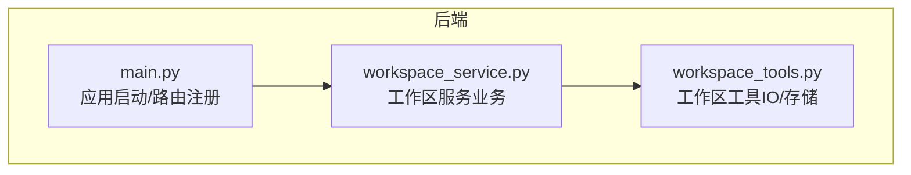
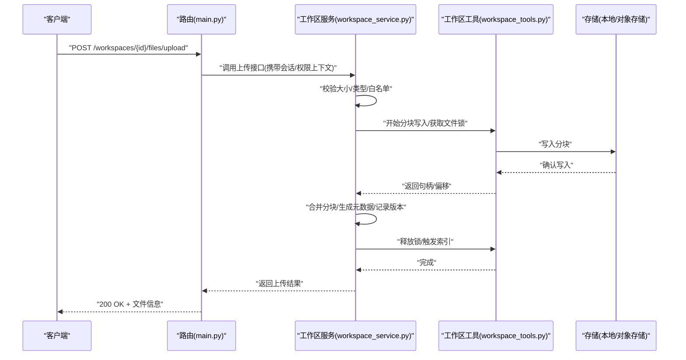
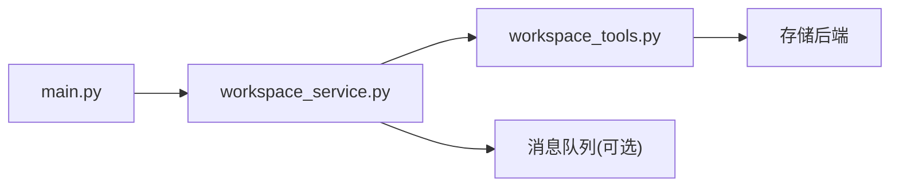

# 工作区服务

<cite>
**本文引用的文件**   
- [backend/app/services/workspace_service.py](file://backend/app/services/workspace_service.py)
- [backend/app/tools/workspace_tools.py](file://backend/app/tools/workspace_tools.py)
- [backend/app/main.py](file://backend/app/main.py)
</cite>

## 目录
1. [简介](#简介)
2. [项目结构](#项目结构)
3. [核心组件](#核心组件)
4. [架构总览](#架构总览)
5. [详细组件分析](#详细组件分析)
6. [依赖分析](#依赖分析)
7. [性能考虑](#性能考虑)
8. [故障排查指南](#故障排查指南)
9. [结论](#结论)
10. [附录](#附录)

## 简介
本文件围绕“工作区服务”进行系统化文档化，重点覆盖以下方面：
- 文件系统抽象层设计：文件操作、目录管理、权限控制
- 工作区概念与项目结构：工作区定义、组织方式、版本管理机制
- 数据通路：上传下载、批量操作、搜索索引的实现思路
- 安全策略：文件类型识别、大小限制、安全扫描
- 协作与并发：多用户协作方案与并发控制策略
- 数据模型与接口：面向开发者的数据模型与API契约说明

## 项目结构
后端采用分层组织：路由层负责HTTP入口，服务层封装业务逻辑，工具层提供可复用的能力。工作区相关代码主要位于服务层与工具层，并由主应用注册路由。

图表来源
- [backend/app/main.py](file://backend/app/main.py)
- [backend/app/services/workspace_service.py](file://backend/app/services/workspace_service.py)
- [backend/app/tools/workspace_tools.py](file://backend/app/tools/workspace_tools.py)

章节来源
- [backend/app/main.py](file://backend/app/main.py)
- [backend/app/services/workspace_service.py](file://backend/app/services/workspace_service.py)
- [backend/app/tools/workspace_tools.py](file://backend/app/tools/workspace_tools.py)

## 核心组件
- 工作区服务（WorkspaceService）
  - 职责：工作区生命周期管理、文件与目录的CRUD、版本快照与回滚、元数据维护、权限校验、事件编排（如索引更新）。
  - 关键能力：
    - 创建/删除工作区、列出工作区
    - 文件上传/下载、重命名、移动、复制、删除
    - 目录创建/移动/删除、列表与树形遍历
    - 版本快照：基于路径+时间戳或版本号建立只读视图
    - 权限控制：基于工作区成员角色与资源路径的访问判定
    - 索引触发：在文件变更时调度增量索引任务
- 工作区工具（WorkspaceTools）
  - 职责：对底层存储的抽象封装，屏蔽具体实现差异（本地磁盘/对象存储），提供原子性操作、事务式提交、并发锁等。
  - 关键能力：
    - 统一读写接口：open/read/write/close
    - 目录枚举与树构建
    - 大文件分块写入与断点续传支持
    - 元数据持久化（文件属性、版本信息、ACL）
    - 并发控制：文件级/目录级锁、乐观锁版本号
- 路由集成（main.py）
  - 职责：将HTTP端点绑定到工作区服务方法，处理请求解析、鉴权上下文注入、响应序列化。

章节来源
- [backend/app/services/workspace_service.py](file://backend/app/services/workspace_service.py)
- [backend/app/tools/workspace_tools.py](file://backend/app/tools/workspace_tools.py)
- [backend/app/main.py](file://backend/app/main.py)

## 架构总览
工作区服务采用“服务-工具-存储”三层解耦：
- 服务层：面向业务语义，组合工具能力，编排流程，保证一致性。
- 工具层：面向IO与并发，提供稳定可靠的原子操作与锁机制。
- 存储层：由工具层抽象，可替换为本地文件系统或对象存储。

图表来源
- [backend/app/main.py](file://backend/app/main.py)
- [backend/app/services/workspace_service.py](file://backend/app/services/workspace_service.py)
- [backend/app/tools/workspace_tools.py](file://backend/app/tools/workspace_tools.py)

## 详细组件分析

### 文件系统抽象层设计
- 设计目标
  - 统一不同存储后端的读写语义，屏蔽差异。
  - 提供原子性、幂等性与可恢复的IO操作。
  - 暴露一致的目录与文件模型，便于上层服务编排。
- 关键抽象
  - 文件句柄：打开/读取/写入/关闭，支持流式与分块。
  - 目录操作：创建/移动/删除/枚举/树构建。
  - 元数据：文件名、大小、MIME、哈希、更新时间、ACL、版本。
  - 并发控制：文件级/目录级锁、乐观锁版本号。
  - 事务：多步操作的原子提交与回滚。
- 复杂度与性能
  - 分块写入：O(n) 分块累积，内存占用可控。
  - 目录枚举：按层级惰性加载，避免一次性全量读取。
  - 锁粒度：细粒度文件锁降低热点冲突。

章节来源
- [backend/app/tools/workspace_tools.py](file://backend/app/tools/workspace_tools.py)

### 工作区概念与项目结构
- 工作区定义
  - 工作区是隔离的项目空间，包含一组文件与目录，以及独立的元数据与权限集。
- 项目结构
  - 根目录：工作区根。
  - 子目录：按功能或模块划分，支持嵌套。
  - 隐藏目录：用于版本快照、索引缓存、审计日志等。
- 版本管理机制
  - 快照策略：每次重要变更创建只读快照，保留历史版本。
  - 版本标识：基于时间戳或递增版本号，支持快速回滚。
  - 差异对比：基于内容哈希计算差异，减少冗余存储。

章节来源
- [backend/app/services/workspace_service.py](file://backend/app/services/workspace_service.py)

### 权限控制
- 模型
  - 主体：用户/角色/组。
  - 资源：工作区、目录、文件。
  - 动作：读、写、删、管理。
- 策略
  - 基于角色的访问控制（RBAC）与基于资源的访问控制（ABAC）结合。
  - 继承规则：父目录权限向下继承，显式拒绝优先。
- 实现要点
  - 在路由层注入当前主体上下文。
  - 在服务层执行权限判定，失败即拒绝。
  - 工具层不感知权限，仅执行受信任的服务指令。

章节来源
- [backend/app/services/workspace_service.py](file://backend/app/services/workspace_service.py)
- [backend/app/main.py](file://backend/app/main.py)

### 文件上传与下载
- 上传流程
  - 预检：校验文件大小、类型、白名单。
  - 分块：客户端分片上传，服务端逐块落盘并记录偏移。
  - 合并：所有分块完成后合并，生成唯一ID与哈希。
  - 元数据：写入文件属性、ACL、版本信息。
  - 索引：触发增量索引任务。
- 下载流程
  - 权限校验通过后，按范围头支持断点续传。
  - 流式输出，避免大文件内存峰值。
- 错误处理
  - 分块丢失/损坏：重试与校验失败提示。
  - 并发冲突：使用乐观锁版本号解决。

章节来源
- [backend/app/services/workspace_service.py](file://backend/app/services/workspace_service.py)
- [backend/app/tools/workspace_tools.py](file://backend/app/tools/workspace_tools.py)
- [backend/app/main.py](file://backend/app/main.py)

### 批量操作
- 场景
  - 批量移动/复制/删除、批量重命名、批量设置ACL。
- 实现要点
  - 分批执行，每批内使用事务保证一致性。
  - 失败回滚：任一失败则整体回滚或记录部分成功状态供重试。
  - 进度反馈：通过任务ID与查询接口返回进度。

章节来源
- [backend/app/services/workspace_service.py](file://backend/app/services/workspace_service.py)

### 搜索索引
- 触发时机
  - 文件新增/修改/删除后，异步触发增量索引。
- 索引内容
  - 文件名、路径、扩展名、MIME、大小、哈希、更新时间、标签。
  - 文本类文件的内容摘要（可选，需考虑隐私与安全）。
- 存储与查询
  - 使用轻量搜索引擎或关系型表存储索引。
  - 支持前缀匹配、模糊匹配、过滤条件组合。

章节来源
- [backend/app/services/workspace_service.py](file://backend/app/services/workspace_service.py)

### 安全措施
- 文件类型识别
  - 基于扩展名与MIME双重校验，必要时进行魔数检测。
- 大小限制
  - 全局与单文件上限，防止DoS攻击。
- 安全扫描
  - 上传后对可疑文件进行病毒/恶意代码扫描，阻断传播。
- 路径与名称规范
  - 禁止穿越路径、非法字符过滤、长度限制。
- 传输安全
  - HTTPS强制、分块签名校验、防重放。

章节来源
- [backend/app/services/workspace_service.py](file://backend/app/services/workspace_service.py)
- [backend/app/tools/workspace_tools.py](file://backend/app/tools/workspace_tools.py)

### 协作与并发控制
- 并发模型
  - 文件级锁：同一时刻仅允许一个写者，读者可并发。
  - 乐观锁：基于版本号，冲突时提示重试。
- 协作策略
  - 多人编辑：以“最后写入胜出”或“合并策略”为主，结合审计日志。
  - 预览与草稿：分离工作副本与发布版本。
- 一致性保障
  - 事务边界明确，失败回滚。
  - 索引与元数据最终一致，异步补偿。

章节来源
- [backend/app/tools/workspace_tools.py](file://backend/app/tools/workspace_tools.py)
- [backend/app/services/workspace_service.py](file://backend/app/services/workspace_service.py)

## 依赖分析
- 内部依赖
  - main.py 依赖 workspace_service.py 暴露的HTTP接口。
  - workspace_service.py 依赖 workspace_tools.py 提供的IO与并发原语。
- 外部依赖
  - 存储后端（本地/对象存储）、消息队列（索引任务）、安全扫描器（可选）。
- 耦合与内聚
  - 服务层高内聚于工作区业务；工具层高内聚于IO与并发；路由层低内聚于协议适配。

图表来源
- [backend/app/main.py](file://backend/app/main.py)
- [backend/app/services/workspace_service.py](file://backend/app/services/workspace_service.py)
- [backend/app/tools/workspace_tools.py](file://backend/app/tools/workspace_tools.py)

章节来源
- [backend/app/main.py](file://backend/app/main.py)
- [backend/app/services/workspace_service.py](file://backend/app/services/workspace_service.py)
- [backend/app/tools/workspace_tools.py](file://backend/app/tools/workspace_tools.py)

## 性能考虑
- 分块上传/下载：降低内存峰值，提升稳定性。
- 懒加载目录树：按需展开，避免全量枚举。
- 索引增量更新：仅处理变更文件，减少CPU与I/O。
- 锁粒度优化：尽量缩小锁范围，缩短持有时间。
- 缓存策略：热文件元数据缓存，注意失效一致性。

[本节为通用指导，无需源码引用]

## 故障排查指南
- 上传失败
  - 检查分块完整性与哈希校验。
  - 查看锁等待与超时日志。
  - 确认大小与类型白名单配置。
- 下载异常
  - 验证权限与ACL。
  - 检查范围头与断点续传状态。
- 索引不一致
  - 核对变更事件是否投递成功。
  - 检查索引任务重试与补偿逻辑。
- 并发冲突
  - 观察版本号冲突与重试次数。
  - 评估锁粒度是否需要调整。

章节来源
- [backend/app/services/workspace_service.py](file://backend/app/services/workspace_service.py)
- [backend/app/tools/workspace_tools.py](file://backend/app/tools/workspace_tools.py)

## 结论
工作区服务通过清晰的分层与抽象，实现了稳定的文件与目录管理能力，配合完善的权限、安全与并发控制，能够满足多用户协作与大规模文件处理的场景。建议在生产环境完善监控告警、审计日志与容量规划，持续优化索引与锁策略以提升吞吐与一致性体验。

[本节为总结，无需源码引用]

## 附录

### 数据模型概览
- 工作区
  - 字段：ID、名称、描述、创建者、创建时间、更新时间、状态。
- 文件
  - 字段：ID、工作区ID、路径、名称、大小、MIME、哈希、更新时间、ACL、版本。
- 目录
  - 字段：ID、工作区ID、路径、名称、更新时间、ACL。
- 版本快照
  - 字段：ID、工作区ID、目标路径、快照ID、创建时间、备注。
- ACL条目
  - 字段：主体ID、资源ID、动作集合、生效范围。

[本节为概念性说明，无需源码引用]

### API 契约示例（路径参考）
- 工作区管理
  - POST /workspaces
  - GET /workspaces/{id}
  - DELETE /workspaces/{id}
- 文件操作
  - POST /workspaces/{id}/files/upload
  - GET /workspaces/{id}/files/{path}
  - PUT /workspaces/{id}/files/{path}
  - DELETE /workspaces/{id}/files/{path}
- 目录操作
  - POST /workspaces/{id}/dirs
  - MOVE /workspaces/{id}/dirs/move
  - LIST /workspaces/{id}/dirs/list
- 版本管理
  - POST /workspaces/{id}/snapshots
  - GET /workspaces/{id}/snapshots
  - RESTORE /workspaces/{id}/snapshots/{snapshot_id}
- 批量操作
  - POST /workspaces/{id}/batch
- 搜索索引
  - POST /workspaces/{id}/index/rebuild
  - GET /workspaces/{id}/search

章节来源
- [backend/app/main.py](file://backend/app/main.py)
- [backend/app/services/workspace_service.py](file://backend/app/services/workspace_service.py)