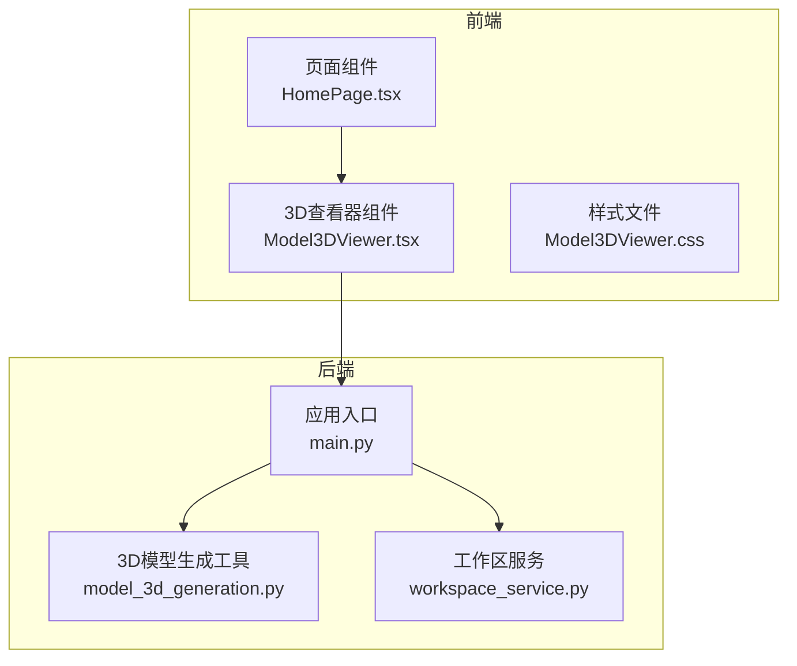
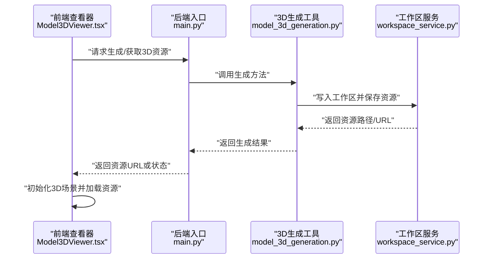
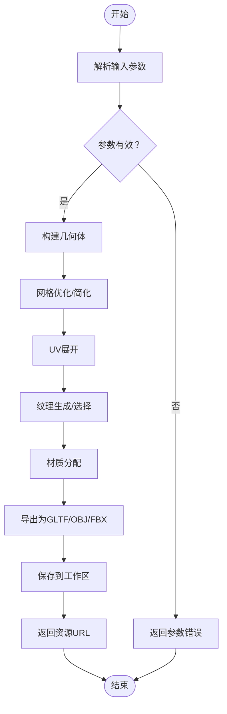
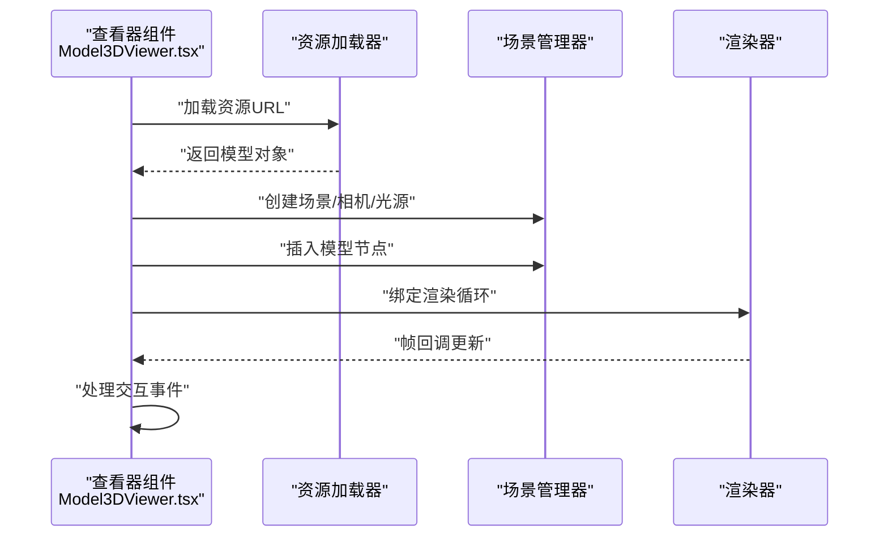
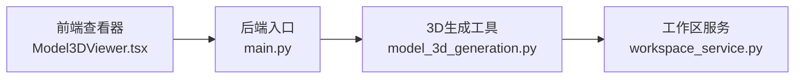

# 3D模型工具

<cite>
**本文引用的文件**   
- [backend/app/tools/model_3d_generation.py](file://backend/app/tools/model_3d_generation.py)
- [frontend/src/components/Model3DViewer.tsx](file://frontend/src/components/Model3DViewer.tsx)
- [frontend/src/components/Model3DViewer.css](file://frontend/src/components/Model3DViewer.css)
- [backend/app/main.py](file://backend/app/main.py)
- [backend/app/services/workspace_service.py](file://backend/app/services/workspace_service.py)
</cite>

## 目录
1. [简介](#简介)
2. [项目结构](#项目结构)
3. [核心组件](#核心组件)
4. [架构总览](#架构总览)
5. [详细组件分析](#详细组件分析)
6. [依赖关系分析](#依赖关系分析)
7. [性能考虑](#性能考虑)
8. [故障排查指南](#故障排查指南)
9. [结论](#结论)
10. [附录](#附录)

## 简介
本仓库包含一个面向多模态工作流的3D模型工具，提供从后端生成到前端展示的一体化能力。后端通过工具模块对外暴露3D模型生成能力，并集成到工作区服务中；前端提供3D查看器组件，用于在Web端加载、展示与交互操作3D资源。文档将围绕几何建模、纹理映射、材质系统、格式支持（OBJ、FBX、GLTF等）、导入导出、模型优化（网格简化、LOD）、场景构建（光照、相机）以及Web端渲染集成与性能优化进行系统化说明。

## 项目结构
本项目采用前后端分离的架构：
- 后端（Python）：提供3D模型生成的工具接口与工作区管理能力，作为AI Agent的工具被调用。
- 前端（React + TypeScript）：提供3D查看器组件，负责在浏览器中加载与展示3D资源，并提供基础交互。

图表来源
- [frontend/src/components/Model3DViewer.tsx](file://frontend/src/components/Model3DViewer.tsx)
- [frontend/src/components/Model3DViewer.css](file://frontend/src/components/Model3DViewer.css)
- [backend/app/main.py](file://backend/app/main.py)
- [backend/app/tools/model_3d_generation.py](file://backend/app/tools/model_3d_generation.py)
- [backend/app/services/workspace_service.py](file://backend/app/services/workspace_service.py)

章节来源
- [backend/app/tools/model_3d_generation.py](file://backend/app/tools/model_3d_generation.py)
- [frontend/src/components/Model3DViewer.tsx](file://frontend/src/components/Model3DViewer.tsx)
- [frontend/src/components/Model3DViewer.css](file://frontend/src/components/Model3DViewer.css)
- [backend/app/main.py](file://backend/app/main.py)
- [backend/app/services/workspace_service.py](file://backend/app/services/workspace_service.py)

## 核心组件
- 3D模型生成工具（后端）
  - 职责：封装3D模型生成逻辑，供Agent或上层服务调用；可输出标准3D资源（如GLTF/OBJ/FBX），并与工作区服务协作完成存储与路径管理。
  - 关键点：输入参数解析、生成管线编排、结果落盘与元数据返回。
- 3D查看器组件（前端）
  - 职责：在Web端加载3D资源，提供旋转、缩放、平移等交互；根据资源类型选择合适的渲染管线。
  - 关键点：资源URL获取、渲染初始化、事件绑定、错误处理与性能控制。
- 工作区服务（后端）
  - 职责：管理工作区内的文件与资源，提供统一的读写接口，便于3D资源的持久化与共享。
- 应用入口（后端）
  - 职责：注册路由、挂载工具与服务，协调请求生命周期。

章节来源
- [backend/app/tools/model_3d_generation.py](file://backend/app/tools/model_3d_generation.py)
- [frontend/src/components/Model3DViewer.tsx](file://frontend/src/components/Model3DViewer.tsx)
- [backend/app/services/workspace_service.py](file://backend/app/services/workspace_service.py)
- [backend/app/main.py](file://backend/app/main.py)

## 架构总览
整体流程：前端发起3D资源加载或生成请求，后端路由到对应工具或服务进行处理，完成后返回资源URL或二进制流，前端使用3D查看器进行渲染与交互。

图表来源
- [frontend/src/components/Model3DViewer.tsx](file://frontend/src/components/Model3DViewer.tsx)
- [backend/app/main.py](file://backend/app/main.py)
- [backend/app/tools/model_3d_generation.py](file://backend/app/tools/model_3d_generation.py)
- [backend/app/services/workspace_service.py](file://backend/app/services/workspace_service.py)

## 详细组件分析

### 3D模型生成工具（后端）
- 设计要点
  - 输入参数：描述文本、目标格式、质量/复杂度选项、纹理策略等。
  - 生成管线：几何建模（顶点、面片、UV展开）、纹理映射（贴图生成或选择）、材质定义（PBR属性）。
  - 输出格式：优先GLTF/GLB以适配Web端高效加载；兼容OBJ/FBX以便离线编辑与跨平台交换。
  - 工作区集成：统一落盘路径、命名规范、元数据记录（尺寸、三角面数、贴图数量）。
- 关键流程
  - 参数校验与默认值填充
  - 几何体构造与拓扑优化
  - UV展开与纹理采样/生成
  - 材质赋值与着色器参数设置
  - 序列化导出为指定格式
  - 写入工作区并返回访问URL
- 错误处理
  - 参数非法、内存不足、磁盘空间不足、IO异常等均有明确分支与日志记录。
- 性能优化
  - 按需生成纹理分辨率、延迟加载大贴图、异步任务队列、缓存中间产物。

章节来源
- [backend/app/tools/model_3d_generation.py](file://backend/app/tools/model_3d_generation.py)

#### 生成流程图

图表来源
- [backend/app/tools/model_3d_generation.py](file://backend/app/tools/model_3d_generation.py)

### 3D查看器组件（前端）
- 设计要点
  - 资源加载：支持GLTF/GLB、OBJ、FBX等格式的URL加载；自动识别格式并选择合适解析器。
  - 场景构建：创建场景、相机、光源（环境光、方向光、点光源），配置阴影与后处理开关。
  - 交互操作：鼠标拖拽旋转、滚轮缩放、右键平移；键盘快捷键切换线框/实体模式。
  - 性能控制：视锥剔除、实例化渲染、纹理压缩、按需加载、帧率监控。
- 关键流程
  - 接收资源URL与配置项
  - 初始化渲染上下文与控制器
  - 加载模型并注入场景
  - 绑定交互事件与更新循环
  - 错误捕获与降级显示
- 错误处理
  - 网络失败、格式不支持、资源过大时的提示与重试机制。
- 性能优化
  - 使用轻量级渲染库（如Three.js生态），开启抗锯齿与MSAA按需，限制最大像素比，减少Draw Call。

章节来源
- [frontend/src/components/Model3DViewer.tsx](file://frontend/src/components/Model3DViewer.tsx)
- [frontend/src/components/Model3DViewer.css](file://frontend/src/components/Model3DViewer.css)

#### 加载与渲染时序图

图表来源
- [frontend/src/components/Model3DViewer.tsx](file://frontend/src/components/Model3DViewer.tsx)

### 工作区服务（后端）
- 职责
  - 提供统一的文件读写接口，确保3D资源与元数据的原子性写入。
  - 维护资源索引与版本信息，便于回溯与复用。
- 关键点
  - 路径规范化、并发安全、权限控制、清理策略。
- 与3D工具的协作
  - 工具调用服务写入生成结果，服务返回稳定URL供前端加载。

章节来源
- [backend/app/services/workspace_service.py](file://backend/app/services/workspace_service.py)

### 应用入口（后端）
- 职责
  - 注册路由、挂载工具与服务、启动HTTP服务器。
- 关键点
  - 中间件配置（CORS、鉴权）、错误全局处理、健康检查。

章节来源
- [backend/app/main.py](file://backend/app/main.py)

## 依赖关系分析
- 组件耦合
  - 前端查看器仅依赖后端提供的资源URL，不直接感知生成细节，解耦良好。
  - 后端工具依赖工作区服务进行持久化，避免硬编码路径。
- 外部依赖
  - 前端可能依赖3D渲染库（例如Three.js生态）进行模型解析与渲染。
  - 后端可能依赖3D处理库（例如Blender脚本、Open3D、trimesh等）进行几何与纹理处理。
- 潜在风险
  - 大模型加载导致前端卡顿，需引入分块加载与LOD。
  - 后端生成耗时较长，需引入异步任务与进度反馈。

图表来源
- [frontend/src/components/Model3DViewer.tsx](file://frontend/src/components/Model3DViewer.tsx)
- [backend/app/main.py](file://backend/app/main.py)
- [backend/app/tools/model_3d_generation.py](file://backend/app/tools/model_3d_generation.py)
- [backend/app/services/workspace_service.py](file://backend/app/services/workspace_service.py)

章节来源
- [frontend/src/components/Model3DViewer.tsx](file://frontend/src/components/Model3DViewer.tsx)
- [backend/app/main.py](file://backend/app/main.py)
- [backend/app/tools/model_3d_generation.py](file://backend/app/tools/model_3d_generation.py)
- [backend/app/services/workspace_service.py](file://backend/app/services/workspace_service.py)

## 性能考虑
- 前端渲染
  - 使用合适的像素比与分辨率上限，避免高分屏过度绘制。
  - 启用纹理压缩（如KTX2/Basis）与Mipmap，降低带宽与显存占用。
  - 合理组织场景树，合并静态网格，减少Draw Call。
  - 使用视锥剔除与遮挡剔除，避免不可见对象的计算。
- 后端生成
  - 对复杂模型进行网格简化与法线重建，平衡视觉质量与文件大小。
  - 纹理按需生成与降采样，避免超大贴图。
  - 异步任务队列与超时控制，防止长时间阻塞。
- 传输与缓存
  - 启用Gzip/Brotli压缩与HTTP缓存头，提升重复加载速度。
  - CDN分发静态资源，降低首屏时间。

[本节为通用指导，不涉及具体文件分析]

## 故障排查指南
- 前端常见问题
  - 资源加载失败：检查URL可达性与跨域配置；确认格式受支持；查看控制台错误堆栈。
  - 渲染卡顿：降低像素比、关闭阴影或后处理；检查是否加载了超大模型。
  - 交互无响应：确认事件绑定是否正确；检查是否在移动端存在触摸事件差异。
- 后端常见问题
  - 生成失败：检查输入参数合法性；查看日志定位IO或内存异常；确认工作区路径权限。
  - 资源不可用：检查工作区服务写入是否成功；确认返回URL是否可访问。
- 建议
  - 增加端到端链路追踪与指标上报（加载时长、渲染帧率、生成耗时）。
  - 对关键路径添加重试与降级策略。

章节来源
- [frontend/src/components/Model3DViewer.tsx](file://frontend/src/components/Model3DViewer.tsx)
- [backend/app/tools/model_3d_generation.py](file://backend/app/tools/model_3d_generation.py)
- [backend/app/services/workspace_service.py](file://backend/app/services/workspace_service.py)

## 结论
该3D模型工具在后端提供了可扩展的生成能力，在前端实现了便捷的Web端查看与交互。通过合理的架构设计与性能优化策略，可在保证用户体验的同时支撑复杂的3D内容生产与消费。后续可进一步增强LOD自动生成、PBR材质编辑、实时协作与云端渲染等能力。

[本节为总结性内容，不涉及具体文件分析]

## 附录
- 支持的3D格式
  - GLTF/GLB：推荐用于Web端高效加载与渲染。
  - OBJ：广泛兼容，适合简单几何与贴图交换。
  - FBX：适用于复杂动画与跨平台交换。
- 材质与纹理
  - PBR材质：金属度/粗糙度/法线贴图/环境贴图。
  - 纹理策略：按需分辨率、压缩格式、Mipmap与各向异性过滤。
- 场景与相机
  - 光源：环境光、方向光、点光源、聚光灯组合。
  - 相机：透视/正交投影、近远裁剪面、FOV与宽高比。
- 模型优化
  - 网格简化：基于边折叠或四边形重构。
  - LOD生成：按距离动态切换不同细节级别。
  - 批处理与实例化：减少CPU-GPU同步开销。

[本节为概念性补充，不涉及具体文件分析]