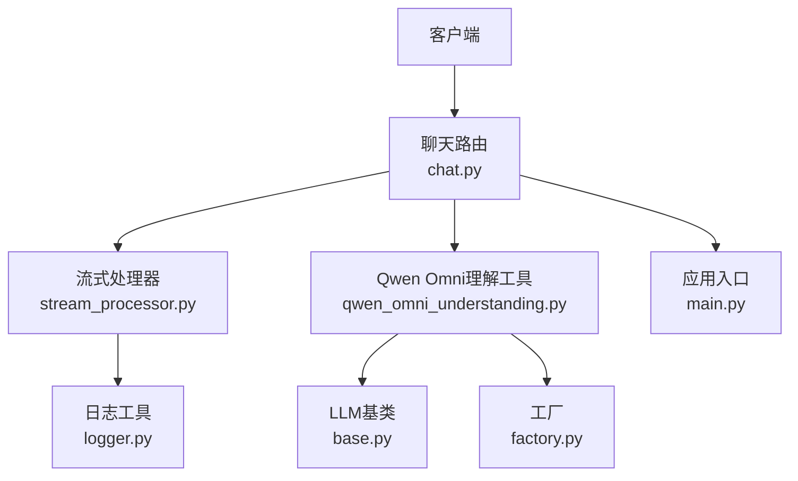
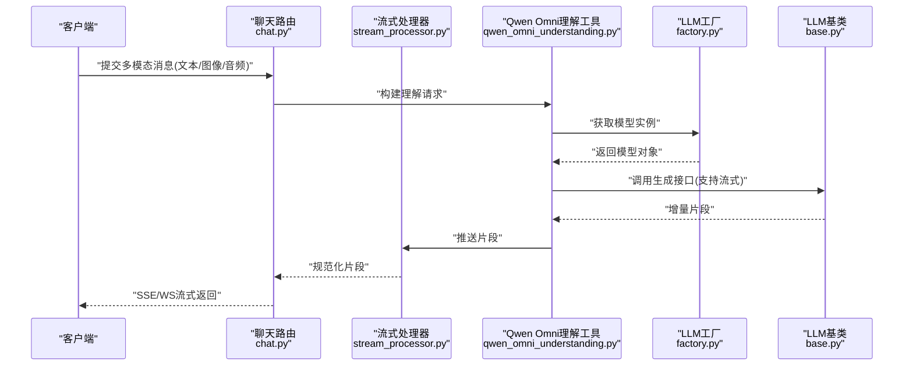
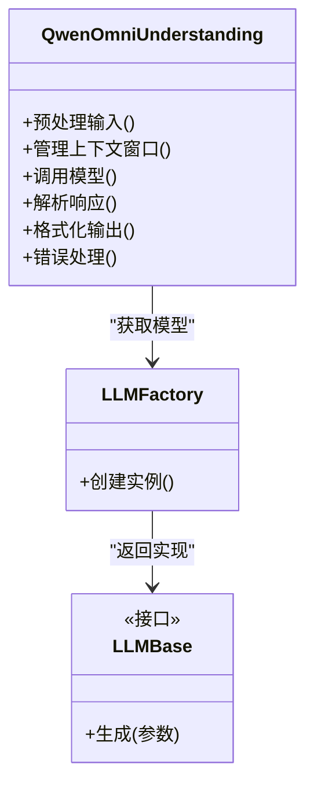
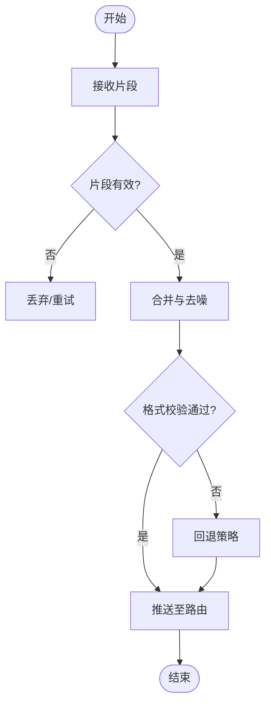
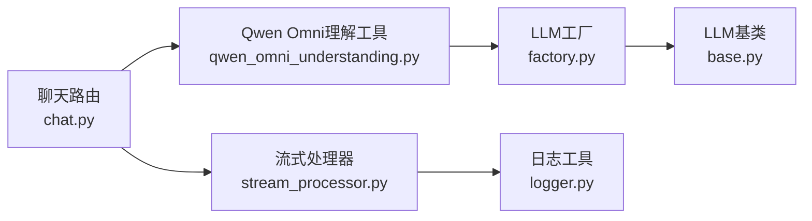
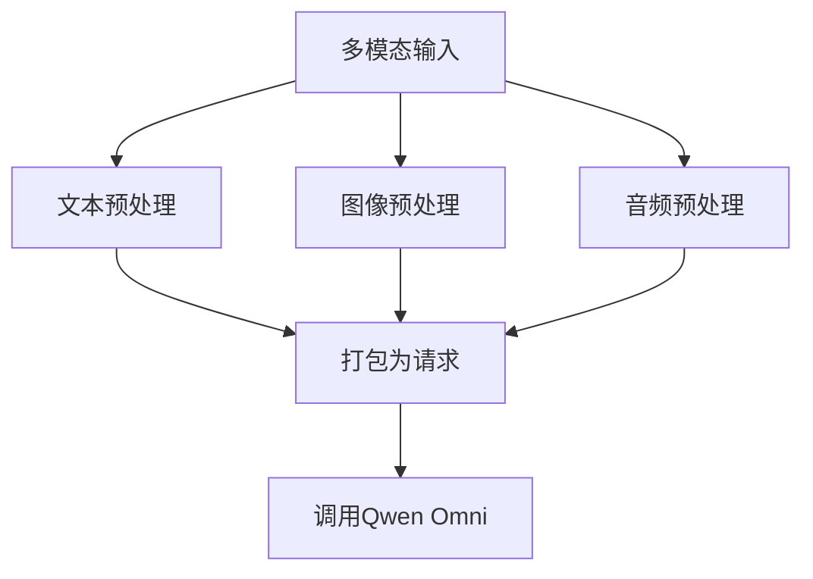
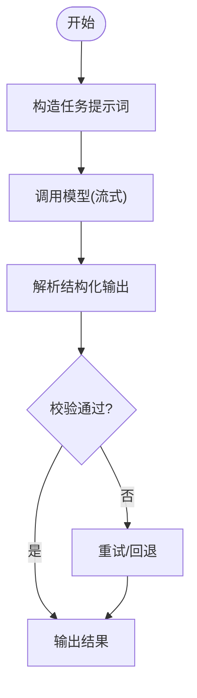
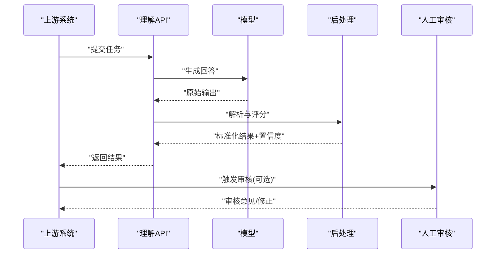

# AI理解工具

<cite>
**本文引用的文件**   
- [backend/app/tools/qwen_omni_understanding.py](file://backend/app/tools/qwen_omni_understanding.py)
- [backend/app/llm/base.py](file://backend/app/llm/base.py)
- [backend/app/llm/factory.py](file://backend/app/llm/factory.py)
- [backend/app/services/stream_processor.py](file://backend/app/services/stream_processor.py)
- [backend/app/routers/chat.py](file://backend/app/routers/chat.py)
- [backend/app/main.py](file://backend/app/main.py)
- [backend/app/utils/logger.py](file://backend/app/utils/logger.py)
</cite>

## 目录
1. [简介](#简介)
2. [项目结构](#项目结构)
3. [核心组件](#核心组件)
4. [架构总览](#架构总览)
5. [详细组件分析](#详细组件分析)
6. [依赖关系分析](#依赖关系分析)
7. [性能考虑](#性能考虑)
8. [故障排查指南](#故障排查指南)
9. [结论](#结论)
10. [附录](#附录)

## 简介
本文件面向“AI理解工具”的实现与集成，聚焦多模态理解能力（文本、图像、语音）与Qwen Omni模型的工程化落地。文档覆盖以下关键主题：
- 多模态输入处理流程与标准化输出
- Qwen Omni模型集成方式（上下文窗口管理、token优化、响应格式化）
- NLP任务处理流程（意图识别、实体提取、情感分析）
- 多语言支持与领域适配策略
- 知识增强方案
- 结果置信度评估与人工审核接口设计

## 项目结构
后端采用模块化分层组织：路由层暴露HTTP接口，服务层编排业务逻辑，工具层封装具体能力（含Qwen Omni理解），LLM抽象层统一不同供应商接入，流式处理器负责增量解析与组装，日志工具提供可观测性。

图示来源
- [backend/app/routers/chat.py](file://backend/app/routers/chat.py)
- [backend/app/services/stream_processor.py](file://backend/app/services/stream_processor.py)
- [backend/app/tools/qwen_omni_understanding.py](file://backend/app/tools/qwen_omni_understanding.py)
- [backend/app/llm/base.py](file://backend/app/llm/base.py)
- [backend/app/llm/factory.py](file://backend/app/llm/factory.py)
- [backend/app/utils/logger.py](file://backend/app/utils/logger.py)
- [backend/app/main.py](file://backend/app/main.py)

章节来源
- [backend/app/main.py](file://backend/app/main.py)
- [backend/app/routers/chat.py](file://backend/app/routers/chat.py)
- [backend/app/services/stream_processor.py](file://backend/app/services/stream_processor.py)
- [backend/app/tools/qwen_omni_understanding.py](file://backend/app/tools/qwen_omni_understanding.py)
- [backend/app/llm/base.py](file://backend/app/llm/base.py)
- [backend/app/llm/factory.py](file://backend/app/llm/factory.py)
- [backend/app/utils/logger.py](file://backend/app/utils/logger.py)

## 核心组件
- Qwen Omni理解工具：封装多模态输入预处理、调用Qwen Omni、结果后处理与结构化输出。
- LLM抽象与工厂：统一不同供应商的调用契约，按配置选择实现。
- 流式处理器：对增量片段进行分块、去噪、拼接与格式校验。
- 路由与服务：将前端请求转换为内部调用，协调工具与流式处理。
- 日志工具：记录关键事件与错误，便于定位问题。

章节来源
- [backend/app/tools/qwen_omni_understanding.py](file://backend/app/tools/qwen_omni_understanding.py)
- [backend/app/llm/base.py](file://backend/app/llm/base.py)
- [backend/app/llm/factory.py](file://backend/app/llm/factory.py)
- [backend/app/services/stream_processor.py](file://backend/app/services/stream_processor.py)
- [backend/app/routers/chat.py](file://backend/app/routers/chat.py)
- [backend/app/utils/logger.py](file://backend/app/utils/logger.py)

## 架构总览
下图展示从请求到响应的端到端流程，包括多模态输入、Qwen Omni调用、流式解析与标准化输出。

图示来源
- [backend/app/routers/chat.py](file://backend/app/routers/chat.py)
- [backend/app/services/stream_processor.py](file://backend/app/services/stream_processor.py)
- [backend/app/tools/qwen_omni_understanding.py](file://backend/app/tools/qwen_omni_understanding.py)
- [backend/app/llm/factory.py](file://backend/app/llm/factory.py)
- [backend/app/llm/base.py](file://backend/app/llm/base.py)

## 详细组件分析

### Qwen Omni理解工具
职责
- 多模态输入预处理：文本归一化、图像编码、音频转码与采样率对齐。
- 上下文窗口管理：基于token预算裁剪历史、合并冗余信息、保留关键元数据。
- Token优化：压缩提示词、去除空白与重复、选择性丢弃低价值附件。
- 响应格式化：将模型输出解析为结构化JSON，包含答案、证据、置信度等字段。
- 错误与重试：网络异常、超时、配额限制的统一处理与退避策略。

图示来源
- [backend/app/tools/qwen_omni_understanding.py](file://backend/app/tools/qwen_omni_understanding.py)
- [backend/app/llm/factory.py](file://backend/app/llm/factory.py)
- [backend/app/llm/base.py](file://backend/app/llm/base.py)

章节来源
- [backend/app/tools/qwen_omni_understanding.py](file://backend/app/tools/qwen_omni_understanding.py)
- [backend/app/llm/base.py](file://backend/app/llm/base.py)
- [backend/app/llm/factory.py](file://backend/app/llm/factory.py)

### 流式处理器
职责
- 增量接收：持续消费模型返回的片段。
- 分块与去噪：过滤空片段、合并跨行不完整标记。
- 格式校验：确保每个片段符合预期模式，失败则回退或重试。
- 组装与推送：将片段组合成完整响应并推送到上层。

图示来源
- [backend/app/services/stream_processor.py](file://backend/app/services/stream_processor.py)

章节来源
- [backend/app/services/stream_processor.py](file://backend/app/services/stream_processor.py)

### 路由与服务
职责
- 接收前端请求，解析多模态消息。
- 调用理解工具与流式处理器，建立SSE/WS通道。
- 统一错误码与状态上报。

章节来源
- [backend/app/routers/chat.py](file://backend/app/routers/chat.py)
- [backend/app/main.py](file://backend/app/main.py)

### 日志工具
职责
- 记录请求ID、耗时、错误堆栈与关键指标。
- 提供分级日志与结构化输出，便于追踪。

章节来源
- [backend/app/utils/logger.py](file://backend/app/utils/logger.py)

## 依赖关系分析
- 工具层依赖LLM抽象与工厂，屏蔽供应商差异。
- 路由层依赖工具与流式处理器，解耦I/O与计算。
- 日志贯穿各层，保障可观测性。

图示来源
- [backend/app/routers/chat.py](file://backend/app/routers/chat.py)
- [backend/app/tools/qwen_omni_understanding.py](file://backend/app/tools/qwen_omni_understanding.py)
- [backend/app/llm/factory.py](file://backend/app/llm/factory.py)
- [backend/app/llm/base.py](file://backend/app/llm/base.py)
- [backend/app/services/stream_processor.py](file://backend/app/services/stream_processor.py)
- [backend/app/utils/logger.py](file://backend/app/utils/logger.py)

章节来源
- [backend/app/routers/chat.py](file://backend/app/routers/chat.py)
- [backend/app/tools/qwen_omni_understanding.py](file://backend/app/tools/qwen_omni_understanding.py)
- [backend/app/llm/factory.py](file://backend/app/llm/factory.py)
- [backend/app/llm/base.py](file://backend/app/llm/base.py)
- [backend/app/services/stream_processor.py](file://backend/app/services/stream_processor.py)
- [backend/app/utils/logger.py](file://backend/app/utils/logger.py)

## 性能考虑
- 上下文窗口管理
  - 动态裁剪：按token预算优先保留最近对话与关键实体。
  - 摘要压缩：对长历史进行轻量摘要，降低后续请求长度。
- Token优化
  - 提示词精简：移除冗余指令与重复描述。
  - 附件筛选：仅上传必要图像帧与音频片段，控制分辨率与时长。
- 流式传输
  - 增量渲染：减少首字节延迟，提升交互体验。
  - 背压控制：当下游处理慢时暂停上游推送，避免内存膨胀。
- 并发与缓存
  - 热点内容缓存：对常见查询结果做短期缓存。
  - 连接复用：保持与模型服务的长连接，降低握手开销。

[本节为通用指导，不直接分析具体文件]

## 故障排查指南
常见问题与定位步骤
- 模型调用失败
  - 检查工厂是否正确创建实例与配置项。
  - 查看日志中的错误码与堆栈，确认网络与认证。
- 流式中断
  - 验证流式处理器是否完成片段合并与格式校验。
  - 检查路由层的SSE/WS通道是否关闭过早。
- 输出格式错误
  - 确认理解工具的解析器是否匹配模型输出模式。
  - 增加降级策略，回退到默认模板。
- 性能退化
  - 监控token使用量与上下文长度，调整裁剪阈值。
  - 观察流式缓冲大小与推送频率，平衡延迟与吞吐。

章节来源
- [backend/app/utils/logger.py](file://backend/app/utils/logger.py)
- [backend/app/services/stream_processor.py](file://backend/app/services/stream_processor.py)
- [backend/app/tools/qwen_omni_understanding.py](file://backend/app/tools/qwen_omni_understanding.py)
- [backend/app/llm/factory.py](file://backend/app/llm/factory.py)
- [backend/app/llm/base.py](file://backend/app/llm/base.py)
- [backend/app/routers/chat.py](file://backend/app/routers/chat.py)

## 结论
本方案以Qwen Omni为核心，结合统一的LLM抽象与流式处理，实现了文本、图像、语音的多模态理解能力。通过上下文窗口管理与token优化，保障了高并发下的稳定与高效；标准化的输出结构与置信度字段，为下游应用与人工审核提供了可靠基础。建议在生产环境完善监控告警与灰度发布机制，持续迭代提示词与后处理策略以提升准确率与鲁棒性。

[本节为总结性内容，不直接分析具体文件]

## 附录

### 多模态输入处理流程
- 文本：清洗、分句、语言检测与翻译（可选）。
- 图像：尺寸缩放、格式转换、关键区域裁剪。
- 语音：降噪、重采样、静音段剔除、分段切分。

[此图为概念流程，无需图示来源]

### NLP任务处理流程（意图识别、实体提取、情感分析）
- 意图识别：基于提示词与少样本示例，抽取用户目标动作。
- 实体提取：定义实体Schema，约束输出字段与类型。
- 情感分析：输出情感极性、强度与依据片段。

[此图为概念流程，无需图示来源]

### 多语言支持与领域适配
- 多语言：在提示词中声明目标语言，必要时启用翻译模块。
- 领域适配：注入领域术语表与参考样例，提升专业场景表现。
- 知识增强：引入检索增强（RAG）策略，将知识库片段作为上下文补充。

[本节为通用指导，不直接分析具体文件]

### 标准化输出与置信度评估
- 输出结构：包含答案、证据片段、实体列表、情感分数、置信度等字段。
- 置信度：综合模型概率、一致性校验与规则打分得出。
- 人工审核：提供审核接口，允许标注修正与反馈闭环。

[此图为概念流程，无需图示来源]