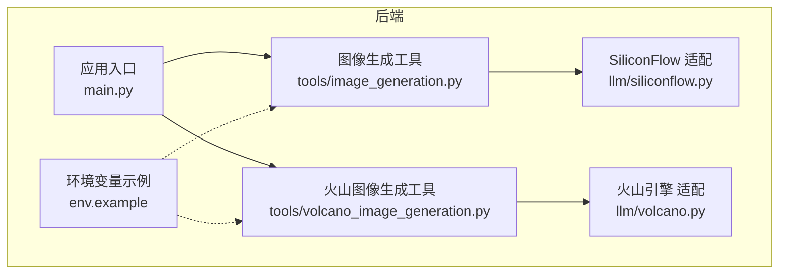
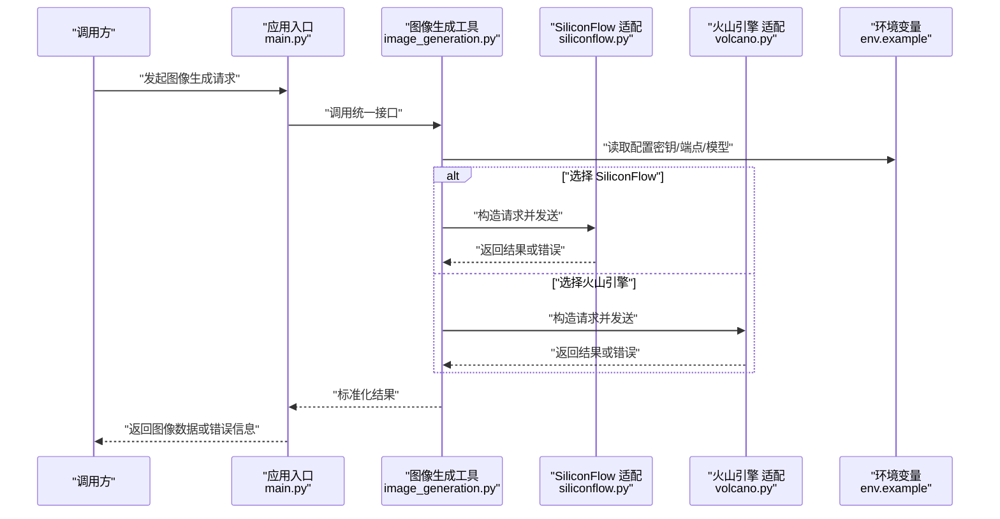
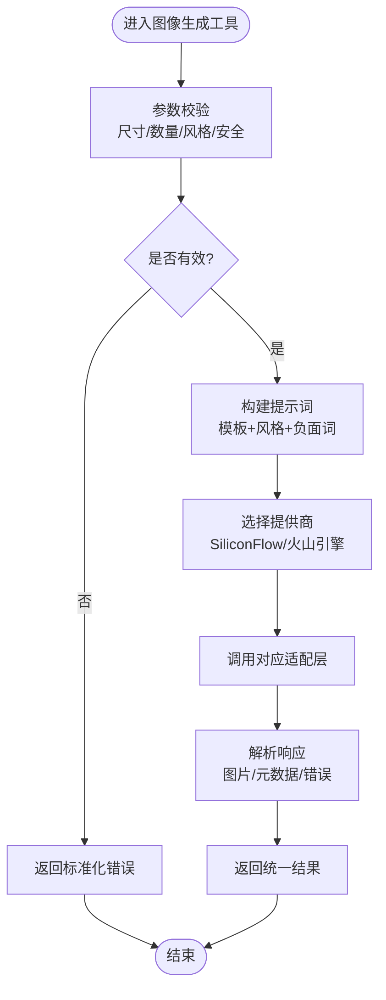
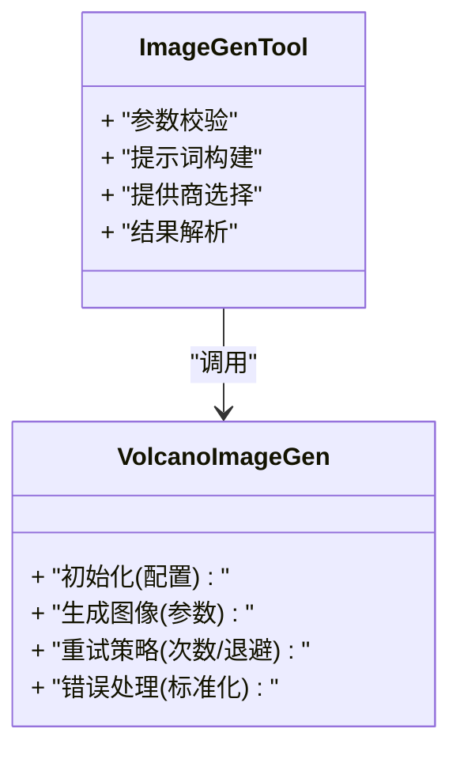
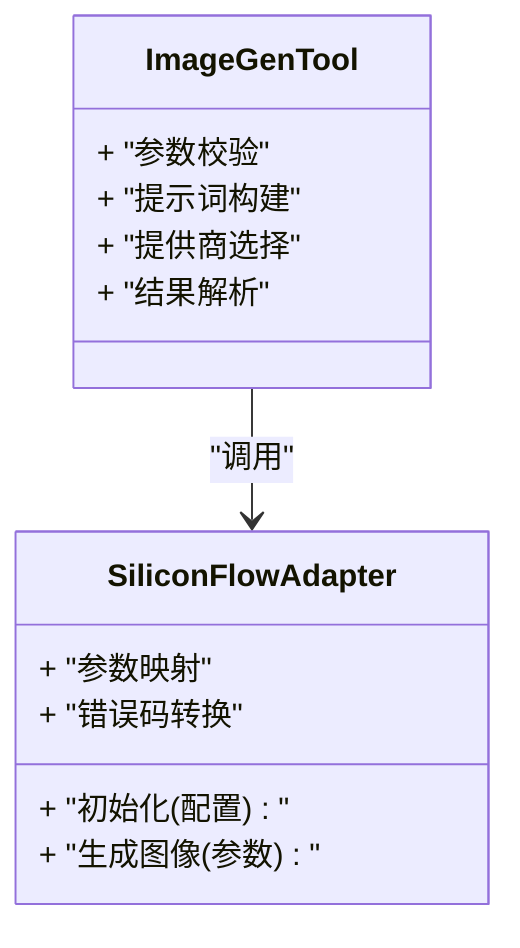
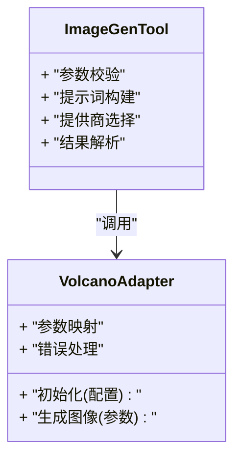
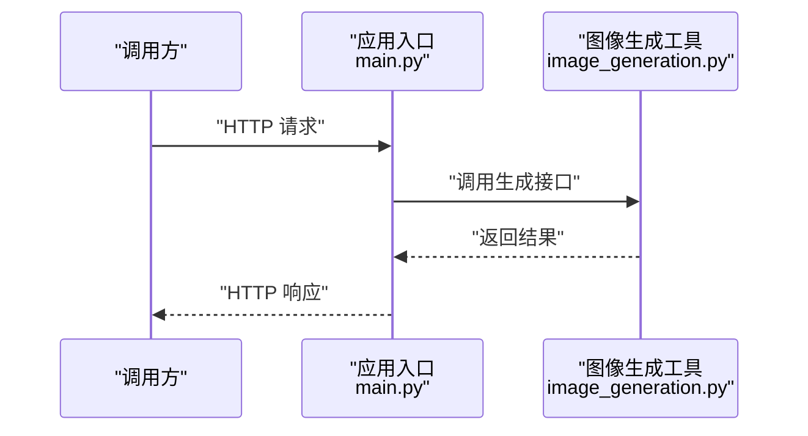
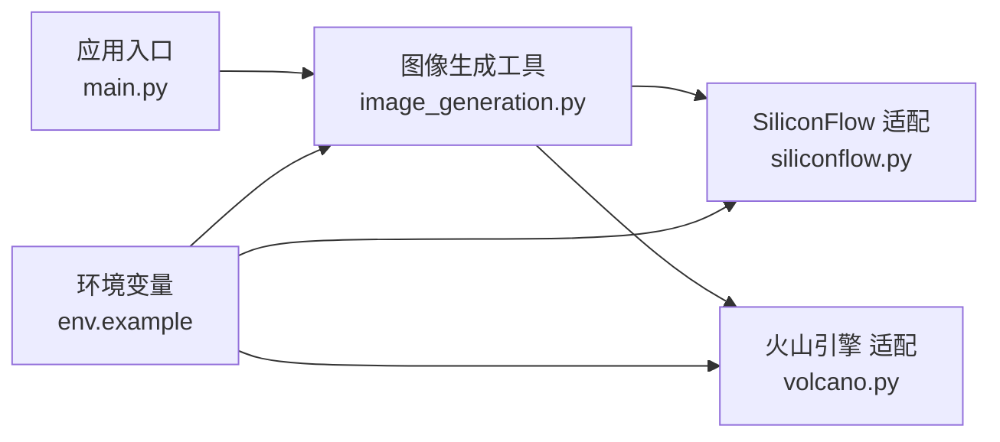

# 图像生成工具

<cite>
**本文引用的文件**   
- [image_generation.py](file://backend/app/tools/image_generation.py)
- [volcano_image_generation.py](file://backend/app/tools/volcano_image_generation.py)
- [siliconflow.py](file://backend/app/llm/siliconflow.py)
- [volcano.py](file://backend/app/llm/volcano.py)
- [main.py](file://backend/app/main.py)
- [env.example](file://backend/env.example)
</cite>

## 目录
1. [简介](#简介)
2. [项目结构](#项目结构)
3. [核心组件](#核心组件)
4. [架构总览](#架构总览)
5. [详细组件分析](#详细组件分析)
6. [依赖关系分析](#依赖关系分析)
7. [性能与成本优化](#性能与成本优化)
8. [故障排查指南](#故障排查指南)
9. [结论](#结论)
10. [附录](#附录)

## 简介
本文件面向“图像生成工具”的开发者与使用者，系统性梳理后端图像生成的核心算法、模型集成、提示词工程、多提供商API接入（SiliconFlow、火山引擎）、参数映射、错误处理、尺寸控制、风格迁移、批量处理、流水线设计、缓存策略、异步机制以及质量优化、成本控制与安全过滤的最佳实践。文档以仓库中的实际实现为依据，结合可视化图示帮助读者快速理解系统结构与关键流程。

## 项目结构
本项目在后端模块中提供图像生成能力，主要涉及：
- 工具层：封装图像生成调用逻辑，统一对外暴露接口
- LLM/服务适配层：对接不同提供商（如 SiliconFlow、火山引擎）的图像生成API
- 应用入口：注册路由或任务入口，供上层编排调用

图表来源
- [main.py:1-200](file://backend/app/main.py#L1-L200)
- [image_generation.py:1-200](file://backend/app/tools/image_generation.py#L1-L200)
- [volcano_image_generation.py:1-200](file://backend/app/tools/volcano_image_generation.py#L1-L200)
- [siliconflow.py:1-200](file://backend/app/llm/siliconflow.py#L1-L200)
- [volcano.py:1-200](file://backend/app/llm/volcano.py#L1-L200)
- [env.example:1-200](file://backend/env.example#L1-L200)

章节来源
- [main.py:1-200](file://backend/app/main.py#L1-L200)
- [image_generation.py:1-200](file://backend/app/tools/image_generation.py#L1-L200)
- [volcano_image_generation.py:1-200](file://backend/app/tools/volcano_image_generation.py#L1-L200)
- [siliconflow.py:1-200](file://backend/app/llm/siliconflow.py#L1-L200)
- [volcano.py:1-200](file://backend/app/llm/volcano.py#L1-L200)
- [env.example:1-200](file://backend/env.example#L1-L200)

## 核心组件
- 图像生成工具（通用封装）
  - 职责：统一参数校验、提示词预处理、调用选择、结果解析与错误归一化
  - 关键点：支持多提供商切换、尺寸与风格参数映射、批量任务组织
- 火山图像生成工具（火山引擎专用）
  - 职责：对接火山图像生成API，处理鉴权、请求构造、响应解码与重试
- SiliconFlow 适配层
  - 职责：封装对 SiliconFlow 图像生成服务的调用细节（认证、参数、错误码）
- 火山引擎适配层
  - 职责：封装对火山引擎图像生成服务的调用细节（认证、参数、错误码）
- 应用入口
  - 职责：注册路由或任务入口，将图像生成功能暴露给上层调用方
- 环境变量配置
  - 职责：集中管理密钥、端点、默认模型与并发限制等运行期配置

章节来源
- [image_generation.py:1-200](file://backend/app/tools/image_generation.py#L1-L200)
- [volcano_image_generation.py:1-200](file://backend/app/tools/volcano_image_generation.py#L1-L200)
- [siliconflow.py:1-200](file://backend/app/llm/siliconflow.py#L1-L200)
- [volcano.py:1-200](file://backend/app/llm/volcano.py#L1-L200)
- [main.py:1-200](file://backend/app/main.py#L1-L200)
- [env.example:1-200](file://backend/env.example#L1-L200)

## 架构总览
下图展示了从应用入口到具体提供商适配层的调用路径，以及配置与环境变量的注入方式。

图表来源
- [main.py:1-200](file://backend/app/main.py#L1-L200)
- [image_generation.py:1-200](file://backend/app/tools/image_generation.py#L1-L200)
- [siliconflow.py:1-200](file://backend/app/llm/siliconflow.py#L1-L200)
- [volcano.py:1-200](file://backend/app/llm/volcano.py#L1-L200)
- [env.example:1-200](file://backend/env.example#L1-L200)

## 详细组件分析

### 图像生成工具（通用封装）
- 功能要点
  - 参数校验：尺寸、比例、数量、风格、安全等级等
  - 提示词工程：基础提示词模板、风格后缀、负面提示词拼接
  - 提供商选择：根据配置或请求参数动态选择 SiliconFlow 或火山引擎
  - 结果解析：统一返回格式（图片URL/二进制、元数据、耗时、费用估算）
  - 错误归一化：将不同提供商的错误码转换为内部标准错误对象
- 典型流程
  - 接收请求 -> 校验参数 -> 构建提示词 -> 选择提供商 -> 调用适配层 -> 解析结果 -> 返回

图表来源
- [image_generation.py:1-200](file://backend/app/tools/image_generation.py#L1-L200)

章节来源
- [image_generation.py:1-200](file://backend/app/tools/image_generation.py#L1-L200)

### 火山图像生成工具（火山引擎专用）
- 功能要点
  - 鉴权：使用环境变量中的密钥进行签名或Token获取
  - 请求构造：按火山引擎API规范组装参数（模型、尺寸、风格、数量等）
  - 响应处理：下载图片、解析任务状态、重试策略
  - 错误处理：网络异常、鉴权失败、配额不足、内容审核拦截等
- 与通用工具的协作
  - 作为提供商适配器被通用工具调用，屏蔽底层差异

图表来源
- [volcano_image_generation.py:1-200](file://backend/app/tools/volcano_image_generation.py#L1-L200)
- [image_generation.py:1-200](file://backend/app/tools/image_generation.py#L1-L200)

章节来源
- [volcano_image_generation.py:1-200](file://backend/app/tools/volcano_image_generation.py#L1-L200)
- [image_generation.py:1-200](file://backend/app/tools/image_generation.py#L1-L200)

### SiliconFlow 适配层
- 功能要点
  - 鉴权：通过环境变量注入的密钥或Token访问服务
  - 参数映射：将通用参数映射为 SiliconFlow API 所需字段
  - 错误码转换：将平台错误码映射为内部标准错误
- 与通用工具的协作
  - 作为提供商适配器被通用工具调用

图表来源
- [siliconflow.py:1-200](file://backend/app/llm/siliconflow.py#L1-L200)
- [image_generation.py:1-200](file://backend/app/tools/image_generation.py#L1-L200)

章节来源
- [siliconflow.py:1-200](file://backend/app/llm/siliconflow.py#L1-L200)
- [image_generation.py:1-200](file://backend/app/tools/image_generation.py#L1-L200)

### 火山引擎适配层
- 功能要点
  - 鉴权：按火山引擎要求完成签名或Token获取
  - 参数映射：尺寸、比例、风格、数量等字段映射
  - 错误处理：网络、鉴权、配额、内容审核等错误分类与重试
- 与通用工具的协作
  - 作为提供商适配器被通用工具调用

图表来源
- [volcano.py:1-200](file://backend/app/llm/volcano.py#L1-L200)
- [image_generation.py:1-200](file://backend/app/tools/image_generation.py#L1-L200)

章节来源
- [volcano.py:1-200](file://backend/app/llm/volcano.py#L1-L200)
- [image_generation.py:1-200](file://backend/app/tools/image_generation.py#L1-L200)

### 应用入口（路由/任务）
- 功能要点
  - 注册图像生成相关路由或任务入口
  - 将外部请求转发至图像生成工具
  - 统一响应格式与错误包装
- 与工具层的协作
  - 作为上层编排者，调用工具层完成具体生成逻辑

图表来源
- [main.py:1-200](file://backend/app/main.py#L1-L200)
- [image_generation.py:1-200](file://backend/app/tools/image_generation.py#L1-L200)

章节来源
- [main.py:1-200](file://backend/app/main.py#L1-L200)
- [image_generation.py:1-200](file://backend/app/tools/image_generation.py#L1-L200)

### 环境变量与配置
- 作用
  - 集中管理各提供商的密钥、端点、默认模型、并发限制、超时等
- 建议
  - 在部署时通过环境变量注入，避免硬编码
  - 提供默认值与校验，确保启动时配置可用

章节来源
- [env.example:1-200](file://backend/env.example#L1-L200)

## 依赖关系分析
- 组件耦合
  - 应用入口依赖图像生成工具
  - 图像生成工具依赖各提供商适配层
  - 适配层依赖环境变量配置
- 外部依赖
  - SiliconFlow 图像生成API
  - 火山引擎图像生成API
- 潜在风险
  - 循环依赖：应避免工具层反向依赖适配层之外的模块
  - 配置缺失：启动时需校验必要环境变量

图表来源
- [main.py:1-200](file://backend/app/main.py#L1-L200)
- [image_generation.py:1-200](file://backend/app/tools/image_generation.py#L1-L200)
- [siliconflow.py:1-200](file://backend/app/llm/siliconflow.py#L1-L200)
- [volcano.py:1-200](file://backend/app/llm/volcano.py#L1-L200)
- [env.example:1-200](file://backend/env.example#L1-L200)

章节来源
- [main.py:1-200](file://backend/app/main.py#L1-L200)
- [image_generation.py:1-200](file://backend/app/tools/image_generation.py#L1-L200)
- [siliconflow.py:1-200](file://backend/app/llm/siliconflow.py#L1-L200)
- [volcano.py:1-200](file://backend/app/llm/volcano.py#L1-L200)
- [env.example:1-200](file://backend/env.example#L1-L200)

## 性能与成本优化
- 并发与限流
  - 针对高并发场景，合理设置并发上限与队列长度，避免下游服务过载
  - 使用指数退避与熔断策略降低雪崩风险
- 缓存策略
  - 基于提示词哈希与参数指纹建立缓存键，命中后直接返回结果
  - 区分冷热数据，热点结果短期缓存，长尾结果长期归档
- 异步处理
  - 将耗时任务放入消息队列，采用异步回调或轮询获取结果
  - 前端展示进度与占位图，提升用户体验
- 成本控制
  - 优先选择性价比高的模型与分辨率
  - 批量合并请求，减少重复计算
  - 监控调用量与费用，设置阈值告警
- 质量优化
  - 引入提示词模板库与A/B测试，持续优化效果
  - 对输出进行二次裁剪、压缩与水印处理，平衡画质与体积

[本节为通用指导，不直接分析具体文件]

## 故障排查指南
- 常见问题
  - 鉴权失败：检查环境变量中的密钥与权限范围
  - 参数非法：核对尺寸、比例、数量等是否在允许范围内
  - 内容审核拦截：调整提示词或安全等级，必要时人工复核
  - 网络超时：增加重试次数与超时时间，检查网络连通性
- 定位方法
  - 查看日志中的错误码与堆栈信息
  - 对比不同提供商的错误码映射表
  - 使用最小可复现参数集逐步缩小问题范围

章节来源
- [image_generation.py:1-200](file://backend/app/tools/image_generation.py#L1-L200)
- [volcano_image_generation.py:1-200](file://backend/app/tools/volcano_image_generation.py#L1-L200)
- [siliconflow.py:1-200](file://backend/app/llm/siliconflow.py#L1-L200)
- [volcano.py:1-200](file://backend/app/llm/volcano.py#L1-L200)

## 结论
本图像生成工具通过统一的工具层与多提供商适配层，实现了灵活的图像生成能力。借助提示词工程、参数映射与错误归一化，系统在易用性与稳定性方面取得良好平衡。配合缓存、异步与限流策略，可在保证质量的同时有效控制成本与风险。建议在生产环境中完善监控与审计，持续优化提示词模板与模型选择策略。

[本节为总结性内容，不直接分析具体文件]

## 附录
- 最佳实践清单
  - 提示词工程：结构化模板、风格后缀、负面词库、版本化管理
  - 尺寸控制：固定比例模板、自动缩放、分辨率档位
  - 风格迁移：风格标签体系、权重调节、组合策略
  - 批量处理：分片提交、去重合并、进度追踪
  - 安全过滤：敏感词检测、内容审核、白名单模型
  - 成本控制：模型分级、按需降级、用量统计
  - 异步机制：任务队列、回调通知、幂等设计
  - 缓存策略：键设计、过期策略、一致性保障

[本节为概念性内容，不直接分析具体文件]