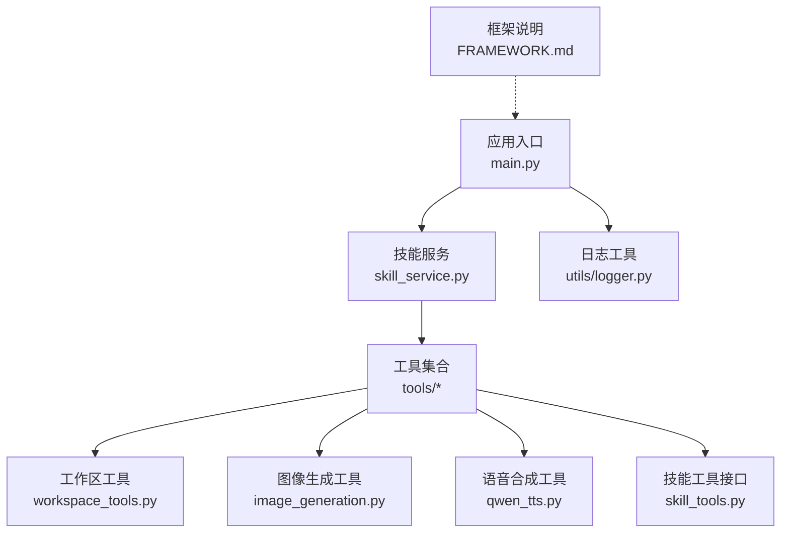
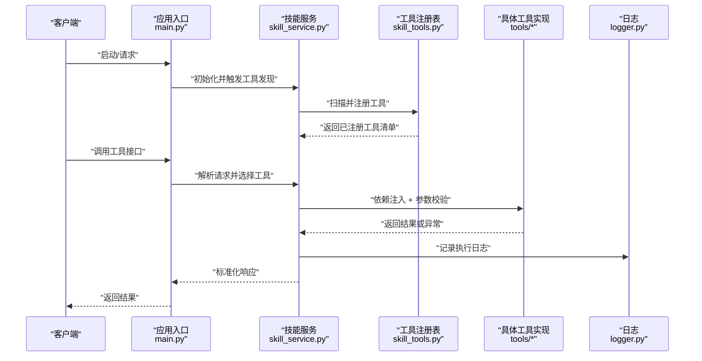
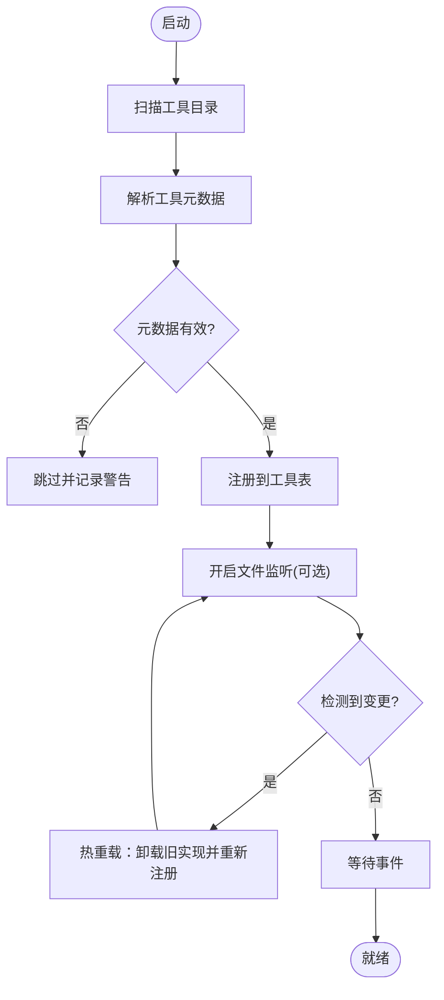
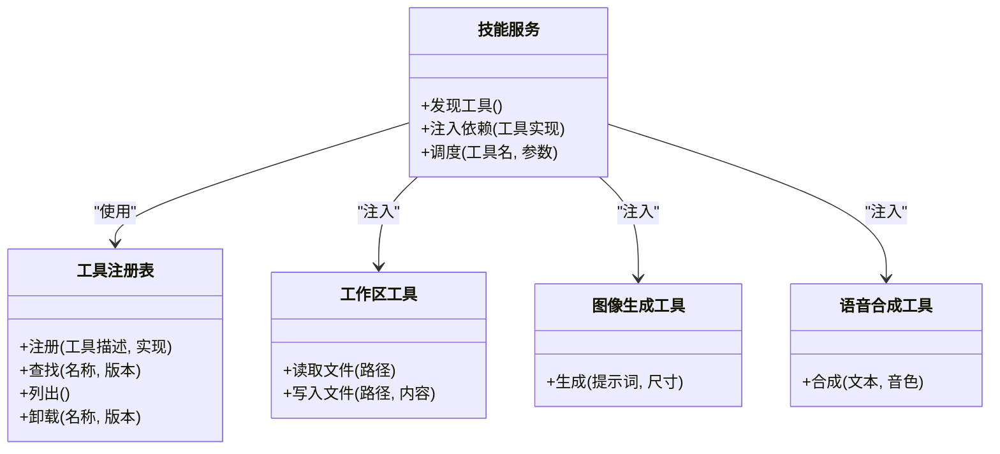
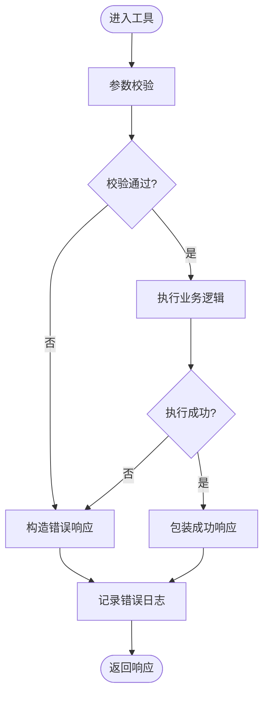
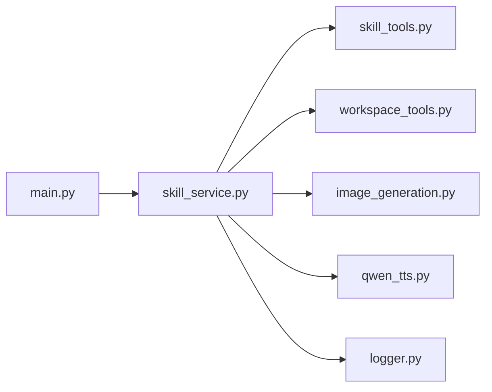

# 工具注册与调用机制

<cite>
**本文引用的文件**   
- [backend/app/main.py](file://backend/app/main.py)
- [backend/app/services/skill_service.py](file://backend/app/services/skill_service.py)
- [backend/app/tools/skill_tools.py](file://backend/app/tools/skill_tools.py)
- [backend/app/tools/workspace_tools.py](file://backend/app/tools/workspace_tools.py)
- [backend/app/tools/image_generation.py](file://backend/app/tools/image_generation.py)
- [backend/app/tools/qwen_tts.py](file://backend/app/tools/qwen_tts.py)
- [backend/app/utils/logger.py](file://backend/app/utils/logger.py)
- [backend/FRAMEWORK.md](file://backend/FRAMEWORK.md)
</cite>

## 目录
1. [简介](#简介)
2. [项目结构](#项目结构)
3. [核心组件](#核心组件)
4. [架构总览](#架构总览)
5. [详细组件分析](#详细组件分析)
6. [依赖分析](#依赖分析)
7. [性能考虑](#性能考虑)
8. [故障排查指南](#故障排查指南)
9. [结论](#结论)
10. [附录](#附录)

## 简介
本文件系统化阐述后端“工具注册与调用机制”，覆盖动态加载、注册协议、依赖注入、元数据定义、参数校验、返回值处理、工具发现、版本管理、热重载支持、工具间通信、错误传播与日志策略，并提供新工具注册的完整流程与最佳实践。目标是帮助开发者快速理解并扩展系统能力，同时保证稳定性与可维护性。

## 项目结构
后端采用分层组织：入口服务、路由层、服务层、工具层、通用工具与配置。工具相关代码集中在 tools 与 services 目录，日志与框架说明位于 utils 与根文档。

图表来源
- [backend/app/main.py](file://backend/app/main.py)
- [backend/app/services/skill_service.py](file://backend/app/services/skill_service.py)
- [backend/app/tools/skill_tools.py](file://backend/app/tools/skill_tools.py)
- [backend/app/tools/workspace_tools.py](file://backend/app/tools/workspace_tools.py)
- [backend/app/tools/image_generation.py](file://backend/app/tools/image_generation.py)
- [backend/app/tools/qwen_tts.py](file://backend/app/tools/qwen_tts.py)
- [backend/app/utils/logger.py](file://backend/app/utils/logger.py)
- [backend/FRAMEWORK.md](file://backend/FRAMEWORK.md)

章节来源
- [backend/app/main.py](file://backend/app/main.py)
- [backend/app/services/skill_service.py](file://backend/app/services/skill_service.py)
- [backend/app/tools/skill_tools.py](file://backend/app/tools/skill_tools.py)
- [backend/app/tools/workspace_tools.py](file://backend/app/tools/workspace_tools.py)
- [backend/app/tools/image_generation.py](file://backend/app/tools/image_generation.py)
- [backend/app/tools/qwen_tts.py](file://backend/app/tools/qwen_tts.py)
- [backend/app/utils/logger.py](file://backend/app/utils/logger.py)
- [backend/FRAMEWORK.md](file://backend/FRAMEWORK.md)

## 核心组件
- 应用入口 main.py：负责初始化服务、挂载路由、启动生命周期钩子（如工具发现与注册）。
- 技能服务 skill_service.py：提供工具发现、注册、版本管理与运行时调度能力，是工具生态的核心编排器。
- 工具接口与实现：
  - skill_tools.py：定义统一的工具抽象与注册协议，供具体工具实现遵循。
  - workspace_tools.py：工作区相关工具（文件、目录、资源管理等）。
  - image_generation.py：图像生成类工具（封装外部模型或 API）。
  - qwen_tts.py：文本转语音工具（封装外部 TTS 服务）。
- 日志工具 logger.py：统一日志记录策略，贯穿工具执行链路。
- 框架说明 FRAMEWORK.md：约定整体设计原则、命名规范与扩展点。

章节来源
- [backend/app/main.py](file://backend/app/main.py)
- [backend/app/services/skill_service.py](file://backend/app/services/skill_service.py)
- [backend/app/tools/skill_tools.py](file://backend/app/tools/skill_tools.py)
- [backend/app/tools/workspace_tools.py](file://backend/app/tools/workspace_tools.py)
- [backend/app/tools/image_generation.py](file://backend/app/tools/image_generation.py)
- [backend/app/tools/qwen_tts.py](file://backend/app/tools/qwen_tts.py)
- [backend/app/utils/logger.py](file://backend/app/utils/logger.py)
- [backend/FRAMEWORK.md](file://backend/FRAMEWORK.md)

## 架构总览
下图展示从请求到工具调用的端到端流程，包括工具发现、注册、依赖注入、参数校验、执行与返回。

图表来源
- [backend/app/main.py](file://backend/app/main.py)
- [backend/app/services/skill_service.py](file://backend/app/services/skill_service.py)
- [backend/app/tools/skill_tools.py](file://backend/app/tools/skill_tools.py)
- [backend/app/tools/workspace_tools.py](file://backend/app/tools/workspace_tools.py)
- [backend/app/tools/image_generation.py](file://backend/app/tools/image_generation.py)
- [backend/app/tools/qwen_tts.py](file://backend/app/tools/qwen_tts.py)
- [backend/app/utils/logger.py](file://backend/app/utils/logger.py)

## 详细组件分析

### 工具注册与发现（动态加载）
- 动态加载：通过反射或约定式扫描在启动时自动发现 tools 目录下的工具模块，避免硬编码导入。
- 注册协议：每个工具需暴露统一的描述元数据与可调用的函数签名，由注册表收集并索引。
- 版本管理：工具元数据包含版本号，注册表按名称+版本进行唯一标识，支持多版本并存与默认版本选择。
- 热重载：在开发模式下监听工具文件变更，重新扫描并替换注册表中的旧实现，无需重启服务。

图表来源
- [backend/app/services/skill_service.py](file://backend/app/services/skill_service.py)
- [backend/app/tools/skill_tools.py](file://backend/app/tools/skill_tools.py)

章节来源
- [backend/app/services/skill_service.py](file://backend/app/services/skill_service.py)
- [backend/app/tools/skill_tools.py](file://backend/app/tools/skill_tools.py)

### 依赖注入模式
- 注入目标：工具对外部服务（如存储、网络、第三方 SDK）的依赖通过构造或方法参数注入，降低耦合。
- 作用域：单例或按需创建，依据工具状态与并发需求决定。
- 生命周期：随应用启动创建，随关闭释放；热重载时需安全销毁旧实例并重建新实例。
- 示例：工作区工具注入文件系统访问器；TTS 工具注入 HTTP 客户端与鉴权信息。

图表来源
- [backend/app/services/skill_service.py](file://backend/app/services/skill_service.py)
- [backend/app/tools/skill_tools.py](file://backend/app/tools/skill_tools.py)
- [backend/app/tools/workspace_tools.py](file://backend/app/tools/workspace_tools.py)
- [backend/app/tools/image_generation.py](file://backend/app/tools/image_generation.py)
- [backend/app/tools/qwen_tts.py](file://backend/app/tools/qwen_tts.py)

章节来源
- [backend/app/services/skill_service.py](file://backend/app/services/skill_service.py)
- [backend/app/tools/skill_tools.py](file://backend/app/tools/skill_tools.py)
- [backend/app/tools/workspace_tools.py](file://backend/app/tools/workspace_tools.py)
- [backend/app/tools/image_generation.py](file://backend/app/tools/image_generation.py)
- [backend/app/tools/qwen_tts.py](file://backend/app/tools/qwen_tts.py)

### 工具元数据定义
- 必需字段：名称、版本、描述、作者、许可证、输入参数 Schema、输出类型、错误码约定、依赖列表。
- 可选字段：标签、分类、速率限制、缓存策略、超时时间、重试策略。
- 校验规则：注册阶段对元数据进行静态校验，缺失必填项或类型不匹配将拒绝注册并记录告警。

章节来源
- [backend/app/tools/skill_tools.py](file://backend/app/tools/skill_tools.py)
- [backend/FRAMEWORK.md](file://backend/FRAMEWORK.md)

### 参数验证与返回值处理
- 参数验证：基于 Schema 进行类型、范围、必填项校验；失败时返回结构化错误对象，包含错误码与定位信息。
- 返回值处理：统一包装为成功/失败两种形态，成功包含数据与追踪 ID，失败包含错误详情与上下文。
- 流式返回：对于长耗时任务，支持分块返回与进度回调，便于前端渲染与中断控制。

图表来源
- [backend/app/tools/skill_tools.py](file://backend/app/tools/skill_tools.py)
- [backend/app/utils/logger.py](file://backend/app/utils/logger.py)

章节来源
- [backend/app/tools/skill_tools.py](file://backend/app/tools/skill_tools.py)
- [backend/app/utils/logger.py](file://backend/app/utils/logger.py)

### 工具间通信协议
- 同步调用：直接函数调用，适用于轻量操作与本地资源访问。
- 异步任务：通过消息队列或事件总线发起任务，返回任务 ID 用于查询进度与结果。
- 共享状态：通过注入的服务（如缓存、数据库）进行跨工具状态共享，避免全局变量。
- 幂等与重试：对写操作提供幂等键，结合重试与退避策略提升鲁棒性。

章节来源
- [backend/app/services/skill_service.py](file://backend/app/services/skill_service.py)
- [backend/app/tools/workspace_tools.py](file://backend/app/tools/workspace_tools.py)

### 错误传播与日志记录策略
- 错误传播：工具内部异常转换为标准错误对象，携带错误码、消息与堆栈摘要；上层统一捕获并记录。
- 日志级别：DEBUG 用于调试，INFO 用于关键步骤，WARN 用于可恢复异常，ERROR 用于不可恢复异常。
- 结构化日志：包含请求 ID、工具名、参数摘要、耗时、状态码，便于追踪与分析。
- 敏感信息脱敏：对密钥、用户隐私字段进行掩码处理。

章节来源
- [backend/app/utils/logger.py](file://backend/app/utils/logger.py)
- [backend/app/tools/skill_tools.py](file://backend/app/tools/skill_tools.py)

### 版本管理与兼容性
- 语义化版本：主版本不兼容变更，次版本新增功能，修订版本修复问题。
- 默认版本：注册表维护当前默认版本，可通过路由参数指定版本。
- 弃用策略：标记弃用版本，给出迁移指引与保留期。
- 回滚支持：热重载失败时可回滚至上一稳定版本。

章节来源
- [backend/app/services/skill_service.py](file://backend/app/services/skill_service.py)
- [backend/app/tools/skill_tools.py](file://backend/app/tools/skill_tools.py)

### 热重载支持
- 文件监听：监控工具目录与配置文件变更，增量更新注册表。
- 原子切换：先构建新实例，再原子替换引用，确保无中断。
- 清理资源：卸载旧实例前释放锁、连接与定时器。
- 灰度发布：支持按流量比例切换新版本，逐步放量。

章节来源
- [backend/app/services/skill_service.py](file://backend/app/services/skill_service.py)

## 依赖分析
- 松耦合：工具通过注册表与服务层交互，避免直接依赖彼此。
- 内聚性：每个工具聚焦单一职责，元数据与实现分离。
- 外部依赖：网络客户端、文件系统、第三方 SDK 通过注入方式接入，便于测试与替换。
- 潜在循环：应避免工具之间互相调用形成环，必要时引入事件总线解耦。

图表来源
- [backend/app/main.py](file://backend/app/main.py)
- [backend/app/services/skill_service.py](file://backend/app/services/skill_service.py)
- [backend/app/tools/skill_tools.py](file://backend/app/tools/skill_tools.py)
- [backend/app/tools/workspace_tools.py](file://backend/app/tools/workspace_tools.py)
- [backend/app/tools/image_generation.py](file://backend/app/tools/image_generation.py)
- [backend/app/tools/qwen_tts.py](file://backend/app/tools/qwen_tts.py)
- [backend/app/utils/logger.py](file://backend/app/utils/logger.py)

章节来源
- [backend/app/main.py](file://backend/app/main.py)
- [backend/app/services/skill_service.py](file://backend/app/services/skill_service.py)
- [backend/app/tools/skill_tools.py](file://backend/app/tools/skill_tools.py)
- [backend/app/tools/workspace_tools.py](file://backend/app/tools/workspace_tools.py)
- [backend/app/tools/image_generation.py](file://backend/app/tools/image_generation.py)
- [backend/app/tools/qwen_tts.py](file://backend/app/tools/qwen_tts.py)
- [backend/app/utils/logger.py](file://backend/app/utils/logger.py)

## 性能考虑
- 批量注册：启动时一次性扫描与注册，避免重复 IO。
- 懒加载：仅在首次调用时初始化重型依赖（如模型加载），并缓存实例。
- 并发控制：为外部 API 调用设置限流与超时，防止雪崩。
- 缓存策略：对读多写少的结果启用短期缓存，减少重复计算。
- 日志开销：生产环境降低 DEBUG 级别，避免频繁 I/O。

[本节为通用指导，不涉及具体文件分析]

## 故障排查指南
- 常见问题
  - 工具未注册：检查元数据是否齐全、命名是否冲突、版本是否合法。
  - 参数校验失败：核对 Schema 与传入参数类型、必填项。
  - 外部依赖不可用：确认网络连通、鉴权信息与配额。
  - 热重载无效：确认文件监听权限与增量更新逻辑。
- 定位手段
  - 查看结构化日志中的请求 ID 与错误码。
  - 启用 DEBUG 日志并复现问题。
  - 使用最小参数集隔离问题。
- 恢复建议
  - 回滚到上一个稳定版本。
  - 重置依赖连接池与缓存。
  - 重启服务以清理僵尸进程。

章节来源
- [backend/app/utils/logger.py](file://backend/app/utils/logger.py)
- [backend/app/tools/skill_tools.py](file://backend/app/tools/skill_tools.py)

## 结论
本机制通过统一的注册协议、严格的元数据校验、完善的依赖注入与日志策略，实现了工具的动态加载、版本管理与热重载支持。借助清晰的错误传播与通信协议，系统具备良好的可扩展性与稳定性。遵循本文的最佳实践，可高效地扩展新的工具能力并保持高质量交付。

[本节为总结性内容，不涉及具体文件分析]

## 附录

### 新工具注册完整流程
- 准备元数据：定义名称、版本、描述、输入输出 Schema、错误码、依赖列表。
- 实现工具：遵循统一接口，完成参数校验与业务逻辑，返回标准响应。
- 注册工具：在工具模块中声明注册信息，确保被扫描器发现。
- 依赖注入：通过构造或方法参数注入所需服务。
- 单元测试：覆盖正常路径、边界条件与错误场景。
- 集成测试：在真实环境中验证端到端流程与性能。
- 上线与灰度：提交后通过热重载或滚动更新部署，观察指标与日志。

章节来源
- [backend/app/tools/skill_tools.py](file://backend/app/tools/skill_tools.py)
- [backend/app/services/skill_service.py](file://backend/app/services/skill_service.py)
- [backend/FRAMEWORK.md](file://backend/FRAMEWORK.md)

### 最佳实践
- 保持工具单一职责，避免跨领域耦合。
- 严格遵循元数据与 Schema 约定，确保前后端一致。
- 使用结构化日志与追踪 ID，便于全链路排障。
- 对外部依赖设置超时、重试与熔断策略。
- 谨慎使用全局状态，优先通过注入服务共享。
- 为热重载设计幂等与资源清理逻辑。

章节来源
- [backend/FRAMEWORK.md](file://backend/FRAMEWORK.md)
- [backend/app/utils/logger.py](file://backend/app/utils/logger.py)