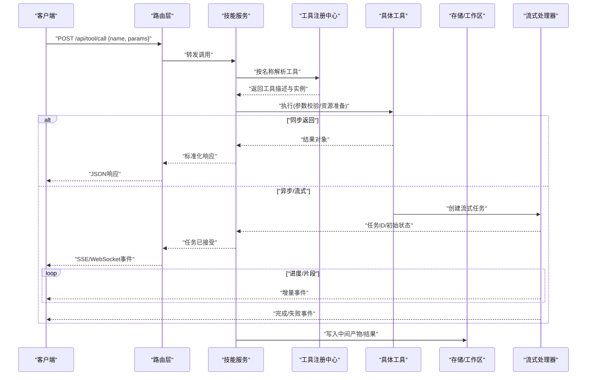
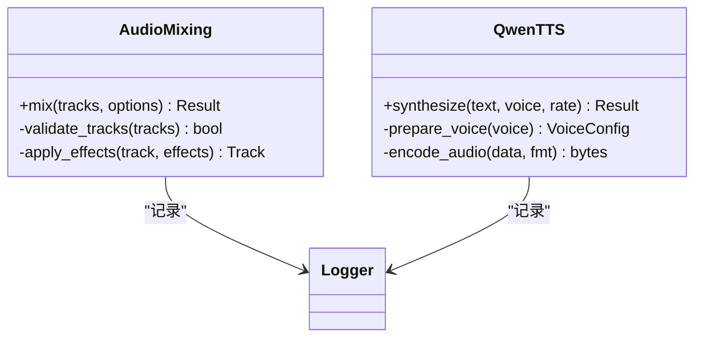
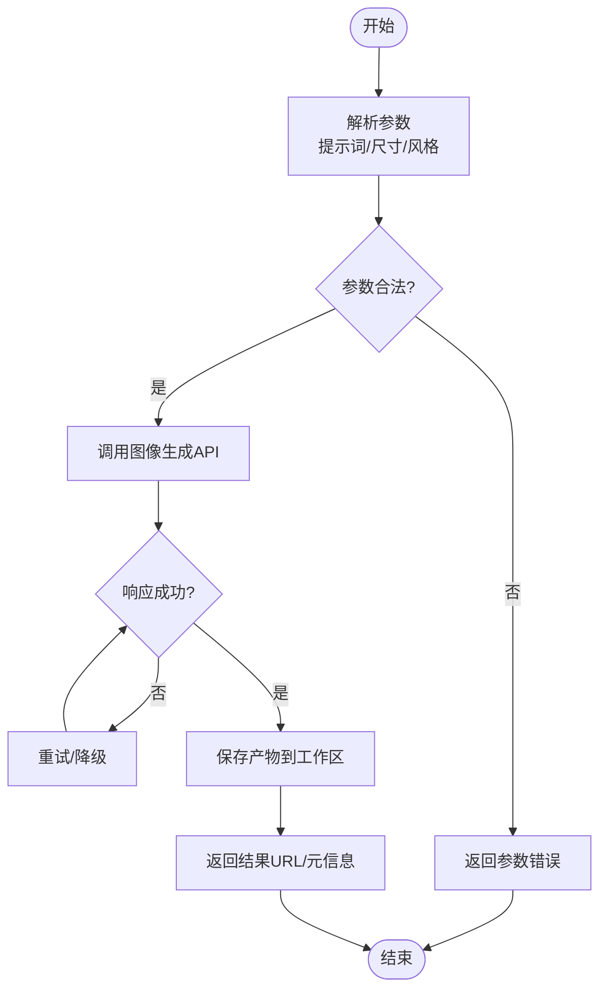
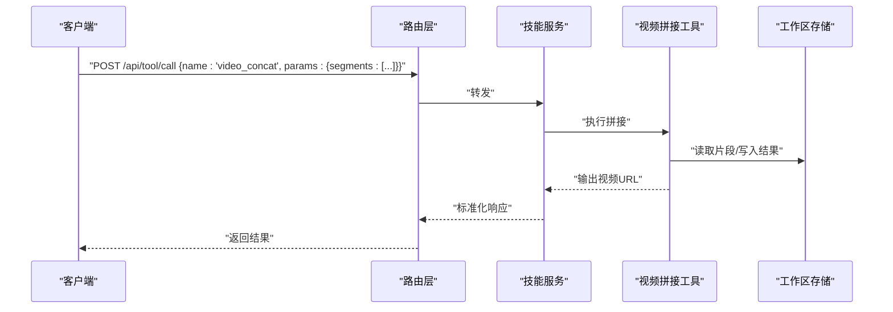
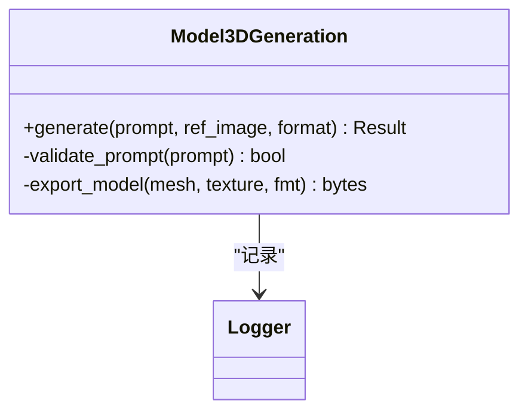
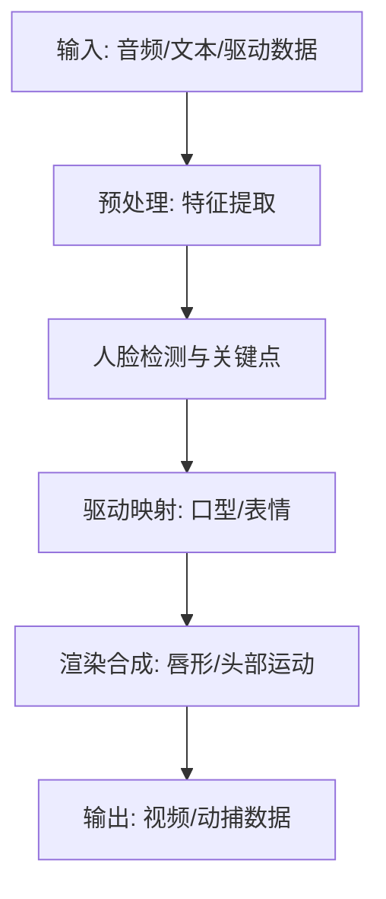
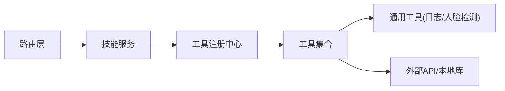

# 工具集架构

<cite>
**本文引用的文件**   
- [backend/app/main.py](file://backend/app/main.py)
- [backend/app/services/skill_service.py](file://backend/app/services/skill_service.py)
- [backend/app/tools/audio_mixing.py](file://backend/app/tools/audio_mixing.py)
- [backend/app/tools/qwen_tts.py](file://backend/app/tools/qwen_tts.py)
- [backend/app/tools/image_generation.py](file://backend/app/tools/image_generation.py)
- [backend/app/tools/volcano_image_generation.py](file://backend/app/tools/volcano_image_generation.py)
- [backend/app/tools/video_concatenation.py](file://backend/app/tools/video_concatenation.py)
- [backend/app/tools/volcano_video_generation.py](file://backend/app/tools/volcano_video_generation.py)
- [backend/app/tools/model_3d_generation.py](file://backend/app/tools/model_3d_generation.py)
- [backend/app/tools/virtual_anchor_generation.py](file://backend/app/tools/virtual_anchor_generation.py)
- [backend/app/tools/skill_tools.py](file://backend/app/tools/skill_tools.py)
- [backend/app/tools/workspace_tools.py](file://backend/app/tools/workspace_tools.py)
- [backend/app/utils/logger.py](file://backend/app/utils/logger.py)
- [backend/app/utils/face_detection.py](file://backend/app/utils/face_detection.py)
- [backend/app/routers/chat.py](file://backend/app/routers/chat.py)
- [backend/app/routers/settings.py](file://backend/app/routers/settings.py)
- [backend/app/services/stream_processor.py](file://backend/app/services/stream_processor.py)
- [backend/app/services/connection_manager.py](file://backend/app/services/connection_manager.py)
- [backend/app/services/history_service.py](file://backend/app/services/history_service.py)
- [backend/app/services/prompt.py](file://backend/app/services/prompt.py)
- [backend/app/services/agent_service.py](file://backend/app/services/agent_service.py)
- [backend/app/services/workspace_service.py](file://backend/app/services/workspace_service.py)
</cite>

## 目录
1. [简介](#简介)
2. [项目结构](#项目结构)
3. [核心组件](#核心组件)
4. [架构总览](#架构总览)
5. [详细组件分析](#详细组件分析)
6. [依赖关系分析](#依赖关系分析)
7. [性能考虑](#性能考虑)
8. [故障排查指南](#故障排查指南)
9. [结论](#结论)
10. [附录](#附录)

## 简介
本文件面向PolyStudio后端的“工具集”子系统，系统性说明工具的注册机制、调用协议与错误处理模式，并对音频处理（混合、TTS）、图像处理（生成、编辑）、视频处理（拼接、生成）、3D模型工具、虚拟主播工具等进行深入解析。文档同时覆盖工具间的数据流转、异步处理与资源管理策略，并提供新工具开发规范、测试方法与部署注意事项，以及性能调优与安全最佳实践。

## 项目结构
后端采用分层组织：路由层暴露HTTP接口，服务层编排业务流，工具层实现具体能力，通用工具与日志位于utils。工具以模块形式分布在tools目录下，按能力域划分；服务层通过统一的服务入口进行发现与调度。

```mermaid
graph TB
subgraph "应用入口"
Main["main.py"]
end
subgraph "路由层"
ChatRouter["routers/chat.py"]
SettingsRouter["routers/settings.py"]
end
subgraph "服务层"
SkillService["services/skill_service.py"]
StreamProc["services/stream_processor.py"]
ConnMgr["services/connection_manager.py"]
HistorySvc["services/history_service.py"]
PromptSvc["services/prompt.py"]
AgentSvc["services/agent_service.py"]
WorkspaceSvc["services/workspace_service.py"]
end
subgraph "工具层"
AudioMix["tools/audio_mixing.py"]
QwenTTS["tools/qwen_tts.py"]
ImgGen["tools/image_generation.py"]
VolcanoImg["tools/volcano_image_generation.py"]
VidConcat["tools/video_concatenation.py"]
VolcanoVid["tools/volcano_video_generation.py"]
Model3D["tools/model_3d_generation.py"]
VirtualAnchor["tools/virtual_anchor_generation.py"]
SkillTools["tools/skill_tools.py"]
WorkspaceTools["tools/workspace_tools.py"]
end
subgraph "通用工具"
Logger["utils/logger.py"]
FaceDet["utils/face_detection.py"]
end
Main --> ChatRouter
Main --> SettingsRouter
ChatRouter --> SkillService
SettingsRouter --> SkillService
SkillService --> AudioMix
SkillService --> QwenTTS
SkillService --> ImgGen
SkillService --> VolcanoImg
SkillService --> VidConcat
SkillService --> VolcanoVid
SkillService --> Model3D
SkillService --> VirtualAnchor
SkillService --> SkillTools
SkillService --> WorkspaceTools
SkillService --> StreamProc
SkillService --> ConnMgr
SkillService --> HistorySvc
SkillService --> PromptSvc
SkillService --> AgentSvc
SkillService --> WorkspaceSvc
AudioMix --> Logger
QwenTTS --> Logger
ImgGen --> Logger
VolcanoImg --> Logger
VidConcat --> Logger
VolcanoVid --> Logger
Model3D --> Logger
VirtualAnchor --> Logger
VirtualAnchor --> FaceDet
```

图示来源
- [backend/app/main.py](file://backend/app/main.py)
- [backend/app/routers/chat.py](file://backend/app/routers/chat.py)
- [backend/app/routers/settings.py](file://backend/app/routers/settings.py)
- [backend/app/services/skill_service.py](file://backend/app/services/skill_service.py)
- [backend/app/tools/audio_mixing.py](file://backend/app/tools/audio_mixing.py)
- [backend/app/tools/qwen_tts.py](file://backend/app/tools/qwen_tts.py)
- [backend/app/tools/image_generation.py](file://backend/app/tools/image_generation.py)
- [backend/app/tools/volcano_image_generation.py](file://backend/app/tools/volcano_image_generation.py)
- [backend/app/tools/video_concatenation.py](file://backend/app/tools/video_concatenation.py)
- [backend/app/tools/volcano_video_generation.py](file://backend/app/tools/volcano_video_generation.py)
- [backend/app/tools/model_3d_generation.py](file://backend/app/tools/model_3d_generation.py)
- [backend/app/tools/virtual_anchor_generation.py](file://backend/app/tools/virtual_anchor_generation.py)
- [backend/app/tools/skill_tools.py](file://backend/app/tools/skill_tools.py)
- [backend/app/tools/workspace_tools.py](file://backend/app/tools/workspace_tools.py)
- [backend/app/utils/logger.py](file://backend/app/utils/logger.py)
- [backend/app/utils/face_detection.py](file://backend/app/utils/face_detection.py)

章节来源
- [backend/app/main.py](file://backend/app/main.py)
- [backend/app/routers/chat.py](file://backend/app/routers/chat.py)
- [backend/app/routers/settings.py](file://backend/app/routers/settings.py)
- [backend/app/services/skill_service.py](file://backend/app/services/skill_service.py)

## 核心组件
- 工具注册中心：集中维护工具元数据与可调用实例，提供按名称查找、参数校验与版本兼容等能力。
- 工具调用协议：定义统一的输入输出契约（参数结构、返回值结构、错误码约定），支持同步与异步两种调用方式。
- 服务编排器：根据请求上下文选择并执行工具，负责参数拼装、结果归一化与中间产物管理。
- 流式处理器：对长耗时任务提供增量返回能力，结合连接管理器维持客户端连接。
- 工作区与历史服务：为工具提供持久化读写与对话上下文支撑。

章节来源
- [backend/app/services/skill_service.py](file://backend/app/services/skill_service.py)
- [backend/app/services/stream_processor.py](file://backend/app/services/stream_processor.py)
- [backend/app/services/connection_manager.py](file://backend/app/services/connection_manager.py)
- [backend/app/services/history_service.py](file://backend/app/services/history_service.py)
- [backend/app/services/workspace_service.py](file://backend/app/services/workspace_service.py)

## 架构总览
工具集采用“路由-服务-工具”三层解耦设计。路由仅做请求分发与鉴权，服务层负责编排与状态管理，工具层专注领域逻辑。所有工具通过注册中心暴露，调用方无需关心具体实现细节。

图示来源
- [backend/app/routers/chat.py](file://backend/app/routers/chat.py)
- [backend/app/services/skill_service.py](file://backend/app/services/skill_service.py)
- [backend/app/services/stream_processor.py](file://backend/app/services/stream_processor.py)
- [backend/app/services/connection_manager.py](file://backend/app/services/connection_manager.py)
- [backend/app/tools/audio_mixing.py](file://backend/app/tools/audio_mixing.py)
- [backend/app/tools/qwen_tts.py](file://backend/app/tools/qwen_tts.py)
- [backend/app/tools/image_generation.py](file://backend/app/tools/image_generation.py)
- [backend/app/tools/volcano_image_generation.py](file://backend/app/tools/volcano_image_generation.py)
- [backend/app/tools/video_concatenation.py](file://backend/app/tools/video_concatenation.py)
- [backend/app/tools/volcano_video_generation.py](file://backend/app/tools/volcano_video_generation.py)
- [backend/app/tools/model_3d_generation.py](file://backend/app/tools/model_3d_generation.py)
- [backend/app/tools/virtual_anchor_generation.py](file://backend/app/tools/virtual_anchor_generation.py)
- [backend/app/tools/skill_tools.py](file://backend/app/tools/skill_tools.py)
- [backend/app/tools/workspace_tools.py](file://backend/app/tools/workspace_tools.py)

## 详细组件分析

### 音频处理工具
- 音频混合：支持多轨音频叠加、音量调节、淡入淡出与格式转换。输入为音频路径或字节流，输出为合成后的音频文件URL或字节流。
- TTS（文本转语音）：基于Qwen TTS能力，将文本转换为语音，支持音色、语速与采样率配置。

图示来源
- [backend/app/tools/audio_mixing.py](file://backend/app/tools/audio_mixing.py)
- [backend/app/tools/qwen_tts.py](file://backend/app/tools/qwen_tts.py)
- [backend/app/utils/logger.py](file://backend/app/utils/logger.py)

章节来源
- [backend/app/tools/audio_mixing.py](file://backend/app/tools/audio_mixing.py)
- [backend/app/tools/qwen_tts.py](file://backend/app/tools/qwen_tts.py)

### 图像处理工具
- 图像生成：封装通用图像生成接口，支持提示词、尺寸、风格与质量参数。
- 火山图像生成：对接火山引擎的图像生成能力，提供专用参数映射与重试策略。

图示来源
- [backend/app/tools/image_generation.py](file://backend/app/tools/image_generation.py)
- [backend/app/tools/volcano_image_generation.py](file://backend/app/tools/volcano_image_generation.py)
- [backend/app/tools/workspace_tools.py](file://backend/app/tools/workspace_tools.py)

章节来源
- [backend/app/tools/image_generation.py](file://backend/app/tools/image_generation.py)
- [backend/app/tools/volcano_image_generation.py](file://backend/app/tools/volcano_image_generation.py)
- [backend/app/tools/workspace_tools.py](file://backend/app/tools/workspace_tools.py)

### 视频处理工具
- 视频拼接：按顺序合并多个视频片段，支持分辨率对齐、帧率统一与编码参数控制。
- 火山视频生成：对接火山引擎的视频生成能力，支持时长、分辨率与风格设置。

图示来源
- [backend/app/routers/chat.py](file://backend/app/routers/chat.py)
- [backend/app/services/skill_service.py](file://backend/app/services/skill_service.py)
- [backend/app/tools/video_concatenation.py](file://backend/app/tools/video_concatenation.py)
- [backend/app/tools/volcano_video_generation.py](file://backend/app/tools/volcano_video_generation.py)
- [backend/app/tools/workspace_tools.py](file://backend/app/tools/workspace_tools.py)

章节来源
- [backend/app/tools/video_concatenation.py](file://backend/app/tools/video_concatenation.py)
- [backend/app/tools/volcano_video_generation.py](file://backend/app/tools/volcano_video_generation.py)
- [backend/app/tools/workspace_tools.py](file://backend/app/tools/workspace_tools.py)

### 3D模型工具
- 3D模型生成：接收文本或参考图，生成基础几何体或纹理贴图，输出OBJ/GLB等格式。

图示来源
- [backend/app/tools/model_3d_generation.py](file://backend/app/tools/model_3d_generation.py)
- [backend/app/utils/logger.py](file://backend/app/utils/logger.py)

章节来源
- [backend/app/tools/model_3d_generation.py](file://backend/app/tools/model_3d_generation.py)

### 虚拟主播工具
- 虚拟主播生成：结合人脸检测与驱动数据，生成口型动画与表情序列，输出视频或动捕数据。

图示来源
- [backend/app/tools/virtual_anchor_generation.py](file://backend/app/tools/virtual_anchor_generation.py)
- [backend/app/utils/face_detection.py](file://backend/app/utils/face_detection.py)

章节来源
- [backend/app/tools/virtual_anchor_generation.py](file://backend/app/tools/virtual_anchor_generation.py)
- [backend/app/utils/face_detection.py](file://backend/app/utils/face_detection.py)

### 技能与工作区工具
- 技能工具：提供技能包加载、脚本执行与引用资源访问能力。
- 工作区工具：提供文件读写、目录管理与产物归档能力，作为工具产物的统一落盘点。

章节来源
- [backend/app/tools/skill_tools.py](file://backend/app/tools/skill_tools.py)
- [backend/app/tools/workspace_tools.py](file://backend/app/tools/workspace_tools.py)

## 依赖关系分析
- 低耦合：路由层不直接依赖工具，仅与服务层交互；服务层通过注册中心获取工具，避免硬编码。
- 内聚性：每个工具模块聚焦单一职责，内部复用日志与通用校验逻辑。
- 外部依赖：图像/视频/TTS等工具依赖第三方API或本地库，需通过配置开关与降级策略保障稳定性。

图示来源
- [backend/app/routers/chat.py](file://backend/app/routers/chat.py)
- [backend/app/services/skill_service.py](file://backend/app/services/skill_service.py)
- [backend/app/tools/audio_mixing.py](file://backend/app/tools/audio_mixing.py)
- [backend/app/tools/qwen_tts.py](file://backend/app/tools/qwen_tts.py)
- [backend/app/tools/image_generation.py](file://backend/app/tools/image_generation.py)
- [backend/app/tools/volcano_image_generation.py](file://backend/app/tools/volcano_image_generation.py)
- [backend/app/tools/video_concatenation.py](file://backend/app/tools/video_concatenation.py)
- [backend/app/tools/volcano_video_generation.py](file://backend/app/tools/volcano_video_generation.py)
- [backend/app/tools/model_3d_generation.py](file://backend/app/tools/model_3d_generation.py)
- [backend/app/tools/virtual_anchor_generation.py](file://backend/app/tools/virtual_anchor_generation.py)
- [backend/app/tools/skill_tools.py](file://backend/app/tools/skill_tools.py)
- [backend/app/tools/workspace_tools.py](file://backend/app/tools/workspace_tools.py)
- [backend/app/utils/logger.py](file://backend/app/utils/logger.py)
- [backend/app/utils/face_detection.py](file://backend/app/utils/face_detection.py)

章节来源
- [backend/app/services/skill_service.py](file://backend/app/services/skill_service.py)
- [backend/app/tools/skill_tools.py](file://backend/app/tools/skill_tools.py)

## 性能考虑
- 批处理与并行：对批量音频/图像/视频任务启用并发执行，限制最大并发度以避免资源争用。
- 缓存与去重：对相同参数的生成任务启用结果缓存，减少重复计算与外部API调用。
- 流式输出：长耗时任务使用流式处理器逐步推送进度与片段，降低前端等待时间。
- 资源回收：严格管理临时文件与内存缓冲，任务完成后及时释放句柄与清理磁盘空间。
- 编码优化：视频拼接时选择合适的编码器与预设，平衡质量与速度；必要时启用硬件加速。

[本节为通用指导，不涉及具体文件]

## 故障排查指南
- 日志定位：所有工具均通过统一日志模块记录关键步骤与异常堆栈，优先检索错误级别日志。
- 参数校验：多数失败源于非法或缺失参数，检查输入结构与类型是否符合工具契约。
- 外部依赖：图像/视频/TTS等工具依赖外部服务，关注超时、限流与鉴权失败等错误码。
- 资源不足：大文件处理可能触发磁盘或内存不足，检查工作区容量与进程内存占用。
- 流式中断：若SSE/WebSocket断开，客户端应支持断线重连与任务状态查询。

章节来源
- [backend/app/utils/logger.py](file://backend/app/utils/logger.py)
- [backend/app/services/stream_processor.py](file://backend/app/services/stream_processor.py)
- [backend/app/services/connection_manager.py](file://backend/app/services/connection_manager.py)

## 结论
本工具集通过清晰的注册机制与统一调用协议，实现了跨模态能力的灵活编排。服务层与工具层的解耦提升了扩展性与可维护性；流式处理与资源管理保障了用户体验与系统稳定性。遵循本文的开发规范、测试方法与部署建议，可快速构建高质量的新工具并安全高效地集成到现有系统中。

[本节为总结性内容，不涉及具体文件]

## 附录

### 工具注册机制
- 注册表结构：包含工具名称、版本、参数Schema、默认值、是否异步、能力标签等元数据。
- 动态发现：启动时扫描工具模块并自动注册，支持热更新与按需加载。
- 版本兼容：通过语义化版本与兼容性矩阵确保升级平滑。

章节来源
- [backend/app/services/skill_service.py](file://backend/app/services/skill_service.py)

### 调用协议
- 请求体：包含工具名、参数对象、可选的会话ID与回调地址。
- 响应体：统一包装成功/失败状态、数据载荷与追踪ID；流式任务返回任务ID与初始状态。
- 错误码：定义全局错误码与工具级错误码，便于前端展示与重试策略。

章节来源
- [backend/app/routers/chat.py](file://backend/app/routers/chat.py)
- [backend/app/services/skill_service.py](file://backend/app/services/skill_service.py)

### 错误处理模式
- 参数错误：立即返回，附带字段级错误信息。
- 运行时错误：捕获异常并记录堆栈，返回标准化错误响应。
- 外部服务错误：区分网络错误、鉴权失败与业务错误，提供重试与降级策略。
- 资源错误：磁盘满、内存不足等，返回明确提示与恢复建议。

章节来源
- [backend/app/utils/logger.py](file://backend/app/utils/logger.py)
- [backend/app/services/stream_processor.py](file://backend/app/services/stream_processor.py)

### 数据流转与中间产物
- 输入验证：在服务层进行参数校验与类型转换。
- 中间产物：工具在临时目录生成中间文件，由工作区服务统一管理生命周期。
- 结果落盘：最终产物写入工作区，返回稳定URL供前端消费。

章节来源
- [backend/app/tools/workspace_tools.py](file://backend/app/tools/workspace_tools.py)
- [backend/app/services/workspace_service.py](file://backend/app/services/workspace_service.py)

### 异步处理与资源管理
- 任务队列：长耗时任务进入队列，分配工作线程或进程池执行。
- 进度上报：通过流式处理器向客户端推送进度与片段。
- 资源回收：任务完成后清理临时文件、关闭句柄与释放内存。

章节来源
- [backend/app/services/stream_processor.py](file://backend/app/services/stream_processor.py)
- [backend/app/services/connection_manager.py](file://backend/app/services/connection_manager.py)

### 新工具开发规范
- 命名与路径：工具模块置于tools目录，文件名与工具名一致，保持小写下划线风格。
- 接口契约：实现标准输入输出结构，提供参数校验与错误码。
- 日志与监控：记录关键步骤、耗时与异常，便于排障与性能分析。
- 配置与开关：敏感信息与外部依赖通过环境变量或配置文件注入。
- 单元测试：覆盖正常路径、边界条件与错误分支，保证回归稳定。

章节来源
- [backend/app/tools/skill_tools.py](file://backend/app/tools/skill_tools.py)
- [backend/app/tools/workspace_tools.py](file://backend/app/tools/workspace_tools.py)

### 测试方法
- 单元与集成测试：针对工具函数与端到端调用流程编写用例。
- 模拟外部依赖：使用Mock替代真实API，确保测试可重复与隔离。
- 性能基准：对热点工具建立基准测试，评估吞吐与延迟。

[本节为通用指导，不涉及具体文件]

### 部署考虑
- 环境隔离：使用容器化部署，固定依赖版本，避免环境差异。
- 资源配额：为CPU/GPU、内存与磁盘设置合理上限，防止单任务拖垮系统。
- 健康检查：提供健康检查与就绪探针，配合负载均衡与滚动升级。
- 安全加固：最小权限原则、输入白名单、速率限制与审计日志。

[本节为通用指导，不涉及具体文件]

### 性能调优与安全最佳实践
- 性能调优：启用批处理与缓存、调整并发度、选择合适的编码与分辨率、利用硬件加速。
- 安全最佳实践：校验与过滤用户输入、限制文件大小与数量、保护密钥与令牌、启用HTTPS与鉴权、记录审计日志。

[本节为通用指导，不涉及具体文件]