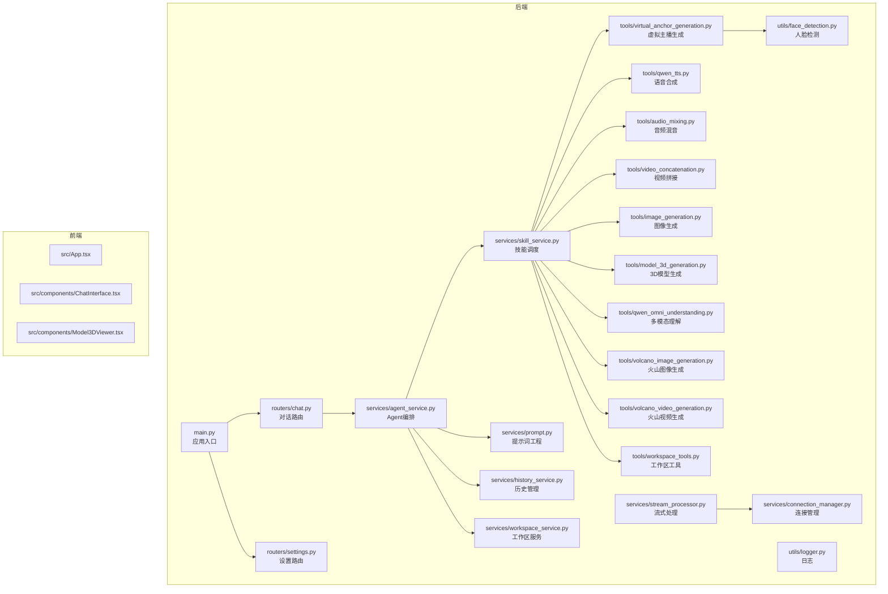
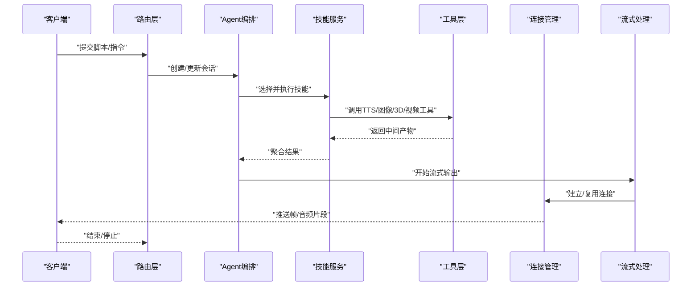
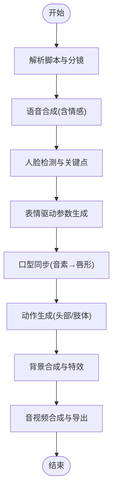
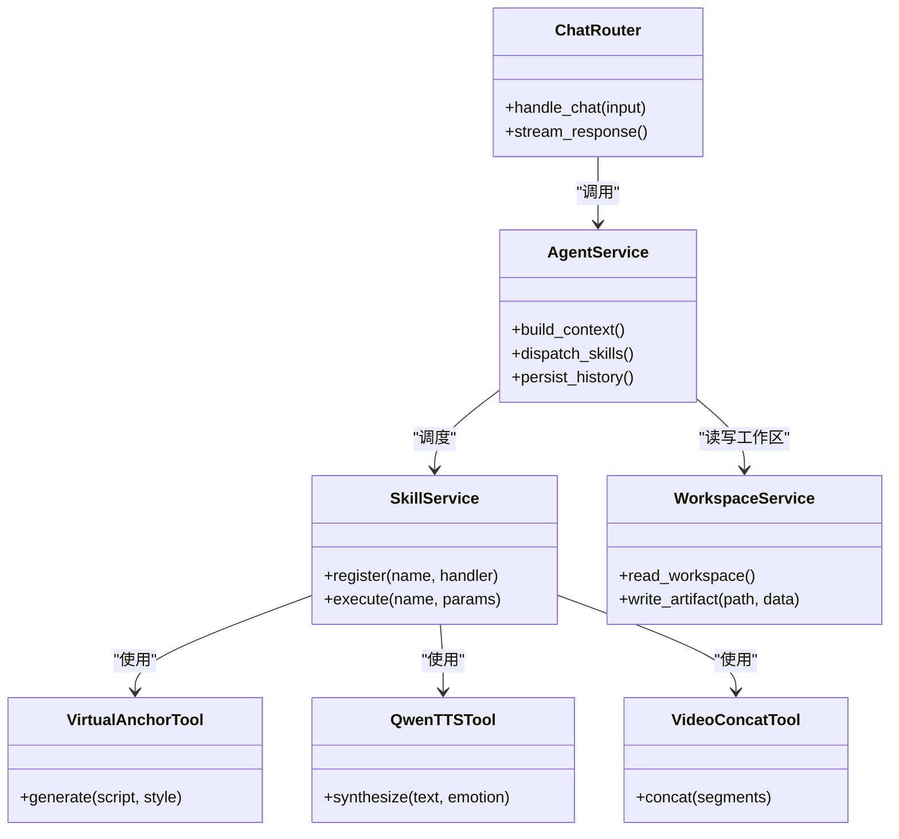
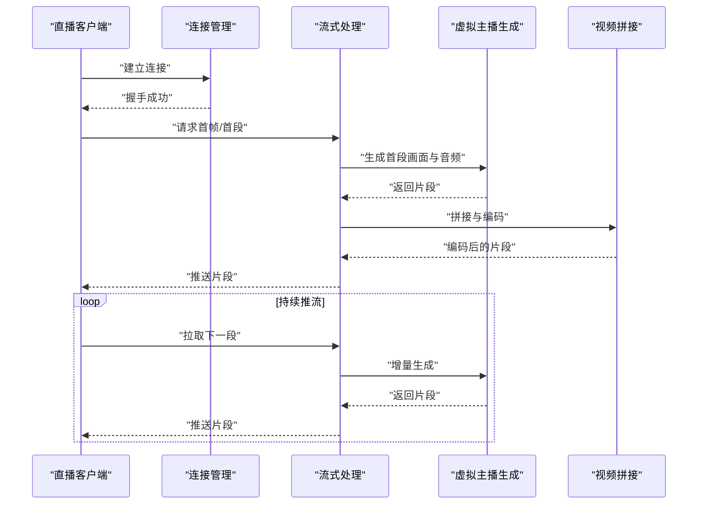
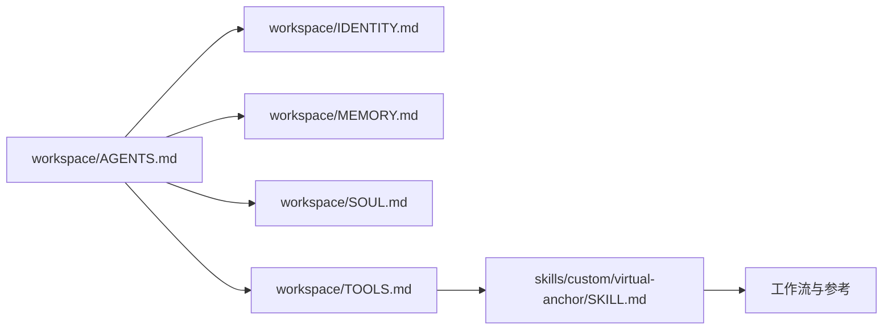
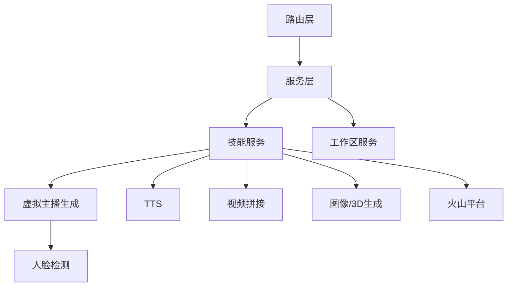

# 虚拟主播工具

<cite>
**本文引用的文件**   
- [backend/app/main.py](file://backend/app/main.py)
- [backend/app/routers/chat.py](file://backend/app/routers/chat.py)
- [backend/app/routers/settings.py](file://backend/app/routers/settings.py)
- [backend/app/services/agent_service.py](file://backend/app/services/agent_service.py)
- [backend/app/services/connection_manager.py](file://backend/app/services/connection_manager.py)
- [backend/app/services/history_service.py](file://backend/app/services/history_service.py)
- [backend/app/services/prompt.py](file://backend/app/services/prompt.py)
- [backend/app/services/skill_service.py](file://backend/app/services/skill_service.py)
- [backend/app/services/stream_processor.py](file://backend/app/services/stream_processor.py)
- [backend/app/services/workspace_service.py](file://backend/app/services/workspace_service.py)
- [backend/app/tools/virtual_anchor_generation.py](file://backend/app/tools/virtual_anchor_generation.py)
- [backend/app/tools/qwen_tts.py](file://backend/app/tools/qwen_tts.py)
- [backend/app/tools/audio_mixing.py](file://backend/app/tools/audio_mixing.py)
- [backend/app/tools/video_concatenation.py](file://backend/app/tools/video_concatenation.py)
- [backend/app/tools/image_generation.py](file://backend/app/tools/image_generation.py)
- [backend/app/tools/model_3d_generation.py](file://backend/app/tools/model_3d_generation.py)
- [backend/app/tools/qwen_omni_understanding.py](file://backend/app/tools/qwen_omni_understanding.py)
- [backend/app/tools/volcano_image_generation.py](file://backend/app/tools/volcano_image_generation.py)
- [backend/app/tools/volcano_video_generation.py](file://backend/app/tools/volcano_video_generation.py)
- [backend/app/tools/workspace_tools.py](file://backend/app/tools/workspace_tools.py)
- [backend/app/utils/face_detection.py](file://backend/app/utils/face_detection.py)
- [backend/app/utils/logger.py](file://backend/app/utils/logger.py)
- [backend/skills/custom/virtual-anchor/SKILL.md](file://backend/skills/custom/virtual-anchor/SKILL.md)
- [backend/workspace/AGENTS.md](file://backend/workspace/AGENTS.md)
- [backend/workspace/IDENTITY.md](file://backend/workspace/IDENTITY.md)
- [backend/workspace/MEMORY.md](file://backend/workspace/MEMORY.md)
- [backend/workspace/SOUL.md](file://backend/workspace/SOUL.md)
- [backend/workspace/TOOLS.md](file://backend/workspace/TOOLS.md)
- [backend/workspace/USER.md](file://backend/workspace/USER.md)
</cite>

## 目录
1. [简介](#简介)
2. [项目结构](#项目结构)
3. [核心组件](#核心组件)
4. [架构总览](#架构总览)
5. [详细组件分析](#详细组件分析)
6. [依赖关系分析](#依赖关系分析)
7. [性能考虑](#性能考虑)
8. [故障排查指南](#故障排查指南)
9. [结论](#结论)
10. [附录](#附录)

## 简介
本项目是一个面向“虚拟主播”的端到端解决方案，覆盖从文本脚本到最终视频的全链路自动化生产，并支持直播场景下的实时渲染与低延迟优化。系统围绕以下关键技术展开：
- 面部捕捉与表情驱动：基于人脸检测与关键点提取，驱动数字人表情与口型同步。
- 音视频合成：将语音（TTS）与唇形、表情、动作序列进行时间轴对齐，生成高质量视频。
- AI驱动内容创作工作流：从文本脚本出发，自动完成分镜、素材生成、配音、合成与导出。
- 虚拟形象定制与背景特效：提供3D模型生成、图像/视频素材生成与后期合成能力。
- 直播集成与实时渲染：通过连接管理与流式处理，实现低延迟的在线直播输出。

本仓库采用前后端分离架构，后端以Python服务为核心，提供路由、服务层与工具链；前端用于交互与可视化展示。

## 项目结构
整体结构按功能分层组织：
- 后端应用：包含主入口、路由、服务层、工具集、通用工具与技能定义。
- 前端应用：提供聊天界面、设置页、3D模型查看器等交互能力。
- 工作空间与技能：定义Agent身份、记忆、工具清单以及虚拟主播相关技能。

图表来源
- [backend/app/main.py](file://backend/app/main.py)
- [backend/app/routers/chat.py](file://backend/app/routers/chat.py)
- [backend/app/routers/settings.py](file://backend/app/routers/settings.py)
- [backend/app/services/agent_service.py](file://backend/app/services/agent_service.py)
- [backend/app/services/connection_manager.py](file://backend/app/services/connection_manager.py)
- [backend/app/services/history_service.py](file://backend/app/services/history_service.py)
- [backend/app/services/prompt.py](file://backend/app/services/prompt.py)
- [backend/app/services/skill_service.py](file://backend/app/services/skill_service.py)
- [backend/app/services/stream_processor.py](file://backend/app/services/stream_processor.py)
- [backend/app/services/workspace_service.py](file://backend/app/services/workspace_service.py)
- [backend/app/tools/virtual_anchor_generation.py](file://backend/app/tools/virtual_anchor_generation.py)
- [backend/app/tools/qwen_tts.py](file://backend/app/tools/qwen_tts.py)
- [backend/app/tools/audio_mixing.py](file://backend/app/tools/audio_mixing.py)
- [backend/app/tools/video_concatenation.py](file://backend/app/tools/video_concatenation.py)
- [backend/app/tools/image_generation.py](file://backend/app/tools/image_generation.py)
- [backend/app/tools/model_3d_generation.py](file://backend/app/tools/model_3d_generation.py)
- [backend/app/tools/qwen_omni_understanding.py](file://backend/app/tools/qwen_omni_understanding.py)
- [backend/app/tools/volcano_image_generation.py](file://backend/app/tools/volcano_image_generation.py)
- [backend/app/tools/volcano_video_generation.py](file://backend/app/tools/volcano_video_generation.py)
- [backend/app/tools/workspace_tools.py](file://backend/app/tools/workspace_tools.py)
- [backend/app/utils/face_detection.py](file://backend/app/utils/face_detection.py)
- [backend/app/utils/logger.py](file://backend/app/utils/logger.py)

章节来源
- [backend/app/main.py](file://backend/app/main.py)
- [backend/app/routers/chat.py](file://backend/app/routers/chat.py)
- [backend/app/routers/settings.py](file://backend/app/routers/settings.py)
- [backend/app/services/agent_service.py](file://backend/app/services/agent_service.py)
- [backend/app/services/connection_manager.py](file://backend/app/services/connection_manager.py)
- [backend/app/services/history_service.py](file://backend/app/services/history_service.py)
- [backend/app/services/prompt.py](file://backend/app/services/prompt.py)
- [backend/app/services/skill_service.py](file://backend/app/services/skill_service.py)
- [backend/app/services/stream_processor.py](file://backend/app/services/stream_processor.py)
- [backend/app/services/workspace_service.py](file://backend/app/services/workspace_service.py)
- [backend/app/tools/virtual_anchor_generation.py](file://backend/app/tools/virtual_anchor_generation.py)
- [backend/app/tools/qwen_tts.py](file://backend/app/tools/qwen_tts.py)
- [backend/app/tools/audio_mixing.py](file://backend/app/tools/audio_mixing.py)
- [backend/app/tools/video_concatenation.py](file://backend/app/tools/video_concatenation.py)
- [backend/app/tools/image_generation.py](file://backend/app/tools/image_generation.py)
- [backend/app/tools/model_3d_generation.py](file://backend/backend/app/tools/model_3d_generation.py)
- [backend/app/tools/qwen_omni_understanding.py](file://backend/app/tools/qwen_omni_understanding.py)
- [backend/app/tools/volcano_image_generation.py](file://backend/app/tools/volcano_image_generation.py)
- [backend/app/tools/volcano_video_generation.py](file://backend/app/tools/volcano_video_generation.py)
- [backend/app/tools/workspace_tools.py](file://backend/app/tools/workspace_tools.py)
- [backend/app/utils/face_detection.py](file://backend/app/utils/face_detection.py)
- [backend/app/utils/logger.py](file://backend/app/utils/logger.py)

## 核心组件
- 路由层
  - 对话路由：接收用户输入，触发Agent编排与技能调用，返回结果或流式响应。
  - 设置路由：维护系统配置与偏好，影响生成策略与渲染参数。
- 服务层
  - Agent编排：统一调度提示词、历史上下文、工作区与技能，形成可复用的任务执行体。
  - 连接管理：维护WebSocket/长连接状态，支撑直播与实时交互。
  - 历史管理：持久化会话与中间产物，便于回放与调试。
  - 提示词工程：将业务目标转化为结构化提示词，驱动LLM与多模态模型。
  - 技能服务：注册、发现与执行具体技能（如虚拟主播生成、TTS、音视频合成等）。
  - 流式处理：对媒体流进行分段处理、缓冲与合并，降低端到端延迟。
  - 工作区服务：读写工作区元数据与资源，协调跨模块共享数据。
- 工具层
  - 虚拟主播生成：整合面部捕捉、表情驱动、口型同步与动作生成，输出带表情与口型的动画片段。
  - 语音合成：将文本转换为语音，并提供情感与语速控制。
  - 音频混音：将TTS、环境音、音效混合为最终音轨。
  - 视频拼接：将多个片段按时间线拼接，添加转场与字幕。
  - 图像/3D模型生成：根据描述生成角色、背景或道具资产。
  - 火山平台集成：调用外部图像/视频生成服务，扩展素材生产能力。
  - 多模态理解：解析图片/视频/文档，辅助脚本与分镜生成。
  - 工作区工具：封装文件操作、路径解析与资源索引。
- 通用工具
  - 人脸检测：提供人脸定位与关键点提取，作为表情与口型驱动的输入。
  - 日志：统一的日志记录与分级输出，便于问题追踪。

章节来源
- [backend/app/routers/chat.py](file://backend/app/routers/chat.py)
- [backend/app/routers/settings.py](file://backend/app/routers/settings.py)
- [backend/app/services/agent_service.py](file://backend/app/services/agent_service.py)
- [backend/app/services/connection_manager.py](file://backend/app/services/connection_manager.py)
- [backend/app/services/history_service.py](file://backend/app/services/history_service.py)
- [backend/app/services/prompt.py](file://backend/app/services/prompt.py)
- [backend/app/services/skill_service.py](file://backend/app/services/skill_service.py)
- [backend/app/services/stream_processor.py](file://backend/app/services/stream_processor.py)
- [backend/app/services/workspace_service.py](file://backend/app/services/workspace_service.py)
- [backend/app/tools/virtual_anchor_generation.py](file://backend/app/tools/virtual_anchor_generation.py)
- [backend/app/tools/qwen_tts.py](file://backend/app/tools/qwen_tts.py)
- [backend/app/tools/audio_mixing.py](file://backend/app/tools/audio_mixing.py)
- [backend/app/tools/video_concatenation.py](file://backend/app/tools/video_concatenation.py)
- [backend/app/tools/image_generation.py](file://backend/app/tools/image_generation.py)
- [backend/app/tools/model_3d_generation.py](file://backend/app/tools/model_3d_generation.py)
- [backend/app/tools/qwen_omni_understanding.py](file://backend/app/tools/qwen_omni_understanding.py)
- [backend/app/tools/volcano_image_generation.py](file://backend/app/tools/volcano_image_generation.py)
- [backend/app/tools/volcano_video_generation.py](file://backend/app/tools/volcano_video_generation.py)
- [backend/app/tools/workspace_tools.py](file://backend/app/tools/workspace_tools.py)
- [backend/app/utils/face_detection.py](file://backend/app/utils/face_detection.py)
- [backend/app/utils/logger.py](file://backend/app/utils/logger.py)

## 架构总览
系统采用“路由-服务-工具”的分层架构，结合“工作区+技能”的可插拔设计，使虚拟主播流程具备高可扩展性与可维护性。

图表来源
- [backend/app/routers/chat.py](file://backend/app/routers/chat.py)
- [backend/app/services/agent_service.py](file://backend/app/services/agent_service.py)
- [backend/app/services/skill_service.py](file://backend/app/services/skill_service.py)
- [backend/app/services/stream_processor.py](file://backend/app/services/stream_processor.py)
- [backend/app/services/connection_manager.py](file://backend/app/services/connection_manager.py)
- [backend/app/tools/qwen_tts.py](file://backend/app/tools/qwen_tts.py)
- [backend/app/tools/virtual_anchor_generation.py](file://backend/app/tools/virtual_anchor_generation.py)
- [backend/app/tools/video_concatenation.py](file://backend/app/tools/video_concatenation.py)

## 详细组件分析

### 虚拟主播生成管线
该管线负责将文本脚本转化为带表情与口型的数字人视频，关键步骤包括：
- 脚本解析与分镜生成：利用多模态理解与提示词工程，产出镜头、台词、情绪标签与动作提示。
- 语音合成与情感控制：将台词转为语音，附带情感与语速参数。
- 面部捕捉与表情驱动：基于人脸检测与关键点，映射到数字人的表情参数。
- 口型同步算法：依据语音时序与音素特征，驱动口型形状与开合度。
- 动作生成：根据情绪与剧情节奏，生成肢体与头部动作序列。
- 背景合成与特效：叠加背景图/视频与视觉特效，提升表现力。
- 音视频合成与导出：将音轨与画面按时间轴对齐，输出最终视频。

图表来源
- [backend/app/tools/virtual_anchor_generation.py](file://backend/app/tools/virtual_anchor_generation.py)
- [backend/app/tools/qwen_tts.py](file://backend/app/tools/qwen_tts.py)
- [backend/app/utils/face_detection.py](file://backend/app/utils/face_detection.py)
- [backend/app/tools/audio_mixing.py](file://backend/app/tools/audio_mixing.py)
- [backend/app/tools/video_concatenation.py](file://backend/app/tools/video_concatenation.py)
- [backend/app/tools/image_generation.py](file://backend/app/tools/image_generation.py)
- [backend/app/tools/model_3d_generation.py](file://backend/app/tools/model_3d_generation.py)

章节来源
- [backend/app/tools/virtual_anchor_generation.py](file://backend/app/tools/virtual_anchor_generation.py)
- [backend/app/tools/qwen_tts.py](file://backend/app/tools/qwen_tts.py)
- [backend/app/utils/face_detection.py](file://backend/app/utils/face_detection.py)
- [backend/app/tools/audio_mixing.py](file://backend/app/tools/audio_mixing.py)
- [backend/app/tools/video_concatenation.py](file://backend/app/tools/video_concatenation.py)
- [backend/app/tools/image_generation.py](file://backend/app/tools/image_generation.py)
- [backend/app/tools/model_3d_generation.py](file://backend/app/tools/model_3d_generation.py)

### 对话与技能编排
对话路由接收用户输入后，由Agent编排构建上下文、选择技能并执行。技能服务负责注册与分发具体能力（如虚拟主播生成、TTS、图像/视频生成等），并通过工作区服务共享中间产物。

图表来源
- [backend/app/routers/chat.py](file://backend/app/routers/chat.py)
- [backend/app/services/agent_service.py](file://backend/app/services/agent_service.py)
- [backend/app/services/skill_service.py](file://backend/app/services/skill_service.py)
- [backend/app/services/workspace_service.py](file://backend/app/services/workspace_service.py)
- [backend/app/tools/virtual_anchor_generation.py](file://backend/app/tools/virtual_anchor_generation.py)
- [backend/app/tools/qwen_tts.py](file://backend/app/tools/qwen_tts.py)
- [backend/app/tools/video_concatenation.py](file://backend/app/tools/video_concatenation.py)

章节来源
- [backend/app/routers/chat.py](file://backend/app/routers/chat.py)
- [backend/app/services/agent_service.py](file://backend/app/services/agent_service.py)
- [backend/app/services/skill_service.py](file://backend/app/services/skill_service.py)
- [backend/app/services/workspace_service.py](file://backend/app/services/workspace_service.py)
- [backend/app/tools/virtual_anchor_generation.py](file://backend/app/tools/virtual_anchor_generation.py)
- [backend/app/tools/qwen_tts.py](file://backend/app/tools/qwen_tts.py)
- [backend/app/tools/video_concatenation.py](file://backend/app/tools/video_concatenation.py)

### 直播与实时渲染
直播场景下，连接管理维护客户端连接状态，流式处理器将媒体流切分为片段并按需推送，以降低端到端延迟。

图表来源
- [backend/app/services/connection_manager.py](file://backend/app/services/connection_manager.py)
- [backend/app/services/stream_processor.py](file://backend/app/services/stream_processor.py)
- [backend/app/tools/virtual_anchor_generation.py](file://backend/app/tools/virtual_anchor_generation.py)
- [backend/app/tools/video_concatenation.py](file://backend/app/tools/video_concatenation.py)

章节来源
- [backend/app/services/connection_manager.py](file://backend/app/services/connection_manager.py)
- [backend/app/services/stream_processor.py](file://backend/app/services/stream_processor.py)
- [backend/app/tools/virtual_anchor_generation.py](file://backend/app/tools/virtual_anchor_generation.py)
- [backend/app/tools/video_concatenation.py](file://backend/app/tools/video_concatenation.py)

### 工作区与技能定义
工作区定义了Agent的身份、记忆、灵魂与工具清单，技能则描述了虚拟主播相关的执行流程与参考模板。

图表来源
- [backend/workspace/AGENTS.md](file://backend/workspace/AGENTS.md)
- [backend/workspace/IDENTITY.md](file://backend/workspace/IDENTITY.md)
- [backend/workspace/MEMORY.md](file://backend/workspace/MEMORY.md)
- [backend/workspace/SOUL.md](file://backend/workspace/SOUL.md)
- [backend/workspace/TOOLS.md](file://backend/workspace/TOOLS.md)
- [backend/skills/custom/virtual-anchor/SKILL.md](file://backend/skills/custom/virtual-anchor/SKILL.md)

章节来源
- [backend/workspace/AGENTS.md](file://backend/workspace/AGENTS.md)
- [backend/workspace/IDENTITY.md](file://backend/workspace/IDENTITY.md)
- [backend/workspace/MEMORY.md](file://backend/workspace/MEMORY.md)
- [backend/workspace/SOUL.md](file://backend/workspace/SOUL.md)
- [backend/workspace/TOOLS.md](file://backend/workspace/TOOLS.md)
- [backend/skills/custom/virtual-anchor/SKILL.md](file://backend/skills/custom/virtual-anchor/SKILL.md)

## 依赖关系分析
- 组件耦合
  - 路由层仅依赖服务层接口，保持低耦合。
  - 服务层通过技能服务解耦具体工具实现，提高可替换性。
  - 工具层内部相对独立，通过工作区服务共享数据，避免直接交叉引用。
- 外部依赖
  - 火山平台图像/视频生成：扩展素材生产能力。
  - 多模态理解：辅助脚本与分镜生成。
- 潜在循环依赖
  - 当前分层清晰，未见明显循环依赖；建议继续保持“服务→工具”单向依赖。

图表来源
- [backend/app/routers/chat.py](file://backend/app/routers/chat.py)
- [backend/app/services/skill_service.py](file://backend/app/services/skill_service.py)
- [backend/app/tools/virtual_anchor_generation.py](file://backend/app/tools/virtual_anchor_generation.py)
- [backend/app/tools/qwen_tts.py](file://backend/app/tools/qwen_tts.py)
- [backend/app/tools/video_concatenation.py](file://backend/app/tools/video_concatenation.py)
- [backend/app/tools/image_generation.py](file://backend/app/tools/image_generation.py)
- [backend/app/tools/model_3d_generation.py](file://backend/app/tools/model_3d_generation.py)
- [backend/app/tools/volcano_image_generation.py](file://backend/app/tools/volcano_image_generation.py)
- [backend/app/tools/volcano_video_generation.py](file://backend/app/tools/volcano_video_generation.py)
- [backend/app/utils/face_detection.py](file://backend/app/utils/face_detection.py)

章节来源
- [backend/app/routers/chat.py](file://backend/app/routers/chat.py)
- [backend/app/services/skill_service.py](file://backend/app/services/skill_service.py)
- [backend/app/tools/virtual_anchor_generation.py](file://backend/app/tools/virtual_anchor_generation.py)
- [backend/app/tools/qwen_tts.py](file://backend/app/tools/qwen_tts.py)
- [backend/app/tools/video_concatenation.py](file://backend/app/tools/video_concatenation.py)
- [backend/app/tools/image_generation.py](file://backend/app/tools/image_generation.py)
- [backend/app/tools/model_3d_generation.py](file://backend/app/tools/model_3d_generation.py)
- [backend/app/tools/volcano_image_generation.py](file://backend/app/tools/volcano_image_generation.py)
- [backend/app/tools/volcano_video_generation.py](file://backend/app/tools/volcano_video_generation.py)
- [backend/app/utils/face_detection.py](file://backend/app/utils/face_detection.py)

## 性能考虑
- 流式处理与缓冲
  - 将媒体流切分为固定时长片段，减少首帧等待时间。
  - 使用环形缓冲与预取机制，平滑网络抖动。
- 并行与异步
  - 在TTS、图像/3D生成与视频编码阶段采用异步并发，缩短整体耗时。
- 编码与分辨率
  - 直播场景优先选择低延迟编码格式与合适的分辨率/码率，平衡画质与延迟。
- 缓存与复用
  - 对常用背景、角色与动作库进行缓存，避免重复生成。
- 资源隔离
  - 不同技能任务分配独立线程/进程，防止相互阻塞。

[本节为通用指导，不直接分析具体文件]

## 故障排查指南
- 常见问题
  - 人脸检测失败：检查输入图像质量、光照条件与遮挡情况。
  - 口型不同步：核对语音时序与音素标注，调整唇形驱动权重。
  - 视频卡顿：检查编码参数、网络带宽与缓冲策略。
  - 连接中断：确认连接管理心跳与重连逻辑。
- 日志与诊断
  - 使用统一日志记录关键节点耗时与错误堆栈，定位瓶颈。
  - 在工作区中保存中间产物（分镜、音轨、片段），便于回放与对比。

章节来源
- [backend/app/utils/logger.py](file://backend/app/utils/logger.py)
- [backend/app/services/history_service.py](file://backend/app/services/history_service.py)
- [backend/app/services/connection_manager.py](file://backend/app/services/connection_manager.py)
- [backend/app/utils/face_detection.py](file://backend/app/utils/face_detection.py)

## 结论
本项目通过分层架构与技能化设计，实现了从文本脚本到虚拟主播视频的自动化流水线，并支持直播场景下的实时渲染与低延迟优化。未来可在以下方向继续增强：
- 更精细的口型同步与情感表达模型。
- 更强的3D角色与场景生成能力。
- 更完善的监控与性能调优工具链。

[本节为总结性内容，不直接分析具体文件]

## 附录
- 术语表
  - 虚拟主播：通过数字人形象进行内容播报与互动的AI驱动角色。
  - 口型同步：将语音时序映射到唇形参数的技术。
  - 表情驱动：将情绪标签或关键点变化映射到角色表情参数。
  - 流式处理：将媒体流分段处理与推送，降低延迟。

[本节为概念性说明，不直接分析具体文件]