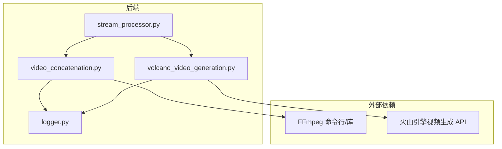
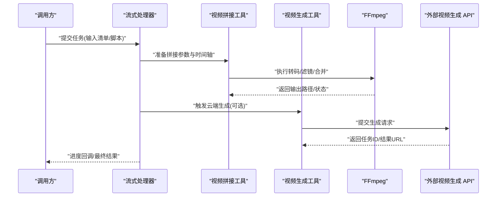
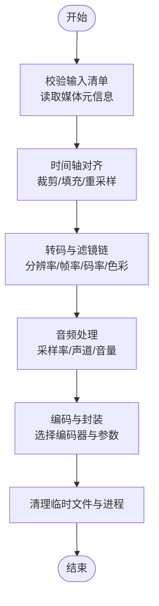
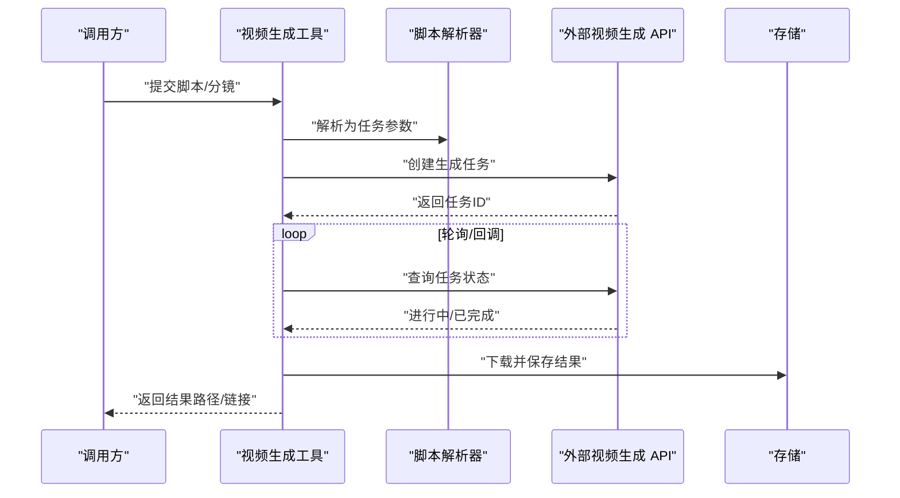
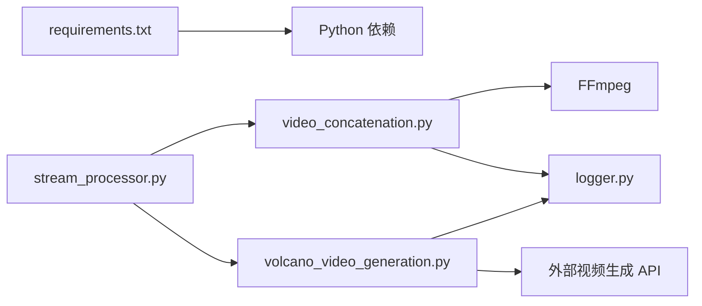

# 视频处理工具

<cite>
**本文引用的文件**   
- [backend/app/tools/video_concatenation.py](file://backend/app/tools/video_concatenation.py)
- [backend/app/tools/volcano_video_generation.py](file://backend/app/tools/volcano_video_generation.py)
- [backend/app/services/stream_processor.py](file://backend/app/services/stream_processor.py)
- [backend/app/utils/logger.py](file://backend/app/utils/logger.py)
- [backend/requirements.txt](file://backend/requirements.txt)
</cite>

## 目录
1. [简介](#简介)
2. [项目结构](#项目结构)
3. [核心组件](#核心组件)
4. [架构总览](#架构总览)
5. [详细组件分析](#详细组件分析)
6. [依赖分析](#依赖分析)
7. [性能考虑](#性能考虑)
8. [故障排查指南](#故障排查指南)
9. [结论](#结论)
10. [附录](#附录)

## 简介
本仓库包含后端服务与前端界面，其中视频处理能力集中在后端工具与服务中。本文聚焦于：
- 视频拼接工具的实现：格式兼容、转码处理、时间轴对齐等关键技术点
- 视频生成工具的工作流程：从脚本解析到最终渲染的完整过程
- FFmpeg 集成方式、GPU 加速策略、内存管理方案
- 编码参数优化、分辨率适配、帧率控制
- 性能调优、错误恢复、进度跟踪的实现思路

## 项目结构
与视频处理相关的核心代码位于 backend/app/tools 与 backend/app/services 下：
- video_concatenation.py：实现视频拼接、转码、时间轴对齐等能力
- volcano_video_generation.py：封装外部视频生成服务的调用与结果回写
- stream_processor.py：流式处理与任务编排（可用于进度上报、中间产物处理）
- logger.py：统一日志记录，便于问题定位与审计
- requirements.txt：Python 依赖声明（含 FFmpeg 相关库）

图表来源
- [backend/app/tools/video_concatenation.py](file://backend/app/tools/video_concatenation.py)
- [backend/app/tools/volcano_video_generation.py](file://backend/app/tools/volcano_video_generation.py)
- [backend/app/services/stream_processor.py](file://backend/app/services/stream_processor.py)
- [backend/app/utils/logger.py](file://backend/app/utils/logger.py)

章节来源
- [backend/app/tools/video_concatenation.py](file://backend/app/tools/video_concatenation.py)
- [backend/app/tools/volcano_video_generation.py](file://backend/app/tools/volcano_video_generation.py)
- [backend/app/services/stream_processor.py](file://backend/app/services/stream_processor.py)
- [backend/app/utils/logger.py](file://backend/app/utils/logger.py)

## 核心组件
- 视频拼接模块
  - 负责多段视频的合并、转码、时间轴对齐、音频混音与输出封装
  - 通过 FFmpeg 完成编解码、滤镜链构建与资源释放
- 视频生成模块
  - 负责将“脚本/分镜”转换为可执行的任务，调用外部视频生成服务并落盘
- 流式处理器
  - 提供任务编排、进度上报、中间产物管理与异常重试机制
- 日志模块
  - 为各模块提供结构化日志输出，支持分级与上下文追踪

章节来源
- [backend/app/tools/video_concatenation.py](file://backend/app/tools/video_concatenation.py)
- [backend/app/tools/volcano_video_generation.py](file://backend/app/tools/volcano_video_generation.py)
- [backend/app/services/stream_processor.py](file://backend/app/services/stream_processor.py)
- [backend/app/utils/logger.py](file://backend/app/utils/logger.py)

## 架构总览
整体采用“工具 + 服务”的分层设计：
- 工具层：封装具体能力（拼接、生成），对外暴露函数接口
- 服务层：编排任务、管理状态、上报进度、处理异常
- 外部系统：FFmpeg 用于本地转码与滤镜；外部 API 用于云端视频生成

图表来源
- [backend/app/services/stream_processor.py](file://backend/app/services/stream_processor.py)
- [backend/app/tools/video_concatenation.py](file://backend/app/tools/video_concatenation.py)
- [backend/app/tools/volcano_video_generation.py](file://backend/app/tools/volcano_video_generation.py)

## 详细组件分析

### 视频拼接工具（video_concatenation.py）
职责与关键点
- 输入校验与元数据读取：检测分辨率、帧率、时长、编码格式、声道布局等
- 时间轴对齐：对不齐的片段进行裁剪、填充或重采样，保证无缝衔接
- 转码与滤镜：统一分辨率、帧率、码率；必要时添加缩放、去隔行、色彩空间转换
- 音频处理：统一采样率、声道数，音量归一化与淡入淡出
- 输出封装：选择容器与编码参数，确保跨平台播放兼容性
- 资源管理：严格管理 FFmpeg 进程与临时文件，避免泄漏

关键流程（算法视角）

图表来源
- [backend/app/tools/video_concatenation.py](file://backend/app/tools/video_concatenation.py)

章节来源
- [backend/app/tools/video_concatenation.py](file://backend/app/tools/video_concatenation.py)

### 视频生成工具（volcano_video_generation.py）
职责与关键点
- 脚本解析：将“分镜/脚本”转换为结构化任务描述（场景、镜头、时长、提示词等）
- 任务提交：调用外部视频生成 API，携带必要参数（分辨率、时长、风格等）
- 结果拉取：轮询或回调获取生成结果，下载并落盘
- 失败重试：网络抖动或服务限流时的指数退避重试
- 进度上报：将生成阶段映射为进度事件，供上层展示

关键流程（序列图）

图表来源
- [backend/app/tools/volcano_video_generation.py](file://backend/app/tools/volcano_video_generation.py)

章节来源
- [backend/app/tools/volcano_video_generation.py](file://backend/app/tools/volcano_video_generation.py)

### 流式处理器（stream_processor.py）
职责与关键点
- 任务编排：按依赖顺序调度拼接与生成任务
- 进度上报：将长耗时步骤拆分为细粒度事件，实时反馈
- 异常恢复：捕获异常、记录上下文、支持重试与补偿
- 资源协调：并发控制、队列与超时管理

章节来源
- [backend/app/services/stream_processor.py](file://backend/app/services/stream_processor.py)

### 日志模块（logger.py）
职责与关键点
- 统一日志格式与级别
- 结构化字段（任务ID、阶段、耗时、错误码）
- 异步写入与滚动策略，避免阻塞主流程

章节来源
- [backend/app/utils/logger.py](file://backend/app/utils/logger.py)

## 依赖分析
- 运行时依赖
  - Python 包：由 requirements.txt 声明，通常包含 FFmpeg 绑定或命令行封装、HTTP 客户端、异步框架等
  - 外部系统：FFmpeg（本地转码）、火山引擎视频生成 API（云端生成）
- 耦合关系
  - 流式处理器依赖拼接与生成工具
  - 工具层依赖日志模块
  - 外部依赖通过适配器隔离，降低耦合

图表来源
- [backend/requirements.txt](file://backend/requirements.txt)
- [backend/app/services/stream_processor.py](file://backend/app/services/stream_processor.py)
- [backend/app/tools/video_concatenation.py](file://backend/app/tools/video_concatenation.py)
- [backend/app/tools/volcano_video_generation.py](file://backend/app/tools/volcano_video_generation.py)
- [backend/app/utils/logger.py](file://backend/app/utils/logger.py)

章节来源
- [backend/requirements.txt](file://backend/requirements.txt)
- [backend/app/services/stream_processor.py](file://backend/app/services/stream_processor.py)
- [backend/app/tools/video_concatenation.py](file://backend/app/tools/video_concatenation.py)
- [backend/app/tools/volcano_video_generation.py](file://backend/app/tools/volcano_video_generation.py)
- [backend/app/utils/logger.py](file://backend/app/utils/logger.py)

## 性能考虑
- FFmpeg 集成与 GPU 加速
  - 优先使用硬件编码器（如 NVENC/QuickSync/VAAPI），在驱动可用时自动切换
  - 合理设置线程数与缓冲区大小，避免 CPU/GPU 争用
  - 对大分辨率素材启用零拷贝路径（如可能的情况下）
- 内存管理
  - 流式读写，避免一次性加载整段视频到内存
  - 及时关闭句柄、释放进程与临时文件
  - 限制并发任务数量，防止 OOM
- 编码参数优化
  - 根据目标平台选择 H.264/H.265 与 AAC/Opus
  - 动态码率控制（CBR/VBR/CQP），平衡画质与体积
  - 帧率与分辨率适配：源不一致时统一至目标规格
- 进度跟踪
  - 基于 FFmpeg 输出解析或回调机制，将处理阶段映射为百分比
  - 结合任务 ID 与阶段标签，便于前端展示与断点续传

[本节为通用指导，不直接分析具体文件]

## 故障排查指南
- 常见问题定位
  - 编码失败：检查输入格式、像素格式、色域与目标编码器兼容性
  - 黑屏/无声：确认滤镜链顺序、音频重采样与通道映射
  - 卡顿/掉帧：调整缓冲、码率与线程数，检查磁盘 I/O
- 日志与诊断
  - 开启详细日志，记录任务 ID、阶段、耗时与错误堆栈
  - 保留中间产物与 FFmpeg 命令，便于复现
- 恢复策略
  - 失败重试（指数退避）、断点续拼、分段生成后合并
  - 降级策略：当 GPU 不可用时回退到 CPU 编码

章节来源
- [backend/app/utils/logger.py](file://backend/app/utils/logger.py)
- [backend/app/services/stream_processor.py](file://backend/app/services/stream_processor.py)

## 结论
本项目以“工具 + 服务”的方式组织视频处理能力，通过 FFmpeg 与外部 API 协同完成本地转码与云端生成。借助流式处理器实现任务编排、进度上报与异常恢复，配合统一的日志体系，形成可观测、可扩展的视频处理流水线。后续可在硬件加速、自适应码率与更细粒度的进度上报方面持续优化。

[本节为总结性内容，不直接分析具体文件]

## 附录
- 术语
  - 时间轴对齐：使相邻片段在起止时间与采样点上保持一致
  - 滤镜链：将多个滤镜串联，完成缩放、去隔行、色彩转换等操作
  - 码率控制：CBR/VBR/CQP 等策略，影响画质与体积
- 参考文件
  - [backend/app/tools/video_concatenation.py](file://backend/app/tools/video_concatenation.py)
  - [backend/app/tools/volcano_video_generation.py](file://backend/app/tools/volcano_video_generation.py)
  - [backend/app/services/stream_processor.py](file://backend/app/services/stream_processor.py)
  - [backend/app/utils/logger.py](file://backend/app/utils/logger.py)
  - [backend/requirements.txt](file://backend/requirements.txt)