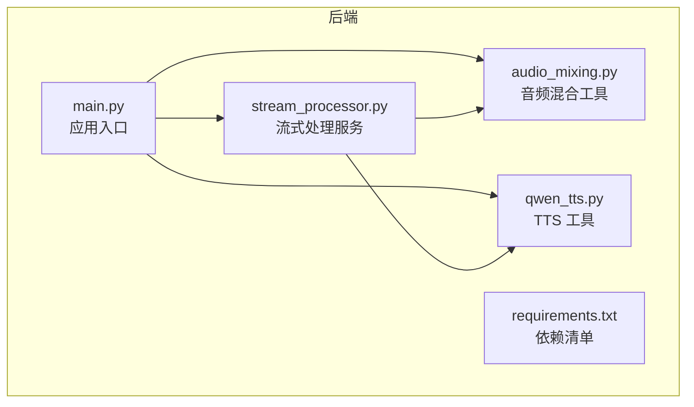
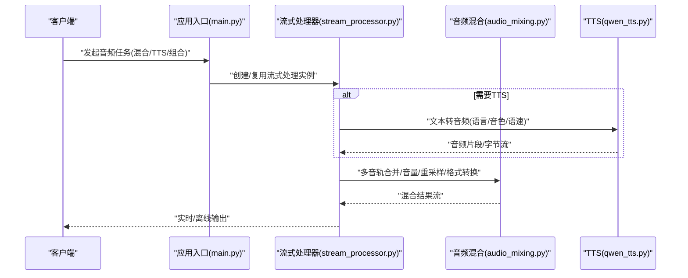
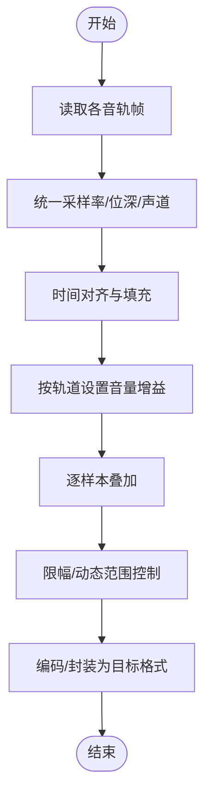
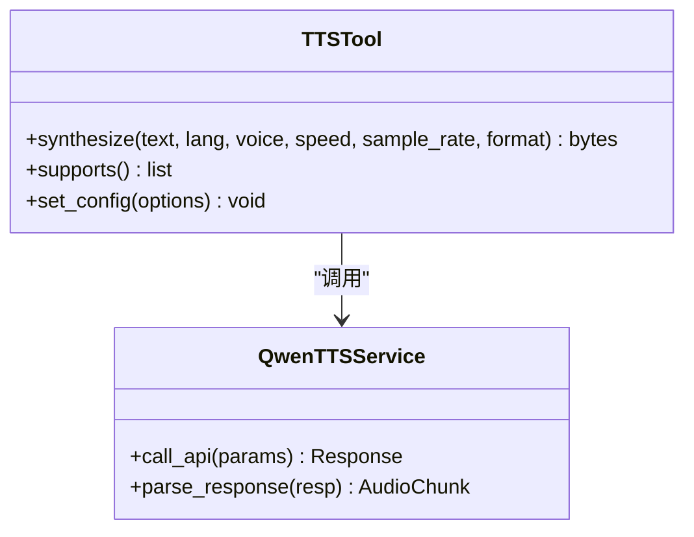
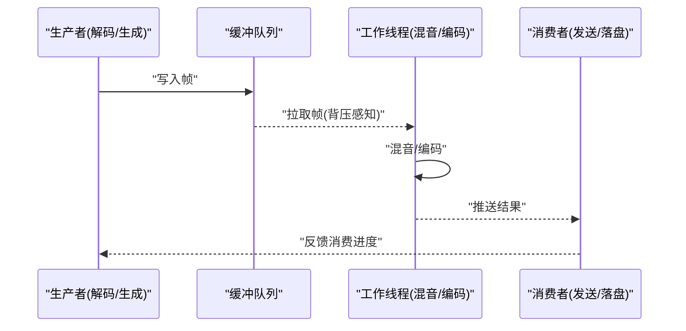
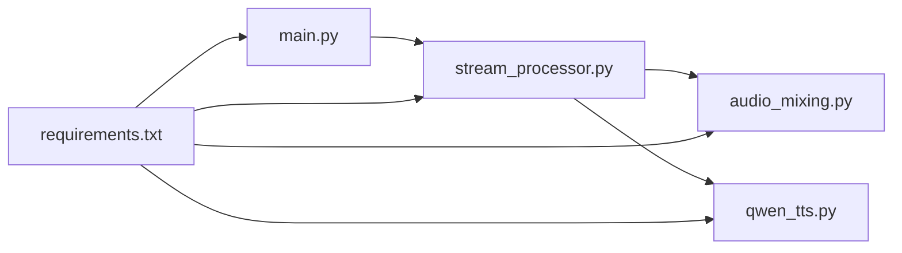

# 音频处理工具

<cite>
**本文引用的文件**   
- [backend/app/tools/audio_mixing.py](file://backend/app/tools/audio_mixing.py)
- [backend/app/tools/qwen_tts.py](file://backend/app/tools/qwen_tts.py)
- [backend/app/services/stream_processor.py](file://backend/app/services/stream_processor.py)
- [backend/app/main.py](file://backend/app/main.py)
- [backend/requirements.txt](file://backend/requirements.txt)
</cite>

## 目录
1. [简介](#简介)
2. [项目结构](#项目结构)
3. [核心组件](#核心组件)
4. [架构总览](#架构总览)
5. [详细组件分析](#详细组件分析)
6. [依赖分析](#依赖分析)
7. [性能考虑](#性能考虑)
8. [故障排查指南](#故障排查指南)
9. [结论](#结论)
10. [附录](#附录)

## 简介
本文件面向音频处理与语音合成（TTS）相关功能的开发者与使用者，系统性梳理仓库中音频混合、TTS、流式处理等关键能力。文档覆盖多音轨合并、音量调节、格式转换、TTS 语言与音色配置、语速控制、实时流处理、内存优化策略、音频质量调优、降噪思路与格式兼容性等内容，并提供使用示例与性能调优建议，帮助读者快速上手并高效扩展。

## 项目结构
后端采用模块化组织，音频与 TTS 功能集中在 tools 与 services 层：
- tools: 提供可复用的音视频处理能力，如音频混合、TTS 调用封装等
- services: 提供上层服务编排与流式处理逻辑
- main: 应用入口与路由挂载点
- requirements: 第三方依赖声明

图表来源
- [backend/app/main.py](file://backend/app/main.py)
- [backend/app/services/stream_processor.py](file://backend/app/services/stream_processor.py)
- [backend/app/tools/audio_mixing.py](file://backend/app/tools/audio_mixing.py)
- [backend/app/tools/qwen_tts.py](file://backend/app/tools/qwen_tts.py)
- [backend/requirements.txt](file://backend/requirements.txt)

章节来源
- [backend/app/main.py](file://backend/app/main.py)
- [backend/app/services/stream_processor.py](file://backend/app/services/stream_processor.py)
- [backend/app/tools/audio_mixing.py](file://backend/app/tools/audio_mixing.py)
- [backend/app/tools/qwen_tts.py](file://backend/app/tools/qwen_tts.py)
- [backend/requirements.txt](file://backend/requirements.txt)

## 核心组件
- 音频混合工具：负责多音轨合并、音量调节、采样率/位深对齐、格式转换与输出
- TTS 工具：封装语音合成接口，支持语言、音色、语速等参数化配置
- 流式处理器：实现分块读取、缓冲、拼接与低延迟输出，支撑实时场景
- 应用入口：统一注册工具与服务，暴露 API 或供内部调用

章节来源
- [backend/app/tools/audio_mixing.py](file://backend/app/tools/audio_mixing.py)
- [backend/app/tools/qwen_tts.py](file://backend/app/tools/qwen_tts.py)
- [backend/app/services/stream_processor.py](file://backend/app/services/stream_processor.py)
- [backend/app/main.py](file://backend/app/main.py)

## 架构总览
整体流程以“输入源 -> 预处理 -> 流式处理 -> 后处理 -> 输出”为主线，音频混合与 TTS 作为可插拔工具被流式处理器调度。

图表来源
- [backend/app/main.py](file://backend/app/main.py)
- [backend/app/services/stream_processor.py](file://backend/app/services/stream_processor.py)
- [backend/app/tools/audio_mixing.py](file://backend/app/tools/audio_mixing.py)
- [backend/app/tools/qwen_tts.py](file://backend/app/tools/qwen_tts.py)

## 详细组件分析

### 音频混合工具（多音轨合并、音量调节、格式转换）
- 功能要点
  - 多音轨合并：按时间轴对齐，支持不同长度与起始偏移
  - 音量调节：逐通道增益控制，避免削波
  - 重采样与位深对齐：统一采样率与位深，确保兼容播放
  - 格式转换：根据目标容器/编码进行封装
- 设计模式
  - 将“解码 -> 对齐 -> 混音 -> 编码”拆分为独立阶段，便于替换与测试
  - 通过配置对象传入参数（如目标采样率、目标位深、输出格式、各轨道增益）
- 复杂度与数据流
  - 时间复杂度近似 O(N)，N 为总样本数；空间复杂度取决于缓冲策略与最大帧长
  - 数据流：原始帧 -> 标准化 -> 对齐/填充 -> 加权叠加 -> 限幅/压缩 -> 编码输出
- 错误处理
  - 对不兼容的采样率/声道数进行自动转换或拒绝并返回明确错误码
  - 对溢出与削波进行保护，必要时启用软限幅或动态范围控制

图表来源
- [backend/app/tools/audio_mixing.py](file://backend/app/tools/audio_mixing.py)

章节来源
- [backend/app/tools/audio_mixing.py](file://backend/app/tools/audio_mixing.py)

### 语音合成（TTS）工具
- 能力概览
  - 文本到语音：支持多种语言与方言
  - 音色选择：基于模型或供应商提供的音色 ID/名称映射
  - 语速控制：通过速率参数影响合成时长与韵律
  - 输出格式：PCM/WAV/MP3/OGG 等常见格式
- 配置项
  - 语言代码、音色标识、语速系数、采样率、输出编码
  - 可选：情感风格、停顿控制、断句策略
- 集成方式
  - 通过工厂/适配器模式对接不同 TTS 后端，对外暴露统一接口
  - 支持流式与非流式两种模式，适配实时与批量场景
- 错误与降级
  - 网络/鉴权失败时重试与回退策略
  - 超时与熔断保护，避免阻塞上游

图表来源
- [backend/app/tools/qwen_tts.py](file://backend/app/tools/qwen_tts.py)

章节来源
- [backend/app/tools/qwen_tts.py](file://backend/app/tools/qwen_tts.py)

### 流式处理与实时能力
- 处理管线
  - 分块读取：固定大小帧或事件驱动的分片
  - 缓冲队列：生产者-消费者模型，解耦 I/O 与计算
  - 拼接与去抖：保证时序正确性与连续性
  - 背压控制：下游消费慢时主动降采样或丢弃非关键帧
- 内存优化
  - 零拷贝/共享缓冲：减少中间副本
  - 环形缓冲：固定容量，避免无限增长
  - 惰性加载：按需解码与按需编码
- 实时性保障
  - 端到端延迟预算分配（I/O、编解码、混音、网络）
  - 优先级队列：关键路径优先执行
  - 监控指标：丢帧率、卡顿次数、平均延迟

图表来源
- [backend/app/services/stream_processor.py](file://backend/app/services/stream_processor.py)

章节来源
- [backend/app/services/stream_processor.py](file://backend/app/services/stream_processor.py)

### 应用入口与路由
- 职责
  - 初始化依赖、注册工具与服务
  - 暴露 HTTP/WebSocket 接口，转发至流式处理器
  - 统一日志、度量与健康检查
- 扩展点
  - 新增工具或服务时，在入口集中注册，保持低耦合

章节来源
- [backend/app/main.py](file://backend/app/main.py)

## 依赖分析
- 外部依赖
  - 音频编解码库（如 FFmpeg 绑定）、TTS SDK/HTTP 客户端、异步框架
- 模块耦合
  - stream_processor 同时依赖 audio_mixing 与 qwen_tts，属于编排层
  - main 仅依赖服务与工具，保持薄入口
- 潜在风险
  - 若音频库版本不匹配可能导致 ABI 问题
  - TTS 供应商变更需通过适配器隔离

图表来源
- [backend/app/main.py](file://backend/app/main.py)
- [backend/app/services/stream_processor.py](file://backend/app/services/stream_processor.py)
- [backend/app/tools/audio_mixing.py](file://backend/app/tools/audio_mixing.py)
- [backend/app/tools/qwen_tts.py](file://backend/app/tools/qwen_tts.py)
- [backend/requirements.txt](file://backend/requirements.txt)

章节来源
- [backend/requirements.txt](file://backend/requirements.txt)
- [backend/app/main.py](file://backend/app/main.py)
- [backend/app/services/stream_processor.py](file://backend/app/services/stream_processor.py)
- [backend/app/tools/audio_mixing.py](file://backend/app/tools/audio_mixing.py)
- [backend/app/tools/qwen_tts.py](file://backend/app/tools/qwen_tts.py)

## 性能考虑
- 批处理与流水线并行
  - 将解码、混音、编码放入并行流水线，提升吞吐
- 缓冲与内存
  - 合理设置帧大小与队列长度，平衡延迟与抖动
  - 使用内存池与对象复用降低 GC 压力
- CPU/GPU 利用
  - 混音与 DSP 操作尽量向量化；必要时将重采样/滤波卸载到 GPU
- 网络与 I/O
  - 使用零拷贝传输；对远端 TTS 请求做连接复用与缓存
- 监控与告警
  - 记录关键指标：CPU 占用、内存峰值、延迟分布、丢帧率

[本节为通用指导，无需源码引用]

## 故障排查指南
- 常见问题
  - 采样率/位深不一致导致爆音或无声：检查对齐与重采样参数
  - 混音削波：调整增益或使用限幅器
  - TTS 超时/失败：检查鉴权、配额与网络连通性
  - 流式卡顿：增大缓冲或降低并发，检查背压策略
- 定位方法
  - 增加分段日志与指标埋点
  - 回放中间产物（未混音/已混音）对比差异
  - 使用最小用例复现问题

章节来源
- [backend/app/services/stream_processor.py](file://backend/app/services/stream_processor.py)
- [backend/app/tools/audio_mixing.py](file://backend/app/tools/audio_mixing.py)
- [backend/app/tools/qwen_tts.py](file://backend/app/tools/qwen_tts.py)

## 结论
本项目围绕“流式处理 + 可插拔工具”的架构，提供了可扩展的音频混合与 TTS 能力。通过合理的缓冲与背压策略、统一的配置与错误处理机制，可在保证实时性的同时获得良好的音质与稳定性。后续可按需引入更丰富的 DSP 效果与更多 TTS 供应商，进一步提升产品力。

[本节为总结性内容，无需源码引用]

## 附录

### 使用示例（步骤说明）
- 音频混合
  - 准备多段音频与各自音量权重
  - 指定目标采样率、位深与输出格式
  - 调用混合工具，获取结果流或文件
- TTS 合成
  - 选择语言与音色，设置语速与采样率
  - 调用 TTS 工具，得到 PCM/编码后的音频片段
- 流式组合
  - 将 TTS 输出与背景音轨送入流式处理器
  - 实时混音并推送到播放器或存储

章节来源
- [backend/app/tools/audio_mixing.py](file://backend/app/tools/audio_mixing.py)
- [backend/app/tools/qwen_tts.py](file://backend/app/tools/qwen_tts.py)
- [backend/app/services/stream_processor.py](file://backend/app/services/stream_processor.py)

### 音频质量调优与降噪建议
- 质量调优
  - 选择合适的采样率与位深（如 44.1kHz/16bit 或 48kHz/24bit）
  - 使用合适的压缩比与码率，兼顾体积与听感
- 降噪思路
  - 频域滤波（高通/低通/带阻）去除噪声频段
  - 谱减法或维纳滤波抑制稳态噪声
  - 自适应噪声估计与动态阈值
- 格式兼容性
  - 优先输出 WAV/FLAC 用于编辑，MP3/AAC/OGG 用于分发
  - 注意容器元数据与声道布局一致性

[本节为通用指导，无需源码引用]