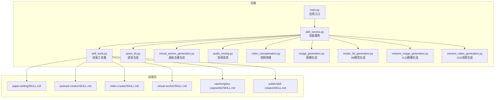
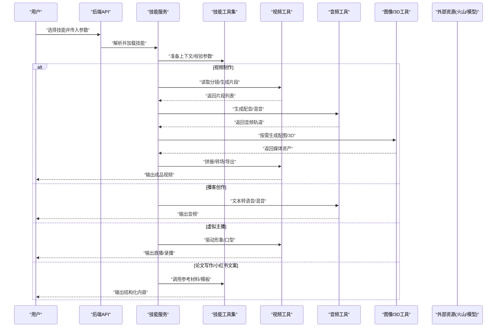
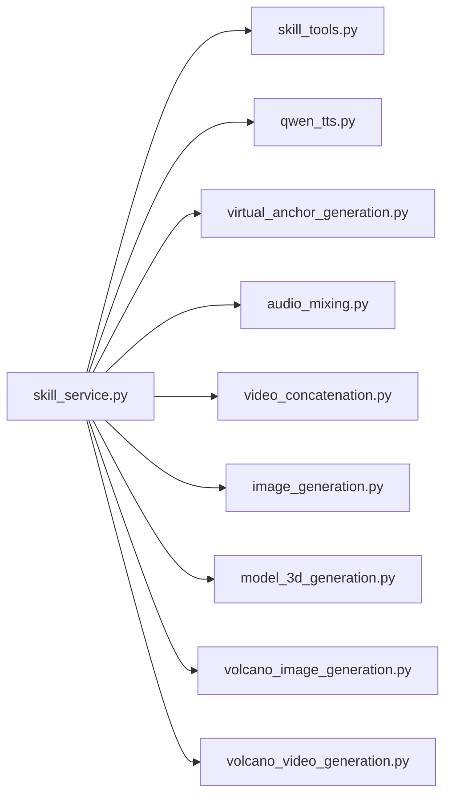

# 内置技能

<cite>
**本文引用的文件**   
- [backend/app/services/skill_service.py](file://backend/app/services/skill_service.py)
- [backend/app/tools/skill_tools.py](file://backend/app/tools/skill_tools.py)
- [backend/skills/custom/paper-writing/SKILL.md](file://backend/skills/custom/paper-writing/SKILL.md)
- [backend/skills/custom/podcast-creator/SKILL.md](file://backend/skills/custom/podcast-creator/SKILL.md)
- [backend/skills/custom/video-creator/SKILL.md](file://backend/skills/custom/video-creator/SKILL.md)
- [backend/skills/custom/virtual-anchor/SKILL.md](file://backend/skills/custom/virtual-anchor/SKILL.md)
- [backend/skills/custom/xiaohongshu-copywriter/SKILL.md](file://backend/skills/custom/xiaohongshu-copywriter/SKILL.md)
- [backend/skills/public/skill-creator/SKILL.md](file://backend/skills/public/skill-creator/SKILL.md)
- [backend/skills/public/skill-creator/scripts/init_skill.py](file://backend/skills/public/skill-creator/scripts/init_skill.py)
- [backend/skills/public/skill-creator/scripts/package_skill.py](file://backend/skills/public/skill-creator/scripts/package_skill.py)
- [backend/skills/public/skill-creator/scripts/quick_validate.py](file://backend/skills/public/skill-creator/scripts/quick_validate.py)
- [backend/skills/public/skill-creator/references/output-patterns.md](file://backend/skills/public/skill-creator/references/output-patterns.md)
- [backend/skills/public/skill-creator/references/workflows.md](file://backend/skills/public/skill-creator/references/workflows.md)
- [backend/skills/custom/paper-writing/references/research_tips.md](file://backend/skills/custom/paper-writing/references/research_tips.md)
- [backend/skills/custom/video-creator/references/storyboard_format.md](file://backend/skills/custom/video-creator/references/storyboard_format.md)
- [backend/skills/custom/xiaohongshu-copywriter/references/xiaohongshu_tags.md](file://backend/skills/custom/xiaohongshu-copywriter/references/xiaohongshu_tags.md)
- [backend/skills/custom/xiaohongshu-copywriter/references/xiaohongshu_template.md](file://backend/skills/custom/xiaohongshu-copywriter/references/xiaohongshu_template.md)
- [backend/app/tools/qwen_tts.py](file://backend/app/tools/qwen_tts.py)
- [backend/app/tools/virtual_anchor_generation.py](file://backend/app/tools/virtual_anchor_generation.py)
- [backend/app/tools/audio_mixing.py](file://backend/app/tools/audio_mixing.py)
- [backend/app/tools/video_concatenation.py](file://backend/app/tools/video_concatenation.py)
- [backend/app/tools/image_generation.py](file://backend/app/tools/image_generation.py)
- [backend/app/tools/model_3d_generation.py](file://backend/app/tools/model_3d_generation.py)
- [backend/app/tools/volcano_image_generation.py](file://backend/app/tools/volcano_image_generation.py)
- [backend/app/tools/volcano_video_generation.py](file://backend/app/tools/volcano_video_generation.py)
- [backend/app/main.py](file://backend/app/main.py)
</cite>

## 目录
1. [简介](#简介)
2. [项目结构](#项目结构)
3. [核心组件](#核心组件)
4. [架构总览](#架构总览)
5. [详细组件分析](#详细组件分析)
6. [依赖分析](#依赖分析)
7. [性能考虑](#性能考虑)
8. [故障排查指南](#故障排查指南)
9. [结论](#结论)
10. [附录](#附录)

## 简介
本文件为 PolyStudio 的“内置技能”完整使用文档，覆盖论文写作、播客创作、视频制作、虚拟主播、小红书文案等技能的功能特性、配置参数、输入输出格式与典型应用场景。同时提供技能组合技巧与高级定制方法，帮助用户高效完成多模态创作任务。

## 项目结构
本项目采用“服务 + 工具 + 技能包”的分层组织方式：
- 服务层：负责技能的加载、编排与执行（skill_service）。
- 工具层：封装音视频处理、TTS、图像/3D生成、工作区读写等能力（tools/*）。
- 技能包：以 Markdown 描述技能行为、参考材料与脚本，支持公共模板与自定义扩展（skills/*）。

图示来源
- [backend/app/main.py](file://backend/app/main.py)
- [backend/app/services/skill_service.py](file://backend/app/services/skill_service.py)
- [backend/app/tools/skill_tools.py](file://backend/app/tools/skill_tools.py)
- [backend/app/tools/qwen_tts.py](file://backend/app/tools/qwen_tts.py)
- [backend/app/tools/virtual_anchor_generation.py](file://backend/app/tools/virtual_anchor_generation.py)
- [backend/app/tools/audio_mixing.py](file://backend/app/tools/audio_mixing.py)
- [backend/app/tools/video_concatenation.py](file://backend/app/tools/video_concatenation.py)
- [backend/app/tools/image_generation.py](file://backend/app/tools/image_generation.py)
- [backend/app/tools/model_3d_generation.py](file://backend/app/tools/model_3d_generation.py)
- [backend/app/tools/volcano_image_generation.py](file://backend/app/tools/volcano_image_generation.py)
- [backend/app/tools/volcano_video_generation.py](file://backend/app/tools/volcano_video_generation.py)
- [backend/skills/custom/paper-writing/SKILL.md](file://backend/skills/custom/paper-writing/SKILL.md)
- [backend/skills/custom/podcast-creator/SKILL.md](file://backend/skills/custom/podcast-creator/SKILL.md)
- [backend/skills/custom/video-creator/SKILL.md](file://backend/skills/custom/video-creator/SKILL.md)
- [backend/skills/custom/virtual-anchor/SKILL.md](file://backend/skills/custom/virtual-anchor/SKILL.md)
- [backend/skills/custom/xiaohongshu-copywriter/SKILL.md](file://backend/skills/custom/xiaohongshu-copywriter/SKILL.md)
- [backend/skills/public/skill-creator/SKILL.md](file://backend/skills/public/skill-creator/SKILL.md)

章节来源
- [backend/app/main.py](file://backend/app/main.py)
- [backend/app/services/skill_service.py](file://backend/app/services/skill_service.py)
- [backend/app/tools/skill_tools.py](file://backend/app/tools/skill_tools.py)

## 核心组件
- 技能服务（skill_service）：负责发现、加载、解析与执行技能；维护技能元数据、上下文与工作流编排。
- 技能工具集（skill_tools）：暴露给技能调用的通用工具函数，如文件读写、路径管理、提示词组装、结果聚合等。
- 专用工具：
  - 语音合成（qwen_tts）：文本转语音，用于播客与虚拟主播配音。
  - 虚拟主播生成（virtual_anchor_generation）：驱动数字人形象与口型同步。
  - 音频混音（audio_mixing）：多轨音频混合、降噪、音量均衡。
  - 视频拼接（video_concatenation）：按分镜顺序拼接片段、添加转场。
  - 图像/3D生成（image_generation、model_3d_generation、volcano_*）：根据提示或脚本生成素材。
- 技能包（skills/*）：以 SKILL.md 定义技能行为、参数、参考材料、输出模式与可选脚本。

章节来源
- [backend/app/services/skill_service.py](file://backend/app/services/skill_service.py)
- [backend/app/tools/skill_tools.py](file://backend/app/tools/skill_tools.py)
- [backend/app/tools/qwen_tts.py](file://backend/app/tools/qwen_tts.py)
- [backend/app/tools/virtual_anchor_generation.py](file://backend/app/tools/virtual_anchor_generation.py)
- [backend/app/tools/audio_mixing.py](file://backend/app/tools/audio_mixing.py)
- [backend/app/tools/video_concatenation.py](file://backend/app/tools/video_concatenation.py)
- [backend/app/tools/image_generation.py](file://backend/app/tools/image_generation.py)
- [backend/app/tools/model_3d_generation.py](file://backend/app/tools/model_3d_generation.py)
- [backend/app/tools/volcano_image_generation.py](file://backend/app/tools/volcano_image_generation.py)
- [backend/app/tools/volcano_video_generation.py](file://backend/app/tools/volcano_video_generation.py)

## 架构总览
下图展示从用户请求到技能执行的端到端流程，以及各工具之间的协作关系。

图示来源
- [backend/app/services/skill_service.py](file://backend/app/services/skill_service.py)
- [backend/app/tools/skill_tools.py](file://backend/app/tools/skill_tools.py)
- [backend/app/tools/video_concatenation.py](file://backend/app/tools/video_concatenation.py)
- [backend/app/tools/audio_mixing.py](file://backend/app/tools/audio_mixing.py)
- [backend/app/tools/qwen_tts.py](file://backend/app/tools/qwen_tts.py)
- [backend/app/tools/virtual_anchor_generation.py](file://backend/app/tools/virtual_anchor_generation.py)
- [backend/app/tools/image_generation.py](file://backend/app/tools/image_generation.py)
- [backend/app/tools/model_3d_generation.py](file://backend/app/tools/model_3d_generation.py)
- [backend/app/tools/volcano_image_generation.py](file://backend/app/tools/volcano_image_generation.py)
- [backend/app/tools/volcano_video_generation.py](file://backend/app/tools/volcano_video_generation.py)

## 详细组件分析

### 论文写作（Paper Writing）
- 功能特性
  - 基于研究提示与参考文献进行结构化写作，支持大纲生成、段落扩写、引用整理与格式规范。
- 配置参数
  - 主题与范围、目标期刊风格、参考文献集合、字数与章节约束、语言与术语表。
- 输入输出
  - 输入：主题摘要、关键词、参考资料路径或文本、写作要求。
  - 输出：结构化论文草稿（含标题、摘要、引言、方法、结果、讨论、结论、参考文献）、可编辑大纲。
- 使用场景
  - 快速产出初稿、文献综述整合、跨学科主题写作辅助。
- 参考材料
  - 研究提示与写作建议位于 references 目录，可按需启用。

章节来源
- [backend/skills/custom/paper-writing/SKILL.md](file://backend/skills/custom/paper-writing/SKILL.md)
- [backend/skills/custom/paper-writing/references/research_tips.md](file://backend/skills/custom/paper-writing/references/research_tips.md)

### 播客创作（Podcast Creator）
- 功能特性
  - 将脚本自动转换为多角色配音，支持旁白、对话、音效叠加与整体混音。
- 配置参数
  - 角色音色、语速与停顿、背景音乐强度、降噪级别、输出格式与采样率。
- 输入输出
  - 输入：分角色脚本、时长控制、BGM 与音效素材。
  - 输出：单轨或多轨音频文件（MP3/WAV），附带时间轴标注。
- 使用场景
  - 知识分享节目、有声书、课程讲解、短视频配音。
- 关键工具
  - 语音合成（qwen_tts）、音频混音（audio_mixing）。

章节来源
- [backend/skills/custom/podcast-creator/SKILL.md](file://backend/skills/custom/podcast-creator/SKILL.md)
- [backend/app/tools/qwen_tts.py](file://backend/app/tools/qwen_tts.py)
- [backend/app/tools/audio_mixing.py](file://backend/app/tools/audio_mixing.py)

### 视频制作（Video Creator）
- 功能特性
  - 依据分镜脚本自动生成或拼装视频片段，支持转场、字幕、画中画与片头片尾。
- 配置参数
  - 分辨率、帧率、转场类型、字幕样式、封面图、导出编码与码率。
- 输入输出
  - 输入：分镜脚本（Storyboard）、素材清单、配音与音乐。
  - 输出：成片视频（MP4/MOV），附带分镜清单与时间线。
- 使用场景
  - 教程视频、产品演示、短视频批量生产、活动回顾。
- 参考材料
  - 分镜格式说明位于 references 目录，确保输入符合规范。

章节来源
- [backend/skills/custom/video-creator/SKILL.md](file://backend/skills/custom/video-creator/SKILL.md)
- [backend/skills/custom/video-creator/references/storyboard_format.md](file://backend/skills/custom/video-creator/references/storyboard_format.md)
- [backend/app/tools/video_concatenation.py](file://backend/app/tools/video_concatenation.py)
- [backend/app/tools/image_generation.py](file://backend/app/tools/image_generation.py)
- [backend/app/tools/volcano_image_generation.py](file://backend/app/tools/volcano_image_generation.py)
- [backend/app/tools/volcano_video_generation.py](file://backend/app/tools/volcano_video_generation.py)

### 虚拟主播（Virtual Anchor）
- 功能特性
  - 驱动数字人形象，实现口型同步、表情与动作联动，支持直播与录播。
- 配置参数
  - 形象模型、驱动源（文本/音频）、渲染分辨率、延迟阈值、背景与贴图。
- 输入输出
  - 输入：台词脚本或实时语音、形象与场景配置。
  - 输出：直播流或录制视频，附带唇形与动作轨迹。
- 使用场景
  - 品牌播报、客服答疑、教育直播、娱乐互动。
- 关键工具
  - 虚拟主播生成（virtual_anchor_generation）、语音合成（qwen_tts）。

章节来源
- [backend/skills/custom/virtual-anchor/SKILL.md](file://backend/skills/custom/virtual-anchor/SKILL.md)
- [backend/app/tools/virtual_anchor_generation.py](file://backend/app/tools/virtual_anchor_generation.py)
- [backend/app/tools/qwen_tts.py](file://backend/app/tools/qwen_tts.py)

### 小红书文案（Xiaohongshu Copywriter）
- 功能特性
  - 结合平台标签与模板，生成高传播性文案，支持多图排版建议与话题策略。
- 配置参数
  - 主题与受众、语气风格、标签集合、图片数量与尺寸、是否带促销信息。
- 输入输出
  - 输入：产品/活动要点、目标人群、风格偏好。
  - 输出：标题、正文、标签、配图建议与发布节奏建议。
- 使用场景
  - 种草笔记、新品首发、活动预热、达人合作Brief。
- 参考材料
  - 标签与模板位于 references 目录，可直接复用。

章节来源
- [backend/skills/custom/xiaohongshu-copywriter/SKILL.md](file://backend/skills/custom/xiaohongshu-copywriter/SKILL.md)
- [backend/skills/custom/xiaohongshu-copywriter/references/xiaohongshu_tags.md](file://backend/skills/custom/xiaohongshu-copywriter/references/xiaohongshu_tags.md)
- [backend/skills/custom/xiaohongshu-copywriter/references/xiaohongshu_template.md](file://backend/skills/custom/xiaohongshu-copywriter/references/xiaohongshu_template.md)

### 技能创建器（Skill Creator）
- 功能特性
  - 提供公共技能模板、初始化脚本、打包与快速校验工具，帮助开发者快速构建新技能。
- 配置参数
  - 技能名称、版本、描述、入口脚本、参考材料、输出模式。
- 输入输出
  - 输入：基础信息与模板选择。
  - 输出：可发布的技能包（包含 SKILL.md、references、scripts）。
- 使用场景
  - 团队内标准化技能开发、私有化部署、第三方集成。
- 关键脚本
  - 初始化、打包、快速校验。

章节来源
- [backend/skills/public/skill-creator/SKILL.md](file://backend/skills/public/skill-creator/SKILL.md)
- [backend/skills/public/skill-creator/scripts/init_skill.py](file://backend/skills/public/skill-creator/scripts/init_skill.py)
- [backend/skills/public/skill-creator/scripts/package_skill.py](file://backend/skills/public/skill-creator/scripts/package_skill.py)
- [backend/skills/public/skill-creator/scripts/quick_validate.py](file://backend/skills/public/skill-creator/scripts/quick_validate.py)
- [backend/skills/public/skill-creator/references/output-patterns.md](file://backend/skills/public/skill-creator/references/output-patterns.md)
- [backend/skills/public/skill-creator/references/workflows.md](file://backend/skills/public/skill-creator/references/workflows.md)

## 依赖分析
- 内部依赖
  - 技能服务依赖技能工具集与具体工具模块；视频/音频/图像/3D工具相互解耦，通过统一接口被技能编排调用。
- 外部依赖
  - 火山引擎图像/视频生成、语音合成模型、3D模型生成服务等。
- 耦合与内聚
  - 工具层职责清晰，技能层仅做编排与参数映射，降低耦合度，提升可替换性与可扩展性。

图示来源
- [backend/app/services/skill_service.py](file://backend/app/services/skill_service.py)
- [backend/app/tools/skill_tools.py](file://backend/app/tools/skill_tools.py)
- [backend/app/tools/qwen_tts.py](file://backend/app/tools/qwen_tts.py)
- [backend/app/tools/virtual_anchor_generation.py](file://backend/app/tools/virtual_anchor_generation.py)
- [backend/app/tools/audio_mixing.py](file://backend/app/tools/audio_mixing.py)
- [backend/app/tools/video_concatenation.py](file://backend/app/tools/video_concatenation.py)
- [backend/app/tools/image_generation.py](file://backend/app/tools/image_generation.py)
- [backend/app/tools/model_3d_generation.py](file://backend/app/tools/model_3d_generation.py)
- [backend/app/tools/volcano_image_generation.py](file://backend/app/tools/volcano_image_generation.py)
- [backend/app/tools/volcano_video_generation.py](file://backend/app/tools/volcano_video_generation.py)

章节来源
- [backend/app/services/skill_service.py](file://backend/app/services/skill_service.py)
- [backend/app/tools/skill_tools.py](file://backend/app/tools/skill_tools.py)

## 性能考虑
- 并行与流水线
  - 视频制作中，图像/3D素材生成可与配音并行，最后进入拼接阶段，缩短端到端耗时。
- 资源与缓存
  - 对重复生成的素材建立缓存键（主题+参数哈希），避免重复计算。
- 质量与速度权衡
  - 在直播场景优先低延迟，离线场景优先高质量与稳定性。
- 批处理
  - 批量生成时采用队列与限流，避免外部服务过载。

[本节为通用指导，不直接分析具体文件]

## 故障排查指南
- 常见问题定位
  - 参数校验失败：检查技能 SKILL.md 中的必填字段与取值范围。
  - 外部服务不可用：确认火山/语音/3D服务的鉴权与配额。
  - 媒体格式不支持：核对输入素材编码与容器格式。
- 日志与诊断
  - 查看技能服务与工具层的错误堆栈，定位失败节点。
  - 对长链路任务，分段记录中间产物路径以便回溯。
- 恢复策略
  - 断点续传：保存中间产物与进度，失败后从最近成功步骤继续。
  - 降级方案：当某工具不可用时，回退至替代工具或跳过非关键步骤。

章节来源
- [backend/app/services/skill_service.py](file://backend/app/services/skill_service.py)
- [backend/app/tools/skill_tools.py](file://backend/app/tools/skill_tools.py)

## 结论
PolyStudio 的内置技能体系以“服务编排 + 工具解耦 + 技能包声明”为核心，既满足多模态创作的复杂需求，又保持高度的可扩展性。通过合理配置与组合现有技能，用户可以高效完成从文案到成品的全链路创作。

[本节为总结性内容，不直接分析具体文件]

## 附录

### 技能组合使用技巧
- 播客 + 虚拟主播
  - 先用播客技能生成多角色配音，再驱动虚拟主播进行可视化呈现，适合知识类直播。
- 视频制作 + 小红书文案
  - 先由小红书文案生成标题与标签策略，再用视频制作技能产出配套短视频，形成图文+视频矩阵。
- 论文写作 + 3D模型
  - 在论文写作完成后，利用 3D 模型生成工具为方法或实验结果制作可视化素材，增强可读性。

[本节为概念性内容，不直接分析具体文件]

### 高级定制方法
- 新增自定义技能
  - 使用技能创建器初始化模板，编写 SKILL.md 与必要脚本，放入 custom 目录即可被服务发现。
- 扩展工具
  - 在 tools 下新增工具模块，并在 skill_service 中注册，供任意技能调用。
- 参考材料与输出模式
  - 在 references 中补充领域知识与模板，在 output-patterns 中定义标准输出结构，便于下游消费。

章节来源
- [backend/skills/public/skill-creator/SKILL.md](file://backend/skills/public/skill-creator/SKILL.md)
- [backend/skills/public/skill-creator/scripts/init_skill.py](file://backend/skills/public/skill-creator/scripts/init_skill.py)
- [backend/skills/public/skill-creator/scripts/package_skill.py](file://backend/skills/public/skill-creator/scripts/package_skill.py)
- [backend/skills/public/skill-creator/scripts/quick_validate.py](file://backend/skills/public/skill-creator/scripts/quick_validate.py)
- [backend/skills/public/skill-creator/references/output-patterns.md](file://backend/skills/public/skill-creator/references/output-patterns.md)
- [backend/skills/public/skill-creator/references/workflows.md](file://backend/skills/public/skill-creator/references/workflows.md)