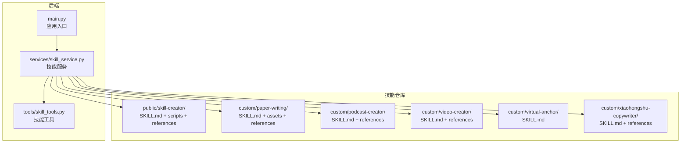
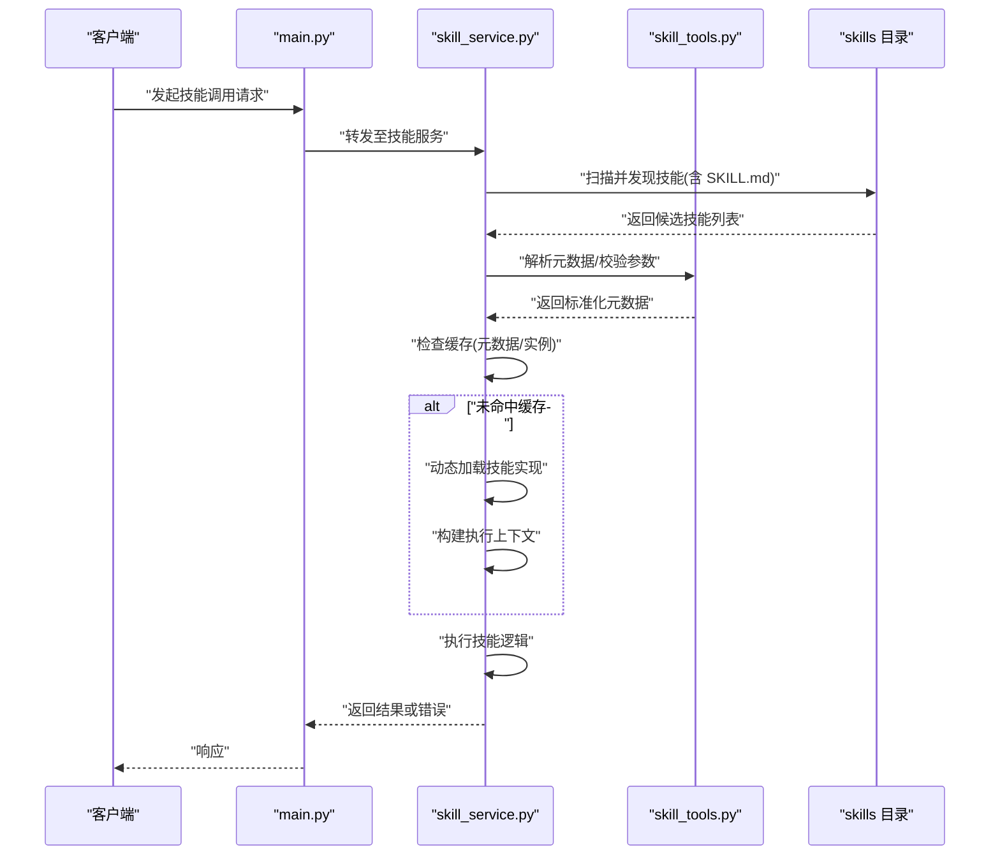
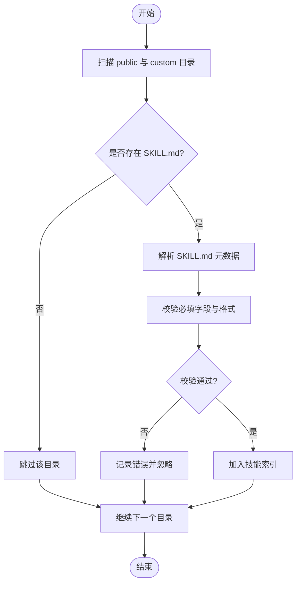
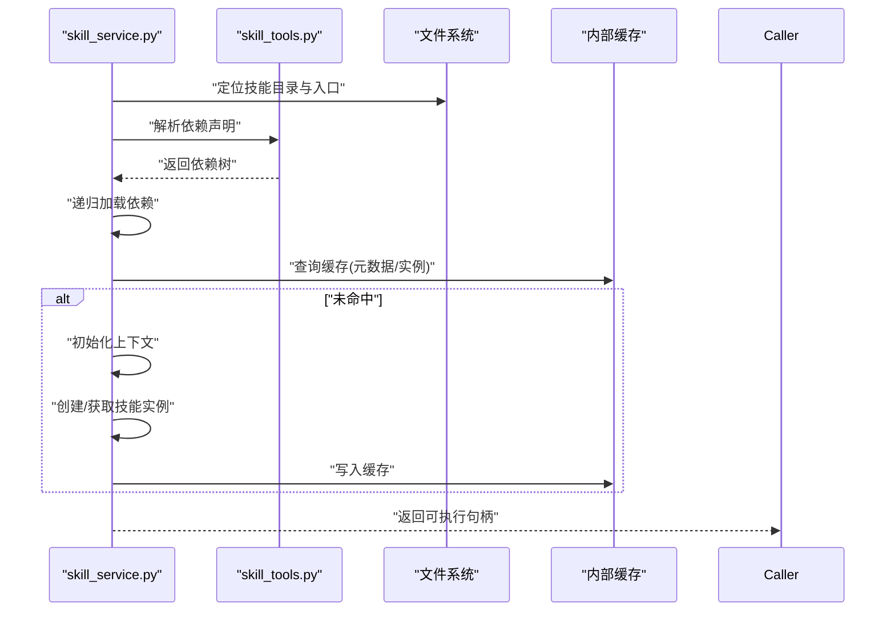
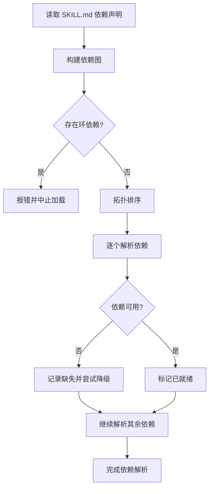
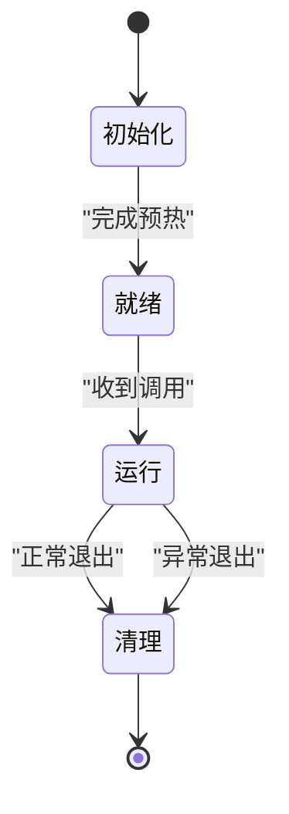
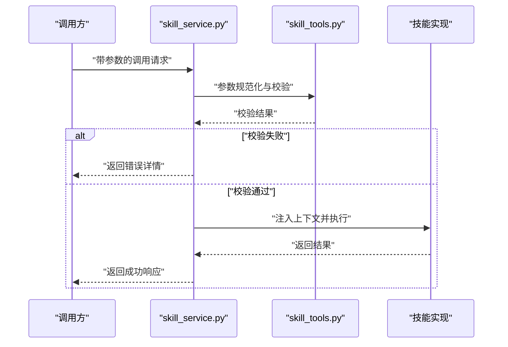
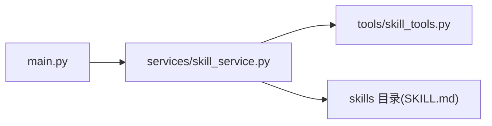

# 技能加载与执行

<cite>
**本文引用的文件**   
- [backend/app/services/skill_service.py](file://backend/app/services/skill_service.py)
- [backend/app/tools/skill_tools.py](file://backend/app/tools/skill_tools.py)
- [backend/app/main.py](file://backend/app/main.py)
- [backend/skills/public/skill-creator/SKILL.md](file://backend/skills/public/skill-creator/SKILL.md)
- [backend/skills/custom/paper-writing/SKILL.md](file://backend/skills/custom/paper-writing/SKILL.md)
- [backend/skills/custom/podcast-creator/SKILL.md](file://backend/skills/custom/podcast-creator/SKILL.md)
- [backend/skills/custom/video-creator/SKILL.md](file://backend/skills/custom/video-creator/SKILL.md)
- [backend/skills/custom/virtual-anchor/SKILL.md](file://backend/skills/custom/virtual-anchor/SKILL.md)
- [backend/skills/custom/xiaohongshu-copywriter/SKILL.md](file://backend/skills/custom/xiaohongshu-copywriter/SKILL.md)
</cite>

## 目录
1. [简介](#简介)
2. [项目结构](#项目结构)
3. [核心组件](#核心组件)
4. [架构总览](#架构总览)
5. [详细组件分析](#详细组件分析)
6. [依赖分析](#依赖分析)
7. [性能考虑](#性能考虑)
8. [故障排除指南](#故障排除指南)
9. [结论](#结论)
10. [附录](#附录)

## 简介
本文件聚焦于“技能”的加载与执行机制，围绕以下目标展开：
- 技能发现算法：如何扫描、识别并注册可用技能。
- 动态加载流程：从发现到实例化、缓存与可插拔扩展。
- 依赖解析机制：技能间或工具间的依赖声明与解析策略。
- 生命周期管理：初始化、预热、运行、清理等阶段。
- 上下文传递与参数验证：调用链中的上下文传播与输入校验。
- 执行环境隔离：沙箱/进程隔离与资源限制（可选）。
- 缓存策略：元数据与已加载技能的缓存设计。
- 错误恢复：失败重试、降级与回滚。
- 性能优化：并发、懒加载、批处理与内存控制。
- 调试与排障：日志、断点、诊断接口与常见问题定位。

## 项目结构
后端采用分层组织：服务层负责业务编排，工具层提供具体能力，技能定义以约定式目录与清单文件存在。关键路径如下：
- 服务层：skills_service.py 暴露技能发现、加载、执行等能力。
- 工具层：skill_tools.py 提供与技能相关的通用工具函数。
- 入口：main.py 将服务挂载为 API 路由，供前端或外部系统调用。
- 技能目录：backend/skills/{public,custom} 下按技能组织，每个技能包含 SKILL.md 与 references/scripts/assets 等子项。

图表来源
- [backend/app/main.py](file://backend/app/main.py)
- [backend/app/services/skill_service.py](file://backend/app/services/skill_service.py)
- [backend/app/tools/skill_tools.py](file://backend/app/tools/skill_tools.py)
- [backend/skills/public/skill-creator/SKILL.md](file://backend/skills/public/skill-creator/SKILL.md)
- [backend/skills/custom/paper-writing/SKILL.md](file://backend/skills/custom/paper-writing/SKILL.md)
- [backend/skills/custom/podcast-creator/SKILL.md](file://backend/skills/custom/podcast-creator/SKILL.md)
- [backend/skills/custom/video-creator/SKILL.md](file://backend/skills/custom/video-creator/SKILL.md)
- [backend/skills/custom/virtual-anchor/SKILL.md](file://backend/skills/custom/virtual-anchor/SKILL.md)
- [backend/skills/custom/xiaohongshu-copywriter/SKILL.md](file://backend/skills/custom/xiaohongshu-copywriter/SKILL.md)

章节来源
- [backend/app/main.py](file://backend/app/main.py)
- [backend/app/services/skill_service.py](file://backend/app/services/skill_service.py)
- [backend/app/tools/skill_tools.py](file://backend/app/tools/skill_tools.py)
- [backend/skills/public/skill-creator/SKILL.md](file://backend/skills/public/skill-creator/SKILL.md)
- [backend/skills/custom/paper-writing/SKILL.md](file://backend/skills/custom/paper-writing/SKILL.md)
- [backend/skills/custom/podcast-creator/SKILL.md](file://backend/skills/custom/podcast-creator/SKILL.md)
- [backend/skills/custom/video-creator/SKILL.md](file://backend/skills/custom/video-creator/SKILL.md)
- [backend/skills/custom/virtual-anchor/SKILL.md](file://backend/skills/custom/virtual-anchor/SKILL.md)
- [backend/skills/custom/xiaohongshu-copywriter/SKILL.md](file://backend/skills/custom/xiaohongshu-copywriter/SKILL.md)

## 核心组件
- 技能服务（Skill Service）
  - 职责：技能发现、元数据解析、动态加载、执行编排、缓存管理、错误恢复。
  - 关键能力：
    - 发现：扫描 public 与 custom 目录，识别具备 SKILL.md 的技能包。
    - 解析：读取 SKILL.md 中的描述、版本、依赖、参数契约等。
    - 加载：按需导入脚本或初始化运行时对象，建立能力索引。
    - 执行：根据请求参数选择技能，注入上下文，调用实现。
    - 缓存：对元数据与已加载实例进行缓存，支持失效与更新。
    - 容错：捕获异常、记录日志、返回结构化错误信息。
- 技能工具（Skill Tools）
  - 职责：提供与技能系统相关的通用方法，如路径解析、清单校验、参数规范化、日志封装等。
- 入口与路由（Main）
  - 职责：启动服务，注册技能相关 API，连接服务与外部调用方。

章节来源
- [backend/app/services/skill_service.py](file://backend/app/services/skill_service.py)
- [backend/app/tools/skill_tools.py](file://backend/app/tools/skill_tools.py)
- [backend/app/main.py](file://backend/app/main.py)

## 架构总览
下图展示了从请求进入、技能发现、动态加载到执行与返回的整体流程，以及缓存与错误处理的介入点。

图表来源
- [backend/app/main.py](file://backend/app/main.py)
- [backend/app/services/skill_service.py](file://backend/app/services/skill_service.py)
- [backend/app/tools/skill_tools.py](file://backend/app/tools/skill_tools.py)
- [backend/skills/public/skill-creator/SKILL.md](file://backend/skills/public/skill-creator/SKILL.md)

## 详细组件分析

### 技能发现算法
- 扫描范围：public 与 custom 两个根目录下的子目录。
- 识别规则：每个技能目录需包含 SKILL.md；若存在 scripts 或 references 则作为增强资源。
- 输出产物：技能 ID、名称、版本、描述、依赖声明、参数契约、入口标识等。
- 增量发现：支持监听目录变更或定时刷新，避免全量扫描带来的开销。

图表来源
- [backend/app/services/skill_service.py](file://backend/app/services/skill_service.py)
- [backend/app/tools/skill_tools.py](file://backend/app/tools/skill_tools.py)
- [backend/skills/public/skill-creator/SKILL.md](file://backend/skills/public/skill-creator/SKILL.md)

章节来源
- [backend/app/services/skill_service.py](file://backend/app/services/skill_service.py)
- [backend/app/tools/skill_tools.py](file://backend/app/tools/skill_tools.py)
- [backend/skills/public/skill-creator/SKILL.md](file://backend/skills/public/skill-creator/SKILL.md)

### 动态加载流程
- 触发时机：首次调用或缓存失效时。
- 加载步骤：
  - 依据技能 ID 定位目录与入口。
  - 解析依赖声明，递归解析并预加载必要资源。
  - 初始化运行时上下文（配置、工作空间、权限、日志通道）。
  - 实例化技能对象或准备可调用入口。
  - 写入缓存（元数据与实例），设置过期策略。
- 安全边界：限制文件系统访问、网络调用白名单、资源配额。

图表来源
- [backend/app/services/skill_service.py](file://backend/app/services/skill_service.py)
- [backend/app/tools/skill_tools.py](file://backend/app/tools/skill_tools.py)

章节来源
- [backend/app/services/skill_service.py](file://backend/app/services/skill_service.py)
- [backend/app/tools/skill_tools.py](file://backend/app/tools/skill_tools.py)

### 依赖解析机制
- 声明方式：在 SKILL.md 中声明依赖（例如其他技能、外部工具、资源文件）。
- 解析策略：
  - 拓扑排序：确保依赖先于被依赖者加载。
  - 冲突检测：同名依赖的版本兼容性与覆盖策略。
  - 懒加载：仅在实际需要时加载深层依赖，降低冷启动成本。
- 校验与回退：
  - 缺失依赖时给出明确错误提示。
  - 可选依赖降级为无功能模式或默认实现。

图表来源
- [backend/app/services/skill_service.py](file://backend/app/services/skill_service.py)
- [backend/app/tools/skill_tools.py](file://backend/app/tools/skill_tools.py)

章节来源
- [backend/app/services/skill_service.py](file://backend/app/services/skill_service.py)
- [backend/app/tools/skill_tools.py](file://backend/app/tools/skill_tools.py)

### 生命周期管理
- 阶段划分：
  - 初始化：加载配置、建立连接、预热资源。
  - 就绪：注册能力、暴露入口、健康检查。
  - 运行：接收请求、执行逻辑、产出结果。
  - 清理：释放资源、关闭连接、持久化状态。
- 钩子与事件：
  - 支持 on_init、on_ready、on_execute、on_cleanup 等钩子。
  - 事件总线用于跨组件通知（如缓存失效、依赖更新）。

图表来源
- [backend/app/services/skill_service.py](file://backend/app/services/skill_service.py)

章节来源
- [backend/app/services/skill_service.py](file://backend/app/services/skill_service.py)

### 上下文传递与参数验证
- 上下文内容：
  - 会话标识、用户身份、工作空间路径、日志通道、配置快照、临时目录。
- 传递方式：
  - 显式传入：每次调用携带上下文对象。
  - 隐式注入：基于线程局部存储或异步上下文管理器。
- 参数验证：
  - 类型校验、必填字段、取值范围、格式约束。
  - 失败时返回结构化错误码与修复建议。

图表来源
- [backend/app/services/skill_service.py](file://backend/app/services/skill_service.py)
- [backend/app/tools/skill_tools.py](file://backend/app/tools/skill_tools.py)

章节来源
- [backend/app/services/skill_service.py](file://backend/app/services/skill_service.py)
- [backend/app/tools/skill_tools.py](file://backend/app/tools/skill_tools.py)

### 执行环境隔离
- 进程级隔离：为高风险技能启动独立进程，限制 CPU/内存/IO。
- 沙箱化：禁用危险系统调用，限制网络访问与文件系统范围。
- 资源配额：令牌桶限流、超时控制、并发度上限。
- 审计与追踪：记录执行轨迹、资源使用与异常堆栈。

章节来源
- [backend/app/services/skill_service.py](file://backend/app/services/skill_service.py)

### 缓存策略
- 缓存粒度：
  - 元数据缓存：SKILL.md 解析后的结构化信息。
  - 实例缓存：已初始化的技能对象或入口句柄。
- 失效策略：
  - 时间 TTL：定期刷新。
  - 事件驱动：文件变更或依赖更新触发失效。
- 一致性：
  - 多实例场景下使用分布式锁或版本号保证一致性。

章节来源
- [backend/app/services/skill_service.py](file://backend/app/services/skill_service.py)

### 错误恢复机制
- 分类处理：
  - 参数错误：快速失败，返回修复建议。
  - 依赖缺失：尝试降级或提示安装。
  - 运行时异常：重试、熔断、回滚部分副作用。
- 可观测性：
  - 结构化日志、指标上报、错误聚合。
- 自愈：
  - 自动重启失败实例、热重载配置与依赖。

章节来源
- [backend/app/services/skill_service.py](file://backend/app/services/skill_service.py)

### 性能优化方案
- 懒加载与按需初始化：减少冷启动开销。
- 批量处理：合并小任务，提升吞吐。
- 并发控制：基于队列与信号量的并发调度。
- 内存管理：对象池、弱引用、及时释放大对象。
- IO 优化：异步 IO、缓冲与分页读取。

章节来源
- [backend/app/services/skill_service.py](file://backend/app/services/skill_service.py)

## 依赖分析
- 模块耦合：
  - main.py 依赖 skill_service.py 暴露 API。
  - skill_service.py 依赖 skill_tools.py 提供通用能力。
  - 两者共同消费 skills 目录中的 SKILL.md 与资源。
- 外部依赖：
  - 文件系统、日志库、配置源、可能的分布式缓存。
- 潜在循环：
  - 技能间依赖应通过声明式解析避免代码级循环导入。

图表来源
- [backend/app/main.py](file://backend/app/main.py)
- [backend/app/services/skill_service.py](file://backend/app/services/skill_service.py)
- [backend/app/tools/skill_tools.py](file://backend/app/tools/skill_tools.py)
- [backend/skills/public/skill-creator/SKILL.md](file://backend/skills/public/skill-creator/SKILL.md)

章节来源
- [backend/app/main.py](file://backend/app/main.py)
- [backend/app/services/skill_service.py](file://backend/app/services/skill_service.py)
- [backend/app/tools/skill_tools.py](file://backend/app/tools/skill_tools.py)
- [backend/skills/public/skill-creator/SKILL.md](file://backend/skills/public/skill-creator/SKILL.md)

## 性能考虑
- 冷启动优化：预扫描公共技能、延迟加载自定义技能。
- 缓存命中率：合理设置 TTL 与失效策略，避免频繁重建。
- 并发模型：结合协程与线程池，平衡 CPU 与 IO 密集型任务。
- 资源监控：跟踪内存峰值、GC 频率、线程阻塞情况。
- 压测与基准：针对典型技能负载进行端到端压测，定位瓶颈。

[本节为通用指导，不直接分析具体文件]

## 故障排除指南
- 常见问题
  - 技能未被发现：检查目录结构与 SKILL.md 是否齐全。
  - 依赖缺失：查看依赖声明与解析日志，确认路径与权限。
  - 参数校验失败：对照参数契约修正输入。
  - 执行超时：调整超时阈值或优化实现。
- 定位手段
  - 启用详细日志，关注错误堆栈与上下文快照。
  - 使用诊断接口查看技能索引、缓存状态与健康检查。
  - 逐步缩小范围：最小复现用例、隔离外部依赖。
- 恢复措施
  - 清理缓存后重试。
  - 回滚到上一稳定版本。
  - 重启服务或特定技能实例。

章节来源
- [backend/app/services/skill_service.py](file://backend/app/services/skill_service.py)
- [backend/app/tools/skill_tools.py](file://backend/app/tools/skill_tools.py)

## 结论
本机制通过约定式目录与清单文件实现了技能的自描述与可插拔扩展；借助服务层完成发现、解析、加载、执行与缓存的全链路管理；配合严格的参数校验、上下文传递与环境隔离，保障系统的稳定性与安全性；同时提供完善的错误恢复与性能优化策略，满足生产环境的可靠性要求。

[本节为总结性内容，不直接分析具体文件]

## 附录
- 示例技能清单参考
  - [public/skill-creator/SKILL.md](file://backend/skills/public/skill-creator/SKILL.md)
  - [custom/paper-writing/SKILL.md](file://backend/skills/custom/paper-writing/SKILL.md)
  - [custom/podcast-creator/SKILL.md](file://backend/skills/custom/podcast-creator/SKILL.md)
  - [custom/video-creator/SKILL.md](file://backend/skills/custom/video-creator/SKILL.md)
  - [custom/virtual-anchor/SKILL.md](file://backend/skills/custom/virtual-anchor/SKILL.md)
  - [custom/xiaohongshu-copywriter/SKILL.md](file://backend/skills/custom/xiaohongshu-copywriter/SKILL.md)

章节来源
- [backend/skills/public/skill-creator/SKILL.md](file://backend/skills/public/skill-creator/SKILL.md)
- [backend/skills/custom/paper-writing/SKILL.md](file://backend/skills/custom/paper-writing/SKILL.md)
- [backend/skills/custom/podcast-creator/SKILL.md](file://backend/skills/custom/podcast-creator/SKILL.md)
- [backend/skills/custom/video-creator/SKILL.md](file://backend/skills/custom/video-creator/SKILL.md)
- [backend/skills/custom/virtual-anchor/SKILL.md](file://backend/skills/custom/virtual-anchor/SKILL.md)
- [backend/skills/custom/xiaohongshu-copywriter/SKILL.md](file://backend/skills/custom/xiaohongshu-copywriter/SKILL.md)