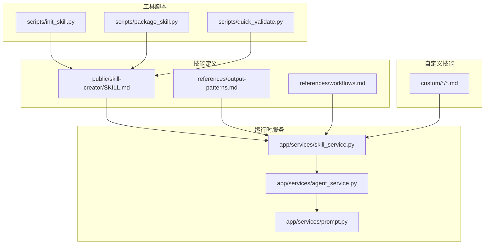
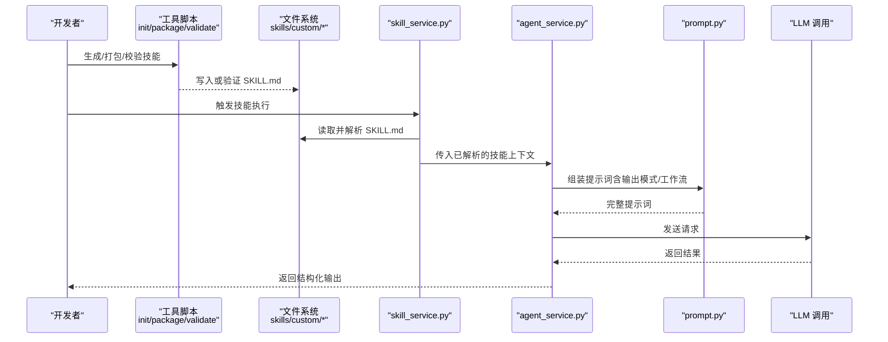
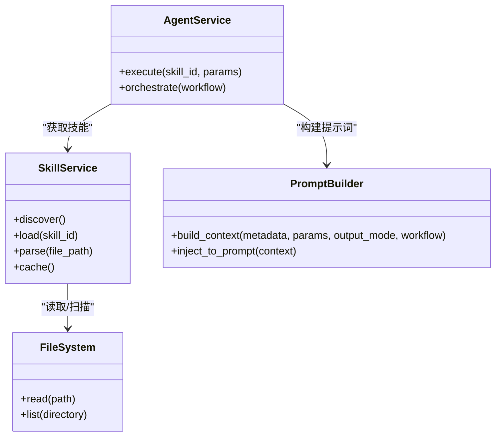
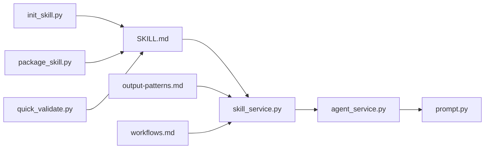

# 技能定义规范

<cite>
**本文引用的文件**   
- [SKILL.md](file://backend/skills/public/skill-creator/SKILL.md)
- [output-patterns.md](file://backend/skills/public/skill-creator/references/output-patterns.md)
- [workflows.md](file://backend/skills/public/skill-creator/references/workflows.md)
- [init_skill.py](file://backend/skills/public/skill-creator/scripts/init_skill.py)
- [package_skill.py](file://backend/skills/public/skill-creator/scripts/package_skill.py)
- [quick_validate.py](file://backend/skills/public/skill-creator/scripts/quick_validate.py)
- [skill_service.py](file://backend/app/services/skill_service.py)
- [agent_service.py](file://backend/app/services/agent_service.py)
- [prompt.py](file://backend/app/services/prompt.py)
</cite>

## 目录
1. [简介](#简介)
2. [项目结构](#项目结构)
3. [核心组件](#核心组件)
4. [架构总览](#架构总览)
5. [详细组件分析](#详细组件分析)
6. [依赖关系分析](#依赖关系分析)
7. [性能与可扩展性](#性能与可扩展性)
8. [故障排查指南](#故障排查指南)
9. [结论](#结论)
10. [附录](#附录)

## 简介
本规范面向开发者，系统化说明 SKILL.md 技能定义文件的语法、元数据、参数配置、输出模式与业务流程定义格式。文档同时提供示例路径、最佳实践、常见错误处理策略以及版本兼容性与向后兼容建议，帮助开发者正确编写符合规范的自定义技能。

## 项目结构
与技能定义相关的核心资源位于后端 skills 目录：
- public/skill-creator：官方提供的“技能创建器”参考实现与模板，包含 SKILL.md 主规范、输出模式参考、工作流参考以及初始化/打包/校验脚本。
- custom：用户自定义技能存放位置（示例包括论文写作、播客创作、视频创作、虚拟主播、小红书文案等）。
- app/services：运行时加载、解析、执行技能的后台服务。

图表来源
- [SKILL.md](file://backend/skills/public/skill-creator/SKILL.md)
- [output-patterns.md](file://backend/skills/public/skill-creator/references/output-patterns.md)
- [workflows.md](file://backend/skills/public/skill-creator/references/workflows.md)
- [init_skill.py](file://backend/skills/public/skill-creator/scripts/init_skill.py)
- [package_skill.py](file://backend/skills/public/skill-creator/scripts/package_skill.py)
- [quick_validate.py](file://backend/skills/public/skill-creator/scripts/quick_validate.py)
- [skill_service.py](file://backend/app/services/skill_service.py)
- [agent_service.py](file://backend/app/services/agent_service.py)
- [prompt.py](file://backend/app/services/prompt.py)

章节来源
- [SKILL.md](file://backend/skills/public/skill-creator/SKILL.md)
- [output-patterns.md](file://backend/skills/public/skill-creator/references/output-patterns.md)
- [workflows.md](file://backend/skills/public/skill-creator/references/workflows.md)
- [init_skill.py](file://backend/skills/public/skill-creator/scripts/init_skill.py)
- [package_skill.py](file://backend/skills/public/skill-creator/scripts/package_skill.py)
- [quick_validate.py](file://backend/skills/public/skill-creator/scripts/quick_validate.py)
- [skill_service.py](file://backend/app/services/skill_service.py)
- [agent_service.py](file://backend/app/services/agent_service.py)
- [prompt.py](file://backend/app/services/prompt.py)

## 核心组件
- SKILL.md 主规范：定义技能描述、元数据、参数、输出模式、工作流等核心字段与语法规则。
- 输出模式参考：约定结构化输出（如 JSON Schema）的写法与约束。
- 工作流参考：定义多步骤流程、分支条件、循环与状态传递。
- 工具脚本：
  - init_skill.py：快速生成标准技能骨架。
  - package_skill.py：将技能打包为可分发资产。
  - quick_validate.py：对 SKILL.md 进行基础语法与必填项校验。
- 运行时服务：
  - skill_service.py：发现、加载、解析并缓存技能。
  - agent_service.py：编排调用技能与工作流。
  - prompt.py：将 SKILL.md 内容注入提示词上下文。

章节来源
- [SKILL.md](file://backend/skills/public/skill-creator/SKILL.md)
- [output-patterns.md](file://backend/skills/public/skill-creator/references/output-patterns.md)
- [workflows.md](file://backend/skills/public/skill-creator/references/workflows.md)
- [init_skill.py](file://backend/skills/public/skill-creator/scripts/init_skill.py)
- [package_skill.py](file://backend/skills/public/skill-creator/scripts/package_skill.py)
- [quick_validate.py](file://backend/skills/public/skill-creator/scripts/quick_validate.py)
- [skill_service.py](file://backend/app/services/skill_service.py)
- [agent_service.py](file://backend/app/services/agent_service.py)
- [prompt.py](file://backend/app/services/prompt.py)

## 架构总览
下图展示从“技能定义”到“运行时执行”的关键链路：

图表来源
- [SKILL.md](file://backend/skills/public/skill-creator/SKILL.md)
- [init_skill.py](file://backend/skills/public/skill-creator/scripts/init_skill.py)
- [package_skill.py](file://backend/skills/public/skill-creator/scripts/package_skill.py)
- [quick_validate.py](file://backend/skills/public/skill-creator/scripts/quick_validate.py)
- [skill_service.py](file://backend/app/services/skill_service.py)
- [agent_service.py](file://backend/app/services/agent_service.py)
- [prompt.py](file://backend/app/services/prompt.py)

## 详细组件分析

### SKILL.md 文件格式与语法
- 文件定位
  - 每个技能以根级 SKILL.md 作为入口，位于各自技能目录中。
  - 公共参考位于 public/skill-creator/SKILL.md。
- 基本结构
  - 标题与摘要：简要说明技能用途与适用场景。
  - 元数据：标识符、版本、作者、许可证、依赖等。
  - 参数定义：输入参数的名称、类型、默认值、是否必填、取值范围与示例。
  - 输出模式：约定输出的数据结构（推荐采用 JSON Schema 风格），用于下游稳定消费。
  - 工作流：按步骤描述执行流程，支持分支、循环、中间变量与错误处理。
  - 参考与附件：references、assets 等子目录引用。
- 关键规则
  - 使用清晰的层级标题组织内容。
  - 参数与输出模式需保持命名一致，避免歧义。
  - 工作流步骤应原子化、可测试、可回滚。
  - 所有外部依赖需在元数据中声明。
- 示例路径
  - 公共参考：[SKILL.md](file://backend/skills/public/skill-creator/SKILL.md)
  - 自定义示例：参见 custom 下各技能目录中的 SKILL.md。

章节来源
- [SKILL.md](file://backend/skills/public/skill-creator/SKILL.md)

### 元数据定义
- 关键字段
  - id：技能唯一标识，建议采用小写字母、数字与连字符。
  - version：语义化版本号，遵循 v1.2.3 格式。
  - author/maintainer：作者与维护者信息。
  - license：许可证类型。
  - dependencies：外部模型、API、工具清单及版本要求。
  - tags：分类标签，便于检索与筛选。
- 兼容性
  - 新增字段应保持向后兼容；废弃字段需标记 deprecated 并提供迁移指引。
  - 大版本升级时，在变更日志中明确破坏性更新。

章节来源
- [SKILL.md](file://backend/skills/public/skill-creator/SKILL.md)

### 参数配置选项
- 参数属性
  - name：参数名，需与输出模式中对应字段一致。
  - type：数据类型（字符串、整数、布尔、枚举、对象、数组等）。
  - required：是否必填。
  - default：默认值。
  - enum：可选值集合。
  - min/max/length：数值或长度约束。
  - description：参数说明与示例。
- 校验策略
  - 建议在 quick_validate.py 中集成基础校验逻辑。
  - 复杂校验可在运行前由前置脚本完成。

章节来源
- [SKILL.md](file://backend/skills/public/skill-creator/SKILL.md)
- [quick_validate.py](file://backend/skills/public/skill-creator/scripts/quick_validate.py)

### 输出模式规范
- 目标
  - 通过稳定的结构化输出契约，确保下游系统可靠消费。
- 推荐方式
  - 使用类 JSON Schema 的结构化描述，定义顶层对象、字段类型、必填项、枚举与嵌套结构。
  - 为每个字段提供 description 与示例。
- 一致性
  - 输出模式应与参数定义相互呼应，避免语义漂移。
- 参考
  - 输出模式参考文档：[output-patterns.md](file://backend/skills/public/skill-creator/references/output-patterns.md)

章节来源
- [output-patterns.md](file://backend/skills/public/skill-creator/references/output-patterns.md)
- [SKILL.md](file://backend/skills/public/skill-creator/SKILL.md)

### 业务流程定义格式（工作流）
- 组成要素
  - steps：有序步骤列表，每步包含名称、描述、输入、输出、条件与异常处理。
  - variables：中间变量与作用域。
  - conditions：分支判断与路由规则。
  - loops：迭代与批量处理。
  - error_handling：重试、降级与回滚策略。
- 设计原则
  - 单步职责单一，具备幂等性。
  - 显式声明失败路径与恢复动作。
  - 控制复杂度，必要时拆分为子工作流。
- 参考
  - 工作流参考文档：[workflows.md](file://backend/skills/public/skill-creator/references/workflows.md)

章节来源
- [workflows.md](file://backend/skills/public/skill-creator/references/workflows.md)
- [SKILL.md](file://backend/skills/public/skill-creator/SKILL.md)

### 工具脚本与生命周期
- 初始化
  - 使用 init_skill.py 快速生成标准骨架，减少样板代码。
- 打包
  - 使用 package_skill.py 将 SKILL.md 与 references/assets 打包为可分发资产。
- 校验
  - 使用 quick_validate.py 进行语法与必填项检查，保障质量门禁。
- 建议
  - 在 CI 中集成校验与打包步骤，确保发布物一致性。

章节来源
- [init_skill.py](file://backend/skills/public/skill-creator/scripts/init_skill.py)
- [package_skill.py](file://backend/skills/public/skill-creator/scripts/package_skill.py)
- [quick_validate.py](file://backend/skills/public/skill-creator/scripts/quick_validate.py)

### 运行时服务与集成点
- 技能发现与加载
  - skill_service.py 负责扫描、解析与缓存 SKILL.md，暴露统一接口供上层调用。
- 编排与提示词注入
  - agent_service.py 根据工作流编排步骤，调用 prompt.py 组装提示词上下文。
- 提示词构建
  - prompt.py 将元数据、参数、输出模式与工作流注入提示词，驱动 LLM 执行。
- 扩展点
  - 可通过插件机制接入新的工具与外部 API。

图表来源
- [skill_service.py](file://backend/app/services/skill_service.py)
- [agent_service.py](file://backend/app/services/agent_service.py)
- [prompt.py](file://backend/app/services/prompt.py)

章节来源
- [skill_service.py](file://backend/app/services/skill_service.py)
- [agent_service.py](file://backend/app/services/agent_service.py)
- [prompt.py](file://backend/app/services/prompt.py)

## 依赖关系分析
- 内部依赖
  - SKILL.md 是运行时服务的输入契约。
  - 工具脚本围绕 SKILL.md 提供开发期能力（生成、打包、校验）。
  - 运行时服务串联“发现-解析-编排-提示词构建-执行”。
- 外部依赖
  - 元数据中声明的模型/API/工具需在部署环境可用。
- 潜在风险
  - 循环依赖应避免，建议通过接口抽象解耦。
  - 版本不一致可能导致解析失败，需严格校验。

图表来源
- [SKILL.md](file://backend/skills/public/skill-creator/SKILL.md)
- [output-patterns.md](file://backend/skills/public/skill-creator/references/output-patterns.md)
- [workflows.md](file://backend/skills/public/skill-creator/references/workflows.md)
- [init_skill.py](file://backend/skills/public/skill-creator/scripts/init_skill.py)
- [package_skill.py](file://backend/skills/public/skill-creator/scripts/package_skill.py)
- [quick_validate.py](file://backend/skills/public/skill-creator/scripts/quick_validate.py)
- [skill_service.py](file://backend/app/services/skill_service.py)
- [agent_service.py](file://backend/app/services/agent_service.py)
- [prompt.py](file://backend/app/services/prompt.py)

## 性能与可扩展性
- 缓存策略
  - 对已解析的 SKILL.md 进行内存/磁盘缓存，减少重复 IO 与解析开销。
- 并发与限流
  - 对外部 API 调用增加并发限制与退避重试。
- 增量校验
  - 仅在文件变更时重新解析与校验，降低启动成本。
- 模块化
  - 将工作流步骤抽象为可复用单元，提升组合效率。

## 故障排查指南
- 常见问题
  - 缺少必填字段：使用 quick_validate.py 提前拦截。
  - 输出模式不匹配：对照 output-patterns.md 修正结构。
  - 工作流死循环：检查条件与终止条件。
  - 依赖不可用：核对元数据中的依赖版本与环境配置。
- 定位方法
  - 查看解析日志与校验报告。
  - 逐步缩小问题范围至具体步骤或字段。
- 修复建议
  - 优先修复元数据与参数定义，再调整工作流与输出模式。
  - 引入最小可复现用例，回归测试覆盖关键路径。

章节来源
- [quick_validate.py](file://backend/skills/public/skill-creator/scripts/quick_validate.py)
- [output-patterns.md](file://backend/skills/public/skill-creator/references/output-patterns.md)
- [workflows.md](file://backend/skills/public/skill-creator/references/workflows.md)
- [SKILL.md](file://backend/skills/public/skill-creator/SKILL.md)

## 结论
通过统一的 SKILL.md 规范、严格的输出模式与工作流定义，以及完善的工具链与服务集成，团队可以高效地创建、分发与运行高质量技能。遵循本规范与最佳实践，可显著降低维护成本与出错概率，提升系统的稳定性与可演进性。

## 附录
- 编写指南
  - 先写元数据与参数，再定义输出模式，最后细化工作流。
  - 为每个字段提供清晰描述与示例，避免歧义。
  - 在 CI 中集成 quick_validate.py，保证提交质量。
- 版本兼容与向后兼容策略
  - 新增字段默认可选，旧客户端忽略未知字段。
  - 废弃字段保留至少一个大版本，并给出迁移说明。
  - 破坏性变更需提高主版本号，并在变更日志中明确影响面。
- 参考路径
  - 公共规范与参考：[SKILL.md](file://backend/skills/public/skill-creator/SKILL.md)、[output-patterns.md](file://backend/skills/public/skill-creator/references/output-patterns.md)、[workflows.md](file://backend/skills/public/skill-creator/references/workflows.md)
  - 工具脚本：[init_skill.py](file://backend/skills/public/skill-creator/scripts/init_skill.py)、[package_skill.py](file://backend/skills/public/skill-creator/scripts/package_skill.py)、[quick_validate.py](file://backend/skills/public/skill-creator/scripts/quick_validate.py)
  - 运行时服务：[skill_service.py](file://backend/app/services/skill_service.py)、[agent_service.py](file://backend/app/services/agent_service.py)、[prompt.py](file://backend/app/services/prompt.py)