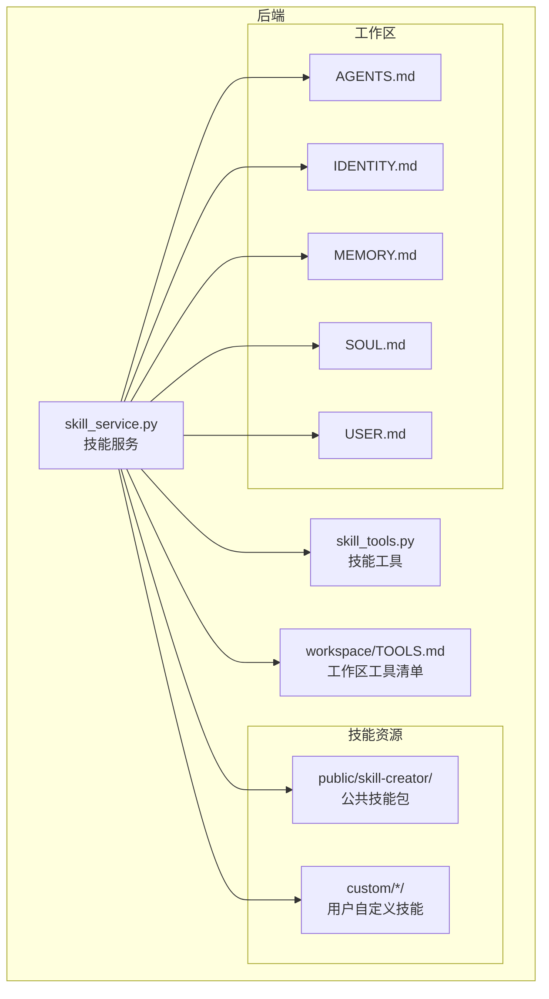
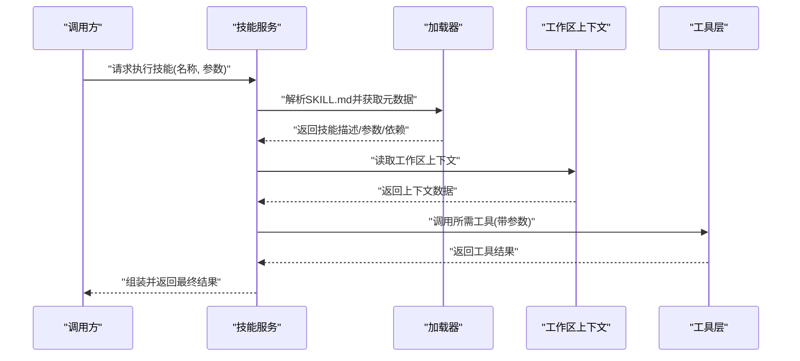
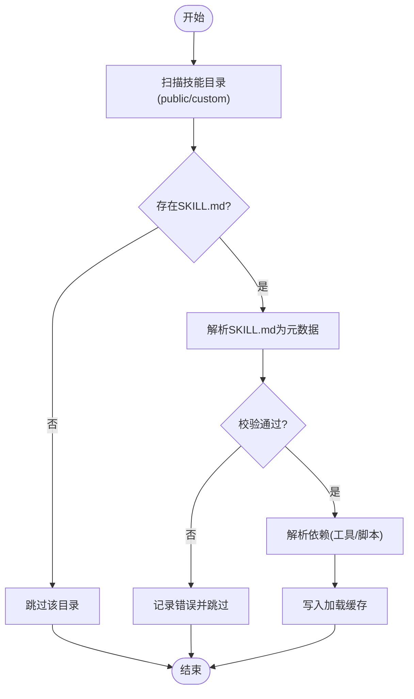
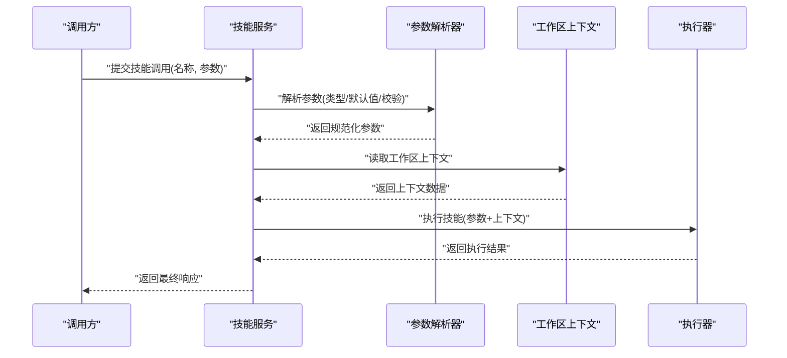
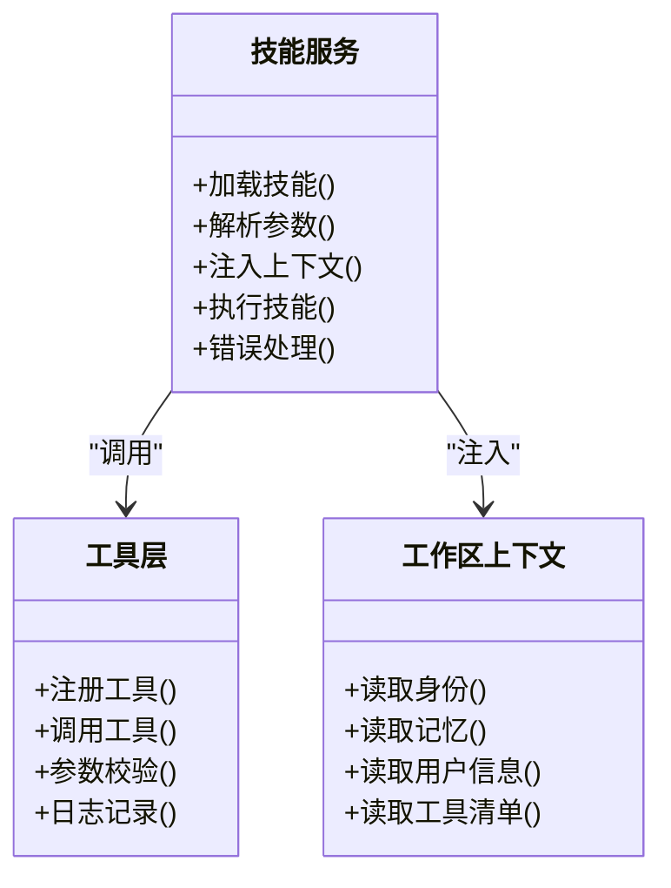
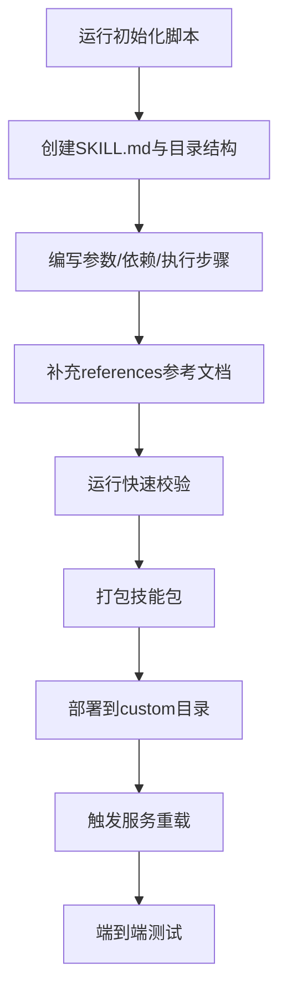
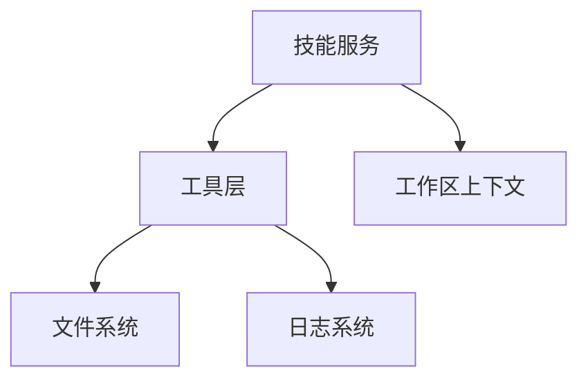

# 技能系统

<cite>
**本文引用的文件**   
- [backend/app/services/skill_service.py](file://backend/app/services/skill_service.py)
- [backend/app/tools/skill_tools.py](file://backend/app/tools/skill_tools.py)
- [backend/skills/public/skill-creator/SKILL.md](file://backend/skills/public/skill-creator/SKILL.md)
- [backend/skills/custom/paper-writing/references/research_tips.md](file://backend/skills/custom/paper-writing/references/research_tips.md)
- [backend/skills/custom/video-creator/references/storyboard_format.md](file://backend/skills/custom/video-creator/references/storyboard_format.md)
- [backend/skills/custom/xiaohongshu-copywriter/references/xiaohongshu_tags.md](file://backend/skills/custom/xiaohongshu-copywriter/references/xiaohongshu_tags.md)
- [backend/skills/custom/xiaohongshu-copywriter/references/xiaohongshu_template.md](file://backend/skills/custom/xiaohongshu-copywriter/references/xiaohongshu_template.md)
- [backend/skills/public/skill-creator/scripts/init_skill.py](file://backend/skills/public/skill-creator/scripts/init_skill.py)
- [backend/skills/public/skill-creator/scripts/package_skill.py](file://backend/skills/public/skill-creator/scripts/package_skill.py)
- [backend/skills/public/skill-creator/scripts/quick_validate.py](file://backend/skills/public/skill-creator/scripts/quick_validate.py)
- [backend/workspace/TOOLS.md](file://backend/workspace/TOOLS.md)
- [backend/workspace/AGENTS.md](file://backend/workspace/AGENTS.md)
- [backend/workspace/MEMORY.md](file://backend/workspace/MEMORY.md)
- [backend/workspace/IDENTITY.md](file://backend/workspace/IDENTITY.md)
- [backend/workspace/SOUL.md](file://backend/workspace/SOUL.md)
- [backend/workspace/USER.md](file://backend/workspace/USER.md)
- [polystudio-client/SKILL.md](file://polystudio-client/SKILL.md)
</cite>

## 目录
1. [简介](#简介)
2. [项目结构](#项目结构)
3. [核心组件](#核心组件)
4. [架构总览](#架构总览)
5. [详细组件分析](#详细组件分析)
6. [依赖关系分析](#依赖关系分析)
7. [性能考虑](#性能考虑)
8. [故障排查指南](#故障排查指南)
9. [结论](#结论)
10. [附录](#附录)

## 简介
本文件面向开发者，系统化阐述 PolyStudio 后端的“技能系统”。内容涵盖：
- 技能的定义格式与 SKILL.md 规范
- 技能的加载机制、参数解析与上下文传递
- 执行框架与工具集成方式
- 内置技能的功能与使用方法
- 自定义技能开发流程（含初始化、打包、校验）
- 技能包管理、版本控制与依赖解析策略
- 调试工具、测试方法与性能优化建议

目标是帮助开发者快速上手并创建高质量的自定义技能。

## 项目结构
技能系统主要位于后端目录中，围绕“服务层 + 工具层 + 技能资源”组织：
- 服务层：负责技能的发现、加载、编排与执行
- 工具层：提供可被技能调用的具体能力（如图像处理、视频拼接等）
- 技能资源：以目录形式存放 SKILL.md、references、scripts 等资产

图表来源
- [backend/app/services/skill_service.py](file://backend/app/services/skill_service.py)
- [backend/app/tools/skill_tools.py](file://backend/app/tools/skill_tools.py)
- [backend/workspace/TOOLS.md](file://backend/workspace/TOOLS.md)
- [backend/workspace/AGENTS.md](file://backend/workspace/AGENTS.md)
- [backend/workspace/IDENTITY.md](file://backend/workspace/IDENTITY.md)
- [backend/workspace/MEMORY.md](file://backend/workspace/MEMORY.md)
- [backend/workspace/SOUL.md](file://backend/workspace/SOUL.md)
- [backend/workspace/USER.md](file://backend/workspace/USER.md)

章节来源
- [backend/app/services/skill_service.py](file://backend/app/services/skill_service.py)
- [backend/app/tools/skill_tools.py](file://backend/app/tools/skill_tools.py)
- [backend/workspace/TOOLS.md](file://backend/workspace/TOOLS.md)
- [backend/workspace/AGENTS.md](file://backend/workspace/AGENTS.md)
- [backend/workspace/IDENTITY.md](file://backend/workspace/IDENTITY.md)
- [backend/workspace/MEMORY.md](file://backend/workspace/MEMORY.md)
- [backend/workspace/SOUL.md](file://backend/workspace/SOUL.md)
- [backend/workspace/USER.md](file://backend/workspace/USER.md)

## 核心组件
- 技能服务（Skill Service）
  - 职责：扫描技能目录、解析 SKILL.md、构建技能元数据、维护加载缓存、按调用入口分发执行
  - 关键能力：路径解析、依赖收集、上下文注入、错误隔离与重试
- 技能工具（Skill Tools）
  - 职责：暴露可调用的工具函数，供技能在执行阶段使用；统一参数校验、日志记录与异常包装
- 工作区上下文
  - 职责：提供全局上下文（身份、记忆、用户信息、工具清单等），在技能执行时注入
- 公共技能包（Public Skill Creator）
  - 职责：提供技能脚手架、打包脚本与快速校验工具，辅助开发者标准化产出

章节来源
- [backend/app/services/skill_service.py](file://backend/app/services/skill_service.py)
- [backend/app/tools/skill_tools.py](file://backend/app/tools/skill_tools.py)
- [backend/workspace/TOOLS.md](file://backend/workspace/TOOLS.md)
- [backend/workspace/AGENTS.md](file://backend/workspace/AGENTS.md)
- [backend/workspace/IDENTITY.md](file://backend/workspace/IDENTITY.md)
- [backend/workspace/MEMORY.md](file://backend/workspace/MEMORY.md)
- [backend/workspace/SOUL.md](file://backend/workspace/SOUL.md)
- [backend/workspace/USER.md](file://backend/workspace/USER.md)

## 架构总览
技能系统的整体交互如下：上层通过服务接口请求执行某项技能，服务根据 SKILL.md 解析出参数、依赖与执行步骤，注入工作区上下文，调用工具层完成实际任务，并将结果返回。

图表来源
- [backend/app/services/skill_service.py](file://backend/app/services/skill_service.py)
- [backend/app/tools/skill_tools.py](file://backend/app/tools/skill_tools.py)
- [backend/workspace/TOOLS.md](file://backend/workspace/TOOLS.md)

## 详细组件分析

### 技能定义与 SKILL.md 规范
- 位置约定
  - 公共技能包位于 public 子目录，便于共享与复用
  - 自定义技能位于 custom 子目录，支持多技能并存
- 文件结构
  - 根目录包含 SKILL.md，用于声明技能元数据、参数、依赖与执行说明
  - references 目录存放参考文档或模板，供技能执行时引用
  - scripts 目录存放辅助脚本（初始化、打包、校验等）
- 示例参考
  - 公共技能包：[backend/skills/public/skill-creator/SKILL.md](file://backend/skills/public/skill-creator/SKILL.md)
  - 论文写作参考：[backend/skills/custom/paper-writing/references/research_tips.md](file://backend/skills/custom/paper-writing/references/research_tips.md)
  - 视频创作分镜格式：[backend/skills/custom/video-creator/references/storyboard_format.md](file://backend/skills/custom/video-creator/references/storyboard_format.md)
  - 小红书文案标签与模板：[backend/skills/custom/xiaohongshu-copywriter/references/xiaohongshu_tags.md](file://backend/skills/custom/xiaohongshu-copywriter/references/xiaohongshu_tags.md), [backend/skills/custom/xiaohongshu-copywriter/references/xiaohongshu_template.md](file://backend/skills/custom/xiaohongshu-copywriter/references/xiaohongshu_template.md)

章节来源
- [backend/skills/public/skill-creator/SKILL.md](file://backend/skills/public/skill-creator/SKILL.md)
- [backend/skills/custom/paper-writing/references/research_tips.md](file://backend/skills/custom/paper-writing/references/research_tips.md)
- [backend/skills/custom/video-creator/references/storyboard_format.md](file://backend/skills/custom/video-creator/references/storyboard_format.md)
- [backend/skills/custom/xiaohongshu-copywriter/references/xiaohongshu_tags.md](file://backend/skills/custom/xiaohongshu-copywriter/references/xiaohongshu_tags.md)
- [backend/skills/custom/xiaohongshu-copywriter/references/xiaohongshu_template.md](file://backend/skills/custom/xiaohongshu-copywriter/references/xiaohongshu_template.md)

### 加载机制与依赖解析
- 扫描策略
  - 遍历 skills 目录下的 public 与 custom 子目录，识别每个技能根目录中的 SKILL.md
- 解析流程
  - 读取 SKILL.md，提取技能名称、版本、参数定义、依赖列表与执行说明
  - 校验必填字段与类型约束，生成技能元数据对象
- 依赖解析
  - 基于 SKILL.md 的依赖声明，收集外部工具或脚本依赖
  - 对缺失依赖进行提示或跳过（取决于配置）
- 缓存与热更新
  - 对已加载的技能元数据进行缓存，避免重复 IO
  - 支持按需刷新特定技能或全部技能

图表来源
- [backend/app/services/skill_service.py](file://backend/app/services/skill_service.py)

章节来源
- [backend/app/services/skill_service.py](file://backend/app/services/skill_service.py)

### 参数解析与上下文传递
- 参数解析
  - 从 SKILL.md 的参数定义中提取键名、类型、默认值与校验规则
  - 将调用方传入的参数与默认值合并，进行类型转换与合法性检查
- 上下文传递
  - 从工作区上下文读取身份、记忆、用户信息等
  - 将上下文注入到技能执行环境，供工具层访问
- 安全与边界
  - 对敏感字段进行脱敏处理
  - 限制参数大小与嵌套深度，防止资源耗尽

图表来源
- [backend/app/services/skill_service.py](file://backend/app/services/skill_service.py)
- [backend/workspace/TOOLS.md](file://backend/workspace/TOOLS.md)

章节来源
- [backend/app/services/skill_service.py](file://backend/app/services/skill_service.py)
- [backend/workspace/TOOLS.md](file://backend/workspace/TOOLS.md)
- [backend/workspace/AGENTS.md](file://backend/workspace/AGENTS.md)
- [backend/workspace/IDENTITY.md](file://backend/workspace/IDENTITY.md)
- [backend/workspace/MEMORY.md](file://backend/workspace/MEMORY.md)
- [backend/workspace/SOUL.md](file://backend/workspace/SOUL.md)
- [backend/workspace/USER.md](file://backend/workspace/USER.md)

### 执行框架与工具集成
- 执行框架
  - 根据 SKILL.md 的执行步骤，顺序或并行调度工具调用
  - 支持中间结果缓存与失败重试
- 工具集成
  - 工具函数通过 skill_tools 暴露，具备统一的输入输出契约
  - 工具内部实现可封装复杂逻辑（如音视频处理、模型调用等）
- 错误处理
  - 捕获工具异常并转换为标准错误对象
  - 提供详细的错误定位与恢复建议

图表来源
- [backend/app/services/skill_service.py](file://backend/app/services/skill_service.py)
- [backend/app/tools/skill_tools.py](file://backend/app/tools/skill_tools.py)
- [backend/workspace/TOOLS.md](file://backend/workspace/TOOLS.md)

章节来源
- [backend/app/services/skill_service.py](file://backend/app/services/skill_service.py)
- [backend/app/tools/skill_tools.py](file://backend/app/tools/skill_tools.py)
- [backend/workspace/TOOLS.md](file://backend/workspace/TOOLS.md)

### 内置技能与使用方法
- 公共技能包（skill-creator）
  - 提供技能脚手架与打包脚本，帮助开发者快速创建与发布技能
  - 包含快速校验工具，确保 SKILL.md 与目录结构符合规范
- 使用方法
  - 通过服务接口选择并执行对应技能
  - 依据 SKILL.md 提供的参数说明填写必要字段
  - 利用 references 中的模板与参考文档提升输出质量

章节来源
- [backend/skills/public/skill-creator/SKILL.md](file://backend/skills/public/skill-creator/SKILL.md)
- [backend/skills/public/skill-creator/scripts/init_skill.py](file://backend/skills/public/skill-creator/scripts/init_skill.py)
- [backend/skills/public/skill-creator/scripts/package_skill.py](file://backend/skills/public/skill-creator/scripts/package_skill.py)
- [backend/skills/public/skill-creator/scripts/quick_validate.py](file://backend/skills/public/skill-creator/scripts/quick_validate.py)

### 自定义技能开发流程
- 初始化
  - 使用 init_skill 脚本生成标准目录结构与 SKILL.md 模板
- 编写
  - 在 SKILL.md 中定义技能元数据、参数、依赖与执行步骤
  - 在 references 中补充参考文档与模板
- 校验
  - 使用 quick_validate 脚本进行基础校验（字段完整性、类型约束等）
- 打包
  - 使用 package_skill 脚本生成可发布的技能包
- 部署
  - 将技能包放入 custom 目录，重启服务或触发热更新以加载新技能

图表来源
- [backend/skills/public/skill-creator/scripts/init_skill.py](file://backend/skills/public/skill-creator/scripts/init_skill.py)
- [backend/skills/public/skill-creator/scripts/quick_validate.py](file://backend/skills/public/skill-creator/scripts/quick_validate.py)
- [backend/skills/public/skill-creator/scripts/package_skill.py](file://backend/skills/public/skill-creator/scripts/package_skill.py)

章节来源
- [backend/skills/public/skill-creator/scripts/init_skill.py](file://backend/skills/public/skill-creator/scripts/init_skill.py)
- [backend/skills/public/skill-creator/scripts/quick_validate.py](file://backend/skills/public/skill-creator/scripts/quick_validate.py)
- [backend/skills/public/skill-creator/scripts/package_skill.py](file://backend/skills/public/skill-creator/scripts/package_skill.py)

### 技能包管理、版本控制与依赖解析
- 包管理
  - 以目录为单位组织技能，SKILL.md 作为包的入口与契约
- 版本控制
  - 在 SKILL.md 中声明版本号，配合 Git 进行变更追踪
  - 重大变更需遵循向后兼容原则或提供迁移指引
- 依赖解析
  - 解析外部工具与脚本依赖，确保执行环境满足要求
  - 对可选依赖提供降级策略或友好提示

章节来源
- [backend/skills/public/skill-creator/SKILL.md](file://backend/skills/public/skill-creator/SKILL.md)
- [backend/app/services/skill_service.py](file://backend/app/services/skill_service.py)

### 调试工具与测试方法
- 调试
  - 启用详细日志，观察参数解析、上下文注入与工具调用链路
  - 使用 quick_validate 提前发现 SKILL.md 问题
- 测试
  - 单元测试：针对工具函数进行覆盖
  - 集成测试：模拟完整技能执行流程，验证端到端行为
  - 回归测试：在版本升级后复测关键用例

章节来源
- [backend/app/tools/skill_tools.py](file://backend/app/tools/skill_tools.py)
- [backend/skills/public/skill-creator/scripts/quick_validate.py](file://backend/skills/public/skill-creator/scripts/quick_validate.py)

### 性能优化建议
- 加载优化
  - 缓存已解析的技能元数据，减少重复 IO
  - 按需加载，避免一次性扫描所有技能
- 执行优化
  - 并行调用无依赖的工具，缩短总体耗时
  - 对大对象进行流式处理与增量输出
- 资源控制
  - 设置超时与并发上限，防止资源争用
  - 对工具调用进行限流与熔断保护

章节来源
- [backend/app/services/skill_service.py](file://backend/app/services/skill_service.py)
- [backend/app/tools/skill_tools.py](file://backend/app/tools/skill_tools.py)

## 依赖关系分析
- 组件耦合
  - 技能服务强依赖工具层与工作区上下文
  - 工具层相对独立，可通过注册机制扩展
- 外部依赖
  - 依赖文件系统（技能资源）、日志系统与可能的第三方工具
- 潜在循环依赖
  - 应避免工具层反向依赖服务层，保持单向调用

图表来源
- [backend/app/services/skill_service.py](file://backend/app/services/skill_service.py)
- [backend/app/tools/skill_tools.py](file://backend/app/tools/skill_tools.py)
- [backend/workspace/TOOLS.md](file://backend/workspace/TOOLS.md)

章节来源
- [backend/app/services/skill_service.py](file://backend/app/services/skill_service.py)
- [backend/app/tools/skill_tools.py](file://backend/app/tools/skill_tools.py)
- [backend/workspace/TOOLS.md](file://backend/workspace/TOOLS.md)

## 性能考虑
- 启动阶段
  - 预加载常用技能，降低首次调用延迟
- 运行阶段
  - 使用连接池与缓存减少外部调用开销
  - 对长耗时任务采用异步与分页输出
- 监控与告警
  - 统计技能执行耗时与错误率，设置阈值告警

## 故障排查指南
- 常见问题
  - SKILL.md 字段缺失或类型不匹配：使用 quick_validate 检查
  - 依赖未安装或路径错误：查看服务日志与依赖解析输出
  - 上下文注入失败：检查工作区文件是否存在与权限是否足够
- 定位技巧
  - 开启详细日志，关注参数解析与工具调用链路的断点
  - 逐步缩小范围，先验证工具函数再验证服务编排

章节来源
- [backend/skills/public/skill-creator/scripts/quick_validate.py](file://backend/skills/public/skill-creator/scripts/quick_validate.py)
- [backend/app/services/skill_service.py](file://backend/app/services/skill_service.py)
- [backend/app/tools/skill_tools.py](file://backend/app/tools/skill_tools.py)

## 结论
本技能系统通过标准化的 SKILL.md 定义、完善的加载与执行框架、以及丰富的工具与上下文支持，为开发者提供了高效、可扩展的技能开发与运行机制。借助公共技能包与配套脚本，开发者可以快速创建、校验与发布高质量技能，并通过调试与测试手段保障稳定性与性能。

## 附录
- 客户端技能参考
  - 客户端侧也包含 SKILL.md 参考，可用于理解前后端协作时的技能契约
  - 参考路径：[polystudio-client/SKILL.md](file://polystudio-client/SKILL.md)

章节来源
- [polystudio-client/SKILL.md](file://polystudio-client/SKILL.md)