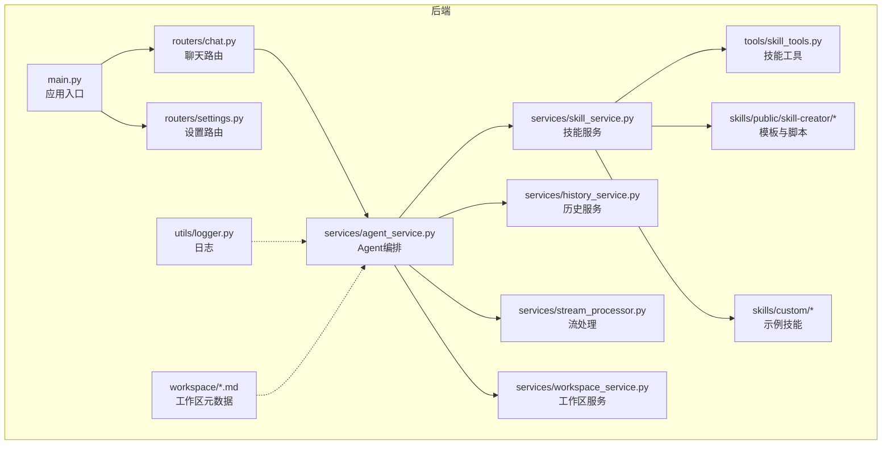
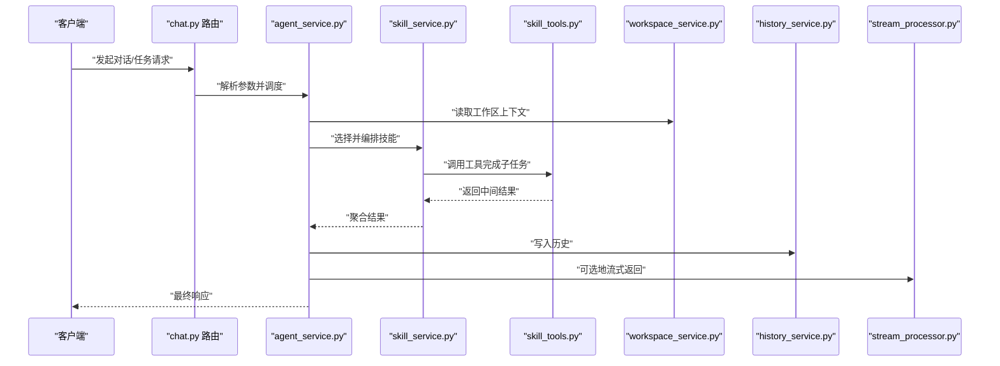
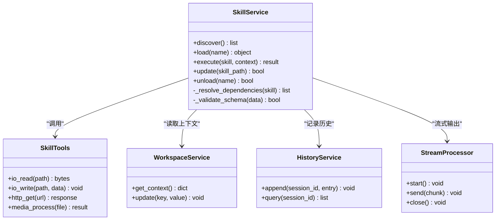
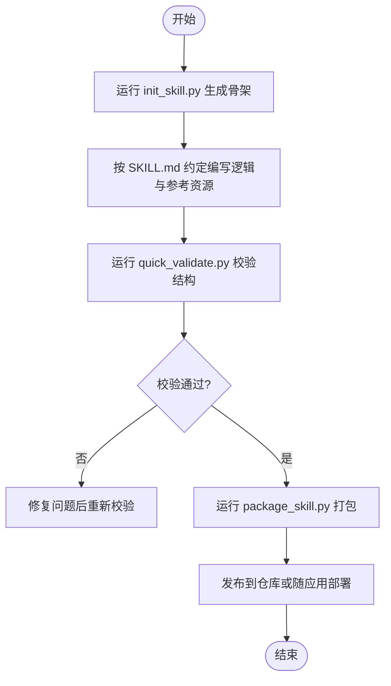
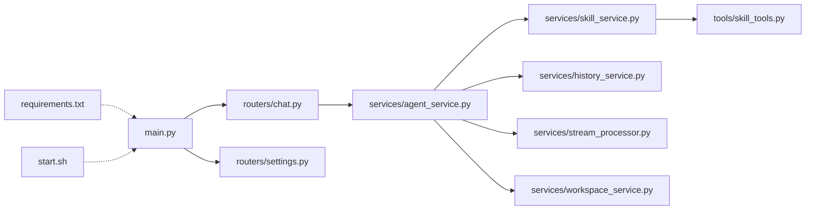

# 自定义技能开发

<cite>
**本文引用的文件**   
- [backend/app/services/skill_service.py](file://backend/app/services/skill_service.py)
- [backend/app/tools/skill_tools.py](file://backend/app/tools/skill_tools.py)
- [backend/skills/public/skill-creator/SKILL.md](file://backend/skills/public/skill-creator/SKILL.md)
- [backend/skills/public/skill-creator/scripts/init_skill.py](file://backend/skills/public/skill-creator/scripts/init_skill.py)
- [backend/skills/public/skill-creator/scripts/package_skill.py](file://backend/skills/public/skill-creator/scripts/package_skill.py)
- [backend/skills/public/skill-creator/scripts/quick_validate.py](file://backend/skills/public/skill-creator/scripts/quick_validate.py)
- [backend/skills/custom/paper-writing/references/research_tips.md](file://backend/skills/custom/paper-writing/references/research_tips.md)
- [backend/skills/custom/video-creator/references/storyboard_format.md](file://backend/skills/custom/video-creator/references/storyboard_format.md)
- [backend/skills/custom/xiaohongshu-copywriter/references/xiaohongshu_tags.md](file://backend/skills/custom/xiaohongshu-copywriter/references/xiaohongshu_tags.md)
- [backend/skills/custom/xiaohongshu-copywriter/references/xiaohongshu_template.md](file://backend/skills/custom/xiaohongshu-copywriter/references/xiaohongshu_template.md)
- [backend/workspace/TOOLS.md](file://backend/workspace/TOOLS.md)
- [backend/workspace/AGENTS.md](file://backend/workspace/AGENTS.md)
- [backend/workspace/MEMORY.md](file://backend/workspace/MEMORY.md)
- [backend/workspace/SOUL.md](file://backend/workspace/SOUL.md)
- [backend/workspace/IDENTITY.md](file://backend/workspace/IDENTITY.md)
- [backend/workspace/USER.md](file://backend/workspace/USER.md)
- [backend/app/main.py](file://backend/app/main.py)
- [backend/app/routers/chat.py](file://backend/app/routers/chat.py)
- [backend/app/routers/settings.py](file://backend/app/routers/settings.py)
- [backend/app/services/agent_service.py](file://backend/app/services/agent_service.py)
- [backend/app/services/history_service.py](file://backend/app/services/history_service.py)
- [backend/app/services/stream_processor.py](file://backend/app/services/stream_processor.py)
- [backend/app/services/workspace_service.py](file://backend/app/services/workspace_service.py)
- [backend/app/utils/logger.py](file://backend/app/utils/logger.py)
- [backend/requirements.txt](file://backend/requirements.txt)
- [backend/start.sh](file://backend/start.sh)
</cite>

## 目录
1. [简介](#简介)
2. [项目结构](#项目结构)
3. [核心组件](#核心组件)
4. [架构总览](#架构总览)
5. [详细组件分析](#详细组件分析)
6. [依赖分析](#依赖分析)
7. [性能考虑](#性能考虑)
8. [故障排查指南](#故障排查指南)
9. [结论](#结论)
10. [附录](#附录)

## 简介
本指南面向希望为系统创建“自定义技能”的开发者，覆盖从环境搭建、项目组织、代码规范到模板使用、脚本工具链、包管理与发布的全流程。文档同时提供开发示例、测试方法、调试技巧与性能优化建议，并给出质量检查、安全验证与兼容性测试的最佳实践，帮助开发者构建高质量、可维护的自定义技能。

## 项目结构
仓库采用前后端分离与模块化后端设计。与“自定义技能”直接相关的核心位于后端：
- 技能服务与工具：负责技能的加载、编排与执行
- 公共技能模板与脚本：提供初始化、打包与快速校验能力
- 示例技能：展示参考资源与输出模式
- 工作区元数据：定义角色、记忆、身份等上下文信息
- 路由与服务：将技能能力暴露给前端或外部调用

图表来源
- [backend/app/main.py](file://backend/app/main.py)
- [backend/app/routers/chat.py](file://backend/app/routers/chat.py)
- [backend/app/routers/settings.py](file://backend/app/routers/settings.py)
- [backend/app/services/agent_service.py](file://backend/app/services/agent_service.py)
- [backend/app/services/skill_service.py](file://backend/app/services/skill_service.py)
- [backend/app/tools/skill_tools.py](file://backend/app/tools/skill_tools.py)
- [backend/app/services/history_service.py](file://backend/app/services/history_service.py)
- [backend/app/services/stream_processor.py](file://backend/app/services/stream_processor.py)
- [backend/app/services/workspace_service.py](file://backend/app/services/workspace_service.py)
- [backend/app/utils/logger.py](file://backend/app/utils/logger.py)
- [backend/workspace/AGENTS.md](file://backend/workspace/AGENTS.md)
- [backend/workspace/TOOLS.md](file://backend/workspace/TOOLS.md)
- [backend/workspace/MEMORY.md](file://backend/workspace/MEMORY.md)
- [backend/workspace/SOUL.md](file://backend/workspace/SOUL.md)
- [backend/workspace/IDENTITY.md](file://backend/workspace/IDENTITY.md)
- [backend/workspace/USER.md](file://backend/workspace/USER.md)

章节来源
- [backend/app/main.py](file://backend/app/main.py)
- [backend/app/routers/chat.py](file://backend/app/routers/chat.py)
- [backend/app/routers/settings.py](file://backend/app/routers/settings.py)
- [backend/app/services/agent_service.py](file://backend/app/services/agent_service.py)
- [backend/app/services/skill_service.py](file://backend/app/services/skill_service.py)
- [backend/app/tools/skill_tools.py](file://backend/app/tools/skill_tools.py)
- [backend/app/services/history_service.py](file://backend/app/services/history_service.py)
- [backend/app/services/stream_processor.py](file://backend/app/services/stream_processor.py)
- [backend/app/services/workspace_service.py](file://backend/app/services/workspace_service.py)
- [backend/app/utils/logger.py](file://backend/app/utils/logger.py)
- [backend/workspace/AGENTS.md](file://backend/workspace/AGENTS.md)
- [backend/workspace/TOOLS.md](file://backend/workspace/TOOLS.md)
- [backend/workspace/MEMORY.md](file://backend/workspace/MEMORY.md)
- [backend/workspace/SOUL.md](file://backend/workspace/SOUL.md)
- [backend/workspace/IDENTITY.md](file://backend/workspace/IDENTITY.md)
- [backend/workspace/USER.md](file://backend/workspace/USER.md)

## 核心组件
- 技能服务（skill_service）：负责发现、加载、编排与执行技能；管理技能生命周期与状态；协调工具与工作区上下文。
- 技能工具（skill_tools）：封装通用能力（如IO、网络、媒体处理等），供技能在运行时调用。
- 公共技能模板（public/skill-creator）：提供SKILL说明、参考工作流与输出模式，以及init/package/validate脚本，用于快速生成、打包与校验技能。
- 示例技能（custom/*）：包含参考资源与输出格式说明，作为新技能的结构与内容样板。
- 工作区元数据（workspace/*.md）：定义Agent角色、记忆、身份、用户画像与工具清单，影响技能行为与上下文。

章节来源
- [backend/app/services/skill_service.py](file://backend/app/services/skill_service.py)
- [backend/app/tools/skill_tools.py](file://backend/app/tools/skill_tools.py)
- [backend/skills/public/skill-creator/SKILL.md](file://backend/skills/public/skill-creator/SKILL.md)
- [backend/workspace/AGENTS.md](file://backend/workspace/AGENTS.md)
- [backend/workspace/TOOLS.md](file://backend/workspace/TOOLS.md)
- [backend/workspace/MEMORY.md](file://backend/workspace/MEMORY.md)
- [backend/workspace/SOUL.md](file://backend/workspace/SOUL.md)
- [backend/workspace/IDENTITY.md](file://backend/workspace/IDENTITY.md)
- [backend/workspace/USER.md](file://backend/workspace/USER.md)

## 架构总览
下图展示了从请求进入、路由分发、Agent编排到技能执行与结果返回的整体流程。

图表来源
- [backend/app/routers/chat.py](file://backend/app/routers/chat.py)
- [backend/app/services/agent_service.py](file://backend/app/services/agent_service.py)
- [backend/app/services/skill_service.py](file://backend/app/services/skill_service.py)
- [backend/app/tools/skill_tools.py](file://backend/app/tools/skill_tools.py)
- [backend/app/services/workspace_service.py](file://backend/app/services/workspace_service.py)
- [backend/app/services/history_service.py](file://backend/app/services/history_service.py)
- [backend/app/services/stream_processor.py](file://backend/app/services/stream_processor.py)

## 详细组件分析

### 技能服务（skill_service）
职责
- 技能发现与注册：扫描指定目录，识别可用技能及其元数据
- 生命周期管理：初始化、预热、热更新与卸载
- 编排与执行：根据输入上下文选择合适技能，组合多个工具完成任务
- 错误处理与重试：对失败步骤进行降级与恢复
- 可观测性：记录关键指标与日志

关键交互
- 与工具层（skill_tools）协作完成具体操作
- 与工作区服务（workspace_service）获取上下文
- 与历史服务（history_service）持久化会话
- 与流处理器（stream_processor）实现增量输出

图表来源
- [backend/app/services/skill_service.py](file://backend/app/services/skill_service.py)
- [backend/app/tools/skill_tools.py](file://backend/app/tools/skill_tools.py)
- [backend/app/services/workspace_service.py](file://backend/app/services/workspace_service.py)
- [backend/app/services/history_service.py](file://backend/app/services/history_service.py)
- [backend/app/services/stream_processor.py](file://backend/app/services/stream_processor.py)

章节来源
- [backend/app/services/skill_service.py](file://backend/app/services/skill_service.py)
- [backend/app/tools/skill_tools.py](file://backend/app/tools/skill_tools.py)
- [backend/app/services/workspace_service.py](file://backend/app/services/workspace_service.py)
- [backend/app/services/history_service.py](file://backend/app/services/history_service.py)
- [backend/app/services/stream_processor.py](file://backend/app/services/stream_processor.py)

### 公共技能模板与脚本工具链
模板位置
- public/skill-creator/SKILL.md：描述技能约定、参考工作流与输出模式
- public/skill-creator/scripts/init_skill.py：基于模板快速生成新技能骨架
- public/skill-creator/scripts/package_skill.py：打包技能为可分发制品
- public/skill-creator/scripts/quick_validate.py：快速校验技能结构与必要字段

典型流程
- 初始化：运行初始化脚本，生成目录结构与基础文件
- 编写：参照模板中的工作流与输出模式，完善逻辑与参考资源
- 校验：运行快速校验脚本，确保结构完整、必填项存在
- 打包：生成可安装/可部署的技能包
- 发布：将包推送到内部仓库或随应用一起部署

图表来源
- [backend/skills/public/skill-creator/SKILL.md](file://backend/skills/public/skill-creator/SKILL.md)
- [backend/skills/public/skill-creator/scripts/init_skill.py](file://backend/skills/public/skill-creator/scripts/init_skill.py)
- [backend/skills/public/skill-creator/scripts/package_skill.py](file://backend/skills/public/skill-creator/scripts/package_skill.py)
- [backend/skills/public/skill-creator/scripts/quick_validate.py](file://backend/skills/public/skill-creator/scripts/quick_validate.py)

章节来源
- [backend/skills/public/skill-creator/SKILL.md](file://backend/skills/public/skill-creator/SKILL.md)
- [backend/skills/public/skill-creator/scripts/init_skill.py](file://backend/skills/public/skill-creator/scripts/init_skill.py)
- [backend/skills/public/skill-creator/scripts/package_skill.py](file://backend/skills/public/skill-creator/scripts/package_skill.py)
- [backend/skills/public/skill-creator/scripts/quick_validate.py](file://backend/skills/public/skill-creator/scripts/quick_validate.py)

### 示例技能与参考资源
- paper-writing：研究提示与写作参考，适合学术类任务
- video-creator：分镜脚本格式说明，指导视频创作流程
- xiaohongshu-copywriter：标签与文案模板，辅助社交平台内容生产

这些示例展示了如何组织references与assets，以及如何以结构化方式描述输出模式。

章节来源
- [backend/skills/custom/paper-writing/references/research_tips.md](file://backend/skills/custom/paper-writing/references/research_tips.md)
- [backend/skills/custom/video-creator/references/storyboard_format.md](file://backend/skills/custom/video-creator/references/storyboard_format.md)
- [backend/skills/custom/xiaohongshu-copywriter/references/xiaohongshu_tags.md](file://backend/skills/custom/xiaohongshu-copywriter/references/xiaohongshu_tags.md)
- [backend/skills/custom/xiaohongshu-copywriter/references/xiaohongshu_template.md](file://backend/skills/custom/xiaohongshu-copywriter/references/xiaohongshu_template.md)

### 工作区元数据与上下文
工作区元数据定义了Agent的角色、记忆、身份、用户画像与工具清单，直接影响技能的行为与上下文注入。建议在开发技能时明确引用相关元数据，保证一致性与可维护性。

章节来源
- [backend/workspace/AGENTS.md](file://backend/workspace/AGENTS.md)
- [backend/workspace/TOOLS.md](file://backend/workspace/TOOLS.md)
- [backend/workspace/MEMORY.md](file://backend/workspace/MEMORY.md)
- [backend/workspace/SOUL.md](file://backend/workspace/SOUL.md)
- [backend/workspace/IDENTITY.md](file://backend/workspace/IDENTITY.md)
- [backend/workspace/USER.md](file://backend/workspace/USER.md)

## 依赖分析
- 应用入口与路由：main.py 启动服务，chat.py 与 settings.py 暴露接口
- 服务层：agent_service.py 编排技能，skill_service.py 管理技能，history_service.py 与 stream_processor.py 支撑历史与流式输出
- 工具层：skill_tools.py 提供通用能力
- 配置与依赖：requirements.txt 声明后端依赖，start.sh 提供启动脚本

图表来源
- [backend/app/main.py](file://backend/app/main.py)
- [backend/app/routers/chat.py](file://backend/app/routers/chat.py)
- [backend/app/routers/settings.py](file://backend/app/routers/settings.py)
- [backend/app/services/agent_service.py](file://backend/app/services/agent_service.py)
- [backend/app/services/skill_service.py](file://backend/app/services/skill_service.py)
- [backend/app/tools/skill_tools.py](file://backend/app/tools/skill_tools.py)
- [backend/app/services/history_service.py](file://backend/app/services/history_service.py)
- [backend/app/services/stream_processor.py](file://backend/app/services/stream_processor.py)
- [backend/app/services/workspace_service.py](file://backend/app/services/workspace_service.py)
- [backend/requirements.txt](file://backend/requirements.txt)
- [backend/start.sh](file://backend/start.sh)

章节来源
- [backend/app/main.py](file://backend/app/main.py)
- [backend/app/routers/chat.py](file://backend/app/routers/chat.py)
- [backend/app/routers/settings.py](file://backend/app/routers/settings.py)
- [backend/app/services/agent_service.py](file://backend/app/services/agent_service.py)
- [backend/app/services/skill_service.py](file://backend/app/services/skill_service.py)
- [backend/app/tools/skill_tools.py](file://backend/app/tools/skill_tools.py)
- [backend/app/services/history_service.py](file://backend/app/services/history_service.py)
- [backend/app/services/stream_processor.py](file://backend/app/services/stream_processor.py)
- [backend/app/services/workspace_service.py](file://backend/app/services/workspace_service.py)
- [backend/requirements.txt](file://backend/requirements.txt)
- [backend/start.sh](file://backend/start.sh)

## 性能考虑
- 缓存与复用：对频繁使用的工具结果与模型输出进行缓存，减少重复计算
- 异步与并发：在网络IO与媒体处理场景使用异步与线程池，提升吞吐
- 流式输出：大任务采用增量输出，降低首字节延迟
- 资源限制：对CPU/GPU/内存使用设置上限，避免单技能占用过多资源
- 批处理：合并小任务批量执行，提高整体效率
- 监控与度量：记录耗时、错误率与队列长度，便于定位瓶颈

[本节为通用指导，不直接分析具体文件]

## 故障排查指南
- 日志定位：统一通过日志模块记录关键路径与异常堆栈，结合会话ID追踪问题
- 常见错误
  - 技能未找到或版本不匹配：检查技能目录结构与元数据
  - 工具调用失败：确认网络可达、凭据正确与限流策略
  - 上下文缺失：检查工作区元数据是否完整
- 调试技巧
  - 启用详细日志级别
  - 使用最小复现用例隔离问题
  - 逐步断点与中间结果打印
- 回滚与降级：当新版本不稳定时，支持快速切换至上一稳定版本

章节来源
- [backend/app/utils/logger.py](file://backend/app/utils/logger.py)
- [backend/app/services/skill_service.py](file://backend/app/services/skill_service.py)
- [backend/app/tools/skill_tools.py](file://backend/app/tools/skill_tools.py)
- [backend/workspace/TOOLS.md](file://backend/workspace/TOOLS.md)

## 结论
通过统一的技能服务、工具抽象与模板化工具链，开发者可以快速构建高质量、可维护的自定义技能。遵循本文档的组织规范、脚本工具链与最佳实践，能够显著提升交付质量与稳定性。

[本节为总结性内容，不直接分析具体文件]

## 附录

### 开发环境搭建
- 安装依赖：使用 requirements.txt 安装后端依赖
- 启动服务：通过 start.sh 启动后端服务
- 本地调试：结合日志与最小用例进行联调

章节来源
- [backend/requirements.txt](file://backend/requirements.txt)
- [backend/start.sh](file://backend/start.sh)

### 代码编写规范
- 命名与结构：遵循现有模块划分与命名约定
- 输入输出：明确参数类型与返回值结构，保持幂等性
- 错误处理：抛出明确异常并附带上下文信息
- 可观测性：记录关键事件与指标
- 安全性：对外部输入进行校验与清理，避免注入风险

[本节为通用规范，不直接分析具体文件]

### 测试方法
- 单元测试：针对工具函数与数据处理逻辑
- 集成测试：端到端验证技能编排与工具调用
- 回归测试：确保变更不影响既有功能
- 性能测试：模拟高并发与大数据量场景

[本节为通用指导，不直接分析具体文件]

### 质量检查与安全验证
- 结构校验：使用 quick_validate.py 检查必要字段与目录结构
- 静态检查：引入代码风格与复杂度检查
- 安全扫描：检测依赖漏洞与敏感信息泄露
- 兼容性测试：在不同环境与版本下验证稳定性

章节来源
- [backend/skills/public/skill-creator/scripts/quick_validate.py](file://backend/skills/public/skill-creator/scripts/quick_validate.py)

### 发布流程
- 打包：使用 package_skill.py 生成可分发制品
- 签名与校验：确保制品完整性与来源可信
- 部署：随应用部署或推送至内部仓库
- 灰度与回滚：先小范围灰度，出现问题快速回滚

章节来源
- [backend/skills/public/skill-creator/scripts/package_skill.py](file://backend/skills/public/skill-creator/scripts/package_skill.py)