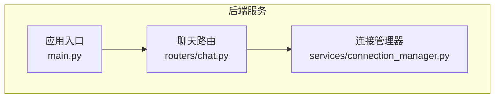
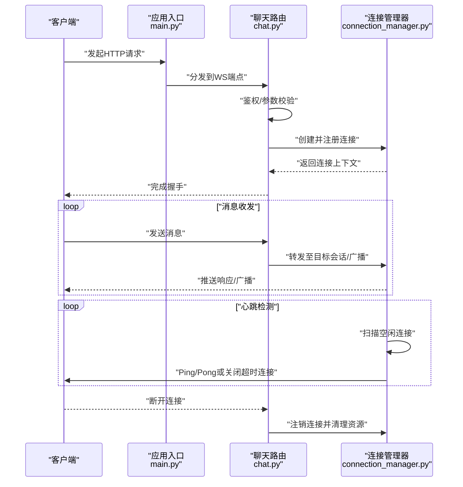
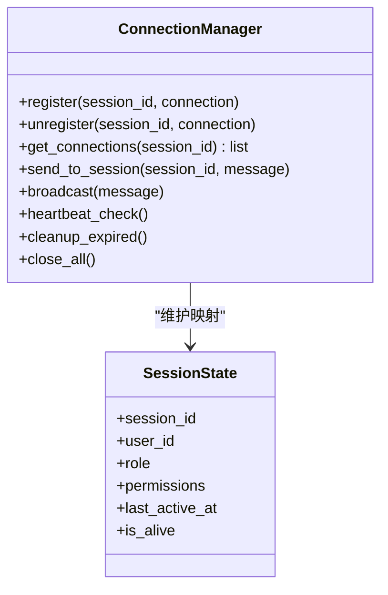
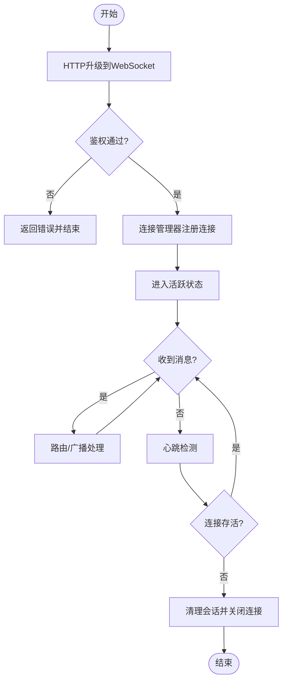
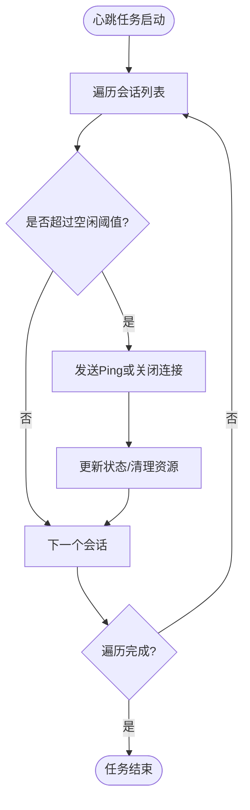
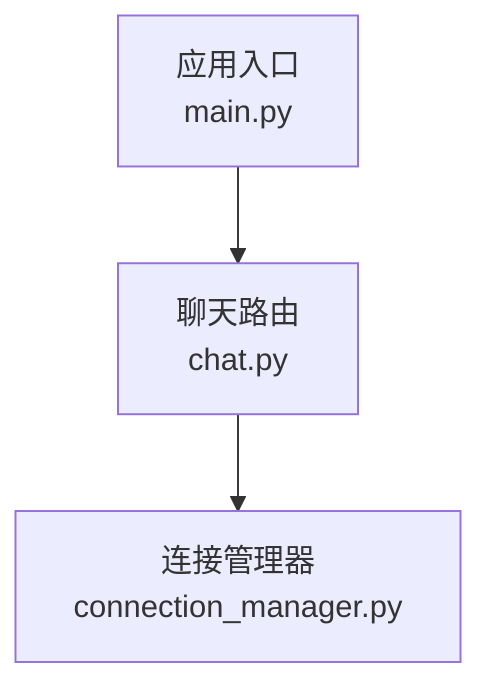

# WebSocket连接管理器

<cite>
**本文引用的文件**   
- [connection_manager.py](file://backend/app/services/connection_manager.py)
- [main.py](file://backend/app/main.py)
- [chat.py](file://backend/app/routers/chat.py)
</cite>

## 目录
1. [简介](#简介)
2. [项目结构](#项目结构)
3. [核心组件](#核心组件)
4. [架构总览](#架构总览)
5. [详细组件分析](#详细组件分析)
6. [依赖分析](#依赖分析)
7. [性能考虑](#性能考虑)
8. [故障排除指南](#故障排除指南)
9. [结论](#结论)
10. [附录](#附录)

## 简介
本文件围绕后端服务中的WebSocket连接管理器进行系统化文档化，重点覆盖以下方面：
- 连接建立与断开处理机制
- 连接池管理与会话状态维护
- 心跳检测实现
- 多用户并发连接策略（隔离、资源分配、内存管理）
- 连接生命周期管理（验证、鉴权、错误恢复）
- 监控、性能优化与排障最佳实践
- 扩展连接管理功能的示例路径

## 项目结构
本项目采用分层组织方式，WebSocket相关能力集中在后端服务的“服务层”和“路由层”，并由应用入口统一挂载。

图表来源
- [main.py](file://backend/app/main.py)
- [chat.py](file://backend/app/routers/chat.py)
- [connection_manager.py](file://backend/app/services/connection_manager.py)

章节来源
- [main.py](file://backend/app/main.py)
- [chat.py](file://backend/app/routers/chat.py)
- [connection_manager.py](file://backend/app/services/connection_manager.py)

## 核心组件
- 连接管理器（ConnectionManager）
  - 职责：集中管理所有活跃WebSocket连接，提供连接注册/注销、消息广播、按会话路由、心跳保活、异常清理等能力。
  - 关键能力：
    - 连接池：以会话标识为键维护连接集合，支持快速查找与批量操作。
    - 会话状态：维护每个连接的上下文信息（如用户ID、角色、权限标签、最后活跃时间等）。
    - 心跳检测：周期性检查空闲连接，触发断链或重连提示。
    - 并发安全：使用锁保护共享数据结构，避免竞态条件。
    - 错误恢复：捕获读写异常，自动清理连接并通知上层。
- 路由层（Chat Router）
  - 职责：暴露HTTP接口与WebSocket端点，负责握手前的基础校验与鉴权，将已认证的请求委派给连接管理器。
- 应用入口（Main）
  - 职责：初始化全局连接管理器实例，挂载路由，启动事件循环。

章节来源
- [connection_manager.py](file://backend/app/services/connection_manager.py)
- [chat.py](file://backend/app/routers/chat.py)
- [main.py](file://backend/app/main.py)

## 架构总览
整体交互流程如下：客户端通过HTTP升级建立WebSocket连接；路由层完成认证后，交由连接管理器登记连接；后续消息收发由连接管理器协调；心跳任务定期巡检连接健康度；异常时自动清理并上报。

图表来源
- [main.py](file://backend/app/main.py)
- [chat.py](file://backend/app/routers/chat.py)
- [connection_manager.py](file://backend/app/services/connection_manager.py)

## 详细组件分析

### 连接管理器类设计
连接管理器作为单例或全局对象被路由层持有，内部维护连接池与会话状态表，并提供线程安全的增删改查与广播方法。

图表来源
- [connection_manager.py](file://backend/app/services/connection_manager.py)

章节来源
- [connection_manager.py](file://backend/app/services/connection_manager.py)

### 连接建立与断开流程
- 建立流程
  - 客户端发起HTTP升级请求至WebSocket端点。
  - 路由层执行鉴权与参数校验，失败则返回错误响应。
  - 校验通过后，调用连接管理器注册连接，生成会话上下文并保存。
  - 握手成功，进入消息收发阶段。
- 断开流程
  - 客户端主动断开或网络异常导致连接丢失。
  - 路由层捕获异常，调用连接管理器注销连接。
  - 连接管理器清理会话状态、释放资源，必要时触发回调通知业务层。

图表来源
- [chat.py](file://backend/app/routers/chat.py)
- [connection_manager.py](file://backend/app/services/connection_manager.py)

章节来源
- [chat.py](file://backend/app/routers/chat.py)
- [connection_manager.py](file://backend/app/services/connection_manager.py)

### 连接池与会话状态维护
- 连接池
  - 以会话ID为键，维护一个连接列表，支持多设备或多标签页场景。
  - 提供按会话的发送、广播、统计查询等方法。
- 会话状态
  - 记录用户标识、角色、权限集、最后活跃时间、存活标志等。
  - 在心跳检测中更新最后活跃时间，长时间无活动则标记为过期。
- 并发安全
  - 对连接池与会话表的操作加锁，确保多线程/协程环境下的数据一致性。

章节来源
- [connection_manager.py](file://backend/app/services/connection_manager.py)

### 心跳检测实现
- 周期任务
  - 定时扫描所有会话，计算空闲时长。
  - 超过阈值则发送Ping或关闭连接，并清理资源。
- 保活策略
  - 可配置心跳间隔与超时阈值。
  - 支持客户端Pong响应确认，未响应视为断开。
- 异常处理
  - 捕获IO异常，记录日志并触发清理流程。

图表来源
- [connection_manager.py](file://backend/app/services/connection_manager.py)

章节来源
- [connection_manager.py](file://backend/app/services/connection_manager.py)

### 多用户并发连接策略
- 连接隔离
  - 基于会话ID与用户ID进行隔离，确保消息仅投递到目标会话。
  - 权限控制：根据会话的角色与权限集限制访问范围。
- 资源分配
  - 为每个连接分配最小资源单元（缓冲区、定时器），并在断开时及时回收。
  - 限制最大连接数与每用户最大连接数，防止资源耗尽。
- 内存管理
  - 使用弱引用或显式清理策略，避免长驻对象导致的内存泄漏。
  - 大消息分片传输，减少单次内存占用峰值。

章节来源
- [connection_manager.py](file://backend/app/services/connection_manager.py)
- [chat.py](file://backend/app/routers/chat.py)

### 连接生命周期管理
- 连接验证
  - 路由层在握手前进行签名校验、令牌验证、IP白名单等。
- 权限检查
  - 根据用户角色与权限集决定可访问的频道/房间。
- 错误恢复
  - 捕获读写异常，记录错误类型与堆栈，尝试重连或降级策略。
  - 对临时性错误（如网络抖动）进行指数退避重试。

章节来源
- [chat.py](file://backend/app/routers/chat.py)
- [connection_manager.py](file://backend/app/services/connection_manager.py)

### 监控与可观测性
- 指标采集
  - 活跃连接数、每秒消息量、平均延迟、错误率、心跳超时率。
- 日志规范
  - 结构化日志包含会话ID、用户ID、操作类型、耗时、错误码。
- 告警规则
  - 连接数突增、错误率飙升、心跳超时比例过高时触发告警。

章节来源
- [connection_manager.py](file://backend/app/services/connection_manager.py)
- [chat.py](file://backend/app/routers/chat.py)

## 依赖分析
连接管理器与路由层、应用入口之间的依赖关系如下：

图表来源
- [main.py](file://backend/app/main.py)
- [chat.py](file://backend/app/routers/chat.py)
- [connection_manager.py](file://backend/app/services/connection_manager.py)

章节来源
- [main.py](file://backend/app/main.py)
- [chat.py](file://backend/app/routers/chat.py)
- [connection_manager.py](file://backend/app/services/connection_manager.py)

## 性能考虑
- 连接池优化
  - 预分配连接对象，减少频繁创建销毁开销。
  - 使用环形缓冲或零拷贝技术降低序列化/反序列化成本。
- 心跳调优
  - 根据业务负载动态调整心跳间隔与超时阈值。
  - 批量处理心跳任务，减少调度开销。
- 背压与限流
  - 对高吞吐场景实施消息队列与速率限制，避免雪崩。
- 内存与GC
  - 及时释放大对象引用，避免碎片化。
  - 监控堆内存与句柄数量，设置合理上限。

[本节为通用指导，不直接分析具体文件]

## 故障排除指南
- 常见问题
  - 握手失败：检查鉴权逻辑、证书与跨域配置。
  - 连接频繁断开：排查网络质量、心跳阈值与服务器负载。
  - 消息丢失：确认广播路由是否正确，检查连接池状态。
- 诊断步骤
  - 查看结构化日志，定位会话ID与错误码。
  - 抓取连接快照（活跃连接数、最近活跃时间）。
  - 复现问题并开启调试模式，收集堆栈与指标。
- 恢复策略
  - 重启受影响的服务实例，清理僵尸连接。
  - 启用降级模式，限制新连接接入，优先保障存量连接。

章节来源
- [connection_manager.py](file://backend/app/services/connection_manager.py)
- [chat.py](file://backend/app/routers/chat.py)

## 结论
WebSocket连接管理器通过连接池与会话状态管理，结合心跳检测与并发安全机制，提供了稳定高效的实时通信能力。配合完善的监控与排障手段，可在高并发场景下保持系统健壮性与可扩展性。

[本节为总结性内容，不直接分析具体文件]

## 附录
- 扩展连接管理功能示例路径
  - 新增自定义鉴权策略：参考路由层的鉴权逻辑位置，在握手前插入校验步骤。
    - 参考路径：[chat.py](file://backend/app/routers/chat.py)
  - 扩展心跳策略：在连接管理器中添加新的保活协议或更细粒度的空闲判定。
    - 参考路径：[connection_manager.py](file://backend/app/services/connection_manager.py)
  - 集成外部监控系统：在连接管理器中埋点指标，输出到Prometheus或类似系统。
    - 参考路径：[connection_manager.py](file://backend/app/services/connection_manager.py)
  - 应用入口初始化：确保连接管理器在全局范围内可用，并在服务启动时注册路由。
    - 参考路径：[main.py](file://backend/app/main.py)

章节来源
- [chat.py](file://backend/app/routers/chat.py)
- [connection_manager.py](file://backend/app/services/connection_manager.py)
- [main.py](file://backend/app/main.py)