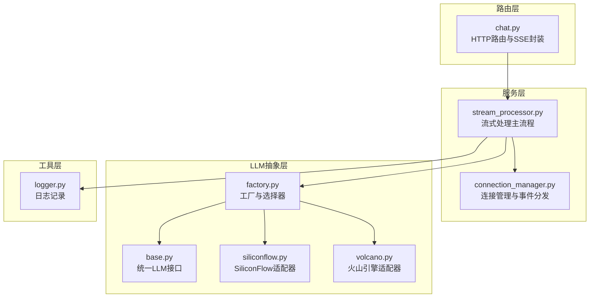
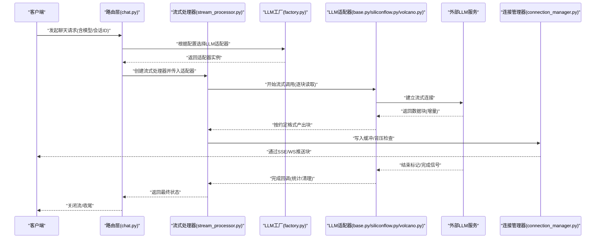
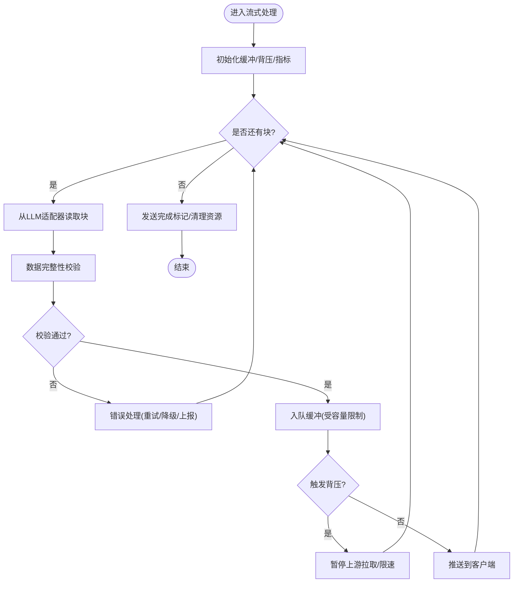
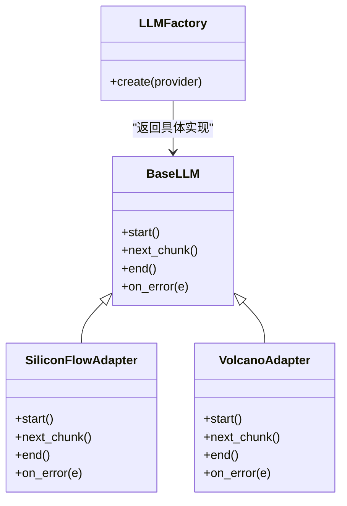
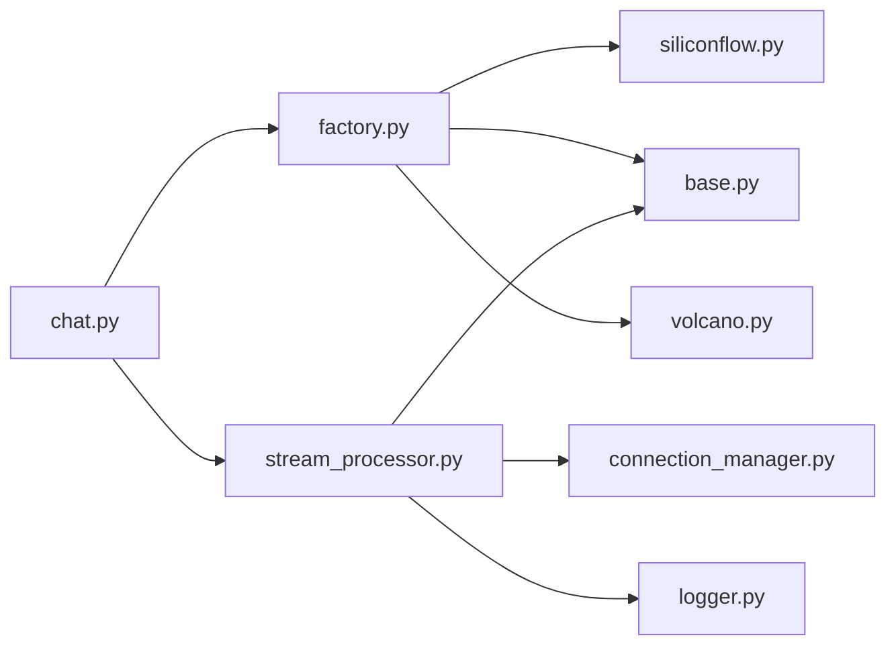

# 流式响应处理器

<cite>
**本文引用的文件**   
- [backend/app/services/stream_processor.py](file://backend/app/services/stream_processor.py)
- [backend/app/routers/chat.py](file://backend/app/routers/chat.py)
- [backend/app/llm/base.py](file://backend/app/llm/base.py)
- [backend/app/llm/factory.py](file://backend/app/llm/factory.py)
- [backend/app/llm/siliconflow.py](file://backend/app/llm/siliconflow.py)
- [backend/app/llm/volcano.py](file://backend/app/llm/volcano.py)
- [backend/app/services/connection_manager.py](file://backend/app/services/connection_manager.py)
- [backend/app/utils/logger.py](file://backend/app/utils/logger.py)
</cite>

## 目录
1. [简介](#简介)
2. [项目结构](#项目结构)
3. [核心组件](#核心组件)
4. [架构总览](#架构总览)
5. [详细组件分析](#详细组件分析)
6. [依赖关系分析](#依赖关系分析)
7. [性能考虑](#性能考虑)
8. [故障排查指南](#故障排查指南)
9. [结论](#结论)
10. [附录](#附录)

## 简介
本文件面向后端服务中的“流式响应处理器”，系统性阐述以下主题：
- 流式数据的接收、处理与转发机制（分块处理、缓冲区管理、背压控制）
- 错误处理策略（网络异常恢复、数据完整性校验、重试机制）
- 性能优化技术（流式压缩、异步处理、内存优化）
- 与LLM提供商的集成模式（不同提供商的流式接口适配）
- 调试工具与监控指标

目标读者包括后端工程师、系统集成人员以及需要理解或扩展流式能力的开发者。

## 项目结构
本项目采用分层组织方式，流式相关能力主要分布在如下模块：
- 路由层：负责HTTP请求接入与SSE/流式响应封装
- 服务层：实现流式处理主流程、连接管理与业务编排
- LLM抽象层：定义统一LLM接口并实现多家提供商适配器
- 工具层：日志记录等通用能力

图表来源
- [backend/app/routers/chat.py](file://backend/app/routers/chat.py)
- [backend/app/services/stream_processor.py](file://backend/app/services/stream_processor.py)
- [backend/app/services/connection_manager.py](file://backend/app/services/connection_manager.py)
- [backend/app/llm/base.py](file://backend/app/llm/base.py)
- [backend/app/llm/factory.py](file://backend/app/llm/factory.py)
- [backend/app/llm/siliconflow.py](file://backend/app/llm/siliconflow.py)
- [backend/app/llm/volcano.py](file://backend/app/llm/volcano.py)
- [backend/app/utils/logger.py](file://backend/app/utils/logger.py)

章节来源
- [backend/app/routers/chat.py](file://backend/app/routers/chat.py)
- [backend/app/services/stream_processor.py](file://backend/app/services/stream_processor.py)
- [backend/app/llm/base.py](file://backend/app/llm/base.py)
- [backend/app/llm/factory.py](file://backend/app/llm/factory.py)
- [backend/app/llm/siliconflow.py](file://backend/app/llm/siliconflow.py)
- [backend/app/llm/volcano.py](file://backend/app/llm/volcano.py)
- [backend/app/services/connection_manager.py](file://backend/app/services/connection_manager.py)
- [backend/app/utils/logger.py](file://backend/app/utils/logger.py)

## 核心组件
- 流式处理器（StreamProcessor）
  - 职责：协调上游LLM流式输出与下游客户端推送；维护缓冲与背压；统一错误与重试策略；聚合统计指标。
- LLM抽象接口（BaseLLM）
  - 职责：定义统一的流式调用契约（如逐块迭代、结束标记、元信息返回）。
- 提供商适配器（SiliconFlow、Volcano）
  - 职责：将具体厂商的流式协议映射到统一接口。
- 连接管理器（ConnectionManager）
  - 职责：管理长连接生命周期、消息广播、断线重连与限流。
- 路由层（Chat Router）
  - 职责：解析请求参数、选择模型、创建流式响应对象并启动处理流程。
- 日志工具（Logger）
  - 职责：结构化日志、关键路径埋点、可观测性支撑。

章节来源
- [backend/app/services/stream_processor.py](file://backend/app/services/stream_processor.py)
- [backend/app/llm/base.py](file://backend/app/llm/base.py)
- [backend/app/llm/siliconflow.py](file://backend/app/llm/siliconflow.py)
- [backend/app/llm/volcano.py](file://backend/app/llm/volcano.py)
- [backend/app/services/connection_manager.py](file://backend/app/services/connection_manager.py)
- [backend/app/routers/chat.py](file://backend/app/routers/chat.py)
- [backend/app/utils/logger.py](file://backend/app/utils/logger.py)

## 架构总览
下图展示了从HTTP请求到LLM提供商的端到端流式链路，包含背压与错误处理的关键节点。

图表来源
- [backend/app/routers/chat.py](file://backend/app/routers/chat.py)
- [backend/app/services/stream_processor.py](file://backend/app/services/stream_processor.py)
- [backend/app/llm/factory.py](file://backend/app/llm/factory.py)
- [backend/app/llm/base.py](file://backend/app/llm/base.py)
- [backend/app/llm/siliconflow.py](file://backend/app/llm/siliconflow.py)
- [backend/app/llm/volcano.py](file://backend/app/llm/volcano.py)
- [backend/app/services/connection_manager.py](file://backend/app/services/connection_manager.py)

## 详细组件分析

### 流式处理器（StreamProcessor）
- 设计要点
  - 分块处理：以最小单位消费上游块，避免整包等待。
  - 缓冲区管理：为每个会话维护环形缓冲或队列，限制最大长度，防止内存膨胀。
  - 背压控制：当消费者写慢时，暂停上游拉取或丢弃低优先级块，保障稳定性。
  - 错误处理：捕获网络异常、协议不一致、超时等，执行降级与重试。
  - 指标采集：累计字节数、块数量、延迟、失败率等。
- 典型流程
  - 初始化：加载配置、创建缓冲、注册回调。
  - 循环消费：从LLM适配器获取块→校验→入队→背压判断→推送。
  - 收尾：发送完成标记、释放资源、更新指标。

图表来源
- [backend/app/services/stream_processor.py](file://backend/app/services/stream_processor.py)

章节来源
- [backend/app/services/stream_processor.py](file://backend/app/services/stream_processor.py)

### LLM抽象与适配器（BaseLLM / SiliconFlow / Volcano）
- 统一接口
  - 定义流式调用的标准方法族：开始、逐块迭代、结束、错误回调。
  - 约定块数据结构：内容片段、类型标识、可选元数据（如token计数、耗时）。
- 适配器实现
  - SiliconFlow：将厂商SDK的流式事件转换为统一块格式。
  - Volcano：对火山引擎的流式协议进行适配与容错。
- 工厂选择
  - 根据环境变量或请求参数动态选择适配器，支持热切换。

图表来源
- [backend/app/llm/base.py](file://backend/app/llm/base.py)
- [backend/app/llm/siliconflow.py](file://backend/app/llm/siliconflow.py)
- [backend/app/llm/volcano.py](file://backend/app/llm/volcano.py)
- [backend/app/llm/factory.py](file://backend/app/llm/factory.py)

章节来源
- [backend/app/llm/base.py](file://backend/app/llm/base.py)
- [backend/app/llm/siliconflow.py](file://backend/app/llm/siliconflow.py)
- [backend/app/llm/volcano.py](file://backend/app/llm/volcano.py)
- [backend/app/llm/factory.py](file://backend/app/llm/factory.py)

### 路由层（Chat Router）
- 职责
  - 解析请求体与会话上下文。
  - 基于配置选择LLM适配器。
  - 构造流式响应对象（SSE/WS），绑定处理器与连接管理器。
  - 在异常情况下返回友好错误码与提示。
- 关键点
  - 幂等与会话关联：确保同一会话的流有序到达。
  - 超时与取消：客户端断开后及时释放上游资源。

章节来源
- [backend/app/routers/chat.py](file://backend/app/routers/chat.py)

### 连接管理器（ConnectionManager）
- 职责
  - 维护活跃连接集合。
  - 提供广播与定向推送能力。
  - 处理心跳、保活与断线重连。
  - 限流与配额控制，防止单租户占用过多资源。
- 关键点
  - 并发安全：读写锁或无锁队列保证高并发下的正确性。
  - 优雅退出：服务停止时通知所有连接并刷新缓冲。

章节来源
- [backend/app/services/connection_manager.py](file://backend/app/services/connection_manager.py)

### 日志与可观测性（Logger）
- 职责
  - 结构化日志输出（请求ID、会话ID、块大小、耗时）。
  - 关键路径埋点（进入/离开、错误分支、重试次数）。
  - 对接外部监控系统（可选）。

章节来源
- [backend/app/utils/logger.py](file://backend/app/utils/logger.py)

## 依赖关系分析
- 耦合度
  - 路由层仅依赖工厂与流式处理器，保持薄入口。
  - 流式处理器依赖LLM抽象与连接管理器，屏蔽底层差异。
  - 适配器之间相互独立，便于新增第三方提供商。
- 潜在环依赖
  - 当前分层清晰，未发现直接循环导入风险。
- 外部依赖
  - 各LLM提供商SDK/HTTP客户端。
  - 可能的缓存/消息队列用于持久化或跨进程广播（按需扩展）。

图表来源
- [backend/app/routers/chat.py](file://backend/app/routers/chat.py)
- [backend/app/services/stream_processor.py](file://backend/app/services/stream_processor.py)
- [backend/app/llm/factory.py](file://backend/app/llm/factory.py)
- [backend/app/llm/base.py](file://backend/app/llm/base.py)
- [backend/app/llm/siliconflow.py](file://backend/app/llm/siliconflow.py)
- [backend/app/llm/volcano.py](file://backend/app/llm/volcano.py)
- [backend/app/services/connection_manager.py](file://backend/app/services/connection_manager.py)
- [backend/app/utils/logger.py](file://backend/app/utils/logger.py)

章节来源
- [backend/app/routers/chat.py](file://backend/app/routers/chat.py)
- [backend/app/services/stream_processor.py](file://backend/app/services/stream_processor.py)
- [backend/app/llm/factory.py](file://backend/app/llm/factory.py)
- [backend/app/llm/base.py](file://backend/app/llm/base.py)
- [backend/app/llm/siliconflow.py](file://backend/app/llm/siliconflow.py)
- [backend/app/llm/volcano.py](file://backend/app/llm/volcano.py)
- [backend/app/services/connection_manager.py](file://backend/app/services/connection_manager.py)
- [backend/app/utils/logger.py](file://backend/app/utils/logger.py)

## 性能考虑
- 流式压缩
  - 在传输层启用Gzip/Brotli压缩，减少带宽占用；注意CPU开销与延迟权衡。
- 异步处理
  - 使用非阻塞I/O与协程并行消费上游块与推送下游，提升吞吐。
- 内存优化
  - 固定大小的环形缓冲，避免频繁分配；及时释放已推送块引用。
- 背压与限流
  - 基于消费者速率动态调整上游拉取频率；对突发流量做削峰。
- 批量化与合并
  - 小粒度块可按阈值合并以减少系统调用次数，但需平衡首字延迟。
- 连接复用与池化
  - 复用HTTP/TCP连接，降低握手成本；合理设置连接池大小。
- 指标与采样
  - 对关键路径采样记录P95/P99延迟、吞吐、错误率，指导容量规划。

[本节为通用性能建议，不直接分析具体文件]

## 故障排查指南
- 常见问题定位
  - 首字延迟过高：检查缓冲大小、合并策略、上游供应商延迟。
  - 内存持续增长：确认缓冲上限与回收逻辑，排查未释放引用。
  - 偶发丢块：核对数据完整性校验与重放序列号。
  - 连接抖动：查看心跳间隔、重连退避策略与网络质量。
- 错误处理策略
  - 网络异常：指数退避重试，超过阈值走降级通道（如返回缓存或提示重试）。
  - 数据不完整：基于块头校验和/序列号检测，必要时请求重传。
  - 超时：区分读超时与写超时，分别采取不同恢复策略。
- 调试工具
  - 结构化日志：开启详细级别，输出请求ID、会话ID、块大小、耗时。
  - 追踪ID：贯穿路由→处理器→适配器→外部调用，便于全链路追踪。
  - 指标面板：展示QPS、延迟分布、错误率、缓冲水位、背压触发次数。
- 快速自检清单
  - 是否启用了背压？缓冲是否达到上限？
  - 重试是否具备幂等性与去抖？
  - 是否记录了必要的可观测性指标？

章节来源
- [backend/app/utils/logger.py](file://backend/app/utils/logger.py)
- [backend/app/services/stream_processor.py](file://backend/app/services/stream_processor.py)
- [backend/app/services/connection_manager.py](file://backend/app/services/connection_manager.py)

## 结论
本流式响应处理器通过清晰的层次划分与统一抽象，实现了多LLM提供商的无缝接入与稳定可靠的流式转发。借助缓冲与背压控制、完善的错误处理与重试策略，以及丰富的可观测性手段，系统在吞吐、延迟与稳定性方面取得良好平衡。后续可在压缩、自适应合并与更细粒度的限流策略上持续优化。

[本节为总结性内容，不直接分析具体文件]

## 附录
- 术语
  - SSE：服务器发送事件，常用于服务端向客户端单向推送。
  - 背压：当消费者处理速度慢于生产者时，通过反馈机制减缓上游生产速度。
  - 幂等：多次执行同一操作不会产生副作用或重复结果。
- 扩展建议
  - 增加插件化的压缩策略与编码格式协商。
  - 引入分布式连接管理与跨节点广播能力。
  - 完善A/B测试与灰度发布，逐步放量新适配器。

[本节为概念性说明，不直接分析具体文件]