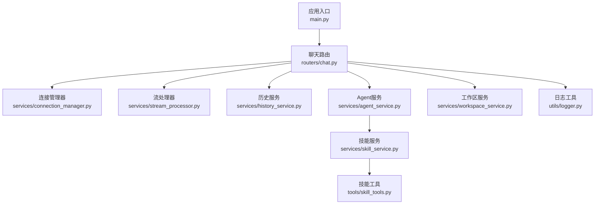
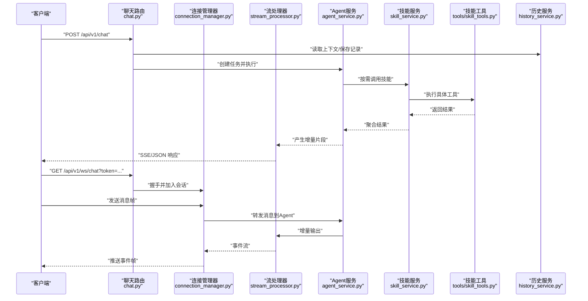
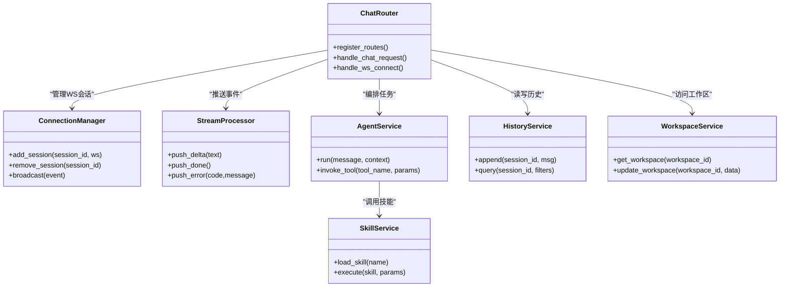

# 聊天API路由

<cite>
**本文引用的文件**   
- [backend/app/main.py](file://backend/app/main.py)
- [backend/app/routers/chat.py](file://backend/app/routers/chat.py)
- [backend/app/services/connection_manager.py](file://backend/app/services/connection_manager.py)
- [backend/app/services/stream_processor.py](file://backend/app/services/stream_processor.py)
- [backend/app/services/history_service.py](file://backend/app/services/history_service.py)
- [backend/app/services/agent_service.py](file://backend/app/services/agent_service.py)
- [backend/app/services/skill_service.py](file://backend/app/services/skill_service.py)
- [backend/app/services/workspace_service.py](file://backend/app/services/workspace_service.py)
- [backend/app/tools/skill_tools.py](file://backend/app/tools/skill_tools.py)
- [backend/app/utils/logger.py](file://backend/app/utils/logger.py)
</cite>

## 目录
1. [简介](#简介)
2. [项目结构](#项目结构)
3. [核心组件](#核心组件)
4. [架构总览](#架构总览)
5. [详细组件分析](#详细组件分析)
6. [依赖关系分析](#依赖关系分析)
7. [性能考虑](#性能考虑)
8. [故障排查指南](#故障排查指南)
9. [结论](#结论)
10. [附录](#附录)

## 简介
本文件面向后端“聊天”能力，系统化梳理REST与WebSocket两类接口的设计与实现要点，覆盖：
- RESTful API端点：HTTP方法、URL模式、请求与响应格式
- WebSocket接口：连接协议、消息格式、事件类型
- 认证与授权：API密钥验证、权限控制、访问限制
- 错误处理：错误码定义、异常信息格式、客户端重试建议
- 调用示例与集成指南：前端/第三方系统如何接入

说明：以下文档基于仓库中后端代码结构与模块职责进行归纳。若实际实现细节与本文有差异，请以源码为准。

## 项目结构
后端采用分层组织方式：
- 应用入口与路由注册：main.py
- 聊天路由：routers/chat.py（REST与WS）
- 服务层：services/*（连接管理、流式处理、历史、Agent编排、技能、工作区等）
- 工具层：tools/*（技能工具封装）
- 通用工具：utils/*（日志等）

图表来源
- [backend/app/main.py](file://backend/app/main.py)
- [backend/app/routers/chat.py](file://backend/app/routers/chat.py)
- [backend/app/services/connection_manager.py](file://backend/app/services/connection_manager.py)
- [backend/app/services/stream_processor.py](file://backend/app/services/stream_processor.py)
- [backend/app/services/history_service.py](file://backend/app/services/history_service.py)
- [backend/app/services/agent_service.py](file://backend/app/services/agent_service.py)
- [backend/app/services/skill_service.py](file://backend/app/services/skill_service.py)
- [backend/app/tools/skill_tools.py](file://backend/app/tools/skill_tools.py)
- [backend/app/services/workspace_service.py](file://backend/app/services/workspace_service.py)
- [backend/app/utils/logger.py](file://backend/app/utils/logger.py)

章节来源
- [backend/app/main.py](file://backend/app/main.py)
- [backend/app/routers/chat.py](file://backend/app/routers/chat.py)

## 核心组件
- 路由层（chat.py）
  - 负责注册REST与WebSocket端点，解析请求参数，委派至服务层执行。
  - 对鉴权、限流、日志、错误包装进行统一处理。
- 连接管理器（connection_manager.py）
  - 维护WebSocket会话集合、广播、按会话路由消息。
- 流处理器（stream_processor.py）
  - 将上游LLM或工具的增量输出转换为SSE/WS事件流。
- 历史服务（history_service.py）
  - 对话上下文持久化、检索、分页与清理策略。
- Agent服务（agent_service.py）
  - 编排多步任务、工具调用、状态机流转。
- 技能服务（skill_service.py）
  - 加载、校验、调度技能；与工具层交互。
- 工作区服务（workspace_service.py）
  - 提供与用户工作区相关的读写能力（如知识库、模板）。
- 工具层（tools/skill_tools.py）
  - 对外暴露可被Agent调用的原子能力（如生成、转换、查询）。
- 日志（utils/logger.py）
  - 结构化日志、追踪ID注入、敏感信息脱敏。

章节来源
- [backend/app/routers/chat.py](file://backend/app/routers/chat.py)
- [backend/app/services/connection_manager.py](file://backend/app/services/connection_manager.py)
- [backend/app/services/stream_processor.py](file://backend/app/services/stream_processor.py)
- [backend/app/services/history_service.py](file://backend/app/services/history_service.py)
- [backend/app/services/agent_service.py](file://backend/app/services/agent_service.py)
- [backend/app/services/skill_service.py](file://backend/app/services/skill_service.py)
- [backend/app/services/workspace_service.py](file://backend/app/services/workspace_service.py)
- [backend/app/tools/skill_tools.py](file://backend/app/tools/skill_tools.py)
- [backend/app/utils/logger.py](file://backend/app/utils/logger.py)

## 架构总览
整体数据流：客户端通过REST发起一次性问答或通过WebSocket建立长连接；路由层完成鉴权与参数校验后，交由服务层编排Agent与工具，结果以JSON或事件流返回。

图表来源
- [backend/app/routers/chat.py](file://backend/app/routers/chat.py)
- [backend/app/services/connection_manager.py](file://backend/app/services/connection_manager.py)
- [backend/app/services/stream_processor.py](file://backend/app/services/stream_processor.py)
- [backend/app/services/agent_service.py](file://backend/app/services/agent_service.py)
- [backend/app/services/skill_service.py](file://backend/app/services/skill_service.py)
- [backend/app/tools/skill_tools.py](file://backend/app/tools/skill_tools.py)
- [backend/app/services/history_service.py](file://backend/app/services/history_service.py)

## 详细组件分析

### REST API：聊天
- 端点
  - POST /api/v1/chat
- 用途
  - 提交一次对话请求，支持流式或非流式返回。
- 请求头
  - Authorization: Bearer <API密钥>
  - Content-Type: application/json
- 请求体字段
  - message: string，必填，用户输入
  - session_id: string，可选，用于会话续写
  - stream: boolean，可选，默认false；true时返回SSE事件流
  - tools: array<string>, 可选，指定启用的工具列表
  - workspace_id: string, 可选，限定工作区范围
- 响应体（非流式）
  - id: string，请求唯一标识
  - choices: array，包含文本片段或结构化内容
  - usage: object，统计信息（tokens等）
  - created_at: timestamp
- 响应体（流式SSE）
  - event: "delta" | "done" | "error"
  - data: 增量文本或结束标记
- 状态码
  - 200 成功
  - 400 参数错误
  - 401 未认证
  - 403 无权限
  - 429 限流
  - 500 服务端错误
  - 503 下游不可用

章节来源
- [backend/app/routers/chat.py](file://backend/app/routers/chat.py)

### WebSocket API：实时聊天
- 端点
  - GET /api/v1/ws/chat?token=<API密钥>&session_id=<可选>
- 连接协议
  - 标准WebSocket，握手成功后进入双向通信。
- 认证
  - 通过查询参数token传递API密钥；服务端校验通过后建立会话。
- 消息格式（客户端→服务端）
  - type: "message" | "ping" | "close"
  - payload:
    - text: string，当type=message时必填
  - session_id: string，可选，用于复用会话
- 消息格式（服务端→客户端）
  - type: "delta" | "done" | "error" | "pong"
  - payload:
    - text: string，增量文本
    - error_code: string，错误码（仅error）
    - error_message: string，人类可读错误信息
- 事件类型
  - delta：增量文本
  - done：会话结束
  - error：发生错误，携带错误码与信息
  - pong：心跳应答
- 断开与重连
  - 客户端应实现指数退避重连；服务端在收到close后清理资源。

章节来源
- [backend/app/routers/chat.py](file://backend/app/routers/chat.py)
- [backend/app/services/connection_manager.py](file://backend/app/services/connection_manager.py)

### 认证与授权
- API密钥
  - 通过Authorization头或WebSocket查询参数token传入。
  - 服务端校验密钥有效性、过期时间与配额。
- 权限控制
  - 基于角色/作用域限制可用工具与工作区访问。
  - 针对敏感操作（如删除、批量写入）需额外审批或更高权限。
- 访问限制
  - 速率限制：按IP/用户维度限流，超限返回429。
  - 并发与会话数限制：防止资源耗尽。
- 安全建议
  - 传输全程HTTPS/WSS。
  - 密钥最小化原则与轮换机制。
  - 敏感字段脱敏与审计日志。

章节来源
- [backend/app/routers/chat.py](file://backend/app/routers/chat.py)
- [backend/app/utils/logger.py](file://backend/app/utils/logger.py)

### 错误处理策略
- 错误码规范
  - 40000 参数错误
  - 40001 认证失败
  - 40002 权限不足
  - 40003 会话不存在
  - 40004 工具调用失败
  - 40005 下游服务超时
  - 40006 配额超限
  - 50000 内部错误
- 错误响应格式
  - code: string，错误码
  - message: string，简要描述
  - details: object，附加信息（可选）
  - trace_id: string，追踪ID
- 客户端重试建议
  - 幂等操作且错误码为40005/50000时可重试，使用指数退避+抖动。
  - 40001/40002不应重试，提示用户刷新凭证或申请权限。
  - 40003需重建会话。
  - 40004根据工具特性决定是否重试。
  - 40006等待配额恢复或升级套餐。

章节来源
- [backend/app/routers/chat.py](file://backend/app/routers/chat.py)
- [backend/app/utils/logger.py](file://backend/app/utils/logger.py)

### 流式处理与事件模型
- SSE/WS事件
  - delta：增量文本
  - done：完成
  - error：错误
- 背压与缓冲
  - 服务端维护环形缓冲，避免内存暴涨。
  - 客户端消费不及时时，服务端可选择丢弃旧事件或阻塞上游。
- 断线续传
  - 结合session_id与last_event_id实现断点续推。

章节来源
- [backend/app/services/stream_processor.py](file://backend/app/services/stream_processor.py)
- [backend/app/services/connection_manager.py](file://backend/app/services/connection_manager.py)

### 历史与上下文
- 存储策略
  - 按会话分片存储，保留最近N条消息。
  - 支持时间窗口与大小阈值双触发清理。
- 检索与过滤
  - 按时间、标签、关键词检索。
- 一致性
  - 写入采用追加模式，读路径允许最终一致。

章节来源
- [backend/app/services/history_service.py](file://backend/app/services/history_service.py)

### Agent与技能编排
- Agent流程
  - 接收消息→构建意图→选择工具→执行→汇总→返回。
- 技能生命周期
  - 注册→校验→加载→执行→卸载。
- 工具契约
  - 输入/输出Schema固定，错误码标准化，支持幂等。

章节来源
- [backend/app/services/agent_service.py](file://backend/app/services/agent_service.py)
- [backend/app/services/skill_service.py](file://backend/app/services/skill_service.py)
- [backend/app/tools/skill_tools.py](file://backend/app/tools/skill_tools.py)

### 工作区隔离
- 作用域
  - 每个用户拥有独立工作区，跨工作区不可见。
- 资源
  - 文档、模板、配置等按工作区分隔。
- 迁移
  - 支持导出/导入工作区快照。

章节来源
- [backend/app/services/workspace_service.py](file://backend/app/services/workspace_service.py)

## 依赖关系分析

图表来源
- [backend/app/routers/chat.py](file://backend/app/routers/chat.py)
- [backend/app/services/connection_manager.py](file://backend/app/services/connection_manager.py)
- [backend/app/services/stream_processor.py](file://backend/app/services/stream_processor.py)
- [backend/app/services/agent_service.py](file://backend/app/services/agent_service.py)
- [backend/app/services/skill_service.py](file://backend/app/services/skill_service.py)
- [backend/app/services/history_service.py](file://backend/app/services/history_service.py)
- [backend/app/services/workspace_service.py](file://backend/app/services/workspace_service.py)

## 性能考虑
- 连接池与并发
  - WS连接数上限、单会话并发度限制。
- 流控与背压
  - 服务端侧限流、客户端消费速度监控。
- 缓存
  - 热点上下文缓存、工具结果短期缓存。
- 序列化
  - 优先使用轻量级JSON，必要时启用压缩。
- 资源回收
  - 空闲会话定时清理、大对象及时释放。

## 故障排查指南
- 常见问题
  - 401/403：检查API密钥与作用域是否正确。
  - 429：降低请求频率或提升配额。
  - 503：检查下游服务健康状态。
  - WS频繁断开：检查网络稳定性与心跳间隔。
- 定位手段
  - 通过trace_id关联全链路日志。
  - 开启调试日志级别，关注关键节点耗时。
  - 使用连接管理器查看在线会话与消息吞吐。
- 恢复策略
  - 自动重试（带退避）、熔断降级、快速失败。

章节来源
- [backend/app/utils/logger.py](file://backend/app/utils/logger.py)
- [backend/app/services/connection_manager.py](file://backend/app/services/connection_manager.py)

## 结论
本方案围绕REST与WebSocket两类接口，构建了统一的鉴权、限流、错误处理与可观测性体系。通过服务层解耦与工具化扩展，聊天能力具备良好的可维护性与可扩展性。建议在上线前完善监控告警、容量规划与安全审计。

## 附录

### API调用示例（概念性）
- REST一次性问答
  - 方法：POST
  - URL：/api/v1/chat
  - 头部：Authorization: Bearer <API密钥>
  - 主体：{ "message": "你好", "stream": false }
  - 响应：包含choices与usage的JSON
- REST流式问答
  - 同上，但stream=true，返回SSE事件流
- WebSocket实时对话
  - URL：ws(s)://host/api/v1/ws/chat?token=<API密钥>
  - 客户端发送：{"type":"message","payload":{"text":"你好"}}
  - 服务端推送：{"type":"delta","payload":{"text":"你好！"}} 直至{"type":"done"}

[本节为概念性示例，不直接分析具体文件]

### 集成清单
- 环境变量
  - API密钥、限流阈值、日志级别、工作区存储路径等
- 前置条件
  - HTTPS/WSS、域名解析、证书有效
- 部署建议
  - 反向代理、水平扩展、健康检查探针

[本节为概念性指导，不直接分析具体文件]