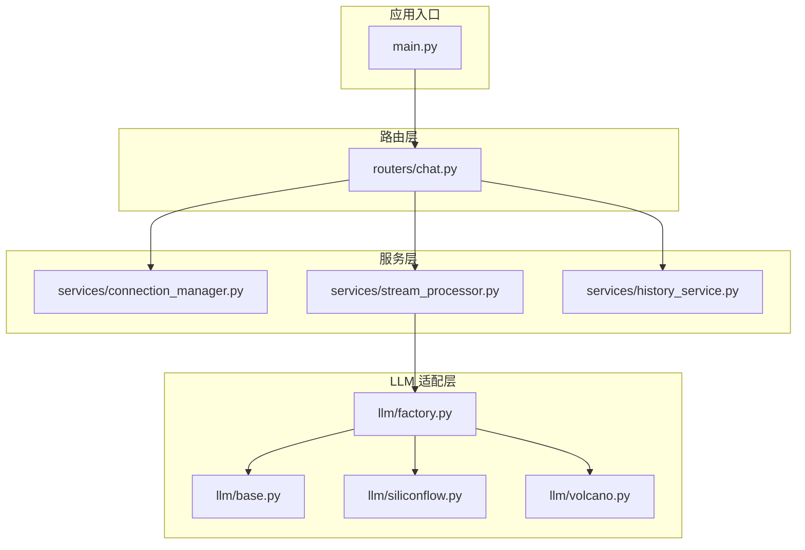
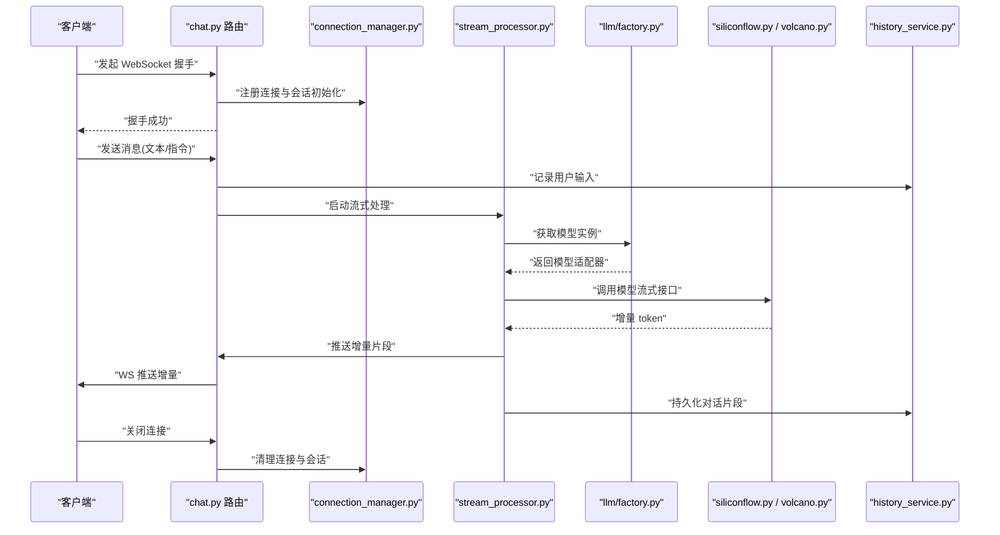
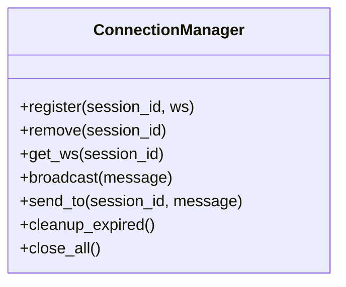
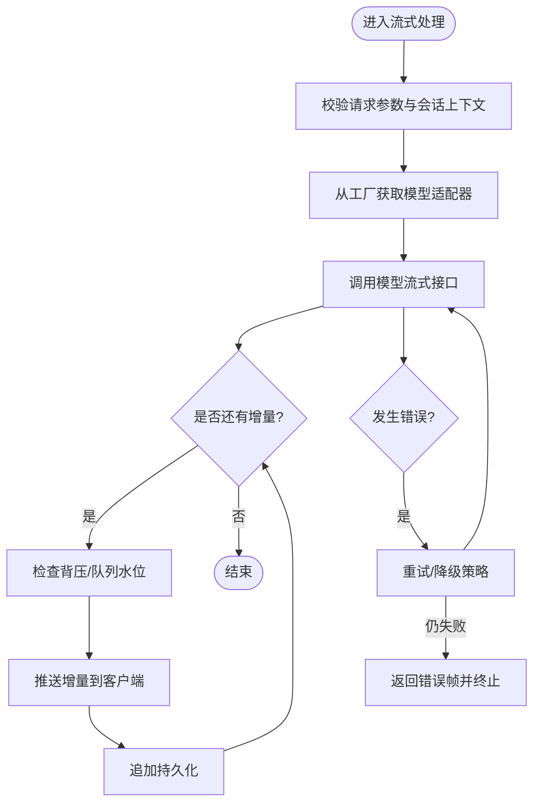
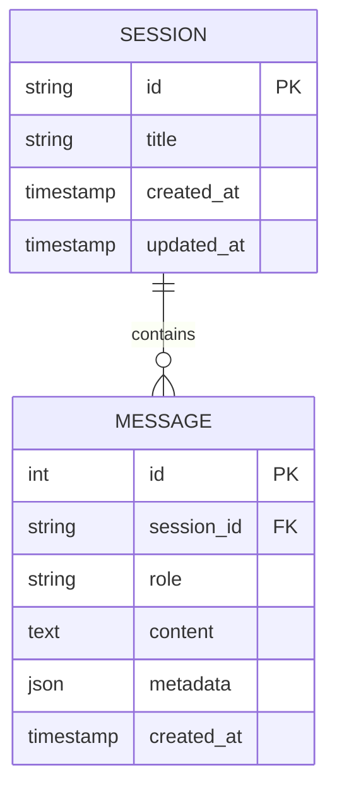
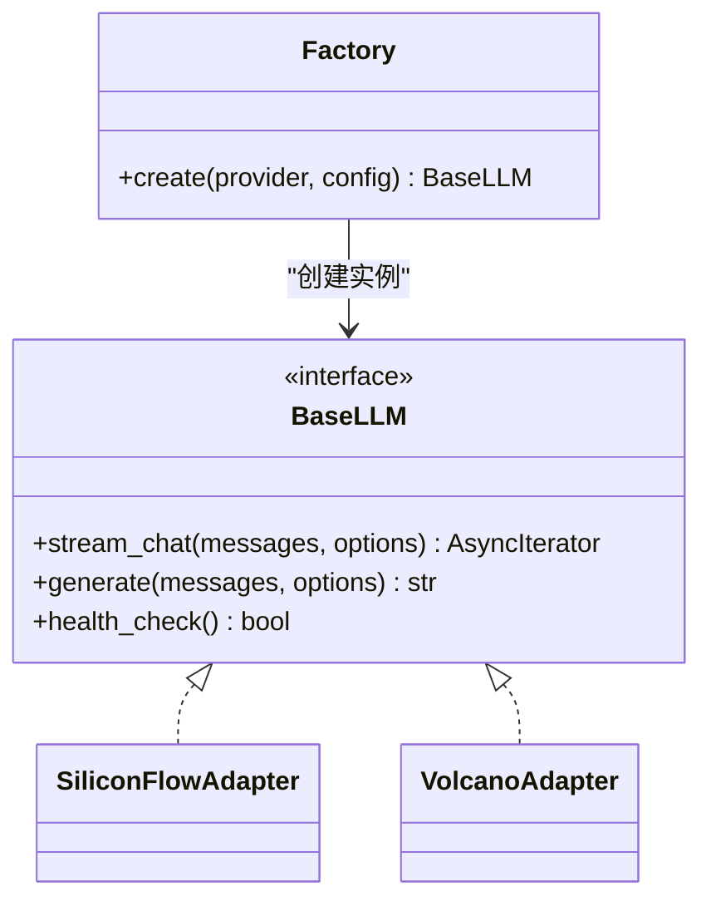
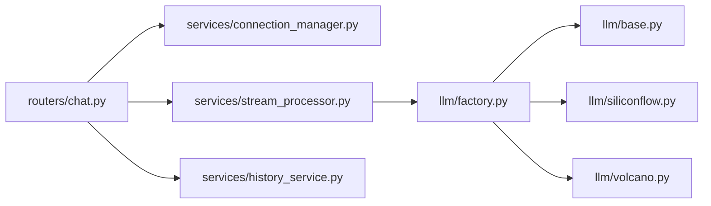

# 聊天服务

<cite>
**本文引用的文件**   
- [backend/app/main.py](file://backend/app/main.py)
- [backend/app/routers/chat.py](file://backend/app/routers/chat.py)
- [backend/app/services/connection_manager.py](file://backend/app/services/connection_manager.py)
- [backend/app/services/stream_processor.py](file://backend/app/services/stream_processor.py)
- [backend/app/services/history_service.py](file://backend/app/services/history_service.py)
- [backend/app/llm/base.py](file://backend/app/llm/base.py)
- [backend/app/llm/factory.py](file://backend/app/llm/factory.py)
- [backend/app/llm/siliconflow.py](file://backend/app/llm/siliconflow.py)
- [backend/app/llm/volcano.py](file://backend/app/llm/volcano.py)
</cite>

## 目录
1. [简介](#简介)
2. [项目结构](#项目结构)
3. [核心组件](#核心组件)
4. [架构总览](#架构总览)
5. [详细组件分析](#详细组件分析)
6. [依赖关系分析](#依赖关系分析)
7. [性能考虑](#性能考虑)
8. [故障排除指南](#故障排除指南)
9. [结论](#结论)
10. [附录](#附录)

## 简介
本文件为聊天服务的综合技术文档，聚焦于以下方面：
- WebSocket 连接管理器的实现与生命周期（建立、断开、会话状态）
- 流式响应处理器的工作机制（数据流控制、错误恢复、性能优化）
- 历史记录服务的存储策略、查询接口与持久化方案
- 消息路由、权限验证与限流等安全机制
- 实时通信最佳实践与常见问题排查

## 项目结构
后端采用分层组织方式：入口应用、路由层、服务层、LLM 适配层。关键模块如下：
- 入口与应用装配：main.py
- 路由层：chat.py（WebSocket 与 HTTP 端点）
- 服务层：connection_manager.py、stream_processor.py、history_service.py
- LLM 适配层：base.py、factory.py、siliconflow.py、volcano.py

图表来源
- [backend/app/main.py](file://backend/app/main.py)
- [backend/app/routers/chat.py](file://backend/app/routers/chat.py)
- [backend/app/services/connection_manager.py](file://backend/app/services/connection_manager.py)
- [backend/app/services/stream_processor.py](file://backend/app/services/stream_processor.py)
- [backend/app/services/history_service.py](file://backend/app/services/history_service.py)
- [backend/app/llm/base.py](file://backend/app/llm/base.py)
- [backend/app/llm/factory.py](file://backend/app/llm/factory.py)
- [backend/app/llm/siliconflow.py](file://backend/app/llm/siliconflow.py)
- [backend/app/llm/volcano.py](file://backend/app/llm/volcano.py)

章节来源
- [backend/app/main.py](file://backend/app/main.py)
- [backend/app/routers/chat.py](file://backend/app/routers/chat.py)
- [backend/app/services/connection_manager.py](file://backend/app/services/connection_manager.py)
- [backend/app/services/stream_processor.py](file://backend/app/services/stream_processor.py)
- [backend/app/services/history_service.py](file://backend/app/services/history_service.py)
- [backend/app/llm/base.py](file://backend/app/llm/base.py)
- [backend/app/llm/factory.py](file://backend/app/llm/factory.py)
- [backend/app/llm/siliconflow.py](file://backend/app/llm/siliconflow.py)
- [backend/app/llm/volcano.py](file://backend/app/llm/volcano.py)

## 核心组件
- WebSocket 连接管理器：负责连接注册、心跳保活、断线清理、会话上下文维护与广播能力。
- 流式响应处理器：封装 LLM 流式调用、背压控制、增量输出、错误重试与降级。
- 历史记录服务：提供会话历史写入、分页查询、按会话聚合与持久化策略抽象。
- LLM 工厂与适配器：统一抽象不同模型提供方，支持动态选择与扩展。

章节来源
- [backend/app/services/connection_manager.py](file://backend/app/services/connection_manager.py)
- [backend/app/services/stream_processor.py](file://backend/app/services/stream_processor.py)
- [backend/app/services/history_service.py](file://backend/app/services/history_service.py)
- [backend/app/llm/base.py](file://backend/app/llm/base.py)
- [backend/app/llm/factory.py](file://backend/app/llm/factory.py)
- [backend/app/llm/siliconflow.py](file://backend/app/llm/siliconflow.py)
- [backend/app/llm/volcano.py](file://backend/app/llm/volcano.py)

## 架构总览
聊天服务以 FastAPI 为入口，通过 WebSocket 路由接入，内部由连接管理器协调会话，流式处理器驱动 LLM 生成并回写客户端，历史记录服务负责持久化。

图表来源
- [backend/app/routers/chat.py](file://backend/app/routers/chat.py)
- [backend/app/services/connection_manager.py](file://backend/app/services/connection_manager.py)
- [backend/app/services/stream_processor.py](file://backend/app/services/stream_processor.py)
- [backend/app/llm/factory.py](file://backend/app/llm/factory.py)
- [backend/app/llm/siliconflow.py](file://backend/app/llm/siliconflow.py)
- [backend/app/llm/volcano.py](file://backend/app/llm/volcano.py)
- [backend/app/services/history_service.py](file://backend/app/services/history_service.py)

## 详细组件分析

### WebSocket 连接管理器
职责与要点：
- 连接注册与去重：基于唯一标识（如 session_id）维护连接映射，避免重复注册。
- 心跳与保活：周期性检测活跃连接，超时自动清理。
- 会话状态：维护每连接的上下文（如角色、系统提示、最近消息窗口）。
- 广播与定向推送：支持向单连接或同组会话推送消息。
- 优雅退出：进程退出时主动关闭所有连接并释放资源。

图表来源
- [backend/app/services/connection_manager.py](file://backend/app/services/connection_manager.py)

章节来源
- [backend/app/services/connection_manager.py](file://backend/app/services/connection_manager.py)

### 流式响应处理器
职责与要点：
- 流式调用封装：对 LLM 的流式接口进行统一封装，屏蔽差异。
- 数据流控制：基于异步队列与背压控制，防止内存膨胀。
- 错误恢复：网络抖动、模型超时等异常的重试与降级策略。
- 增量输出：将 token 流切分为可消费的片段，降低前端渲染压力。
- 指标与日志：记录吞吐、延迟、失败率，便于观测与调优。

图表来源
- [backend/app/services/stream_processor.py](file://backend/app/services/stream_processor.py)
- [backend/app/llm/factory.py](file://backend/app/llm/factory.py)
- [backend/app/llm/siliconflow.py](file://backend/app/llm/siliconflow.py)
- [backend/app/llm/volcano.py](file://backend/app/llm/volcano.py)
- [backend/app/services/history_service.py](file://backend/app/services/history_service.py)

章节来源
- [backend/app/services/stream_processor.py](file://backend/app/services/stream_processor.py)
- [backend/app/llm/factory.py](file://backend/app/llm/factory.py)
- [backend/app/llm/siliconflow.py](file://backend/app/llm/siliconflow.py)
- [backend/app/llm/volcano.py](file://backend/app/llm/volcano.py)
- [backend/app/services/history_service.py](file://backend/app/services/history_service.py)

### 历史记录服务
职责与要点：
- 存储策略：支持多种后端（内存、本地文件、对象存储、数据库），通过抽象接口切换。
- 写入模式：追加写入、批量落盘、事务性提交，保证一致性。
- 查询接口：按会话 ID 分页、时间范围过滤、关键字检索。
- 数据持久化：序列化格式、压缩与归档策略，冷热数据分层。
- 容量治理：过期清理、配额限制、索引重建。

图表来源
- [backend/app/services/history_service.py](file://backend/app/services/history_service.py)

章节来源
- [backend/app/services/history_service.py](file://backend/app/services/history_service.py)

### LLM 适配层
职责与要点：
- 统一抽象：定义一致的流式接口与错误模型。
- 工厂模式：根据配置动态创建具体模型适配器。
- 多厂商支持：siliconflow、volcano 等实现差异化细节。

图表来源
- [backend/app/llm/base.py](file://backend/app/llm/base.py)
- [backend/app/llm/factory.py](file://backend/app/llm/factory.py)
- [backend/app/llm/siliconflow.py](file://backend/app/llm/siliconflow.py)
- [backend/app/llm/volcano.py](file://backend/app/llm/volcano.py)

章节来源
- [backend/app/llm/base.py](file://backend/app/llm/base.py)
- [backend/app/llm/factory.py](file://backend/app/llm/factory.py)
- [backend/app/llm/siliconflow.py](file://backend/app/llm/siliconflow.py)
- [backend/app/llm/volcano.py](file://backend/app/llm/volcano.py)

## 依赖关系分析
- 路由层依赖服务层：chat.py 组合 connection_manager、stream_processor、history_service。
- 流式处理器依赖 LLM 工厂与适配器：通过工厂解耦具体模型实现。
- 历史记录服务独立于运行时状态：可替换存储后端而不影响主流程。

图表来源
- [backend/app/routers/chat.py](file://backend/app/routers/chat.py)
- [backend/app/services/connection_manager.py](file://backend/app/services/connection_manager.py)
- [backend/app/services/stream_processor.py](file://backend/app/services/stream_processor.py)
- [backend/app/services/history_service.py](file://backend/app/services/history_service.py)
- [backend/app/llm/factory.py](file://backend/app/llm/factory.py)
- [backend/app/llm/base.py](file://backend/app/llm/base.py)
- [backend/app/llm/siliconflow.py](file://backend/app/llm/siliconflow.py)
- [backend/app/llm/volcano.py](file://backend/app/llm/volcano.py)

章节来源
- [backend/app/routers/chat.py](file://backend/app/routers/chat.py)
- [backend/app/services/connection_manager.py](file://backend/app/services/connection_manager.py)
- [backend/app/services/stream_processor.py](file://backend/app/services/stream_processor.py)
- [backend/app/services/history_service.py](file://backend/app/services/history_service.py)
- [backend/app/llm/factory.py](file://backend/app/llm/factory.py)
- [backend/app/llm/base.py](file://backend/app/llm/base.py)
- [backend/app/llm/siliconflow.py](file://backend/app/llm/siliconflow.py)
- [backend/app/llm/volcano.py](file://backend/app/llm/volcano.py)

## 性能考虑
- 背压与缓冲：在流式处理器中引入有界队列与水位阈值，避免内存暴涨。
- 批量化持久化：合并高频写入，减少 I/O 次数；必要时使用异步落盘。
- 连接池与复用：对下游 LLM 客户端进行连接复用与超时控制。
- 并发与隔离：按会话隔离协程，限制单会话最大并发任务数。
- 监控与告警：统计首字节延迟、端到端延迟、错误率与吞吐，设置阈值告警。

[本节为通用指导，不直接分析具体文件]

## 故障排除指南
常见问题与定位步骤：
- 连接频繁断开
  - 检查心跳间隔与超时阈值是否合理
  - 观察服务端日志中的连接清理事件
  - 确认客户端重连退避策略
- 流式卡顿或丢帧
  - 检查队列水位与背压阈值
  - 评估下游模型响应速度与稳定性
  - 调整推送粒度（token 级 vs 片段级）
- 历史缺失或不一致
  - 核对持久化写入路径与权限
  - 检查批量落盘的事务性与幂等性
  - 验证查询接口的过滤条件与分页参数
- 鉴权失败或越权访问
  - 确认握手阶段令牌校验逻辑
  - 检查会话上下文中的权限标记
  - 审计路由层的访问控制中间件

章节来源
- [backend/app/services/connection_manager.py](file://backend/app/services/connection_manager.py)
- [backend/app/services/stream_processor.py](file://backend/app/services/stream_processor.py)
- [backend/app/services/history_service.py](file://backend/app/services/history_service.py)
- [backend/app/routers/chat.py](file://backend/app/routers/chat.py)

## 结论
本聊天服务通过清晰的分层与模块化设计，实现了可扩展的 WebSocket 实时通信与流式 LLM 集成。连接管理器保障会话稳定，流式处理器确保低延迟与高吞吐，历史记录服务提供可靠的数据持久化与查询能力。配合统一的 LLM 适配层，系统具备良好的弹性与可维护性。建议在生产环境完善鉴权、限流与监控告警，以获得更稳健的运行体验。

[本节为总结性内容，不直接分析具体文件]

## 附录

### 安全机制建议
- 消息路由
  - 在路由层集中处理鉴权、限流与审计
  - 对敏感操作增加二次确认与白名单
- 权限验证
  - 握手阶段校验令牌与签名
  - 会话内携带最小权限上下文
- 限流控制
  - 基于 IP、用户、会话的多维限流
  - 突发流量削峰与排队策略

[本节为概念性说明，不直接分析具体文件]