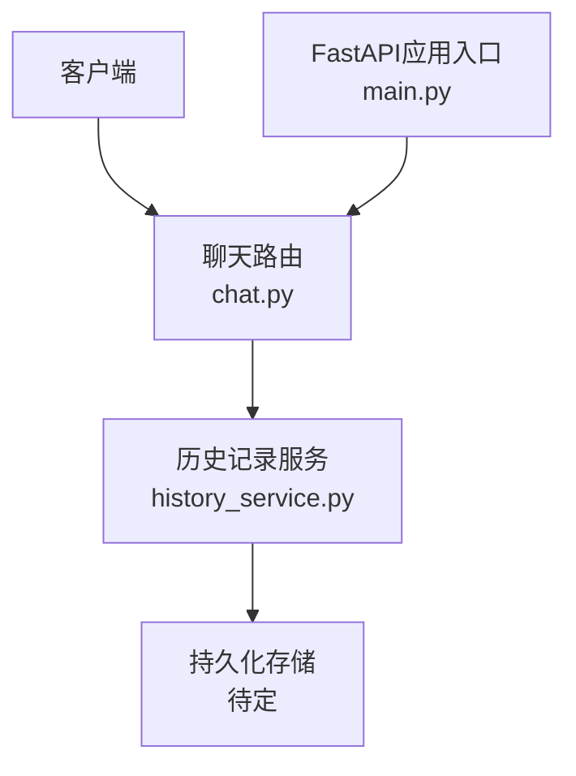
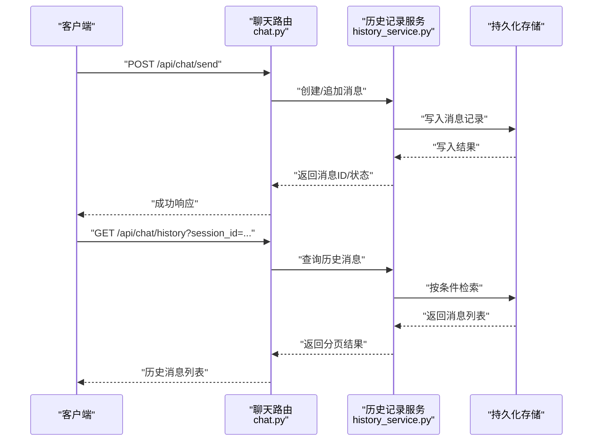
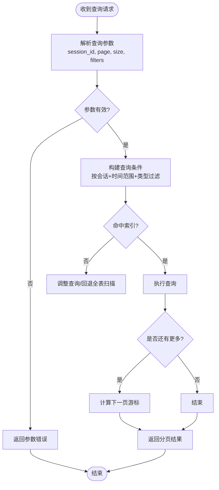

# 聊天记录服务

<cite>
**本文引用的文件**   
- [backend/app/routers/chat.py](file://backend/app/routers/chat.py)
- [backend/app/services/history_service.py](file://backend/app/services/history_service.py)
- [backend/app/main.py](file://backend/app/main.py)
- [backend/requirements.txt](file://backend/requirements.txt)
</cite>

## 目录
1. [简介](#简介)
2. [项目结构](#项目结构)
3. [核心组件](#核心组件)
4. [架构总览](#架构总览)
5. [详细组件分析](#详细组件分析)
6. [依赖分析](#依赖分析)
7. [性能考虑](#性能考虑)
8. [故障排查指南](#故障排查指南)
9. [结论](#结论)
10. [附录](#附录)

## 简介
本文件围绕“聊天记录服务”的目标，系统化梳理消息存储架构、会话管理机制、数据持久化方案、消息格式规范与历史记录查询API的使用与调优建议。文档以仓库中后端代码为依据，重点覆盖路由层与服务层的交互、历史记录的读写流程以及可扩展的数据库与索引策略。

## 项目结构
聊天记录相关能力主要位于后端模块：
- 路由层：提供聊天与历史相关的HTTP接口
- 服务层：封装历史消息的创建、检索等核心逻辑
- 应用入口：注册路由并启动服务

图表来源
- [backend/app/routers/chat.py](file://backend/app/routers/chat.py)
- [backend/app/services/history_service.py](file://backend/app/services/history_service.py)
- [backend/app/main.py](file://backend/app/main.py)

章节来源
- [backend/app/routers/chat.py](file://backend/app/routers/chat.py)
- [backend/app/services/history_service.py](file://backend/app/services/history_service.py)
- [backend/app/main.py](file://backend/app/main.py)

## 核心组件
- 聊天路由（HTTP API）
  - 职责：接收客户端请求，校验参数，调用服务层完成业务处理，返回统一响应。
  - 典型能力：发送消息、获取会话历史、分页或过滤查询。
- 历史记录服务（业务逻辑）
  - 职责：维护会话上下文、组装消息元数据、执行持久化与查询优化。
  - 典型能力：创建会话、追加消息、按会话ID/时间范围/关键词检索、分页与排序。
- 应用入口（路由注册）
  - 职责：初始化应用、挂载路由、配置中间件与全局设置。

章节来源
- [backend/app/routers/chat.py](file://backend/app/routers/chat.py)
- [backend/app/services/history_service.py](file://backend/app/services/history_service.py)
- [backend/app/main.py](file://backend/app/main.py)

## 架构总览
聊天记录服务采用分层架构：
- 表现层：REST路由，负责协议适配与参数校验
- 领域层：历史记录服务，封装会话与消息的业务规则
- 数据层：持久化存储（当前未绑定具体实现，预留扩展点）

图表来源
- [backend/app/routers/chat.py](file://backend/app/routers/chat.py)
- [backend/app/services/history_service.py](file://backend/app/services/history_service.py)

## 详细组件分析

### 聊天路由（HTTP API）
- 设计要点
  - 统一错误码与响应体结构，便于前端一致处理
  - 参数校验与限流保护，避免非法输入与滥用
  - 对历史查询支持分页、排序与可选过滤字段
- 关键接口（示例）
  - 发送消息：POST /api/chat/send
  - 获取历史：GET /api/chat/history
- 注意事项
  - 大消息体需限制大小，富媒体建议走对象存储并仅保存引用
  - 敏感信息脱敏后再落库

章节来源
- [backend/app/routers/chat.py](file://backend/app/routers/chat.py)

### 历史记录服务（会话与消息）
- 会话管理
  - 会话创建：生成唯一会话ID，初始化上下文（如用户标识、模型版本、系统提示等）
  - 上下文维护：在追加消息时携带必要上下文，保证后续对话连贯性
  - 会话生命周期：支持软删除、归档与清理策略
- 消息存储
  - 数据结构：包含消息类型、角色、内容、附件引用、时间戳、版本等
  - 索引策略：基于会话ID、时间戳、消息类型建立复合索引，提升查询效率
  - 查询优化：分页游标、范围扫描、选择性过滤、缓存热点会话
- 版本兼容
  - 消息结构引入version字段，服务端根据版本进行解析与转换
  - 向后兼容：旧格式自动映射到新结构，保留冗余字段用于过渡期

图表来源
- [backend/app/services/history_service.py](file://backend/app/services/history_service.py)

章节来源
- [backend/app/services/history_service.py](file://backend/app/services/history_service.py)

### 应用入口（路由注册）
- 职责
  - 初始化FastAPI应用实例
  - 挂载聊天路由模块
  - 配置跨域、日志、健康检查等通用中间件
- 扩展点
  - 可在此注入数据库连接池、缓存、对象存储等外部依赖

章节来源
- [backend/app/main.py](file://backend/app/main.py)

## 依赖分析
- 运行时依赖
  - Web框架：FastAPI（通过路由与应用入口使用）
  - 其他依赖：见requirements.txt
- 内部依赖关系
  - 路由层依赖历史记录服务
  - 历史记录服务预留数据访问抽象，便于替换不同数据库实现

图表来源
- [backend/app/main.py](file://backend/app/main.py)
- [backend/app/routers/chat.py](file://backend/app/routers/chat.py)
- [backend/app/services/history_service.py](file://backend/app/services/history_service.py)

章节来源
- [backend/requirements.txt](file://backend/requirements.txt)
- [backend/app/main.py](file://backend/app/main.py)
- [backend/app/routers/chat.py](file://backend/app/routers/chat.py)
- [backend/app/services/history_service.py](file://backend/app/services/history_service.py)

## 性能考虑
- 索引与查询
  - 为高频查询字段建立索引：会话ID、时间戳、消息类型
  - 使用复合索引覆盖常见组合查询，减少回表
  - 分页采用游标式分页，避免深页性能退化
- 缓存策略
  - 热点会话最近N条消息缓存至内存或Redis，降低DB压力
  - 合理设置TTL与失效策略，兼顾一致性与性能
- 存储与传输
  - 富媒体文件走对象存储，消息体仅存引用，减小数据库体积
  - 压缩与分片上传，降低网络开销
- 并发与资源
  - 连接池复用数据库连接
  - 异步I/O处理长耗时任务（如转码、OCR）

[本节为通用性能建议，不直接分析具体文件]

## 故障排查指南
- 常见问题定位
  - 参数校验失败：检查请求体结构与必填字段
  - 查询无结果：确认会话ID、时间范围与过滤条件是否正确
  - 性能抖动：查看慢查询日志与索引命中率
- 日志与监控
  - 记录关键操作：会话创建、消息写入、查询耗时
  - 指标上报：QPS、P99延迟、错误率、缓存命中率
- 恢复与降级
  - 数据库不可用时返回友好错误与重试策略
  - 热点数据缓存失效时的回退路径

[本节为通用排障建议，不直接分析具体文件]

## 结论
聊天记录服务通过清晰的分层设计与可扩展的数据访问抽象，实现了会话管理与历史消息的高效存取。建议在落地阶段明确数据库选型与索引策略，结合缓存与对象存储优化整体性能与成本。

[本节为总结性内容，不直接分析具体文件]

## 附录

### 消息格式规范（建议）
- 基础字段
  - id：消息唯一标识
  - session_id：所属会话
  - role：角色（如user/assistant/system）
  - type：消息类型（text/image/audio/video/file）
  - content：文本内容或富媒体引用
  - version：消息结构版本
  - created_at/updated_at：时间戳
- 元数据
  - metadata：键值对，用于扩展（如来源、标签、摘要）
- 富媒体支持
  - 图片/视频/音频：仅保存URL或对象存储Key，附带尺寸、时长、MIME等元信息
- 版本兼容
  - 新增字段保持向后兼容；废弃字段保留一段时间并做迁移脚本

[本节为概念性规范说明，不直接分析具体文件]

### 数据持久化方案（建议）
- 数据库选择
  - 关系型：MySQL/PostgreSQL，适合结构化消息与事务一致性
  - 时序/列式：ClickHouse/TimescaleDB，适合海量历史分析与归档
- 备份策略
  - 每日全量+增量备份，异地容灾，定期演练恢复
- 数据迁移
  - 使用版本化迁移脚本，灰度发布，双写过渡后切换读路径

[本节为概念性方案说明，不直接分析具体文件]

### 历史记录查询API使用指南与调优
- 常用参数
  - session_id：必填，指定会话
  - page/size：分页参数
  - start_time/end_time：时间范围过滤
  - type：消息类型过滤
  - keyword：关键词搜索（建议走搜索引擎）
- 响应结构
  - data：消息列表
  - pagination：分页信息（has_more、next_cursor等）
  - meta：统计信息（总数、耗时等）
- 调优建议
  - 优先使用索引覆盖的查询条件
  - 控制单次返回大小，避免大响应
  - 对热点会话启用缓存，缩短首屏加载

[本节为概念性使用指南，不直接分析具体文件]