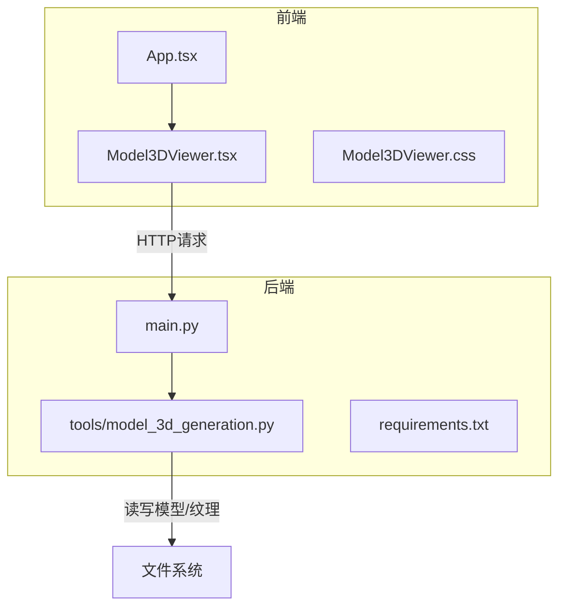
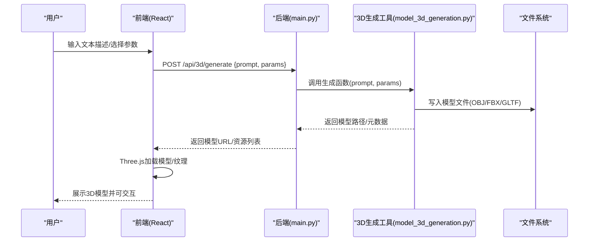
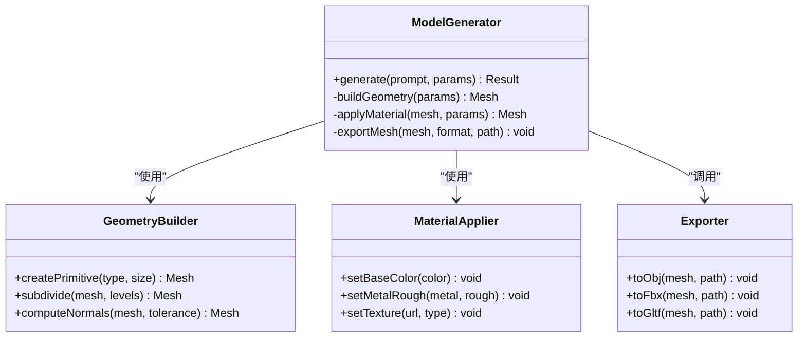
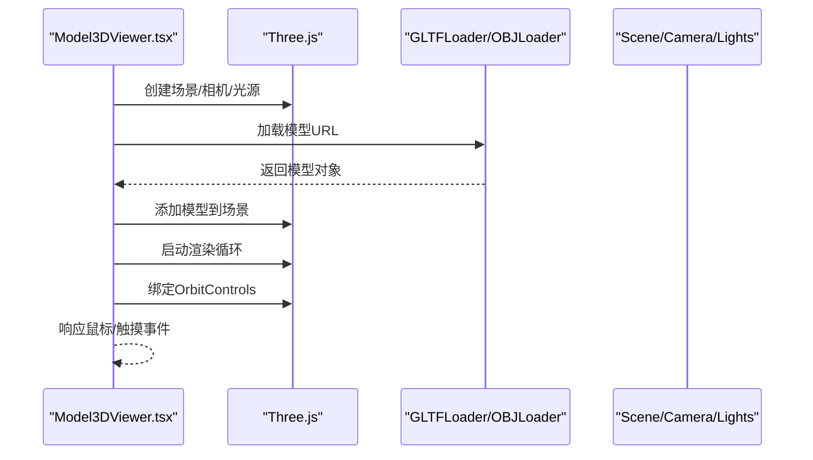
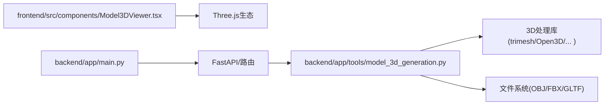
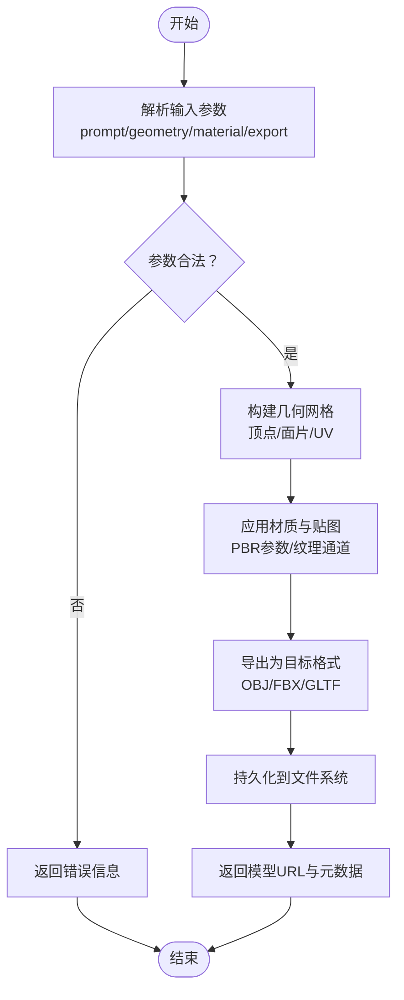

# 3D模型工具

<cite>
**本文引用的文件**   
- [backend/app/tools/model_3d_generation.py](file://backend/app/tools/model_3d_generation.py)
- [frontend/src/components/Model3DViewer.tsx](file://frontend/src/components/Model3DViewer.tsx)
- [frontend/src/components/Model3DViewer.css](file://frontend/src/components/Model3DViewer.css)
- [backend/app/main.py](file://backend/app/main.py)
- [backend/requirements.txt](file://backend/requirements.txt)
</cite>

## 目录
1. [简介](#简介)
2. [项目结构](#项目结构)
3. [核心组件](#核心组件)
4. [架构总览](#架构总览)
5. [详细组件分析](#详细组件分析)
6. [依赖关系分析](#依赖关系分析)
7. [性能考虑](#性能考虑)
8. [故障排查指南](#故障排查指南)
9. [结论](#结论)
10. [附录](#附录)

## 简介
本项目提供面向文本到3D的生成能力与Web端可视化查看能力，后端通过工具模块组织3D相关功能，前端以React组件集成Three.js进行模型渲染。文档围绕以下目标展开：
- 3D模型生成功能：文本转3D、几何建模、材质应用
- 渲染管线：从网格构建到纹理映射与着色
- API参数配置：输入输出规范、坐标系定义、精度控制
- 数据处理流程：内存管理、批处理、格式支持（OBJ、FBX、GLTF）
- 工作流与集成：编辑工作流、批量脚本、Web端集成方案
- 应用场景：内容创作、虚拟场景构建等端到端实现

## 项目结构
本仓库采用前后端分离架构：
- 后端（Python FastAPI）：提供工具化能力与接口，包含3D模型生成工具、路由与服务编排
- 前端（React + Vite）：提供聊天界面与3D模型查看器，使用Three.js进行渲染

图表来源
- [backend/app/main.py](file://backend/app/main.py)
- [backend/app/tools/model_3d_generation.py](file://backend/app/tools/model_3d_generation.py)
- [frontend/src/components/Model3DViewer.tsx](file://frontend/src/components/Model3DViewer.tsx)
- [frontend/src/components/Model3DViewer.css](file://frontend/src/components/Model3DViewer.css)

章节来源
- [backend/app/main.py](file://backend/app/main.py)
- [backend/app/tools/model_3d_generation.py](file://backend/app/tools/model_3d_generation.py)
- [frontend/src/components/Model3DViewer.tsx](file://frontend/src/components/Model3DViewer.tsx)
- [frontend/src/components/Model3DViewer.css](file://frontend/src/components/Model3DViewer.css)
- [backend/requirements.txt](file://backend/requirements.txt)

## 核心组件
- 3D模型生成工具（后端）
  - 负责将文本描述转换为3D资产（网格、材质、贴图），并持久化为标准格式（OBJ/FBX/GLTF）
  - 暴露可被路由调用的函数式接口，便于在Agent或工作流中复用
- 3D模型查看器（前端）
  - 基于Three.js加载并展示3D模型，支持基础交互（旋转、缩放、平移）
  - 提供样式与UI布局，适配不同屏幕尺寸
- 后端主入口与路由
  - 聚合工具能力，对外暴露REST接口，协调任务执行与结果返回

章节来源
- [backend/app/tools/model_3d_generation.py](file://backend/app/tools/model_3d_generation.py)
- [frontend/src/components/Model3DViewer.tsx](file://frontend/src/components/Model3DViewer.tsx)
- [frontend/src/components/Model3DViewer.css](file://frontend/src/components/Model3DViewer.css)
- [backend/app/main.py](file://backend/app/main.py)

## 架构总览
系统由“文本输入 → 3D生成 → 模型存储 → Web渲染”构成闭环。前端发起请求，后端调用3D生成工具完成网格与材质构建，输出为通用3D格式；前端通过Three.js加载并渲染模型，形成完整的创作与预览体验。

图表来源
- [backend/app/main.py](file://backend/app/main.py)
- [backend/app/tools/model_3d_generation.py](file://backend/app/tools/model_3d_generation.py)
- [frontend/src/components/Model3DViewer.tsx](file://frontend/src/components/Model3DViewer.tsx)

## 详细组件分析

### 3D模型生成工具（后端）
职责与边界
- 接收文本提示与参数，生成3D网格与材质，输出标准格式
- 管理中间数据与最终产物，确保可复现与可追溯
- 提供清晰的函数签名与错误码，便于上层路由与工作流集成

关键能力
- 文本到3D：解析语义，驱动几何构造与材质分配
- 几何建模：基于规则或算法生成顶点、面片、UV坐标
- 材质应用：PBR材质参数、漫反射/法线/粗糙度贴图合成
- 格式导出：OBJ/FBX/GLTF序列化与压缩策略

参数配置（示例字段）
- prompt: 文本描述
- geometry: 形状类型、细分等级、拓扑约束
- material: 颜色、金属度、粗糙度、贴图URL
- export: 目标格式、单位、坐标系、精度
- quality: 采样率、抗锯齿、光照烘焙开关

坐标系与精度
- 默认右手坐标系，Y轴向上或Z轴向上可按配置切换
- 顶点精度、UV精度、法线重建容差可配置
- 单位制（米/厘米）与缩放因子统一导出

内存与性能
- 分块生成与增量写入，避免一次性加载大模型
- 纹理按需加载与Mipmap预生成
- 后台任务队列与超时重试机制

错误处理
- 参数校验失败、外部依赖不可用、磁盘空间不足等异常分类
- 结构化错误响应，便于前端降级与重试

章节来源
- [backend/app/tools/model_3d_generation.py](file://backend/app/tools/model_3d_generation.py)

#### 类图（概念性）

[此图为概念性示意，用于说明组件职责与协作关系]

### 3D模型查看器（前端）
职责与边界
- 加载后端返回的模型与纹理资源
- 初始化Three.js场景、相机、光源与控制器
- 提供交互操作与UI反馈

关键能力
- 模型加载：支持GLTF/OBJ/FBX（取决于浏览器与插件）
- 材质显示：PBR材质、贴图通道、环境光遮蔽
- 交互控制：OrbitControls旋转/缩放/平移
- 性能优化：实例化渲染、LOD、纹理压缩

渲染管线
- 场景初始化 → 加载模型 → 绑定材质与贴图 → 设置光源 → 渲染循环
- 事件监听 → 更新相机/控制器 → 重绘帧

章节来源
- [frontend/src/components/Model3DViewer.tsx](file://frontend/src/components/Model3DViewer.tsx)
- [frontend/src/components/Model3DViewer.css](file://frontend/src/components/Model3DViewer.css)

#### 序列图（前端渲染流程）

图表来源
- [frontend/src/components/Model3DViewer.tsx](file://frontend/src/components/Model3DViewer.tsx)

### 后端主入口与路由
职责与边界
- 注册3D生成相关路由，接收前端请求
- 调用工具模块完成生成任务，返回模型资源链接
- 统一错误处理与日志记录

章节来源
- [backend/app/main.py](file://backend/app/main.py)

## 依赖关系分析
- 后端依赖
  - Python包管理与第三方库（见requirements.txt）
  - 3D处理库（如PyTorch3D、trimesh、Open3D等，具体以实际依赖为准）
  - 网络框架（FastAPI/Starlette）
- 前端依赖
  - React生态（Vite、TypeScript）
  - Three.js及其加载器（GLTFLoader、OBJLoader、FBXLoader）

图表来源
- [frontend/src/components/Model3DViewer.tsx](file://frontend/src/components/Model3DViewer.tsx)
- [backend/app/main.py](file://backend/app/main.py)
- [backend/app/tools/model_3d_generation.py](file://backend/app/tools/model_3d_generation.py)
- [backend/requirements.txt](file://backend/requirements.txt)

章节来源
- [backend/requirements.txt](file://backend/requirements.txt)

## 性能考虑
- 模型侧
  - 减少三角面数与顶点数量，启用LOD层级
  - 纹理压缩（KTX2/Basis）与Mipmap预生成
  - 合并材质与图集，降低Draw Call
- 传输侧
  - 使用CDN缓存静态资源
  - 分块下载与懒加载
- 渲染侧
  - 合理设置阴影与后处理开关
  - 使用InstancedMesh批量绘制重复元素
- 服务端
  - 异步任务队列与限流
  - 磁盘I/O优化与临时文件清理

[本节为通用指导，不直接分析具体文件]

## 故障排查指南
常见问题与定位
- 模型无法加载
  - 检查后端返回的URL是否可达
  - 确认浏览器支持的格式与编码
  - 查看控制台是否有跨域或资源404错误
- 材质显示异常
  - 验证贴图路径与命名约定
  - 检查PBR参数范围（金属度/粗糙度）
- 性能卡顿
  - 监控GPU/CPU占用，识别瓶颈
  - 降低分辨率与关闭不必要效果
- 生成失败
  - 核对参数合法性与必填项
  - 查看后端日志与错误码

章节来源
- [backend/app/tools/model_3d_generation.py](file://backend/app/tools/model_3d_generation.py)
- [frontend/src/components/Model3DViewer.tsx](file://frontend/src/components/Model3DViewer.tsx)

## 结论
本项目在后端提供文本到3D的生成能力，在前端实现Three.js驱动的可视化查看，形成从创作到展示的完整链路。通过合理的参数配置、坐标系与精度控制，以及格式支持与渲染优化，可满足内容创作与虚拟场景构建的实际需求。后续可在批处理脚本、多模态输入与云端渲染方面持续演进。

[本节为总结性内容，不直接分析具体文件]

## 附录

### API参考（概念性）
- 端点：POST /api/3d/generate
- 请求体
  - prompt: string（必需）
  - geometry: object（可选）
    - type: string（立方体/球体/圆柱/自定义）
    - subdivisions: number（细分等级）
  - material: object（可选）
    - baseColor: string（十六进制色值）
    - metalness: number（0~1）
    - roughness: number（0~1）
    - textures: array（贴图URL列表）
  - export: object（可选）
    - format: string（obj/fbx/gltf）
    - unit: string（m/cm）
    - coordinate_system: string（y-up/z-up）
    - precision: number（顶点/UV精度）
  - quality: object（可选）
    - sampling: number（采样率）
    - anti_aliasing: boolean
    - bake_lighting: boolean
- 响应体
  - model_url: string（模型文件访问地址）
  - assets: array（贴图/材质资源URL）
  - metadata: object（格式、单位、坐标系、面数、顶点数）

[本节为概念性API说明，不直接分析具体文件]

### 坐标系与精度
- 坐标系
  - Y轴向上：常见于Blender/Maya
  - Z轴向上：常见于Unity/Unreal
- 精度控制
  - 顶点位置精度（浮点位数）
  - UV坐标精度（归一化小数位）
  - 法线重建容差（角度阈值）

[本节为概念性说明，不直接分析具体文件]

### 支持的3D格式
- OBJ：轻量、易读，适合简单网格与材质
- FBX：工业级交换格式，支持复杂场景与动画
- GLTF：Web友好，二进制高效，原生支持PBR材质

[本节为概念性说明，不直接分析具体文件]

### 3D数据处理流程（流程图）

[此图为概念性流程示意，用于说明整体处理步骤]

### 3D模型编辑工作流（建议）
- 生成阶段：文本提示 → 参数配置 → 生成网格与材质
- 编辑阶段：导入至Blender/Maya进行拓扑优化与UV展开
- 导出阶段：按平台要求导出GLTF/OBJ/FBX
- 集成阶段：前端Three.js加载与交互调试
- 发布阶段：资源上传CDN，版本化管理

[本节为概念性工作流建议，不直接分析具体文件]

### 批量处理脚本（建议）
- 输入：CSV/JSON清单（prompt、参数、目标格式）
- 处理：并行调用后端接口，落盘模型与日志
- 校验：自动检查面数、贴图完整性与文件大小
- 报告：汇总成功/失败统计与错误原因

[本节为概念性脚本建议，不直接分析具体文件]

### Web端集成方案（建议）
- 资源托管：CDN分发模型与贴图
- 鉴权：Token鉴权与CORS白名单
- 降级：不支持FBX时回退到GLTF/OBJ
- 监控：前端埋点与后端APM联动

[本节为概念性集成建议，不直接分析具体文件]