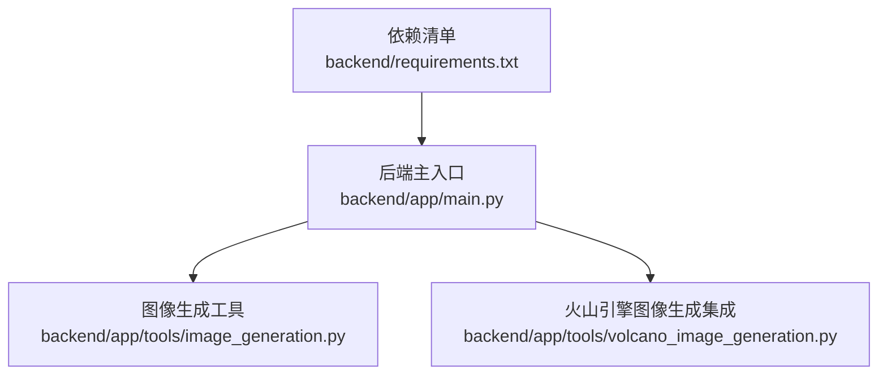
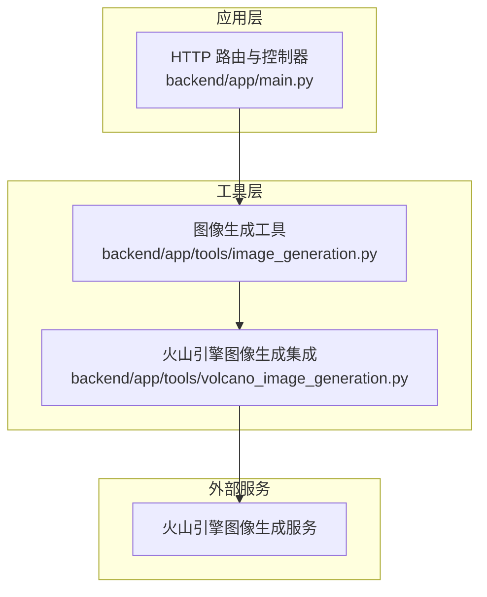
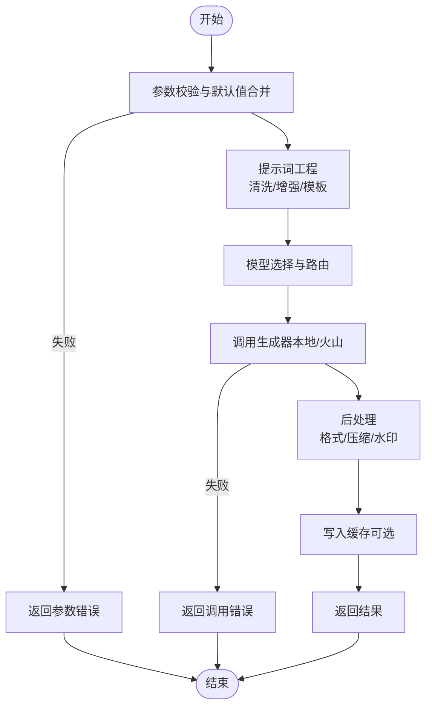
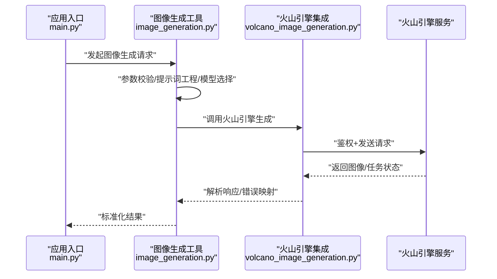
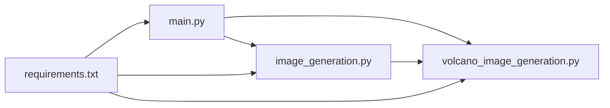

# 图像处理工具

<cite>
**本文引用的文件**   
- [image_generation.py](file://backend/app/tools/image_generation.py)
- [volcano_image_generation.py](file://backend/app/tools/volcano_image_generation.py)
- [main.py](file://backend/app/main.py)
- [requirements.txt](file://backend/requirements.txt)
</cite>

## 目录
1. [简介](#简介)
2. [项目结构](#项目结构)
3. [核心组件](#核心组件)
4. [架构总览](#架构总览)
5. [详细组件分析](#详细组件分析)
6. [依赖分析](#依赖分析)
7. [性能考虑](#性能考虑)
8. [故障排查指南](#故障排查指南)
9. [结论](#结论)
10. [附录](#附录)

## 简介
本技术文档围绕“图像处理工具”的图像生成功能与火山引擎图像生成服务集成展开，覆盖以下主题：
- AI绘图、风格迁移、尺寸调整的实现思路与参数配置
- 火山引擎图像生成服务的接入方式与调用流程
- 提示词工程建议与模型选择策略
- 图像处理流水线设计、批量处理机制与缓存策略
- 支持的图像格式、分辨率限制与质量优化选项
- 图像编辑工作流与批量处理脚本实践
- 性能调优指南与实际应用场景（内容创作、设计自动化）

## 项目结构
后端采用模块化组织，图像相关能力集中在 tools 目录下，并通过主应用入口进行路由与服务装配。关键路径如下：
- 图像生成工具：backend/app/tools/image_generation.py
- 火山引擎图像生成集成：backend/app/tools/volcano_image_generation.py
- 后端主入口与路由装配：backend/app/main.py
- 依赖清单：backend/requirements.txt

图表来源
- [main.py](file://backend/app/main.py)
- [image_generation.py](file://backend/app/tools/image_generation.py)
- [volcano_image_generation.py](file://backend/app/tools/volcano_image_generation.py)
- [requirements.txt](file://backend/requirements.txt)

章节来源
- [main.py](file://backend/app/main.py)
- [image_generation.py](file://backend/app/tools/image_generation.py)
- [volcano_image_generation.py](file://backend/app/tools/volcano_image_generation.py)
- [requirements.txt](file://backend/requirements.txt)

## 核心组件
- 图像生成工具模块
  - 职责：封装通用图像生成能力（AI绘图、风格迁移、尺寸调整），提供统一的输入输出接口，便于上层编排与扩展。
  - 关键点：参数校验、提示词预处理、模型选择、结果后处理（格式转换、压缩）。
- 火山引擎图像生成集成模块
  - 职责：对接火山引擎图像生成服务，完成鉴权、请求构造、响应解析与错误映射。
  - 关键点：API Key/Secret 管理、并发控制、重试与退避、超时与熔断。
- 后端主入口
  - 职责：注册路由、注入依赖、统一异常与日志。
  - 关键点：中间件（限流、鉴权）、健康检查、监控指标上报。

章节来源
- [image_generation.py](file://backend/app/tools/image_generation.py)
- [volcano_image_generation.py](file://backend/app/tools/volcano_image_generation.py)
- [main.py](file://backend/app/main.py)

## 架构总览
整体架构以“工具层 + 服务集成层 + 应用入口”分层组织，图像生成请求从前端或上游系统进入后端主入口，经路由分发到图像生成工具，必要时通过火山引擎集成模块调用外部服务，最终返回标准化结果。

图表来源
- [main.py](file://backend/app/main.py)
- [image_generation.py](file://backend/app/tools/image_generation.py)
- [volcano_image_generation.py](file://backend/app/tools/volcano_image_generation.py)

## 详细组件分析

### 图像生成工具（image_generation.py）
- 功能范围
  - AI绘图：基于提示词与模型参数生成图像
  - 风格迁移：将目标风格应用到源图像
  - 尺寸调整：等比缩放、裁剪、填充与质量重采样
- 输入输出
  - 输入：提示词、模型标识、分辨率、风格参考图、质量参数、输出格式等
  - 输出：图像二进制或URL、元数据（尺寸、哈希、耗时）
- 关键流程
  - 参数校验与默认值合并
  - 提示词工程（清洗、增强、模板化）
  - 模型选择与路由（本地/云端）
  - 调用下游生成器（含火山引擎）
  - 结果后处理（格式转换、压缩、水印可选）
  - 缓存命中与回写
- 错误处理
  - 参数非法、模型不可用、网络异常、超时、配额不足等
  - 统一错误码与可观测性字段（trace_id、耗时、阶段）

图表来源
- [image_generation.py](file://backend/app/tools/image_generation.py)

章节来源
- [image_generation.py](file://backend/app/tools/image_generation.py)

### 火山引擎图像生成集成（volcano_image_generation.py）
- 功能范围
  - 鉴权与签名
  - 请求构造（端点、头部、负载）
  - 响应解析（图像数据、任务ID、状态）
  - 错误映射（业务错误、网络错误、限流）
- 关键流程
  - 初始化客户端（AK/SK、区域、版本）
  - 构建请求体（模型、提示词、分辨率、风格、数量等）
  - 发送请求并处理响应
  - 重试与退避（指数退避、最大重试次数）
  - 超时与熔断（快速失败、降级）
- 安全与合规
  - 密钥管理（环境变量/配置中心）
  - 敏感信息脱敏日志
  - 访问审计与追踪

图表来源
- [main.py](file://backend/app/main.py)
- [image_generation.py](file://backend/app/tools/image_generation.py)
- [volcano_image_generation.py](file://backend/app/tools/volcano_image_generation.py)

章节来源
- [volcano_image_generation.py](file://backend/app/tools/volcano_image_generation.py)

### 后端主入口（main.py）
- 职责
  - 注册图像生成相关路由
  - 注入工具与集成模块
  - 统一异常处理、日志与监控
- 关键点
  - 路由前缀与版本控制
  - 中间件（鉴权、限流、CORS）
  - 健康检查与就绪探针

章节来源
- [main.py](file://backend/app/main.py)

## 依赖分析
- 运行时依赖
  - 图像生成与处理库（如图像处理、编码解码、压缩）
  - HTTP 客户端（用于调用火山引擎）
  - 配置与日志框架
- 依赖关系可视化

图表来源
- [main.py](file://backend/app/main.py)
- [image_generation.py](file://backend/app/tools/image_generation.py)
- [volcano_image_generation.py](file://backend/app/tools/volcano_image_generation.py)
- [requirements.txt](file://backend/requirements.txt)

章节来源
- [requirements.txt](file://backend/requirements.txt)

## 性能考虑
- 并发与吞吐
  - 使用连接池与异步IO提升并发能力
  - 合理设置线程/进程池大小，避免资源争用
- 缓存策略
  - 按提示词+模型+参数的指纹做缓存键
  - LRU/TTL 结合，热点结果优先命中
- 批处理
  - 支持批量提交与聚合返回
  - 分片与去重，减少重复计算
- 质量与体积平衡
  - 按需选择压缩级别与格式（WebP/JPEG/PNG）
  - 渐进式加载与缩略图生成
- 外部服务优化
  - 指数退避与重试上限
  - 熔断与降级（返回缓存或占位图）
  - 超时与心跳检测

[本节为通用指导，不直接分析具体文件]

## 故障排查指南
- 常见问题
  - 参数错误：检查必填项、取值范围与格式
  - 模型不可用：确认模型标识与可用区
  - 网络异常：检查代理、DNS、证书与超时
  - 限流/配额：查看速率限制与账户额度
- 定位方法
  - 启用详细日志与链路追踪（trace_id）
  - 记录请求指纹与响应状态码
  - 对关键步骤打点（耗时、成功率、错误分布）
- 恢复策略
  - 自动重试与退避
  - 降级到缓存或替代模型
  - 告警与人工介入

章节来源
- [image_generation.py](file://backend/app/tools/image_generation.py)
- [volcano_image_generation.py](file://backend/app/tools/volcano_image_generation.py)

## 结论
本图像处理工具以清晰的模块化设计实现图像生成与火山引擎集成，具备完善的参数校验、提示词工程、模型选择与错误处理机制。通过缓存、批处理与质量优化策略，可在内容创作与设计自动化场景中稳定高效地提供服务。后续可进一步引入更多模型与风格、完善监控与A/B测试能力，持续提升用户体验与系统韧性。

[本节为总结性内容，不直接分析具体文件]

## 附录

### 图像生成API参数配置要点
- 基础参数
  - 提示词（prompt）、负向提示词（negative_prompt）
  - 模型标识（model）、种子（seed）
  - 分辨率（width/height）、步数（steps）、引导系数（guidance_scale）
  - 数量（num_images）、输出格式（format）
- 风格与质量
  - 风格参考图（style_ref）、强度（style_strength）
  - 质量等级（quality）、压缩级别（compression）
- 火山引擎特有
  - 区域（region）、版本（version）
  - 任务模式（同步/异步）、回调地址（callback_url）

[本节为概念性说明，不直接分析具体文件]

### 提示词工程最佳实践
- 结构化表达：主体+环境+风格+光照+构图
- 负面约束：明确排除元素与噪声
- 模板化：复用常用句式与标签
- 迭代优化：基于反馈微调关键词权重

[本节为概念性说明，不直接分析具体文件]

### 模型选择策略
- 根据场景匹配模型（写实/二次元/插画/产品）
- 关注模型特性（速度、质量、可控性）
- 灰度发布与A/B对比评估

[本节为概念性说明，不直接分析具体文件]

### 支持的图像格式与分辨率限制
- 常见格式：JPEG、PNG、WebP、BMP
- 分辨率建议：遵循模型原生分辨率与倍数规则
- 超大图处理：分块生成与拼接

[本节为概念性说明，不直接分析具体文件]

### 图像编辑工作流示例
- 输入：原始图/提示词/风格参考
- 处理：风格迁移→尺寸调整→质量优化
- 输出：多规格图集与缩略图

[本节为概念性说明，不直接分析具体文件]

### 批量处理脚本建议
- 输入清单：CSV/JSON 列表（包含提示词、模型、参数）
- 执行策略：分片并行、去重、断点续传
- 结果归档：按批次与时间戳组织

[本节为概念性说明，不直接分析具体文件]

### 实际应用场景案例
- 内容创作：文章配图自动生成、封面图批量产出
- 设计自动化：海报模板渲染、品牌素材批量生成
- 电商运营：商品图风格统一、多尺寸适配

[本节为概念性说明，不直接分析具体文件]