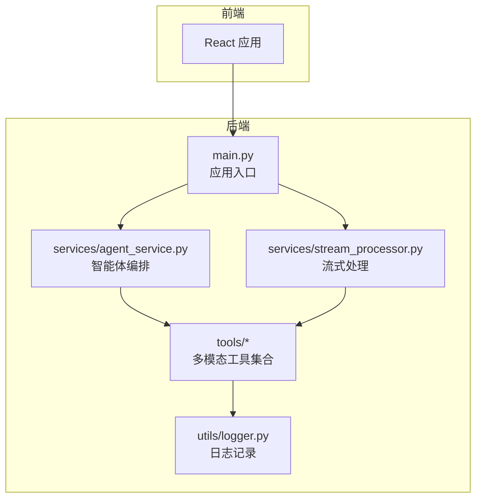
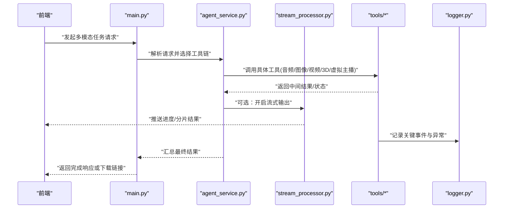
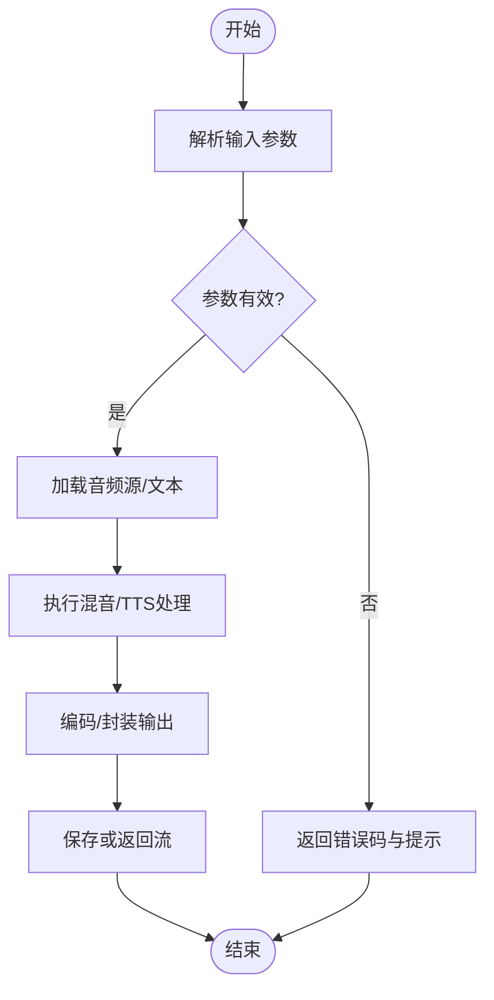
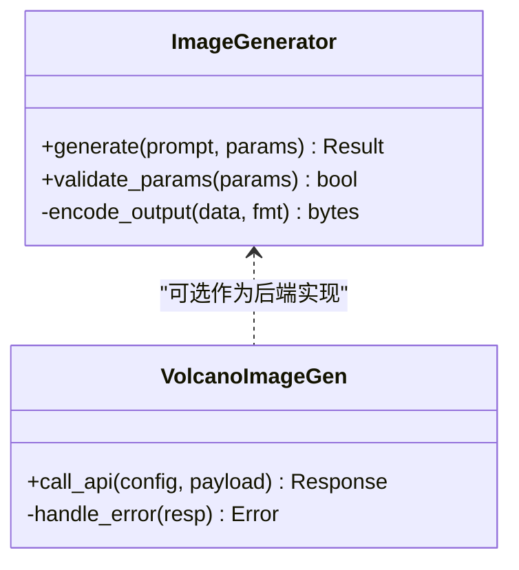
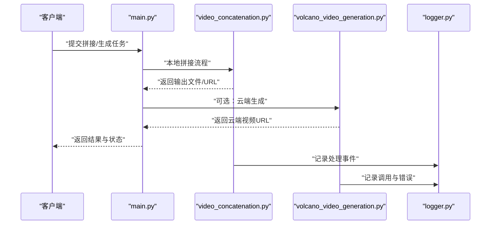
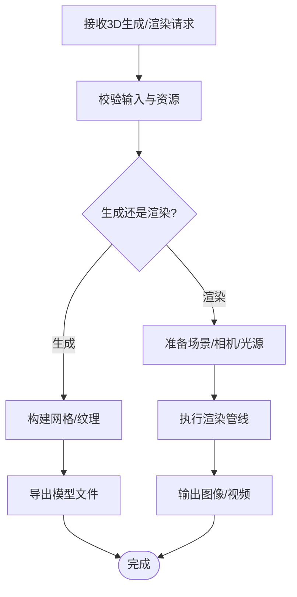
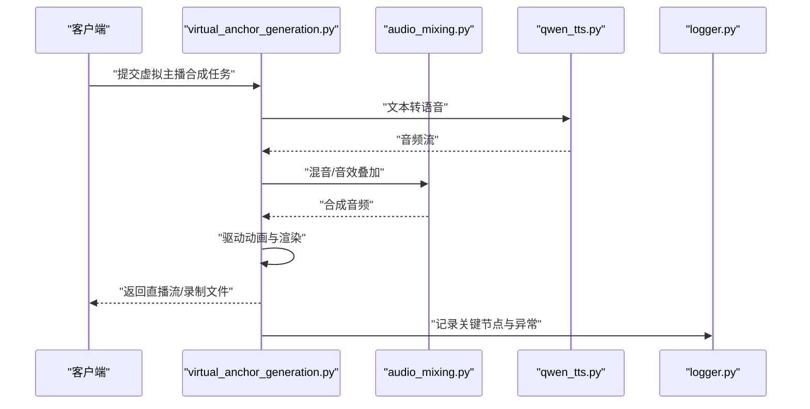
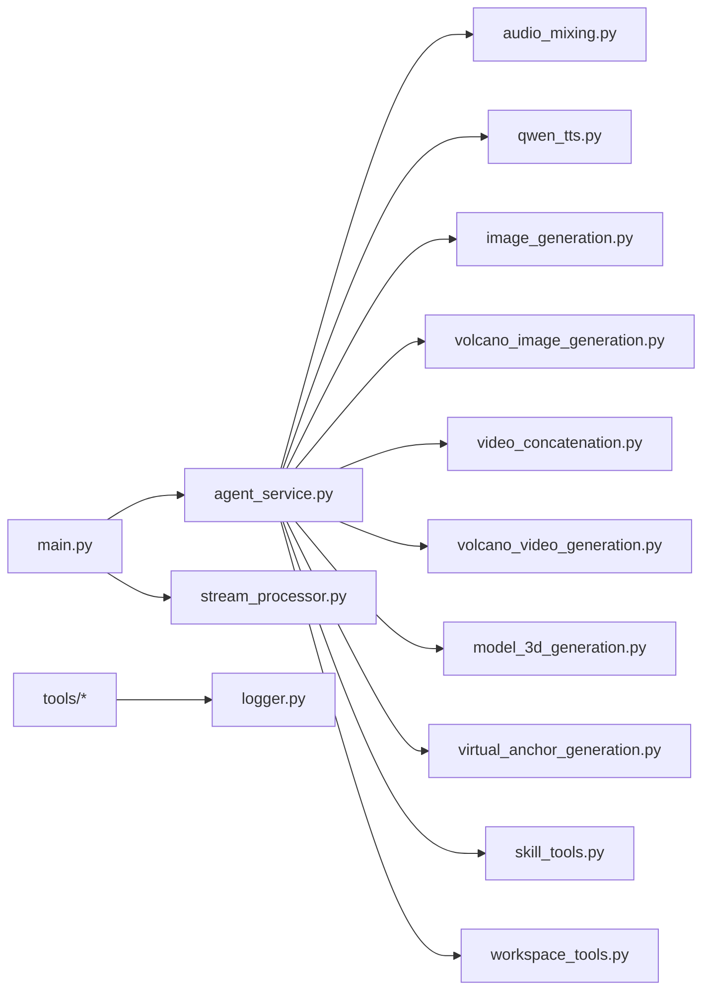

# 多模态工具集

<cite>
**本文引用的文件**   
- [backend/app/main.py](file://backend/app/main.py)
- [backend/app/tools/audio_mixing.py](file://backend/app/tools/audio_mixing.py)
- [backend/app/tools/qwen_tts.py](file://backend/app/tools/qwen_tts.py)
- [backend/app/tools/image_generation.py](file://backend/app/tools/image_generation.py)
- [backend/app/tools/volcano_image_generation.py](file://backend/app/tools/volcano_image_generation.py)
- [backend/app/tools/video_concatenation.py](file://backend/app/tools/video_concatenation.py)
- [backend/app/tools/volcano_video_generation.py](file://backend/app/tools/volcano_video_generation.py)
- [backend/app/tools/model_3d_generation.py](file://backend/app/tools/model_3d_generation.py)
- [backend/app/tools/virtual_anchor_generation.py](file://backend/app/tools/virtual_anchor_generation.py)
- [backend/app/tools/skill_tools.py](file://backend/app/tools/skill_tools.py)
- [backend/app/tools/workspace_tools.py](file://backend/app/tools/workspace_tools.py)
- [backend/app/services/agent_service.py](file://backend/app/services/agent_service.py)
- [backend/app/services/stream_processor.py](file://backend/app/services/stream_processor.py)
- [backend/app/utils/logger.py](file://backend/app/utils/logger.py)
</cite>

## 目录
1. [简介](#简介)
2. [项目结构](#项目结构)
3. [核心组件](#核心组件)
4. [架构总览](#架构总览)
5. [详细组件分析](#详细组件分析)
6. [依赖关系分析](#依赖关系分析)
7. [性能考虑](#性能考虑)
8. [故障排查指南](#故障排查指南)
9. [结论](#结论)
10. [附录](#附录)

## 简介
本技术文档面向“多模态工具集”的开发者与使用者，系统性梳理音频处理（混音、语音合成）、图像处理（生成、编辑）、视频处理（拼接、转码）、3D模型工具（生成、渲染）以及虚拟主播工具等核心能力。文档覆盖：
- 各工具的API接口、参数配置与输出格式说明
- 工具间的协作机制与数据流转路径
- 错误处理策略与可观测性
- 扩展指南：新工具开发规范、第三方库集成、性能优化技巧
- 实际使用案例、常见问题解决方案与最佳实践

## 项目结构
后端采用模块化组织方式，工具按功能域划分在 tools 目录下，服务层 services 负责编排与流式处理，utils 提供通用能力（如日志）。前端通过HTTP/WebSocket与后端交互，调用工具并展示结果。

图表来源
- [backend/app/main.py](file://backend/app/main.py)
- [backend/app/services/agent_service.py](file://backend/app/services/agent_service.py)
- [backend/app/services/stream_processor.py](file://backend/app/services/stream_processor.py)
- [backend/app/utils/logger.py](file://backend/app/utils/logger.py)

章节来源
- [backend/app/main.py](file://backend/app/main.py)
- [backend/app/services/agent_service.py](file://backend/app/services/agent_service.py)
- [backend/app/services/stream_processor.py](file://backend/app/services/stream_processor.py)
- [backend/app/utils/logger.py](file://backend/app/utils/logger.py)

## 核心组件
本节聚焦多模态工具的核心模块及其职责边界，便于快速定位与理解整体能力。

- 音频处理
  - 混音：合并多路音频、调整音量、淡入淡出、声道布局控制
  - 语音合成：文本到语音（TTS），支持音色、语速、采样率等参数
- 图像处理
  - 图像生成：提示词驱动生成、风格控制、分辨率与质量参数
  - 图像编辑：裁剪、缩放、滤镜、水印、格式转换
- 视频处理
  - 视频拼接：顺序/交叉拼接、时长对齐、转码封装
  - 视频生成：基于提示或素材的视频片段生成
- 3D模型工具
  - 模型生成：从描述或参考图生成网格/纹理
  - 渲染：离线/在线渲染、光照与材质设置、导出格式
- 虚拟主播
  - 驱动：口型同步、表情动画、动作序列
  - 合成：音视频合成、实时推流、录制输出
- 技能与工作区
  - 技能工具：工作流编排、模板引用、脚本执行
  - 工作区工具：资源管理、版本化、权限与共享

章节来源
- [backend/app/tools/audio_mixing.py](file://backend/app/tools/audio_mixing.py)
- [backend/app/tools/qwen_tts.py](file://backend/app/tools/qwen_tts.py)
- [backend/app/tools/image_generation.py](file://backend/app/tools/image_generation.py)
- [backend/app/tools/volcano_image_generation.py](file://backend/app/tools/volcano_image_generation.py)
- [backend/app/tools/video_concatenation.py](file://backend/app/tools/video_concatenation.py)
- [backend/app/tools/volcano_video_generation.py](file://backend/app/tools/volcano_video_generation.py)
- [backend/app/tools/model_3d_generation.py](file://backend/app/tools/model_3d_generation.py)
- [backend/app/tools/virtual_anchor_generation.py](file://backend/app/tools/virtual_anchor_generation.py)
- [backend/app/tools/skill_tools.py](file://backend/app/tools/skill_tools.py)
- [backend/app/tools/workspace_tools.py](file://backend/app/tools/workspace_tools.py)

## 架构总览
系统以“服务编排 + 工具插件”的方式组织。主入口注册路由与服务，智能体服务根据任务类型选择相应工具链；流式处理器用于大文件或长时任务的增量输出与进度上报。

图表来源
- [backend/app/main.py](file://backend/app/main.py)
- [backend/app/services/agent_service.py](file://backend/app/services/agent_service.py)
- [backend/app/services/stream_processor.py](file://backend/app/services/stream_processor.py)
- [backend/app/utils/logger.py](file://backend/app/utils/logger.py)

## 详细组件分析

### 音频处理工具
- 混音工具
  - 输入：多路音频文件/流、轨道元数据（音量、声像、淡入淡出）
  - 处理：重采样对齐、通道映射、动态范围控制、混音合成
  - 输出：单轨或多轨音频文件（常见格式：WAV/MP3/FLAC）
  - 典型参数：采样率、位深、通道数、增益、均衡器预设、压缩器阈值
  - 错误处理：格式不支持、时长不一致、静音段检测失败
- 语音合成（TTS）
  - 输入：文本、说话人ID/音色、语速、语调、停顿控制
  - 处理：文本规范化、声学模型推理、声码器合成
  - 输出：音频流或文件（PCM/WAV/Opus）
  - 典型参数：语言、发音人、速度、音量、后处理（降噪/响度标准化）
  - 错误处理：文本过长、发音人不存在、网络超时

图表来源
- [backend/app/tools/audio_mixing.py](file://backend/app/tools/audio_mixing.py)
- [backend/app/tools/qwen_tts.py](file://backend/app/tools/qwen_tts.py)

章节来源
- [backend/app/tools/audio_mixing.py](file://backend/app/tools/audio_mixing.py)
- [backend/app/tools/qwen_tts.py](file://backend/app/tools/qwen_tts.py)

### 图像处理工具
- 图像生成
  - 输入：提示词、负向提示、种子、步数、CFG强度、分辨率
  - 处理：扩散模型推理、潜在空间解码、超分增强
  - 输出：PNG/JPEG/WEBP，可选EXIF元数据
  - 错误处理：提示词违规、显存不足、模型不可用
- 火山引擎图像生成（外部服务）
  - 输入：平台特定参数（模型ID、风格、尺寸）
  - 处理：HTTP调用、鉴权、重试与退避
  - 输出：图片URL或二进制流
  - 错误处理：鉴权失败、配额耗尽、服务降级

图表来源
- [backend/app/tools/image_generation.py](file://backend/app/tools/image_generation.py)
- [backend/app/tools/volcano_image_generation.py](file://backend/app/tools/volcano_image_generation.py)

章节来源
- [backend/app/tools/image_generation.py](file://backend/app/tools/image_generation.py)
- [backend/app/tools/volcano_image_generation.py](file://backend/app/tools/volcano_image_generation.py)

### 视频处理工具
- 视频拼接
  - 输入：多个视频片段、拼接模式（顺序/交叉/轮播）、过渡效果
  - 处理：时间轴构建、关键帧对齐、转码封装
  - 输出：MP4/MKV/AVI，可指定码率、编码器、分辨率
  - 错误处理：编解码器缺失、片段不兼容、磁盘空间不足
- 火山引擎视频生成（外部服务）
  - 输入：平台参数（时长、分辨率、风格、素材ID）
  - 处理：异步任务提交、轮询状态、下载成品
  - 输出：视频URL或流
  - 错误处理：任务失败、超时、限流

图表来源
- [backend/app/tools/video_concatenation.py](file://backend/app/tools/video_concatenation.py)
- [backend/app/tools/volcano_video_generation.py](file://backend/app/tools/volcano_video_generation.py)
- [backend/app/utils/logger.py](file://backend/app/utils/logger.py)

章节来源
- [backend/app/tools/video_concatenation.py](file://backend/app/tools/video_concatenation.py)
- [backend/app/tools/volcano_video_generation.py](file://backend/app/tools/volcano_video_generation.py)

### 3D模型工具
- 模型生成
  - 输入：文本描述、参考图、拓扑约束
  - 处理：几何重建、纹理贴图、法线/粗糙度生成
  - 输出：GLTF/OBJ/FBX，含材质与贴图
  - 错误处理：输入不合法、内存溢出、导出失败
- 渲染
  - 输入：场景、相机、光源、材质
  - 处理：光线追踪/光栅化、抗锯齿、色调映射
  - 输出：图像序列或视频、HDR/EXR/PNG
  - 错误处理：GPU不可用、驱动不兼容、渲染中断

图表来源
- [backend/app/tools/model_3d_generation.py](file://backend/app/tools/model_3d_generation.py)

章节来源
- [backend/app/tools/model_3d_generation.py](file://backend/app/tools/model_3d_generation.py)

### 虚拟主播工具
- 驱动与动画
  - 输入：语音/文本、表情/动作序列、角色资产
  - 处理：口型同步、面部关键点、骨骼动画插值
  - 输出：驱动数据（JSON/Binary）供播放器或渲染器消费
- 合成与输出
  - 输入：驱动数据、音频、背景/道具
  - 处理：人脸/身体渲染、音视频混合、字幕叠加
  - 输出：直播流（RTMP/HLS）、录制文件（MP4）
  - 错误处理：驱动不匹配、帧率不同步、推流失败

图表来源
- [backend/app/tools/virtual_anchor_generation.py](file://backend/app/tools/virtual_anchor_generation.py)
- [backend/app/tools/audio_mixing.py](file://backend/app/tools/audio_mixing.py)
- [backend/app/tools/qwen_tts.py](file://backend/app/tools/qwen_tts.py)
- [backend/app/utils/logger.py](file://backend/app/utils/logger.py)

章节来源
- [backend/app/tools/virtual_anchor_generation.py](file://backend/app/tools/virtual_anchor_generation.py)
- [backend/app/tools/audio_mixing.py](file://backend/app/tools/audio_mixing.py)
- [backend/app/tools/qwen_tts.py](file://backend/app/tools/qwen_tts.py)

### 技能与工作区工具
- 技能工具
  - 作用：定义工作流模板、引用参考资料、执行初始化/打包/验证脚本
  - 典型流程：创建技能包、安装依赖、运行快速校验、发布
- 工作区工具
  - 作用：资源清单管理、版本化、权限控制、跨任务共享
  - 典型操作：列出资源、上传/下载、清理临时文件

章节来源
- [backend/app/tools/skill_tools.py](file://backend/app/tools/skill_tools.py)
- [backend/app/tools/workspace_tools.py](file://backend/app/tools/workspace_tools.py)

## 依赖关系分析
工具之间通过服务层进行解耦，避免直接耦合。主要依赖方向如下：

图表来源
- [backend/app/main.py](file://backend/app/main.py)
- [backend/app/services/agent_service.py](file://backend/app/services/agent_service.py)
- [backend/app/services/stream_processor.py](file://backend/app/services/stream_processor.py)
- [backend/app/tools/audio_mixing.py](file://backend/app/tools/audio_mixing.py)
- [backend/app/tools/qwen_tts.py](file://backend/app/tools/qwen_tts.py)
- [backend/app/tools/image_generation.py](file://backend/app/tools/image_generation.py)
- [backend/app/tools/volcano_image_generation.py](file://backend/app/tools/volcano_image_generation.py)
- [backend/app/tools/video_concatenation.py](file://backend/app/tools/video_concatenation.py)
- [backend/app/tools/volcano_video_generation.py](file://backend/app/tools/volcano_video_generation.py)
- [backend/app/tools/model_3d_generation.py](file://backend/app/tools/model_3d_generation.py)
- [backend/app/tools/virtual_anchor_generation.py](file://backend/app/tools/virtual_anchor_generation.py)
- [backend/app/tools/skill_tools.py](file://backend/app/tools/skill_tools.py)
- [backend/app/tools/workspace_tools.py](file://backend/app/tools/workspace_tools.py)
- [backend/app/utils/logger.py](file://backend/app/utils/logger.py)

章节来源
- [backend/app/main.py](file://backend/app/main.py)
- [backend/app/services/agent_service.py](file://backend/app/services/agent_service.py)
- [backend/app/services/stream_processor.py](file://backend/app/services/stream_processor.py)
- [backend/app/tools/skill_tools.py](file://backend/app/tools/skill_tools.py)
- [backend/app/tools/workspace_tools.py](file://backend/app/tools/workspace_tools.py)
- [backend/app/utils/logger.py](file://backend/app/utils/logger.py)

## 性能考虑
- 批处理与并行
  - 对独立子任务采用并发执行（线程/进程池），注意锁与资源隔离
  - 对大文件采用分块读取与流式写入，降低峰值内存占用
- 缓存与复用
  - 对相同参数的生成任务启用结果缓存（键：输入指纹+参数哈希）
  - 对常用模型权重与中间产物进行持久化缓存
- 编码与转码
  - 优先使用硬件加速编码器（NVENC/QuickSync），合理设置码率与GOP
  - 视频拼接尽量采用无损或近无损中间格式，减少二次编码
- 外部服务调用
  - 实现指数退避与熔断，避免雪崩效应
  - 对高延迟接口采用异步调用与超时控制
- 监控与可观测性
  - 关键路径埋点（耗时、吞吐、错误率）
  - 结构化日志与指标上报，便于问题定位与容量规划

[本节为通用指导，无需代码来源]

## 故障排查指南
- 常见问题
  - 外部服务鉴权失败：检查密钥、配额、网络连通性与代理设置
  - 编解码器缺失：确认系统已安装必要编解码器与依赖库
  - 显存不足：降低分辨率/步数/批次大小，或使用CPU回退
  - 流式输出中断：检查网络稳定性与心跳保活机制
- 诊断步骤
  - 查看结构化日志，定位异常堆栈与上下文信息
  - 复现最小用例，逐步缩小问题范围
  - 对比成功与失败请求的参数差异，识别敏感字段
- 恢复策略
  - 自动重试与降级（切换备用模型或服务端点）
  - 断点续传与任务恢复（记录进度与中间状态）
  - 资源清理（释放临时文件、关闭未释放句柄）

章节来源
- [backend/app/utils/logger.py](file://backend/app/utils/logger.py)

## 结论
本多模态工具集以服务编排为核心，将音频、图像、视频、3D与虚拟主播等能力模块化、可组合化。通过统一的错误处理与可观测性设计，提升了系统的稳定性与可维护性。建议在生产环境结合缓存、并发与硬件加速策略，持续优化端到端性能与用户体验。

[本节为总结性内容，无需代码来源]

## 附录

### API接口与参数约定（示例）
以下为各工具常见的请求/响应约定，具体字段以各工具实现为准：
- 音频混音
  - 请求：{ sources: [{ path, gain, pan }], output_format, sample_rate }
  - 响应：{ status, result_url, duration, channels }
- 语音合成
  - 请求：{ text, speaker_id, speed, volume, format }
  - 响应：{ status, audio_url, duration, sample_rate }
- 图像生成
  - 请求：{ prompt, negative_prompt, steps, cfg_scale, width, height, seed }
  - 响应：{ status, image_url, metadata }
- 火山图像生成
  - 请求：{ model_id, style, size, api_key }
  - 响应：{ status, image_url, task_id }
- 视频拼接
  - 请求：{ clips: [{ path, start, end }], transition, codec, bitrate }
  - 响应：{ status, video_url, duration, resolution }
- 火山视频生成
  - 请求：{ duration, resolution, style, assets, api_key }
  - 响应：{ status, video_url, task_id }
- 3D模型生成/渲染
  - 请求：{ description, reference_images, topology_constraints } / { scene, camera, lights, material }
  - 响应：{ status, model_url, render_urls, formats }
- 虚拟主播
  - 请求：{ voice_or_text, avatar_assets, animation_seq, background }
  - 响应：{ status, stream_url, recording_url, fps, resolution }

[本节为概念性约定，无需代码来源]

### 扩展指南
- 新工具开发规范
  - 统一输入输出契约：遵循上述约定，确保可被服务层编排
  - 错误码与消息：明确分类（参数错误、资源不足、外部服务错误）
  - 可观测性：记录关键事件、耗时、异常堆栈
  - 单元测试：覆盖正常路径与边界条件
- 第三方库集成
  - 依赖声明与版本锁定，避免冲突
  - 初始化与资源释放：连接池、模型加载、设备分配
  - 安全与合规：输入校验、敏感信息脱敏、许可证检查
- 性能优化技巧
  - 预取与预热：提前加载模型/资源，缩短冷启动
  - 流水线并行：将I/O与计算分离，提升吞吐
  - 自适应降级：当负载过高时自动降低质量或切换轻量模型

[本节为通用指导，无需代码来源]

### 实际使用案例
- 案例一：播客制作
  - 流程：文本→TTS→混音（加入BGM/音效）→导出
  - 要点：语速与音量一致性、响度标准化、分段缓存
- 案例二：短视频批量生产
  - 流程：脚本→图像生成→视频拼接→字幕叠加→分发
  - 要点：分辨率与码率统一、封面图一致性、任务队列化
- 案例三：虚拟主播直播
  - 流程：语音/文本→驱动→渲染→推流
  - 要点：低延迟、唇形同步、网络抖动容错

[本节为概念性案例，无需代码来源]