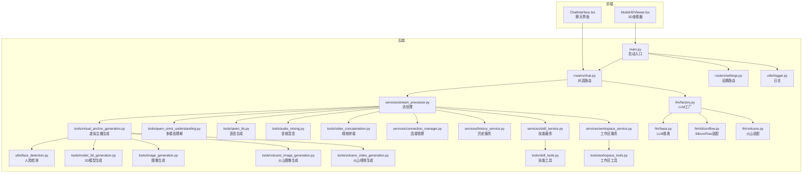
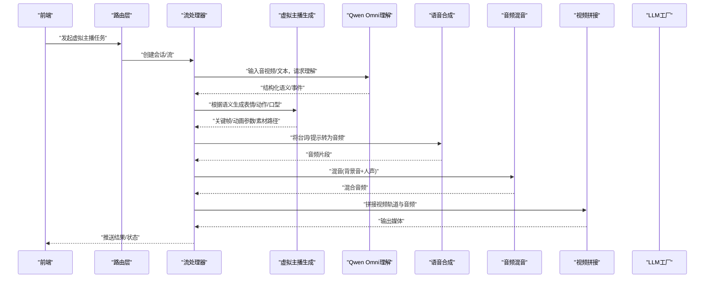
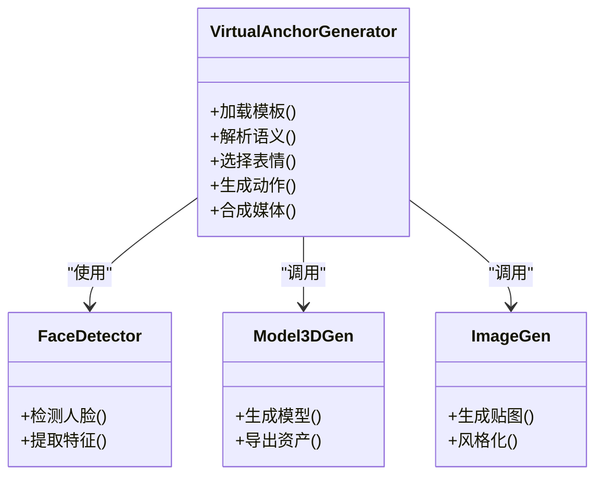
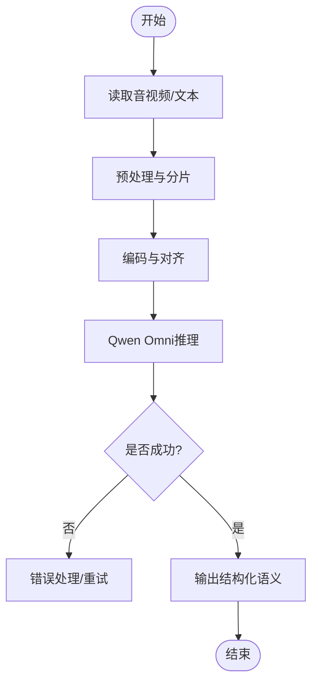
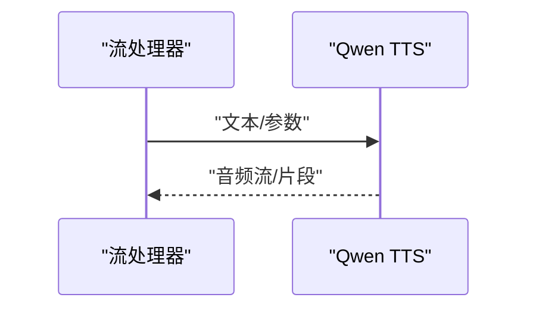
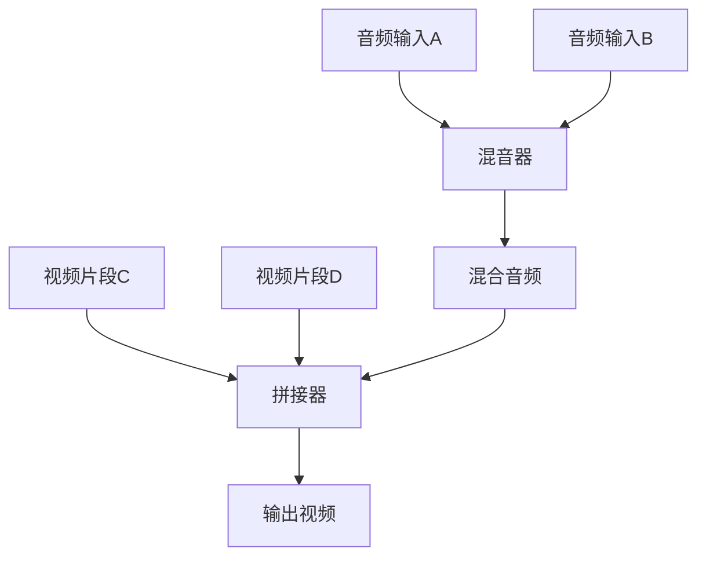
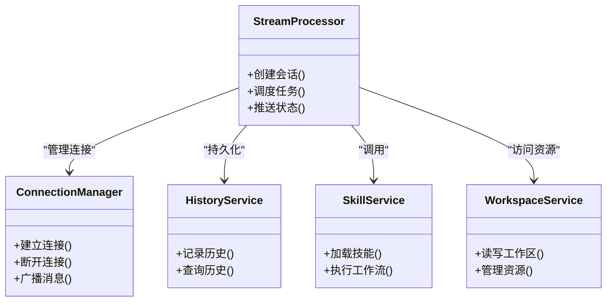
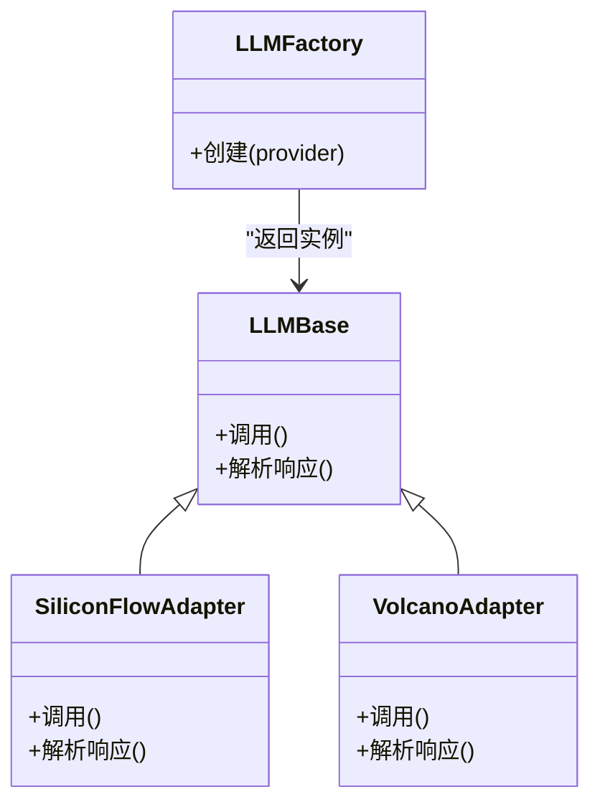
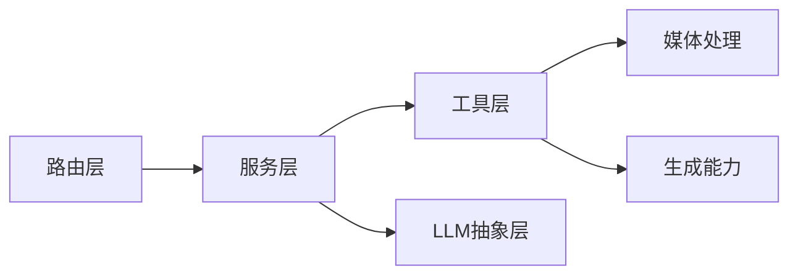

# 虚拟主播工具

<cite>
**本文引用的文件**   
- [backend/app/main.py](file://backend/app/main.py)
- [backend/app/tools/virtual_anchor_generation.py](file://backend/app/tools/virtual_anchor_generation.py)
- [backend/app/tools/qwen_omni_understanding.py](file://backend/app/tools/qwen_omni_understanding.py)
- [backend/app/tools/qwen_tts.py](file://backend/app/tools/qwen_tts.py)
- [backend/app/tools/audio_mixing.py](file://backend/app/tools/audio_mixing.py)
- [backend/app/tools/video_concatenation.py](file://backend/app/tools/video_concatenation.py)
- [backend/app/utils/face_detection.py](file://backend/app/utils/face_detection.py)
- [backend/app/services/stream_processor.py](file://backend/app/services/stream_processor.py)
- [backend/app/routers/chat.py](file://backend/app/routers/chat.py)
- [backend/app/routers/settings.py](file://backend/app/routers/settings.py)
- [backend/app/services/connection_manager.py](file://backend/app/services/connection_manager.py)
- [backend/app/services/history_service.py](file://backend/app/services/history_service.py)
- [backend/app/services/skill_service.py](file://backend/app/services/skill_service.py)
- [backend/app/services/workspace_service.py](file://backend/app/services/workspace_service.py)
- [backend/app/llm/factory.py](file://backend/app/llm/factory.py)
- [backend/app/llm/base.py](file://backend/app/llm/base.py)
- [backend/app/llm/siliconflow.py](file://backend/app/llm/siliconflow.py)
- [backend/app/llm/volcano.py](file://backend/app/llm/volcano.py)
- [backend/app/tools/image_generation.py](file://backend/app/tools/image_generation.py)
- [backend/app/tools/model_3d_generation.py](file://backend/app/tools/model_3d_generation.py)
- [backend/app/tools/volcano_image_generation.py](file://backend/app/tools/volcano_image_generation.py)
- [backend/app/tools/volcano_video_generation.py](file://backend/app/tools/volcano_video_generation.py)
- [backend/app/tools/skill_tools.py](file://backend/app/tools/skill_tools.py)
- [backend/app/tools/workspace_tools.py](file://backend/app/tools/workspace_tools.py)
- [backend/app/utils/logger.py](file://backend/app/utils/logger.py)
- [backend/start.sh](file://backend/start.sh)
- [backend/env.example](file://backend/env.example)
- [frontend/src/components/Model3DViewer.tsx](file://frontend/src/components/Model3DViewer.tsx)
- [frontend/src/components/ChatInterface.tsx](file://frontend/src/components/ChatInterface.tsx)
</cite>

## 目录
1. [简介](#简介)
2. [项目结构](#项目结构)
3. [核心组件](#核心组件)
4. [架构总览](#架构总览)
5. [详细组件分析](#详细组件分析)
6. [依赖关系分析](#依赖关系分析)
7. [性能考虑](#性能考虑)
8. [故障排查指南](#故障排查指南)
9. [结论](#结论)
10. [附录](#附录)

## 简介
本技术文档面向“虚拟主播工具”的开发者与集成者，系统阐述数字人创建、表情驱动、动作同步以及多模态理解（Qwen Omni）等能力。文档覆盖：
- 虚拟主播API的参数配置、角色定制、行为控制
- 多模态数据处理流程、实时渲染管线、音视频同步机制
- 模板、表情库、动作库的使用指南
- 直播场景集成、互动功能开发、性能优化策略
- 应用方案：虚拟主播应用、智能客服、教育娱乐

## 项目结构
后端采用模块化设计，围绕“工具层 + 服务层 + 路由层 + LLM抽象层”组织；前端提供3D模型查看与聊天界面，便于演示与交互。

图表来源
- [backend/app/main.py](file://backend/app/main.py)
- [backend/app/routers/chat.py](file://backend/app/routers/chat.py)
- [backend/app/routers/settings.py](file://backend/app/routers/settings.py)
- [backend/app/services/stream_processor.py](file://backend/app/services/stream_processor.py)
- [backend/app/tools/virtual_anchor_generation.py](file://backend/app/tools/virtual_anchor_generation.py)
- [backend/app/tools/qwen_omni_understanding.py](file://backend/app/tools/qwen_omni_understanding.py)
- [backend/app/tools/qwen_tts.py](file://backend/app/tools/qwen_tts.py)
- [backend/app/tools/audio_mixing.py](file://backend/app/tools/audio_mixing.py)
- [backend/app/tools/video_concatenation.py](file://backend/app/tools/video_concatenation.py)
- [backend/app/utils/face_detection.py](file://backend/app/utils/face_detection.py)
- [backend/app/tools/model_3d_generation.py](file://backend/app/tools/model_3d_generation.py)
- [backend/app/tools/image_generation.py](file://backend/app/tools/image_generation.py)
- [backend/app/tools/volcano_image_generation.py](file://backend/app/tools/volcano_image_generation.py)
- [backend/app/tools/volcano_video_generation.py](file://backend/app/tools/volcano_video_generation.py)
- [backend/app/services/connection_manager.py](file://backend/app/services/connection_manager.py)
- [backend/app/services/history_service.py](file://backend/app/services/history_service.py)
- [backend/app/services/skill_service.py](file://backend/app/services/skill_service.py)
- [backend/app/services/workspace_service.py](file://backend/app/services/workspace_service.py)
- [backend/app/tools/skill_tools.py](file://backend/app/tools/skill_tools.py)
- [backend/app/tools/workspace_tools.py](file://backend/app/tools/workspace_tools.py)
- [backend/app/llm/factory.py](file://backend/app/llm/factory.py)
- [backend/app/llm/base.py](file://backend/app/llm/base.py)
- [backend/app/llm/siliconflow.py](file://backend/app/llm/siliconflow.py)
- [backend/app/llm/volcano.py](file://backend/app/llm/volcano.py)
- [backend/app/utils/logger.py](file://backend/app/utils/logger.py)
- [frontend/src/components/Model3DViewer.tsx](file://frontend/src/components/Model3DViewer.tsx)
- [frontend/src/components/ChatInterface.tsx](file://frontend/src/components/ChatInterface.tsx)

章节来源
- [backend/app/main.py](file://backend/app/main.py)
- [backend/start.sh](file://backend/start.sh)
- [backend/env.example](file://backend/env.example)

## 核心组件
- 虚拟主播生成：负责数字人形象构建、表情驱动、动作同步与输出媒体编排
- 多模态理解：基于Qwen Omni进行音视频内容解析与结构化信息抽取
- 语音合成：将文本或结构化指令转换为可播放音频片段
- 媒体处理：音频混音、视频拼接、3D模型与图像生成
- 流式处理与服务：WebSocket/HTTP流式响应、连接管理、历史记录、技能与工作区编排
- LLM抽象：统一接入不同大模型供应商

章节来源
- [backend/app/tools/virtual_anchor_generation.py](file://backend/app/tools/virtual_anchor_generation.py)
- [backend/app/tools/qwen_omni_understanding.py](file://backend/app/tools/qwen_omni_understanding.py)
- [backend/app/tools/qwen_tts.py](file://backend/app/tools/qwen_tts.py)
- [backend/app/tools/audio_mixing.py](file://backend/app/tools/audio_mixing.py)
- [backend/app/tools/video_concatenation.py](file://backend/app/tools/video_concatenation.py)
- [backend/app/services/stream_processor.py](file://backend/app/services/stream_processor.py)
- [backend/app/llm/factory.py](file://backend/app/llm/factory.py)

## 架构总览
整体采用“前端展示 + 后端编排 + 外部模型/媒体服务”的分层架构。前端通过聊天与3D查看器与后端交互；后端以路由为入口，调用服务层进行任务编排，再调度工具层完成具体生成与处理；LLM层提供统一接口对接多家厂商。

图表来源
- [backend/app/routers/chat.py](file://backend/app/routers/chat.py)
- [backend/app/services/stream_processor.py](file://backend/app/services/stream_processor.py)
- [backend/app/tools/virtual_anchor_generation.py](file://backend/app/tools/virtual_anchor_generation.py)
- [backend/app/tools/qwen_omni_understanding.py](file://backend/app/tools/qwen_omni_understanding.py)
- [backend/app/tools/qwen_tts.py](file://backend/app/tools/qwen_tts.py)
- [backend/app/tools/audio_mixing.py](file://backend/app/tools/audio_mixing.py)
- [backend/app/tools/video_concatenation.py](file://backend/app/tools/video_concatenation.py)
- [backend/app/llm/factory.py](file://backend/app/llm/factory.py)

## 详细组件分析

### 虚拟主播生成模块
职责：
- 接收来自理解层的语义与事件，映射到表情、口型、肢体动作
- 组合数字人模板、表情库、动作库，生成关键帧或动画序列
- 与3D模型/图像生成协同，产出最终媒体资源

图表来源
- [backend/app/tools/virtual_anchor_generation.py](file://backend/app/tools/virtual_anchor_generation.py)
- [backend/app/utils/face_detection.py](file://backend/app/utils/face_detection.py)
- [backend/app/tools/model_3d_generation.py](file://backend/app/tools/model_3d_generation.py)
- [backend/app/tools/image_generation.py](file://backend/app/tools/image_generation.py)

章节来源
- [backend/app/tools/virtual_anchor_generation.py](file://backend/app/tools/virtual_anchor_generation.py)
- [backend/app/utils/face_detection.py](file://backend/app/utils/face_detection.py)
- [backend/app/tools/model_3d_generation.py](file://backend/app/tools/model_3d_generation.py)
- [backend/app/tools/image_generation.py](file://backend/app/tools/image_generation.py)

### 多模态理解（Qwen Omni）
职责：
- 对输入的音视频/图文进行理解，输出结构化语义、时间戳、实体与事件
- 作为下游表情/动作生成的依据

图表来源
- [backend/app/tools/qwen_omni_understanding.py](file://backend/app/tools/qwen_omni_understanding.py)

章节来源
- [backend/app/tools/qwen_omni_understanding.py](file://backend/app/tools/qwen_omni_understanding.py)

### 语音合成（TTS）
职责：
- 将台词或结构化指令转换为音频片段
- 支持音色、语速、情感等参数调节

图表来源
- [backend/app/tools/qwen_tts.py](file://backend/app/tools/qwen_tts.py)

章节来源
- [backend/app/tools/qwen_tts.py](file://backend/app/tools/qwen_tts.py)

### 媒体处理（音频混音与视频拼接）
职责：
- 音频混音：将人声、背景音乐、音效按权重与时序混合
- 视频拼接：将画面、字幕、特效与音频轨道合并输出

图表来源
- [backend/app/tools/audio_mixing.py](file://backend/app/tools/audio_mixing.py)
- [backend/app/tools/video_concatenation.py](file://backend/app/tools/video_concatenation.py)

章节来源
- [backend/app/tools/audio_mixing.py](file://backend/app/tools/audio_mixing.py)
- [backend/app/tools/video_concatenation.py](file://backend/app/tools/video_concatenation.py)

### 流式处理与服务编排
职责：
- 维护会话与连接，协调各工具链执行顺序
- 管理历史、技能与工作区上下文，支撑个性化与可复用流程

图表来源
- [backend/app/services/stream_processor.py](file://backend/app/services/stream_processor.py)
- [backend/app/services/connection_manager.py](file://backend/app/services/connection_manager.py)
- [backend/app/services/history_service.py](file://backend/app/services/history_service.py)
- [backend/app/services/skill_service.py](file://backend/app/services/skill_service.py)
- [backend/app/services/workspace_service.py](file://backend/app/services/workspace_service.py)

章节来源
- [backend/app/services/stream_processor.py](file://backend/app/services/stream_processor.py)
- [backend/app/services/connection_manager.py](file://backend/app/services/connection_manager.py)
- [backend/app/services/history_service.py](file://backend/app/services/history_service.py)
- [backend/app/services/skill_service.py](file://backend/app/services/skill_service.py)
- [backend/app/services/workspace_service.py](file://backend/app/services/workspace_service.py)

### LLM抽象与工厂
职责：
- 定义统一的LLM接口
- 通过工厂方法动态选择具体实现（如SiliconFlow、火山）

图表来源
- [backend/app/llm/base.py](file://backend/app/llm/base.py)
- [backend/app/llm/siliconflow.py](file://backend/app/llm/siliconflow.py)
- [backend/app/llm/volcano.py](file://backend/app/llm/volcano.py)
- [backend/app/llm/factory.py](file://backend/app/llm/factory.py)

章节来源
- [backend/app/llm/base.py](file://backend/app/llm/base.py)
- [backend/app/llm/siliconflow.py](file://backend/app/llm/siliconflow.py)
- [backend/app/llm/volcano.py](file://backend/app/llm/volcano.py)
- [backend/app/llm/factory.py](file://backend/app/llm/factory.py)

### 前端展示与交互
- 3D模型查看器：用于预览数字人模型与材质
- 聊天界面：与后端对话路由交互，触发虚拟主播任务

章节来源
- [frontend/src/components/Model3DViewer.tsx](file://frontend/src/components/Model3DViewer.tsx)
- [frontend/src/components/ChatInterface.tsx](file://frontend/src/components/ChatInterface.tsx)

## 依赖关系分析
- 路由层依赖服务层，服务层依赖工具层与LLM抽象层
- 工具层之间通过数据契约协作（语义、音频、视频、3D资产）
- 前端仅依赖后端HTTP/WebSocket接口，不直接耦合内部实现

图表来源
- [backend/app/routers/chat.py](file://backend/app/routers/chat.py)
- [backend/app/services/stream_processor.py](file://backend/app/services/stream_processor.py)
- [backend/app/tools/virtual_anchor_generation.py](file://backend/app/tools/virtual_anchor_generation.py)
- [backend/app/llm/factory.py](file://backend/app/llm/factory.py)

章节来源
- [backend/app/routers/chat.py](file://backend/app/routers/chat.py)
- [backend/app/services/stream_processor.py](file://backend/app/services/stream_processor.py)
- [backend/app/tools/virtual_anchor_generation.py](file://backend/app/tools/virtual_anchor_generation.py)
- [backend/app/llm/factory.py](file://backend/app/llm/factory.py)

## 性能考虑
- 并发与异步：在流处理与I/O密集环节使用异步与连接池，减少阻塞
- 批处理与缓存：对重复的模板、贴图、动作片段进行缓存，降低重复计算
- 流水线并行：理解、TTS、媒体处理尽量并行执行，缩短端到端时延
- 资源限制：对GPU/CPU与内存使用进行配额与监控，避免OOM
- 网络优化：压缩传输、增量推送、断点续传
- 降级与熔断：外部模型或服务不可用时快速降级，保障可用性

[本节为通用指导，无需源码引用]

## 故障排查指南
- 日志定位：检查后端日志输出，确认错误堆栈与上下文
- 连接问题：核对WebSocket/HTTP连接状态与心跳
- 模型调用失败：校验密钥、配额、超时与重试策略
- 媒体异常：检查音频采样率、视频编码格式与容器兼容性
- 资源不足：监控CPU/GPU/内存/磁盘，必要时扩容或限流

章节来源
- [backend/app/utils/logger.py](file://backend/app/utils/logger.py)
- [backend/app/services/connection_manager.py](file://backend/app/services/connection_manager.py)

## 结论
本工具以“理解-生成-编排-渲染”为主线，结合Qwen Omni多模态理解与虚拟主播生成链路，形成从语义到媒体的完整闭环。通过模块化设计与LLM抽象，系统具备良好的扩展性与可移植性，适用于直播、客服、教育娱乐等多场景落地。

[本节为总结，无需源码引用]

## 附录

### 虚拟主播API参考（概念说明）
- 角色定制
  - 外观：模板ID、材质、贴图、骨骼绑定
  - 声音：音色、语速、情感标签
  - 行为：动作库ID、表情库ID、规则映射
- 行为控制
  - 触发条件：时间轴、事件、用户指令
  - 优先级：冲突消解策略
  - 反馈：进度、状态码、错误码
- 参数配置
  - 输入：音视频URL/字节、文本、元数据
  - 输出：媒体文件/流、结构化结果
  - 选项：分辨率、码率、延迟预算

[本节为概念说明，无需源码引用]

### 模板、表情库、动作库使用指南
- 模板：包含基础模型、材质、骨骼与默认动作集
- 表情库：按情绪/口型分类的关键帧或参数表
- 动作库：按语义/时间标注的动作片段
- 推荐实践：版本化管理、命名规范、索引与检索、质量校验

[本节为概念说明，无需源码引用]

### 直播场景集成与互动开发
- 采集：摄像头/麦克风推流至后端
- 理解：实时转写与事件抽取
- 生成：低延迟TTS与表情/动作驱动
- 渲染：边缘侧或云端合成并回推CDN
- 互动：弹幕/评论驱动的行为切换与话术生成

[本节为概念说明，无需源码引用]

### 实际应用场景方案
- 虚拟主播应用：品牌播报、节目主持、活动开场
- 智能客服：多语言、多模态问答与可视化引导
- 教育娱乐：知识讲解、故事演绎、互动课堂

[本节为概念说明，无需源码引用]