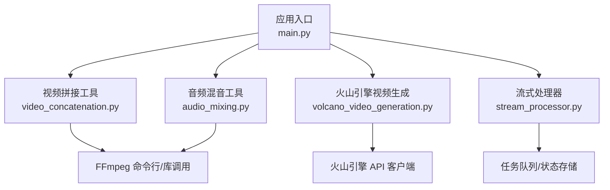
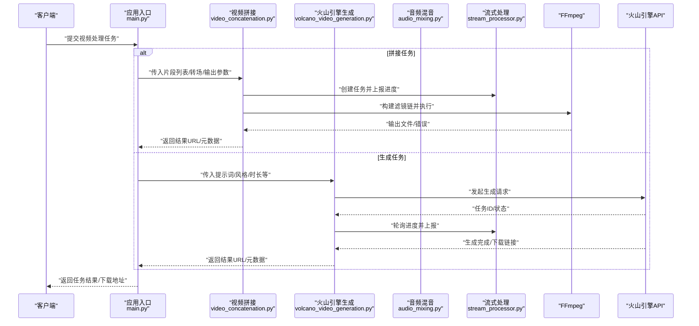
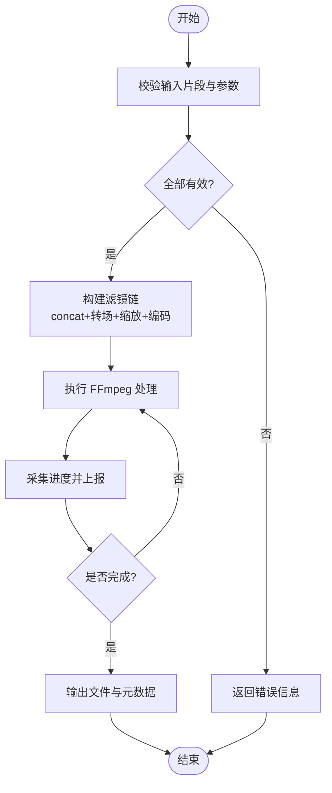
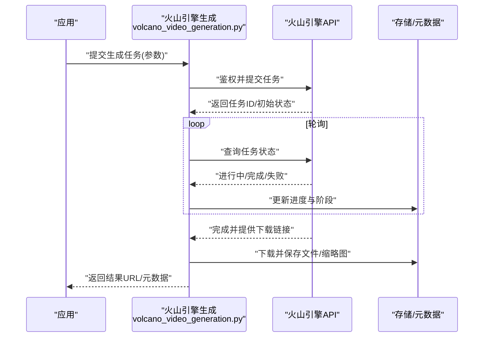
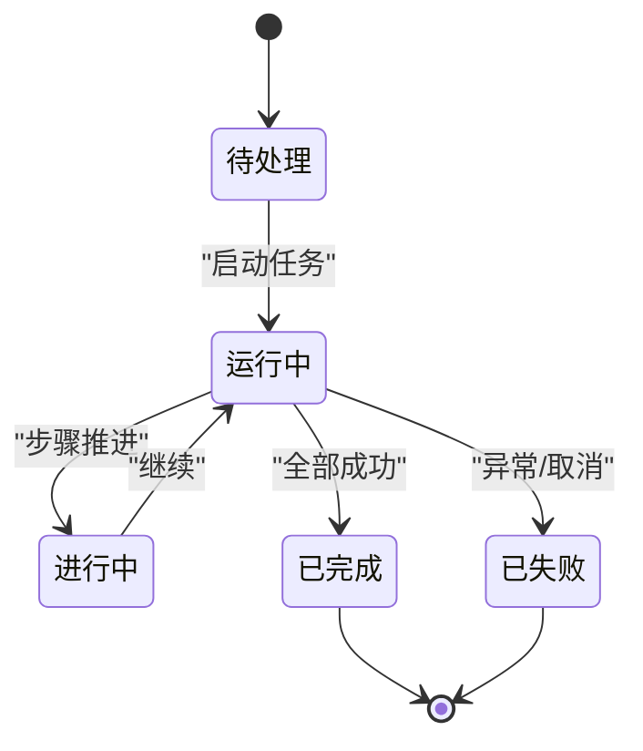
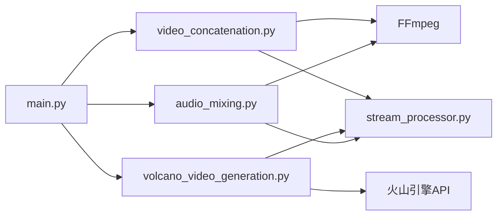

# 视频处理工具

<cite>
**本文引用的文件**   
- [backend/app/tools/video_concatenation.py](file://backend/app/tools/video_concatenation.py)
- [backend/app/tools/volcano_video_generation.py](file://backend/app/tools/volcano_video_generation.py)
- [backend/app/tools/audio_mixing.py](file://backend/app/tools/audio_mixing.py)
- [backend/app/services/stream_processor.py](file://backend/app/services/stream_processor.py)
- [backend/app/main.py](file://backend/app/main.py)
- [backend/requirements.txt](file://backend/requirements.txt)
</cite>

## 目录
1. [简介](#简介)
2. [项目结构](#项目结构)
3. [核心组件](#核心组件)
4. [架构总览](#架构总览)
5. [详细组件分析](#详细组件分析)
6. [依赖分析](#依赖分析)
7. [性能考虑](#性能考虑)
8. [故障排查指南](#故障排查指南)
9. [结论](#结论)
10. [附录](#附录)

## 简介
本技术文档围绕仓库中的视频处理能力，系统性阐述以下主题：
- 视频拼接功能：多片段合并、转场效果与格式转换
- 火山引擎视频生成服务：参数配置、编码格式与压缩选项
- 视频处理流水线：异步处理机制与进度跟踪
- 支持的媒体格式、编解码器与分辨率规格
- 视频编辑工作流与批量处理方案
- 资源优化策略与最佳实践
- 实际应用场景：视频创作自动化、内容聚合等

## 项目结构
后端采用模块化设计，视频相关能力集中在 tools 与 services 层：
- tools 层提供具体能力实现（如视频拼接、音频混音、火山引擎视频生成）
- services 层提供通用服务（如流式处理、任务编排）
- main.py 作为应用入口，负责路由注册与服务启动

图表来源
- [backend/app/main.py](file://backend/app/main.py)
- [backend/app/tools/video_concatenation.py](file://backend/app/tools/video_concatenation.py)
- [backend/app/tools/volcano_video_generation.py](file://backend/app/tools/volcano_video_generation.py)
- [backend/app/tools/audio_mixing.py](file://backend/app/tools/audio_mixing.py)
- [backend/app/services/stream_processor.py](file://backend/app/services/stream_processor.py)

章节来源
- [backend/app/main.py](file://backend/app/main.py)
- [backend/app/tools/video_concatenation.py](file://backend/app/tools/video_concatenation.py)
- [backend/app/tools/volcano_video_generation.py](file://backend/app/tools/volcano_video_generation.py)
- [backend/app/tools/audio_mixing.py](file://backend/app/tools/audio_mixing.py)
- [backend/app/services/stream_processor.py](file://backend/app/services/stream_processor.py)

## 核心组件
- 视频拼接工具
  - 职责：读取多个输入片段，按顺序拼接，支持转场与输出格式/分辨率/码率控制
  - 关键流程：输入校验 → 滤镜链构建 → 执行 FFmpeg → 输出结果与元数据
- 火山引擎视频生成
  - 职责：调用火山引擎视频生成 API，根据提示词或素材生成视频
  - 关键流程：参数组装 → 鉴权与请求 → 轮询/回调获取结果 → 落盘与返回
- 音频混音工具
  - 职责：将多条音轨混合、音量归一化、淡入淡出、静音段裁剪
  - 关键流程：音轨解析 → 重采样/对齐 → 混音与导出
- 流式处理器
  - 职责：为长耗时任务提供进度上报、断点续传、错误重试与取消
  - 关键流程：任务创建 → 分片处理 → 进度更新 → 完成/失败回调

章节来源
- [backend/app/tools/video_concatenation.py](file://backend/app/tools/video_concatenation.py)
- [backend/app/tools/volcano_video_generation.py](file://backend/app/tools/volcano_video_generation.py)
- [backend/app/tools/audio_mixing.py](file://backend/app/tools/audio_mixing.py)
- [backend/app/services/stream_processor.py](file://backend/app/services/stream_processor.py)

## 架构总览
系统以“工具 + 服务”的解耦方式组织。上层通过统一接口发起视频处理任务，底层由 FFmpeg 与火山引擎 API 承担计算与生成。

图表来源
- [backend/app/main.py](file://backend/app/main.py)
- [backend/app/tools/video_concatenation.py](file://backend/app/tools/video_concatenation.py)
- [backend/app/tools/volcano_video_generation.py](file://backend/app/tools/volcano_video_generation.py)
- [backend/app/tools/audio_mixing.py](file://backend/app/tools/audio_mixing.py)
- [backend/app/services/stream_processor.py](file://backend/app/services/stream_processor.py)

## 详细组件分析

### 视频拼接工具（多片段合并、转场、格式转换）
- 功能要点
  - 多片段合并：支持任意数量输入，自动检测时长与轨道布局
  - 转场效果：在片段间插入过渡（如淡入淡出、滑动、擦除等），可配置持续时间
  - 格式转换：统一输出容器与编码（如 MP4/H.264、H.265、WebM/Vp9），支持分辨率缩放与码率控制
- 处理流程
  - 输入校验：检查路径/URL、存在性、可读性与基本属性
  - 滤镜链构建：串联 concat、转场滤镜、缩放与编码参数
  - 执行与监控：调用 FFmpeg 执行，实时采集日志并映射为进度
  - 结果输出：写入目标路径，返回文件信息与质量指标
- 关键参数（示例字段，具体以实现为准）
  - inputs: 输入片段列表（本地路径或远程 URL）
  - transitions: 转场配置（类型、时长、方向）
  - output: 输出格式、分辨率、码率、帧率、音频参数
  - progress_callback: 进度回调函数
- 复杂度与性能
  - 时间复杂度近似 O(N)（N 为片段数），主要受 I/O 与编码影响
  - 建议并行预处理（如缩略图生成、元数据提取），串行执行 FFmpeg 以保证稳定性
- 错误处理
  - 输入不可用/损坏：快速失败并返回明确错误码
  - 转场不兼容：回退到直切或跳过该转场
  - 编码失败：记录 FFmpeg 日志，提供重试与降级策略

图表来源
- [backend/app/tools/video_concatenation.py](file://backend/app/tools/video_concatenation.py)
- [backend/app/services/stream_processor.py](file://backend/app/services/stream_processor.py)

章节来源
- [backend/app/tools/video_concatenation.py](file://backend/app/tools/video_concatenation.py)
- [backend/app/services/stream_processor.py](file://backend/app/services/stream_processor.py)

### 火山引擎视频生成服务
- 功能要点
  - 基于提示词/参考素材生成视频，支持风格、时长、分辨率、帧率等配置
  - 异步任务模型：提交任务后轮询或回调获取结果
  - 结果管理：下载、缓存与元数据持久化
- 处理流程
  - 参数组装：校验必填项、补齐默认值、签名与鉴权
  - 任务提交：调用火山引擎 API，获取任务 ID
  - 进度轮询：定时查询任务状态，更新进度与阶段
  - 结果落地：下载视频文件，生成预览与缩略图，返回访问地址
- 关键参数（示例字段，具体以实现为准）
  - prompt: 文本描述
  - style: 风格模板
  - duration: 目标时长
  - resolution: 分辨率（如 1080p/720p）
  - fps: 帧率
  - codec: 编码（H.264/H.265）
  - callback_url: 回调地址（可选）
- 错误处理
  - 鉴权失败：重试与告警
  - 任务超时：指数退避重试
  - 生成失败：回退到备用模板或返回中间产物

图表来源
- [backend/app/tools/volcano_video_generation.py](file://backend/app/tools/volcano_video_generation.py)

章节来源
- [backend/app/tools/volcano_video_generation.py](file://backend/app/tools/volcano_video_generation.py)

### 音频混音工具
- 功能要点
  - 多轨混音：叠加背景音乐、旁白、音效
  - 音频标准化：响度归一化、动态范围控制
  - 转场与裁剪：淡入淡出、静音段去除、对齐到视频时长
- 处理流程
  - 解析输入：识别采样率、声道数、时长
  - 重采样与对齐：统一到目标采样率与时基
  - 混音与导出：应用增益、均衡、限幅，输出 AAC/MP3 等
- 关键参数（示例字段，具体以实现为准）
  - tracks: 音轨列表（路径/URL、权重、起止时间）
  - normalize: 响度目标（LUFS）
  - fade_in/out: 淡入淡出时长
  - output: 编码、比特率、声道布局

章节来源
- [backend/app/tools/audio_mixing.py](file://backend/app/tools/audio_mixing.py)

### 流式处理器（异步处理与进度跟踪）
- 功能要点
  - 任务生命周期管理：创建、运行、暂停、恢复、取消
  - 进度上报：百分比、阶段、错误信息
  - 容错与重试：网络抖动、临时失败自动重试
- 处理流程
  - 初始化：分配任务上下文、注册回调
  - 分片执行：按步骤推进，每步更新进度
  - 完成/失败：清理资源、持久化结果或错误日志

图表来源
- [backend/app/services/stream_processor.py](file://backend/app/services/stream_processor.py)

章节来源
- [backend/app/services/stream_processor.py](file://backend/app/services/stream_processor.py)

## 依赖分析
- 外部依赖
  - FFmpeg：用于音视频编解码、滤镜链执行
  - 火山引擎 SDK/HTTP 客户端：用于视频生成 API 调用
  - 任务队列/存储：用于进度与结果持久化（若使用）
- 内部耦合
  - main.py 作为路由与调度中心，低耦合地组合各工具
  - stream_processor 被多个工具复用，提升一致性与可观测性

图表来源
- [backend/app/main.py](file://backend/app/main.py)
- [backend/app/tools/video_concatenation.py](file://backend/app/tools/video_concatenation.py)
- [backend/app/tools/volcano_video_generation.py](file://backend/app/tools/volcano_video_generation.py)
- [backend/app/tools/audio_mixing.py](file://backend/app/tools/audio_mixing.py)
- [backend/app/services/stream_processor.py](file://backend/app/services/stream_processor.py)

章节来源
- [backend/app/main.py](file://backend/app/main.py)
- [backend/requirements.txt](file://backend/requirements.txt)

## 性能考虑
- 并行与并发
  - 预处理（缩略图、元数据）可并行；FFmpeg 执行建议串行以避免锁竞争
  - 大文件处理采用分块与流式读写，降低内存峰值
- 编码与压缩
  - 合理设置码率与分辨率，平衡画质与体积
  - 使用硬件加速（若可用）提升编码吞吐
- 缓存与复用
  - 对重复片段进行指纹去重，避免重复处理
  - 缓存常用转场与滤镜预设，减少构建开销
- 资源回收
  - 及时释放临时文件与进程句柄
  - 限制并发任务数，防止系统过载

[本节为通用指导，无需代码来源]

## 故障排查指南
- 常见问题定位
  - 输入无效：检查路径/URL可达性与权限
  - 转场失败：确认滤镜链语法与兼容性，必要时回退
  - 生成超时：调整轮询间隔与最大重试次数
- 日志与追踪
  - 记录 FFmpeg 标准输出/错误，便于复现
  - 为每个任务生成唯一 ID，贯穿进度与日志
- 恢复策略
  - 断点续传：记录已完成的步骤，从断点继续
  - 降级模式：当高级转场失败时，自动切换为直切

章节来源
- [backend/app/services/stream_processor.py](file://backend/app/services/stream_processor.py)
- [backend/app/tools/video_concatenation.py](file://backend/app/tools/video_concatenation.py)
- [backend/app/tools/volcano_video_generation.py](file://backend/app/tools/volcano_video_generation.py)

## 结论
本项目以“工具 + 服务”的清晰分层实现了视频拼接与火山引擎视频生成两大核心能力，并通过流式处理器提供一致的异步与进度体验。结合合理的编码策略与资源管理，可在保证画质的同时提升吞吐与稳定性。建议在后续迭代中完善参数校验、错误分类与可观测性指标，进一步提升系统的健壮性与可维护性。

[本节为总结，无需代码来源]

## 附录

### 支持的媒体格式、编解码器与分辨率规格（建议）
- 容器与格式
  - 输入：MP4、MOV、AVI、MKV、WebM、FLV 等
  - 输出：MP4（推荐）、WebM、MOV
- 视频编解码器
  - H.264（广泛兼容）、H.265（高压缩比）、VP9（Web 友好）
- 音频编解码器
  - AAC、MP3、Opus
- 分辨率与帧率
  - 分辨率：720p、1080p、2K、4K（视源素材与算力而定）
  - 帧率：24/30/60 fps（保持与源一致或按需转换）
- 码率建议
  - 1080p：4–8 Mbps（H.264），2–4 Mbps（H.265）
  - 720p：2–4 Mbps（H.264），1–2 Mbps（H.265）

[本节为通用规范，无需代码来源]

### 视频处理流水线与批量处理方案
- 流水线步骤
  - 准备：校验与清洗输入、生成索引与元数据
  - 处理：拼接/转场/编码/混音/水印/字幕
  - 质检：抽样检测、关键帧提取、封面生成
  - 发布：上传至 CDN/对象存储，生成分享链接
- 批量处理
  - 任务拆分：按批次大小与优先级调度
  - 幂等设计：相同输入产生相同输出，支持重试
  - 资源隔离：按租户/项目划分临时目录与命名空间

[本节为通用方案，无需代码来源]

### 实际应用场景
- 视频创作自动化
  - 输入脚本/故事板 → 自动生成片段清单 → 拼接与转场 → 合成音频与字幕 → 输出成片
- 内容聚合
  - 抓取多源短视频 → 去重与筛选 → 统一编码与分辨率 → 打包为合集
- 直播回放剪辑
  - 拉流录制 → 切片归档 → 智能摘要与高光片段提取 → 二次分发

[本节为场景说明，无需代码来源]