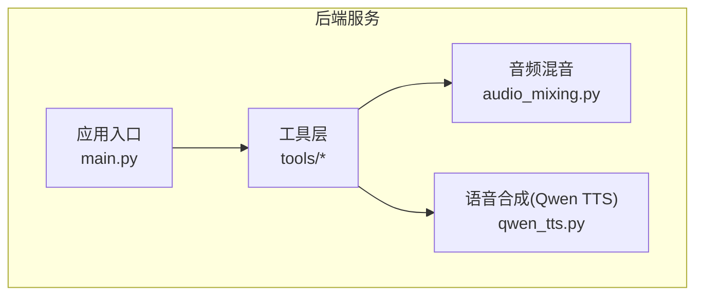
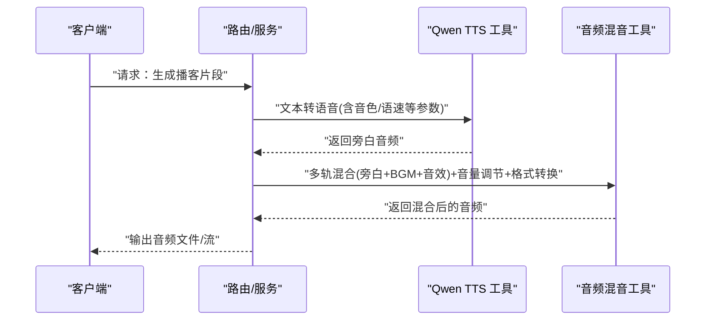
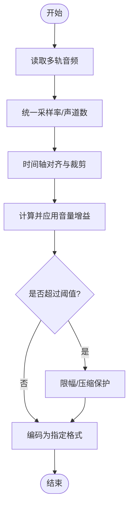
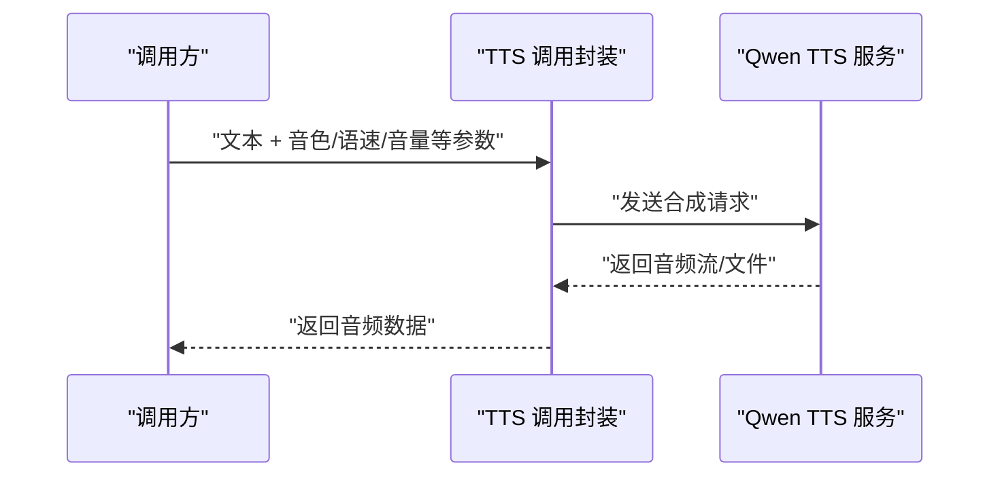
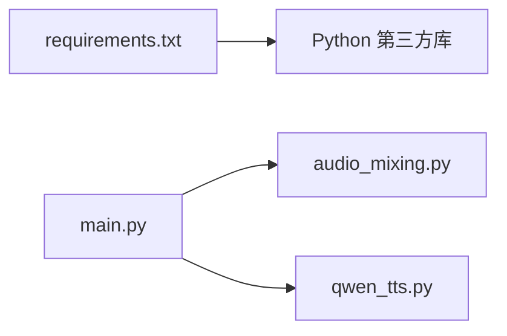

# 音频处理工具

<cite>
**本文引用的文件**   
- [backend/app/tools/audio_mixing.py](file://backend/app/tools/audio_mixing.py)
- [backend/app/tools/qwen_tts.py](file://backend/app/tools/qwen_tts.py)
- [backend/app/main.py](file://backend/app/main.py)
- [backend/requirements.txt](file://backend/requirements.txt)
</cite>

## 目录
1. [简介](#简介)
2. [项目结构](#项目结构)
3. [核心组件](#核心组件)
4. [架构总览](#架构总览)
5. [详细组件分析](#详细组件分析)
6. [依赖分析](#依赖分析)
7. [性能考虑](#性能考虑)
8. [故障排查指南](#故障排查指南)
9. [结论](#结论)
10. [附录](#附录)

## 简介
本技术文档聚焦于后端音频处理工具，覆盖以下能力：
- 音频混音：多轨道混合、音量调节、格式转换
- 语音合成：Qwen TTS 集成、文本转语音、音色控制
- API 接口与参数配置：输入输出格式说明
- 处理流程：批处理与实时流式处理的实现思路
- 内存管理策略：大文件与长音频的优化建议
- 音频格式支持列表、质量优化设置、错误处理机制
- 实际使用案例：播客制作、语音助手开发等场景的端到端流程

## 项目结构
本项目在后端模块中提供两类关键工具：
- 音频混音工具：位于 tools 目录下，负责多轨音频混合、音量调整与格式转换
- 语音合成工具：位于 tools 目录下，封装 Qwen TTS 调用，提供文本到语音的合成能力

图表来源
- [backend/app/main.py](file://backend/app/main.py)
- [backend/app/tools/audio_mixing.py](file://backend/app/tools/audio_mixing.py)
- [backend/app/tools/qwen_tts.py](file://backend/app/tools/qwen_tts.py)

章节来源
- [backend/app/main.py](file://backend/app/main.py)
- [backend/app/tools/audio_mixing.py](file://backend/app/tools/audio_mixing.py)
- [backend/app/tools/qwen_tts.py](file://backend/app/tools/qwen_tts.py)

## 核心组件
本节概述两个核心工具的职责与边界：
- 音频混音（audio_mixing.py）
  - 多轨道混合：将多个音频轨道按时间轴对齐并叠加
  - 音量调节：对单轨或整体输出进行增益控制
  - 格式转换：在保持采样率与位深的前提下完成容器/编码转换
- 语音合成（qwen_tts.py）
  - Qwen TTS 集成：通过 HTTP 或 SDK 方式调用远程 TTS 服务
  - 文本转语音：将自然语言文本转换为可播放音频
  - 音色控制：通过参数选择不同说话人风格或情感

章节来源
- [backend/app/tools/audio_mixing.py](file://backend/app/tools/audio_mixing.py)
- [backend/app/tools/qwen_tts.py](file://backend/app/tools/qwen_tts.py)

## 架构总览
从系统视角看，音频处理工具作为“工具层”被上层路由或服务调用。典型交互如下：
- 客户端发起请求（如生成一段带背景乐的播客片段）
- 路由或服务编排调用语音合成功能生成旁白
- 再调用混音功能将旁白与背景音乐、音效等多轨合并
- 最终返回目标格式的音频文件或流

图表来源
- [backend/app/tools/qwen_tts.py](file://backend/app/tools/qwen_tts.py)
- [backend/app/tools/audio_mixing.py](file://backend/app/tools/audio_mixing.py)

## 详细组件分析

### 音频混音工具（audio_mixing.py）
该模块提供多轨音频混合、音量调节与格式转换能力。典型处理流程包括：
- 读取多轨音频（支持常见无损/有损格式）
- 统一采样率与声道数（必要时重采样/上/下混）
- 按时间轴对齐与裁剪，计算每轨增益
- 逐帧叠加并限制峰值，避免削波
- 编码输出为目标格式（如 WAV/MP3/FLAC）

图表来源
- [backend/app/tools/audio_mixing.py](file://backend/app/tools/audio_mixing.py)

章节来源
- [backend/app/tools/audio_mixing.py](file://backend/app/tools/audio_mixing.py)

#### API 与参数（概念性说明）
- 输入
  - 多轨音频路径或字节流
  - 各轨音量系数（线性或分贝）
  - 目标采样率、位深、声道布局
  - 目标容器/编码格式
- 输出
  - 混合后的音频文件路径或字节流
  - 元数据（时长、峰值、RMS、格式信息）

注意：具体函数名与字段以源码为准。

### 语音合成工具（qwen_tts.py）
该模块封装 Qwen TTS 的调用逻辑，提供文本到语音的能力，并支持音色控制。典型流程：
- 接收文本与音色/语速/音量等参数
- 构造请求（HTTP 或 SDK），调用远端 TTS 服务
- 解析响应，获取音频流或文件
- 可选后处理（降噪、响度标准化、格式转换）

图表来源
- [backend/app/tools/qwen_tts.py](file://backend/app/tools/qwen_tts.py)

章节来源
- [backend/app/tools/qwen_tts.py](file://backend/app/tools/qwen_tts.py)

#### API 与参数（概念性说明）
- 输入
  - 文本内容
  - 音色/说话人 ID
  - 语速、音量、停顿控制
  - 输出格式（PCM/WAV/MP3/Opus 等）
- 输出
  - 音频字节流或本地文件路径
  - 可选元数据（时长、采样率、编码信息）

注意：具体函数名与字段以源码为准。

## 依赖分析
- 运行时依赖
  - Python 包依赖由 requirements.txt 管理，包含音频处理与网络请求相关库
- 模块耦合
  - main.py 作为入口，组织路由与服务，按需调用 tools 下的工具模块
  - audio_mixing.py 与 qwen_tts.py 相对独立，便于组合编排

图表来源
- [backend/requirements.txt](file://backend/requirements.txt)
- [backend/app/main.py](file://backend/app/main.py)
- [backend/app/tools/audio_mixing.py](file://backend/app/tools/audio_mixing.py)
- [backend/app/tools/qwen_tts.py](file://backend/app/tools/qwen_tts.py)

章节来源
- [backend/requirements.txt](file://backend/requirements.txt)
- [backend/app/main.py](file://backend/app/main.py)

## 性能考虑
- 批处理 vs 实时流式
  - 批处理：适合离线任务（如整集播客导出），一次性加载多轨，集中处理
  - 实时流式：适合直播/互动场景，采用分块读写与增量编码，降低延迟
- 内存管理
  - 大文件采用流式读取/写入，避免一次性载入整个音频
  - 多轨叠加时采用环形缓冲或固定大小分片，控制峰值内存
- 编解码优化
  - 优先使用硬件加速（如 FFmpeg 线程池）
  - 合理设置编码器质量档位与比特率，平衡体积与音质
- 资源复用
  - 复用解码器/编码器实例，减少初始化开销
  - 连接池用于 TTS 服务的 HTTP 调用

[本节为通用指导，不直接分析具体文件]

## 故障排查指南
- 常见问题定位
  - 音频格式不支持：检查输入文件的容器/编码是否在支持列表中
  - 采样率不一致导致相位问题：确认是否已统一采样率与声道布局
  - 削波失真：检查增益设置与限幅阈值
  - TTS 超时/失败：检查网络连通性与鉴权配置
- 日志与诊断
  - 记录关键节点耗时（读取、重采样、叠加、编码）
  - 输出音频元数据（时长、峰值、RMS、码率）辅助定位
- 恢复策略
  - 自动重试（指数退避）
  - 降级模式（如回退至较低质量编码）

[本节为通用指导，不直接分析具体文件]

## 结论
本项目在后端提供了可扩展的音频处理能力：
- 音频混音工具满足多轨混合、音量调节与格式转换的核心需求
- 语音合成工具通过 Qwen TTS 集成，提供灵活的文本转语音与音色控制
- 结合路由与服务编排，可快速构建播客制作、语音助手等应用场景
- 建议在工程化落地中强化流式处理、内存管理与错误恢复，以提升稳定性与性能

[本节为总结性内容，不直接分析具体文件]

## 附录

### 音频格式支持列表（示例）
- 容器/编码
  - WAV（PCM）、MP3、AAC、FLAC、OGG（Vorbis/Opus）、M4A（AAC）
- 采样率与位深
  - 常用采样率：8k/16k/22.05k/44.1k/48k Hz
  - 位深：16/24/32-bit（浮点内部处理）

[本节为通用参考，不直接分析具体文件]

### 质量优化设置（建议）
- 混音阶段
  - 预增益与动态范围控制，避免削波
  - 侧链压缩（可选）提升人声清晰度
- 编码阶段
  - MP3/AAC 推荐 VBR 或固定码率（根据场景选择）
  - FLAC 用于无损归档
- 响度标准化
  - 目标响度：-16 LUFS（播客）、-14 LUFS（短视频）

[本节为通用参考，不直接分析具体文件]

### 实际使用案例（端到端流程）
- 播客制作
  - 步骤：脚本生成 → TTS 合成旁白 → 导入 BGM/音效 → 多轨混合 → 响度标准化 → 导出目标格式
- 语音助手
  - 步骤：用户指令 → 意图识别 → 文本回复 → TTS 合成 → 低延迟流式播放

[本节为通用参考，不直接分析具体文件]